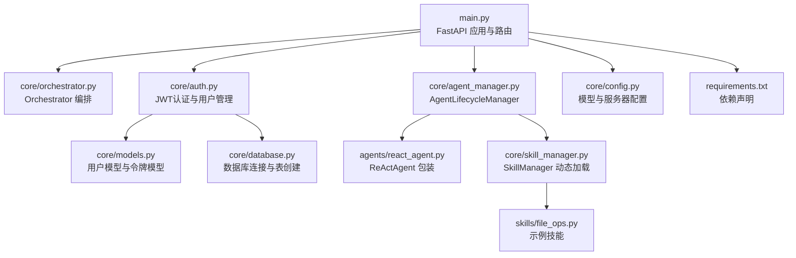
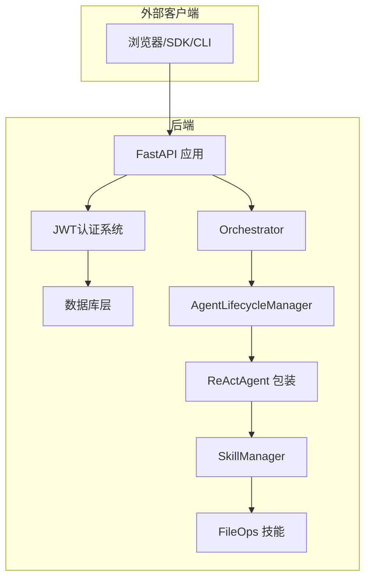
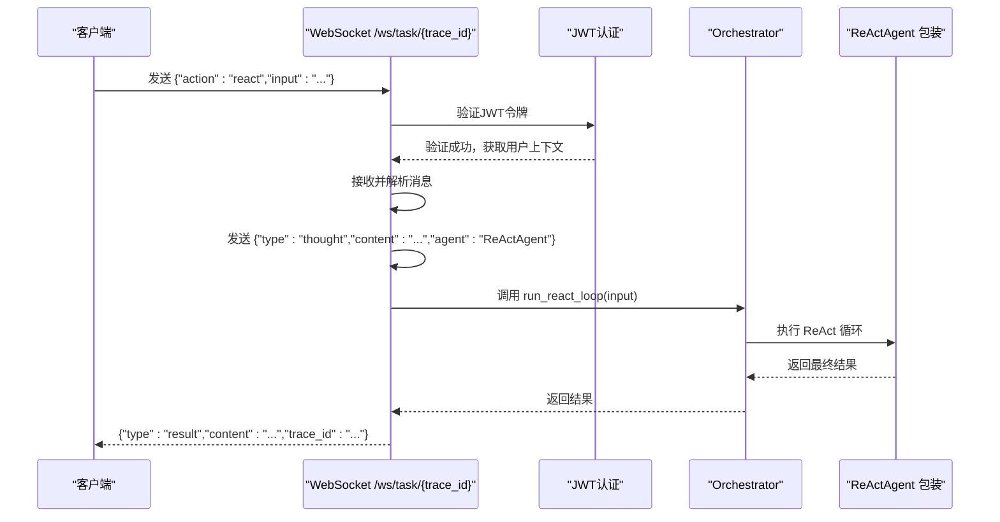
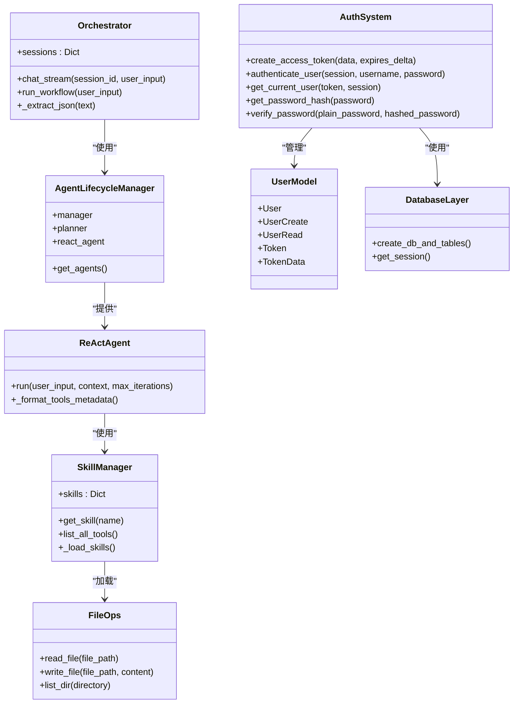

# API 接口参考

<cite>
**本文引用的文件**
- [main.py](file://localmanus-backend/main.py)
- [auth.py](file://localmanus-backend/core/auth.py)
- [models.py](file://localmanus-backend/core/models.py)
- [database.py](file://localmanus-backend/core/database.py)
- [orchestrator.py](file://localmanus-backend/core/orchestrator.py)
- [agent_manager.py](file://localmanus-backend/core/agent_manager.py)
- [react_agent.py](file://localmanus-backend/agents/react_agent.py)
- [skill_manager.py](file://localmanus-backend/core/skill_manager.py)
- [file_ops.py](file://localmanus-backend/skills/file_ops.py)
- [config.py](file://localmanus-backend/core/config.py)
- [requirements.txt](file://localmanus-backend/requirements.txt)
- [localmanus_architecture.md](file://localmanus_architecture.md)
- [localmanus_prd.md](file://localmanus_prd.md)
- [localmanus_skills_roadmap.md](file://localmanus_skills_roadmap.md)
</cite>

## 更新摘要
**所做更改**
- 新增JWT认证系统章节，包含用户注册、登录和令牌管理
- 更新所有受保护端点，添加认证要求说明
- 新增用户管理相关API端点文档
- 更新认证与授权机制，从无认证到JWT认证
- 新增密码哈希和安全存储机制
- 更新错误处理，包含认证相关的HTTP状态码

## 目录
1. [简介](#简介)
2. [JWT认证系统](#jwt认证系统)
3. [项目结构](#项目结构)
4. [核心组件](#核心组件)
5. [架构总览](#架构总览)
6. [详细组件分析](#详细组件分析)
7. [依赖关系分析](#依赖关系分析)
8. [性能考量](#性能考量)
9. [故障排查指南](#故障排查指南)
10. [结论](#结论)
11. [附录](#附录)

## 简介
本文件为 LocalManus 后端 API 的完整接口参考，覆盖 RESTful API 与 WebSocket 实时接口，包含：
- 所有端点的 HTTP 方法、URL 模式、请求/响应格式与参数说明
- WebSocket 连接与消息格式、事件类型与实时交互模式
- **新增**：JWT 认证系统，包括用户注册、登录、令牌管理和用户信息获取
- 错误与状态码说明
- 请求/响应示例与 SDK 使用建议
- API 版本管理与向后兼容性策略
- 性能与扩展性建议

LocalManus 当前版本为 0.1.0，后端基于 FastAPI，采用 AgentScope 的多智能体编排与可插拔技能系统，并通过 Firecracker 微虚拟机实现受控执行与安全隔离。

## JWT认证系统

LocalManus 采用基于 JWT 的认证系统，提供完整的用户生命周期管理：

### 认证流程概述
1. **用户注册**：创建新用户账户
2. **用户登录**：凭用户名密码获取访问令牌
3. **令牌验证**：所有受保护端点都需要有效的JWT令牌
4. **用户信息**：获取当前登录用户的详细信息

### 认证配置
- **算法**：HS256（对称密钥）
- **密钥**：从环境变量 `SECRET_KEY` 获取，开发环境默认值为 `"your-secret-key-here-for-local-dev"`
- **令牌有效期**：7天（10080分钟）
- **密码哈希**：使用 bcrypt 算法

### 密码安全
- 用户密码在数据库中以哈希形式存储
- 登录时进行密码验证
- 不存储明文密码

**章节来源**
- [auth.py](file://localmanus-backend/core/auth.py#L12-L15)
- [auth.py](file://localmanus-backend/core/auth.py#L20-L24)
- [models.py](file://localmanus-backend/core/models.py#L10-L12)

## 项目结构
后端采用模块化组织：
- 入口与路由：FastAPI 应用与路由定义
- **新增**：认证模块：JWT令牌管理、用户验证、密码哈希
- 核心编排：Orchestrator 负责会话、工作流与 ReAct 循环
- 智能体管理：AgentLifecycleManager 初始化并提供 Manager、Planner、ReActAgent
- 技能系统：SkillManager 动态加载技能，FileOps 示例技能
- 数据库：SQLModel ORM，SQLite 存储
- 配置：模型与服务器配置
- 依赖：FastAPI、Uvicorn、AgentScope、Pydantic、WebSockets、python-dotenv

**图表来源**
- [main.py](file://localmanus-backend/main.py#L1-L25)
- [auth.py](file://localmanus-backend/core/auth.py#L1-L10)
- [models.py](file://localmanus-backend/core/models.py#L1-L28)
- [database.py](file://localmanus-backend/core/database.py#L1-L17)
- [orchestrator.py](file://localmanus-backend/core/orchestrator.py#L1-L118)
- [agent_manager.py](file://localmanus-backend/core/agent_manager.py#L1-L31)
- [react_agent.py](file://localmanus-backend/agents/react_agent.py#L1-L107)
- [skill_manager.py](file://localmanus-backend/core/skill_manager.py#L1-L84)
- [file_ops.py](file://localmanus-backend/skills/file_ops.py#L1-L41)

**章节来源**
- [main.py](file://localmanus-backend/main.py#L1-L25)
- [auth.py](file://localmanus-backend/core/auth.py#L1-L10)
- [models.py](file://localmanus-backend/core/models.py#L1-L28)
- [database.py](file://localmanus-backend/core/database.py#L1-L17)
- [requirements.txt](file://localmanus-backend/requirements.txt#L1-L11)

## 核心组件
- FastAPI 应用与中间件：CORS 允许跨域，根路径返回版本信息
- **新增**：认证中间件：JWT令牌验证、用户上下文注入
- Orchestrator：会话管理、SSE 流式聊天、工作流编排、JSON 提取
- AgentLifecycleManager：初始化 AgentScope，提供 Manager、Planner、ReActAgent
- ReActAgent：基于 AgentScope 的 ReAct 包装，支持工具调用与上下文
- SkillManager：动态加载技能，提供工具元数据
- FileOps：文件操作示例技能
- **新增**：数据库层：SQLModel ORM，用户表与令牌存储

**章节来源**
- [main.py](file://localmanus-backend/main.py#L1-L25)
- [auth.py](file://localmanus-backend/core/auth.py#L1-L72)
- [models.py](file://localmanus-backend/core/models.py#L1-L28)
- [database.py](file://localmanus-backend/core/database.py#L1-L17)
- [orchestrator.py](file://localmanus-backend/core/orchestrator.py#L1-L118)
- [agent_manager.py](file://localmanus-backend/core/agent_manager.py#L1-L31)
- [react_agent.py](file://localmanus-backend/agents/react_agent.py#L1-L107)
- [skill_manager.py](file://localmanus-backend/core/skill_manager.py#L1-L84)
- [file_ops.py](file://localmanus-backend/skills/file_ops.py#L1-L41)

## 架构总览
LocalManus 后端通过 FastAPI 提供 REST 与 WebSocket 接口，内部通过 Orchestrator 调用 AgentLifecycleManager 初始化的智能体完成意图解析、规划与 ReAct 循环。认证系统通过 JWT 令牌验证确保API访问安全，技能通过 SkillManager 动态加载，示例技能 FileOps 提供文件读写与目录列举。

**图表来源**
- [main.py](file://localmanus-backend/main.py#L1-L25)
- [auth.py](file://localmanus-backend/core/auth.py#L1-L72)
- [database.py](file://localmanus-backend/core/database.py#L1-L17)
- [orchestrator.py](file://localmanus-backend/core/orchestrator.py#L1-L118)
- [agent_manager.py](file://localmanus-backend/core/agent_manager.py#L1-L31)
- [react_agent.py](file://localmanus-backend/agents/react_agent.py#L1-L107)
- [skill_manager.py](file://localmanus-backend/core/skill_manager.py#L1-L84)
- [file_ops.py](file://localmanus-backend/skills/file_ops.py#L1-L41)

## 详细组件分析

### 用户管理API

#### POST /api/register
- 描述：用户注册，创建新账户
- 方法：POST
- 请求体：JSON 对象
  - username: 字符串，必填，唯一用户名
  - password: 字符串，必填，密码（最少6字符）
  - email: 字符串，可选，用户邮箱
  - full_name: 字符串，可选，用户全名
- 响应：UserRead 对象，包含用户ID、用户名、邮箱、全名和创建时间
- 错误：
  - 400：用户名已被注册
  - 422：请求体参数校验失败
- 示例请求：
  - {"username":"john_doe","password":"secure_password","email":"john@example.com","full_name":"John Doe"}
- 示例响应：
  - {"id":1,"username":"john_doe","email":"john@example.com","full_name":"John Doe","created_at":"2024-01-01T12:00:00Z"}

**章节来源**
- [main.py](file://localmanus-backend/main.py#L39-L55)
- [models.py](file://localmanus-backend/core/models.py#L15-L16)
- [models.py](file://localmanus-backend/core/models.py#L18-L20)

#### POST /api/login
- 描述：用户登录，获取访问令牌
- 方法：POST
- 请求体：表单数据（OAuth2PasswordRequestForm）
  - username: 字符串，必填
  - password: 字符串，必填
- 响应：Token 对象，包含 access_token 和 token_type
- 错误：
  - 401：用户名或密码错误
  - 422：请求体参数校验失败
- 示例请求：
  - username=john_doe&password=secure_password
- 示例响应：
  - {"access_token":"eyJhbGciOiJIUzI1NiIsInR5cCI6IkpXVCJ9...","token_type":"bearer"}

**章节来源**
- [main.py](file://localmanus-backend/main.py#L57-L71)
- [models.py](file://localmanus-backend/core/models.py#L22-L24)

#### GET /api/me
- 描述：获取当前登录用户的详细信息
- 方法：GET
- 认证：需要有效的JWT访问令牌
- 响应：UserRead 对象
- 错误：
  - 401：认证失败或令牌无效
  - 404：用户不存在
- 示例响应：
  - {"id":1,"username":"john_doe","email":"john@example.com","full_name":"John Doe","created_at":"2024-01-01T12:00:00Z"}

**章节来源**
- [main.py](file://localmanus-backend/main.py#L73-L75)
- [auth.py](file://localmanus-backend/core/auth.py#L44-L71)

### REST API 端点

#### GET /
- 描述：健康检查与版本信息
- 请求：无
- 响应：包含状态与版本的对象
- 示例响应：
  - {"status":"LocalManus API is running","version":"0.1.0"}

**章节来源**
- [main.py](file://localmanus-backend/main.py#L77-L79)

#### GET /api/chat
- 描述：多轮对话的 Server-Sent Events 流
- 方法：GET
- 认证：需要有效的JWT访问令牌
- 查询参数：
  - input: 字符串，必填，用户输入
  - session_id: 字符串，默认 "default"
  - **新增**：access_token: 可选，查询参数形式的JWT令牌（SSE支持）
- 响应：SSE 流，事件类型与内容如下：
  - type=status：表示正在思考
  - type=content：最终回复内容
  - type=error：错误信息
  - [DONE]：流结束标记
- 会话限制：最多 10 轮（20 条消息）
- 用户上下文：自动注入当前用户信息到对话中
- 示例响应片段（SSE）：
  - data: {"type":"status","content":"Thinking..."}
  - data: {"type":"content","content":"..."}
  - data: [DONE]

**章节来源**
- [main.py](file://localmanus-backend/main.py#L81-L96)
- [auth.py](file://localmanus-backend/core/auth.py#L44-L71)
- [orchestrator.py](file://localmanus-backend/core/orchestrator.py#L13-L64)

#### POST /api/task
- 描述：同步任务规划（演示用途）
- 方法：POST
- 认证：需要有效的JWT访问令牌
- 请求体：JSON 对象
  - input: 字符串，必填
- 响应：规划结果对象（包含 trace_id 等元数据）
- 示例请求：
  - {"input":"帮我把 PDF 转成 Word"}
- 示例响应：
  - {"trace_id":"...","dag":{...}}

**章节来源**
- [main.py](file://localmanus-backend/main.py#L98-L105)
- [auth.py](file://localmanus-backend/core/auth.py#L44-L71)
- [orchestrator.py](file://localmanus-backend/core/orchestrator.py#L65-L80)

#### POST /api/react
- 描述：同步 ReAct 循环执行（演示用途）
- 方法：POST
- 认证：需要有效的JWT访问令牌
- 请求体：JSON 对象
  - input: 字符串，必填
- 响应：包含最终结果的对象
- 示例请求：
  - {"input":"读取 test.txt 并返回内容"}
- 示例响应：
  - {"result":"..."}

**章节来源**
- [main.py](file://localmanus-backend/main.py#L107-L114)
- [auth.py](file://localmanus-backend/core/auth.py#L44-L71)
- [orchestrator.py](file://localmanus-backend/core/orchestrator.py#L65-L80)
- [react_agent.py](file://localmanus-backend/agents/react_agent.py#L52-L107)

### WebSocket 接口

#### WS /ws/task/{trace_id}
- 描述：实时任务流，支持 ReAct 循环的交互式推进
- 路径参数：
  - trace_id: 字符串，必填，用于标识本次任务流
- 认证：需要有效的JWT访问令牌
- 支持的消息类型：
  - 客户端发送（JSON）：
    - action=start：开始任务（当前占位）
    - action=react：触发 ReAct 循环，携带 input 字段
  - 服务端发送（JSON）：
    - type=thought：中间推理/思考内容
    - type=result：最终结果，包含 trace_id
- 断开：客户端断开或异常时记录日志并结束
- 示例交互序列：
  - 客户端：{"action":"react","input":"读取 test.txt"}
  - 服务端：{"type":"thought","content":"...","agent":"ReActAgent"}
  - 服务端：{"type":"result","content":"...","trace_id":"..."}
- 注意：当前实现中，服务端在收到 action=react 时会先发送一条模拟的思考消息，再执行 ReAct 循环并返回结果。

**图表来源**
- [main.py](file://localmanus-backend/main.py#L116-L149)
- [auth.py](file://localmanus-backend/core/auth.py#L44-L71)
- [orchestrator.py](file://localmanus-backend/core/orchestrator.py#L65-L80)
- [react_agent.py](file://localmanus-backend/agents/react_agent.py#L52-L107)

**章节来源**
- [main.py](file://localmanus-backend/main.py#L116-L149)
- [auth.py](file://localmanus-backend/core/auth.py#L44-L71)

### 认证与授权

**更新** LocalManus 现已实现完整的JWT认证系统：

- **认证方式**：基于Bearer Token的JWT认证
- **令牌位置**：支持Authorization头或查询参数（SSE专用）
- **令牌验证**：HS256算法，密钥来自环境变量
- **令牌有效期**：7天
- **用户上下文**：所有受保护端点自动注入当前用户信息
- **密码安全**：bcrypt哈希存储，登录时验证
- **数据库集成**：SQLModel ORM，SQLite存储用户数据

**认证流程**：
1. 用户注册创建账户
2. 用户登录获取JWT访问令牌
3. 所有API请求携带Authorization: Bearer <token>
4. 服务器验证令牌有效性并提取用户信息
5. 根据用户身份执行相应操作

**章节来源**
- [auth.py](file://localmanus-backend/core/auth.py#L12-L15)
- [auth.py](file://localmanus-backend/core/auth.py#L17-L18)
- [auth.py](file://localmanus-backend/core/auth.py#L44-L71)
- [main.py](file://localmanus-backend/main.py#L82-L82)
- [main.py](file://localmanus-backend/main.py#L99-L99)
- [main.py](file://localmanus-backend/main.py#L108-L108)

### 错误与状态码

**更新** 新增认证相关的错误状态码：

- **认证错误**：
  - 401：未提供有效令牌、令牌无效或用户不存在
  - 403：权限不足（当前实现中主要为401）
- **业务逻辑错误**：
  - 400：用户名已被注册
  - 404：路径不存在
  - 422：请求体参数校验失败（Pydantic）
  - 500：内部异常
- **SSE错误**：当达到最大对话轮数时，返回 type=error 的 SSE 事件
- **WebSocket**：断开异常捕获并记录日志

**章节来源**
- [auth.py](file://localmanus-backend/core/auth.py#L51-L70)
- [main.py](file://localmanus-backend/main.py#L42-L43)
- [main.py](file://localmanus-backend/main.py#L89-L90)
- [orchestrator.py](file://localmanus-backend/core/orchestrator.py#L23-L25)

### 请求/响应示例

**更新** 所有受保护端点都需要认证令牌：

- **用户管理**：
  - POST /api/register：注册新用户
  - POST /api/login：获取访问令牌
  - GET /api/me：获取当前用户信息
- **聊天接口**：
  - GET /api/chat：需要Authorization头或access_token查询参数
  - POST /api/task：需要Authorization头
  - POST /api/react：需要Authorization头
- **WebSocket**：
  - WS /ws/task/{trace_id}：需要Authorization头

**章节来源**
- [main.py](file://localmanus-backend/main.py#L39-L75)
- [main.py](file://localmanus-backend/main.py#L81-L114)
- [main.py](file://localmanus-backend/main.py#L116-L149)

### SDK 使用指南与客户端实现建议

**更新** 认证相关的客户端实现建议：

- **认证流程**：
  1. 注册新用户：POST /api/register
  2. 用户登录：POST /api/login 获取access_token
  3. 设置请求头：Authorization: Bearer <access_token>
- **HTTP客户端**：
  - 使用axios/fetch时设置Authorization头
  - SSE客户端支持查询参数形式的令牌
- **WebSocket客户端**：
  - 连接：ws://host:port/ws/task/{trace_id}
  - 发送：{"action":"react","input":"..."}
  - 监听：type=thought 与 type=result
- **会话管理**：
  - 使用 session_id 区分不同对话历史
  - 处理令牌过期，自动刷新或重新登录
- **错误处理**：
  - 监听 type=error 的 SSE 事件与 WebSocket 异常
  - 处理401认证失败，引导用户重新登录

**章节来源**
- [main.py](file://localmanus-backend/main.py#L39-L75)
- [main.py](file://localmanus-backend/main.py#L81-L114)
- [auth.py](file://localmanus-backend/core/auth.py#L44-L71)

### API 版本管理与向后兼容性

- 当前版本：0.1.0
- **更新**：认证系统引入后，所有现有端点现在都是受保护的
- 建议：
  - URL 前缀版本化：/api/v1/...
  - 响应字段增加版本号
  - 逐步引入字段弃用策略与迁移指引
  - 保持行为稳定，避免破坏性变更

**章节来源**
- [main.py](file://localmanus-backend/main.py#L77-L79)

## 依赖关系分析

**图表来源**
- [orchestrator.py](file://localmanus-backend/core/orchestrator.py#L8-L118)
- [agent_manager.py](file://localmanus-backend/core/agent_manager.py#L7-L31)
- [react_agent.py](file://localmanus-backend/agents/react_agent.py#L32-L107)
- [skill_manager.py](file://localmanus-backend/core/skill_manager.py#L42-L84)
- [file_ops.py](file://localmanus-backend/skills/file_ops.py#L4-L41)
- [auth.py](file://localmanus-backend/core/auth.py#L1-L72)
- [models.py](file://localmanus-backend/core/models.py#L1-L28)
- [database.py](file://localmanus-backend/core/database.py#L1-L17)

**章节来源**
- [orchestrator.py](file://localmanus-backend/core/orchestrator.py#L1-L118)
- [agent_manager.py](file://localmanus-backend/core/agent_manager.py#L1-L31)
- [react_agent.py](file://localmanus-backend/agents/react_agent.py#L1-L107)
- [skill_manager.py](file://localmanus-backend/core/skill_manager.py#L1-L84)
- [file_ops.py](file://localmanus-backend/skills/file_ops.py#L1-L41)
- [auth.py](file://localmanus-backend/core/auth.py#L1-L72)
- [models.py](file://localmanus-backend/core/models.py#L1-L28)
- [database.py](file://localmanus-backend/core/database.py#L1-L17)

## 性能考量
- SSE 流式响应：适合长文本生成与渐进式展示
- WebSocket：低延迟交互，适合 ReAct 循环的实时反馈
- 技能动态加载：按需加载，减少冷启动时间
- 会话上限：限制历史长度，避免内存膨胀
- **新增**：JWT令牌缓存：避免重复解码，提升认证性能
- **新增**：密码哈希成本：bcrypt计算成本适中，平衡安全性与性能
- 建议：
  - 为 SSE 增加字符级流式输出（当前为简化实现）
  - 为 WebSocket 增加心跳与断线重连
  - 为 ReAct 循环设置超时与最大迭代次数
  - 使用连接池与异步 I/O 提升吞吐

## 故障排查指南

**更新** 新增认证相关的故障排查：

- **认证问题**：
  - 401错误：检查Authorization头格式，确认令牌未过期
  - 令牌无效：确认SECRET_KEY配置正确，算法匹配
  - 用户不存在：确认用户已在数据库中存在
- **SSE 无法接收**：确认浏览器支持 SSE，检查网络与跨域
- **WebSocket 断开**：检查服务端日志，确认客户端是否正确发送 action=react
- **ReAct 循环失败**：检查技能名称与参数格式，确认技能已加载
- **JSON 解析错误**：确认响应中 JSON 块格式，或回退为纯文本

**章节来源**
- [auth.py](file://localmanus-backend/core/auth.py#L51-L70)
- [main.py](file://localmanus-backend/main.py#L89-L90)
- [orchestrator.py](file://localmanus-backend/core/orchestrator.py#L82-L96)
- [react_agent.py](file://localmanus-backend/agents/react_agent.py#L76-L101)

## 结论
LocalManus 后端提供了简洁而强大的 API：REST 端点用于同步任务与流式对话，WebSocket 用于实时交互与 ReAct 循环。**新增的JWT认证系统**为所有API端点提供了安全保护，支持用户注册、登录和令牌管理。当前版本聚焦于演示与原型验证，后续可在认证授权、版本管理、性能优化与可观测性方面持续演进。

## 附录

### 技能系统与工具元数据
- SkillManager 动态加载技能，提供工具元数据列表
- FileOps 提供三个工具：read_file、write_file、list_dir
- ReActAgent 将工具元数据注入系统提示，支持工具调用

**章节来源**
- [skill_manager.py](file://localmanus-backend/core/skill_manager.py#L42-L84)
- [file_ops.py](file://localmanus-backend/skills/file_ops.py#L4-L41)
- [react_agent.py](file://localmanus-backend/agents/react_agent.py#L45-L50)

### 产品与架构背景
- 产品目标：通过多智能体与沙箱执行，将自然语言转化为复杂产出
- 架构要点：AgentScope 编排、Firecracker 沙箱、VSOCK 通信、Jailer 隔离
- 技术栈：FastAPI + WebSockets + AgentScope + Firecracker + JWT认证

**章节来源**
- [localmanus_prd.md](file://localmanus_prd.md#L1-L76)
- [localmanus_architecture.md](file://localmanus_architecture.md#L1-L137)
- [localmanus_skills_roadmap.md](file://localmanus_skills_roadmap.md#L1-L62)

### 环境配置
- **新增**：SECRET_KEY：JWT密钥，必须设置为强随机字符串
- OPENAI_API_KEY：OpenAI API密钥
- OPENAI_API_BASE：OpenAI API基础URL
- MODEL_NAME：使用的模型名称

**章节来源**
- [auth.py](file://localmanus-backend/core/auth.py#L13)
- [.env.example](file://localmanus-backend/.env.example#L1-L4)