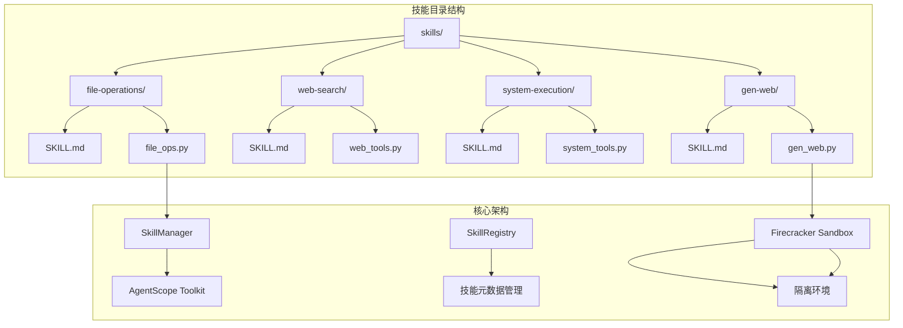
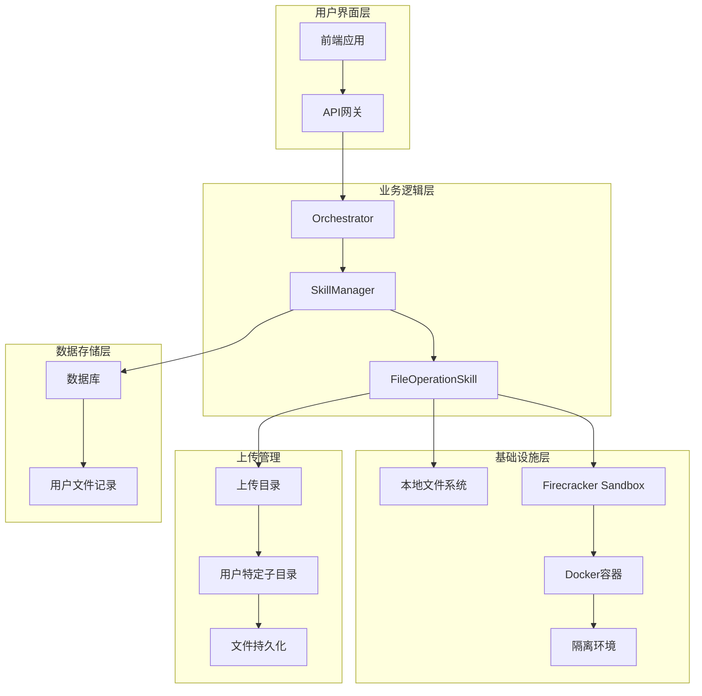
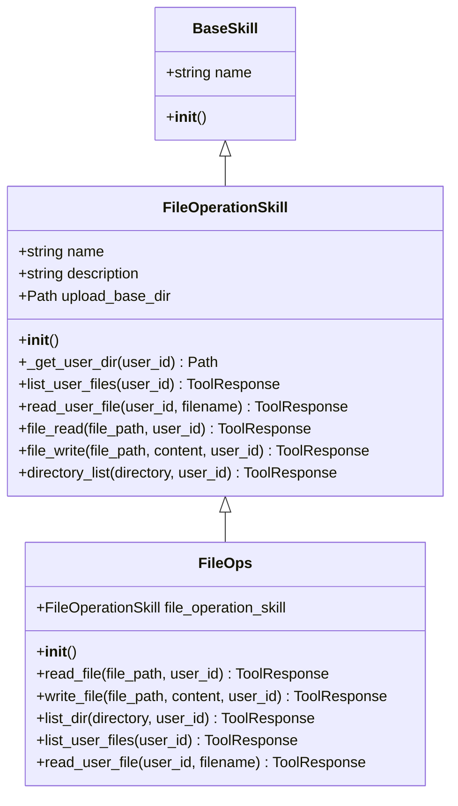
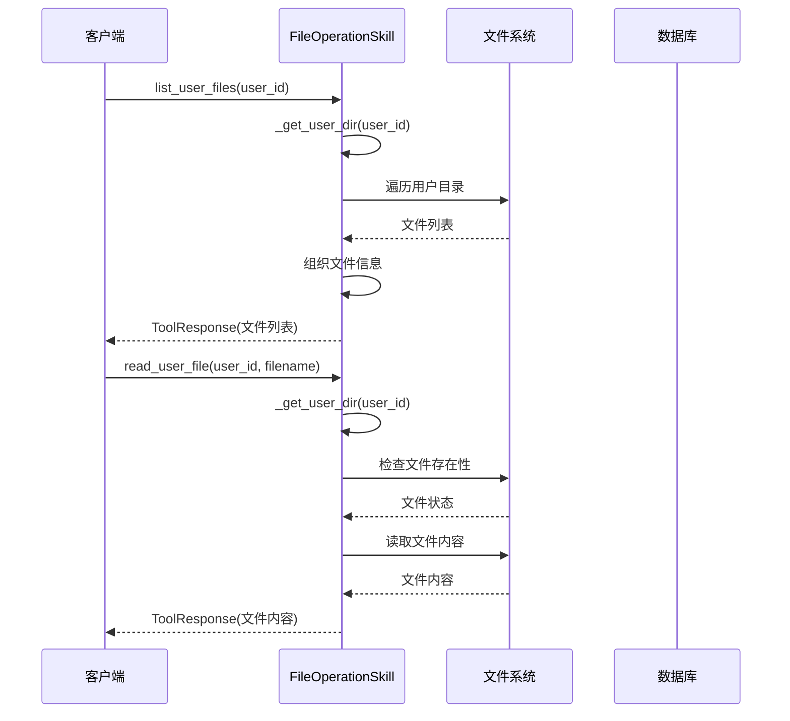
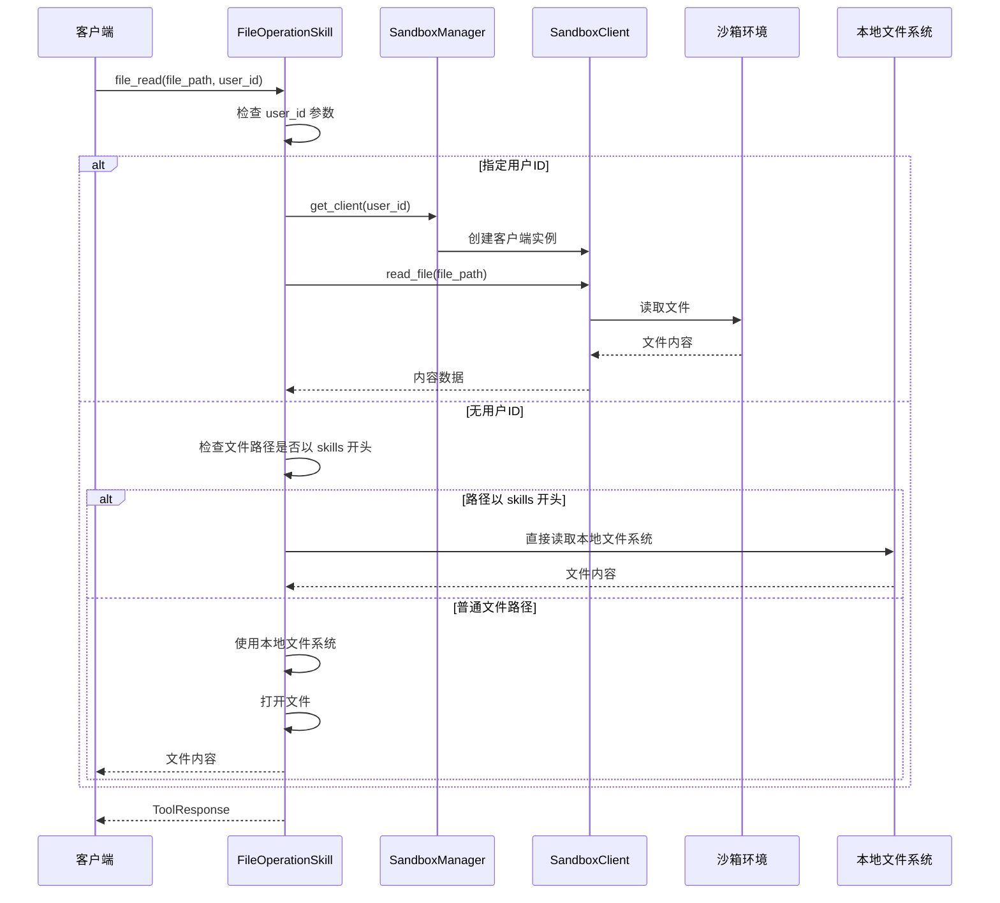
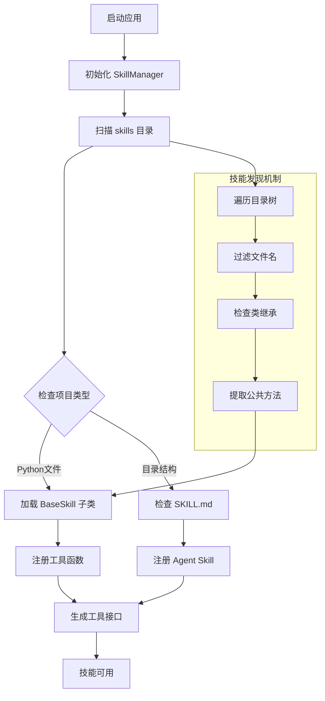
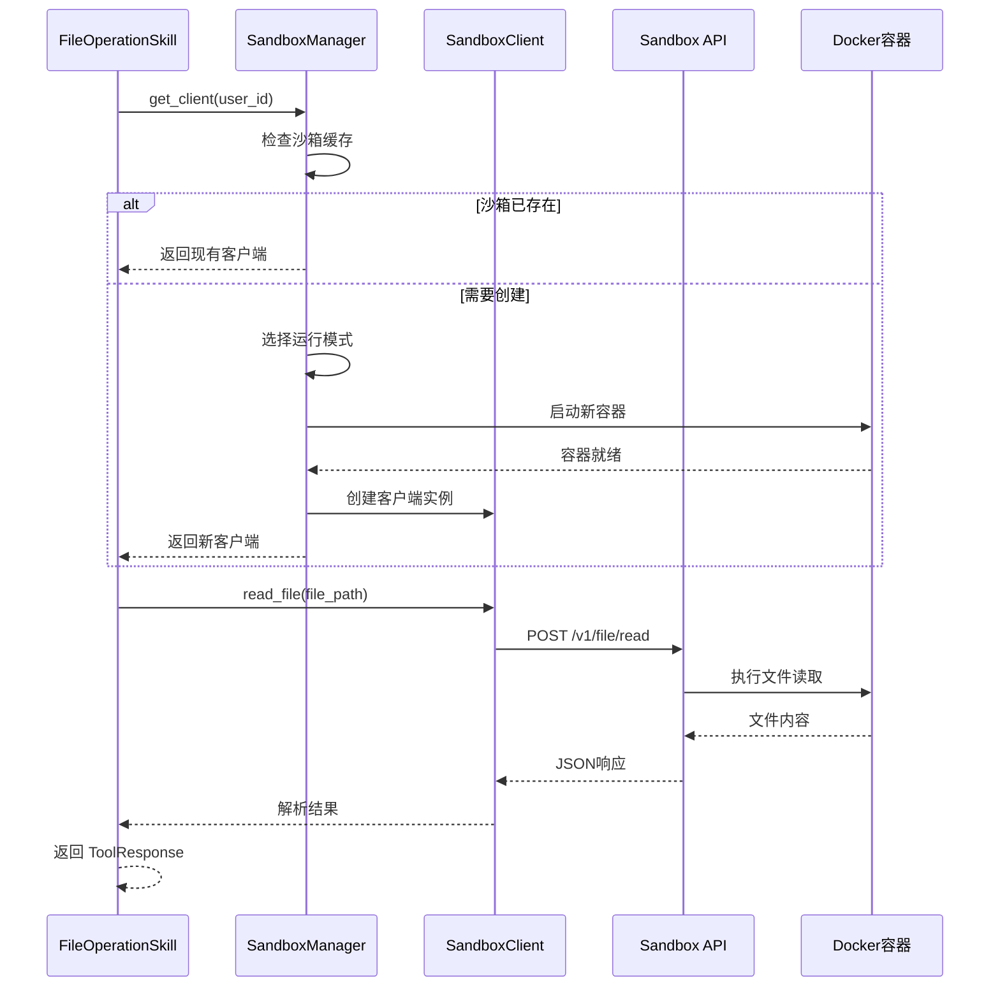
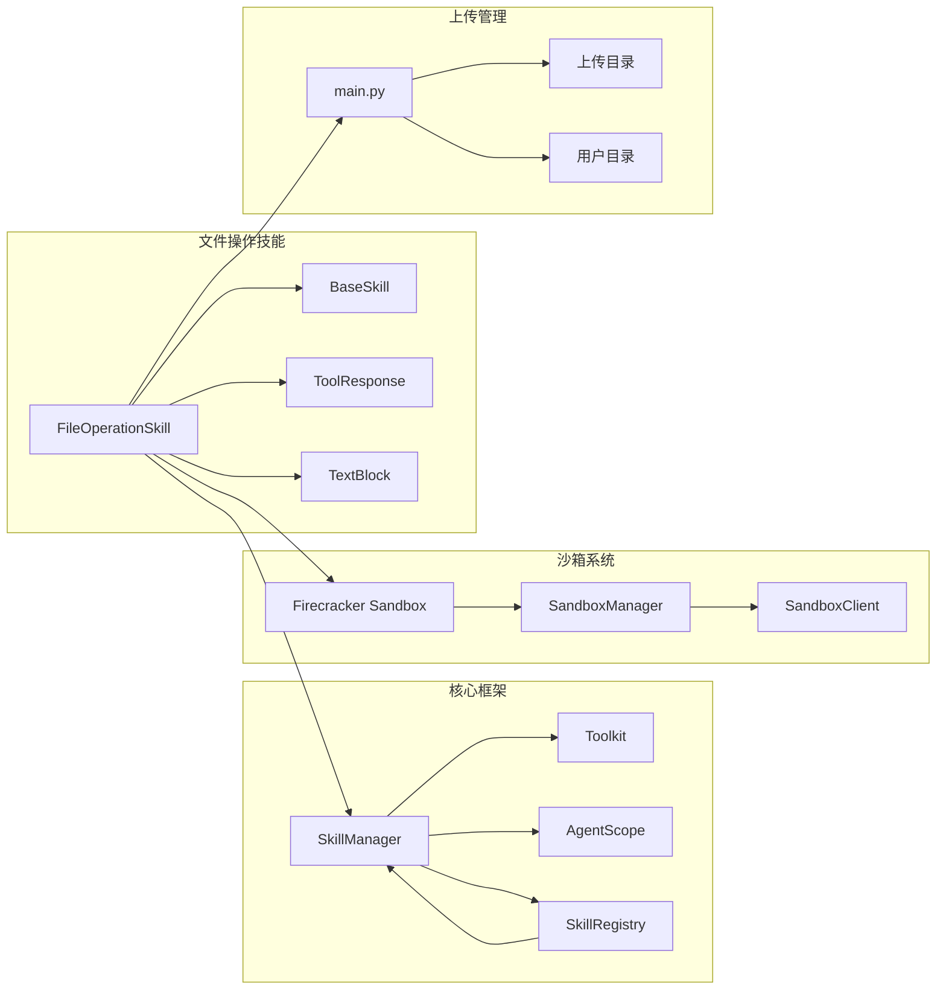
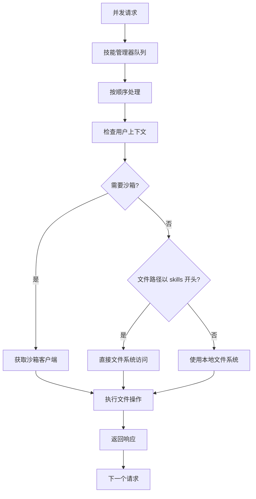

# 文件操作技能

<cite>
**本文档引用的文件**
- [file_ops.py](file://localmanus-backend/skills/file-operations/file_ops.py)
- [SKILL.md](file://localmanus-backend/skills/file-operations/SKILL.md)
- [skill_manager.py](file://localmanus-backend/core/skill_manager.py)
- [skill_registry.py](file://localmanus-backend/core/skill_registry.py)
- [firecracker_sandbox.py](file://localmanus-backend/core/firecracker_sandbox.py)
- [main.py](file://localmanus-backend/main.py)
- [README.md](file://localmanus-backend/skills/README.md)
</cite>

## 更新摘要
**变更内容**
- 新增直接文件系统访问能力，支持以 `skills` 前缀开头的文件直接读取
- 增强文件操作技能的灵活性和实用性
- 保持向后兼容性，同时提供更强大的文件访问功能

## 目录
1. [简介](#简介)
2. [项目结构](#项目结构)
3. [核心组件](#核心组件)
4. [架构概览](#架构概览)
5. [详细组件分析](#详细组件分析)
6. [依赖关系分析](#依赖关系分析)
7. [性能考虑](#性能考虑)
8. [故障排除指南](#故障排除指南)
9. [结论](#结论)

## 简介

文件操作技能是 LocalManus 系统中的一个核心功能模块，专门用于提供安全、可靠的文件系统操作能力。该技能支持在用户沙箱环境中进行文件读取、写入和目录管理操作，同时具备上传文件管理和本地文件系统访问的双重能力。

**重要更新**：该技能现已获得直接文件系统访问能力，特别支持以 `skills` 前缀开头的文件直接读取，为 AI 代理提供了更灵活的文件访问选项。

该技能遵循 Claude 的标准工具协议，通过 AgentScope 框架实现，为 AI 代理提供了标准化的文件操作接口。无论是处理用户上传的文件，还是在隔离的沙箱环境中执行文件操作，该技能都提供了统一的抽象层。

## 项目结构

LocalManus 项目采用模块化架构设计，文件操作技能位于专门的技能目录中，与其他技能保持一致的组织结构。

**图表来源**
- [file_ops.py](file://localmanus-backend/skills/file-operations/file_ops.py#L1-L199)
- [skill_manager.py](file://localmanus-backend/core/skill_manager.py#L1-L234)
- [skill_registry.py](file://localmanus-backend/core/skill_registry.py#L1-L156)

**章节来源**
- [file_ops.py](file://localmanus-backend/skills/file-operations/file_ops.py#L1-L199)
- [README.md](file://localmanus-backend/skills/README.md#L1-L122)

## 核心组件

文件操作技能由两个主要类组成：`FileOperationSkill` 和 `FileOps`（兼容性类）。这两个类提供了完整的文件操作功能，包括文件读取、写入、目录列表等基础操作。

### 主要功能特性

1. **多环境支持**：同时支持沙箱环境和本地文件系统操作
2. **用户隔离**：每个用户拥有独立的文件操作空间
3. **安全控制**：路径验证和访问权限控制
4. **错误处理**：完善的异常处理和错误消息反馈
5. **编码支持**：自动检测和处理文本文件编码
6. **直接文件系统访问**：新增支持以 `skills` 前缀开头的文件直接读取

**章节来源**
- [file_ops.py](file://localmanus-backend/skills/file-operations/file_ops.py#L10-L199)
- [SKILL.md](file://localmanus-backend/skills/file-operations/SKILL.md#L1-L28)

## 架构概览

文件操作技能的架构设计体现了现代微服务和容器化应用的最佳实践。系统通过分层架构实现了功能分离，确保了代码的可维护性和扩展性。

**图表来源**
- [main.py](file://localmanus-backend/main.py#L1-L519)
- [skill_manager.py](file://localmanus-backend/core/skill_manager.py#L1-L234)
- [firecracker_sandbox.py](file://localmanus-backend/core/firecracker_sandbox.py#L1-L312)

## 详细组件分析

### FileOperationSkill 类分析

`FileOperationSkill` 是文件操作技能的核心实现类，提供了完整的文件系统操作功能。该类继承自 `BaseSkill` 基类，并实现了多种文件操作方法。

#### 类关系图

**图表来源**
- [file_ops.py](file://localmanus-backend/skills/file-operations/file_ops.py#L10-L199)

#### 核心方法详解

##### 用户文件管理方法

`list_user_files()` 和 `read_user_file()` 方法专门用于管理用户上传的文件。这些方法提供了用户特定的文件操作能力，确保不同用户之间的文件隔离。

**图表来源**
- [file_ops.py](file://localmanus-backend/skills/file-operations/file_ops.py#L25-L86)

##### 沙箱集成方法

`file_read()`、`file_write()` 和 `directory_list()` 方法提供了与 Firecracker 沙箱的深度集成。这些方法允许在隔离的环境中执行文件操作，确保安全性。

**重要更新**：新增直接文件系统访问能力

**图表来源**
- [file_ops.py](file://localmanus-backend/skills/file-operations/file_ops.py#L88-L171)
- [firecracker_sandbox.py](file://localmanus-backend/core/firecracker_sandbox.py#L294-L312)

**章节来源**
- [file_ops.py](file://localmanus-backend/skills/file-operations/file_ops.py#L10-L199)

### 技能管理器集成

文件操作技能通过 `SkillManager` 实现自动注册和管理。该管理器负责扫描技能目录，加载 Python 模块，并将技能方法注册到 AgentScope 的工具包中。

#### 加载流程图

**图表来源**
- [skill_manager.py](file://localmanus-backend/core/skill_manager.py#L107-L167)

**章节来源**
- [skill_manager.py](file://localmanus-backend/core/skill_manager.py#L1-L234)

### 沙箱管理集成

文件操作技能与 Firecracker 沙箱管理系统深度集成，提供了安全的隔离执行环境。沙箱管理器支持本地模式和在线模式两种运行方式。

#### 沙箱交互流程

**图表来源**
- [firecracker_sandbox.py](file://localmanus-backend/core/firecracker_sandbox.py#L253-L257)

**章节来源**
- [firecracker_sandbox.py](file://localmanus-backend/core/firecracker_sandbox.py#L1-L312)

## 依赖关系分析

文件操作技能的依赖关系相对简单且清晰，主要依赖于核心框架组件和外部库。

### 外部依赖

| 依赖项 | 版本 | 用途 |
|--------|------|------|
| agentscope | 最新版本 | 工具包和消息协议 |
| pathlib | 标准库 | 路径操作 |
| typing | 标准库 | 类型提示 |
| os | 标准库 | 系统操作 |

### 内部依赖关系

**图表来源**
- [file_ops.py](file://localmanus-backend/skills/file-operations/file_ops.py#L1-L7)
- [skill_manager.py](file://localmanus-backend/core/skill_manager.py#L1-L9)

**章节来源**
- [file_ops.py](file://localmanus-backend/skills/file-operations/file_ops.py#L1-L7)
- [skill_registry.py](file://localmanus-backend/core/skill_registry.py#L1-L156)

## 性能考虑

文件操作技能在设计时充分考虑了性能优化和资源管理。以下是一些关键的性能考量因素：

### 文件操作优化

1. **异步处理**：所有文件操作都是同步的，但在技能管理器层面支持异步执行
2. **内存管理**：大文件读取时采用流式处理，避免内存溢出
3. **缓存策略**：沙箱客户端实例会被缓存，减少重复创建成本
4. **直接访问优化**：新增的直接文件系统访问避免了不必要的沙箱通信开销

### 并发处理

### 资源限制

- **文件大小限制**：根据系统配置限制单个文件大小
- **并发连接数**：限制同时活跃的沙箱连接数量
- **内存使用**：监控文件操作过程中的内存使用情况
- **直接访问安全**：对 `skills` 前缀路径进行额外的安全检查

## 故障排除指南

### 常见问题及解决方案

#### 文件访问权限问题

**问题描述**：用户无法访问指定文件或目录

**可能原因**：
1. 文件路径不在用户允许范围内
2. 文件已被删除或移动
3. 权限不足

**解决步骤**：
1. 验证文件路径是否在用户目录内
2. 检查文件是否存在
3. 确认用户具有适当的文件访问权限

#### 沙箱连接失败

**问题描述**：无法连接到沙箱环境

**可能原因**：
1. 沙箱服务未启动
2. 网络连接问题
3. 认证失败

**解决步骤**：
1. 检查沙箱服务状态
2. 验证网络连接
3. 重新启动沙箱服务

#### 编码问题

**问题描述**：文件读取时出现编码错误

**可能原因**：
1. 文件不是 UTF-8 编码
2. 文件包含二进制内容

**解决步骤**：
1. 检查文件的实际编码格式
2. 对于二进制文件，使用适当的处理方式
3. 提供文件大小信息而非内容显示

#### 直接文件系统访问问题

**问题描述**：使用 `skills` 前缀访问文件失败

**可能原因**：
1. 文件路径不在允许的范围内的 `skills` 目录下
2. 文件权限不足
3. 文件不存在

**解决步骤**：
1. 验证文件路径是否以正确的 `skills` 前缀开头
2. 检查文件是否存在于本地文件系统中
3. 确认具有适当的文件访问权限
4. 验证文件路径的相对性，确保不会越权访问

**章节来源**
- [file_ops.py](file://localmanus-backend/skills/file-operations/file_ops.py#L51-L86)
- [firecracker_sandbox.py](file://localmanus-backend/core/firecracker_sandbox.py#L145-L154)

## 结论

文件操作技能作为 LocalManus 系统的重要组成部分，成功地实现了文件系统操作的安全性、可靠性和易用性。通过采用模块化设计和沙箱隔离技术，该技能为 AI 代理提供了强大的文件操作能力。

**重要更新**：新增的直接文件系统访问能力显著增强了技能的灵活性和实用性，特别是对以 `skills` 前缀开头的文件提供了直接读取支持。这一功能在保持安全性的前提下，为 AI 代理提供了更便捷的文件访问方式。

### 主要优势

1. **安全性**：通过沙箱环境和路径验证确保文件操作安全
2. **灵活性**：支持多种运行模式和文件系统环境，包括直接文件系统访问
3. **可扩展性**：基于 AgentScope 框架，易于添加新的文件操作功能
4. **用户友好**：提供清晰的错误消息和状态反馈
5. **向后兼容**：保持与现有系统的完全兼容性

### 未来发展方向

1. **性能优化**：进一步优化大文件处理和并发性能
2. **功能增强**：添加更多高级文件操作功能
3. **监控改进**：增强文件操作的监控和日志记录
4. **安全性加强**：实施更严格的安全策略和访问控制
5. **直接访问扩展**：考虑支持更多前缀类型的直接文件访问

该技能为 LocalManus 系统奠定了坚实的基础，为后续的功能扩展和系统集成提供了良好的架构支撑。