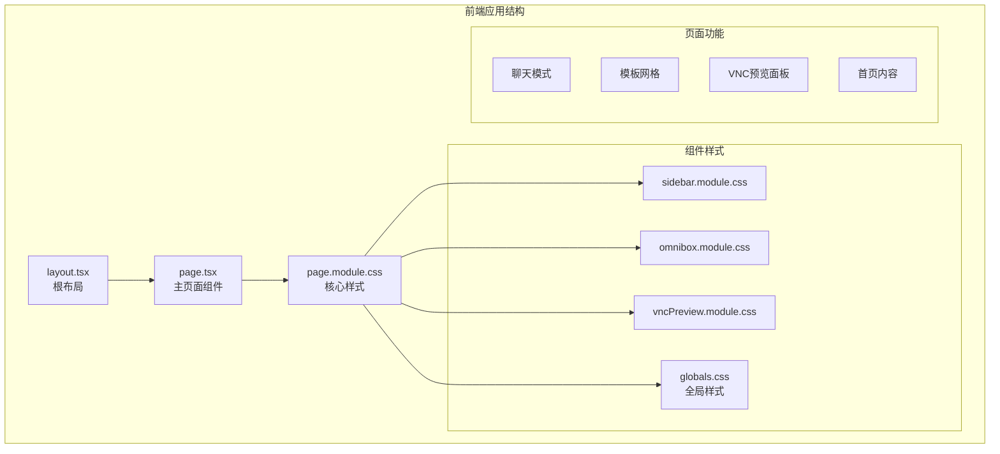
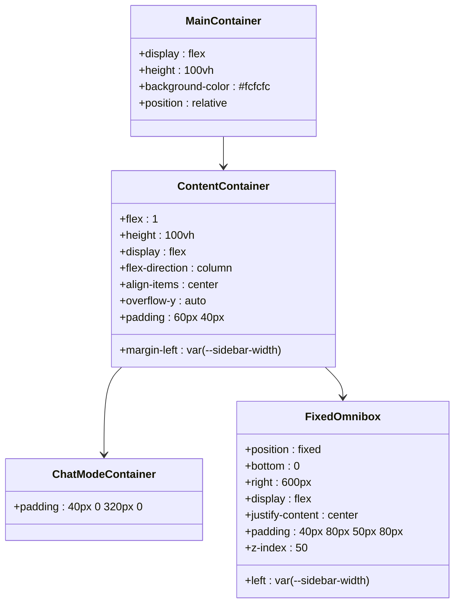
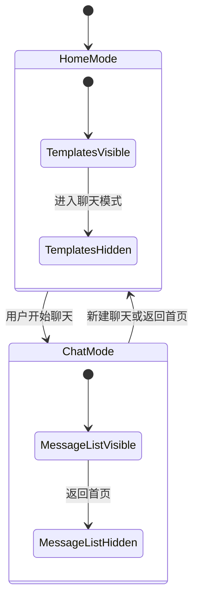
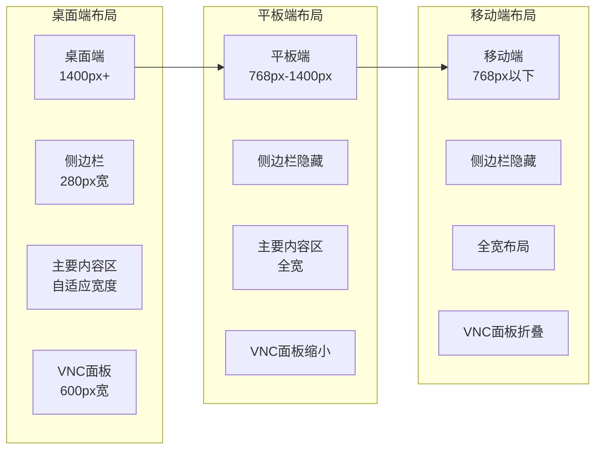
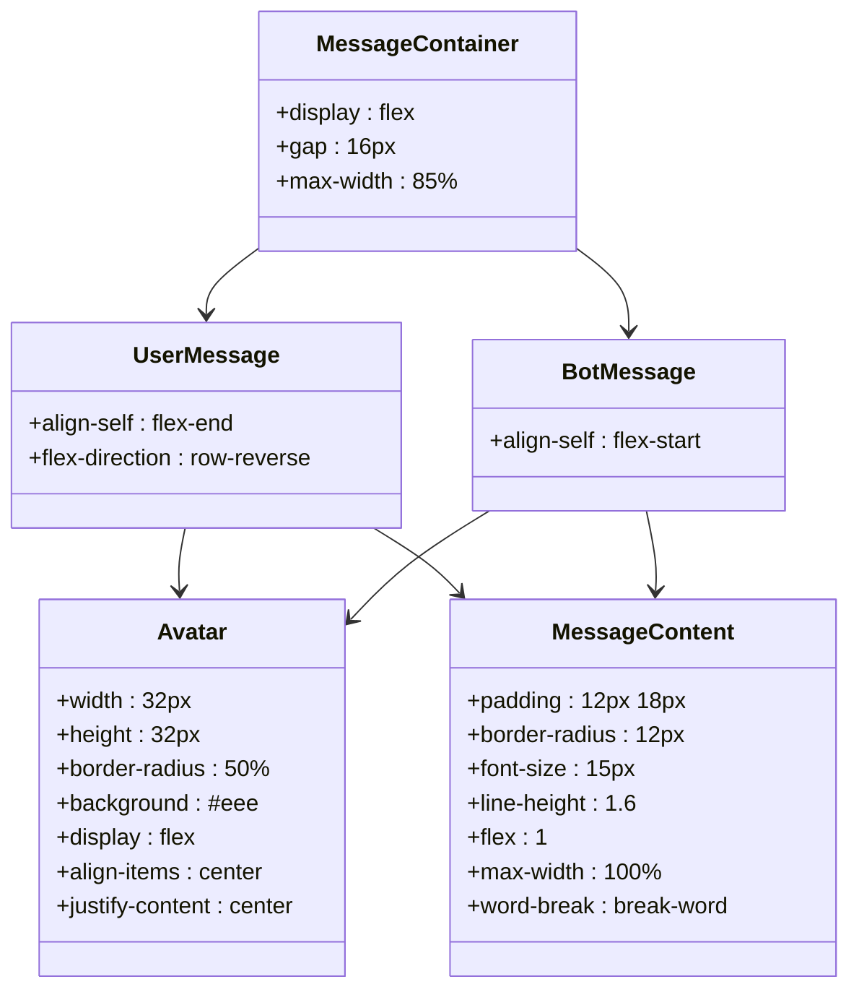
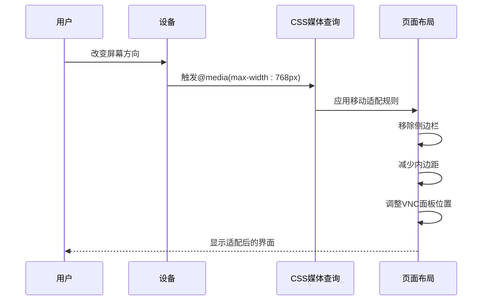
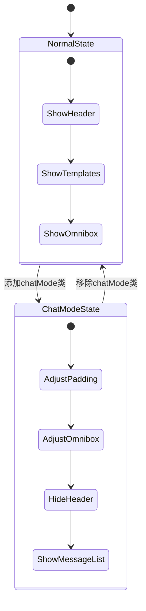

# Page.module.css 组件文档

<cite>
**本文档中引用的文件**
- [page.module.css](file://localmanus-ui/app/page.module.css)
- [page.tsx](file://localmanus-ui/app/page.tsx)
- [layout.tsx](file://localmanus-ui/app/layout.tsx)
- [globals.css](file://localmanus-ui/app/globals.css)
- [sidebar.module.css](file://localmanus-ui/app/components/sidebar.module.css)
- [omnibox.module.css](file://localmanus-ui/app/components/omnibox.module.css)
- [vncPreview.module.css](file://localmanus-ui/app/components/vncPreview.module.css)
</cite>

## 目录
1. [简介](#简介)
2. [项目结构概览](#项目结构概览)
3. [核心组件分析](#核心组件分析)
4. [架构设计](#架构设计)
5. [详细样式分析](#详细样式分析)
6. [响应式设计](#响应式设计)
7. [交互状态管理](#交互状态管理)
8. [性能优化考虑](#性能优化考虑)
9. [最佳实践建议](#最佳实践建议)
10. [故障排除指南](#故障排除指南)

## 简介

Page.module.css 是 LocalManus AI 平台的核心样式文件，负责管理主页面的布局、视觉效果和用户交互体验。该文件采用 CSS Modules 技术，提供了完整的现代化 Web 应用界面解决方案，包括聊天模式切换、VNC 预览面板集成、模板展示系统等核心功能。

## 项目结构概览

LocalManus 项目采用 Next.js 框架构建，整体架构分为前端 UI 层和后端服务层。Page.module.css 位于前端应用的核心位置，与页面逻辑紧密配合，实现了高度动态化的用户界面。



**图表来源**
- [layout.tsx](file://localmanus-ui/app/layout.tsx#L1-L20)
- [page.tsx](file://localmanus-ui/app/page.tsx#L1-L297)
- [page.module.css](file://localmanus-ui/app/page.module.css#L1-L419)

**章节来源**
- [layout.tsx](file://localmanus-ui/app/layout.tsx#L1-L20)
- [page.tsx](file://localmanus-ui/app/page.tsx#L1-L297)

## 核心组件分析

### 主要容器结构

Page.module.css 定义了完整的页面布局结构，通过多个相互关联的容器实现复杂的视觉层次：



**图表来源**
- [page.module.css](file://localmanus-ui/app/page.module.css#L1-L100)

### 聊天模式与模板系统的切换机制

该样式文件实现了两种主要视图模式之间的平滑过渡：

- **首页模式（Home Mode）**：展示模板选择、功能导航和静态内容
- **聊天模式（Chat Mode）**：提供实时对话界面，支持消息流显示



**图表来源**
- [page.module.css](file://localmanus-ui/app/page.module.css#L34-L115)
- [page.tsx](file://localmanus-ui/app/page.tsx#L14-L157)

**章节来源**
- [page.module.css](file://localmanus-ui/app/page.module.css#L1-L419)
- [page.tsx](file://localmanus-ui/app/page.tsx#L14-L297)

## 架构设计

### 响应式布局架构

Page.module.css 采用了多层次的响应式设计策略，确保在不同设备上都能提供优质的用户体验：



**图表来源**
- [page.module.css](file://localmanus-ui/app/page.module.css#L414-L419)
- [vncPreview.module.css](file://localmanus-ui/app/components/vncPreview.module.css#L300-L323)

### 动画与过渡效果

该样式文件大量使用 CSS 动画和过渡效果来提升用户体验：

- **缓动函数**：使用 `cubic-bezier(0.4, 0, 0.2, 1)` 实现自然的动画曲线
- **渐变背景**：顶部遮罩效果提供视觉层次感
- **平滑滚动**：`scroll-behavior: smooth` 确保滚动体验流畅

**章节来源**
- [page.module.css](file://localmanus-ui/app/page.module.css#L26-L31)
- [page.module.css](file://localmanus-ui/app/page.module.css#L414-L419)

## 详细样式分析

### 色彩系统与主题变量

Page.module.css 依赖于全局 CSS 变量定义的颜色系统：

```mermaid
graph TB
subgraph "色彩系统"
Accent[--accent: #0070f3<br/>主色调]
AccentSoft[--accent-soft: rgba(0,112,243,0.1)<br/>柔和主色]
Background[--background: #ffffff<br/>背景色]
Foreground[--foreground: #1a1a1a<br/>前景色]
GlassBg[--glass-bg: rgba(255,255,255,0.65)<br/>玻璃背景]
GlassBorder[--glass-border: rgba(255,255,255,0.3)<br/>玻璃边框]
end
subgraph "组件色彩"
UserMessage[用户消息: #f0f0f0<br/>圆角: 18px]
BotMessage[助手消息: 白色<br/>边框: #eee<br/>圆角: 18px 18px 18px 4px]
TemplateCard[模板卡片: #f5f5f5<br/>边框: #eeeeee<br/>圆角: 12px]
end
```

**图表来源**
- [globals.css](file://localmanus-ui/app/globals.css#L7-L18)
- [page.module.css](file://localmanus-ui/app/page.module.css#L242-L254)

### 消息显示系统

聊天界面的消息显示采用了精心设计的视觉层次：



**图表来源**
- [page.module.css](file://localmanus-ui/app/page.module.css#L205-L254)

### 模板展示系统

模板网格采用了响应式设计，支持多种屏幕尺寸：

```mermaid
flowchart TD
TemplateGrid[模板网格] --> AutoFill[自动填充]
AutoFill --> MinMax[minmax(220px, 1fr)]
MinMax --> Gap[20px间距]
TemplateCard[模板卡片] --> Thumb[缩略图区域]
TemplateCard --> Info[信息区域]
Thumb --> AspectRatio[16:10宽高比]
Thumb --> Border[1px边框]
Thumb --> BorderRadius[12px圆角]
Thumb --> Overflow[溢出隐藏]
Info --> Name[模板名称]
Info --> Meta[元数据]
Meta --> Tag[标签]
Meta --> Usage[使用次数]
```

**图表来源**
- [page.module.css](file://localmanus-ui/app/page.module.css#L309-L325)
- [page.module.css](file://localmanus-ui/app/page.module.css#L316-L326)

**章节来源**
- [page.module.css](file://localmanus-ui/app/page.module.css#L168-L413)

## 响应式设计

### 移动端适配策略

Page.module.css 实现了完整的移动端适配方案：



**图表来源**
- [page.module.css](file://localmanus-ui/app/page.module.css#L414-L419)

### VNC 预览面板的响应式行为

VNC 预览面板根据屏幕尺寸自动调整其显示方式：

- **桌面端**：默认展开，宽度 600px
- **平板端**：最大宽度限制为 50-45vw
- **移动端**：完全折叠，仅保留切换按钮

**章节来源**
- [page.module.css](file://localmanus-ui/app/page.module.css#L38-L46)
- [vncPreview.module.css](file://localmanus-ui/app/components/vncPreview.module.css#L300-L323)

## 交互状态管理

### 聊天模式的状态切换

Page.module.css 通过 CSS 类名切换实现复杂的交互状态管理：



**图表来源**
- [page.module.css](file://localmanus-ui/app/page.module.css#L34-L115)
- [page.tsx](file://localmanus-ui/app/page.tsx#L174-L176)

### 动态布局调整

当 VNC 预览面板激活时，页面布局会自动调整以适应新的空间需求：

- **内容区域**：向右扩展，为 VNC 面板留出空间
- **固定工具栏**：相应调整右侧间距
- **模板区域**：保持相对位置不变

**章节来源**
- [page.module.css](file://localmanus-ui/app/page.module.css#L38-L86)

## 性能优化考虑

### CSS Modules 优势

Page.module.css 使用 CSS Modules 技术带来了多项性能优势：

- **作用域隔离**：避免样式冲突，减少重绘
- **按需加载**：组件级样式，只加载必要的 CSS
- **构建优化**：编译时优化，移除未使用的样式

### 渐进式渲染

页面采用了渐进式渲染策略：

- **骨架屏效果**：模板加载前的占位符
- **延迟加载**：非关键资源的延迟加载
- **内存管理**：及时清理不再使用的样式

### 动画性能

所有动画都经过性能优化：

- **硬件加速**：使用 transform 和 opacity 属性
- **节流控制**：避免频繁的布局计算
- **缓存策略**：复用已计算的样式值

## 最佳实践建议

### 样式组织原则

1. **模块化设计**：每个组件都有独立的样式文件
2. **语义化命名**：使用描述性的类名
3. **变量统一管理**：集中管理颜色、字体等变量
4. **响应式优先**：移动端优先的设计理念

### 性能优化建议

1. **避免深度嵌套**：保持 CSS 选择器简洁
2. **使用 CSS 自定义属性**：便于主题切换
3. **合理使用 Flexbox**：替代复杂的定位
4. **动画优化**：使用 transform 替代改变布局属性

### 可维护性考虑

1. **注释规范**：为复杂样式添加注释说明
2. **命名约定**：统一的命名规范
3. **版本控制**：样式变更的版本追踪
4. **测试覆盖**：关键样式的回归测试

## 故障排除指南

### 常见问题及解决方案

#### 样式冲突问题

**症状**：样式意外被覆盖或失效
**解决方案**：
- 检查 CSS 优先级
- 避免使用 !important
- 使用更具体的选择器

#### 响应式布局问题

**症状**：移动端显示异常
**解决方案**：
- 检查媒体查询断点
- 验证 viewport 设置
- 测试不同设备尺寸

#### 动画性能问题

**症状**：动画卡顿或掉帧
**解决方案**：
- 使用 transform 替代布局属性
- 启用硬件加速
- 减少重绘操作

### 调试技巧

1. **浏览器开发者工具**：检查元素样式和计算值
2. **CSS Grid/Flexbox 辅助线**：可视化布局结构
3. **性能面板**：监控渲染性能
4. **网络面板**：检查 CSS 加载情况

**章节来源**
- [page.module.css](file://localmanus-ui/app/page.module.css#L1-L419)