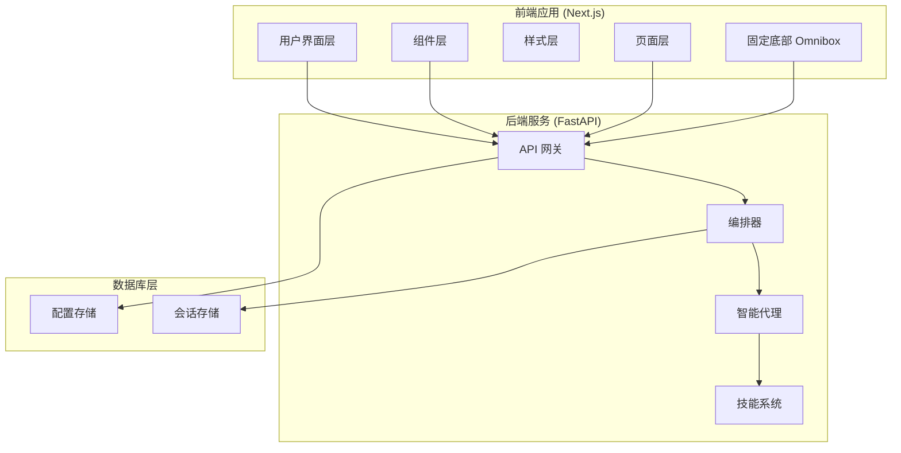
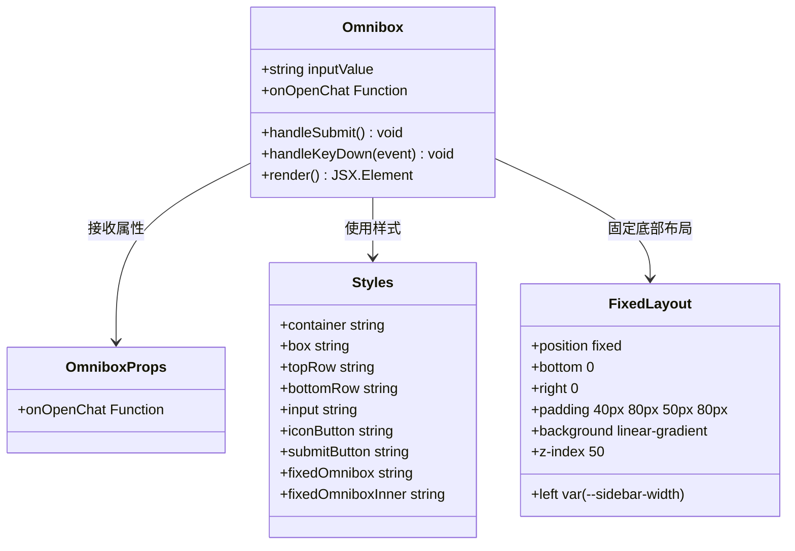
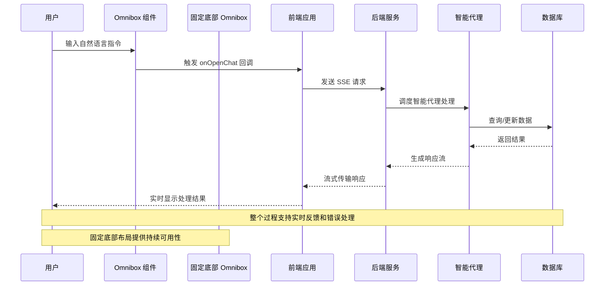
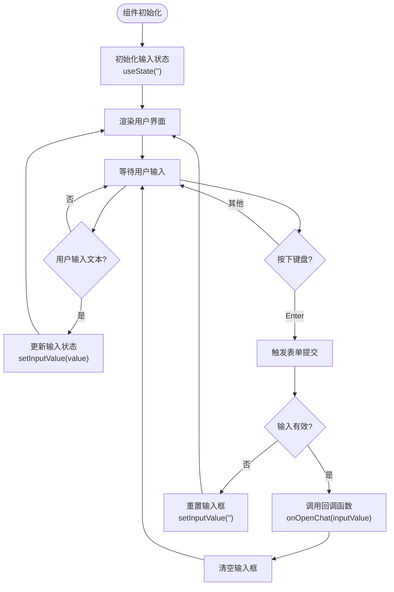
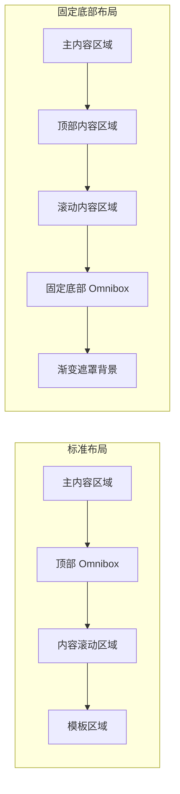
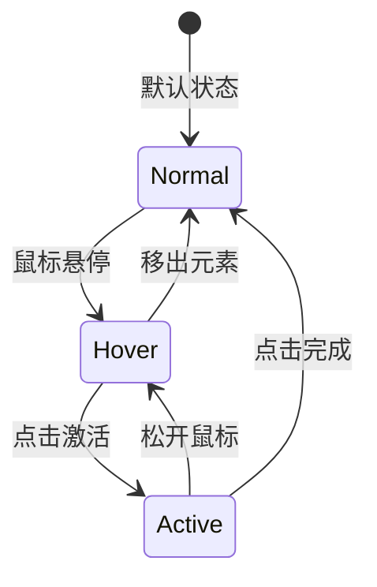
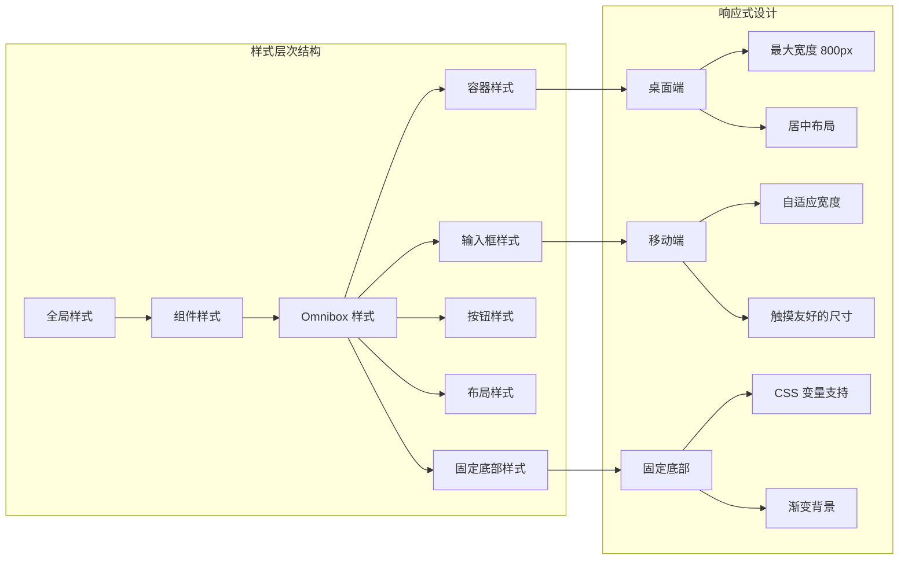
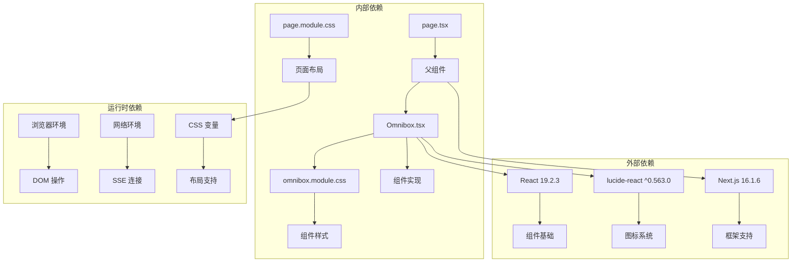

# Omnibox 指挥中心组件

<cite>
**本文档引用的文件**
- [Omnibox.tsx](file://localmanus-ui/app/components/Omnibox.tsx)
- [omnibox.module.css](file://localmanus-ui/app/components/omnibox.module.css)
- [page.tsx](file://localmanus-ui/app/page.tsx)
- [layout.tsx](file://localmanus-ui/app/layout.tsx)
- [page.module.css](file://localmanus-ui/app/page.module.css)
- [package.json](file://localmanus-ui/package.json)
- [main.py](file://localmanus-backend/main.py)
- [orchestrator.py](file://localmanus-backend/core/orchestrator.py)
</cite>

## 更新摘要
**所做更改**
- 更新了固定底部布局的实现和样式系统
- 新增了玻璃模糊效果的详细说明
- 改进了悬停状态和交互反馈机制
- 增强了用户体验设计原则的描述
- 更新了组件架构图以反映新的布局结构

## 目录
1. [简介](#简介)
2. [项目结构](#项目结构)
3. [核心组件](#核心组件)
4. [架构概览](#架构概览)
5. [详细组件分析](#详细组件分析)
6. [依赖关系分析](#依赖关系分析)
7. [性能考虑](#性能考虑)
8. [故障排除指南](#故障排除指南)
9. [结论](#结论)
10. [附录](#附录)

## 简介

Omnibox 指挥中心组件是 LocalManus AI 平台的主要自然语言输入入口，负责接收用户的文本指令并将其转换为可执行的任务。该组件采用现代化的 React 设计模式，结合 CSS Modules 实现高度模块化的样式管理，并通过 Server-Sent Events (SSE) 与后端智能代理进行实时通信。

**更新** 组件现已支持固定底部布局，提供沉浸式的玻璃模糊效果，以及改进的悬停状态反馈，为用户提供更加现代化和流畅的自然语言交互体验。

## 项目结构

LocalManus 项目采用前后端分离的架构设计，前端基于 Next.js 框架构建，后端使用 FastAPI 提供 RESTful API 服务。



**图表来源**
- [layout.tsx](file://localmanus-ui/app/layout.tsx#L1-L20)
- [main.py](file://localmanus-backend/main.py#L1-L98)
- [page.module.css](file://localmanus-ui/app/page.module.css#L50-L77)

**章节来源**
- [layout.tsx](file://localmanus-ui/app/layout.tsx#L1-L20)
- [package.json](file://localmanus-ui/package.json#L1-L26)

## 核心组件

Omnibox 组件作为整个应用的核心交互入口，具有以下关键特性：

### 组件架构设计



**图表来源**
- [Omnibox.tsx](file://localmanus-ui/app/components/Omnibox.tsx#L5-L63)
- [omnibox.module.css](file://localmanus-ui/app/components/omnibox.module.css#L1-L104)
- [page.module.css](file://localmanus-ui/app/page.module.css#L50-L77)

### 状态管理系统

组件采用 React Hooks 实现状态管理，主要包括：

- **输入值状态**: `useState('')` 管理用户输入的文本内容
- **事件处理器**: 处理键盘输入和按钮点击事件
- **生命周期管理**: 通过 useEffect 管理组件的初始化和清理

### 交互功能特性

| 功能类别 | 实现细节 | 用户体验 |
|---------|----------|----------|
| 文本输入 | 受控组件设计，实时同步输入值 | 流畅的输入体验，无闪烁现象 |
| 键盘快捷键 | Enter 键触发表单提交 | 符合用户习惯的快捷操作 |
| 按钮交互 | 圆形图标按钮，悬停状态反馈 | 直观的操作指示 |
| 玻璃模糊效果 | backdrop-filter: blur(20px) | 现代化的视觉体验 |
| 固定底部布局 | position: fixed, bottom: 0 | 始终可用的输入入口 |
| 渐变背景 | 线性渐变遮罩效果 | 沉浸式界面设计 |

**章节来源**
- [Omnibox.tsx](file://localmanus-ui/app/components/Omnibox.tsx#L1-L63)
- [omnibox.module.css](file://localmanus-ui/app/components/omnibox.module.css#L1-L104)
- [page.module.css](file://localmanus-ui/app/page.module.css#L50-L77)

## 架构概览

Omnibox 组件在整个系统架构中扮演着关键角色，连接用户界面与后端智能代理服务。



**图表来源**
- [page.tsx](file://localmanus-ui/app/page.tsx#L25-L155)
- [main.py](file://localmanus-backend/main.py#L33-L41)
- [orchestrator.py](file://localmanus-backend/core/orchestrator.py#L16-L64)

### 系统集成点

组件通过以下接口与系统其他部分集成：

1. **事件回调接口**: `onOpenChat` 属性接收用户输入
2. **样式系统**: CSS Modules 提供模块化样式管理
3. **固定布局系统**: 通过 CSS 变量和固定定位实现响应式布局
4. **玻璃模糊效果**: 使用 backdrop-filter 实现现代视觉效果
5. **图标系统**: Lucide React 提供统一的图标库
6. **状态管理**: React Hooks 实现组件状态同步

## 详细组件分析

### 输入框交互机制

Omnibox 组件实现了完整的输入框交互逻辑，包括事件处理、状态管理和样式控制。



**图表来源**
- [Omnibox.tsx](file://localmanus-ui/app/components/Omnibox.tsx#L9-L23)

#### 事件处理流程

组件的事件处理遵循以下流程：

1. **输入事件处理**: `onChange` 事件实时更新组件状态
2. **键盘事件处理**: `onKeyDown` 事件监听 Enter 键触发提交
3. **点击事件处理**: 提交按钮点击触发表单提交
4. **回调函数调用**: 成功验证后调用父组件提供的回调函数

### 固定底部布局系统

**新增** 组件现在支持两种布局模式：标准布局和固定底部布局。



**图表来源**
- [page.module.css](file://localmanus-ui/app/page.module.css#L50-L77)
- [page.tsx](file://localmanus-ui/app/page.tsx#L257-L263)

#### 固定底部实现细节

| 属性 | 值 | 作用 |
|------|-----|------|
| position | fixed | 固定在视窗中 |
| bottom | 0 | 贴近底部边缘 |
| left | var(--sidebar-width) | 避免与侧边栏重叠 |
| right | 0 | 占据剩余空间 |
| padding | 40px 80px 50px 80px | 提供舒适的交互空间 |
| background | linear-gradient | 渐变遮罩效果 |
| z-index | 50 | 确保层级正确 |
| pointer-events | none/auto | 控制交互行为 |

### 玻璃模糊效果系统

**新增** 组件采用了先进的玻璃模糊效果，提供现代化的视觉体验。

```mermaid
graph TD
A[Glassmorphism Effect] --> B[backdrop-filter: blur(20px)]
B --> C[rgba(255, 255, 255, 0.85)]
C --> D[半透明背景]
D --> E[毛玻璃质感]
E --> F[现代视觉设计]
```

**图表来源**
- [omnibox.module.css](file://localmanus-ui/app/components/omnibox.module.css#L13-L19)

#### 玻璃模糊实现细节

| 属性 | 值 | 作用 |
|------|-----|------|
| background | rgba(255, 255, 255, 0.85) | 半透明白色背景 |
| backdrop-filter | blur(20px) | 模糊背景效果 |
| -webkit-backdrop-filter | blur(20px) | WebKit 兼容性 |
| border | 1px solid rgba(255, 255, 255, 0.2) | 微弱边框 |
| box-shadow | 0 8px 32px rgba(0, 0, 0, 0.08) | 轻微阴影效果 |

### 改进的悬停状态系统

**更新** 组件的悬停状态经过重新设计，提供更流畅和直观的交互反馈。



**图表来源**
- [omnibox.module.css](file://localmanus-ui/app/components/omnibox.module.css#L86-L104)

#### 悬停状态设计

| 状态类型 | 触发条件 | 显示效果 | 动画时长 |
|---------|----------|----------|----------|
| 正常状态 | 组件加载完成 | 默认外观 | 无动画 |
| 悬停状态 | 鼠标悬停在按钮上 | 背景高亮效果 | 0.2秒过渡 |
| 激活状态 | 按钮被点击 | 按下效果 | 0.1秒过渡 |
| 焦点状态 | 输入框获得焦点 | 阴影和提升效果 | 0.4秒缓动 |

### 实时反馈机制

组件通过多种方式提供实时反馈，确保用户获得及时的交互响应。

#### 状态指示器设计

| 状态类型 | 触发条件 | 显示方式 | 用户反馈 |
|---------|----------|----------|----------|
| 正常状态 | 组件加载完成 | 默认外观 | 用户可正常输入 |
| 悬停状态 | 鼠标悬停在按钮上 | 高亮效果 | 明确的交互目标 |
| 焦点状态 | 输入框获得焦点 | 边框阴影变化 | 清晰的当前状态 |
| 激活状态 | 按钮被点击 | 按下效果 | 即时的点击反馈 |
| 玻璃状态 | 背景模糊效果 | 半透明质感 | 现代化视觉体验 |

#### 动画过渡效果

组件使用 CSS3 过渡动画提供流畅的用户体验：

- **0.4秒缓动过渡**: 主容器的阴影和边框变化
- **0.2秒快速过渡**: 按钮的悬停状态切换
- **0.1秒即时过渡**: 按钮的激活状态切换
- **平滑的焦点切换**: 支持 `:focus-within` 伪类
- **渐变背景过渡**: 固定底部布局的渐变效果

### 样式系统架构

Omnibox 组件采用 CSS Modules 实现模块化的样式管理，确保样式的隔离性和可维护性。



**图表来源**
- [omnibox.module.css](file://localmanus-ui/app/components/omnibox.module.css#L1-L104)
- [page.module.css](file://localmanus-ui/app/page.module.css#L50-L77)

#### 样式组织原则

1. **模块化设计**: 每个组件拥有独立的样式文件
2. **语义化命名**: 类名清晰表达样式用途
3. **响应式布局**: 支持不同屏幕尺寸的适配
4. **主题一致性**: 与整体应用设计风格保持一致
5. **现代视觉效果**: 支持玻璃模糊和渐变背景

### 无障碍访问支持

组件在设计时充分考虑了无障碍访问需求：

| 无障碍特性 | 实现方式 | 用户受益 |
|-----------|----------|----------|
| 键盘导航 | 支持 Tab 键导航和 Enter 键提交 | 视障用户可通过键盘操作 |
| 屏幕阅读器 | 语义化 HTML 结构和适当的 ARIA 属性 | 依赖辅助技术的用户 |
| 颜色对比度 | 确保足够的颜色对比度标准 | 视力障碍用户 |
| 焦点管理 | 清晰的焦点指示器 | 所有用户都能知道当前焦点 |
| 语义化标签 | 使用适当的 HTML 语义标签 | 提升可访问性 |
| 触摸友好 | 大尺寸点击区域 | 移动设备用户 |

**章节来源**
- [Omnibox.tsx](file://localmanus-ui/app/components/Omnibox.tsx#L29-L56)
- [omnibox.module.css](file://localmanus-ui/app/components/omnibox.module.css#L1-L104)

## 依赖关系分析

Omnibox 组件的依赖关系相对简单，主要依赖于外部库和内部样式系统。



**图表来源**
- [package.json](file://localmanus-ui/package.json#L11-L16)
- [Omnibox.tsx](file://localmanus-ui/app/components/Omnibox.tsx#L1-L3)
- [page.module.css](file://localmanus-ui/app/page.module.css#L50-L77)

### 外部库依赖

| 依赖库 | 版本 | 用途 | 重要性 |
|-------|------|------|--------|
| react | 19.2.3 | 核心框架 | 必需 |
| lucide-react | ^0.563.0 | 图标系统 | 重要 |
| next | 16.1.6 | 应用框架 | 必需 |
| @types/react | ^19 | TypeScript 类型定义 | 开发必需 |

### 内部模块依赖

组件之间的依赖关系简洁明了：

1. **样式依赖**: 组件通过 CSS Modules 引入样式
2. **图标依赖**: 使用 lucide-react 提供的图标组件
3. **布局依赖**: 通过 CSS 变量和固定定位实现响应式布局
4. **父组件依赖**: 通过 props 接口与父组件通信

**章节来源**
- [package.json](file://localmanus-ui/package.json#L1-L26)
- [Omnibox.tsx](file://localmanus-ui/app/components/Omnibox.tsx#L1-L63)

## 性能考虑

为了确保 Omnibox 组件在各种使用场景下的性能表现，需要从多个维度进行优化：

### 渲染性能优化

1. **最小化重渲染**: 使用 React.memo 包装组件避免不必要的重新渲染
2. **事件处理优化**: 使用防抖和节流技术处理高频事件
3. **虚拟化支持**: 对长列表内容使用虚拟化技术减少 DOM 节点数量
4. **CSS 过渡优化**: 使用 transform 和 opacity 属性避免强制重排

### 网络性能优化

1. **SSE 连接管理**: 合理管理 Server-Sent Events 连接，避免内存泄漏
2. **流式数据处理**: 优化流式数据的解析和处理逻辑
3. **错误恢复机制**: 实现网络异常时的自动重连和错误恢复
4. **缓存策略**: 对静态资源使用浏览器缓存机制

### 内存管理

1. **状态清理**: 在组件卸载时清理定时器和事件监听器
2. **缓存策略**: 合理使用缓存避免重复计算
3. **垃圾回收**: 及时释放不再使用的对象引用
4. **CSS 变量优化**: 使用 CSS 变量减少样式计算开销

### 现代视觉效果优化

1. **backdrop-filter 性能**: 在支持的浏览器中使用硬件加速
2. **渐变背景优化**: 使用简单的线性渐变减少计算开销
3. **过渡动画优化**: 使用 transform 和 opacity 实现硬件加速
4. **固定定位优化**: 使用 will-change 属性优化固定元素性能

## 故障排除指南

### 常见问题及解决方案

#### 输入框无响应

**问题描述**: 用户输入文本后，组件没有更新显示

**可能原因**:
1. 父组件未正确传递 `onOpenChat` 回调函数
2. React 状态更新逻辑错误
3. 事件处理器绑定问题

**解决步骤**:
1. 检查父组件是否正确传递回调函数
2. 验证 `useState` 和 `setInputValue` 的使用
3. 确认事件处理器的绑定方式

#### 样式显示异常

**问题描述**: 组件样式不符合预期或显示错乱

**可能原因**:
1. CSS Modules 类名冲突
2. 样式优先级问题
3. 响应式断点设置不当
4. 固定底部布局冲突

**解决步骤**:
1. 检查 CSS 类名的唯一性
2. 验证样式文件的导入顺序
3. 调整媒体查询断点
4. 检查固定定位的 z-index 层级

#### 玻璃模糊效果不显示

**问题描述**: 玻璃模糊效果在某些浏览器中不显示

**可能原因**:
1. 浏览器不支持 backdrop-filter
2. CSS 前缀缺失
3. 背景透明度设置问题

**解决步骤**:
1. 检查浏览器兼容性
2. 验证 CSS 前缀的完整性
3. 确认背景颜色的透明度设置

#### 固定底部布局问题

**问题描述**: 固定底部布局显示异常或位置不正确

**可能原因**:
1. CSS 变量未定义
2. z-index 层级冲突
3. 滚动条影响定位
4. 媒体查询断点问题

**解决步骤**:
1. 检查 CSS 变量的定义和作用域
2. 验证 z-index 层级设置
3. 确认滚动容器的定位
4. 调整媒体查询断点

#### 网络连接问题

**问题描述**: 无法与后端服务建立连接或接收数据

**可能原因**:
1. CORS 配置问题
2. SSE 连接超时
3. 后端服务不可用

**解决步骤**:
1. 检查后端 CORS 配置
2. 验证网络连接状态
3. 查看浏览器开发者工具中的网络面板

**章节来源**
- [page.tsx](file://localmanus-ui/app/page.tsx#L39-L155)
- [main.py](file://localmanus-backend/main.py#L33-L41)

## 结论

Omnibox 指挥中心组件作为 LocalManus AI 平台的核心交互入口，展现了现代前端开发的最佳实践。通过精心设计的组件架构、完善的事件处理机制、优雅的样式系统，以及最新的固定底部布局和玻璃模糊效果，为用户提供了流畅自然且现代化的语言交互体验。

**更新** 组件的主要改进包括：

1. **固定底部布局**: 提供始终可用的输入入口，改善用户体验
2. **玻璃模糊效果**: 采用现代视觉设计，提升界面美观度
3. **改进的悬停状态**: 更流畅的交互反馈和视觉效果
4. **增强的响应式设计**: 支持多种屏幕尺寸和设备类型
5. **优化的性能表现**: 减少重绘和重排，提升渲染效率

组件的主要优势包括：

1. **简洁的架构设计**: 采用函数式组件和 Hooks，代码结构清晰易懂
2. **良好的用户体验**: 完善的交互反馈和视觉效果
3. **可扩展性**: 为未来的功能扩展预留了充足的空间
4. **性能优化**: 注重渲染性能和网络效率的平衡
5. **现代视觉设计**: 支持最新的 CSS 特性和浏览器功能

未来可以在以下方面进一步改进：
- 增加快捷命令识别和处理功能
- 优化移动端的触摸交互体验
- 实现更丰富的错误处理和用户反馈机制
- 添加本地存储功能支持离线使用
- 支持更多类型的输入方式（语音、手写等）

## 附录

### 组件使用示例

```typescript
// 基础使用方式
<Omnibox onOpenChat={(text) => console.log(text)} />

// 与聊天界面集成
<Omnibox onOpenChat={handleSendMessage} />

// 固定底部布局集成
<div className="fixedOmnibox">
  <div className="fixedOmniboxInner">
    <Omnibox onOpenChat={handleSendMessage} />
  </div>
</div>
```

### 自定义配置选项

| 配置项 | 类型 | 默认值 | 描述 |
|-------|------|--------|------|
| onOpenChat | Function | 必需 | 用户提交时的回调函数 |
| placeholder | string | "用 LocalManus 创造无限可能" | 输入框占位符文本 |
| disabled | boolean | false | 是否禁用输入功能 |
| glassEffect | boolean | true | 是否启用玻璃模糊效果 |
| fixedPosition | boolean | false | 是否使用固定底部布局 |

### API 集成规范

组件通过以下 API 与后端服务交互：

**SSE 端点**: `/api/chat`
**请求参数**:
- `input`: 用户输入的自然语言文本
- `session_id`: 会话标识符（可选）

**响应格式**: Server-Sent Events 流式响应
**支持的消息类型**:
- `content`: 文本内容
- `error`: 错误信息
- `status`: 处理状态
- `thought`: 思考过程
- `result`: 处理结果
- `call`: 工具调用信息
- `observation`: 观察结果

### 现代视觉效果规范

**玻璃模糊效果**:
- backdrop-filter: blur(20px)
- background: rgba(255, 255, 255, 0.85)
- border: 1px solid rgba(255, 255, 255, 0.2)

**固定底部布局**:
- position: fixed
- bottom: 0
- left: var(--sidebar-width)
- right: 0
- padding: 40px 80px 50px 80px
- background: linear-gradient

**动画过渡**:
- transition: all 0.4s cubic-bezier(0.4, 0, 0.2, 1)
- hover: 0.2s ease
- active: 0.1s ease