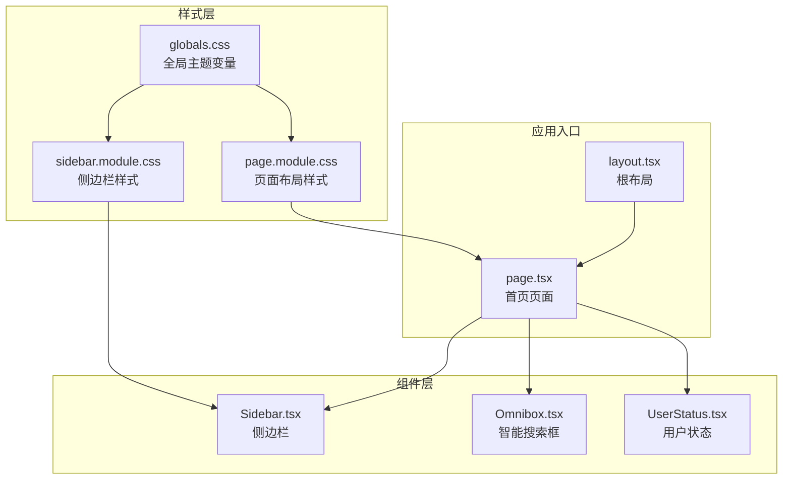
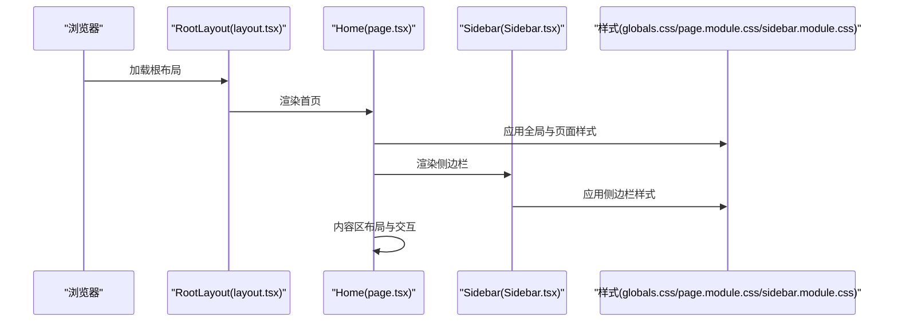
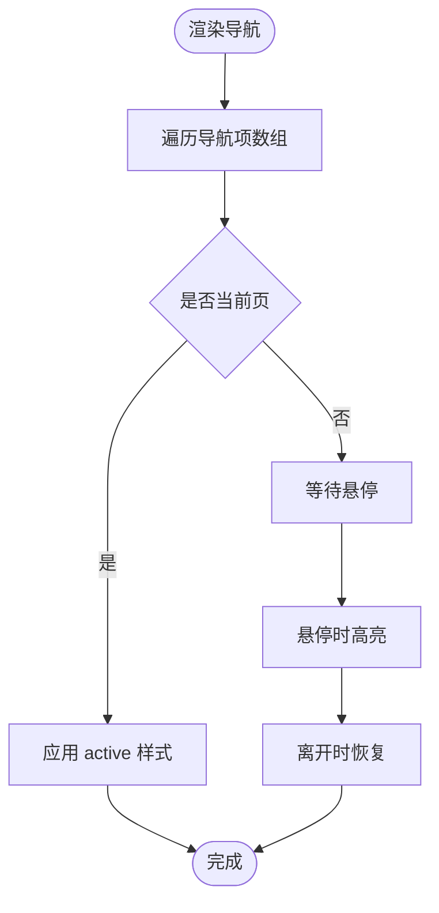
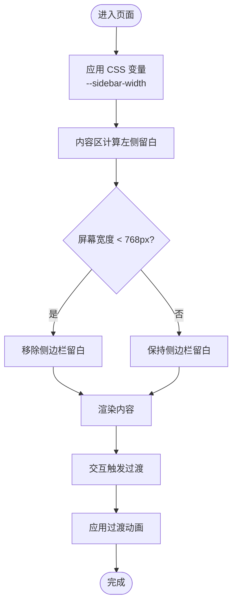
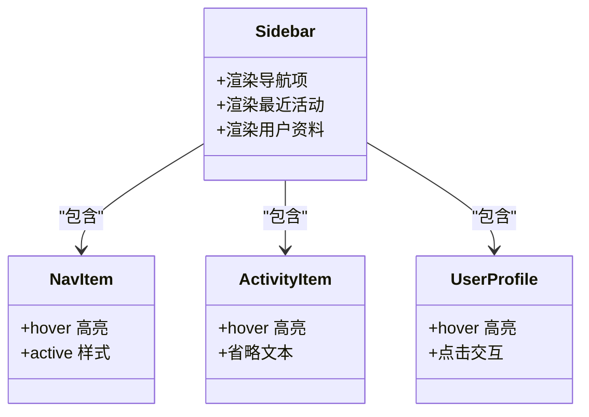
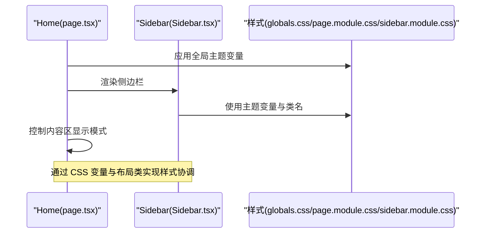
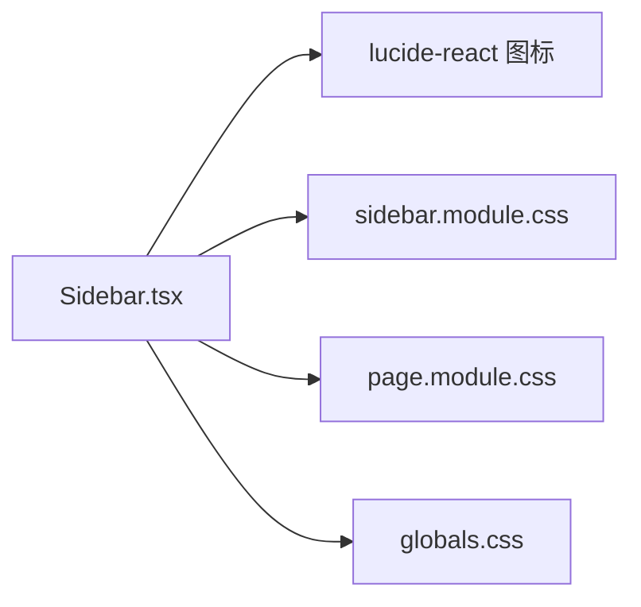

# Sidebar 侧边栏组件

<cite>
**本文档引用的文件**
- [Sidebar.tsx](file://localmanus-ui/app/components/Sidebar.tsx)
- [sidebar.module.css](file://localmanus-ui/app/components/sidebar.module.css)
- [globals.css](file://localmanus-ui/app/globals.css)
- [page.module.css](file://localmanus-ui/app/page.module.css)
- [layout.tsx](file://localmanus-ui/app/layout.tsx)
- [page.tsx](file://localmanus-ui/app/page.tsx)
- [Omnibox.tsx](file://localmanus-ui/app/components/Omnibox.tsx)
- [UserStatus.tsx](file://localmanus-ui/app/components/UserStatus.tsx)
</cite>

## 目录
1. [简介](#简介)
2. [项目结构](#项目结构)
3. [核心组件](#核心组件)
4. [架构总览](#架构总览)
5. [详细组件分析](#详细组件分析)
6. [依赖关系分析](#依赖关系分析)
7. [性能考虑](#性能考虑)
8. [故障排除指南](#故障排除指南)
9. [结论](#结论)
10. [附录](#附录)

## 简介
本技术文档围绕 Sidebar 侧边栏组件进行深入解析，涵盖其导航结构设计（菜单项组织、路由链接、状态指示）、响应式布局与动画效果、交互行为、与主应用的集成方式（状态同步、事件传递、样式协调），以及组件定制化方案、主题适配与移动端适配策略，并提供导航逻辑实现与用户体验优化建议。文档以代码级分析为基础，辅以可视化图表帮助理解组件关系与数据流。

## 项目结构
Sidebar 组件位于 Next.js 应用的客户端页面中，采用模块化样式组织，配合全局主题变量与页面布局实现统一风格与响应式体验。

**图表来源**
- [layout.tsx](file://localmanus-ui/app/layout.tsx#L9-L19)
- [page.tsx](file://localmanus-ui/app/page.tsx#L107-L181)
- [Sidebar.tsx](file://localmanus-ui/app/components/Sidebar.tsx#L13-L92)
- [globals.css](file://localmanus-ui/app/globals.css#L1-L57)
- [page.module.css](file://localmanus-ui/app/page.module.css#L1-L308)
- [sidebar.module.css](file://localmanus-ui/app/components/sidebar.module.css#L1-L174)

**章节来源**
- [layout.tsx](file://localmanus-ui/app/layout.tsx#L1-L20)
- [page.tsx](file://localmanus-ui/app/page.tsx#L1-L184)
- [Sidebar.tsx](file://localmanus-ui/app/components/Sidebar.tsx#L1-L93)
- [globals.css](file://localmanus-ui/app/globals.css#L1-L57)
- [page.module.css](file://localmanus-ui/app/page.module.css#L1-L308)
- [sidebar.module.css](file://localmanus-ui/app/components/sidebar.module.css#L1-L174)

## 核心组件
- 侧边栏容器：固定定位、玻璃拟态背景、垂直布局，包含顶部区域（Logo 与主导航）、中部区域（项目与最近活动）、底部区域（用户资料）。
- 导航项：包含主页、技能库、设置等基础导航，当前页通过 active 类名高亮。
- 最近活动：展示任务名称与状态（完成/处理中），状态通过彩色圆点指示。
- 用户资料：头像、用户名与角色信息，支持悬停交互。

**章节来源**
- [Sidebar.tsx](file://localmanus-ui/app/components/Sidebar.tsx#L13-L92)
- [sidebar.module.css](file://localmanus-ui/app/components/sidebar.module.css#L1-L174)

## 架构总览
Sidebar 作为页面的一部分被渲染在首页，与页面内容区通过 CSS 变量与布局类协同工作，实现侧边栏宽度与内容区留白的统一管理。

**图表来源**
- [layout.tsx](file://localmanus-ui/app/layout.tsx#L9-L19)
- [page.tsx](file://localmanus-ui/app/page.tsx#L107-L181)
- [Sidebar.tsx](file://localmanus-ui/app/components/Sidebar.tsx#L13-L92)
- [globals.css](file://localmanus-ui/app/globals.css#L1-L57)
- [page.module.css](file://localmanus-ui/app/page.module.css#L1-L308)
- [sidebar.module.css](file://localmanus-ui/app/components/sidebar.module.css#L1-L174)

## 详细组件分析

### 导航结构设计
- 菜单项组织：主导航包含主页、技能库、设置三个基础项；每个项由图标与文本组成，支持悬停与激活态样式。
- 状态指示：导航项通过 active 类名实现当前页高亮；最近活动列表通过彩色圆点区分完成与处理中状态。
- 路由链接：当前实现未包含实际路由跳转逻辑，可扩展为 Next.js 的 Link 组件或自定义点击处理器以实现页面切换。

**图表来源**
- [Sidebar.tsx](file://localmanus-ui/app/components/Sidebar.tsx#L28-L41)
- [sidebar.module.css](file://localmanus-ui/app/components/sidebar.module.css#L54-L75)

**章节来源**
- [Sidebar.tsx](file://localmanus-ui/app/components/Sidebar.tsx#L28-L41)
- [sidebar.module.css](file://localmanus-ui/app/components/sidebar.module.css#L54-L75)

### 响应式布局与动画效果
- 响应式布局：页面内容区通过 CSS 变量控制左侧留白，当屏幕宽度小于 768px 时，内容区移除侧边栏留白，适配移动端显示。
- 动画与过渡：导航项与活动项具备平滑过渡效果；页面整体采用 CSS 过渡实现元素显隐与尺寸变化，提升交互体验。

**图表来源**
- [globals.css](file://localmanus-ui/app/globals.css#L10-L12)
- [page.module.css](file://localmanus-ui/app/page.module.css#L18-L31)
- [page.module.css](file://localmanus-ui/app/page.module.css#L303-L308)

**章节来源**
- [globals.css](file://localmanus-ui/app/globals.css#L1-L57)
- [page.module.css](file://localmanus-ui/app/page.module.css#L1-L308)

### 交互行为
- 导航项交互：鼠标悬停改变背景色与文字颜色；当前页通过 active 类名突出显示。
- 活动项交互：最近活动项支持悬停高亮，文本溢出自动省略，提升可读性。
- 用户资料交互：悬停时背景高亮，提供可点击交互入口。

**图表来源**
- [Sidebar.tsx](file://localmanus-ui/app/components/Sidebar.tsx#L28-L92)
- [sidebar.module.css](file://localmanus-ui/app/components/sidebar.module.css#L54-L147)

**章节来源**
- [Sidebar.tsx](file://localmanus-ui/app/components/Sidebar.tsx#L28-L92)
- [sidebar.module.css](file://localmanus-ui/app/components/sidebar.module.css#L54-L147)

### 与主应用的集成方式
- 状态同步：Sidebar 本身不维护路由状态，当前页通过页面级状态控制内容区显示模式（如聊天模式）。Sidebar 与内容区通过 CSS 变量与布局类实现解耦。
- 事件传递：Sidebar 不直接接收事件回调；导航项可扩展为接收点击回调以实现页面切换。当前页面通过 props 将消息发送函数传递给其他组件，可借鉴此模式扩展导航项事件。
- 样式协调：全局主题变量集中管理颜色与尺寸，Sidebar 与页面内容共享同一套变量，确保视觉一致性。

**图表来源**
- [page.tsx](file://localmanus-ui/app/page.tsx#L107-L181)
- [Sidebar.tsx](file://localmanus-ui/app/components/Sidebar.tsx#L13-L92)
- [globals.css](file://localmanus-ui/app/globals.css#L1-L57)
- [page.module.css](file://localmanus-ui/app/page.module.css#L1-L308)
- [sidebar.module.css](file://localmanus-ui/app/components/sidebar.module.css#L1-L174)

**章节来源**
- [page.tsx](file://localmanus-ui/app/page.tsx#L107-L181)
- [Sidebar.tsx](file://localmanus-ui/app/components/Sidebar.tsx#L13-L92)
- [globals.css](file://localmanus-ui/app/globals.css#L1-L57)
- [page.module.css](file://localmanus-ui/app/page.module.css#L1-L308)
- [sidebar.module.css](file://localmanus-ui/app/components/sidebar.module.css#L1-L174)

### 组件定制化方案与主题适配
- 主题变量：通过 CSS 自定义属性集中管理颜色、模糊效果、边框与阴影等，便于主题切换与品牌定制。
- 样式模块化：侧边栏样式独立于页面样式，便于按需修改而不影响其他区域。
- 扩展点：导航项、活动项与用户资料均可通过类名扩展样式，或引入新的状态类名实现更丰富的视觉反馈。

**章节来源**
- [globals.css](file://localmanus-ui/app/globals.css#L1-L57)
- [sidebar.module.css](file://localmanus-ui/app/components/sidebar.module.css#L1-L174)

### 移动端适配策略
- 宽度阈值：当屏幕宽度小于 768px 时，内容区移除侧边栏留白，避免侧边栏遮挡内容。
- 文本省略：活动项名称使用省略号处理，保证在窄屏下可读性。
- 交互优化：移动端建议增加触摸友好的点击区域与反馈，结合现有 hover 效果进行触控适配。

**章节来源**
- [page.module.css](file://localmanus-ui/app/page.module.css#L303-L308)
- [sidebar.module.css](file://localmanus-ui/app/components/sidebar.module.css#L124-L128)

## 依赖关系分析
Sidebar 依赖于：
- 图标库：使用 lucide-react 提供的图标组件。
- 样式模块：依赖 sidebar.module.css 提供的类名与主题变量。
- 页面布局：依赖 page.module.css 中的内容区布局与 CSS 变量。

**图表来源**
- [Sidebar.tsx](file://localmanus-ui/app/components/Sidebar.tsx#L1-L11)
- [sidebar.module.css](file://localmanus-ui/app/components/sidebar.module.css#L1-L174)
- [page.module.css](file://localmanus-ui/app/page.module.css#L1-L308)
- [globals.css](file://localmanus-ui/app/globals.css#L1-L57)

**章节来源**
- [Sidebar.tsx](file://localmanus-ui/app/components/Sidebar.tsx#L1-L11)
- [sidebar.module.css](file://localmanus-ui/app/components/sidebar.module.css#L1-L174)
- [page.module.css](file://localmanus-ui/app/page.module.css#L1-L308)
- [globals.css](file://localmanus-ui/app/globals.css#L1-L57)

## 性能考虑
- 渲染开销：Sidebar 结构简单，渲染成本低；最近活动列表使用映射渲染，注意避免不必要的重渲染。
- 样式性能：使用 CSS 变量与类名切换，避免内联样式的频繁变更；过渡动画使用 CSS 实现，减少 JavaScript 动画带来的卡顿。
- 响应式性能：媒体查询仅在断点处生效，不影响常规渲染性能。

[本节为通用性能讨论，无需特定文件来源]

## 故障排除指南
- 样式不生效：检查 CSS 变量是否正确导入，确认类名拼写与样式文件路径一致。
- 导航无响应：当前导航项未绑定点击事件，需扩展为接收回调或使用路由组件实现跳转。
- 活动项文本溢出：确认容器宽度与省略样式已正确应用，必要时调整容器宽度或字体大小。

**章节来源**
- [sidebar.module.css](file://localmanus-ui/app/components/sidebar.module.css#L124-L128)
- [Sidebar.tsx](file://localmanus-ui/app/components/Sidebar.tsx#L28-L41)

## 结论
Sidebar 侧边栏组件通过简洁的结构与模块化样式实现了清晰的导航与良好的视觉一致性。当前实现聚焦于静态展示与基础交互，后续可在导航项上扩展路由跳转与状态管理，结合页面布局与主题变量实现更完整的用户体验。响应式与动画效果为移动端与桌面端提供了良好的适配基础。

[本节为总结性内容，无需特定文件来源]

## 附录
- 与主应用集成的关键点：通过 CSS 变量与布局类实现解耦；Sidebar 不直接参与路由状态管理，适合与页面级状态协作。
- 交互优化建议：为导航项添加点击回调与键盘支持；为活动项增加点击反馈与详情展开能力；为用户资料增加下拉菜单或设置入口。
- 主题适配建议：通过 CSS 自定义属性集中管理主题参数，便于快速切换明暗主题与品牌色彩。

[本节为概念性内容，无需特定文件来源]