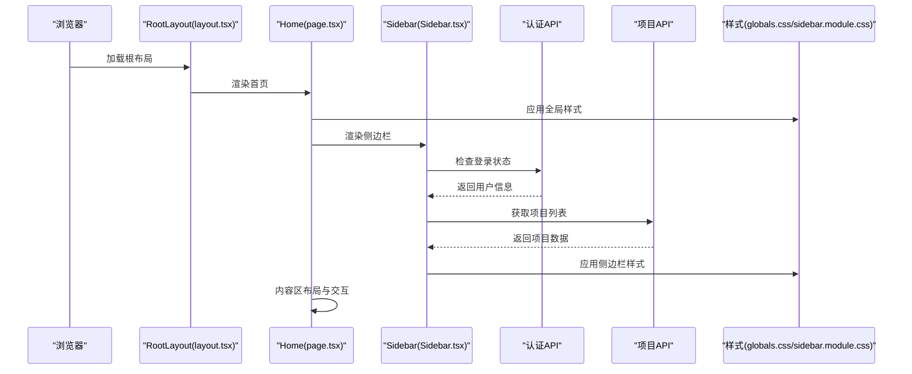
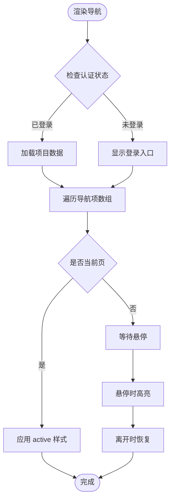
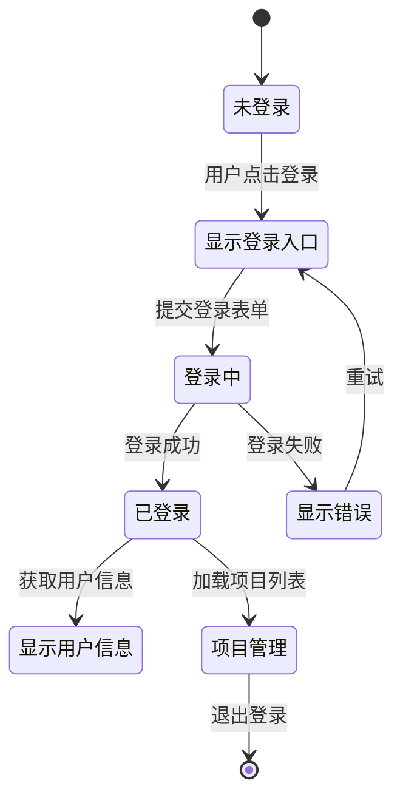
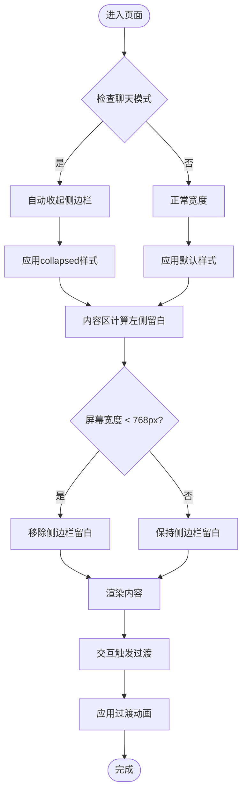
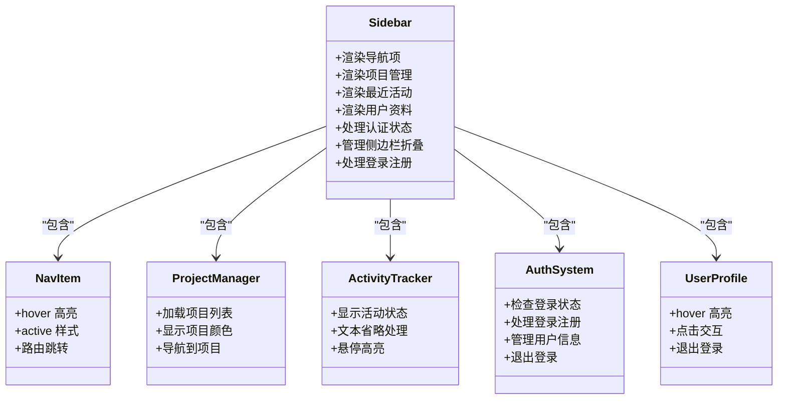
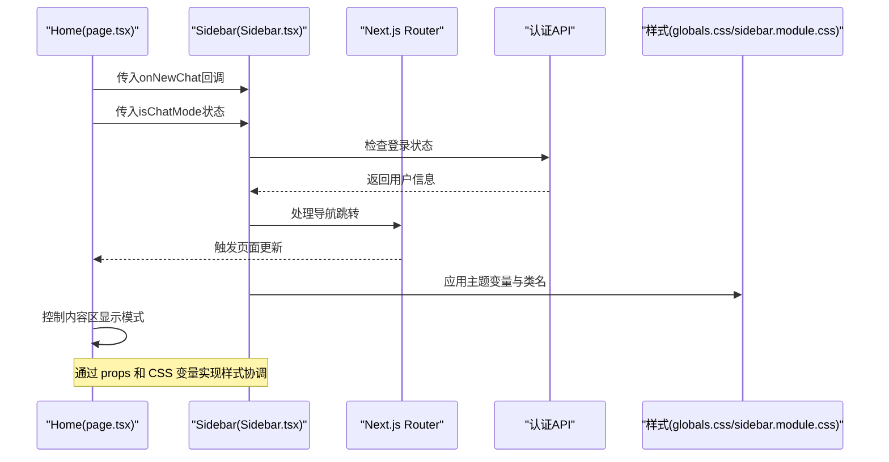
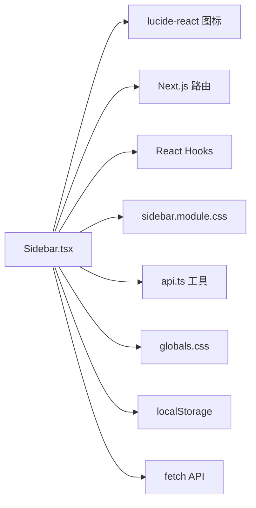

# Sidebar 侧边栏组件

<cite>
**本文档引用的文件**
- [Sidebar.tsx](file://localmanus-ui/app/components/Sidebar.tsx)
- [sidebar.module.css](file://localmanus-ui/app/components/sidebar.module.css)
- [globals.css](file://localmanus-ui/app/globals.css)
- [page.tsx](file://localmanus-ui/app/page.tsx)
- [layout.tsx](file://localmanus-ui/app/layout.tsx)
- [Omnibox.tsx](file://localmanus-ui/app/components/Omnibox.tsx)
- [UserStatus.tsx](file://localmanus-ui/app/components/UserStatus.tsx)
</cite>

## 更新摘要
**变更内容**
- Sidebar组件进行了大规模重构，从简单的导航组件升级为功能完整的侧边栏系统
- 新增了完整的认证系统，包括登录、注册、用户状态管理
- 增加了项目管理功能，支持项目列表展示和导航
- 添加了最近活动跟踪和状态指示器
- 实现了侧边栏折叠/展开功能
- 新增了模态登录对话框和表单验证
- 改进了响应式设计和动画效果
- 增加了220行新增样式规则，提升了视觉体验

## 目录
1. [简介](#简介)
2. [项目结构](#项目结构)
3. [核心组件](#核心组件)
4. [架构总览](#架构总览)
5. [详细组件分析](#详细组件分析)
6. [依赖关系分析](#依赖关系分析)
7. [性能考虑](#性能考虑)
8. [故障排除指南](#故障排除指南)
9. [结论](#结论)
10. [附录](#附录)

## 简介
本技术文档围绕重构后的Sidebar侧边栏组件进行全面解析，涵盖其完整的导航结构设计（菜单项组织、路由链接、状态指示）、认证系统、项目管理、最近活动跟踪、响应式布局与动画效果、交互行为、与主应用的集成方式（状态同步、事件传递、样式协调），以及组件定制化方案、主题适配与移动端适配策略，并提供导航逻辑实现与用户体验优化建议。文档以代码级分析为基础，辅以可视化图表帮助理解组件关系与数据流。

## 项目结构
重构后的Sidebar组件位于Next.js应用的客户端页面中，采用模块化样式组织，配合全局主题变量与页面布局实现统一风格与响应式体验。组件现在集成了完整的认证系统和项目管理功能。

```mermaid
graph TB
subgraph "应用入口"
LAYOUT["layout.tsx<br/>根布局"]
PAGE["page.tsx<br/>首页页面"]
END
subgraph "组件层"
SIDEBAR["Sidebar.tsx<br/>侧边栏"]
OMNIBOX["Omnibox.tsx<br/>智能搜索框"]
USERSTATUS["UserStatus.tsx<br/>用户状态"]
END
subgraph "样式层"
GLOBALS["globals.css<br/>全局主题变量"]
SIDECSS["sidebar.module.css<br/>侧边栏样式"]
END
LAYOUT --> PAGE
PAGE --> SIDEBAR
PAGE --> OMNIBOX
PAGE --> USERSTATUS
GLOBALS --> SIDECSS
SIDECSS --> SIDEBAR
```

**图表来源**
- [layout.tsx:9-19](file://localmanus-ui/app/layout.tsx#L9-L19)
- [page.tsx:173-176](file://localmanus-ui/app/page.tsx#L173-L176)
- [Sidebar.tsx:40-458](file://localmanus-ui/app/components/Sidebar.tsx#L40-L458)
- [globals.css:1-93](file://localmanus-ui/app/globals.css#L1-L93)
- [sidebar.module.css:1-424](file://localmanus-ui/app/components/sidebar.module.css#L1-L424)

**章节来源**
- [layout.tsx:1-20](file://localmanus-ui/app/layout.tsx#L1-L20)
- [page.tsx:1-294](file://localmanus-ui/app/page.tsx#L1-L294)
- [Sidebar.tsx:1-458](file://localmanus-ui/app/components/Sidebar.tsx#L1-L458)
- [globals.css:1-93](file://localmanus-ui/app/globals.css#L1-L93)
- [sidebar.module.css:1-424](file://localmanus-ui/app/components/sidebar.module.css#L1-L424)

## 核心组件
- **侧边栏容器**：固定定位、玻璃拟态背景、垂直布局，包含顶部区域（Logo 与主导航）、中部区域（项目与最近活动）、底部区域（用户资料）
- **导航项**：包含主页、技能库、设置等基础导航，当前页通过 active 类名高亮
- **项目管理**：展示用户项目列表，支持项目颜色标识和导航
- **最近活动**：展示任务名称与状态（完成/处理中），状态通过彩色圆点指示
- **认证系统**：完整的登录/注册流程，支持本地存储令牌管理
- **用户资料**：头像、用户名与角色信息，支持悬停交互和退出登录
- **侧边栏折叠**：支持展开/收起功能，适应不同屏幕尺寸

**章节来源**
- [Sidebar.tsx:40-458](file://localmanus-ui/app/components/Sidebar.tsx#L40-L458)
- [sidebar.module.css:1-424](file://localmanus-ui/app/components/sidebar.module.css#L1-L424)

## 架构总览
重构后的Sidebar作为页面的核心导航组件，与页面内容区通过CSS变量与布局类协同工作，实现侧边栏宽度与内容区留白的统一管理。组件现在集成了完整的认证状态管理和项目数据获取功能。



**图表来源**
- [layout.tsx:9-19](file://localmanus-ui/app/layout.tsx#L9-L19)
- [page.tsx:173-176](file://localmanus-ui/app/page.tsx#L173-L176)
- [Sidebar.tsx:62-80](file://localmanus-ui/app/components/Sidebar.tsx#L62-L80)
- [globals.css:1-93](file://localmanus-ui/app/globals.css#L1-L93)
- [sidebar.module.css:1-424](file://localmanus-ui/app/components/sidebar.module.css#L1-L424)

## 详细组件分析

### 导航结构设计
- **菜单项组织**：主导航包含主页、技能库、设置三个基础项；每个项由图标与文本组成，支持悬停与激活态样式
- **状态指示**：导航项通过 active 类名实现当前页高亮；最近活动列表通过彩色圆点区分完成与处理中状态
- **路由链接**：使用Next.js的useRouter和usePathname实现页面跳转，支持动态路由导航
- **新会话按钮**：集成onNewChat回调，支持聊天模式切换



**图表来源**
- [Sidebar.tsx:220-244](file://localmanus-ui/app/components/Sidebar.tsx#L220-L244)
- [sidebar.module.css:163-166](file://localmanus-ui/app/components/sidebar.module.css#L163-L166)

**章节来源**
- [Sidebar.tsx:220-244](file://localmanus-ui/app/components/Sidebar.tsx#L220-L244)
- [sidebar.module.css:163-166](file://localmanus-ui/app/components/sidebar.module.css#L163-L166)

### 认证系统与用户管理
- **登录状态管理**：使用localStorage存储access_token，组件挂载时自动检查并获取用户信息
- **登录/注册流程**：完整的表单验证和错误处理，支持切换登录/注册模式
- **用户信息展示**：显示用户名、头像和角色信息，支持退出登录
- **API集成**：与后端API进行认证交互，包括登录、注册、用户信息获取



**图表来源**
- [Sidebar.tsx:69-117](file://localmanus-ui/app/components/Sidebar.tsx#L69-L117)
- [Sidebar.tsx:119-189](file://localmanus-ui/app/components/Sidebar.tsx#L119-L189)

**章节来源**
- [Sidebar.tsx:69-189](file://localmanus-ui/app/components/Sidebar.tsx#L69-L189)

### 项目管理功能
- **项目列表展示**：从API获取用户项目，限制显示前5个项目
- **项目颜色标识**：每个项目使用颜色圆点进行视觉区分
- **项目导航**：支持点击项目或查看全部项目按钮进行导航
- **项目状态**：集成项目颜色系统，提升视觉层次

**章节来源**
- [Sidebar.tsx:82-98](file://localmanus-ui/app/components/Sidebar.tsx#L82-L98)
- [Sidebar.tsx:266-277](file://localmanus-ui/app/components/Sidebar.tsx#L266-L277)

### 最近活动跟踪
- **活动类型**：包含文档、报告、设计等不同类型的任务
- **状态指示**：使用绿色表示已完成，蓝色表示处理中
- **文本截断**：使用ellipsis处理长文本，确保界面整洁
- **交互反馈**：支持悬停高亮，提升可读性

**章节来源**
- [Sidebar.tsx:198-202](file://localmanus-ui/app/components/Sidebar.tsx#L198-L202)
- [Sidebar.tsx:286-296](file://localmanus-ui/app/components/Sidebar.tsx#L286-L296)

### 响应式布局与动画效果
- **侧边栏折叠**：支持展开/收起功能，宽度从280px缩小到72px
- **动画过渡**：使用CSS transition实现平滑的宽度和间距变化
- **文本隐藏**：收起状态下自动隐藏导航文本和用户信息
- **按钮位置**：折叠状态下重新定位折叠按钮到侧边栏外部



**图表来源**
- [Sidebar.tsx:62-66](file://localmanus-ui/app/components/Sidebar.tsx#L62-L66)
- [sidebar.module.css:18-21](file://localmanus-ui/app/components/sidebar.module.css#L18-L21)
- [sidebar.module.css:48-50](file://localmanus-ui/app/components/sidebar.module.css#L48-L50)

**章节来源**
- [Sidebar.tsx:62-66](file://localmanus-ui/app/components/Sidebar.tsx#L62-L66)
- [sidebar.module.css:18-50](file://localmanus-ui/app/components/sidebar.module.css#L18-L50)

### 交互行为
- **导航项交互**：鼠标悬停改变背景色与文字颜色；当前页通过 active 类名突出显示
- **活动项交互**：最近活动项支持悬停高亮，文本溢出自动省略，提升可读性
- **用户资料交互**：悬停时背景高亮，提供可点击交互入口和退出登录功能
- **折叠按钮交互**：圆形按钮设计，支持悬停变色和阴影效果
- **模态对话框**：登录/注册对话框支持点击背景关闭和表单切换



**图表来源**
- [Sidebar.tsx:40-458](file://localmanus-ui/app/components/Sidebar.tsx#L40-L458)
- [sidebar.module.css:136-166](file://localmanus-ui/app/components/sidebar.module.css#L136-L166)

**章节来源**
- [Sidebar.tsx:40-458](file://localmanus-ui/app/components/Sidebar.tsx#L40-L458)
- [sidebar.module.css:136-166](file://localmanus-ui/app/components/sidebar.module.css#L136-L166)

### 与主应用的集成方式
- **状态同步**：Sidebar通过props接收onNewChat回调和isChatMode状态，实现与页面聊天模式的同步
- **事件传递**：导航项使用router.push实现页面跳转；新会话按钮通过回调切换聊天模式
- **样式协调**：全局主题变量集中管理颜色与尺寸，Sidebar与页面内容共享同一套变量，确保视觉一致性
- **认证集成**：Sidebar独立管理认证状态，但与页面的聊天功能无缝集成



**图表来源**
- [page.tsx:173-176](file://localmanus-ui/app/page.tsx#L173-L176)
- [Sidebar.tsx:40-458](file://localmanus-ui/app/components/Sidebar.tsx#L40-L458)
- [globals.css:1-93](file://localmanus-ui/app/globals.css#L1-L93)
- [sidebar.module.css:1-424](file://localmanus-ui/app/components/sidebar.module.css#L1-L424)

**章节来源**
- [page.tsx:173-176](file://localmanus-ui/app/page.tsx#L173-L176)
- [Sidebar.tsx:40-458](file://localmanus-ui/app/components/Sidebar.tsx#L40-L458)
- [globals.css:1-93](file://localmanus-ui/app/globals.css#L1-L93)
- [sidebar.module.css:1-424](file://localmanus-ui/app/components/sidebar.module.css#L1-L424)

### 组件定制化方案与主题适配
- **主题变量**：通过CSS自定义属性集中管理颜色、模糊效果、边框与阴影等，便于主题切换与品牌定制
- **样式模块化**：侧边栏样式独立于页面样式，便于按需修改而不影响其他区域
- **扩展点**：导航项、活动项与用户资料均可通过类名扩展样式，或引入新的状态类名实现更丰富的视觉反馈
- **响应式设计**：支持不同屏幕尺寸的自适应布局，包括折叠状态下的紧凑设计

**章节来源**
- [globals.css:7-18](file://localmanus-ui/app/globals.css#L7-L18)
- [sidebar.module.css:1-424](file://localmanus-ui/app/components/sidebar.module.css#L1-L424)

### 移动端适配策略
- **宽度阈值**：当屏幕宽度小于768px时，内容区移除侧边栏留白，避免侧边栏遮挡内容
- **文本省略**：活动项名称使用省略号处理，保证在窄屏下可读性
- **交互优化**：移动端建议增加触摸友好的点击区域与反馈，结合现有 hover 效果进行触控适配
- **折叠设计**：侧边栏支持完全折叠，仅保留必要的导航按钮，优化移动端空间利用

**章节来源**
- [sidebar.module.css:18-21](file://localmanus-ui/app/components/sidebar.module.css#L18-L21)
- [sidebar.module.css:64-71](file://localmanus-ui/app/components/sidebar.module.css#L64-L71)

## 依赖关系分析
重构后的Sidebar组件依赖于：
- **图标库**：使用lucide-react提供的丰富图标组件
- **Next.js路由**：使用useRouter和usePathname实现页面导航
- **React Hooks**：使用useState和useEffect管理组件状态和生命周期
- **样式模块**：依赖sidebar.module.css提供的完整样式系统
- **API工具**：使用getApiBaseUrl获取API基础URL
- **全局样式**：依赖globals.css中的主题变量和通用样式



**图表来源**
- [Sidebar.tsx:1-20](file://localmanus-ui/app/components/Sidebar.tsx#L1-L20)
- [sidebar.module.css:1-424](file://localmanus-ui/app/components/sidebar.module.css#L1-L424)
- [globals.css:1-93](file://localmanus-ui/app/globals.css#L1-L93)

**章节来源**
- [Sidebar.tsx:1-20](file://localmanus-ui/app/components/Sidebar.tsx#L1-L20)
- [sidebar.module.css:1-424](file://localmanus-ui/app/components/sidebar.module.css#L1-L424)
- [globals.css:1-93](file://localmanus-ui/app/globals.css#L1-L93)

## 性能考虑
- **渲染优化**：Sidebar结构经过优化，使用条件渲染避免不必要的DOM节点创建
- **状态管理**：合理使用useState和useEffect，避免重复渲染和内存泄漏
- **API调用**：认证状态检查只在组件挂载时执行一次，项目数据仅在用户登录后获取
- **样式性能**：使用CSS变量与类名切换，避免内联样式的频繁变更；过渡动画使用CSS实现，减少JavaScript动画带来的卡顿
- **响应式性能**：媒体查询仅在断点处生效，不影响常规渲染性能
- **认证缓存**：使用localStorage缓存访问令牌，减少重复认证请求

## 故障排除指南
- **样式不生效**：检查CSS变量是否正确导入，确认类名拼写与样式文件路径一致
- **导航无响应**：确认Next.js路由配置正确，检查router.push调用是否正确
- **认证失败**：检查localStorage中access_token是否存在，确认API端点配置正确
- **项目数据不显示**：确认用户已登录且API返回有效数据，检查网络请求状态
- **活动项文本溢出**：确认容器宽度与省略样式已正确应用，必要时调整容器宽度或字体大小
- **折叠功能异常**：检查collapsed类名的应用和CSS过渡动画配置

**章节来源**
- [Sidebar.tsx:69-117](file://localmanus-ui/app/components/Sidebar.tsx#L69-L117)
- [Sidebar.tsx:82-98](file://localmanus-ui/app/components/Sidebar.tsx#L82-L98)
- [sidebar.module.css:215-219](file://localmanus-ui/app/components/sidebar.module.css#L215-L219)

## 结论
重构后的Sidebar侧边栏组件通过模块化设计和完整的功能集成，实现了从简单导航到综合导航系统的升级。组件集成了认证系统、项目管理、活动跟踪等核心功能，通过简洁的结构与模块化样式实现了清晰的导航与良好的视觉一致性。当前实现聚焦于完整的功能实现和基础交互，后续可在认证流程、项目管理、活动跟踪等方面进一步优化，结合页面布局与主题变量实现更完整的用户体验。响应式与动画效果为移动端与桌面端提供了良好的适配基础。

## 附录
- **与主应用集成的关键点**：通过props和状态管理实现与页面聊天模式的同步；Sidebar独立管理认证状态，但与页面功能无缝集成
- **交互优化建议**：为导航项添加点击回调与键盘支持；为活动项增加点击反馈与详情展开能力；为用户资料增加下拉菜单或设置入口
- **主题适配建议**：通过CSS自定义属性集中管理主题参数，便于快速切换明暗主题与品牌色彩
- **安全考虑**：认证令牌存储在localStorage中，建议在生产环境中考虑更安全的存储方案
- **扩展建议**：可考虑添加更多导航项、活动类型和用户功能，提升组件的实用性