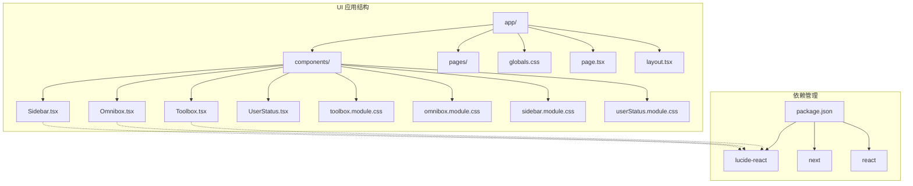
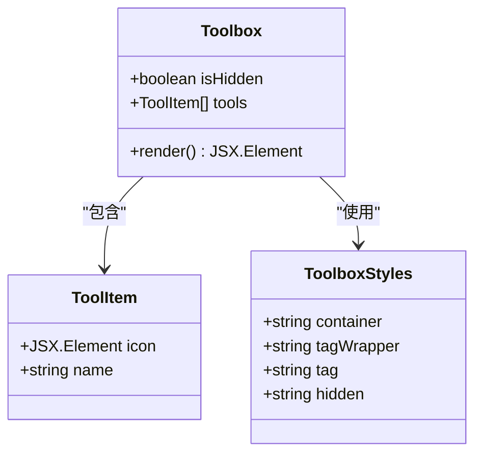
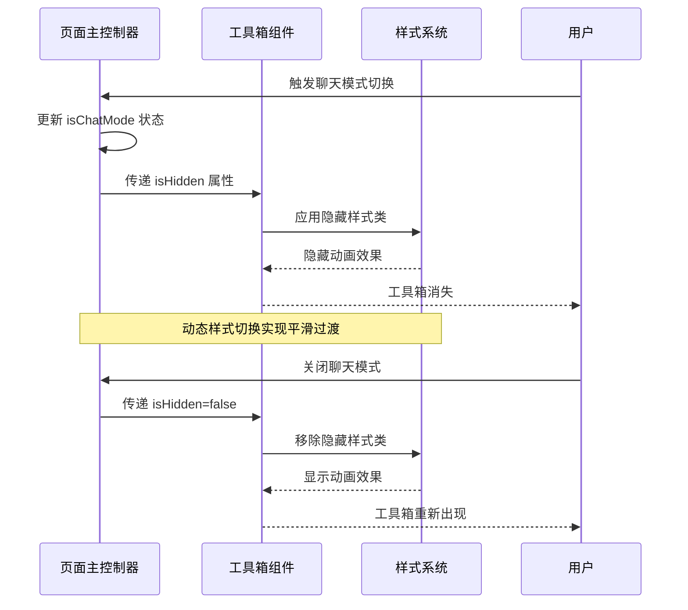
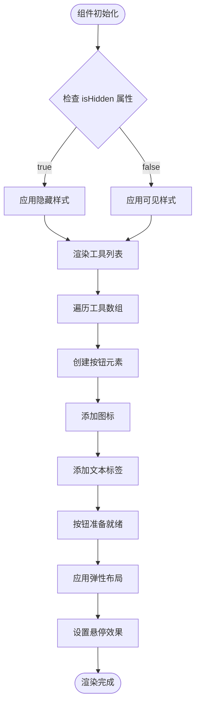
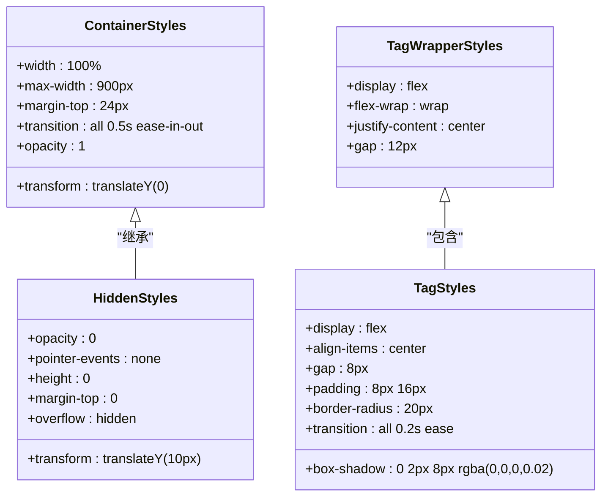
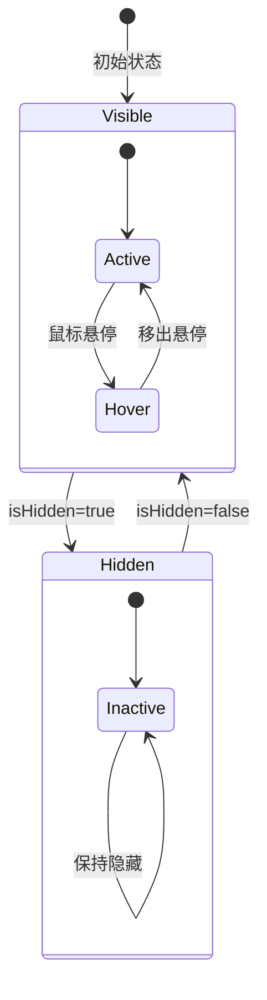
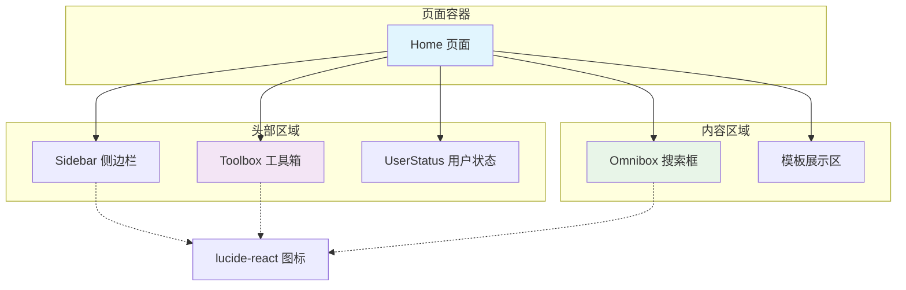
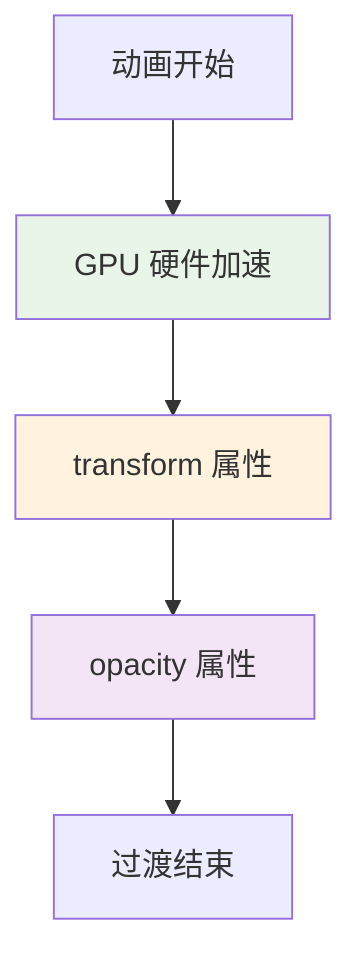

# Toolbox 工具箱组件

<cite>
**本文档引用的文件**
- [Toolbox.tsx](file://localmanus-ui/app/components/Toolbox.tsx)
- [toolbox.module.css](file://localmanus-ui/app/components/toolbox.module.css)
- [page.tsx](file://localmanus-ui/app/page.tsx)
- [page.module.css](file://localmanus-ui/app/page.module.css)
- [Omnibox.tsx](file://localmanus-ui/app/components/Omnibox.tsx)
- [omnibox.module.css](file://localmanus-ui/app/components/omnibox.module.css)
- [Sidebar.tsx](file://localmanus-ui/app/components/Sidebar.tsx)
- [sidebar.module.css](file://localmanus-ui/app/components/sidebar.module.css)
- [globals.css](file://localmanus-ui/app/globals.css)
- [package.json](file://localmanus-ui/package.json)
</cite>

## 目录
1. [简介](#简介)
2. [项目结构](#项目结构)
3. [核心组件](#核心组件)
4. [架构概览](#架构概览)
5. [详细组件分析](#详细组件分析)
6. [依赖关系分析](#依赖关系分析)
7. [性能考虑](#性能考虑)
8. [故障排除指南](#故障排除指南)
9. [结论](#结论)
10. [附录](#附录)

## 简介

Toolbox 工具箱组件是 LocalManus AI Agent 平台中的一个关键界面元素，位于页面顶部中央区域，提供多种预设的工具功能入口。该组件采用现代化的设计理念，结合了响应式布局、动画过渡效果和交互式状态管理，为用户提供直观便捷的工具选择体验。

组件的核心功能包括：
- 工具分类展示：提供10种不同类型的AI工具功能
- 动态显示控制：根据应用状态智能显示或隐藏
- 图标系统：使用 Lucide React 图标库提供统一的视觉语言
- 交互模式：支持悬停、点击等用户交互反馈
- 响应式设计：适配不同屏幕尺寸和设备类型

## 项目结构

LocalManus 项目采用 Next.js 框架构建，UI 组件位于 `localmanus-ui/app/components/` 目录下，页面级组件位于 `localmanus-ui/app/` 根目录。



**图表来源**
- [Toolbox.tsx](file://localmanus-ui/app/components/Toolbox.tsx#L1-L42)
- [package.json](file://localmanus-ui/package.json#L11-L16)

**章节来源**
- [Toolbox.tsx](file://localmanus-ui/app/components/Toolbox.tsx#L1-L42)
- [page.tsx](file://localmanus-ui/app/page.tsx#L1-L184)
- [package.json](file://localmanus-ui/package.json#L1-L26)

## 核心组件

### 工具箱组件架构

Toolbox 组件采用函数式组件设计，通过 props 接收显示状态控制参数，内部维护工具列表数据结构，使用 CSS Modules 进行样式管理。



**图表来源**
- [Toolbox.tsx](file://localmanus-ui/app/components/Toolbox.tsx#L15-L27)
- [toolbox.module.css](file://localmanus-ui/app/components/toolbox.module.css#L1-L51)

### 工具分类体系

组件内置了10种不同类别的AI工具，涵盖内容创作、设计制作、数据分析等多个领域：

| 工具类别 | 功能描述 | 图标类型 |
|---------|----------|----------|
| 内容创作 | 生成幻灯片、撰写文档、创建故事绘本 | Presentation, PenTool, Layout |
| 设计制作 | 生成设计、创建网页、翻译PDF | Palette, Layout, Languages |
| 数据分析 | 批量调研、分析数据、转写音频 | Search, FileText, Languages |
| 多媒体处理 | 总结视频、转写音频 | PlayCircle, Mic |

**章节来源**
- [Toolbox.tsx](file://localmanus-ui/app/components/Toolbox.tsx#L16-L27)

## 架构概览

Toolbox 组件在整个应用架构中扮演着工具入口的角色，与页面主控制器协同工作，实现动态显示控制和状态同步。



**图表来源**
- [page.tsx](file://localmanus-ui/app/page.tsx#L11-L141)
- [toolbox.module.css](file://localmanus-ui/app/components/toolbox.module.css#L10-L17)

**章节来源**
- [page.tsx](file://localmanus-ui/app/page.tsx#L11-L141)
- [Toolbox.tsx](file://localmanus-ui/app/components/Toolbox.tsx#L15-L41)

## 详细组件分析

### 工具箱渲染流程

组件采用映射渲染方式处理工具列表，每个工具项包含图标和文本标签，支持响应式布局和交互反馈。



**图表来源**
- [Toolbox.tsx](file://localmanus-ui/app/components/Toolbox.tsx#L29-L39)
- [toolbox.module.css](file://localmanus-ui/app/components/toolbox.module.css#L19-L47)

### 样式系统设计

组件采用 CSS Modules 实现样式隔离，确保组件间样式不冲突，同时支持主题变量和响应式设计。



**图表来源**
- [toolbox.module.css](file://localmanus-ui/app/components/toolbox.module.css#L1-L51)

**章节来源**
- [toolbox.module.css](file://localmanus-ui/app/components/toolbox.module.css#L1-L51)

### 交互模式实现

组件支持多种交互模式，包括悬停效果、点击反馈和键盘导航，提供丰富的用户体验。

| 交互类型 | 触发条件 | 效果表现 | CSS 类名 |
|---------|----------|----------|----------|
| 悬停效果 | 鼠标悬停在工具按钮上 | 背景色变化、阴影增强、轻微上移 | hover |
| 点击反馈 | 用户点击工具按钮 | 瞬时缩放反馈、颜色变化 | :active |
| 键盘导航 | Tab 键导航到按钮 | 可访问性焦点指示 | :focus |
| 状态切换 | 聊天模式切换 | 平滑透明度变化 | transition |

**章节来源**
- [toolbox.module.css](file://localmanus-ui/app/components/toolbox.module.css#L41-L47)

### 状态管理系统

Toolbox 组件通过外部状态控制实现动态显示，与页面主控制器的状态保持同步。



**图表来源**
- [page.tsx](file://localmanus-ui/app/page.tsx#L12-L141)
- [toolbox.module.css](file://localmanus-ui/app/components/toolbox.module.css#L10-L17)

**章节来源**
- [page.tsx](file://localmanus-ui/app/page.tsx#L12-L141)

## 依赖关系分析

### 外部依赖管理

项目使用 npm 包管理器，主要依赖包括 React 生态系统和 Lucide React 图标库。

```mermaid
graph LR
subgraph "应用依赖"
A[localmanus-ui] --> B[lucide-react ^0.563.0]
A --> C[next ^16.1.6]
A --> D[react ^19.2.3]
A --> E[react-dom ^19.2.3]
end
subgraph "开发依赖"
A --> F[typescript ^5]
A --> G[eslint ^9]
A --> H[@types/node ^20]
A --> I[@types/react ^19]
A --> J[@types/react-dom ^19]
end
B --> K[SVG 图标组件]
C --> L[Next.js 框架]
D --> M[React 库]
```

**图表来源**
- [package.json](file://localmanus-ui/package.json#L11-L24)

### 组件间依赖关系

Toolbox 组件与其他 UI 组件形成清晰的层次结构，遵循单一职责原则。



**图表来源**
- [page.tsx](file://localmanus-ui/app/page.tsx#L4-L183)
- [Toolbox.tsx](file://localmanus-ui/app/components/Toolbox.tsx#L1-L13)

**章节来源**
- [package.json](file://localmanus-ui/package.json#L11-L24)
- [page.tsx](file://localmanus-ui/app/page.tsx#L4-L183)

## 性能考虑

### 渲染性能优化

组件采用纯函数组件设计，避免不必要的重渲染，通过 props 控制实现高效的条件渲染。

- **虚拟 DOM 优化**：使用 React 的 diff 算法减少 DOM 操作
- **样式缓存**：CSS Modules 编译时生成唯一类名，避免样式冲突
- **事件委托**：按钮点击事件直接绑定，减少事件监听器数量

### 动画性能

组件的过渡动画使用 CSS3 属性进行硬件加速，确保流畅的用户体验。



**图表来源**
- [toolbox.module.css](file://localmanus-ui/app/components/toolbox.module.css#L5-L16)

### 响应式性能

组件支持移动端和桌面端的自适应布局，在不同设备上保持良好的性能表现。

**章节来源**
- [toolbox.module.css](file://localmanus-ui/app/components/toolbox.module.css#L1-L51)
- [page.module.css](file://localmanus-ui/app/page.module.css#L303-L308)

## 故障排除指南

### 常见问题及解决方案

| 问题类型 | 症状描述 | 可能原因 | 解决方案 |
|---------|----------|----------|----------|
| 图标不显示 | 工具按钮只显示文字 | lucide-react 依赖未正确安装 | 检查 package.json 依赖版本 |
| 样式冲突 | 工具箱布局错乱 | CSS 类名冲突 | 使用 CSS Modules 验证类名唯一性 |
| 动画异常 | 过渡效果不流畅 | CSS3 动画性能问题 | 检查 transform 和 opacity 属性 |
| 响应式问题 | 移动端显示异常 | 媒体查询配置错误 | 验证断点设置和布局属性 |

### 调试技巧

1. **开发者工具检查**：使用浏览器开发者工具检查元素的最终样式计算
2. **网络面板监控**：确认图标资源是否正确加载
3. **性能面板分析**：监控动画帧率和内存使用情况

**章节来源**
- [package.json](file://localmanus-ui/package.json#L11-L16)

## 结论

Toolbox 工具箱组件展现了现代前端开发的最佳实践，通过精心设计的组件架构、优雅的动画效果和完善的响应式布局，为用户提供了出色的工具选择体验。组件的设计充分考虑了可扩展性和维护性，为后续的功能增强和定制化需求奠定了坚实基础。

组件的主要优势包括：
- **模块化设计**：清晰的职责分离和独立的样式管理
- **性能优化**：高效的渲染策略和硬件加速的动画效果
- **用户体验**：直观的交互反馈和流畅的过渡动画
- **可维护性**：标准化的代码结构和完善的类型定义

## 附录

### 开发规范和最佳实践

#### 代码组织规范
- 组件文件命名使用帕斯卡命名法（Toolbox.tsx）
- 样式文件与组件文件同名，使用 CSS Modules
- 图标导入使用按需导入，避免全局引入

#### 性能优化建议
- 使用 React.memo 包装静态组件
- 合理使用 CSS 动画而非 JavaScript 动画
- 避免在渲染过程中执行昂贵的操作

#### 可访问性指南
- 确保所有交互元素都有适当的键盘导航支持
- 提供足够的对比度和可读性
- 使用语义化的 HTML 结构