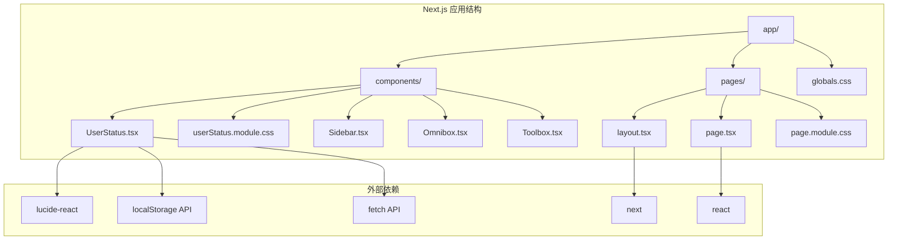
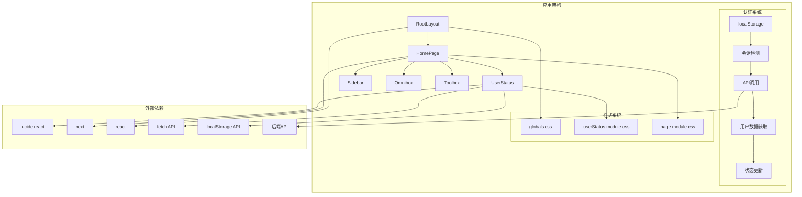
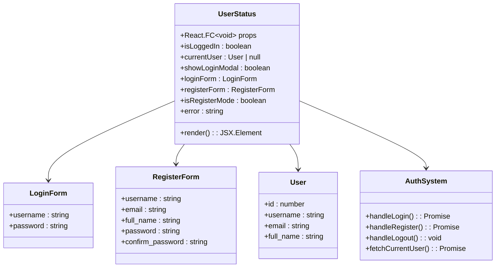
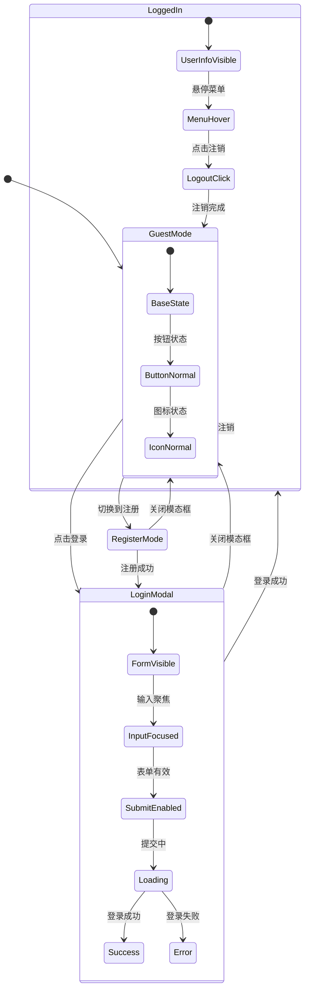
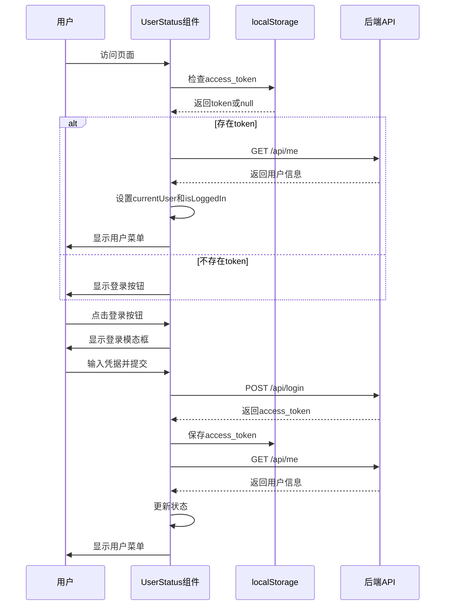
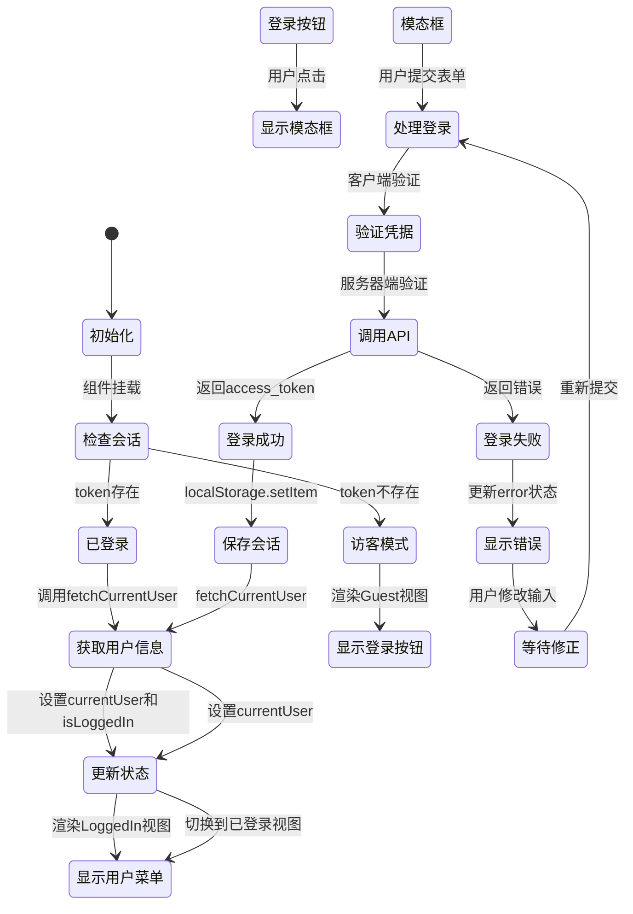
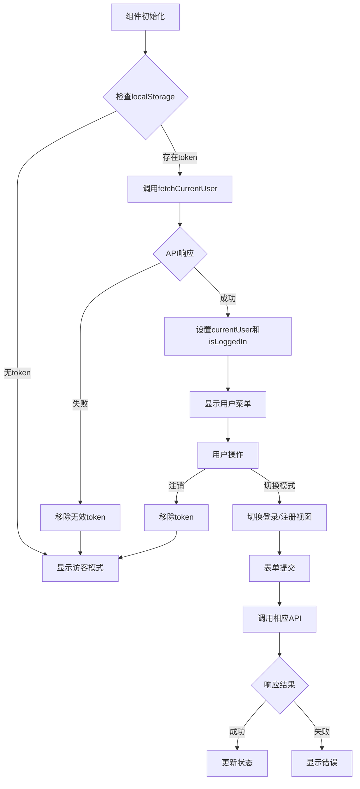
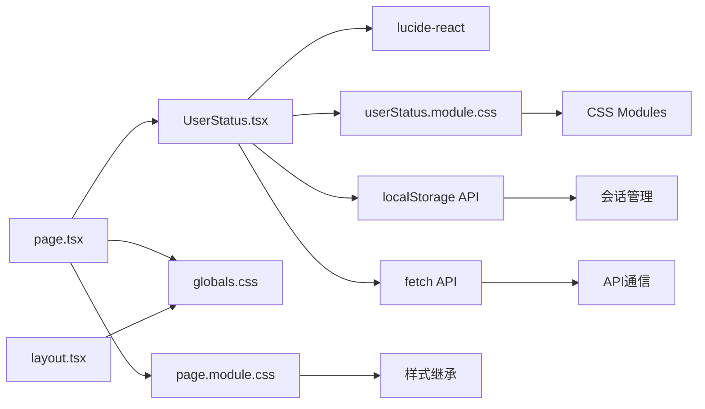

# UserStatus 用户状态组件

<cite>
**本文档引用的文件**
- [UserStatus.tsx](file://localmanus-ui/app/components/UserStatus.tsx)
- [userStatus.module.css](file://localmanus-ui/app/components/userStatus.module.css)
- [page.tsx](file://localmanus-ui/app/page.tsx)
- [layout.tsx](file://localmanus-ui/app/layout.tsx)
- [globals.css](file://localmanus-ui/app/globals.css)
- [page.module.css](file://localmanus-ui/app/page.module.css)
- [Sidebar.tsx](file://localmanus-ui/app/components/Sidebar.tsx)
- [package.json](file://localmanus-ui/package.json)
</cite>

## 更新摘要
**变更内容**
- 用户认证功能完整集成：新增登录/注册模态框、表单验证、localStorage 会话管理
- 实时用户数据获取：通过后端 API 实时获取用户信息
- 状态管理增强：完整的用户状态切换和会话生命周期管理
- 样式系统扩展：新增模态框、表单验证等样式类

## 目录
1. [简介](#简介)
2. [项目结构](#项目结构)
3. [核心组件](#核心组件)
4. [架构概览](#架构概览)
5. [详细组件分析](#详细组件分析)
6. [用户认证系统](#用户认证系统)
7. [状态管理与数据流](#状态管理与数据流)
8. [依赖关系分析](#依赖关系分析)
9. [性能考虑](#性能考虑)
10. [故障排除指南](#故障排除指南)
11. [结论](#结论)

## 简介

UserStatus 用户状态组件是 LocalManus AI Agent 平台中的关键 UI 组件，经过重大升级后，现已集成了完整的用户认证功能。该组件不仅负责在应用界面右上角显示用户的当前状态信息，还提供了完整的用户登录、注册、会话管理和实时状态更新能力。

组件采用现代化的 React 架构设计，结合 CSS Modules 实现样式隔离，使用 Lucide React 图标库提供统一的视觉元素。现在支持两种用户状态：访客模式（显示登录按钮）和已登录模式（显示用户菜单），为用户提供直观的个人状态概览和完整的身份认证体验。

## 项目结构

LocalManus 项目采用 Next.js 框架构建，UI 部分位于 `localmanus-ui` 目录中。UserStatus 组件作为独立的可复用组件，位于 `app/components` 目录下，现已集成到主页面布局中。

**图表来源**
- [UserStatus.tsx](file://localmanus-ui/app/components/UserStatus.tsx#L1-L308)
- [layout.tsx](file://localmanus-ui/app/layout.tsx#L1-L20)
- [page.tsx](file://localmanus-ui/app/page.tsx#L1-L309)

**章节来源**
- [UserStatus.tsx](file://localmanus-ui/app/components/UserStatus.tsx#L1-L308)
- [layout.tsx](file://localmanus-ui/app/layout.tsx#L1-L20)
- [page.tsx](file://localmanus-ui/app/page.tsx#L1-L309)

## 核心组件

UserStatus 组件经过重大升级，现在是一个功能完整的用户认证组件，包含以下核心功能区域：

### 主要功能模块

1. **用户认证系统**：完整的登录/注册流程，包括表单验证和错误处理
2. **会话管理**：基于 localStorage 的会话持久化和自动登录检测
3. **用户状态切换**：根据认证状态动态切换显示内容
4. **用户菜单**：已登录用户的个人信息展示和操作入口
5. **模态框界面**：响应式的登录/注册对话框

### 组件特性

- **双向状态管理**：支持登录状态的动态切换
- **表单验证**：客户端和服务器端双重验证机制
- **会话持久化**：自动检测和恢复用户会话
- **实时数据同步**：通过 API 实时获取用户最新信息
- **响应式设计**：适配不同屏幕尺寸的模态框布局
- **样式隔离**：使用 CSS Modules 避免样式冲突
- **图标集成**：基于 Lucide React 提供丰富的图标选择
- **交互反馈**：提供完整的悬停状态和过渡动画效果

**章节来源**
- [UserStatus.tsx](file://localmanus-ui/app/components/UserStatus.tsx#L12-L308)
- [userStatus.module.css](file://localmanus-ui/app/components/userStatus.module.css#L1-L253)

## 架构概览

UserStatus 组件在整个应用架构中扮演着用户身份认证和状态管理的重要角色，与主页面布局紧密集成，并通过 API 与后端服务进行数据交互。

**图表来源**
- [layout.tsx](file://localmanus-ui/app/layout.tsx#L9-L19)
- [page.tsx](file://localmanus-ui/app/page.tsx#L182-L188)
- [UserStatus.tsx](file://localmanus-ui/app/components/UserStatus.tsx#L27-L51)

## 详细组件分析

### 组件结构设计

UserStatus 组件采用条件渲染策略，根据用户认证状态动态显示不同的界面：

**图表来源**
- [UserStatus.tsx](file://localmanus-ui/app/components/UserStatus.tsx#L5-L33)
- [userStatus.module.css](file://localmanus-ui/app/components/userStatus.module.css#L1-L253)

### 样式系统分析

组件采用 CSS Modules 实现样式隔离，新增了完整的认证界面样式：

#### 核心样式类

| 样式类名 | 功能描述 | 设计要点 |
|---------|----------|----------|
| `.container` | 主容器布局 | Flexbox 水平布局，居中对齐，响应式间距 |
| `.actionGroup` | 操作按钮组 | 固定间距，垂直居中对齐，悬停效果 |
| `.iconButton` | 图标按钮样式 | 圆角设计，悬停背景色变化 |
| `.tokenBadge` | 令牌徽章样式 | 边框圆角，背景透明，边框阴影 |
| `.loginButton` | 登录按钮样式 | 蓝色主题，悬停深色效果，圆角设计 |
| `.userMenu` | 用户菜单样式 | 灰色背景，圆角边框，信息展示区 |
| `.userInfo` | 用户信息样式 | 垂直布局，最小宽度约束 |
| `.logoutButton` | 注销按钮样式 | 红色主题，悬停深色效果，小尺寸 |
| `.modalOverlay` | 模态框遮罩层 | 半透明黑色背景，全屏覆盖 |
| `.modal` | 模态框容器 | 白色背景，圆角边框，阴影效果 |
| `.formGroup` | 表单组样式 | 垂直布局，标签和输入框间距 |
| `.avatar` | 用户头像样式 | 圆形设计，橙色主题，大字体首字母 |

#### 交互状态设计

组件提供了完整的交互状态反馈：

**图表来源**
- [userStatus.module.css](file://localmanus-ui/app/components/userStatus.module.css#L28-L30)
- [userStatus.module.css](file://localmanus-ui/app/components/userStatus.module.css#L112-L132)

**章节来源**
- [userStatus.module.css](file://localmanus-ui/app/components/userStatus.module.css#L1-L253)

## 用户认证系统

### 认证流程设计

UserStatus 组件实现了完整的用户认证生命周期：

**图表来源**
- [UserStatus.tsx](file://localmanus-ui/app/components/UserStatus.tsx#L27-L51)
- [UserStatus.tsx](file://localmanus-ui/app/components/UserStatus.tsx#L53-L80)

### 表单验证机制

组件实现了多层次的表单验证：

#### 客户端验证
- 必填字段验证（用户名、密码、邮箱等）
- 密码确认匹配验证
- 邮箱格式验证
- 实时输入反馈

#### 服务器端验证
- 凭据有效性检查
- 用户存在性验证
- 密码强度验证
- 重复用户检查

#### 错误处理
- 网络错误捕获
- API响应错误处理
- 用户友好的错误提示
- 错误状态清除机制

**章节来源**
- [UserStatus.tsx](file://localmanus-ui/app/components/UserStatus.tsx#L82-L121)
- [UserStatus.tsx](file://localmanus-ui/app/components/UserStatus.tsx#L212-L282)

## 状态管理与数据流

### 状态架构设计

UserStatus 组件采用了 React Hooks 实现状态管理：

**图表来源**
- [UserStatus.tsx](file://localmanus-ui/app/components/UserStatus.tsx#L12-L33)
- [UserStatus.tsx](file://localmanus-ui/app/components/UserStatus.tsx#L123-L127)

### 数据流分析

组件的数据流体现了完整的认证生命周期：

**图表来源**
- [UserStatus.tsx](file://localmanus-ui/app/components/UserStatus.tsx#L27-L51)
- [UserStatus.tsx](file://localmanus-ui/app/components/UserStatus.tsx#L53-L121)

**章节来源**
- [UserStatus.tsx](file://localmanus-ui/app/components/UserStatus.tsx#L12-L127)

## 依赖关系分析

### 外部依赖

UserStatus 组件依赖于以下关键外部库和服务：

| 依赖包 | 版本 | 用途 | 重要性 |
|--------|------|------|--------|
| lucide-react | ^0.563.0 | 图标库 | 高 |
| next | 16.1.6 | 框架基础 | 高 |
| react | 19.2.3 | 核心库 | 高 |
| react-dom | 19.2.3 | DOM 操作 | 中 |
| localStorage API | 浏览器内置 | 会话存储 | 高 |
| fetch API | 浏览器内置 | HTTP请求 | 高 |

### 内部依赖

组件之间的依赖关系体现了清晰的职责分离：

**图表来源**
- [UserStatus.tsx](file://localmanus-ui/app/components/UserStatus.tsx#L1-L3)
- [page.tsx](file://localmanus-ui/app/page.tsx#L1-L11)
- [package.json](file://localmanus-ui/package.json#L11-L24)

**章节来源**
- [package.json](file://localmanus-ui/package.json#L11-L24)

## 性能考虑

### 渲染性能

UserStatus 组件经过优化，具有以下性能优势：

- **条件渲染优化**：根据状态动态渲染不同内容，避免不必要的DOM节点
- **状态最小化**：只维护必要的状态，减少内存占用
- **事件处理优化**：合理绑定事件处理器，避免重复创建
- **样式缓存**：CSS Modules 生成稳定类名，便于浏览器缓存

### 网络性能

认证系统的网络请求经过精心设计：

- **懒加载策略**：仅在需要时发起API请求
- **错误处理**：完善的错误捕获和重试机制
- **会话复用**：利用现有token避免重复登录
- **请求去重**：防止并发重复的API调用

### 会话性能

localStorage 的使用带来了额外的性能收益：

- **本地存储**：避免每次页面刷新都进行认证
- **快速检测**：毫秒级的会话状态检测
- **持久化**：跨会话的数据保持
- **异步处理**：不会阻塞主线程

### 样式性能

CSS Modules 的使用带来了额外的性能收益：

- **作用域隔离**：避免全局样式冲突，减少样式查找时间
- **打包优化**：构建时进行样式压缩和优化
- **缓存友好**：稳定的类名便于浏览器缓存
- **按需加载**：样式文件按需加载，减少初始包大小

## 故障排除指南

### 常见问题及解决方案

#### 认证失败问题

**问题描述**：用户登录后仍然显示访客模式

**可能原因**：
1. API 响应格式不符合预期
2. localStorage 存储失败
3. token 格式不正确
4. CORS 配置问题

**解决方案**：
1. 检查 API 响应格式是否为 JSON
2. 验证 localStorage 是否可用
3. 确认 token 格式符合 Bearer Token 规范
4. 检查后端 CORS 配置

#### 模态框显示问题

**问题描述**：登录/注册模态框无法正常显示或关闭

**可能原因**：
1. 事件冒泡处理错误
2. 样式冲突导致定位问题
3. z-index 层级问题
4. 事件监听器绑定错误

**解决方案**：
1. 检查 `onClick` 事件处理函数
2. 验证模态框样式类名
3. 调整 z-index 层级
4. 确认事件监听器正确绑定

#### 表单验证问题

**问题描述**：表单验证不工作或验证结果不正确

**可能原因**：
1. 表单状态更新逻辑错误
2. 验证规则配置问题
3. 事件处理函数错误
4. 条件渲染逻辑问题

**解决方案**：
1. 检查表单状态更新函数
2. 验证验证规则配置
3. 确认事件处理函数正确执行
4. 调试条件渲染逻辑

#### 样式不生效

**问题描述**：UserStatus 组件样式显示异常或完全不生效

**可能原因**：
1. CSS Modules 导入路径错误
2. 类名拼写错误
3. 样式被其他规则覆盖
4. 模块作用域问题

**解决方案**：
1. 检查 `import styles from './userStatus.module.css'` 路径
2. 确认使用正确的类名（如 `styles.container`）
3. 使用浏览器开发者工具检查样式优先级
4. 验证 CSS Modules 作用域隔离

#### 响应式布局问题

**问题描述**：组件在移动设备上显示异常

**可能原因**：
1. 缺少媒体查询定义
2. 容器宽度设置不当
3. 字体大小响应式处理
4. 模态框尺寸适配问题

**解决方案**：
1. 在全局样式中添加适当的媒体查询
2. 调整容器的 `max-width` 属性
3. 使用相对单位（如 rem、em）替代固定像素值
4. 为模态框添加响应式断点

**章节来源**
- [userStatus.module.css](file://localmanus-ui/app/components/userStatus.module.css#L1-L253)
- [UserStatus.tsx](file://localmanus-ui/app/components/UserStatus.tsx#L1-L308)
- [package.json](file://localmanus-ui/package.json#L11-L24)

## 结论

UserStatus 用户状态组件经过重大升级，现已发展为一个功能完整的用户认证系统，展现了现代 React 开发的最佳实践。该组件不仅提供了优雅的用户界面，更重要的是实现了完整的身份认证和会话管理能力。

### 设计亮点

1. **模块化设计**：组件职责单一，易于维护和测试
2. **状态管理完善**：完整的认证状态生命周期管理
3. **用户体验优秀**：流畅的认证流程和即时反馈
4. **样式系统强大**：CSS Modules 确保样式不会相互干扰
5. **性能优化到位**：条件渲染和懒加载策略
6. **错误处理完善**：全面的错误捕获和用户提示
7. **响应式设计**：适配各种设备和屏幕尺寸
8. **可扩展性强**：为未来的功能扩展预留了接口

### 技术优势

- **TypeScript 支持**：提供类型安全的开发体验
- **Next.js 集成**：充分利用框架的优化特性
- **图标系统**：统一的视觉语言提升用户体验
- **认证系统**：完整的用户身份管理
- **会话持久化**：基于 localStorage 的会话管理
- **实时数据**：通过 API 实时获取用户信息

### 发展建议

随着项目的演进，建议考虑以下改进方向：

1. **权限系统**：添加基于角色的权限管理
2. **多语言支持**：添加国际化文本支持
3. **主题系统**：提供更丰富的主题定制选项
4. **无障碍访问**：增强键盘导航和屏幕阅读器支持
5. **安全增强**：添加 CSRF 保护和更严格的输入验证
6. **性能监控**：添加认证流程的性能监控
7. **测试覆盖**：增加单元测试和集成测试

该组件为 LocalManus 平台的用户界面和身份认证系统奠定了坚实的基础，其设计理念和实现方式值得在其他 UI 组件中借鉴和应用。通过持续的优化和改进，UserStatus 组件将继续为用户提供优秀的认证体验。