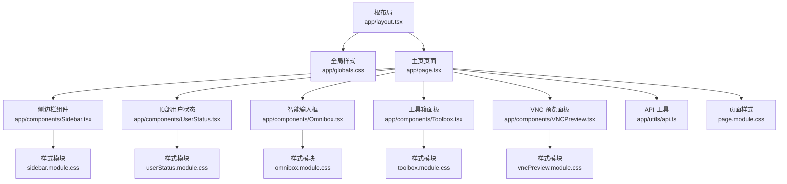
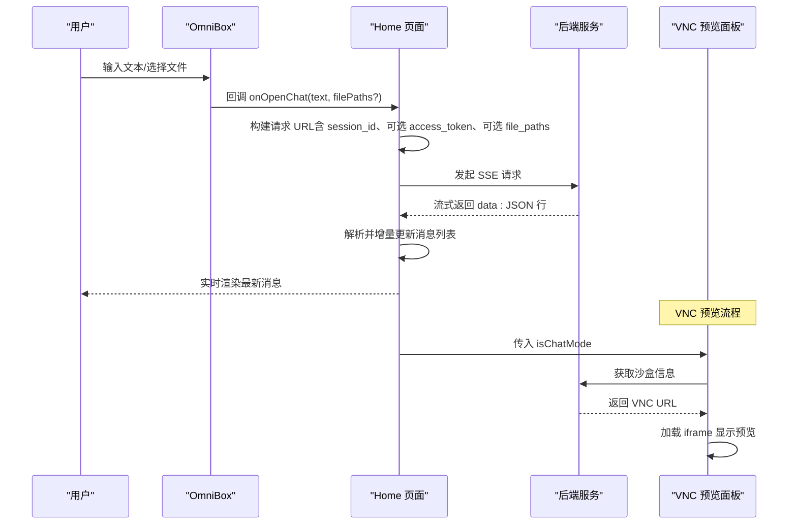
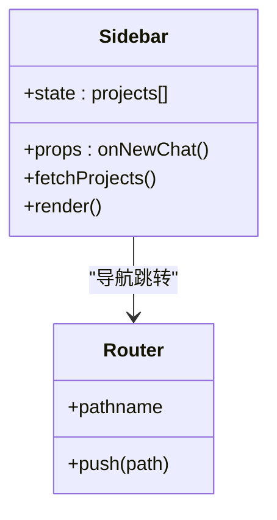
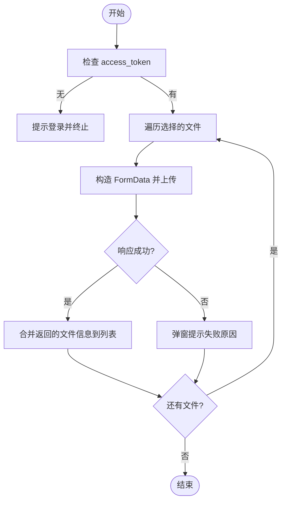
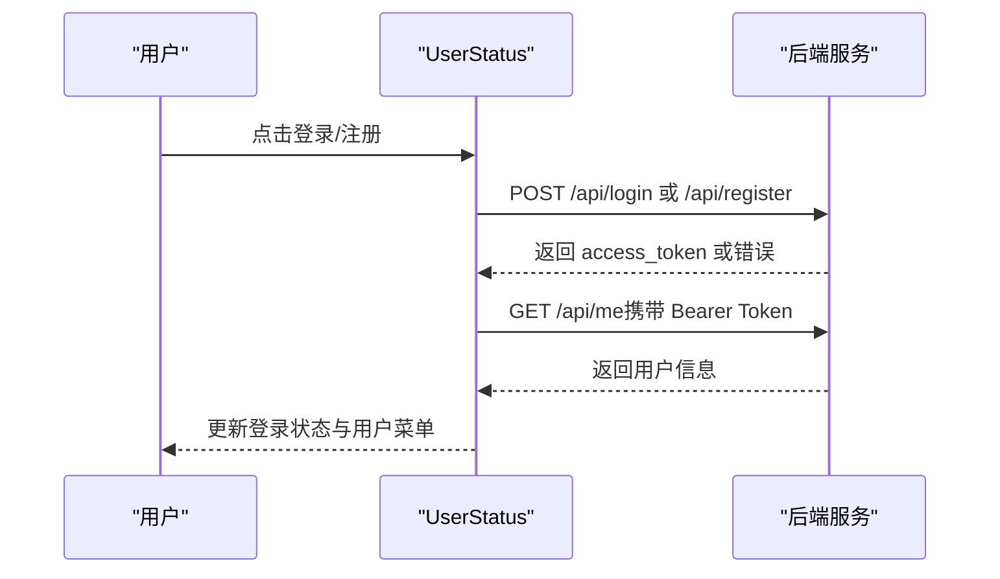
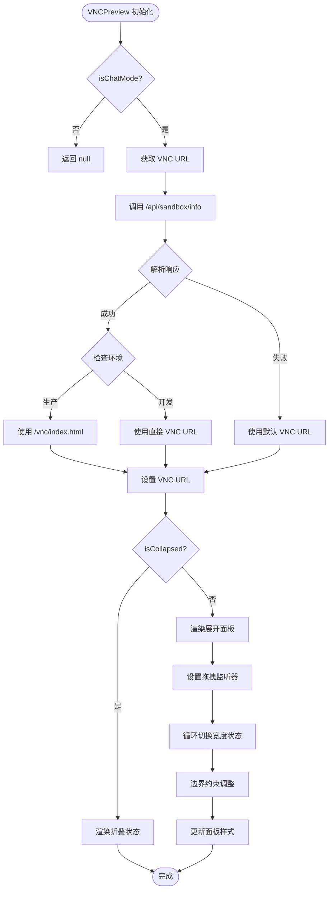
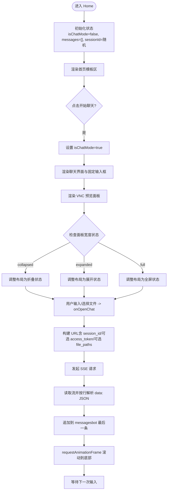
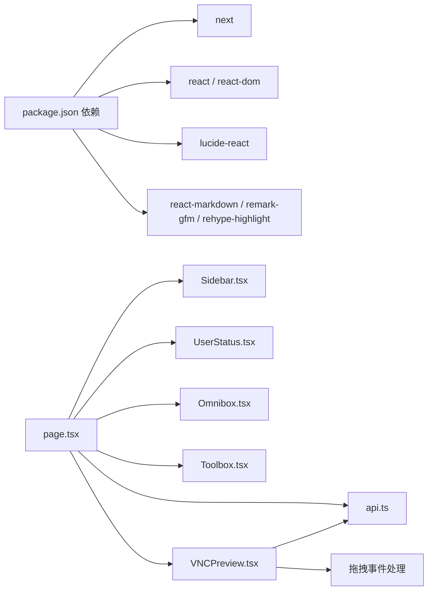

# 前端用户界面

<cite>
**本文引用的文件**
- [package.json](file://localmanus-ui/package.json)
- [next.config.ts](file://localmanus-ui/next.config.ts)
- [layout.tsx](file://localmanus-ui/app/layout.tsx)
- [page.tsx](file://localmanus-ui/app/page.tsx)
- [globals.css](file://localmanus-ui/app/globals.css)
- [Sidebar.tsx](file://localmanus-ui/app/components/Sidebar.tsx)
- [Omnibox.tsx](file://localmanus-ui/app/components/Omnibox.tsx)
- [Toolbox.tsx](file://localmanus-ui/app/components/Toolbox.tsx)
- [UserStatus.tsx](file://localmanus-ui/app/components/UserStatus.tsx)
- [VNCPreview.tsx](file://localmanus-ui/app/components/VNCPreview.tsx)
- [api.ts](file://localmanus-ui/app/utils/api.ts)
- [sidebar.module.css](file://localmanus-ui/app/components/sidebar.module.css)
- [omnibox.module.css](file://localmanus-ui/app/components/omnibox.module.css)
- [toolbox.module.css](file://localmanus-ui/app/components/toolbox.module.css)
- [userStatus.module.css](file://localmanus-ui/app/components/userStatus.module.css)
- [vncPreview.module.css](file://localmanus-ui/app/components/vncPreview.module.css)
- [page.module.css](file://localmanus-ui/app/page.module.css)
</cite>

## 更新摘要
**变更内容**
- VNC 预览组件完全重设计，新增四种面板宽度状态（collapsed、compact、expanded、full）
- 实现拖拽调整大小功能，支持鼠标拖拽实时调整面板宽度
- 增强视觉反馈和交互体验，包括拖拽指示器、动画效果、悬停状态
- 优化响应式设计，在不同屏幕尺寸下提供最佳用户体验
- 更新页面布局以支持动态宽度调整和响应式布局

## 目录
1. [简介](#简介)
2. [项目结构](#项目结构)
3. [核心组件](#核心组件)
4. [架构总览](#架构总览)
5. [组件详解](#组件详解)
6. [依赖关系分析](#依赖关系分析)
7. [性能考量](#性能考量)
8. [故障排查指南](#故障排查指南)
9. [结论](#结论)
10. [附录](#附录)

## 简介
本文件面向 LocalManus 前端用户界面，基于 Next.js 16 与 React 19 构建，采用 App Router、客户端组件与模块化 CSS 的现代前端实践。文档从系统架构、页面结构、组件层次、状态管理、实时聊天实现（含 SSE 流）、UI 更新机制、样式系统与响应式布局、组件开发规范、API 集成方法、性能优化策略、用户体验与无障碍支持等维度进行深入解析，帮助开发者快速理解与迭代该界面。

**更新** VNC 预览系统经过完全重设计，提供增强的交互体验和响应式布局，支持多种面板宽度状态和拖拽调整功能。

## 项目结构
- 应用入口与全局配置
  - 根布局与元数据：在根布局中注入全局样式与站点元信息，确保全站一致的主题与字体。
  - Next.js 配置：定义环境变量、生产优化、输出模式、图片优化策略、实验特性与 Turbopack 支持。
  - 全局样式：统一导入高亮主题、基础排版、玻璃拟态与滚动条美化等通用样式。
- 页面与组件
  - 主页页面：负责聊天模式切换、消息列表渲染、SSE 流式接收、文件上传集成、自动滚动与加载态管理。
  - 组件层：侧边栏导航、顶部用户状态、底部智能输入框（OmniBox）、工具箱面板、VNC 预览面板等。
  - 工具函数：API 基础地址根据运行时上下文动态选择（浏览器/SSR）。
- 样式系统
  - 使用 CSS Modules 与 CSS 变量，结合玻璃拟态、动画过渡与媒体查询实现响应式布局。

**图表来源**
- [layout.tsx](file://localmanus-ui/app/layout.tsx#L1-L20)
- [globals.css](file://localmanus-ui/app/globals.css#L1-L93)
- [page.tsx](file://localmanus-ui/app/page.tsx#L1-L297)
- [Sidebar.tsx](file://localmanus-ui/app/components/Sidebar.tsx#L1-L163)
- [UserStatus.tsx](file://localmanus-ui/app/components/UserStatus.tsx#L1-L312)
- [Omnibox.tsx](file://localmanus-ui/app/components/Omnibox.tsx#L1-L200)
- [Toolbox.tsx](file://localmanus-ui/app/components/Toolbox.tsx#L1-L42)
- [VNCPreview.tsx](file://localmanus-ui/app/components/VNCPreview.tsx#L1-L212)
- [api.ts](file://localmanus-ui/app/utils/api.ts#L1-L17)
- [sidebar.module.css](file://localmanus-ui/app/components/sidebar.module.css#L1-L204)
- [userStatus.module.css](file://localmanus-ui/app/components/userStatus.module.css#L1-L253)
- [omnibox.module.css](file://localmanus-ui/app/components/omnibox.module.css#L1-L185)
- [toolbox.module.css](file://localmanus-ui/app/components/toolbox.module.css#L1-L51)
- [vncPreview.module.css](file://localmanus-ui/app/components/vncPreview.module.css#L1-L323)
- [page.module.css](file://localmanus-ui/app/page.module.css#L1-L419)

**章节来源**
- [layout.tsx](file://localmanus-ui/app/layout.tsx#L1-L20)
- [next.config.ts](file://localmanus-ui/next.config.ts#L1-L37)
- [globals.css](file://localmanus-ui/app/globals.css#L1-L93)

## 核心组件
- 侧边栏（Sidebar）
  - 负责导航、项目列表、最近活动与用户资料展示；支持新会话按钮回调。
  - 通过路由钩子与 API 工具读取后端数据，使用 CSS Modules 实现玻璃拟态与交互反馈。
- 智能输入框（Omnibox）
  - 支持文本输入、文件上传、回车提交、禁用态控制与上传指示器。
  - 上传流程通过表单数据提交到后端，并将返回的文件信息合并到外部状态数组。
- 用户状态（UserStatus）
  - 登录/注册模态、令牌持久化、当前用户信息获取、登出操作。
  - 提供令牌徽章与用户菜单，覆盖登录前后的不同 UI 状态。
- 工具箱（Toolbox）
  - 展示多种创作能力标签，支持在聊天模式下隐藏以节省空间。
- VNC 预览面板（VNCPreview）
  - **完全重设计** 提供增强的沙盒浏览器实时预览功能，支持四种面板宽度状态：
    - collapsed（48px）：仅显示展开按钮，适合极简布局
    - compact（400px）：紧凑视图，适合移动设备或窄屏
    - expanded（600px）：默认视图，提供良好的预览体验
    - full（900px）：最大视图，适合宽屏显示器
  - 实现拖拽调整大小功能，支持鼠标拖拽实时调整面板宽度
  - 增强视觉反馈，包括拖拽指示器、动画效果、悬停状态
  - 优化响应式设计，在不同屏幕尺寸下提供最佳用户体验
  - 自动获取 VNC URL 并处理代理路径，支持多种部署环境的兼容性
  - 包含加载状态、错误处理和响应式布局。
- 主页页面（Home）
  - 管理聊天模式开关、消息列表、SSE 流式接收、文件路径参数拼接、滚动与加载态。
  - 渲染用户与机器人消息，支持 Markdown 内容渲染与系统日志高亮。
  - **更新** 集成 VNC 预览面板，实现右侧固定布局和响应式调整。

**章节来源**
- [Sidebar.tsx](file://localmanus-ui/app/components/Sidebar.tsx#L1-L163)
- [Omnibox.tsx](file://localmanus-ui/app/components/Omnibox.tsx#L1-L200)
- [UserStatus.tsx](file://localmanus-ui/app/components/UserStatus.tsx#L1-L312)
- [Toolbox.tsx](file://localmanus-ui/app/components/Toolbox.tsx#L1-L42)
- [VNCPreview.tsx](file://localmanus-ui/app/components/VNCPreview.tsx#L1-L212)
- [page.tsx](file://localmanus-ui/app/page.tsx#L1-L297)

## 架构总览
- 运行时上下文
  - 浏览器端：使用 NEXT_PUBLIC_API_URL 作为公共 API 地址。
  - SSR 端：使用 BACKEND_URL 访问内部服务网络。
- 数据流
  - 用户输入 → OmniBox 处理文件上传与文本 → Home 页面发起请求 → 后端 SSE 流 → Home 页面增量更新消息列表。
  - **更新** VNC 预览 → 通过 API 获取 VNC URL → 动态加载 iframe → 实时显示沙盒浏览器内容。
- 组件通信
  - Home 作为容器组件，向下传递状态与回调给 Sidebar、UserStatus、Omnibox、Toolbox、VNCPreview。
  - OmniBox 与 Home 之间通过外部状态共享实现文件列表同步。
  - **新增** VNCPreview 与 Home 通过 isChatMode 属性进行条件渲染控制。

**图表来源**
- [page.tsx](file://localmanus-ui/app/page.tsx#L44-L142)
- [Omnibox.tsx](file://localmanus-ui/app/components/Omnibox.tsx#L29-L109)
- [VNCPreview.tsx](file://localmanus-ui/app/components/VNCPreview.tsx#L19-L69)
- [api.ts](file://localmanus-ui/app/utils/api.ts#L7-L16)

**章节来源**
- [api.ts](file://localmanus-ui/app/utils/api.ts#L1-L17)
- [page.tsx](file://localmanus-ui/app/page.tsx#L68-L83)
- [VNCPreview.tsx](file://localmanus-ui/app/components/VNCPreview.tsx#L1-L212)

## 组件详解

### 侧边栏（Sidebar）
- 功能要点
  - 导航项高亮与路由跳转。
  - 项目列表拉取与展示，支持"查看全部"跳转。
  - 最近活动状态可视化。
  - 用户资料区域与新会话按钮（回调父组件）。
- 设计模式
  - 客户端组件 + 路由钩子 + API 工具。
  - 使用 CSS Modules 控制布局与交互态。
- 性能与可用性
  - 首屏仅拉取前 N 条项目，避免阻塞。
  - 无状态按钮 hover 效果与阴影提升触控反馈。

**图表来源**
- [Sidebar.tsx](file://localmanus-ui/app/components/Sidebar.tsx#L28-L53)

**章节来源**
- [Sidebar.tsx](file://localmanus-ui/app/components/Sidebar.tsx#L1-L163)
- [sidebar.module.css](file://localmanus-ui/app/components/sidebar.module.css#L1-L204)

### 智能输入框（Omnibox）
- 功能要点
  - 文本输入与回车提交。
  - 文件选择与上传（FormData），逐个文件上传并合并返回结果。
  - 上传中指示器与文件列表展示，支持移除文件。
  - 与父组件共享 uploadedFiles 状态，支持外部传入/回调。
- 错误处理
  - 未登录时拦截上传并提示。
  - 单文件上传失败时弹窗提示并保留其他文件。
- 交互细节
  - 禁用态阻止重复提交。
  - 上传完成后清空文件输入值。

**图表来源**
- [Omnibox.tsx](file://localmanus-ui/app/components/Omnibox.tsx#L29-L77)

**章节来源**
- [Omnibox.tsx](file://localmanus-ui/app/components/Omnibox.tsx#L1-L200)
- [omnibox.module.css](file://localmanus-ui/app/components/omnibox.module.css#L1-L185)

### 用户状态（UserStatus）
- 功能要点
  - 登录/注册模态：用户名/密码登录与邮箱/姓名/密码注册。
  - 自动登录：注册成功后触发登录事件并自动填充表单。
  - 当前用户信息：通过 Bearer Token 获取并缓存。
  - 登出：清除本地令牌并重置状态。
- 安全与体验
  - 表单防重复提交与错误提示。
  - 令牌缺失或失效时自动清理本地存储。

**图表来源**
- [UserStatus.tsx](file://localmanus-ui/app/components/UserStatus.tsx#L55-L125)

**章节来源**
- [UserStatus.tsx](file://localmanus-ui/app/components/UserStatus.tsx#L1-L312)
- [userStatus.module.css](file://localmanus-ui/app/components/userStatus.module.css#L1-L253)

### 工具箱（Toolbox）
- 功能要点
  - 展示多种创作能力标签，支持换行与居中布局。
  - 在聊天模式下隐藏，减少干扰。
- 样式要点
  - 使用 CSS 变量与过渡动画，hover 提升视觉反馈。

**章节来源**
- [Toolbox.tsx](file://localmanus-ui/app/components/Toolbox.tsx#L1-L42)
- [toolbox.module.css](file://localmanus-ui/app/components/toolbox.module.css#L1-L51)

### VNC 预览面板（VNCPreview）
- **完全重设计** 功能要点
  - **四种面板宽度状态**：collapsed（48px）、compact（400px）、expanded（600px）、full（900px）
  - **拖拽调整大小**：实现鼠标拖拽实时调整面板宽度，支持边界约束和视觉反馈
  - **增强视觉反馈**：包括拖拽指示器、动画效果、悬停状态、加载状态
  - **优化响应式设计**：在不同屏幕尺寸下提供最佳用户体验
  - 沙盒浏览器实时预览：自动获取 VNC URL 并加载 iframe。
  - 环境兼容：支持开发环境和生产环境的不同代理路径。
  - 加载与错误处理：显示加载状态和错误信息。
- 技术实现
  - 使用 useEffect 在聊天模式下自动获取 VNC URL。
  - 支持两种 VNC URL 格式：{ data: { vnc_url } } 或 { vnc_url }。
  - 生产环境通过 nginx 代理路径 `/vnc/index.html?autoconnect=true`。
  - **新增** 实现拖拽调整大小功能，使用 mousemove 和 mouseup 事件监听。
  - **新增** 使用 PANEL_WIDTHS 常量定义四种宽度状态，支持循环切换。
  - **新增** 实现 collapsed 状态，仅显示展开按钮。
- 样式系统
  - 使用 CSS Modules 实现固定定位和动画效果。
  - **新增** 支持四种宽度状态的响应式布局。
  - **新增** 拖拽手柄样式，包括 hover 和 resizing 状态。
  - **新增** 动画效果：slideInRight、pulse、fadeIn、float 等。
  - **新增** 响应式断点：1400px 和 1200px 下自动调整宽度。
  - **新增** collapsed 状态的特殊样式和动画。

**图表来源**
- [VNCPreview.tsx](file://localmanus-ui/app/components/VNCPreview.tsx#L19-L69)
- [VNCPreview.tsx](file://localmanus-ui/app/components/VNCPreview.tsx#L71-L116)
- [VNCPreview.tsx](file://localmanus-ui/app/components/VNCPreview.tsx#L120-L134)

**章节来源**
- [VNCPreview.tsx](file://localmanus-ui/app/components/VNCPreview.tsx#L1-L212)
- [vncPreview.module.css](file://localmanus-ui/app/components/vncPreview.module.css#L1-L323)

### 主页页面（Home）
- 功能要点
  - 聊天模式切换：首页模板区与聊天界面互斥显示。
  - 消息列表：区分用户与机器人消息，支持 Markdown 渲染与系统日志高亮。
  - SSE 流式接收：按行解析 data: JSON，增量更新 bot 消息内容。
  - 文件上传集成：将文件路径拼接到查询参数，随消息一并发送。
  - 自动滚动：每次消息变化在聊天模式下平滑滚动到底部。
  - 加载态：发送中禁用输入与提交按钮，防止重复请求。
  - **更新** VNC 预览集成：在聊天模式下显示右侧 VNC 面板，支持响应式布局调整。
- 状态管理
  - 使用 useState 管理 isChatMode、messages、isLoading、sessionId、uploadedFiles。
  - 使用 useRef 引用内容容器以实现滚动控制。
  - **更新** 通过 isChatMode 属性控制 VNC 预览面板的显示/隐藏。
- 布局协调
  - **更新** 使用 CSS 类 `.withVNC` 动态调整内容区域的右边距，支持不同宽度状态。
  - **更新** 固定输入框在 VNC 面板存在时自动调整宽度，支持响应式布局。
  - **更新** 支持 VNC 面板的四种宽度状态下的布局变化。
  - **更新** 在 VNC 面板折叠时，输入框自动扩展至全宽。

**图表来源**
- [page.tsx](file://localmanus-ui/app/page.tsx#L14-L142)
- [page.tsx](file://localmanus-ui/app/page.tsx#L182-L183)

**章节来源**
- [page.tsx](file://localmanus-ui/app/page.tsx#L1-L297)
- [page.module.css](file://localmanus-ui/app/page.module.css#L38-L82)

## 依赖关系分析
- 外部依赖
  - Next.js 16、React 19、Lucide React 图标库、react-markdown 与 rehype/highlight 插件用于 Markdown 渲染与代码高亮。
- 内部依赖
  - 组件间通过 props 与回调解耦，Home 作为容器协调各子组件。
  - API 工具根据运行时上下文选择不同后端地址，保证 SSR 与浏览器端的一致行为。
  - **更新** VNCPreview 依赖 API 工具获取正确的 API 基础 URL。
  - **更新** VNCPreview 依赖拖拽事件处理和状态管理。

**图表来源**
- [package.json](file://localmanus-ui/package.json#L15-L32)
- [page.tsx](file://localmanus-ui/app/page.tsx#L4-L9)

**章节来源**
- [package.json](file://localmanus-ui/package.json#L1-L34)
- [next.config.ts](file://localmanus-ui/next.config.ts#L1-L37)
- [VNCPreview.tsx](file://localmanus-ui/app/components/VNCPreview.tsx#L4-L5)

## 性能考量
- 构建与运行
  - 开启 reactStrictMode 与 standalone 输出，利于生产部署。
  - 关闭图片优化以适配 Docker 部署场景。
- 交互与渲染
  - 使用 requestAnimationFrame 控制滚动，避免强制同步布局。
  - 消息列表使用 CSS Grid 与 Flex 布局，减少复杂计算。
  - **更新** VNC 预览面板使用 CSS 动画和过渡效果，避免 JavaScript 动画开销。
  - **更新** 拖拽调整大小使用 will-change 属性优化性能。
- 网络与流式
  - SSE 流式解析按行处理，避免一次性解析大块数据。
  - 上传文件逐个处理，失败不影响其他文件。
  - **更新** VNC URL 获取采用懒加载方式，在聊天模式下才请求。
- 样式与动画
  - 使用 CSS 变量与过渡动画，减少 JS 动画开销。
  - 玻璃拟态与阴影在移动端需注意合成成本，建议在低端设备上适度降级。
  - **更新** VNC 预览面板的动画使用 cubic-bezier 缓动函数，提供流畅的用户体验。
  - **更新** 拖拽过程中的性能优化，使用 transform 替代布局重排。

## 故障排查指南
- 无法连接后端
  - 检查 NEXT_PUBLIC_API_URL 与 BACKEND_URL 是否正确配置。
  - 确认跨域与允许来源配置（Next.js 实验配置中已列出允许来源）。
- 登录失败
  - 确认登录接口返回的 access_token 已写入本地存储。
  - 注册后自动登录逻辑需确保表单字段完整且密码一致。
- 上传失败
  - 检查是否已登录（无令牌则拦截）。
  - 查看后端返回的错误信息并提示用户。
- 消息不显示或卡住
  - 确认后端 SSE 输出格式为 data: JSON 行，且以 [DONE] 结束。
  - 检查 messages 状态更新逻辑与 DOM 渲染时机。
- **新增** VNC 预览问题
  - 检查沙盒信息接口 `/api/sandbox/info` 是否正常返回 VNC URL。
  - 确认生产环境的 nginx 代理配置是否正确。
  - 验证 iframe 的跨域访问权限设置。
  - 检查浏览器的自动播放限制设置。
  - **新增** 检查拖拽功能是否正常工作，确认 mousemove 和 mouseup 事件绑定。
  - **新增** 验证四种宽度状态切换是否正常，检查 PANEL_WIDTHS 常量配置。
  - **新增** 检查 collapsed 状态下的按钮显示和展开功能。
- **新增** 响应式布局问题
  - 检查媒体查询断点是否正确，确认 1400px 和 1200px 断点。
  - 验证在不同屏幕尺寸下的布局表现。
  - **新增** 检查移动端的 collapsed 状态是否正确隐藏。

**章节来源**
- [next.config.ts](file://localmanus-ui/next.config.ts#L26-L30)
- [UserStatus.tsx](file://localmanus-ui/app/components/UserStatus.tsx#L55-L83)
- [Omnibox.tsx](file://localmanus-ui/app/components/Omnibox.tsx#L29-L77)
- [page.tsx](file://localmanus-ui/app/page.tsx#L89-L131)
- [VNCPreview.tsx](file://localmanus-ui/app/components/VNCPreview.tsx#L28-L69)

## 结论
LocalManus 前端以清晰的组件分层与模块化样式为基础，结合 Next.js 的 App Router 与客户端组件能力，实现了从导航、用户态、输入与工具到聊天界面的完整闭环。**更新** 新增的 VNC 预览系统经过完全重设计，提供了增强的交互体验和响应式布局，支持四种面板宽度状态和拖拽调整功能。通过 SSE 流式渲染、文件上传集成和 VNC 预览的多组件协作，满足了多模态、工具增强的 Agent 平台需求。建议在后续迭代中进一步完善 VNC 预览的错误处理、性能监控和移动端适配，持续优化用户体验与系统稳定性。

## 附录

### 组件开发规范
- 命名与组织
  - 组件文件与样式文件一一对应（如 Omnibox.tsx 与 omnibox.module.css）。
  - **更新** 新增组件遵循相同的命名约定，如 VNCPreview.tsx 与 vncPreview.module.css。
  - 使用语义化类名与 CSS 变量，便于主题扩展。
- 状态与副作用
  - 将副作用集中在客户端组件内，避免在纯客户端组件中使用服务端 API。
  - 使用 useRef 管理 DOM 引用，useState 管理 UI 状态。
  - **更新** VNC 预览组件使用 useEffect 进行条件加载，避免不必要的网络请求。
  - **更新** 拖拽功能使用 useCallback 优化性能，避免重复创建函数。
- 交互与可访问性
  - 为按钮与表单元素提供明确的标题与可读性文案。
  - 为键盘用户提供回车提交与 Tab 切换支持。
  - **更新** VNC 预览面板提供完整的 ARIA 标签和键盘导航支持。
  - **更新** 拖拽功能提供视觉反馈和状态指示。
- 样式与响应式
  - 使用媒体查询适配移动端，优先考虑触摸目标尺寸与间距。
  - 控制动画与阴影数量，避免低端设备掉帧。
  - **更新** VNC 预览面板的响应式设计支持多种屏幕尺寸。
  - **更新** 四种宽度状态提供一致的用户体验。

### API 集成方法
- 环境变量
  - 浏览器端使用 NEXT_PUBLIC_API_URL，SSR 端使用 BACKEND_URL。
- 认证
  - 登录成功后将 access_token 写入本地存储，后续请求头携带 Bearer Token。
- 文件上传
  - 使用 FormData 逐个上传，合并返回的文件路径到消息发送参数中。
- SSE 流
  - 严格按行解析 data: JSON，忽略 [DONE] 标记，避免重复渲染。
- **新增** VNC 预览 API
  - 通过 `/api/sandbox/info` 接口获取沙盒信息和 VNC URL。
  - 支持两种响应格式：`{ data: { vnc_url } }` 和 `{ vnc_url }`。
  - 生产环境使用 nginx 代理路径 `/vnc/index.html?autoconnect=true`。
  - **新增** 支持四种面板宽度状态：collapsed（48px）、compact（400px）、expanded（600px）、full（900px）。
  - **新增** 支持拖拽调整大小功能，提供实时宽度调整体验。

**章节来源**
- [api.ts](file://localmanus-ui/app/utils/api.ts#L1-L17)
- [UserStatus.tsx](file://localmanus-ui/app/components/UserStatus.tsx#L64-L73)
- [Omnibox.tsx](file://localmanus-ui/app/components/Omnibox.tsx#L42-L53)
- [page.tsx](file://localmanus-ui/app/page.tsx#L89-L131)
- [VNCPreview.tsx](file://localmanus-ui/app/components/VNCPreview.tsx#L28-L55)

### 样式系统与响应式布局
- 全局样式
  - 统一字体、颜色与玻璃拟态基色，提供可复用的工具类。
- 组件样式
  - 使用 CSS Modules 避免命名冲突，结合 :focus-within、hover 等伪类增强交互。
  - **更新** VNC 预览面板使用固定定位和 z-index 确保层级关系。
  - **更新** 四种宽度状态使用不同的样式类和动画效果。
- 响应式
  - 在小屏设备上调整侧边栏与内容区间距，保证信息密度与可读性。
  - **更新** VNC 预览面板的响应式断点：1400px 和 1200px 下自动调整宽度。
  - **更新** 主页面布局支持 VNC 面板的动态宽度调整，确保内容区域的正确显示。
  - **更新** collapsed 状态在移动端自动隐藏，提供更好的移动端体验。
  - **更新** 拖拽过程中的视觉反馈，包括 resizeHandle 的 hover 和 active 状态。

**章节来源**
- [globals.css](file://localmanus-ui/app/globals.css#L1-L93)
- [page.module.css](file://localmanus-ui/app/page.module.css#L38-L82)
- [vncPreview.module.css](file://localmanus-ui/app/components/vncPreview.module.css#L185-L204)