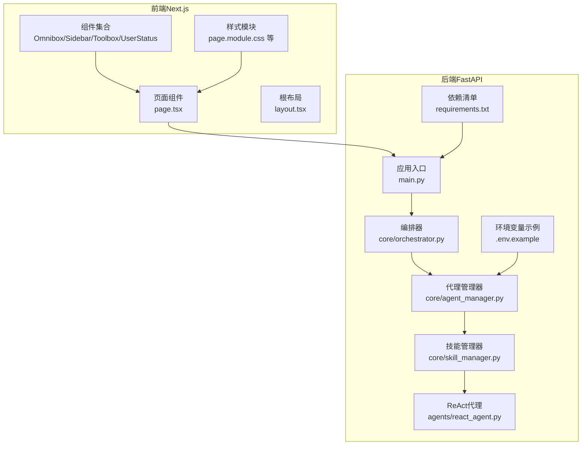
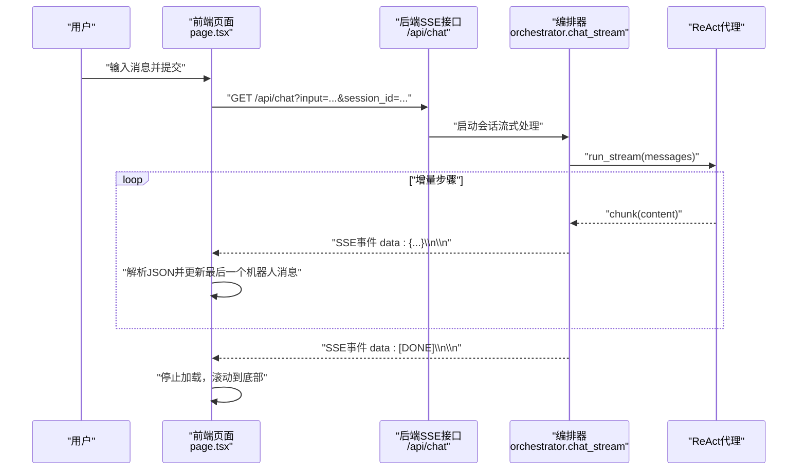
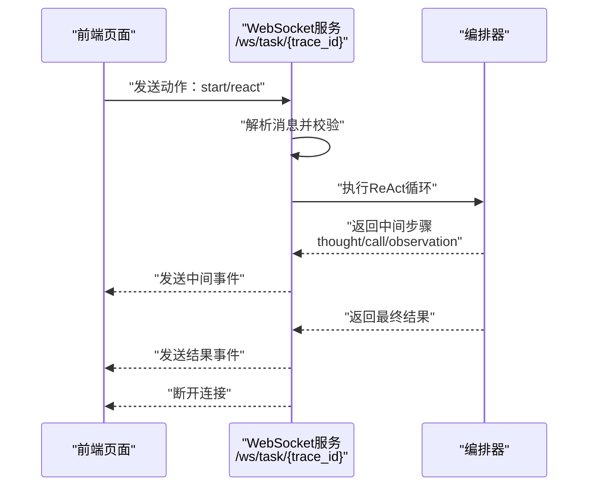
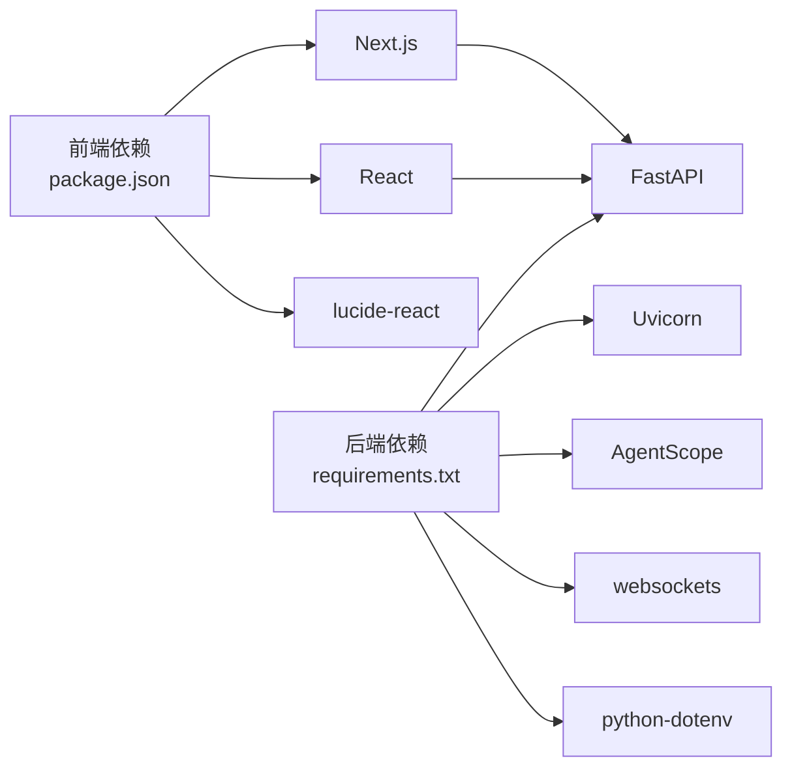

# 实时聊天界面

<cite>
**本文引用的文件**
- [localmanus-ui/app/page.tsx](file://localmanus-ui/app/page.tsx)
- [localmanus-ui/app/layout.tsx](file://localmanus-ui/app/layout.tsx)
- [localmanus-ui/app/components/Omnibox.tsx](file://localmanus-ui/app/components/Omnibox.tsx)
- [localmanus-ui/app/components/Sidebar.tsx](file://localmanus-ui/app/components/Sidebar.tsx)
- [localmanus-ui/app/components/Toolbox.tsx](file://localmanus-ui/app/components/Toolbox.tsx)
- [localmanus-ui/app/components/UserStatus.tsx](file://localmanus-ui/app/components/UserStatus.tsx)
- [localmanus-ui/app/page.module.css](file://localmanus-ui/app/page.module.css)
- [localmanus-ui/app/globals.css](file://localmanus-ui/app/globals.css)
- [localmanus-ui/app/components/omnibox.module.css](file://localmanus-ui/app/components/omnibox.module.css)
- [localmanus-ui/app/components/sidebar.module.css](file://localmanus-ui/app/components/sidebar.module.css)
- [localmanus-ui/app/components/toolbox.module.css](file://localmanus-ui/app/components/toolbox.module.css)
- [localmanus-ui/app/components/userStatus.module.css](file://localmanus-ui/app/components/userStatus.module.css)
- [localmanus-ui/package.json](file://localmanus-ui/package.json)
- [localmanus-backend/main.py](file://localmanus-backend/main.py)
- [localmanus-backend/core/orchestrator.py](file://localmanus-backend/core/orchestrator.py)
- [localmanus-backend/core/agent_manager.py](file://localmanus-backend/core/agent_manager.py)
- [localmanus-backend/core/skill_manager.py](file://localmanus-backend/core/skill_manager.py)
- [localmanus-backend/agents/react_agent.py](file://localmanus-backend/agents/react_agent.py)
- [localmanus-backend/.env.example](file://localmanus-backend/.env.example)
- [localmanus-backend/requirements.txt](file://localmanus-backend/requirements.txt)
</cite>

## 更新摘要
**所做更改**
- 重大简化前端聊天界面，移除复杂的多阶段渲染逻辑
- 改为直接流式内容追加到最后一个机器人消息
- 新增systemLog样式类用于系统消息的特殊显示
- 简化消息处理逻辑，专注于content类型的数据流
- 优化自动滚动性能，使用requestAnimationFrame确保DOM更新完成

## 目录
1. [简介](#简介)
2. [项目结构](#项目结构)
3. [核心组件](#核心组件)
4. [架构总览](#架构总览)
5. [详细组件分析](#详细组件分析)
6. [依赖关系分析](#依赖关系分析)
7. [性能考量](#性能考量)
8. [故障排查指南](#故障排查指南)
9. [结论](#结论)
10. [附录](#附录)

## 简介
本技术文档围绕实时聊天界面展开，重点解释基于 Server-Sent Events（SSE）的流式消息处理实现，涵盖连接建立、数据解析、错误处理；消息列表渲染、自动滚动、加载状态管理；以及 WebSocket 集成、实时状态更新与断线重连机制。同时提供交互设计与用户体验优化建议、性能监控策略、消息格式规范、安全考虑与调试技巧。

**更新** 本次更新重点关注聊天界面的重大简化：移除了复杂的多阶段渲染逻辑，改为直接流式内容追加到最后一个机器人消息，新增systemLog样式类用于系统消息的特殊显示。

## 项目结构
前端采用 Next.js 应用，后端基于 FastAPI 提供 SSE 与 WebSocket 接口。整体采用前后端分离架构，通过本地回环地址进行通信。



**图表来源**
- [localmanus-ui/app/page.tsx](file://localmanus-ui/app/page.tsx#L1-L239)
- [localmanus-ui/app/layout.tsx](file://localmanus-ui/app/layout.tsx#L1-L20)
- [localmanus-backend/main.py](file://localmanus-backend/main.py#L1-L153)
- [localmanus-backend/core/orchestrator.py](file://localmanus-backend/core/orchestrator.py#L1-L131)
- [localmanus-backend/core/agent_manager.py](file://localmanus-backend/core/agent_manager.py#L1-L44)
- [localmanus-backend/core/skill_manager.py](file://localmanus-backend/core/skill_manager.py#L1-L107)
- [localmanus-backend/agents/react_agent.py](file://localmanus-backend/agents/react_agent.py#L1-L269)
- [localmanus-backend/.env.example](file://localmanus-backend/.env.example#L1-L4)
- [localmanus-backend/requirements.txt](file://localmanus-backend/requirements.txt#L1-L8)

**章节来源**
- [localmanus-ui/app/page.tsx](file://localmanus-ui/app/page.tsx#L1-L239)
- [localmanus-ui/app/layout.tsx](file://localmanus-ui/app/layout.tsx#L1-L20)
- [localmanus-backend/main.py](file://localmanus-backend/main.py#L1-L153)

## 核心组件
- 前端页面与交互
  - 页面容器与消息列表渲染：负责消息数组的状态维护、自动滚动、加载状态切换与错误兜底。
  - 输入框组件：负责捕获用户输入、触发发送流程。
  - 侧边栏与工具箱：提供导航、新会话与模板能力。
- 后端服务
  - SSE 聊天接口：以事件流形式推送增量消息。
  - WebSocket 接口：用于任务跟踪与状态推送（演示用途）。
  - 编排器：维护会话历史、调用代理执行、生成流式响应。
  - 代理与技能：通过 AgentScope 初始化模型、格式化器与技能管理器，支持工具调用。

**更新** 新增了systemLog样式类用于系统消息的特殊显示，简化了消息处理逻辑。

**章节来源**
- [localmanus-ui/app/page.tsx](file://localmanus-ui/app/page.tsx#L11-L239)
- [localmanus-ui/app/components/Omnibox.tsx](file://localmanus-ui/app/components/Omnibox.tsx#L1-L69)
- [localmanus-ui/app/components/Sidebar.tsx](file://localmanus-ui/app/components/Sidebar.tsx#L1-L103)
- [localmanus-ui/app/components/Toolbox.tsx](file://localmanus-ui/app/components/Toolbox.tsx)
- [localmanus-ui/app/components/UserStatus.tsx](file://localmanus-ui/app/components/UserStatus.tsx)
- [localmanus-backend/main.py](file://localmanus-backend/main.py#L81-L96)
- [localmanus-backend/core/orchestrator.py](file://localmanus-backend/core/orchestrator.py#L16-L77)
- [localmanus-backend/core/agent_manager.py](file://localmanus-backend/core/agent_manager.py#L10-L44)
- [localmanus-backend/core/skill_manager.py](file://localmanus-backend/core/skill_manager.py#L29-L107)

## 架构总览
前端通过标准 Fetch 流读取后端 SSE 数据，逐条解析事件数据，按类型更新消息面板。后端在收到请求后，将用户输入与历史会话传递给 ReAct 代理，逐步产出"思考""工具调用""观察结果""最终答案"等增量内容，前端据此渲染。



**图表来源**
- [localmanus-ui/app/page.tsx](file://localmanus-ui/app/page.tsx#L39-L110)
- [localmanus-backend/main.py](file://localmanus-backend/main.py#L81-L96)
- [localmanus-backend/core/orchestrator.py](file://localmanus-backend/core/orchestrator.py#L52-L70)
- [localmanus-backend/agents/react_agent.py](file://localmanus-backend/agents/react_agent.py#L118-L200)

## 详细组件分析

### 前端：SSE 流式消息处理与渲染
- 连接建立与读取
  - 使用 fetch 获取可读流，通过 reader 逐块读取字节，解码为文本，按行切分。
  - 识别以"data: "开头的行，去除前缀后尝试解析为 JSON。
- 数据解析与消息更新
  - 支持content类型的数据流，直接追加到最后一个机器人消息。
  - 对于系统消息（以[Tool Use]、[Observation]、[Error]开头），应用systemLog样式类。
  - 简化了消息状态管理，不再维护thought、observation、call字段的独立状态。
- 自动滚动与加载状态
  - 每次消息数组变化时，使用requestAnimationFrame确保DOM更新完成后再滚动到最底部。
  - 发送前设置加载状态，接收完成后关闭。
- 错误处理
  - 网络异常或解析失败时，追加错误提示消息。
  - 后端返回错误类型时，前端将其展示为用户可读的错误信息。
- 会话管理
  - 使用随机sessionId区分不同对话，支持"新会话"按钮重置状态并生成新的会话标识。

**更新** 移除了复杂的多阶段渲染逻辑，改为直接流式内容追加到最后一个机器人消息，新增systemLog样式类用于系统消息的特殊显示。

```mermaid
flowchart TD
Start(["开始：用户提交消息"]) --> CallAPI["发起SSE请求<br/>GET /api/chat"]
CallAPI --> ReadStream["读取响应流<br/>reader.read()"]
ReadStream --> Decode["解码文本并按行分割"]
Decode --> HasData{"是否为data行？"}
HasData --> |否| ReadStream
HasData --> |是| ParseJSON["解析JSON"]
ParseJSON --> TypeCheck{"类型判断"}
TypeCheck --> |content| UpdateContent["更新最后一个机器人消息<br/>content字段追加"]
TypeCheck --> |error| ShowError["展示错误消息"]
UpdateContent --> SplitLines["按行分割内容"]
SplitLines --> CheckPrefix{"检查行前缀"}
CheckPrefix --> |[Tool Use]| ApplySystemLog["应用systemLog样式"]
CheckPrefix --> |[Observation]| ApplySystemLog
CheckPrefix --> |[Error]| ApplySystemLog
CheckPrefix --> |其他| NormalContent["普通内容显示"]
ApplySystemLog --> Scroll["使用requestAnimationFrame滚动至底部"]
NormalContent --> Scroll
ShowError --> Scroll
Scroll --> Done([结束：停止加载])
```

**图表来源**
- [localmanus-ui/app/page.tsx](file://localmanus-ui/app/page.tsx#L50-L110)
- [localmanus-ui/app/page.tsx](file://localmanus-ui/app/page.tsx#L176-L180)
- [localmanus-ui/app/page.module.css](file://localmanus-ui/app/page.module.css#L241-L250)

**章节来源**
- [localmanus-ui/app/page.tsx](file://localmanus-ui/app/page.tsx#L25-L110)
- [localmanus-ui/app/page.module.css](file://localmanus-ui/app/page.module.css#L241-L250)

### 后端：SSE 与 WebSocket 集成
- SSE 聊天接口
  - 路由：GET /api/chat，返回text/event-stream。
  - 会话管理：以session_id为键维护历史消息，限制最大轮数(防止无限增长)。
  - 流式输出：逐步产出content类型的数据流，最后发送[DONE]标记。
  - 异常处理：捕获运行时异常并以错误事件返回。
- WebSocket 任务流(演示)
  - 路由：/ws/task/{trace_id}，接受客户端动作(start/react)，在服务端模拟ReAct步骤并回传事件，最后发送结果。
  - 断线处理：捕获断开异常并记录日志。

**更新** ReAct代理现在支持更精确的事件类型检测，包括llm_response、thought、call、observation、result、error等类型。



**图表来源**
- [localmanus-backend/main.py](file://localmanus-backend/main.py#L116-L149)
- [localmanus-backend/core/orchestrator.py](file://localmanus-backend/core/orchestrator.py#L66-L81)
- [localmanus-backend/agents/react_agent.py](file://localmanus-backend/agents/react_agent.py#L12-L46)

**章节来源**
- [localmanus-backend/main.py](file://localmanus-backend/main.py#L81-L96)
- [localmanus-backend/main.py](file://localmanus-backend/main.py#L116-L149)
- [localmanus-backend/core/orchestrator.py](file://localmanus-backend/core/orchestrator.py#L16-L77)
- [localmanus-backend/agents/react_agent.py](file://localmanus-backend/agents/react_agent.py#L118-L257)

### 组件与样式：交互设计与用户体验
- 布局与动画
  - 主容器与内容区采用过渡动画，聊天模式下隐藏模板区域，突出消息面板。
  - 消息列表垂直滚动，气泡背景区分用户与机器人，支持systemLog样式类的特殊显示。
  - 简化了消息渲染逻辑，所有内容直接显示在消息气泡内。
- 输入与操作
  - Omnibox 支持回车提交、左右功能按钮，提供视觉反馈。
  - Sidebar 提供导航、新会话按钮与最近活动展示。
  - Toolbox 在非聊天模式下展示标签云，便于快速选择。
- 用户状态
  - 右上角用户状态组件展示操作与令牌徽章，便于查看与切换。

**更新** 新增了systemLog样式类用于系统消息的特殊显示，简化了消息渲染逻辑。

**章节来源**
- [localmanus-ui/app/page.module.css](file://localmanus-ui/app/page.module.css#L1-L404)
- [localmanus-ui/app/components/omnibox.module.css](file://localmanus-ui/app/components/omnibox.module.css#L1-L104)
- [localmanus-ui/app/components/sidebar.module.css](file://localmanus-ui/app/components/sidebar.module.css#L1-L204)
- [localmanus-ui/app/components/toolbox.module.css](file://localmanus-ui/app/components/toolbox.module.css#L1-L51)
- [localmanus-ui/app/components/userStatus.module.css](file://localmanus-ui/app/components/userStatus.module.css#L1-L62)
- [localmanus-ui/app/components/Omnibox.tsx](file://localmanus-ui/app/components/Omnibox.tsx#L1-L69)
- [localmanus-ui/app/components/Sidebar.tsx](file://localmanus-ui/app/components/Sidebar.tsx#L1-L103)
- [localmanus-ui/app/components/Toolbox.tsx](file://localmanus-ui/app/components/Toolbox.tsx)
- [localmanus-ui/app/components/UserStatus.tsx](file://localmanus-ui/app/components/UserStatus.tsx)

### 消息格式规范
- 事件行格式
  - 每条事件以"data: "开头，后跟JSON字符串，再以两个换行符结尾。
- 事件类型
  - content：机器人的回复内容片段，直接追加到最后一个机器人消息。
  - error：错误信息。
  - [DONE]：流结束标记，前端停止加载。
- 内容样式
  - systemLog样式类用于系统消息的特殊显示，包括[Tool Use]、[Observation]、[Error]等前缀的内容。

**更新** 移除了thought、call、observation等复杂类型，简化为单一的content类型数据流。

**章节来源**
- [localmanus-backend/core/orchestrator.py](file://localmanus-backend/core/orchestrator.py#L68-L69)
- [localmanus-ui/app/page.tsx](file://localmanus-ui/app/page.tsx#L85-L97)
- [localmanus-ui/app/page.module.css](file://localmanus-ui/app/page.module.css#L241-L250)

### 安全考虑
- CORS 配置
  - 后端已启用跨域访问，允许任意源、方法与头部，便于开发阶段联调。生产环境建议限定具体域名与方法。
- 认证与授权
  - 当前未实现认证与授权机制，建议在路由层增加鉴权中间件与会话校验。
- 输入验证
  - 建议对输入长度、字符集与敏感词进行过滤，避免滥用与注入风险。
- 传输安全
  - 建议在生产环境中启用HTTPS与安全的WebSocket协议(wss)。

**章节来源**
- [localmanus-backend/main.py](file://localmanus-backend/main.py#L26-L33)

### 性能监控与优化
- 前端
  - 消息渲染：仅更新最新消息，避免全量重绘；长文本分行渲染，减少DOM节点数量。
  - 加载状态：在请求期间显示加载指示，避免重复提交。
  - 自动滚动：使用requestAnimationFrame确保DOM更新完成后再滚动，避免频繁滚动导致的卡顿。
  - 简化了消息状态管理，减少了不必要的状态更新。
- 后端
  - 会话上限：限制历史消息轮数，防止内存膨胀。
  - 流式输出：按步骤推送，降低首屏延迟。
  - 日志：记录关键事件与异常，便于定位问题。
- 网络
  - SSE 与 WebSocket 复用同一后端实例，注意并发连接数与资源占用。

**更新** 新增了requestAnimationFrame的使用来优化自动滚动性能，并简化了消息状态管理的效率。

**章节来源**
- [localmanus-backend/core/orchestrator.py](file://localmanus-backend/core/orchestrator.py#L34-L37)
- [localmanus-ui/app/page.tsx](file://localmanus-ui/app/page.tsx#L25-L37)
- [localmanus-backend/main.py](file://localmanus-backend/main.py#L116-L149)

### 调试技巧
- 前端
  - 打印事件行与解析结果，确认类型与内容是否符合预期。
  - 检查网络面板中的SSE流，确认事件顺序与完整性。
  - 在错误分支中添加更详细的日志，定位异常来源。
  - 使用systemLog样式类调试系统消息的显示效果。
- 后端
  - 查看日志输出，确认会话创建、历史注入与异常捕获。
  - 使用最小输入复现问题，逐步排除代理链路中的环节。
  - 监控ReAct代理的事件类型检测准确性。
- 环境配置
  - 确认OPENAI_API_KEY、OPENAI_API_BASE、MODEL_NAME等环境变量正确。
  - 检查代理模型可用性与网络连通性。

**更新** 新增了针对systemLog样式类和简化消息处理的调试技巧。

**章节来源**
- [localmanus-backend/.env.example](file://localmanus-backend/.env.example#L1-L4)
- [localmanus-backend/core/agent_manager.py](file://localmanus-backend/core/agent_manager.py#L16-L20)
- [localmanus-backend/requirements.txt](file://localmanus-backend/requirements.txt#L1-L8)

## 依赖关系分析
- 前端依赖
  - Next.js、React、lucide-react 等，提供 UI 渲染与图标支持。
- 后端依赖
  - FastAPI、Uvicorn、AgentScope、Pydantic、websockets、python-dotenv 等，支撑 API、流式处理与代理框架。
- 组件耦合
  - 前端页面与后端 SSE/WS 接口松耦合，通过约定的数据格式进行交互。
  - 后端编排器与代理管理器、技能管理器形成清晰职责边界。



**图表来源**
- [localmanus-ui/package.json](file://localmanus-ui/package.json#L11-L24)
- [localmanus-backend/requirements.txt](file://localmanus-backend/requirements.txt#L1-L8)

**章节来源**
- [localmanus-ui/package.json](file://localmanus-ui/package.json#L1-L26)
- [localmanus-backend/requirements.txt](file://localmanus-backend/requirements.txt#L1-L8)

## 性能考量
- 前端渲染优化
  - 使用React key保证列表稳定更新；对长文本进行分段渲染。
  - 控制消息数组长度，避免无界增长。
  - 新增了requestAnimationFrame优化自动滚动性能。
  - 简化了消息渲染逻辑，减少了DOM操作次数。
- 网络与流控
  - SSE 事件按步骤推送，前端按需渲染，降低一次性渲染压力。
  - WebSocket 仅在需要实时状态时使用，避免不必要的连接。
- 后端资源
  - 限制会话轮数与消息长度，定期清理过期会话。
  - 代理调用外部模型时，合理设置超时与重试策略。

**更新** 新增了针对简化消息处理的性能优化策略。

## 故障排查指南
- 前端常见问题
  - 无法接收事件：检查网络面板与控制台错误；确认后端返回正确的事件格式。
  - 显示异常：核对消息类型映射与 UI 渲染逻辑；确保错误类型被正确处理。
  - 自动滚动失效：确认消息数组变更触发了滚动逻辑；检查requestAnimationFrame的使用。
  - systemLog样式不生效：检查CSS类名与样式定义。
- 后端常见问题
  - SSE 不断开：检查[DONE]是否正确发送；确认异常分支是否返回错误事件。
  - WebSocket 断开：查看断开异常日志；确认客户端是否主动断开。
  - 代理不可用：检查环境变量与模型服务连通性；查看AgentScope初始化日志。
  - 事件类型错误：检查ReAct代理的事件类型检测逻辑。
- 环境与部署
  - 端口冲突：确认后端监听端口与前端请求一致。
  - CORS 报错：检查后端CORS配置；生产环境限制来源域名。

**更新** 新增了针对systemLog样式类和简化消息处理的故障排查指导。

**章节来源**
- [localmanus-ui/app/page.tsx](file://localmanus-ui/app/page.tsx#L104-L109)
- [localmanus-backend/main.py](file://localmanus-backend/main.py#L147-L149)
- [localmanus-backend/core/orchestrator.py](file://localmanus-backend/core/orchestrator.py#L73-L76)

## 结论
该实时聊天界面通过 SSE 实现流畅的增量消息展示，结合前端自动滚动与加载状态管理，提供了良好的用户体验。后端以编排器为核心，串联代理与技能，支持工具调用与多轮对话。WebSocket 作为补充通道，可用于任务追踪与状态推送。本次更新显著简化了聊天界面的复杂度，移除了多阶段渲染逻辑，改为直接流式内容追加到最后一个机器人消息，新增systemLog样式类用于系统消息的特殊显示。这种简化不仅提高了代码的可维护性，也改善了用户的阅读体验。后续可在认证、CORS 限制、输入校验与性能监控方面进一步完善，以满足生产环境需求。

## 附录
- 快速启动
  - 后端：安装依赖并运行，确保模型服务可达。
  - 前端：安装依赖并启动开发服务器，访问页面进行测试。
- 常用命令
  - 后端：uvicorn 运行主程序。
  - 前端：npm run dev 启动开发服务器。

**章节来源**
- [localmanus-backend/requirements.txt](file://localmanus-backend/requirements.txt#L1-L8)
- [localmanus-ui/package.json](file://localmanus-ui/package.json#L5-L10)