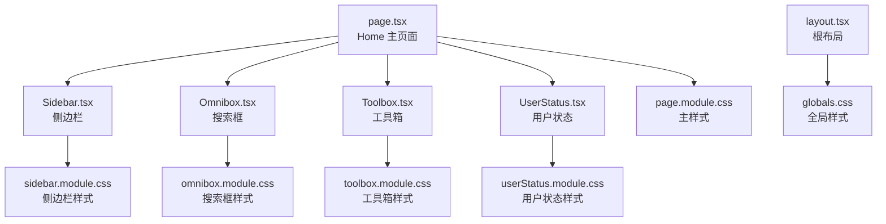
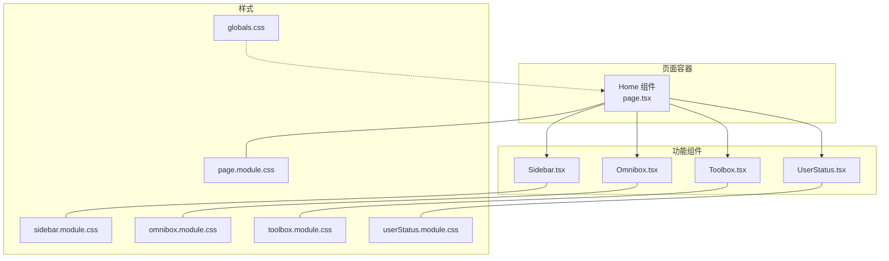
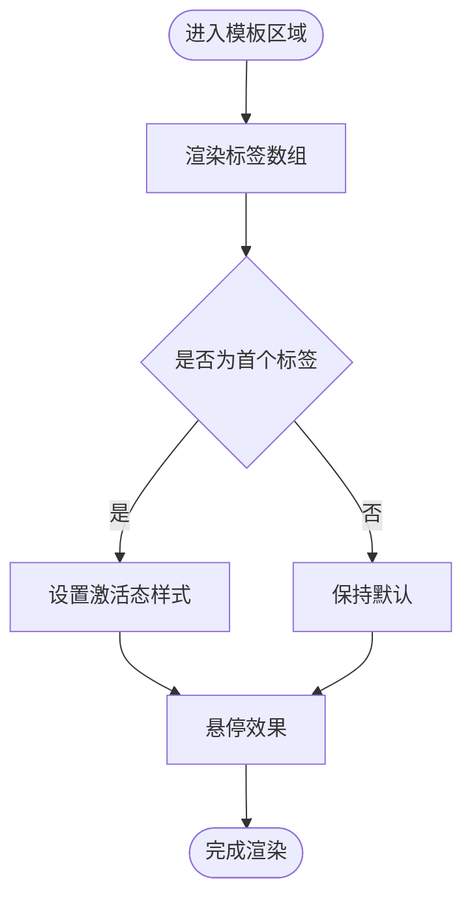
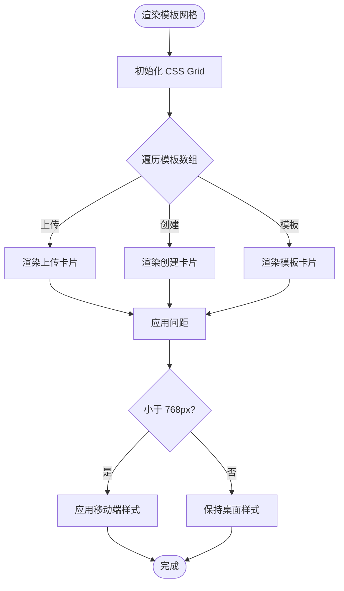
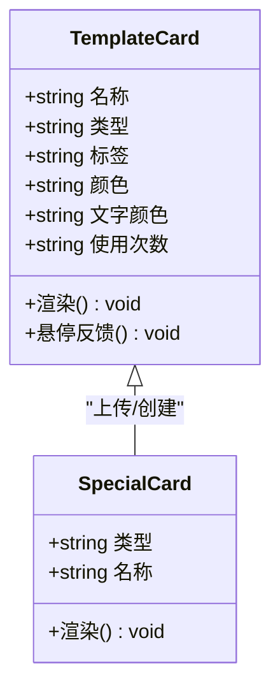
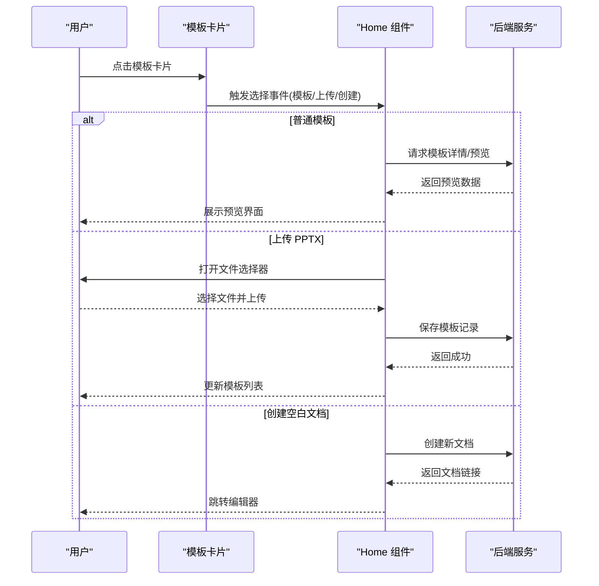
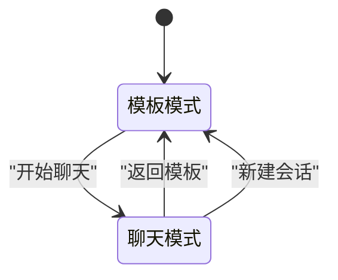
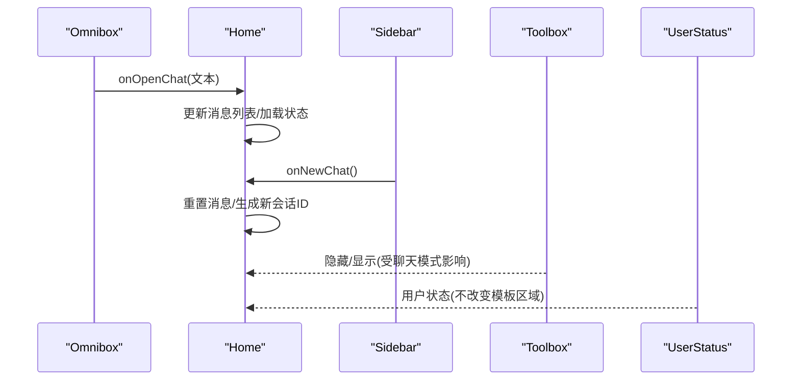
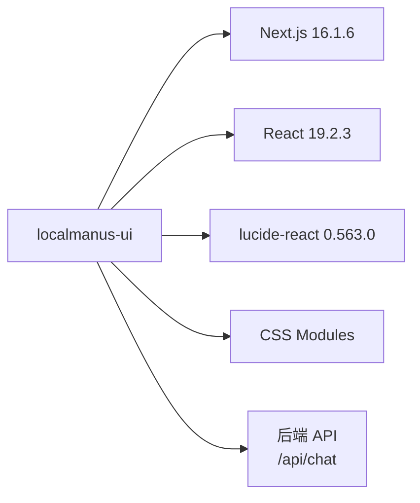

# 模板系统界面

<cite>
**本文档引用的文件**
- [page.tsx](file://localmanus-ui/app/page.tsx)
- [layout.tsx](file://localmanus-ui/app/layout.tsx)
- [globals.css](file://localmanus-ui/app/globals.css)
- [page.module.css](file://localmanus-ui/app/page.module.css)
- [Sidebar.tsx](file://localmanus-ui/app/components/Sidebar.tsx)
- [Omnibox.tsx](file://localmanus-ui/app/components/Omnibox.tsx)
- [Toolbox.tsx](file://localmanus-ui/app/components/Toolbox.tsx)
- [UserStatus.tsx](file://localmanus-ui/app/components/UserStatus.tsx)
- [sidebar.module.css](file://localmanus-ui/app/components/sidebar.module.css)
- [omnibox.module.css](file://localmanus-ui/app/components/omnibox.module.css)
- [toolbox.module.css](file://localmanus-ui/app/components/toolbox.module.css)
- [userStatus.module.css](file://localmanus-ui/app/components/userStatus.module.css)
- [package.json](file://localmanus-ui/package.json)
</cite>

## 目录
1. [简介](#简介)
2. [项目结构](#项目结构)
3. [核心组件](#核心组件)
4. [架构总览](#架构总览)
5. [详细组件分析](#详细组件分析)
6. [依赖关系分析](#依赖关系分析)
7. [性能考虑](#性能考虑)
8. [故障排除指南](#故障排除指南)
9. [结论](#结论)
10. [附录](#附录)

## 简介
本文件面向模板系统界面的技术文档，聚焦于模板分类导航设计（标签页切换）、模板网格布局与响应式适配、模板卡片展示逻辑（含特殊模板类型、使用统计与交互反馈）、模板选择流程与预览机制、创建选项，以及系统的扩展性设计、自定义模板支持与性能优化策略，并提供用户体验设计原则与无障碍访问支持建议。

## 项目结构
模板系统界面位于 Next.js 应用的客户端页面中，采用模块化组件与 CSS Modules 的组织方式：
- 页面入口：Home 组件负责模板导航、网格渲染与聊天模式切换
- 布局与全局样式：RootLayout 提供语言与元数据，globals.css 定义全局变量与基础样式
- 组件层：Sidebar、Omnibox、Toolbox、UserStatus 分别承担侧边栏、搜索框、工具箱与用户状态功能
- 样式层：page.module.css 负责主页面布局与模板区域样式；各组件拥有独立的样式模块

图表来源
- [page.tsx](file://localmanus-ui/app/page.tsx#L1-L285)
- [layout.tsx](file://localmanus-ui/app/layout.tsx#L1-L20)
- [globals.css](file://localmanus-ui/app/globals.css#L1-L57)
- [page.module.css](file://localmanus-ui/app/page.module.css#L1-L345)
- [Sidebar.tsx](file://localmanus-ui/app/components/Sidebar.tsx#L1-L103)
- [Omnibox.tsx](file://localmanus-ui/app/components/Omnibox.tsx#L1-L63)
- [Toolbox.tsx](file://localmanus-ui/app/components/Toolbox.tsx#L1-L42)
- [UserStatus.tsx](file://localmanus-ui/app/components/UserStatus.tsx#L1-L32)

章节来源
- [page.tsx](file://localmanus-ui/app/page.tsx#L1-L285)
- [layout.tsx](file://localmanus-ui/app/layout.tsx#L1-L20)
- [globals.css](file://localmanus-ui/app/globals.css#L1-L57)

## 核心组件
- Home 主页面（page.tsx）
  - 状态管理：聊天模式开关、消息列表、加载状态、会话 ID
  - 模板导航：标签页数组与激活态样式
  - 模板网格：模板卡片数据与渲染
  - 事件处理：发送消息、新建会话
- Sidebar（Sidebar.tsx）
  - 导航项、新会话按钮、最近活动、资源库等
- Omnibox（Omnibox.tsx）
  - 输入框、快捷操作按钮、回车提交
- Toolbox（Toolbox.tsx）
  - 工具标签集合，支持隐藏/显示
- UserStatus（UserStatus.tsx）
  - 分享、日历、通知、令牌徽章与头像

章节来源
- [page.tsx](file://localmanus-ui/app/page.tsx#L1-L285)
- [Sidebar.tsx](file://localmanus-ui/app/components/Sidebar.tsx#L1-L103)
- [Omnibox.tsx](file://localmanus-ui/app/components/Omnibox.tsx#L1-L63)
- [Toolbox.tsx](file://localmanus-ui/app/components/Toolbox.tsx#L1-L42)
- [UserStatus.tsx](file://localmanus-ui/app/components/UserStatus.tsx#L1-L32)

## 架构总览
模板系统界面采用“页面容器 + 多个功能组件”的组合架构，通过 CSS Modules 实现样式隔离，通过状态驱动模板网格与聊天模式的切换。

图表来源
- [page.tsx](file://localmanus-ui/app/page.tsx#L1-L285)
- [Sidebar.tsx](file://localmanus-ui/app/components/Sidebar.tsx#L1-L103)
- [Omnibox.tsx](file://localmanus-ui/app/components/Omnibox.tsx#L1-L63)
- [Toolbox.tsx](file://localmanus-ui/app/components/Toolbox.tsx#L1-L42)
- [UserStatus.tsx](file://localmanus-ui/app/components/UserStatus.tsx#L1-L32)
- [page.module.css](file://localmanus-ui/app/page.module.css#L1-L345)
- [sidebar.module.css](file://localmanus-ui/app/components/sidebar.module.css#L1-L204)
- [omnibox.module.css](file://localmanus-ui/app/components/omnibox.module.css#L1-L102)
- [toolbox.module.css](file://localmanus-ui/app/components/toolbox.module.css#L1-L51)
- [userStatus.module.css](file://localmanus-ui/app/components/userStatus.module.css#L1-L62)
- [globals.css](file://localmanus-ui/app/globals.css#L1-L57)

## 详细组件分析

### 模板分类导航设计
- 标签页结构
  - 数据源：标签数组，包含“全部模板”“创意与设计”“通用”“营销增长”“产品调研”“市场推广”“学习与成长”“求职发展”“我的模板”
  - 渲染：循环输出每个标签，第一个标签标记为激活态
  - 交互：当前实现为静态展示，未绑定点击切换逻辑；可扩展为状态切换与路由联动
- 样式要点
  - 水平排列、底部分隔线、悬停与激活态颜色变化
  - 激活态下划线指示器
  - “我的模板”标签带闪烁装饰元素

图表来源
- [page.tsx](file://localmanus-ui/app/page.tsx#L167-L252)
- [page.module.css](file://localmanus-ui/app/page.module.css#L193-L230)

章节来源
- [page.tsx](file://localmanus-ui/app/page.tsx#L167-L252)
- [page.module.css](file://localmanus-ui/app/page.module.css#L193-L230)

### 模板网格布局与响应式适配
- 布局
  - CSS Grid：列数自适应，最小宽度 220px，间距 20px
  - 卡片：垂直方向堆叠，悬停提升效果
- 特殊卡片类型
  - 上传 PPTX：展示 P 图标
  - 创建空白文档：展示蓝色圆形加号图标
  - 普通模板：占位图背景（渐变）
- 响应式
  - 小屏设备：内容区左右内边距减少，侧边栏宽度变量移除

图表来源
- [page.tsx](file://localmanus-ui/app/page.tsx#L169-L180)
- [page.tsx](file://localmanus-ui/app/page.tsx#L254-L278)
- [page.module.css](file://localmanus-ui/app/page.module.css#L235-L340)

章节来源
- [page.tsx](file://localmanus-ui/app/page.tsx#L169-L180)
- [page.tsx](file://localmanus-ui/app/page.tsx#L254-L278)
- [page.module.css](file://localmanus-ui/app/page.module.css#L235-L340)

### 模板卡片展示逻辑
- 数据模型
  - 普通模板：名称、标签、颜色、文字颜色、使用次数
  - 特殊模板：上传 PPTX、创建空白文档
- 展示规则
  - 普通模板：显示标签色块与使用次数
  - 特殊模板：使用专用图标区域
- 交互反馈
  - 卡片悬停轻微上移，提供触感反馈
  - 可扩展点击事件以触发选择/预览/创建

图表来源
- [page.tsx](file://localmanus-ui/app/page.tsx#L169-L180)
- [page.tsx](file://localmanus-ui/app/page.tsx#L254-L278)
- [page.module.css](file://localmanus-ui/app/page.module.css#L242-L338)

章节来源
- [page.tsx](file://localmanus-ui/app/page.tsx#L169-L180)
- [page.tsx](file://localmanus-ui/app/page.tsx#L254-L278)
- [page.module.css](file://localmanus-ui/app/page.module.css#L242-L338)

### 模板选择流程、预览机制与创建选项
- 选择流程
  - 当前实现：模板卡片为静态展示，未绑定点击事件
  - 扩展建议：为模板卡片添加点击回调，区分“预览”“创建”“上传”三类行为
- 预览机制
  - 可在点击后打开预览弹窗或新页面，展示模板缩略图与描述
- 创建选项
  - 上传 PPTX：触发文件选择与上传流程
  - 创建空白文档：调用后端接口或本地模板引擎生成新文档

图表来源
- [page.tsx](file://localmanus-ui/app/page.tsx#L1-L285)

章节来源
- [page.tsx](file://localmanus-ui/app/page.tsx#L1-L285)

### 聊天模式与模板区域的协同
- 切换逻辑
  - 进入聊天模式时，标题与模板区域淡出隐藏，聊天界面淡入并占据空间
  - 新建会话重置状态与会话 ID
- 样式控制
  - 通过类名切换实现过渡动画与可见性控制

图表来源
- [page.tsx](file://localmanus-ui/app/page.tsx#L11-L165)
- [page.module.css](file://localmanus-ui/app/page.module.css#L28-L101)

章节来源
- [page.tsx](file://localmanus-ui/app/page.tsx#L11-L165)
- [page.module.css](file://localmanus-ui/app/page.module.css#L28-L101)

### 组件间数据流与事件流
- Home 组件持有模板数据与标签状态，向子组件传递 props
- 子组件通过回调向上层传递用户操作（如新会话、搜索提交）

图表来源
- [Omnibox.tsx](file://localmanus-ui/app/components/Omnibox.tsx#L1-L63)
- [Sidebar.tsx](file://localmanus-ui/app/components/Sidebar.tsx#L1-L103)
- [Toolbox.tsx](file://localmanus-ui/app/components/Toolbox.tsx#L1-L42)
- [UserStatus.tsx](file://localmanus-ui/app/components/UserStatus.tsx#L1-L32)
- [page.tsx](file://localmanus-ui/app/page.tsx#L1-L285)

章节来源
- [Omnibox.tsx](file://localmanus-ui/app/components/Omnibox.tsx#L1-L63)
- [Sidebar.tsx](file://localmanus-ui/app/components/Sidebar.tsx#L1-L103)
- [Toolbox.tsx](file://localmanus-ui/app/components/Toolbox.tsx#L1-L42)
- [UserStatus.tsx](file://localmanus-ui/app/components/UserStatus.tsx#L1-L32)
- [page.tsx](file://localmanus-ui/app/page.tsx#L1-L285)

## 依赖关系分析
- 技术栈
  - 前端框架：Next.js 16.1.6
  - React 19.2.3
  - 图标库：lucide-react 0.563.0
  - 样式：CSS Modules（page.module.css 及各组件样式）
- 外部集成点
  - 后端聊天接口：通过 fetch 调用 http://localhost:8000/api/chat
  - 会话管理：随机生成会话 ID

图表来源
- [package.json](file://localmanus-ui/package.json#L1-L26)
- [page.tsx](file://localmanus-ui/app/page.tsx#L43-L44)

章节来源
- [package.json](file://localmanus-ui/package.json#L1-L26)
- [page.tsx](file://localmanus-ui/app/page.tsx#L43-L44)

## 性能考虑
- 渲染优化
  - 模板网格使用 CSS Grid，避免复杂 JS 计算
  - 卡片悬停使用 transform，仅触发合成层动画
- 状态管理
  - 将模板数据与标签状态集中管理，减少重复渲染
  - 对聊天模式切换使用类名切换而非重新挂载组件
- 网络与接口
  - 聊天接口采用流式读取，按数据片段增量更新 UI，降低首屏等待
- 响应式
  - 在小屏设备上减少内边距与侧边栏占用，提升可读性与滚动体验

章节来源
- [page.module.css](file://localmanus-ui/app/page.module.css#L235-L340)
- [page.tsx](file://localmanus-ui/app/page.tsx#L25-L29)
- [page.tsx](file://localmanus-ui/app/page.tsx#L49-L152)

## 故障排除指南
- 聊天接口不可用
  - 现象：网络请求失败，UI 显示错误提示
  - 排查：确认后端服务运行状态与端口可达
  - 影响范围：Home 组件的 handleSendMessage
- 模板网格不显示
  - 现象：模板卡片为空
  - 排查：检查模板数据结构与渲染逻辑
  - 影响范围：Home 组件的模板数组与渲染循环
- 响应式样式异常
  - 现象：小屏设备布局错乱
  - 排查：确认媒体查询与容器宽度变量
  - 影响范围：page.module.css 的媒体查询

章节来源
- [page.tsx](file://localmanus-ui/app/page.tsx#L43-L47)
- [page.tsx](file://localmanus-ui/app/page.tsx#L169-L180)
- [page.module.css](file://localmanus-ui/app/page.module.css#L340-L345)

## 结论
模板系统界面以清晰的模块化结构与直观的视觉层次呈现模板导航与网格展示。当前实现侧重静态数据与基础交互，后续可在以下方面深化：标签页切换状态、模板卡片点击事件与预览、上传与创建流程、以及与后端接口的完整对接。同时，通过 CSS Grid 与 transform 动画保证了良好的性能与可维护性。

## 附录
- 用户体验设计原则
  - 一致性：标签与卡片风格统一，交互反馈一致
  - 可发现性：标签页与工具箱明确表达功能意图
  - 容错性：输入校验与错误提示，避免无效操作
  - 可访问性：为键盘导航与屏幕阅读器提供语义化标签与焦点管理
- 无障碍访问支持建议
  - 为按钮与链接提供可读的 aria-label
  - 确保键盘可操作性（Tab 键顺序、Enter 触发）
  - 为图片占位符提供替代文本（如适用）
  - 控制动画时长，避免引发眩晕