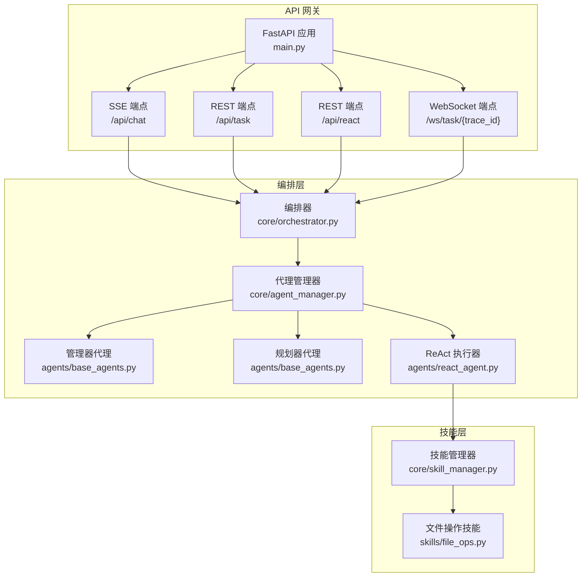
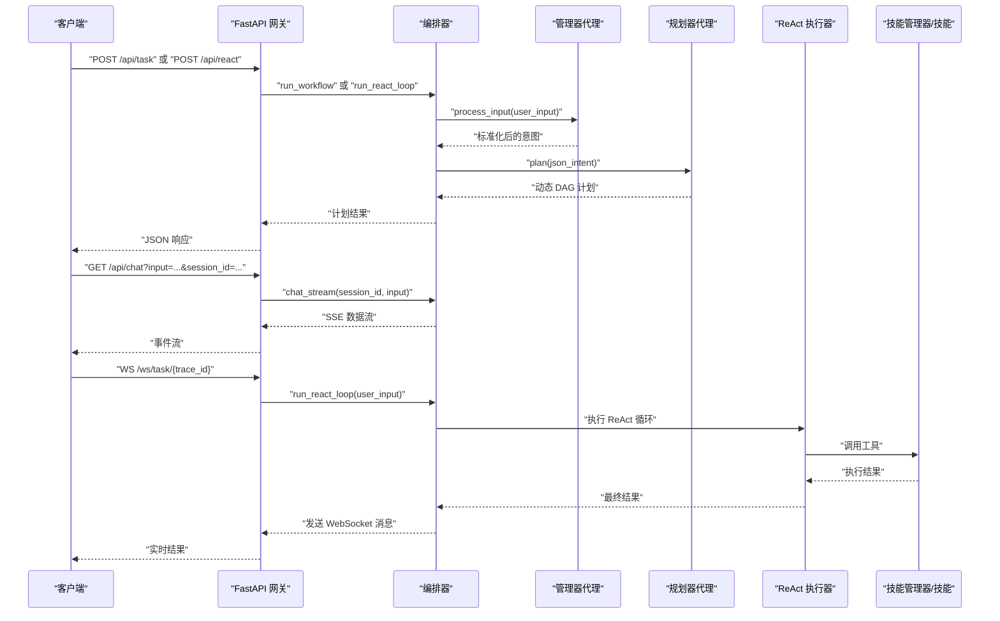
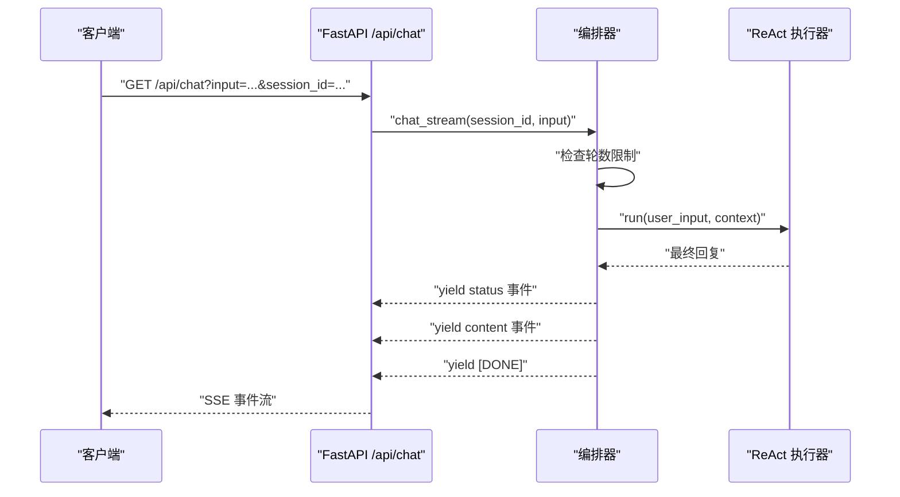
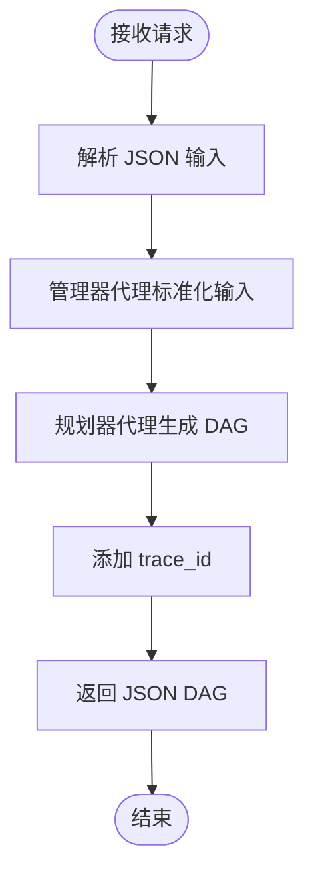
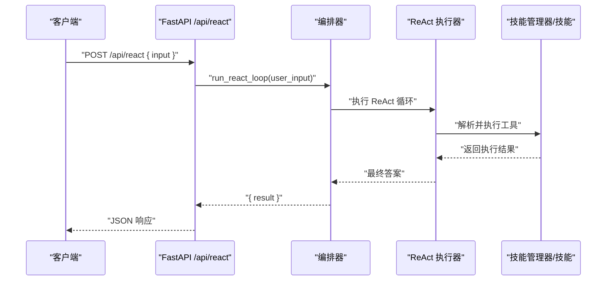
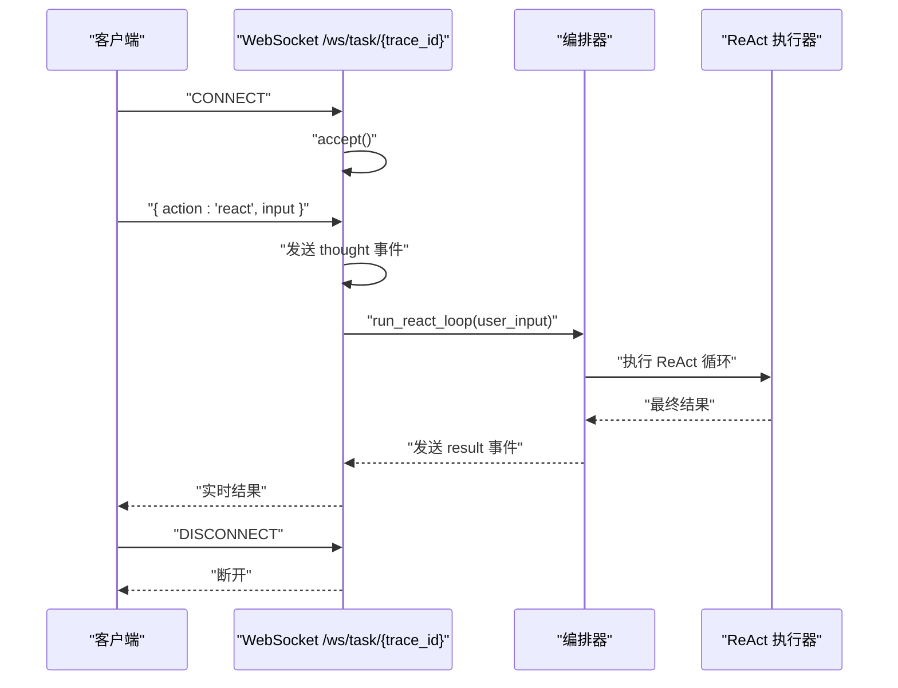
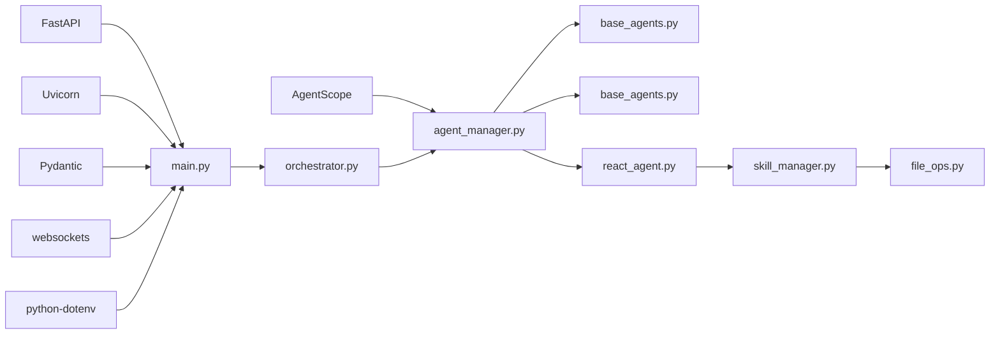

# API 端点设计

<cite>
**本文档引用的文件**
- [main.py](file://localmanus-backend/main.py)
- [orchestrator.py](file://localmanus-backend/core/orchestrator.py)
- [agent_manager.py](file://localmanus-backend/core/agent_manager.py)
- [react_agent.py](file://localmanus-backend/agents/react_agent.py)
- [base_agents.py](file://localmanus-backend/agents/base_agents.py)
- [skill_manager.py](file://localmanus-backend/core/skill_manager.py)
- [file_ops.py](file://localmanus-backend/skills/file_ops.py)
- [prompts.py](file://localmanus-backend/core/prompts.py)
- [requirements.txt](file://localmanus-backend/requirements.txt)
- [localmanus_architecture.md](file://localmanus_architecture.md)
- [.env.example](file://localmanus-backend/.env.example)
</cite>

## 目录
1. [简介](#简介)
2. [项目结构](#项目结构)
3. [核心组件](#核心组件)
4. [架构总览](#架构总览)
5. [详细端点分析](#详细端点分析)
6. [依赖关系分析](#依赖关系分析)
7. [性能考虑](#性能考虑)
8. [故障排除指南](#故障排除指南)
9. [结论](#结论)

## 简介
本文件面向 LocalManus 后端 API 的使用者与集成者，系统性梳理 RESTful 与 WebSocket 端点的设计理念、参数规范、请求/响应格式与典型使用场景。重点覆盖：
- /api/chat（SSE 多轮对话）
- /api/task（任务规划）
- /api/react（ReAct 循环执行）
- /ws/task/{trace_id}（WebSocket 实时通信）

同时给出错误处理策略、状态码说明与客户端集成建议，帮助开发者快速、稳定地接入系统。

## 项目结构
后端采用 FastAPI 作为 API 网关，结合 AgentScope 的多智能体编排能力，形成“意图解析 → 动态规划 → 技能执行”的闭环。核心模块职责如下：
- main.py：定义路由、CORS、SSE 与 WebSocket 端点
- core/orchestrator.py：编排器，负责会话管理、SSE 流式输出、工作流执行
- core/agent_manager.py：AgentScope 初始化与全局代理实例管理
- agents/base_agents.py：管理器与规划器代理（基于 ReActAgent）
- agents/react_agent.py：ReAct 循环执行器，支持工具调用
- core/skill_manager.py：技能注册与动态加载
- skills/file_ops.py：示例技能（文件读写、目录列举）
- core/prompts.py：系统提示词模板
- requirements.txt：依赖清单
- localmanus_architecture.md：整体架构与执行链路说明
- .env.example：环境变量示例

图表来源
- [main.py](file://localmanus-backend/main.py#L1-L95)
- [orchestrator.py](file://localmanus-backend/core/orchestrator.py#L1-L118)
- [agent_manager.py](file://localmanus-backend/core/agent_manager.py#L1-L44)
- [base_agents.py](file://localmanus-backend/agents/base_agents.py#L1-L42)
- [react_agent.py](file://localmanus-backend/agents/react_agent.py#L1-L108)
- [skill_manager.py](file://localmanus-backend/core/skill_manager.py#L1-L84)
- [file_ops.py](file://localmanus-backend/skills/file_ops.py#L1-L41)

章节来源
- [main.py](file://localmanus-backend/main.py#L1-L95)
- [orchestrator.py](file://localmanus-backend/core/orchestrator.py#L1-L118)
- [agent_manager.py](file://localmanus-backend/core/agent_manager.py#L1-L44)
- [base_agents.py](file://localmanus-backend/agents/base_agents.py#L1-L42)
- [react_agent.py](file://localmanus-backend/agents/react_agent.py#L1-L108)
- [skill_manager.py](file://localmanus-backend/core/skill_manager.py#L1-L84)
- [file_ops.py](file://localmanus-backend/skills/file_ops.py#L1-L41)
- [prompts.py](file://localmanus-backend/core/prompts.py#L1-L53)
- [requirements.txt](file://localmanus-backend/requirements.txt#L1-L8)
- [localmanus_architecture.md](file://localmanus_architecture.md#L1-L137)
- [.env.example](file://localmanus-backend/.env.example#L1-L4)

## 核心组件
- 编排器（Orchestrator）
  - 负责会话历史管理、SSE 流式输出、工作流执行与 JSON 提取
  - 关键方法：chat_stream、run_workflow、_extract_json
- 代理管理器（AgentLifecycleManager）
  - 初始化 AgentScope 模型、格式化器、内存与代理实例
  - 提供全局代理工厂函数 init_agents
- ReAct 执行器（ReActAgent）
  - 支持思考-行动-观察循环，解析并执行工具调用
  - 通过 SkillManager 获取技能并执行
- 技能管理器（SkillManager）
  - 动态扫描 skills 目录，加载技能类，提供工具元数据
- 示例技能（FileOps）
  - 文件读取、写入、目录列举等基础能力

章节来源
- [orchestrator.py](file://localmanus-backend/core/orchestrator.py#L1-L118)
- [agent_manager.py](file://localmanus-backend/core/agent_manager.py#L1-L44)
- [react_agent.py](file://localmanus-backend/agents/react_agent.py#L1-L108)
- [skill_manager.py](file://localmanus-backend/core/skill_manager.py#L1-L84)
- [file_ops.py](file://localmanus-backend/skills/file_ops.py#L1-L41)

## 架构总览
LocalManus 采用“意图解析 → 动态规划 → 技能执行”的多智能体编排架构。前端通过 SSE 或 WebSocket 与后端交互，后端通过 AgentScope 的管理器与规划器生成动态任务 DAG，并由 ReAct 执行器驱动技能完成具体任务。

图表来源
- [main.py](file://localmanus-backend/main.py#L30-L91)
- [orchestrator.py](file://localmanus-backend/core/orchestrator.py#L65-L80)
- [base_agents.py](file://localmanus-backend/agents/base_agents.py#L19-L40)
- [react_agent.py](file://localmanus-backend/agents/react_agent.py#L53-L107)
- [skill_manager.py](file://localmanus-backend/core/skill_manager.py#L72-L83)

## 详细端点分析

### /api/chat（SSE 多轮对话）
- 方法与路径
  - GET /api/chat
- 功能
  - 提供多轮对话的 Server-Sent Events 流，支持会话历史与上限控制
- 请求参数
  - input: 用户输入文本（必填）
  - session_id: 会话标识符，默认值为 "default"
- 响应格式（SSE）
  - 文本事件流，事件类型为 data，内容为 JSON 对象
  - 支持的状态事件：
    - type: "status"，content: "Thinking..."（开始推理）
    - type: "content"，content: "<最终回复>"（推理结束）
    - type: "error"，content: "<错误信息>"（异常或达到最大轮数）
  - 结束标记：data: [DONE]
- 会话与限制
  - 每个 session_id 维护独立的历史记录
  - 最大轮数限制：20（即 10 轮用户+AI 交互）
- 使用示例（客户端伪代码）
  - 创建 EventSource 连接
  - 监听 message 事件，解析 data 字段中的 JSON
  - 当收到 [DONE] 时停止监听
- 错误处理
  - 达到最大轮数：返回 error 事件
  - 异常：返回 error 事件，内容为异常字符串
- 端点实现要点
  - 使用 StreamingResponse 返回 text/event-stream
  - 通过 Orchestrator.chat_stream 生成事件流
  - ReActAgent 用于生成回复，但当前包装层未实现字符级流式输出

图表来源
- [main.py](file://localmanus-backend/main.py#L30-L38)
- [orchestrator.py](file://localmanus-backend/core/orchestrator.py#L13-L64)
- [react_agent.py](file://localmanus-backend/agents/react_agent.py#L53-L107)

章节来源
- [main.py](file://localmanus-backend/main.py#L30-L38)
- [orchestrator.py](file://localmanus-backend/core/orchestrator.py#L13-L64)

### /api/task（任务规划）
- 方法与路径
  - POST /api/task
- 功能
  - 同步执行任务规划流程，返回动态任务 DAG
- 请求体
  - JSON 对象，字段：
    - input: 用户输入文本（必填）
- 响应
  - JSON 对象，包含 trace_id 与 plan（步骤列表）
  - plan 中每个步骤包含：
    - step_id: 步骤编号
    - skill: 技能名称
    - args: 参数映射（可能包含依赖输出占位符）
    - dependencies: 依赖步骤列表
- 使用示例（客户端伪代码）
  - 发送 POST /api/task，Body: { "input": "将 test.txt 转换为 docx" }
  - 解析返回的 DAG，按顺序执行各步骤
- 端点实现要点
  - 通过 Orchestrator.run_workflow 完成：
    - 管理器代理标准化输入
    - 规划器代理生成 DAG
    - 添加 trace_id 并返回

图表来源
- [main.py](file://localmanus-backend/main.py#L40-L47)
- [orchestrator.py](file://localmanus-backend/core/orchestrator.py#L65-L80)
- [base_agents.py](file://localmanus-backend/agents/base_agents.py#L19-L40)

章节来源
- [main.py](file://localmanus-backend/main.py#L40-L47)
- [orchestrator.py](file://localmanus-backend/core/orchestrator.py#L65-L80)
- [base_agents.py](file://localmanus-backend/agents/base_agents.py#L19-L40)

### /api/react（ReAct 循环执行）
- 方法与路径
  - POST /api/react
- 功能
  - 同步执行 ReAct 循环，返回最终结果
- 请求体
  - JSON 对象，字段：
    - input: 用户输入文本（必填）
- 响应
  - JSON 对象，字段：
    - result: 字符串，最终回答
- 使用示例（客户端伪代码）
  - 发送 POST /api/react，Body: { "input": "读取 test.txt 并统计字数" }
  - 解析返回的 result 字段
- 端点实现要点
  - 通过 Orchestrator.run_react_loop（注：当前实现调用 run_workflow）执行
  - ReActAgent 会根据系统提示词与可用工具进行思考-行动-观察循环
  - 工具调用通过 SkillManager 动态解析与执行

图表来源
- [main.py](file://localmanus-backend/main.py#L49-L56)
- [orchestrator.py](file://localmanus-backend/core/orchestrator.py#L65-L80)
- [react_agent.py](file://localmanus-backend/agents/react_agent.py#L53-L107)
- [skill_manager.py](file://localmanus-backend/core/skill_manager.py#L72-L83)

章节来源
- [main.py](file://localmanus-backend/main.py#L49-L56)
- [react_agent.py](file://localmanus-backend/agents/react_agent.py#L53-L107)
- [skill_manager.py](file://localmanus-backend/core/skill_manager.py#L72-L83)

### /ws/task/{trace_id}（WebSocket 实时通信）
- 方法与路径
  - WebSocket /ws/task/{trace_id}
- 功能
  - 建立长连接，实时推送 ReAct 循环过程与结果
- 连接管理
  - 客户端连接后立即接受
  - 服务端记录 trace_id 并持续监听消息
  - 断开连接时记录日志
- 消息协议
  - 客户端发送文本消息（JSON），字段：
    - action: "start" 或 "react"
    - input: 当 action="react" 时提供用户输入
  - 服务端发送文本消息（JSON），字段：
    - type: "thought"（中间思考）
    - type: "result"（最终结果）
    - content: 文本内容
    - trace_id: 任务追踪 ID
- 实时通信机制
  - 当 action="react" 时：
    - 先发送一条 thought 事件（模拟中间思考）
    - 调用 Orchestrator.run_react_loop 执行 ReAct 循环
    - 发送一条 result 事件，携带最终结果与 trace_id
- 使用示例（客户端伪代码）
  - 连接 ws://host/ws/task/{trace_id}
  - 发送 { "action": "react", "input": "读取 test.txt" }
  - 监听服务端消息，解析 type 与 content
  - 收到 result 后断开或等待下一次交互

图表来源
- [main.py](file://localmanus-backend/main.py#L58-L91)
- [orchestrator.py](file://localmanus-backend/core/orchestrator.py#L65-L80)
- [react_agent.py](file://localmanus-backend/agents/react_agent.py#L53-L107)

章节来源
- [main.py](file://localmanus-backend/main.py#L58-L91)

## 依赖关系分析
- 外部依赖
  - FastAPI、Uvicorn：Web 框架与 ASGI 服务器
  - AgentScope：多智能体框架与消息传递
  - Pydantic：数据验证
  - websockets：WebSocket 支持
  - python-multipart：表单解析
  - python-dotenv：环境变量加载
- 内部模块耦合
  - main.py 依赖 Orchestrator 与 AgentLifecycleManager
  - Orchestrator 依赖 ManagerAgent、PlannerAgent、ReActAgent
  - ReActAgent 依赖 SkillManager
  - SkillManager 动态加载 skills 目录下的技能模块

图表来源
- [requirements.txt](file://localmanus-backend/requirements.txt#L1-L8)
- [main.py](file://localmanus-backend/main.py#L1-L15)
- [agent_manager.py](file://localmanus-backend/core/agent_manager.py#L1-L44)
- [orchestrator.py](file://localmanus-backend/core/orchestrator.py#L1-L118)
- [react_agent.py](file://localmanus-backend/agents/react_agent.py#L1-L108)
- [skill_manager.py](file://localmanus-backend/core/skill_manager.py#L1-L84)
- [file_ops.py](file://localmanus-backend/skills/file_ops.py#L1-L41)

章节来源
- [requirements.txt](file://localmanus-backend/requirements.txt#L1-L8)
- [main.py](file://localmanus-backend/main.py#L1-L15)
- [agent_manager.py](file://localmanus-backend/core/agent_manager.py#L1-L44)
- [orchestrator.py](file://localmanus-backend/core/orchestrator.py#L1-L118)
- [react_agent.py](file://localmanus-backend/agents/react_agent.py#L1-L108)
- [skill_manager.py](file://localmanus-backend/core/skill_manager.py#L1-L84)
- [file_ops.py](file://localmanus-backend/skills/file_ops.py#L1-L41)

## 性能考虑
- SSE 与 WebSocket
  - SSE 适合单向流式输出，减少握手成本
  - WebSocket 适合双向交互与实时反馈
- 会话与轮次限制
  - 通过会话历史长度限制避免无限增长
  - 建议前端在达到上限时提示用户清理会话
- ReAct 循环
  - 默认最大迭代次数有限制，避免长时间阻塞
  - 工具执行可能耗时，建议在前端显示“思考中”状态
- 技能加载
  - 技能按需加载，首次加载可能有延迟
  - 建议在应用启动阶段预热常用技能

## 故障排除指南
- 常见错误与处理
  - 达到最大轮数：/api/chat 返回 error 事件，提示“达到最大对话轮数”
  - 工具执行异常：/api/react 返回 error 事件，内容为异常字符串
  - WebSocket 断开：服务端记录断开日志，客户端需重连
- 状态码说明
  - 200 OK：请求成功
  - 400 Bad Request：请求体格式错误或缺少必要字段
  - 500 Internal Server Error：服务端异常
- 环境配置
  - OPENAI_API_KEY、OPENAI_API_BASE、MODEL_NAME 需正确设置
  - AgentScope 依赖的模型与格式化器需可用
- 日志与调试
  - 服务端使用 INFO 级别日志，便于定位问题
  - 建议前端记录 SSE/WS 事件，便于排查

章节来源
- [main.py](file://localmanus-backend/main.py#L10-L24)
- [orchestrator.py](file://localmanus-backend/core/orchestrator.py#L22-L25)
- [react_agent.py](file://localmanus-backend/agents/react_agent.py#L98-L102)
- [.env.example](file://localmanus-backend/.env.example#L1-L4)

## 结论
LocalManus 的 API 设计围绕“意图解析—动态规划—技能执行”的核心链路展开，SSE 与 WebSocket 分别满足了流式输出与实时交互的需求。通过统一的编排器与可扩展的技能体系，系统能够在保证安全与隔离的前提下，灵活应对多样化的任务场景。建议在生产环境中结合会话管理、超时控制与可观测性增强，进一步提升稳定性与用户体验。