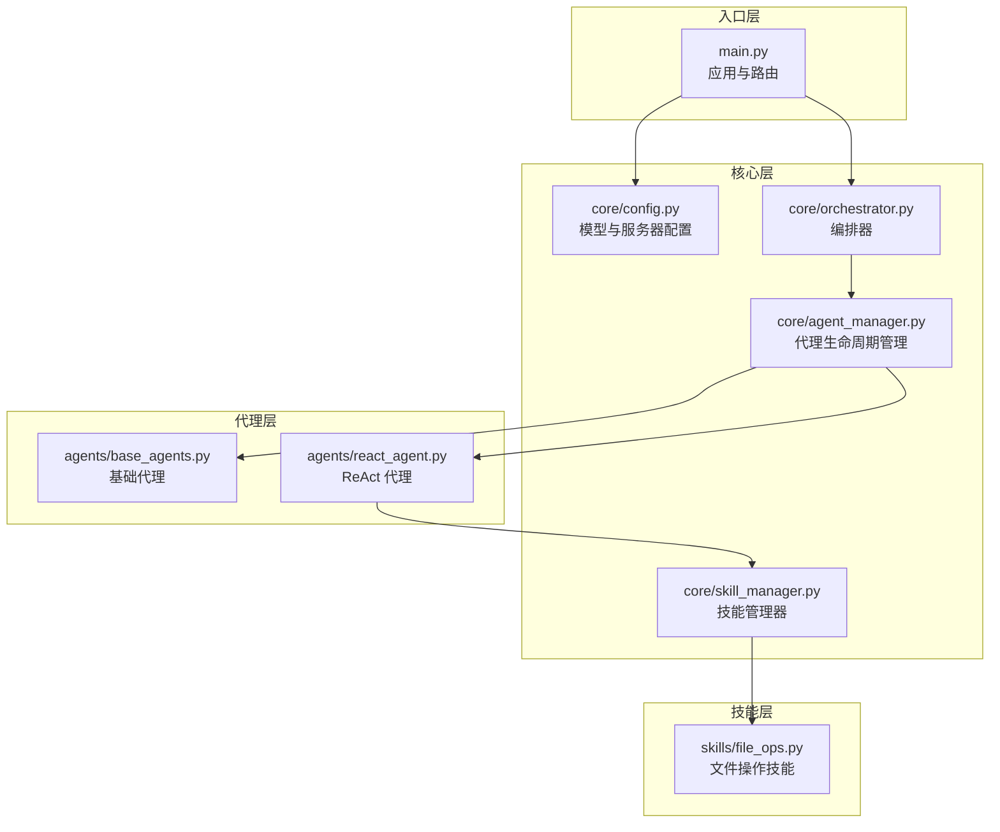
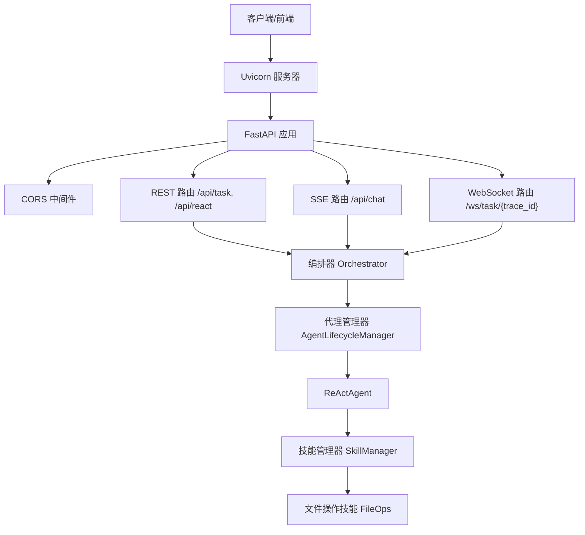
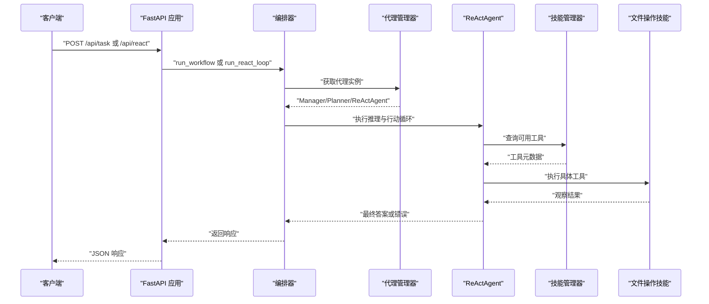
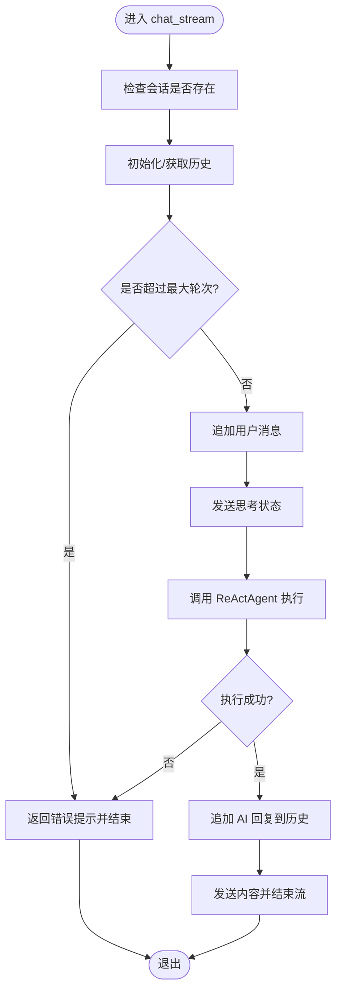
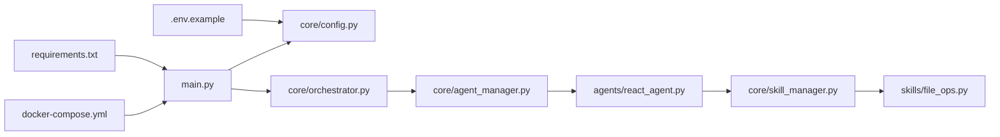

# FastAPI 应用架构

<cite>
**本文引用的文件**
- [main.py](file://localmanus-backend/main.py)
- [config.py](file://localmanus-backend/core/config.py)
- [orchestrator.py](file://localmanus-backend/core/orchestrator.py)
- [agent_manager.py](file://localmanus-backend/core/agent_manager.py)
- [react_agent.py](file://localmanus-backend/agents/react_agent.py)
- [skill_manager.py](file://localmanus-backend/core/skill_manager.py)
- [file_ops.py](file://localmanus-backend/skills/file_ops.py)
- [.env.example](file://localmanus-backend/.env.example)
- [requirements.txt](file://localmanus-backend/requirements.txt)
- [docker-compose.yml](file://docker-compose.yml)
- [test_orchestration.py](file://localmanus-backend/scripts/test_orchestration.py)
- [base_agents.py](file://localmanus-backend/agents/base_agents.py)
- [prompts.py](file://localmanus-backend/core/prompts.py)
</cite>

## 目录
1. [简介](#简介)
2. [项目结构](#项目结构)
3. [核心组件](#核心组件)
4. [架构总览](#架构总览)
5. [详细组件分析](#详细组件分析)
6. [依赖关系分析](#依赖关系分析)
7. [性能考虑](#性能考虑)
8. [故障排查指南](#故障排查指南)
9. [结论](#结论)
10. [附录](#附录)

## 简介
本技术文档围绕 LocalManus 的 FastAPI 后端应用展开，系统性解析应用初始化、中间件与 CORS 配置、路由与请求处理流程、启动配置、日志记录、异常处理策略，并进一步阐述如何在 FastAPI 中统一管理 RESTful API 与 WebSocket 服务。同时提供性能优化、安全加固与监控集成的最佳实践建议，帮助开发者快速理解并扩展该应用。

## 项目结构
后端采用模块化分层设计：
- 核心层：配置、编排器、代理管理器、技能管理器
- 代理层：基础代理与 ReAct 代理
- 技能层：动态加载的工具集合
- 入口层：FastAPI 应用、路由与中间件

图表来源
- [main.py](file://localmanus-backend/main.py#L1-L95)
- [config.py](file://localmanus-backend/core/config.py#L1-L21)
- [orchestrator.py](file://localmanus-backend/core/orchestrator.py#L1-L118)
- [agent_manager.py](file://localmanus-backend/core/agent_manager.py#L1-L31)
- [react_agent.py](file://localmanus-backend/agents/react_agent.py#L1-L107)
- [skill_manager.py](file://localmanus-backend/core/skill_manager.py#L1-L84)
- [file_ops.py](file://localmanus-backend/skills/file_ops.py#L1-L41)

章节来源
- [main.py](file://localmanus-backend/main.py#L1-L95)
- [config.py](file://localmanus-backend/core/config.py#L1-L21)

## 核心组件
- 应用实例与中间件：创建 FastAPI 实例，启用 CORS，配置日志。
- 编排器：负责会话管理、多轮对话流式输出、工作流执行与 JSON 提取。
- 代理管理器：初始化 AgentScope、构建 Manager、Planner、ReActAgent。
- ReAct 代理：基于工具的推理与行动循环，支持动态工具调用。
- 技能管理器：动态扫描并注册技能，暴露工具元数据供代理使用。
- 文件操作技能：示例技能，提供读写文件与目录列表能力。

章节来源
- [main.py](file://localmanus-backend/main.py#L1-L95)
- [orchestrator.py](file://localmanus-backend/core/orchestrator.py#L1-L118)
- [agent_manager.py](file://localmanus-backend/core/agent_manager.py#L1-L31)
- [react_agent.py](file://localmanus-backend/agents/react_agent.py#L1-L107)
- [skill_manager.py](file://localmanus-backend/core/skill_manager.py#L1-L84)
- [file_ops.py](file://localmanus-backend/skills/file_ops.py#L1-L41)

## 架构总览
应用以 FastAPI 作为统一入口，结合 AgentScope 的多代理协作实现任务规划与执行。WebSocket 与 SSE 并存，分别用于实时交互与事件流式输出；REST 接口提供同步任务执行与聊天接口。

图表来源
- [main.py](file://localmanus-backend/main.py#L1-L95)
- [orchestrator.py](file://localmanus-backend/core/orchestrator.py#L1-L118)
- [agent_manager.py](file://localmanus-backend/core/agent_manager.py#L1-L31)
- [react_agent.py](file://localmanus-backend/agents/react_agent.py#L1-L107)
- [skill_manager.py](file://localmanus-backend/core/skill_manager.py#L1-L84)
- [file_ops.py](file://localmanus-backend/skills/file_ops.py#L1-L41)

## 详细组件分析

### 应用初始化与中间件配置
- 应用实例：创建带标题的 FastAPI 实例，便于 API 文档展示。
- 日志配置：全局日志级别为 INFO，命名空间为“LocalManus-Backend”，便于区分后端日志。
- CORS 配置：允许任意源、凭证、方法与头，满足前端跨域访问需求；生产环境建议限制具体源与方法。
- 启动方式：直接运行时通过 Uvicorn 在 0.0.0.0:8000 启动。

章节来源
- [main.py](file://localmanus-backend/main.py#L1-L95)
- [config.py](file://localmanus-backend/core/config.py#L18-L21)

### 路由定义与请求处理流程
- 根路径：返回健康检查信息与版本号。
- SSE 聊天接口：/api/chat，接收输入与会话 ID，返回文本事件流，支持多轮历史与错误提示。
- 同步任务接口：/api/task，接收用户输入，触发工作流生成计划并返回。
- ReAct 执行接口：/api/react，接收用户输入，执行 ReAct 循环并返回结果。
- WebSocket 接口：/ws/task/{trace_id}，接受客户端消息，根据 action 分发到 ReAct 执行，发送思考与结果事件。

图表来源
- [main.py](file://localmanus-backend/main.py#L30-L56)
- [orchestrator.py](file://localmanus-backend/core/orchestrator.py#L65-L80)
- [agent_manager.py](file://localmanus-backend/core/agent_manager.py#L26-L30)
- [react_agent.py](file://localmanus-backend/agents/react_agent.py#L52-L106)
- [skill_manager.py](file://localmanus-backend/core/skill_manager.py#L75-L83)
- [file_ops.py](file://localmanus-backend/skills/file_ops.py#L9-L40)

章节来源
- [main.py](file://localmanus-backend/main.py#L26-L56)

### 编排器（Orchestrator）
- 会话管理：按 session_id 维护消息历史，限制最大轮次（每轮用户+AI=2条，上限10轮）。
- 多轮聊天流：模拟字符级流式输出，先发送状态，再发送内容，最后发送完成标记；异常时返回错误。
- 工作流执行：Manager 进行意图分析，Planner 生成 DAG 计划，附加 trace_id 返回。
- JSON 提取：从代理回复中提取 JSON 块，支持多种包裹格式。

图表来源
- [orchestrator.py](file://localmanus-backend/core/orchestrator.py#L13-L63)

章节来源
- [orchestrator.py](file://localmanus-backend/core/orchestrator.py#L8-L118)

### 代理管理器（AgentLifecycleManager）
- 初始化 AgentScope：加载模型配置（来自环境变量），支持本地或远程大模型。
- 构建核心代理：Manager、Planner、ReActAgent，统一注入模型配置与技能管理器。
- 单例模式：全局实例确保代理共享同一上下文与资源。

章节来源
- [agent_manager.py](file://localmanus-backend/core/agent_manager.py#L1-L31)
- [config.py](file://localmanus-backend/core/config.py#L6-L16)

### ReAct 代理（ReActAgent）
- 系统提示：包含工具元数据与响应格式，指导推理与行动循环。
- 行动循环：迭代执行，解析“Thought/Action/Observation/Answer”序列；当出现 Final Answer 时终止。
- 工具调用：从技能管理器获取技能并执行，将观察结果回填上下文。
- 参数解析：演示使用 eval 解析参数字符串（存在安全风险，建议替换为更安全的解析器）。

章节来源
- [react_agent.py](file://localmanus-backend/agents/react_agent.py#L10-L107)
- [prompts.py](file://localmanus-backend/core/prompts.py#L3-L52)

### 技能管理器（SkillManager）
- 动态加载：扫描 skills 目录，导入模块并实例化继承自 BaseSkill 的类。
- 工具元数据：反射获取公开方法，生成工具描述与参数签名，供代理选择。
- 执行路由：根据工具名分派到对应方法，支持同步与异步方法。

章节来源
- [skill_manager.py](file://localmanus-backend/core/skill_manager.py#L42-L84)

### 文件操作技能（FileOps）
- 读取文件：校验路径存在性，UTF-8 读取，异常捕获并返回错误信息。
- 写入文件：UTF-8 写入，返回成功信息。
- 列出目录：列出当前目录内容，异常捕获并返回错误信息。

章节来源
- [file_ops.py](file://localmanus-backend/skills/file_ops.py#L4-L41)

### WebSocket 服务
- 连接建立：接受连接并记录 trace_id。
- 消息处理：根据 action 字段执行不同逻辑；演示了“react”动作，发送思考事件，执行 ReAct 并返回结果。
- 断开处理：捕获断开异常并记录日志。

章节来源
- [main.py](file://localmanus-backend/main.py#L58-L91)

## 依赖关系分析
- 应用依赖：FastAPI、Uvicorn、AgentScope、Pydantic、websockets、python-multipart、python-dotenv。
- 环境变量：OPENAI_API_KEY、OPENAI_API_BASE、MODEL_NAME，用于模型配置。
- Compose：当前仅定义前端 UI 服务，后端可按需扩展。

图表来源
- [requirements.txt](file://localmanus-backend/requirements.txt#L1-L8)
- [.env.example](file://localmanus-backend/.env.example#L1-L4)
- [docker-compose.yml](file://docker-compose.yml#L1-L16)
- [main.py](file://localmanus-backend/main.py#L1-L95)
- [config.py](file://localmanus-backend/core/config.py#L1-L21)
- [orchestrator.py](file://localmanus-backend/core/orchestrator.py#L1-L118)
- [agent_manager.py](file://localmanus-backend/core/agent_manager.py#L1-L31)
- [react_agent.py](file://localmanus-backend/agents/react_agent.py#L1-L107)
- [skill_manager.py](file://localmanus-backend/core/skill_manager.py#L1-L84)
- [file_ops.py](file://localmanus-backend/skills/file_ops.py#L1-L41)

章节来源
- [requirements.txt](file://localmanus-backend/requirements.txt#L1-L8)
- [.env.example](file://localmanus-backend/.env.example#L1-L4)
- [docker-compose.yml](file://docker-compose.yml#L1-L16)

## 性能考虑
- 流式输出：SSE 使用文本事件流，适合长文本与多轮对话；WebSocket 适合低延迟交互。
- 代理并发：FastAPI 异步路由天然支持并发；注意代理内部的异步调用与阻塞操作。
- 会话限制：编排器对历史长度进行限制，避免内存膨胀与超长上下文导致的性能下降。
- 工具调用：技能执行可能涉及磁盘或网络 IO，建议缓存热点数据与结果。
- 模型调用：合理设置超时与重试策略，避免阻塞请求线程。
- 部署优化：使用多进程 Uvicorn（如 gunicorn + uvicorn）提升吞吐量；开启 gzip 压缩与静态资源缓存。

## 故障排查指南
- CORS 问题：确认前端与后端端口一致，生产环境限制 allow_origins 为具体域名。
- API 密钥：若 OPENAI_API_KEY 未正确配置，AgentScope 调用会失败；可在测试脚本中启用模拟模式验证流程。
- WebSocket 断开：捕获 WebSocketDisconnect 并记录 trace_id，便于定位会话问题。
- JSON 解析：编排器的 JSON 提取对格式敏感，确保代理输出符合预期格式。
- 工具执行：技能执行异常会被转换为观察结果返回，检查工具参数与权限。

章节来源
- [main.py](file://localmanus-backend/main.py#L18-L24)
- [test_orchestration.py](file://localmanus-backend/scripts/test_orchestration.py#L26-L46)
- [orchestrator.py](file://localmanus-backend/core/orchestrator.py#L82-L96)
- [react_agent.py](file://localmanus-backend/agents/react_agent.py#L97-L101)

## 结论
LocalManus 的 FastAPI 应用通过清晰的分层架构实现了 REST 与 WebSocket 的统一管理，结合 AgentScope 的多代理协作与动态技能体系，提供了可扩展的任务编排与执行能力。建议在生产环境中强化 CORS 与认证、完善 JSON 解析与工具调用的安全性，并引入监控与日志聚合，以保障稳定性与可观测性。

## 附录
- 环境变量示例：OPENAI_API_KEY、OPENAI_API_BASE、MODEL_NAME。
- 启动命令：直接运行 main.py，默认监听 0.0.0.0:8000。
- 测试脚本：test_orchestration.py 展示了工作流的模拟执行路径。

章节来源
- [.env.example](file://localmanus-backend/.env.example#L1-L4)
- [main.py](file://localmanus-backend/main.py#L92-L95)
- [test_orchestration.py](file://localmanus-backend/scripts/test_orchestration.py#L1-L57)