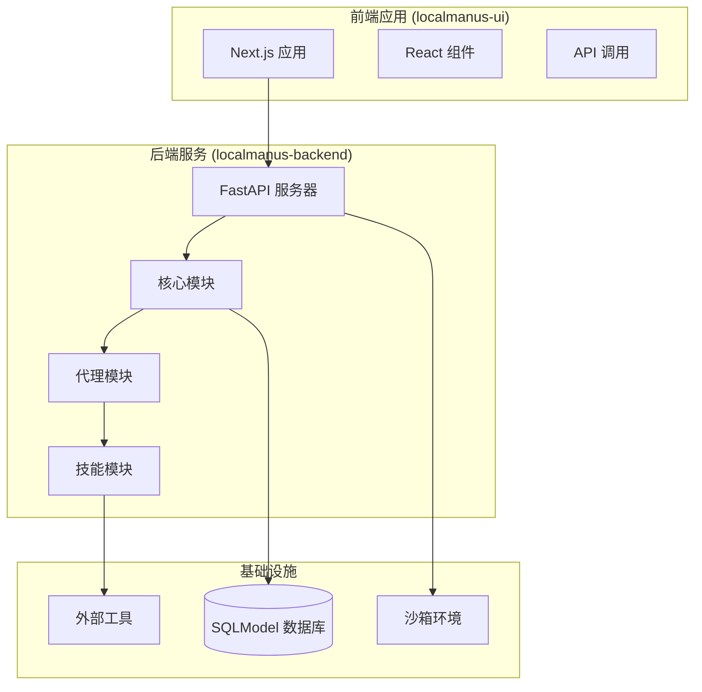
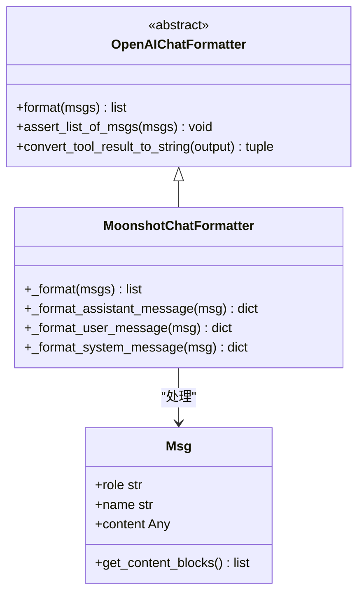
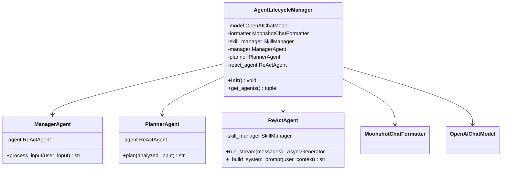
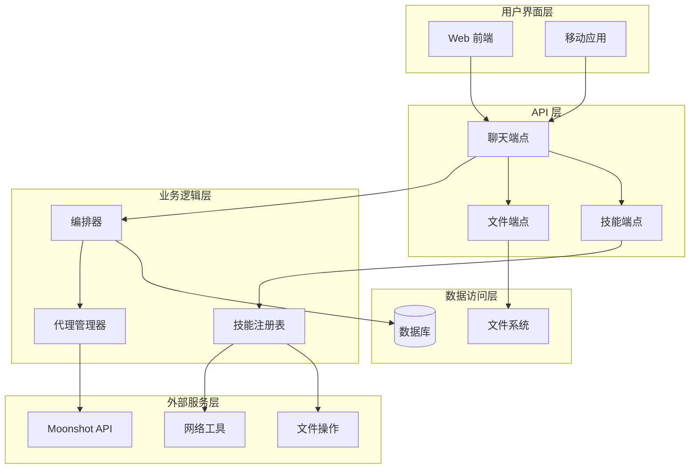
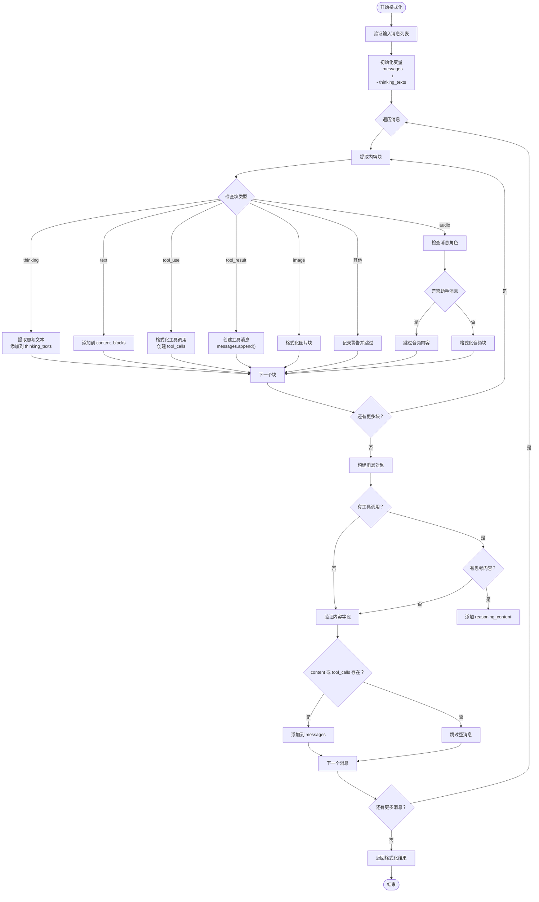
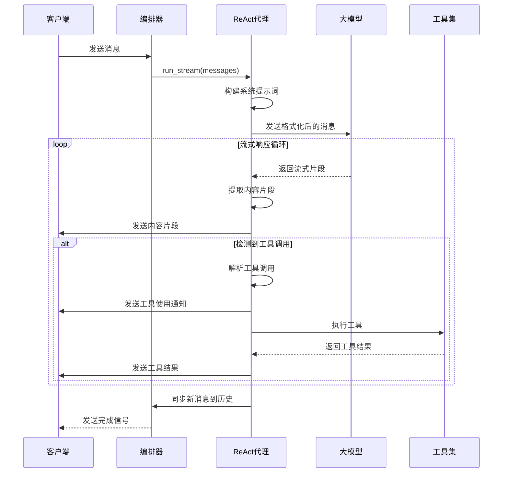
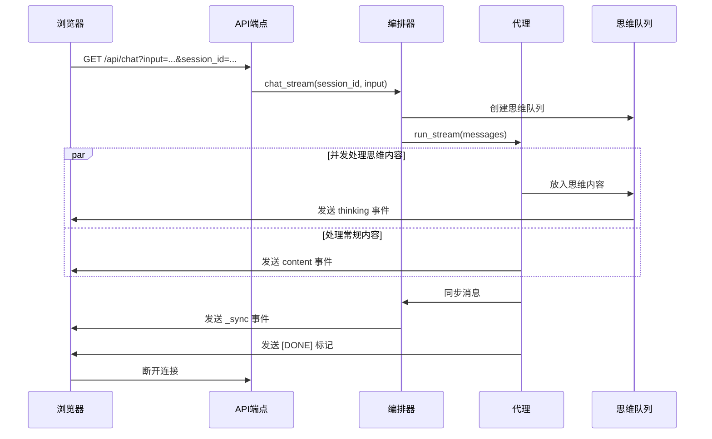
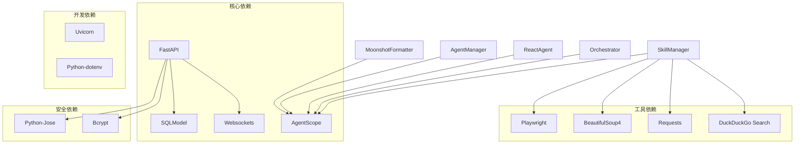

# Moonshot Chat Formatter 文档

<cite>
**本文档中引用的文件**
- [moonshot_formatter.py](file://localmanus-backend/core/moonshot_formatter.py)
- [agent_manager.py](file://localmanus-backend/core/agent_manager.py)
- [react_agent.py](file://localmanus-backend/agents/react_agent.py)
- [orchestrator.py](file://localmanus-backend/core/orchestrator.py)
- [main.py](file://localmanus-backend/main.py)
- [config.py](file://localmanus-backend/core/config.py)
- [prompts.py](file://localmanus-backend/core/prompts.py)
- [requirements.txt](file://localmanus-backend/requirements.txt)
</cite>

## 目录
1. [简介](#简介)
2. [项目结构](#项目结构)
3. [核心组件](#核心组件)
4. [架构概览](#架构概览)
5. [详细组件分析](#详细组件分析)
6. [依赖关系分析](#依赖关系分析)
7. [性能考虑](#性能考虑)
8. [故障排除指南](#故障排除指南)
9. [结论](#结论)

## 简介

Moonshot Chat Formatter 是一个专门为 Moonshot AI（Kimi）思维模式设计的消息格式化器。该格式化器扩展了标准的 OpenAI Chat 格式化器，专门处理 Moonshot API 的特殊要求：当助手消息包含工具调用时，必须在 OpenAI 格式的消息字典中包含 `reasoning_content` 字段来承载思考/推理文本。

该项目是一个基于 AgentScope 框架的智能代理系统，支持多轮对话、工具调用、思维链推理和流式响应。系统通过 SSE（Server-Sent Events）提供实时聊天体验，并集成了文件上传、项目管理和沙箱功能。

## 项目结构

LocalManus 项目采用模块化架构设计，主要分为以下几个核心部分：

**图表来源**
- [main.py](file://localmanus-backend/main.py#L1-L50)
- [agent_manager.py](file://localmanus-backend/core/agent_manager.py#L1-L52)

**章节来源**
- [main.py](file://localmanus-backend/main.py#L1-L50)
- [requirements.txt](file://localmanus-backend/requirements.txt#L1-L15)

## 核心组件

### MoonshotChatFormatter 类

MoonshotChatFormatter 是整个系统的核心格式化器，负责将 AgentScope 的消息对象转换为 Moonshot API 兼容的 OpenAI 格式。

**图表来源**
- [moonshot_formatter.py](file://localmanus-backend/core/moonshot_formatter.py#L19-L143)

MoonshotChatFormatter 的主要特性包括：

1. **思维内容保留**：自动提取 `thinking` 块并转换为 `reasoning_content` 字段
2. **工具调用支持**：正确格式化 `tool_use` 和 `tool_result` 块
3. **多模态内容处理**：支持文本、图像、音频等多种内容类型
4. **错误处理**：对不支持的块类型进行警告并跳过

**章节来源**
- [moonshot_formatter.py](file://localmanus-backend/core/moonshot_formatter.py#L1-L143)

### AgentLifecycleManager

AgentLifecycleManager 负责初始化和管理所有代理组件，确保它们使用正确的配置和格式化器。

**图表来源**
- [agent_manager.py](file://localmanus-backend/core/agent_manager.py#L11-L52)

**章节来源**
- [agent_manager.py](file://localmanus-backend/core/agent_manager.py#L1-L52)

## 架构概览

系统采用分层架构设计，从底层的模型接口到顶层的用户界面，每一层都有明确的职责分工：

**图表来源**
- [main.py](file://localmanus-backend/main.py#L391-L429)
- [orchestrator.py](file://localmanus-backend/core/orchestrator.py#L12-L216)

**章节来源**
- [main.py](file://localmanus-backend/main.py#L391-L429)
- [orchestrator.py](file://localmanus-backend/core/orchestrator.py#L1-L216)

## 详细组件分析

### MoonshotChatFormatter 实现细节

MoonshotChatFormatter 的核心实现遵循以下流程：

**图表来源**
- [moonshot_formatter.py](file://localmanus-backend/core/moonshot_formatter.py#L30-L143)

#### 关键实现特性

1. **思维内容处理**：当检测到 `thinking` 块时，将其文本内容收集并合并到 `reasoning_content` 字段中
2. **工具调用格式化**：将 `tool_use` 块转换为 OpenAI 格式的 `tool_calls` 数组
3. **工具结果处理**：将 `tool_result` 块转换为独立的 `tool` 角色消息
4. **多模态支持**：支持文本、图像、音频等多种内容类型的格式化

**章节来源**
- [moonshot_formatter.py](file://localmanus-backend/core/moonshot_formatter.py#L30-L143)

### ReActAgent 流式处理机制

ReActAgent 实现了完整的流式 ReAct 循环，支持实时思维内容输出和工具调用执行：

**图表来源**
- [react_agent.py](file://localmanus-backend/agents/react_agent.py#L65-L125)
- [orchestrator.py](file://localmanus-backend/core/orchestrator.py#L111-L150)

**章节来源**
- [react_agent.py](file://localmanus-backend/agents/react_agent.py#L65-L125)
- [orchestrator.py](file://localmanus-backend/core/orchestrator.py#L111-L150)

### SSE 聊天端点实现

系统通过 SSE 提供实时聊天体验，支持思维内容的流式传输：

**图表来源**
- [main.py](file://localmanus-backend/main.py#L391-L419)
- [orchestrator.py](file://localmanus-backend/core/orchestrator.py#L17-L162)

**章节来源**
- [main.py](file://localmanus-backend/main.py#L391-L419)
- [orchestrator.py](file://localmanus-backend/core/orchestrator.py#L17-L162)

## 依赖关系分析

系统的关键依赖关系如下：

**图表来源**
- [requirements.txt](file://localmanus-backend/requirements.txt#L1-L15)

**章节来源**
- [requirements.txt](file://localmanus-backend/requirements.txt#L1-L15)

## 性能考虑

### 内存管理

系统采用了多种内存优化策略：

1. **异步流式处理**：避免一次性加载大量数据到内存
2. **上下文隔离**：使用 `ContextVar` 确保并发请求的内存隔离
3. **消息历史限制**：限制会话历史的最大长度（40条消息）

### 网络优化

1. **SSE 连接复用**：单个连接支持多轮对话
2. **思维内容缓冲**：批量发送思维内容减少网络开销
3. **工具调用优化**：并行处理多个工具调用

### 缓存策略

系统目前主要依赖于大模型的内部缓存机制，未来可以考虑：

1. **消息历史缓存**：对频繁使用的对话历史进行缓存
2. **工具结果缓存**：缓存常用工具调用的结果
3. **配置信息缓存**：缓存用户配置和技能元数据

## 故障排除指南

### 常见问题及解决方案

#### 1. Moonshot API 集成问题

**症状**：工具调用失败或思维内容缺失
**原因**：API 配置错误或认证问题
**解决方案**：
- 检查 `OPENAI_API_BASE` 和 `OPENAI_API_KEY` 环境变量
- 验证 Moonshot API 的思维模式配置
- 确认 `reasoning_content` 字段的正确生成

#### 2. SSE 连接中断

**症状**：聊天过程中断开连接
**原因**：网络超时或服务器负载过高
**解决方案**：
- 增加客户端的重连机制
- 优化服务器的并发处理能力
- 检查防火墙和代理设置

#### 3. 工具调用错误

**症状**：工具执行失败或返回错误
**原因**：工具函数签名不匹配或依赖缺失
**解决方案**：
- 检查工具函数的参数签名
- 确认所需的 Python 包已安装
- 验证工具函数的权限设置

#### 4. 内存泄漏问题

**症状**：长时间运行后内存使用量持续增长
**原因**：未正确清理回调函数或队列
**解决方案**：
- 确保在请求结束后清理思维回调
- 检查并清理未完成的任务
- 监控内存使用情况

**章节来源**
- [agent_manager.py](file://localmanus-backend/core/agent_manager.py#L19-L31)
- [orchestrator.py](file://localmanus-backend/core/orchestrator.py#L152-L162)

## 结论

Moonshot Chat Formatter 是一个高度模块化的消息格式化系统，专门为 Moonshot AI 的思维模式进行了优化。通过精心设计的架构和实现，它成功地解决了以下关键挑战：

1. **兼容性**：完全兼容 Moonshot API 的思维模式要求
2. **可扩展性**：基于 AgentScope 框架，易于添加新的代理和工具
3. **实时性**：通过 SSE 提供流畅的用户体验
4. **可靠性**：完善的错误处理和监控机制

该系统的成功实施展示了如何在保持代码简洁性的同时，实现复杂的多模态 AI 代理功能。未来的发展方向包括增强缓存机制、优化性能表现，以及扩展更多的工具集成。