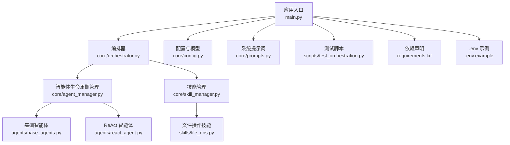
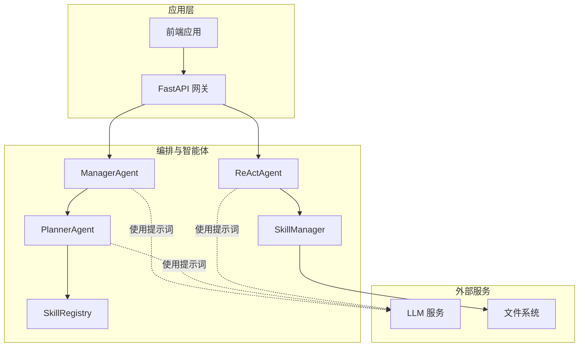
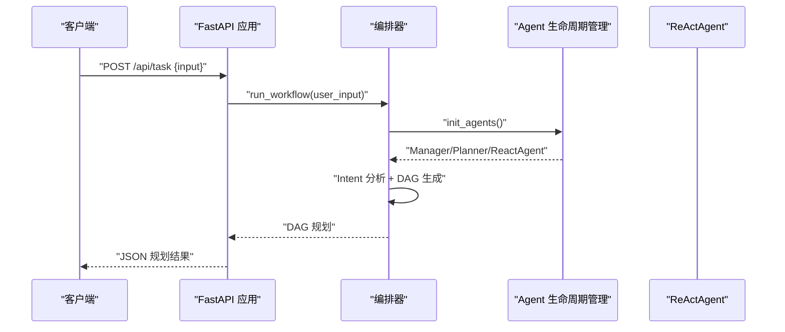
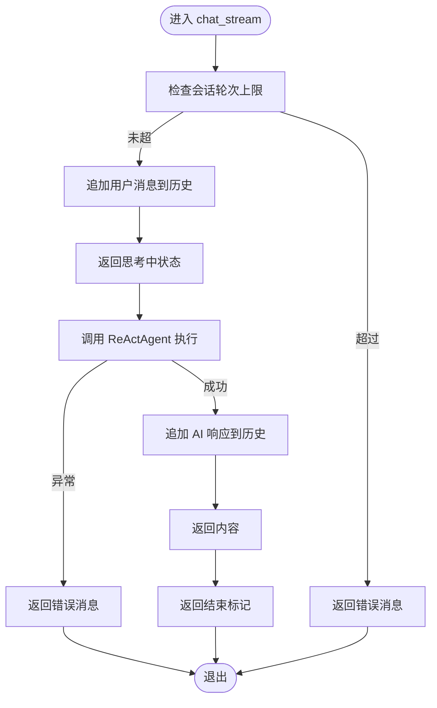
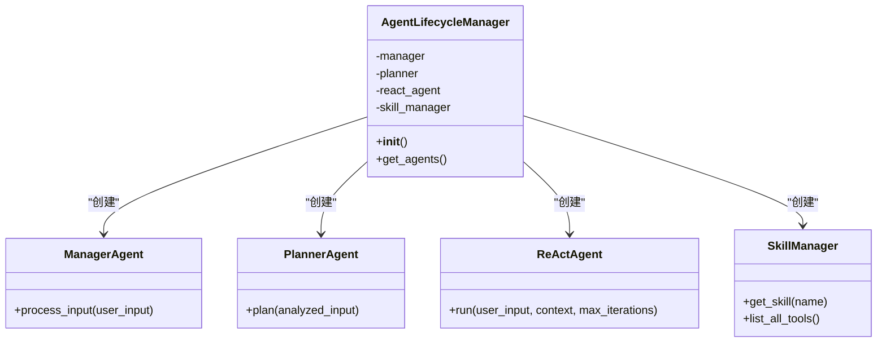
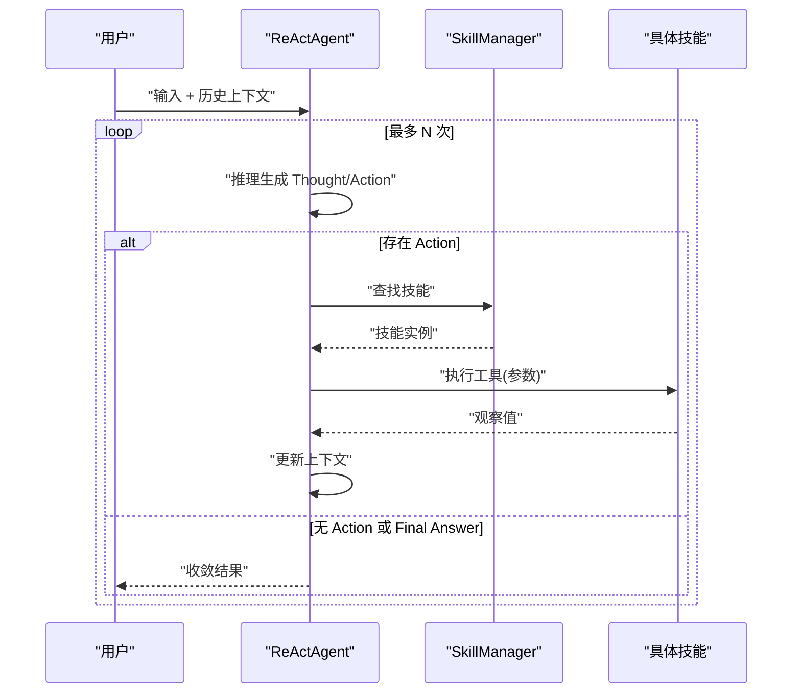
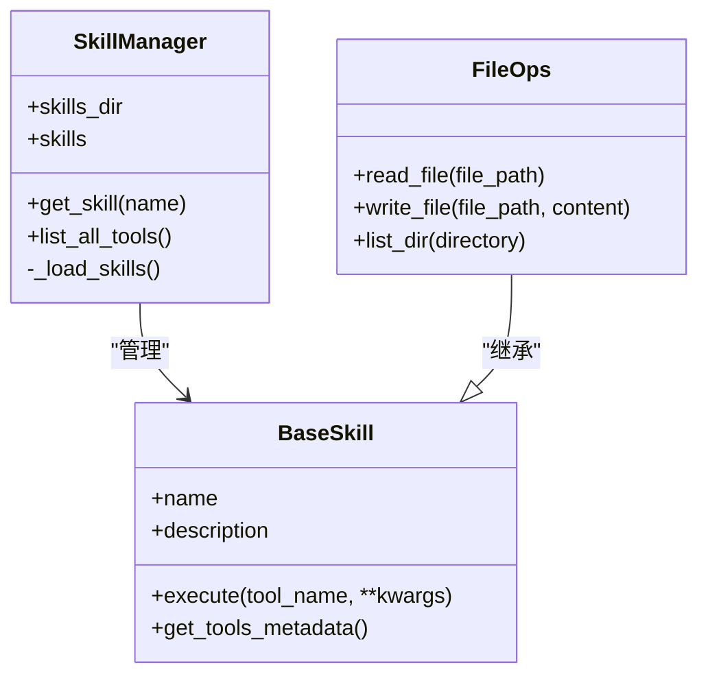
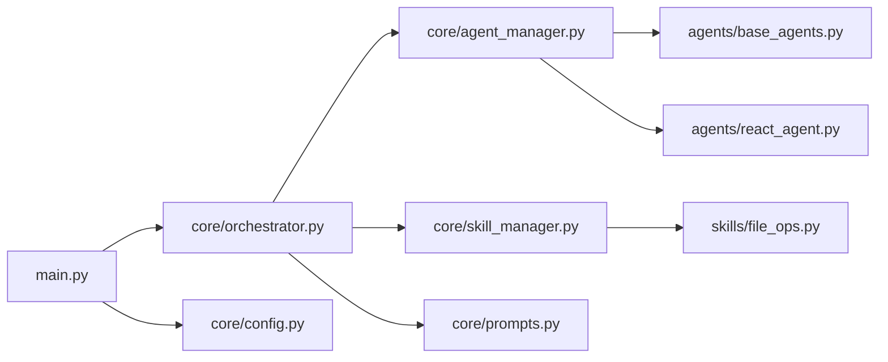

# 后端服务系统

<cite>
**本文引用的文件**
- [main.py](file://localmanus-backend/main.py)
- [orchestrator.py](file://localmanus-backend/core/orchestrator.py)
- [agent_manager.py](file://localmanus-backend/core/agent_manager.py)
- [react_agent.py](file://localmanus-backend/agents/react_agent.py)
- [config.py](file://localmanus-backend/core/config.py)
- [skill_manager.py](file://localmanus-backend/core/skill_manager.py)
- [base_agents.py](file://localmanus-backend/agents/base_agents.py)
- [file_ops.py](file://localmanus-backend/skills/file_ops.py)
- [prompts.py](file://localmanus-backend/core/prompts.py)
- [.env.example](file://localmanus-backend/.env.example)
- [requirements.txt](file://localmanus-backend/requirements.txt)
- [test_orchestration.py](file://localmanus-backend/scripts/test_orchestration.py)
- [localmanus_architecture.md](file://localmanus_architecture.md)
- [localmanus_prd.md](file://localmanus_prd.md)
</cite>

## 目录
1. [简介](#简介)
2. [项目结构](#项目结构)
3. [核心组件](#核心组件)
4. [架构总览](#架构总览)
5. [详细组件分析](#详细组件分析)
6. [依赖关系分析](#依赖关系分析)
7. [性能考虑](#性能考虑)
8. [故障排查指南](#故障排查指南)
9. [结论](#结论)
10. [附录](#附录)

## 简介
本文件为 LocalManus 后端服务系统的技术文档，围绕基于 FastAPI 的服务架构展开，涵盖应用结构、中间件配置、错误处理机制；深入解释编排器系统的工作原理，包括任务工作流编排、ReAct 循环管理、JSON 解析与错误处理；阐述 API 端点设计（RESTful 接口与 WebSocket 实时通信）；并提供配置管理、环境变量处理、依赖注入等关键机制的实现细节与最佳实践。文档同时结合架构设计文档与 PRD，帮助读者从整体到局部全面理解系统。

## 项目结构
后端采用按功能域划分的模块化组织方式：
- 应用入口与路由：localmanus-backend/main.py
- 核心编排与配置：localmanus-backend/core/orchestrator.py、localmanus-backend/core/agent_manager.py、localmanus-backend/core/config.py、localmanus-backend/core/prompts.py
- 智能体与技能：localmanus-backend/agents/react_agent.py、localmanus-backend/agents/base_agents.py、localmanus-backend/core/skill_manager.py、localmanus-backend/skills/file_ops.py
- 工具脚本与依赖：localmanus-backend/scripts/test_orchestration.py、localmanus-backend/requirements.txt
- 环境示例与架构说明：localmanus-backend/.env.example、localmanus_architecture.md、localmanus_prd.md

图表来源
- [main.py](file://localmanus-backend/main.py#L1-L95)
- [orchestrator.py](file://localmanus-backend/core/orchestrator.py#L1-L118)
- [agent_manager.py](file://localmanus-backend/core/agent_manager.py#L1-L31)
- [react_agent.py](file://localmanus-backend/agents/react_agent.py#L1-L104)
- [config.py](file://localmanus-backend/core/config.py#L1-L21)
- [skill_manager.py](file://localmanus-backend/core/skill_manager.py#L1-L84)
- [base_agents.py](file://localmanus-backend/agents/base_agents.py#L1-L41)
- [file_ops.py](file://localmanus-backend/skills/file_ops.py#L1-L41)
- [prompts.py](file://localmanus-backend/core/prompts.py#L1-L53)
- [test_orchestration.py](file://localmanus-backend/scripts/test_orchestration.py#L1-L57)
- [requirements.txt](file://localmanus-backend/requirements.txt#L1-L8)
- [.env.example](file://localmanus-backend/.env.example#L1-L4)

章节来源
- [main.py](file://localmanus-backend/main.py#L1-L95)
- [requirements.txt](file://localmanus-backend/requirements.txt#L1-L8)

## 核心组件
- 应用入口与路由：定义 FastAPI 应用、CORS 中间件、根路径、SSE 聊天接口、同步任务与 ReAct 接口、WebSocket 实时流。
- 编排器 Orchestrator：负责会话管理、多轮聊天流式输出、工作流规划、JSON 提取与错误处理。
- 智能体生命周期管理 AgentLifecycleManager：初始化 AgentScope、构建 Manager/Planner/ReActAgent，并提供全局单例。
- ReActAgent：基于 DialogAgent 的推理-行动循环，解析动作字符串、调用技能、收集观察值并收敛到最终答案。
- 技能管理 SkillManager：动态加载技能模块、反射工具元数据、路由工具执行。
- 基础智能体 ManagerAgent/PlannerAgent：标准化输入、生成规划 JSON。
- 文件操作技能：读写文件、列出目录等基础能力。
- 配置与提示词：模型配置、服务器参数、系统提示词模板。
- 测试脚本：演示工作流规划与回退逻辑。

章节来源
- [main.py](file://localmanus-backend/main.py#L1-L95)
- [orchestrator.py](file://localmanus-backend/core/orchestrator.py#L1-L118)
- [agent_manager.py](file://localmanus-backend/core/agent_manager.py#L1-L31)
- [react_agent.py](file://localmanus-backend/agents/react_agent.py#L1-L104)
- [skill_manager.py](file://localmanus-backend/core/skill_manager.py#L1-L84)
- [base_agents.py](file://localmanus-backend/agents/base_agents.py#L1-L41)
- [file_ops.py](file://localmanus-backend/skills/file_ops.py#L1-L41)
- [prompts.py](file://localmanus-backend/core/prompts.py#L1-L53)
- [config.py](file://localmanus-backend/core/config.py#L1-L21)
- [test_orchestration.py](file://localmanus-backend/scripts/test_orchestration.py#L1-L57)

## 架构总览
后端服务以 FastAPI 为网关，通过 AgentScope 的多智能体协作完成任务规划与执行。WebSocket 用于实时状态与日志推送，SSE 支持多轮聊天流式输出。技能通过 SkillManager 动态加载并在 ReAct 循环中被调用，形成“意图解析 -> 动态 DAG -> 工具执行”的闭环。

图表来源
- [main.py](file://localmanus-backend/main.py#L1-L95)
- [orchestrator.py](file://localmanus-backend/core/orchestrator.py#L1-L118)
- [agent_manager.py](file://localmanus-backend/core/agent_manager.py#L1-L31)
- [react_agent.py](file://localmanus-backend/agents/react_agent.py#L1-L104)
- [skill_manager.py](file://localmanus-backend/core/skill_manager.py#L1-L84)
- [prompts.py](file://localmanus-backend/core/prompts.py#L1-L53)

## 详细组件分析

### 应用入口与路由（FastAPI）
- CORS 中间件：允许任意来源、方法与头，便于前端跨域访问。
- 根路径：返回服务状态与版本。
- SSE 聊天接口：多轮对话，支持会话 ID 与最大轮次限制，流式返回状态、内容与错误。
- 同步任务接口：接收用户输入，返回工作流规划（DAG）。
- 同步 ReAct 接口：执行 ReAct 循环，返回最终结果。
- WebSocket 接口：接收客户端动作（start/react），在 UI 中模拟 ReAct 思考与结果返回。

图表来源
- [main.py](file://localmanus-backend/main.py#L40-L47)
- [orchestrator.py](file://localmanus-backend/core/orchestrator.py#L65-L80)
- [agent_manager.py](file://localmanus-backend/core/agent_manager.py#L26-L30)

章节来源
- [main.py](file://localmanus-backend/main.py#L1-L95)

### 编排器系统（Orchestrator）
- 会话管理：以 session_id 为键维护消息历史，限制最多 10 轮（20 条记录）。
- 多轮聊天流式输出：先返回“思考中”状态，再返回 AI 内容，最后发送结束标记；异常时返回错误。
- 工作流执行：Manager 分析意图 -> Planner 生成 DAG -> 注入 trace_id 返回。
- JSON 提取：支持 Markdown 包裹的 JSON 与裸 JSON，异常时返回错误对象与原始文本。

图表来源
- [orchestrator.py](file://localmanus-backend/core/orchestrator.py#L13-L64)

章节来源
- [orchestrator.py](file://localmanus-backend/core/orchestrator.py#L1-L118)

### 智能体生命周期管理（AgentLifecycleManager）
- 初始化 AgentScope：加载模型配置（来自环境变量）。
- 构建核心智能体：Manager、Planner、ReActAgent。
- 全局单例：避免重复初始化，提供统一的智能体实例。

图表来源
- [agent_manager.py](file://localmanus-backend/core/agent_manager.py#L7-L30)
- [base_agents.py](file://localmanus-backend/agents/base_agents.py#L6-L40)
- [react_agent.py](file://localmanus-backend/agents/react_agent.py#L32-L104)
- [skill_manager.py](file://localmanus-backend/core/skill_manager.py#L42-L84)

章节来源
- [agent_manager.py](file://localmanus-backend/core/agent_manager.py#L1-L31)

### ReActAgent（推理-行动循环）
- 系统提示词：包含可用工具元数据与响应格式。
- 循环执行：最多 max_iterations 次迭代，交替“思考-行动-观察”，遇到 Final Answer 则收敛。
- 动作解析：从响应中提取 Action 行，解析 skill.tool(args...)，调用技能执行并注入 Observation。
- 错误处理：捕获执行异常，构造错误观察值并继续循环。

图表来源
- [react_agent.py](file://localmanus-backend/agents/react_agent.py#L49-L103)
- [skill_manager.py](file://localmanus-backend/core/skill_manager.py#L72-L83)

章节来源
- [react_agent.py](file://localmanus-backend/agents/react_agent.py#L1-L104)

### 技能管理（SkillManager）与技能（BaseSkill/具体技能）
- 动态加载：扫描 skills 目录，导入模块并实例化继承自 BaseSkill 的类。
- 工具元数据：通过反射获取公开方法签名与描述，供 Agent 了解可用工具。
- 工具执行：根据工具名路由到对应方法，支持协程与普通函数。
- 具体技能示例：FileOps 提供读写文件、列出目录等能力。

图表来源
- [skill_manager.py](file://localmanus-backend/core/skill_manager.py#L6-L84)
- [file_ops.py](file://localmanus-backend/skills/file_ops.py#L4-L41)

章节来源
- [skill_manager.py](file://localmanus-backend/core/skill_manager.py#L1-L84)
- [file_ops.py](file://localmanus-backend/skills/file_ops.py#L1-L41)

### 基础智能体（ManagerAgent/PlannerAgent）
- ManagerAgent：标准化用户输入，输出结构化意图与实体。
- PlannerAgent：接收 Manager 输出，生成动态 DAG 规划，包含步骤、依赖与参数。

章节来源
- [base_agents.py](file://localmanus-backend/agents/base_agents.py#L1-L41)
- [prompts.py](file://localmanus-backend/core/prompts.py#L1-L53)

### API 端点设计
- GET /：健康检查与版本信息。
- GET /api/chat：SSE 多轮聊天，支持 session_id。
- POST /api/task：同步工作流规划（演示）。
- POST /api/react：同步 ReAct 循环执行。
- WS /ws/task/{trace_id}：实时任务流，支持 start/react 动作，模拟 ReAct 思考与结果返回。

章节来源
- [main.py](file://localmanus-backend/main.py#L26-L91)

### 配置管理与环境变量
- 模型配置：从环境变量加载 OPENAI_API_KEY、OPENAI_API_BASE、MODEL_NAME，构建 AgentScope 模型配置。
- 服务器配置：HOST、PORT。
- 环境示例：.env.example 提供示例键值。

章节来源
- [config.py](file://localmanus-backend/core/config.py#L1-L21)
- [.env.example](file://localmanus-backend/.env.example#L1-L4)

### 依赖注入与初始化
- AgentLifecycleManager 在应用启动时初始化 AgentScope 与技能管理器，并创建 Manager/Planner/ReActAgent。
- Orchestrator 通过 init_agents 获取智能体实例，实现松耦合的依赖注入。

章节来源
- [agent_manager.py](file://localmanus-backend/core/agent_manager.py#L26-L30)
- [orchestrator.py](file://localmanus-backend/core/orchestrator.py#L9-L11)

### 错误处理机制
- 编排器：SSE 场景下在达到轮次上限或异常时返回错误消息；JSON 提取失败时返回错误对象与原始文本。
- ReActAgent：动作解析与执行异常时构造错误观察值并继续循环，避免中断。
- WebSocket：捕获断开事件并记录日志。

章节来源
- [orchestrator.py](file://localmanus-backend/core/orchestrator.py#L23-L25)
- [orchestrator.py](file://localmanus-backend/core/orchestrator.py#L62-L63)
- [react_agent.py](file://localmanus-backend/agents/react_agent.py#L94-L98)
- [main.py](file://localmanus-backend/main.py#L89-L90)

## 依赖关系分析
- 应用层依赖编排器与配置；编排器依赖智能体生命周期管理；ReActAgent 依赖技能管理器；技能管理器依赖具体技能模块。
- 依赖方向清晰，模块职责明确，耦合度适中。

图表来源
- [main.py](file://localmanus-backend/main.py#L1-L15)
- [orchestrator.py](file://localmanus-backend/core/orchestrator.py#L1-L12)
- [agent_manager.py](file://localmanus-backend/core/agent_manager.py#L1-L18)
- [react_agent.py](file://localmanus-backend/agents/react_agent.py#L1-L6)
- [skill_manager.py](file://localmanus-backend/core/skill_manager.py#L1-L4)
- [file_ops.py](file://localmanus-backend/skills/file_ops.py#L1-L2)
- [prompts.py](file://localmanus-backend/core/prompts.py#L1-L1)

章节来源
- [main.py](file://localmanus-backend/main.py#L1-L15)
- [orchestrator.py](file://localmanus-backend/core/orchestrator.py#L1-L12)
- [agent_manager.py](file://localmanus-backend/core/agent_manager.py#L1-L18)
- [react_agent.py](file://localmanus-backend/agents/react_agent.py#L1-L6)
- [skill_manager.py](file://localmanus-backend/core/skill_manager.py#L1-L4)
- [file_ops.py](file://localmanus-backend/skills/file_ops.py#L1-L2)
- [prompts.py](file://localmanus-backend/core/prompts.py#L1-L1)

## 性能考虑
- 流式输出：SSE 与 WebSocket 提供低延迟的增量反馈，改善用户体验。
- 会话轮次限制：防止无限增长的历史导致内存与性能问题。
- 动态技能加载：仅在需要时加载技能，减少启动与内存占用。
- 异常短路：在 JSON 解析与工具执行失败时快速返回错误，避免无效计算。
- 建议优化（通用指导）：
  - 对频繁调用的 LLM 请求增加缓存与去重。
  - 对大文件操作引入分块读写与进度上报。
  - 对 WebSocket 连接实施心跳与超时保护。
  - 对 Agent 的响应进行采样与截断，降低 Token 消耗。

## 故障排查指南
- 无法连接 LLM：检查 OPENAI_API_KEY、OPENAI_API_BASE、MODEL_NAME 是否正确设置。
- WebSocket 断开：查看日志中断开事件记录，确认客户端连接状态与网络稳定性。
- ReAct 循环卡住：检查动作解析逻辑与工具参数，确保参数键名与类型匹配。
- 技能执行失败：确认技能名称与工具名一致，检查工具签名与依赖安装。
- SSE 无法接收：确认客户端 EventSource 订阅与 CORS 配置。

章节来源
- [.env.example](file://localmanus-backend/.env.example#L1-L4)
- [main.py](file://localmanus-backend/main.py#L89-L90)
- [react_agent.py](file://localmanus-backend/agents/react_agent.py#L73-L98)
- [skill_manager.py](file://localmanus-backend/core/skill_manager.py#L69-L70)

## 结论
LocalManus 后端以 FastAPI 为网关，结合 AgentScope 的多智能体编排能力，实现了从意图解析到动态 DAG 生成再到工具执行的完整闭环。通过 SSE 与 WebSocket 提供实时交互体验，通过 SkillManager 实现技能的动态扩展。配置与环境变量管理清晰，错误处理与性能优化兼顾，具备良好的可维护性与扩展性。

## 附录
- 产品需求与架构背景可参考 PRD 与架构设计文档，进一步理解系统目标与技术选型。

章节来源
- [localmanus_prd.md](file://localmanus_prd.md#L1-L76)
- [localmanus_architecture.md](file://localmanus_architecture.md#L1-L137)