# 技能执行模式系统

<cite>
**本文档引用的文件**
- [skill_modes.py](file://localmanus-backend/core/skill_modes.py)
- [skill_manager.py](file://localmanus-backend/core/skill_manager.py)
- [orchestrator.py](file://localmanus-backend/core/orchestrator.py)
- [skill_registry.py](file://localmanus-backend/core/skill_registry.py)
- [main.py](file://localmanus-backend/main.py)
- [agent_manager.py](file://localmanus-backend/core/agent_manager.py)
- [react_agent.py](file://localmanus-backend/agents/react_agent.py)
- [web_tools.py](file://localmanus-backend/skills/web-search/web_tools.py)
- [system_tools.py](file://localmanus-backend/skills/system-execution/system_tools.py)
- [file_ops.py](file://localmanus-backend/skills/file-operations/file_ops.py)
- [gen_web.py](file://localmanus-backend/skills/gen-web/gen_web.py)
- [prompts.py](file://localmanus-backend/core/prompts.py)
- [firecracker_sandbox.py](file://localmanus-backend/core/firecracker_sandbox.py)
- [config.py](file://localmanus-backend/core/config.py)
- [models.py](file://localmanus-backend/core/models.py)
</cite>

## 目录
1. [简介](#简介)
2. [项目结构](#项目结构)
3. [核心组件](#核心组件)
4. [架构概览](#架构概览)
5. [详细组件分析](#详细组件分析)
6. [依赖关系分析](#依赖关系分析)
7. [性能考虑](#性能考虑)
8. [故障排除指南](#故障排除指南)
9. [结论](#结论)

## 简介

技能执行模式系统是LocalManus平台的核心基础设施，负责管理各种技能（工具函数）的执行环境和路由机制。该系统采用灵活的执行模式设计，支持在主机环境、沙箱环境或混合环境中执行不同的技能，为用户提供安全、可控且功能丰富的自动化能力。

系统基于AgentScope框架构建，集成了ReAct代理、技能管理器、沙箱管理和技能注册表等核心组件。通过统一的技能执行模式，系统能够智能地将用户请求路由到最适合的执行环境中，确保技能在正确的上下文中运行。

## 项目结构

LocalManus项目采用模块化架构设计，主要分为以下几个核心层次：

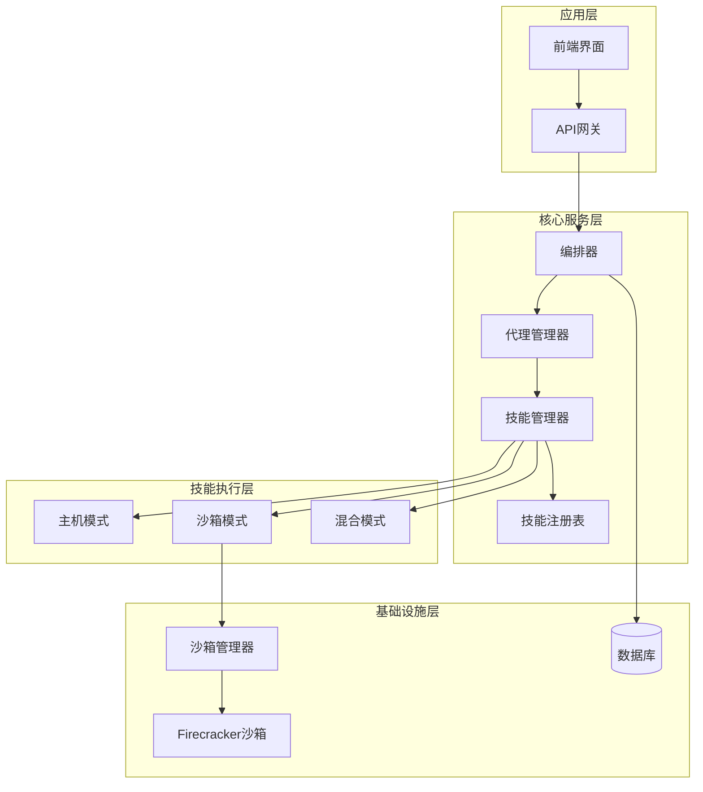

**图表来源**
- [main.py:33-40](file://localmanus-backend/main.py#L33-L40)
- [agent_manager.py:11-52](file://localmanus-backend/core/agent_manager.py#L11-L52)
- [skill_manager.py:98-107](file://localmanus-backend/core/skill_manager.py#L98-L107)

**章节来源**
- [main.py:1-524](file://localmanus-backend/main.py#L1-L524)
- [agent_manager.py:1-65](file://localmanus-backend/core/agent_manager.py#L1-L65)

## 核心组件

### 技能执行模式系统

系统定义了三种核心执行模式，每种模式都有特定的用途和限制：

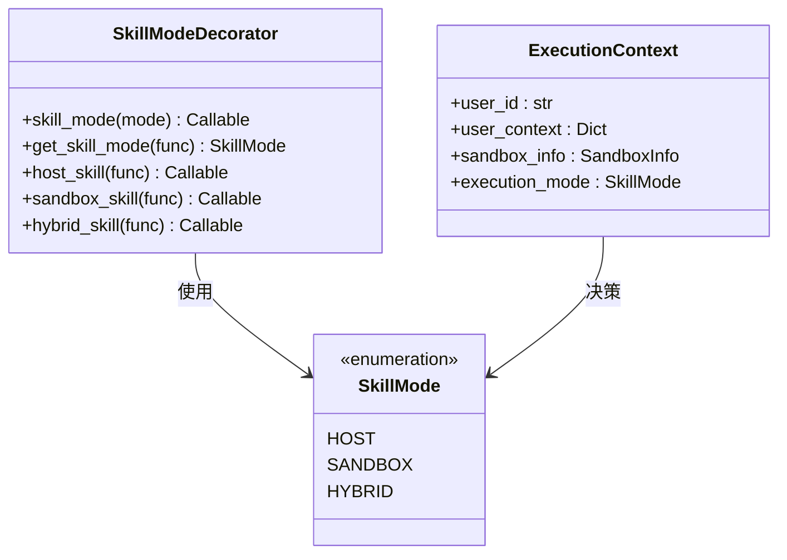

**图表来源**
- [skill_modes.py:18-69](file://localmanus-backend/core/skill_modes.py#L18-L69)

系统的核心优势在于其灵活性和安全性：

- **主机模式（HOST）**：适用于需要直接访问系统资源的技能，如网络搜索、API调用等
- **沙箱模式（SANDBOX）**：提供隔离的执行环境，适合文件操作、代码执行等潜在危险操作
- **混合模式（HYBRID）**：技能可以在多种环境中执行，系统根据需求自动选择最佳执行方式

**章节来源**
- [skill_modes.py:1-69](file://localmanus-backend/core/skill_modes.py#L1-L69)

### 技能管理器

技能管理器是整个系统的核心协调者，负责技能的发现、加载、注册和执行：

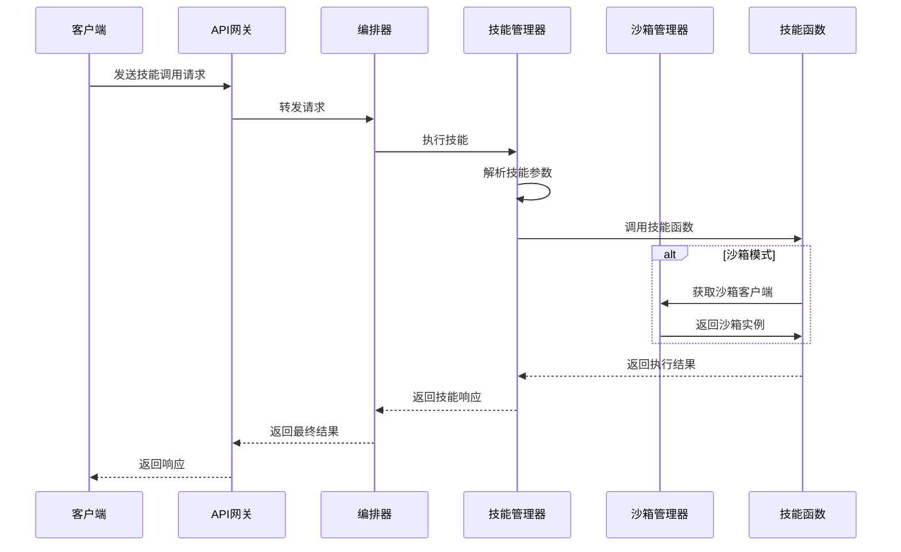

**图表来源**
- [skill_manager.py:170-238](file://localmanus-backend/core/skill_manager.py#L170-L238)
- [orchestrator.py:17-162](file://localmanus-backend/core/orchestrator.py#L17-L162)

**章节来源**
- [skill_manager.py:1-259](file://localmanus-backend/core/skill_manager.py#L1-L259)

### 沙箱管理系统

沙箱系统提供了安全的隔离执行环境，支持本地连接和在线容器两种模式：

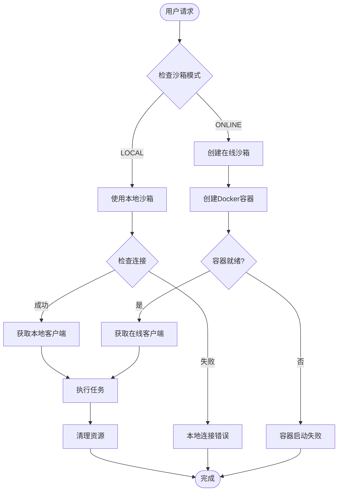

**图表来源**
- [firecracker_sandbox.py:134-275](file://localmanus-backend/core/firecracker_sandbox.py#L134-L275)

**章节来源**
- [firecracker_sandbox.py:1-325](file://localmanus-backend/core/firecracker_sandbox.py#L1-L325)

## 架构概览

系统采用分层架构设计，确保各组件之间的松耦合和高内聚：

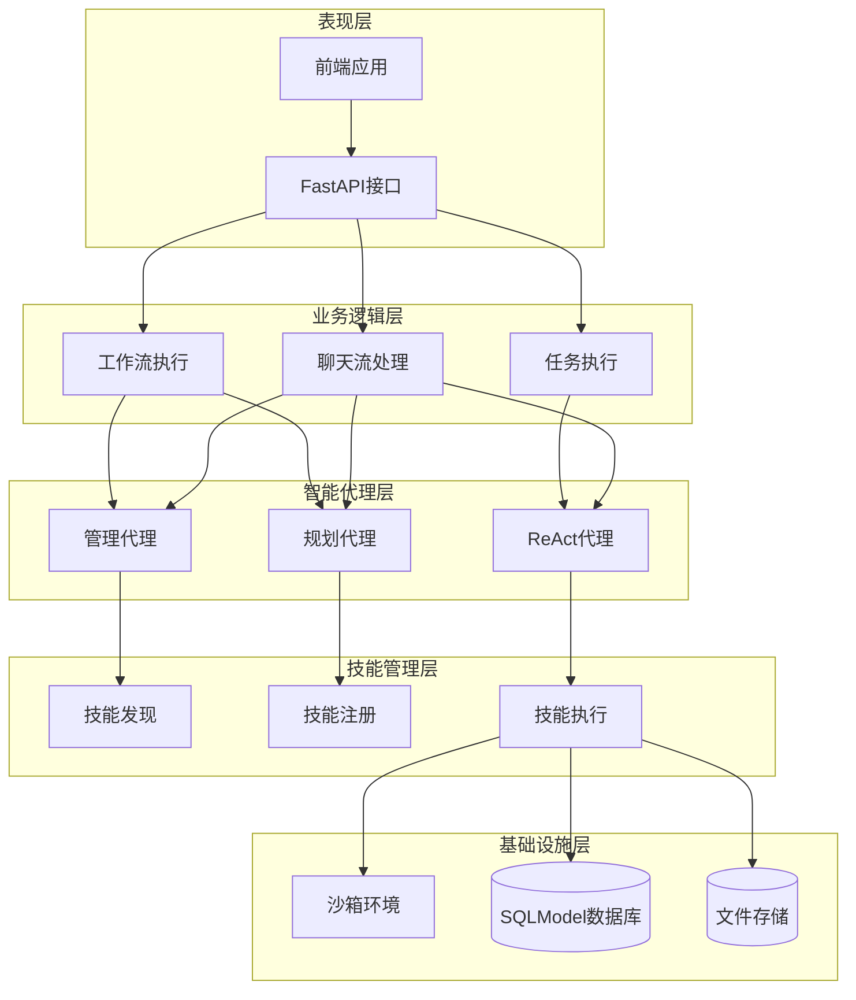

**图表来源**
- [main.py:33-424](file://localmanus-backend/main.py#L33-L424)
- [agent_manager.py:11-52](file://localmanus-backend/core/agent_manager.py#L11-L52)

系统的关键特性包括：

1. **异步流式处理**：支持实时聊天和任务执行
2. **多代理协作**：管理代理、规划代理和ReAct代理协同工作
3. **动态技能路由**：根据技能类型和执行需求自动选择最佳执行环境
4. **安全隔离**：通过沙箱系统确保技能执行的安全性

**章节来源**
- [main.py:1-524](file://localmanus-backend/main.py#L1-L524)
- [orchestrator.py:12-216](file://localmanus-backend/core/orchestrator.py#L12-L216)

## 详细组件分析

### 技能执行模式装饰器

技能执行模式系统的核心是装饰器机制，它允许开发者声明技能的执行要求：

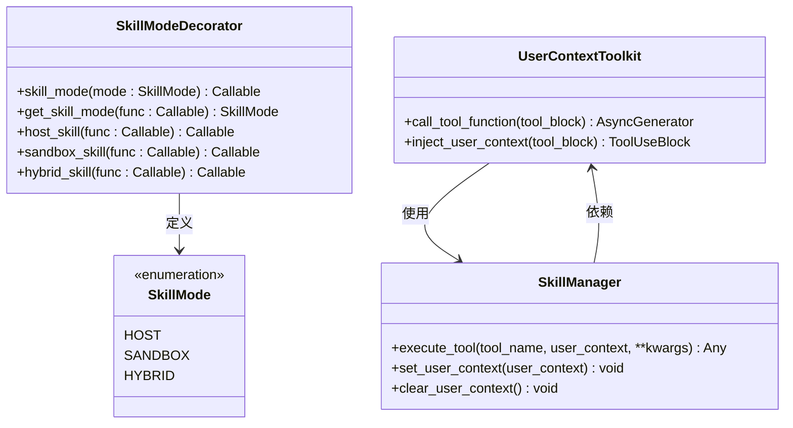

**图表来源**
- [skill_modes.py:25-69](file://localmanus-backend/core/skill_modes.py#L25-L69)
- [skill_manager.py:17-88](file://localmanus-backend/core/skill_manager.py#L17-L88)

装饰器系统提供了简洁的语法来声明技能的执行模式：

- `@host_skill`：声明技能只能在主机上执行
- `@sandbox_skill`：声明技能只能在沙箱中执行  
- `@hybrid_skill`：声明技能可以在任何环境中执行

**章节来源**
- [skill_modes.py:1-69](file://localmanus-backend/core/skill_modes.py#L1-L69)

### ReAct代理系统

ReAct代理是系统的核心智能组件，实现了推理和行动相结合的代理架构：

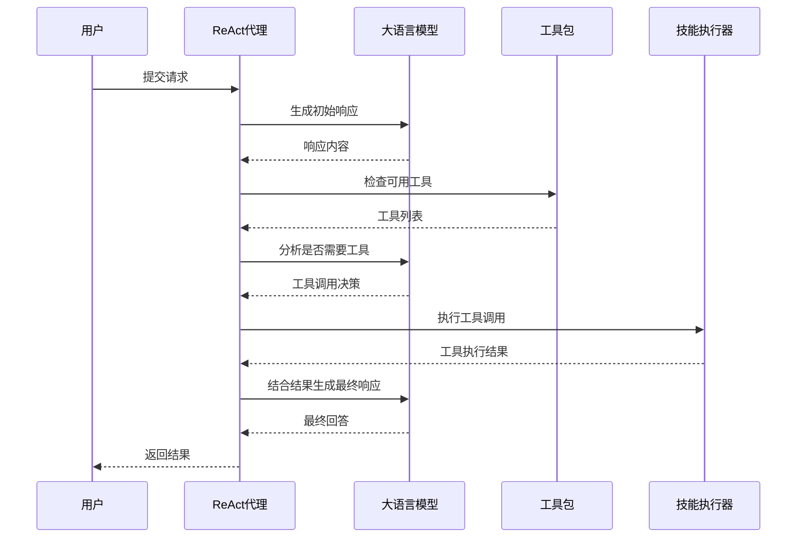

**图表来源**
- [react_agent.py:250-357](file://localmanus-backend/agents/react_agent.py#L250-L357)
- [react_agent.py:539-547](file://localmanus-backend/agents/react_agent.py#L539-L547)

ReAct代理的主要功能包括：

1. **内存压缩**：当对话历史过长时自动压缩，保持上下文的有效性
2. **流式响应**：支持实时的流式输出，提升用户体验
3. **工具集成**：无缝集成各种技能工具，实现复杂任务的自动化
4. **思考过程可视化**：支持思考过程的实时展示

**章节来源**
- [react_agent.py:1-675](file://localmanus-backend/agents/react_agent.py#L1-L675)

### 技能注册表

技能注册表负责管理和组织所有可用的技能，提供统一的技能发现和配置接口：

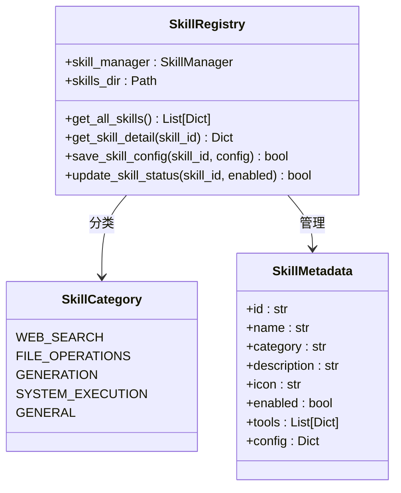

**图表来源**
- [skill_registry.py:12-156](file://localmanus-backend/core/skill_registry.py#L12-L156)

技能注册表提供了以下核心功能：

1. **技能分类**：根据功能特性自动分类技能
2. **元数据管理**：维护技能的描述、图标、配置等信息
3. **动态配置**：支持运行时启用/禁用技能
4. **配置持久化**：将技能配置保存到文件系统

**章节来源**
- [skill_registry.py:1-156](file://localmanus-backend/core/skill_registry.py#L1-L156)

### 具体技能实现

系统内置了多种实用技能，每种技能都针对特定的执行场景进行了优化：

#### 文件操作技能

文件操作技能提供了安全的文件管理能力，支持用户上传目录和沙箱内的文件操作：

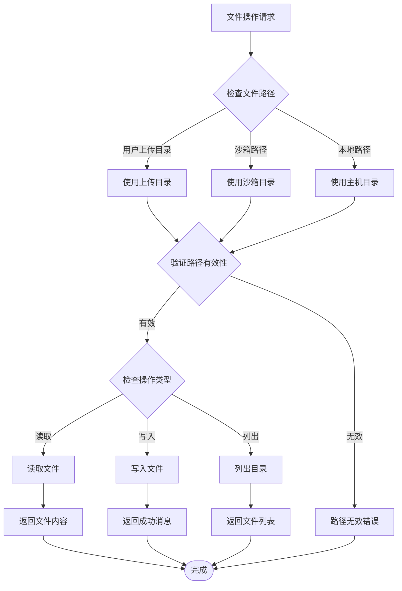

**图表来源**
- [file_ops.py:25-171](file://localmanus-backend/skills/file-operations/file_ops.py#L25-L171)

#### 系统执行技能

系统执行技能提供了受控的系统命令执行能力，主要用于开发和调试场景：

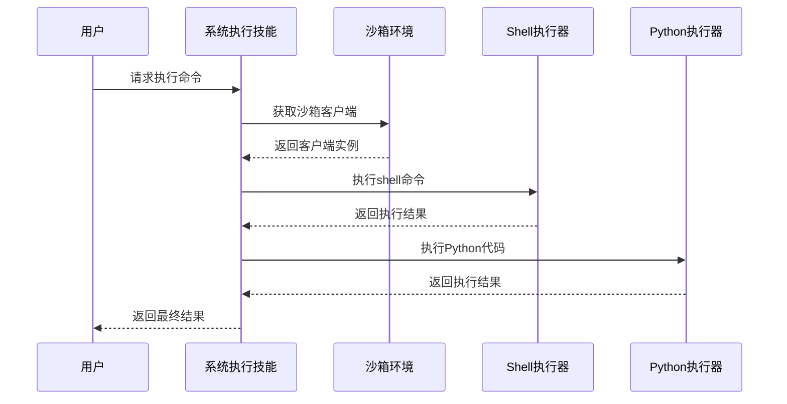

**图表来源**
- [system_tools.py:16-41](file://localmanus-backend/skills/system-execution/system_tools.py#L16-L41)

#### 网页搜索技能

网页搜索技能利用沙箱中的真实浏览器进行网页抓取，绕过常见的反爬虫检测：

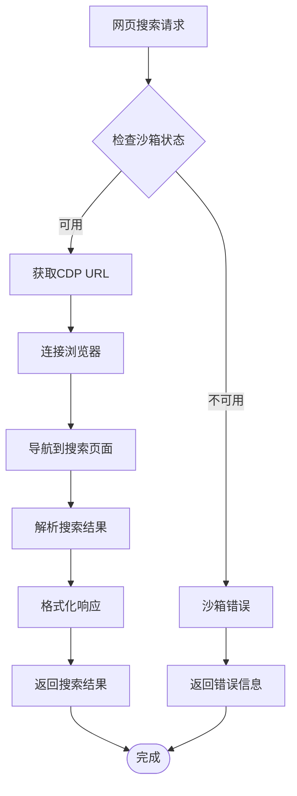

**图表来源**
- [web_tools.py:286-324](file://localmanus-backend/skills/web-search/web_tools.py#L286-L324)

**章节来源**
- [file_ops.py:1-199](file://localmanus-backend/skills/file-operations/file_ops.py#L1-L199)
- [system_tools.py:1-78](file://localmanus-backend/skills/system-execution/system_tools.py#L1-L78)
- [web_tools.py:1-571](file://localmanus-backend/skills/web-search/web_tools.py#L1-L571)

## 依赖关系分析

系统采用了清晰的依赖层次结构，确保模块间的低耦合和高内聚：

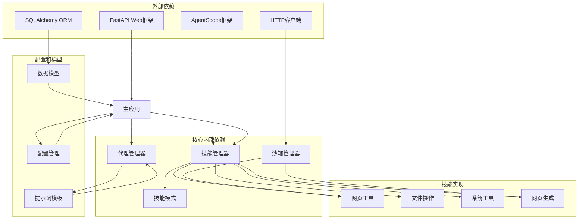

**图表来源**
- [main.py:1-524](file://localmanus-backend/main.py#L1-L524)
- [skill_manager.py:1-259](file://localmanus-backend/core/skill_manager.py#L1-L259)
- [agent_manager.py:1-65](file://localmanus-backend/core/agent_manager.py#L1-L65)

**章节来源**
- [main.py:1-524](file://localmanus-backend/main.py#L1-L524)
- [skill_manager.py:1-259](file://localmanus-backend/core/skill_manager.py#L1-L259)

## 性能考虑

系统在设计时充分考虑了性能优化，采用了多种策略来确保高效运行：

### 异步处理优化

系统广泛采用异步编程模式，特别是在以下场景中：

1. **流式响应**：ReAct代理支持实时流式输出，减少用户等待时间
2. **并发执行**：多个技能可以并行执行，提高整体吞吐量
3. **非阻塞I/O**：文件操作和网络请求采用异步方式，避免阻塞主线程

### 内存管理优化

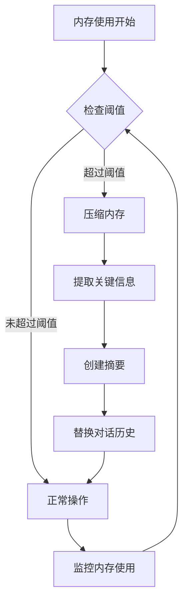

**图表来源**
- [react_agent.py:142-229](file://localmanus-backend/agents/react_agent.py#L142-L229)

### 缓存策略

系统实现了多层次的缓存机制：

1. **浏览器缓存**：Playwright浏览器实例缓存，避免重复连接
2. **技能元数据缓存**：技能注册表缓存已加载的技能信息
3. **沙箱连接缓存**：沙箱客户端连接池，提高连接复用率

### 资源管理

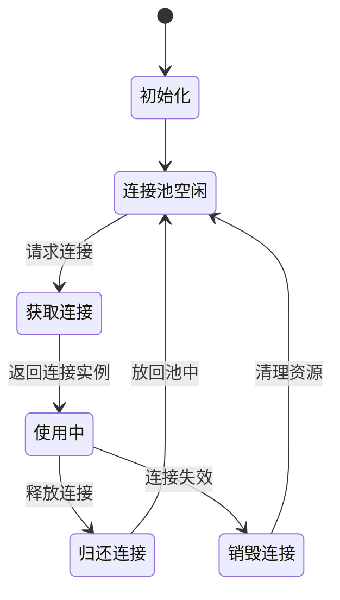

**图表来源**
- [web_tools.py:15-53](file://localmanus-backend/skills/web-search/web_tools.py#L15-L53)

## 故障排除指南

### 常见问题诊断

#### 沙箱连接问题

**症状**：技能调用时出现沙箱连接错误

**可能原因**：
1. 沙箱服务未启动
2. 网络连接异常
3. 认证信息错误

**解决方案**：
1. 检查沙箱服务状态：`docker ps`
2. 验证网络连通性：`ping sandbox-host`
3. 确认配置正确性：检查`.env`文件中的沙箱配置

#### 技能执行超时

**症状**：技能执行时间过长或完全无响应

**可能原因**：
1. 网络请求超时
2. 文件操作过大
3. 沙箱资源不足

**解决方案**：
1. 增加超时配置
2. 优化文件处理逻辑
3. 检查沙箱资源使用情况

#### 权限问题

**症状**：技能执行时出现权限错误

**可能原因**：
1. 文件路径越界访问
2. 沙箱权限配置不当
3. 用户上下文缺失

**解决方案**：
1. 验证文件路径安全性
2. 检查沙箱权限设置
3. 确保用户上下文完整传递

**章节来源**
- [web_tools.py:19-109](file://localmanus-backend/skills/web-search/web_tools.py#L19-L109)
- [file_ops.py:65-86](file://localmanus-backend/skills/file-operations/file_ops.py#L65-L86)

### 日志分析

系统提供了详细的日志记录机制，便于问题诊断：

1. **技能执行日志**：记录技能调用的详细信息
2. **沙箱操作日志**：跟踪沙箱环境的使用情况
3. **代理交互日志**：记录ReAct代理的推理过程

### 性能监控

建议使用以下指标监控系统性能：

- **响应时间**：从请求到响应的总时间
- **并发用户数**：同时处理的用户数量
- **技能成功率**：技能执行成功的比例
- **资源利用率**：CPU、内存、磁盘的使用情况

## 结论

技能执行模式系统通过精心设计的架构和实现，为LocalManus平台提供了强大而灵活的技能执行能力。系统的核心优势体现在：

1. **灵活的执行模式**：支持主机、沙箱和混合三种执行模式，满足不同技能的需求
2. **安全的隔离机制**：通过沙箱系统确保技能执行的安全性
3. **高效的管理机制**：统一的技能管理器和注册表简化了技能的开发和部署
4. **智能化的代理系统**：ReAct代理实现了复杂的推理和行动能力
5. **完善的基础设施**：提供了完整的开发、测试和生产环境支持

该系统为未来的扩展奠定了坚实的基础，支持更多的技能类型和更复杂的应用场景。通过持续的优化和改进，系统将继续为用户提供更好的自动化体验。