# 文件管理器系统

<cite>
**本文档引用的文件**
- [file_manager.py](file://localmanus-backend/core/file_manager.py)
- [file_ops.py](file://localmanus-backend/skills/file-operations/file_ops.py)
- [models.py](file://localmanus-backend/core/models.py)
- [main.py](file://localmanus-backend/main.py)
- [firecracker_sandbox.py](file://localmanus-backend/core/firecracker_sandbox.py)
- [skill_manager.py](file://localmanus-backend/core/skill_manager.py)
- [config.py](file://localmanus-backend/core/config.py)
- [SKILL.md](file://localmanus-backend/skills/file-operations/SKILL.md)
- [api.ts](file://localmanus-ui/app/utils/api.ts)
- [docker-compose.yml](file://docker-compose.yml)
- [requirements.txt](file://localmanus-backend/requirements.txt)
- [Dockerfile](file://localmanus-backend/Dockerfile)
- [README.md](file://README.md)
</cite>

## 目录
1. [简介](#简介)
2. [项目结构](#项目结构)
3. [核心组件](#核心组件)
4. [架构概览](#架构概览)
5. [详细组件分析](#详细组件分析)
6. [依赖关系分析](#依赖关系分析)
7. [性能考虑](#性能考虑)
8. [故障排除指南](#故障排除指南)
9. [结论](#结论)

## 简介

LocalManus 文件管理器系统是一个现代化的本地优先 AI 代理平台，专注于提供安全、可扩展的文件管理和操作能力。该系统通过统一的文件管理接口抽象了主机和沙箱环境之间的差异，使技能无需关心文件存储的具体位置。

系统采用多层架构设计，包括前端界面、后端 API、沙箱执行环境和文件管理系统。核心特性包括：

- **统一文件访问接口**：抽象主机和沙箱文件系统差异
- **多环境支持**：支持本地开发和在线隔离容器模式
- **安全沙箱执行**：通过 agent-infra/sandbox 提供受控执行环境
- **实时流式响应**：基于 Server-Sent Events 的实时通信
- **可扩展技能系统**：动态加载和管理各种功能技能

## 项目结构

LocalManus 采用模块化项目结构，主要分为三个核心部分：

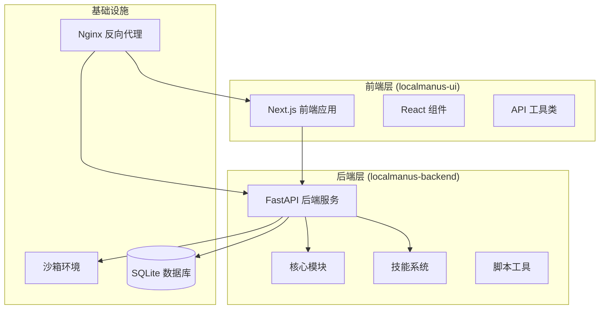

**图表来源**
- [README.md:35-61](file://README.md#L35-L61)
- [docker-compose.yml:1-88](file://docker-compose.yml#L1-L88)

**章节来源**
- [README.md:168-192](file://README.md#L168-L192)
- [docker-compose.yml:1-88](file://docker-compose.yml#L1-L88)

## 核心组件

### 文件管理器核心架构

文件管理器系统的核心是统一的文件管理接口，它抽象了不同存储环境的差异：

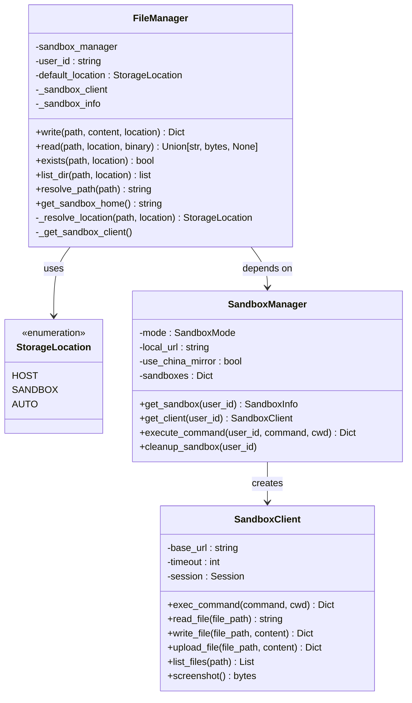

**图表来源**
- [file_manager.py:17-217](file://localmanus-backend/core/file_manager.py#L17-L217)
- [firecracker_sandbox.py:134-325](file://localmanus-backend/core/firecracker_sandbox.py#L134-L325)

### 技能系统集成

文件操作技能通过标准化接口与主系统集成：

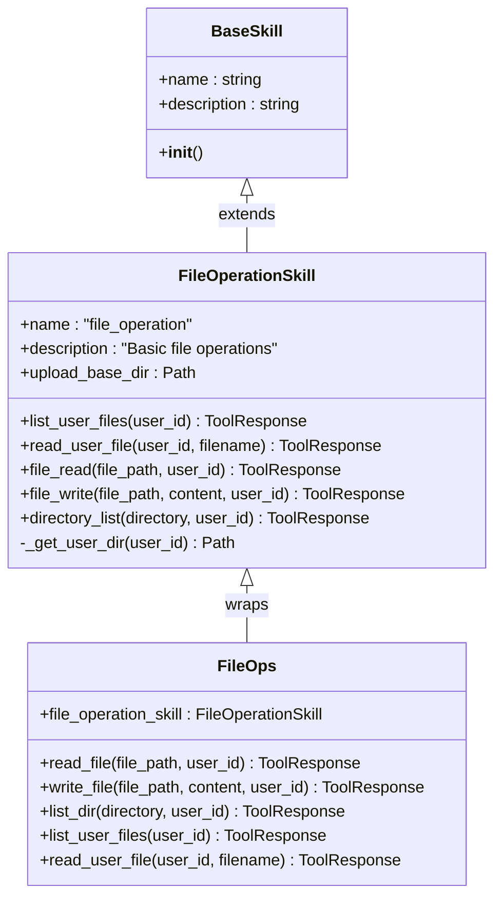

**图表来源**
- [file_ops.py:10-199](file://localmanus-backend/skills/file-operations/file_ops.py#L10-L199)
- [skill_manager.py:90-259](file://localmanus-backend/core/skill_manager.py#L90-L259)

**章节来源**
- [file_manager.py:24-217](file://localmanus-backend/core/file_manager.py#L24-L217)
- [file_ops.py:10-199](file://localmanus-backend/skills/file-operations/file_ops.py#L10-L199)

## 架构概览

### 系统架构流程

文件管理器系统采用分层架构，确保各组件间的松耦合和高内聚：

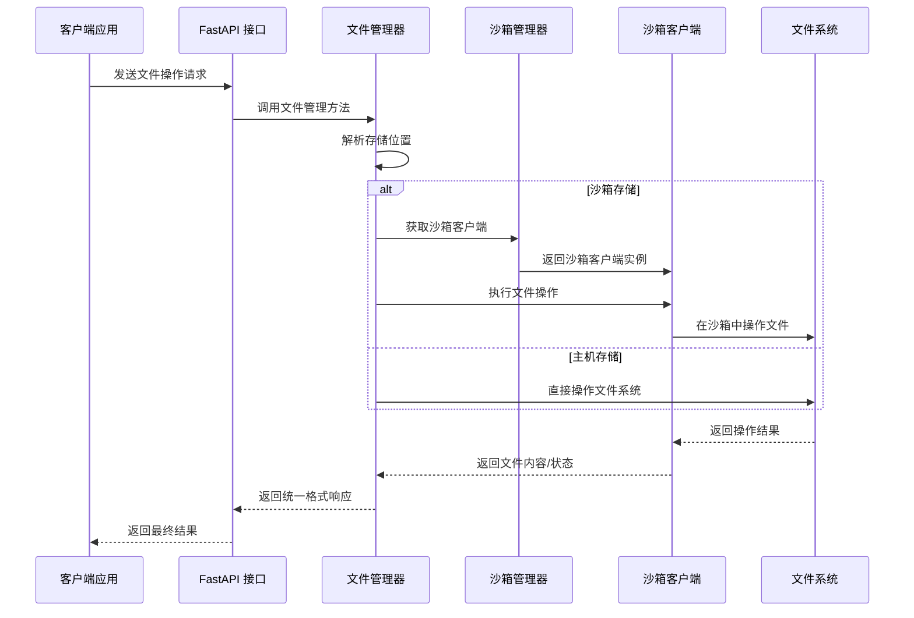

**图表来源**
- [main.py:391-424](file://localmanus-backend/main.py#L391-L424)
- [file_manager.py:73-123](file://localmanus-backend/core/file_manager.py#L73-L123)
- [firecracker_sandbox.py:266-269](file://localmanus-backend/core/firecracker_sandbox.py#L266-L269)

### 数据流架构

系统中的数据流遵循统一的处理模式：

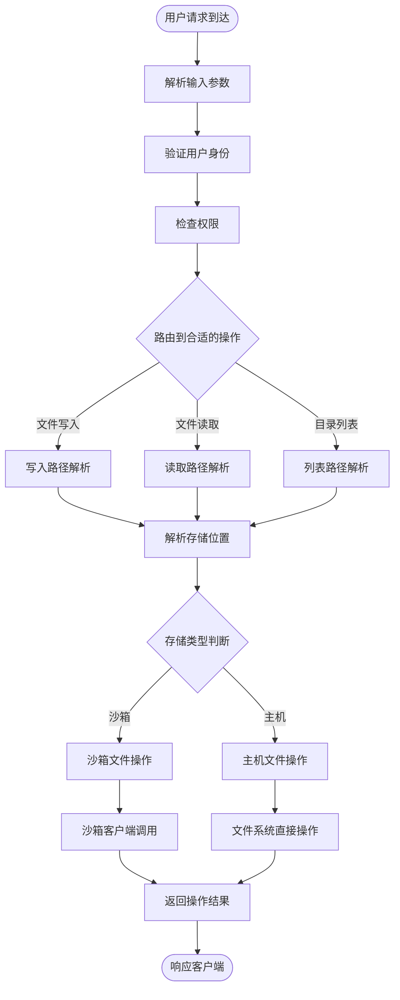

**图表来源**
- [file_manager.py:61-72](file://localmanus-backend/core/file_manager.py#L61-L72)
- [file_manager.py:90-123](file://localmanus-backend/core/file_manager.py#L90-L123)

**章节来源**
- [main.py:391-424](file://localmanus-backend/main.py#L391-L424)
- [file_manager.py:61-123](file://localmanus-backend/core/file_manager.py#L61-L123)

## 详细组件分析

### 文件管理器组件

文件管理器是整个系统的核心抽象层，提供了统一的文件操作接口：

#### 存储位置策略

文件管理器实现了智能的存储位置决策机制：

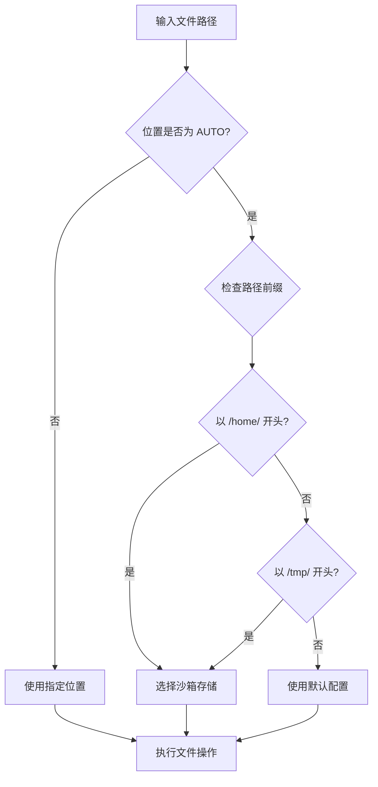

**图表来源**
- [file_manager.py:61-72](file://localmanus-backend/core/file_manager.py#L61-L72)

#### 文件操作实现

文件管理器支持多种文件操作模式：

| 操作类型 | 方法名 | 功能描述 | 返回值 |
|---------|--------|----------|--------|
| 写入文件 | `write()` | 将内容写入指定路径 | 操作结果字典 |
| 读取文件 | `read()` | 从指定路径读取内容 | 文件内容或 None |
| 检查存在 | `exists()` | 检查文件是否存在 | 布尔值 |
| 列出目录 | `list_dir()` | 列出目录内容 | 文件信息列表 |

**章节来源**
- [file_manager.py:73-191](file://localmanus-backend/core/file_manager.py#L73-L191)

### 沙箱集成组件

沙箱管理器提供了灵活的执行环境支持：

#### 沙箱模式配置

系统支持两种沙箱模式：

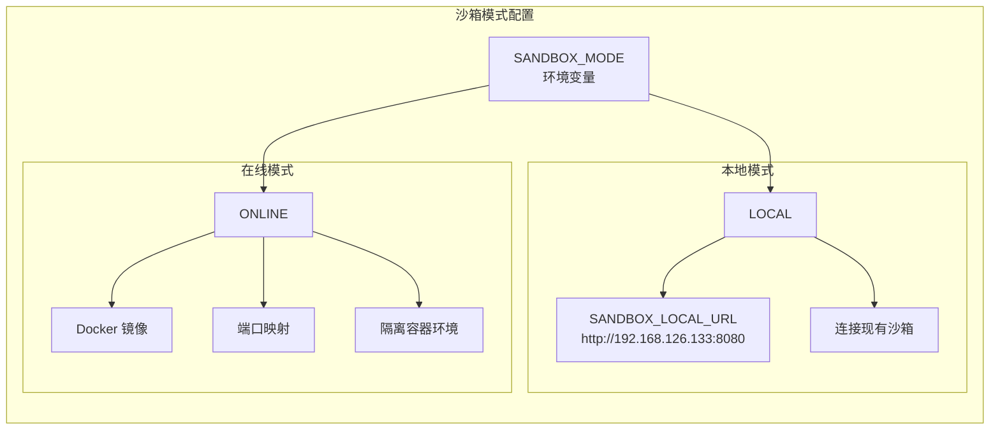

**图表来源**
- [config.py:23-27](file://localmanus-backend/core/config.py#L23-L27)
- [firecracker_sandbox.py:134-325](file://localmanus-backend/core/firecracker_sandbox.py#L134-L325)

#### 沙箱客户端功能

沙箱客户端提供了丰富的远程操作能力：

| 功能类别 | 支持的方法 | 描述 |
|---------|-----------|------|
| 文件操作 | `read_file()`, `write_file()`, `list_files()` | 远程文件系统操作 |
| 命令执行 | `exec_command()` | 在沙箱中执行 shell 命令 |
| 浏览器控制 | `browser_navigate()`, `browser_get_content()` | 网页自动化操作 |
| 截图功能 | `screenshot()` | 获取浏览器截图 |
| Jupyter 执行 | `execute_jupyter_code()` | 在 Jupyter 内核中执行代码 |

**章节来源**
- [firecracker_sandbox.py:31-133](file://localmanus-backend/core/firecracker_sandbox.py#L31-L133)
- [firecracker_sandbox.py:134-325](file://localmanus-backend/core/firecracker_sandbox.py#L134-L325)

### 技能系统集成

文件操作技能通过标准化接口与系统其他组件集成：

#### 技能注册流程

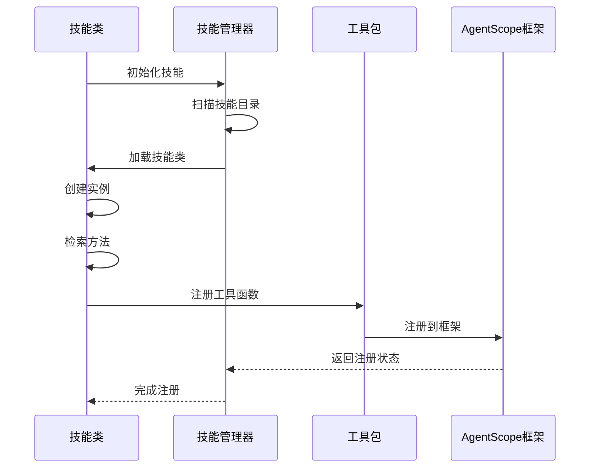

**图表来源**
- [skill_manager.py:109-169](file://localmanus-backend/core/skill_manager.py#L109-L169)

#### 用户上下文注入

技能系统支持自动注入用户上下文信息：

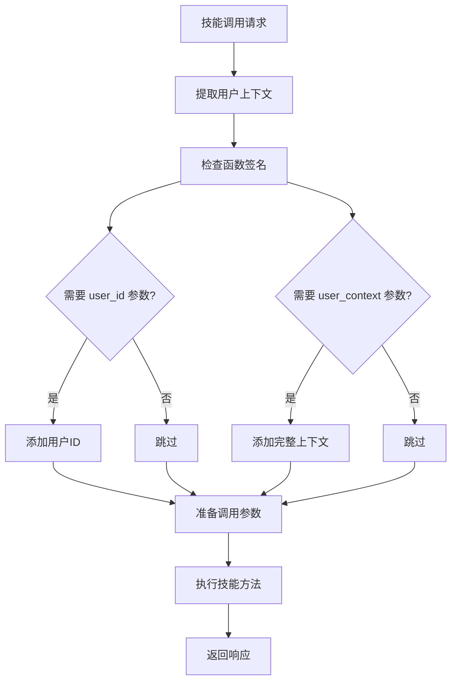

**图表来源**
- [skill_manager.py:170-237](file://localmanus-backend/core/skill_manager.py#L170-L237)

**章节来源**
- [file_ops.py:10-199](file://localmanus-backend/skills/file-operations/file_ops.py#L10-L199)
- [skill_manager.py:170-237](file://localmanus-backend/core/skill_manager.py#L170-L237)

## 依赖关系分析

### 外部依赖关系

系统依赖关系清晰且层次分明：

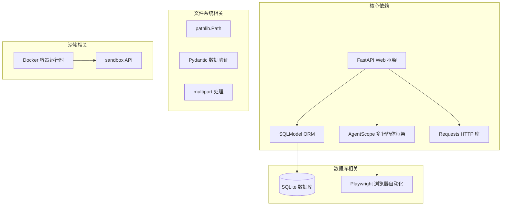

**图表来源**
- [requirements.txt:1-18](file://localmanus-backend/requirements.txt#L1-L18)
- [Dockerfile:1-49](file://localmanus-backend/Dockerfile#L1-L49)

### 内部模块依赖

系统内部模块间依赖关系如下：

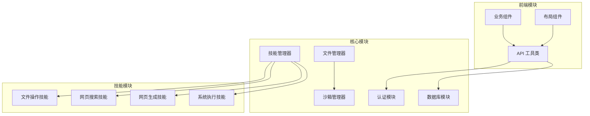

**图表来源**
- [main.py:1-50](file://localmanus-backend/main.py#L1-L50)
- [file_ops.py:1-10](file://localmanus-backend/skills/file-operations/file_ops.py#L1-L10)

**章节来源**
- [requirements.txt:1-18](file://localmanus-backend/requirements.txt#L1-L18)
- [main.py:1-50](file://localmanus-backend/main.py#L1-L50)

## 性能考虑

### 文件操作性能优化

系统在文件操作方面采用了多项优化策略：

1. **延迟加载机制**：沙箱客户端采用延迟初始化，避免不必要的资源占用
2. **智能路径解析**：通过路径前缀快速判断存储位置，减少不必要的检查
3. **二进制文件处理**：支持直接处理二进制文件，避免编码转换开销
4. **缓存策略**：沙箱信息缓存在内存中，减少重复查询

### 沙箱性能优化

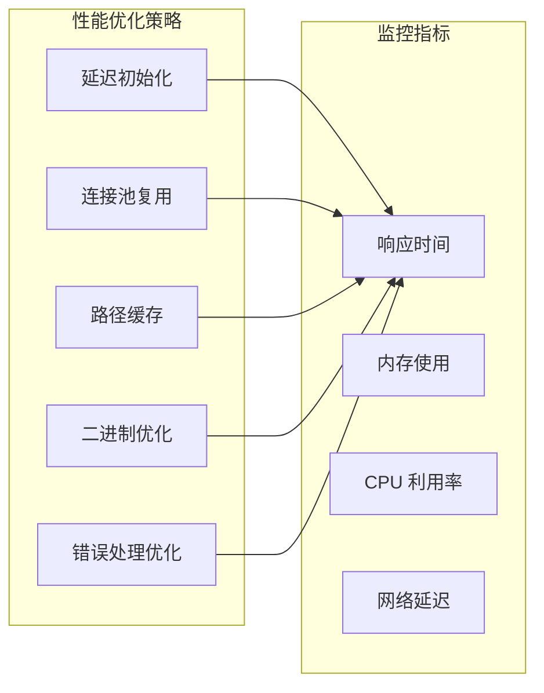

### 并发处理能力

系统支持高并发文件操作：

- **异步文件操作**：所有文件操作都是异步实现
- **上下文隔离**：使用上下文变量确保并发请求的隔离性
- **资源管理**：自动清理临时资源和连接
- **超时控制**：为所有外部操作设置合理的超时时间

## 故障排除指南

### 常见问题诊断

#### 文件操作失败

当遇到文件操作失败时，可以按以下步骤排查：

1. **检查存储位置解析**
   - 验证路径前缀是否正确
   - 确认默认存储位置配置
   - 检查 AUTO 模式的路径判断逻辑

2. **验证沙箱连接**
   - 确认沙箱服务正常运行
   - 检查网络连接状态
   - 验证认证凭据

3. **查看日志信息**
   - 检查后端服务日志
   - 查看沙箱服务日志
   - 分析错误堆栈信息

#### 沙箱相关问题

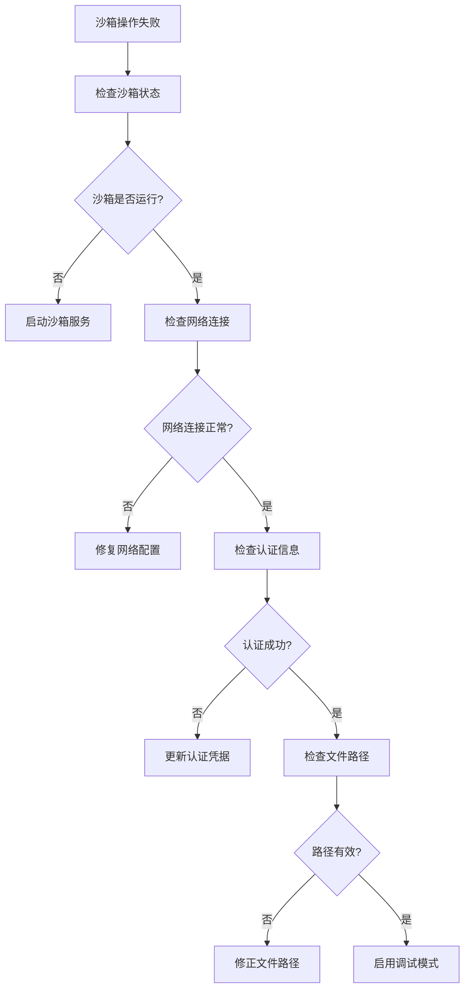

**图表来源**
- [firecracker_sandbox.py:158-167](file://localmanus-backend/core/firecracker_sandbox.py#L158-L167)

#### 前端 API 访问问题

前端应用通过 API 工具类自动处理不同的访问场景：

| 执行环境 | API 基础 URL | 使用场景 |
|---------|-------------|----------|
| 浏览器客户端 | NEXT_PUBLIC_API_URL | 前端页面直接访问 |
| 服务器端渲染 | BACKEND_URL | SSR 渲染时访问 |
| 开发环境 | http://localhost:8000 | 本地开发调试 |

**章节来源**
- [api.ts:7-16](file://localmanus-ui/app/utils/api.ts#L7-L16)
- [docker-compose.yml:64-69](file://docker-compose.yml#L64-L69)

### 调试技巧

1. **启用详细日志**：在开发环境中增加日志级别
2. **使用健康检查**：定期检查服务可用性
3. **监控资源使用**：关注内存和 CPU 使用情况
4. **测试边界条件**：验证异常情况的处理

## 结论

LocalManus 文件管理器系统通过精心设计的架构实现了以下目标：

### 技术优势

1. **统一抽象层**：通过文件管理器抽象了不同存储环境的差异
2. **灵活部署**：支持本地开发和生产环境的多种部署模式
3. **安全隔离**：沙箱环境提供了强大的执行隔离能力
4. **可扩展性**：模块化的架构便于功能扩展和维护

### 架构特点

- **分层设计**：清晰的层次结构便于理解和维护
- **松耦合**：组件间依赖关系明确，便于独立开发
- **高内聚**：功能模块职责单一，便于测试和调试
- **异步处理**：充分利用异步编程提高系统性能

### 未来发展

系统具备良好的扩展基础，未来可以在以下方面进一步完善：

1. **性能优化**：进一步提升文件操作和沙箱执行的性能
2. **监控增强**：增加更详细的性能监控和告警机制
3. **安全性加强**：完善文件访问控制和安全审计
4. **用户体验**：优化前端界面和交互体验

该系统为构建复杂的 AI 代理平台提供了坚实的基础，其设计理念和实现方式值得在类似项目中借鉴和参考。