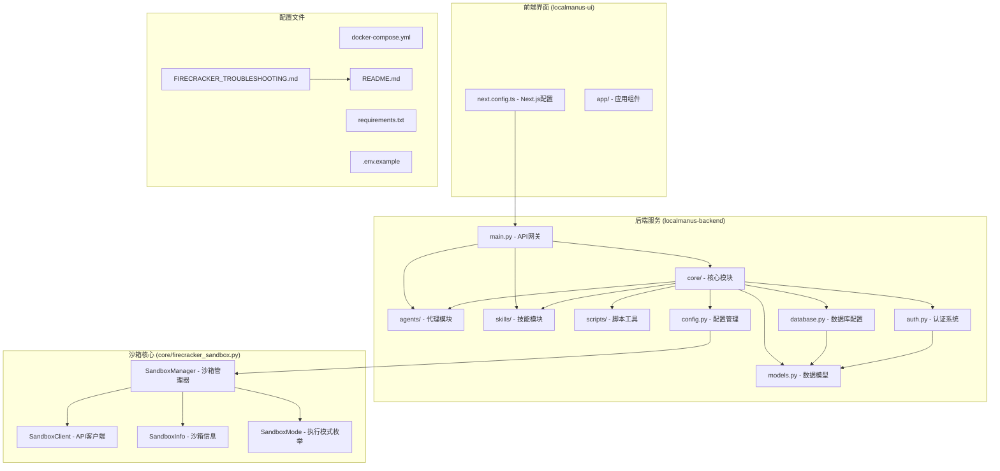
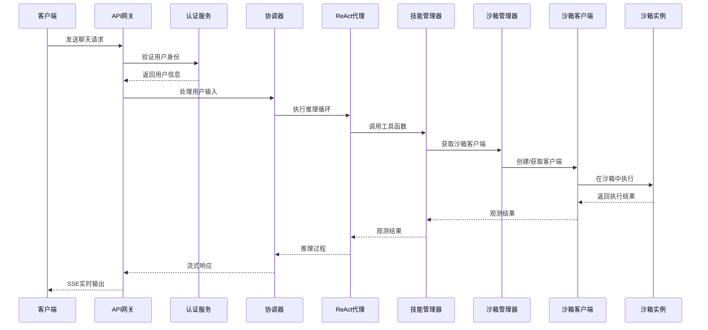
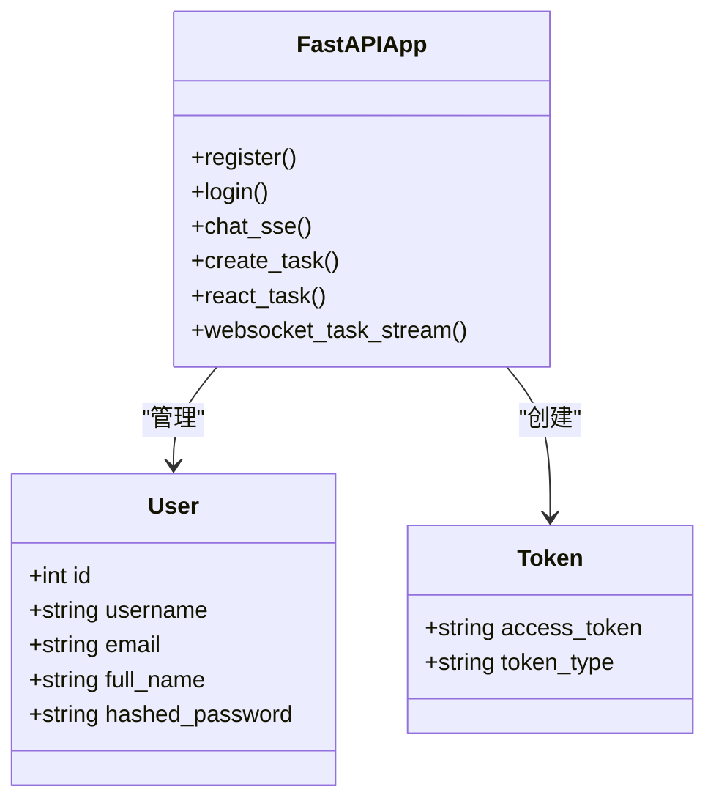
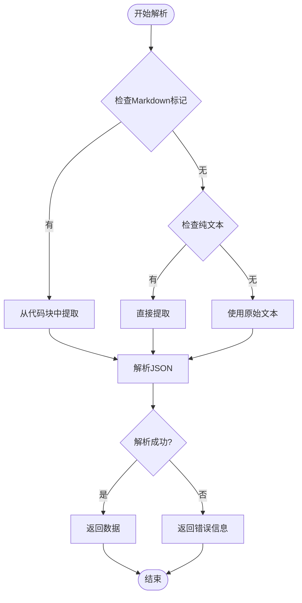
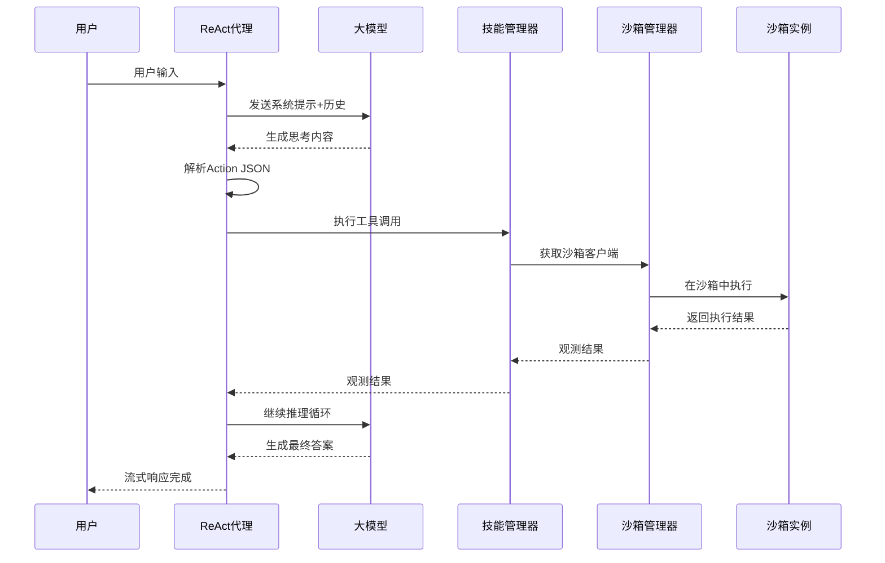
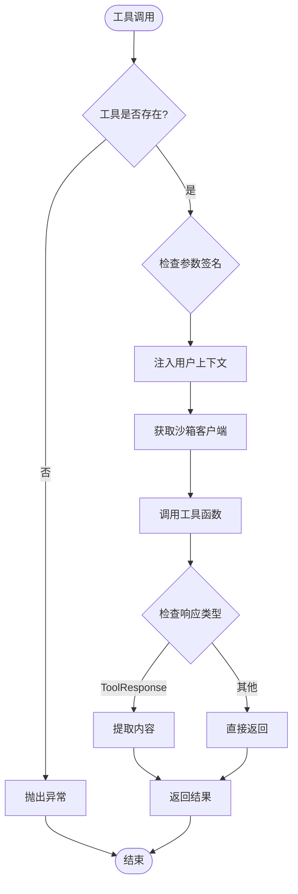
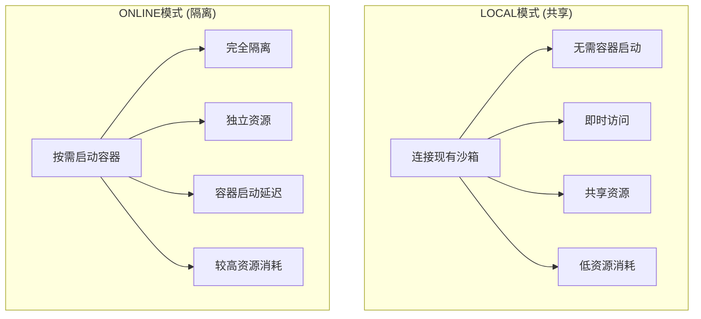
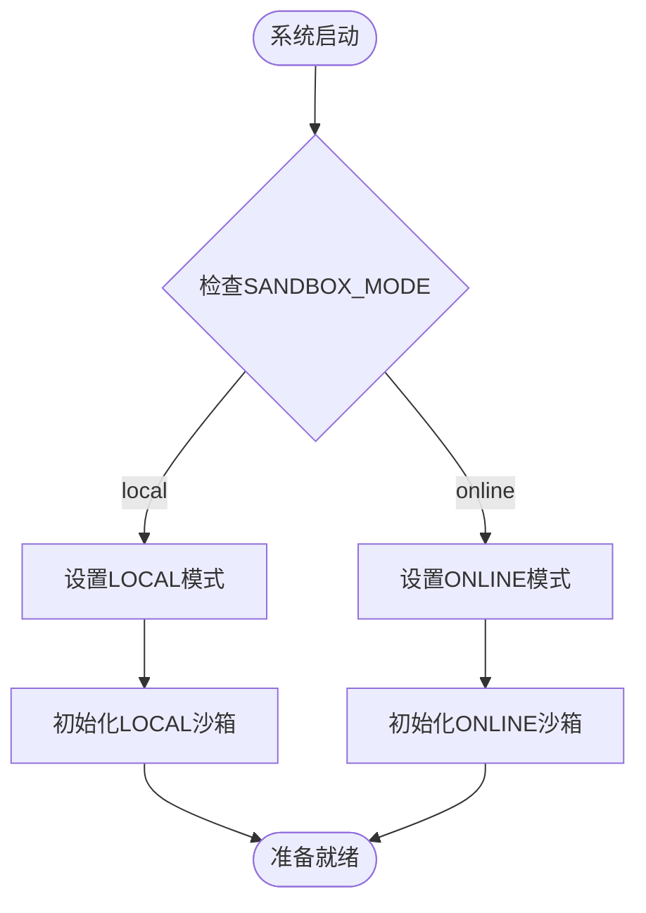
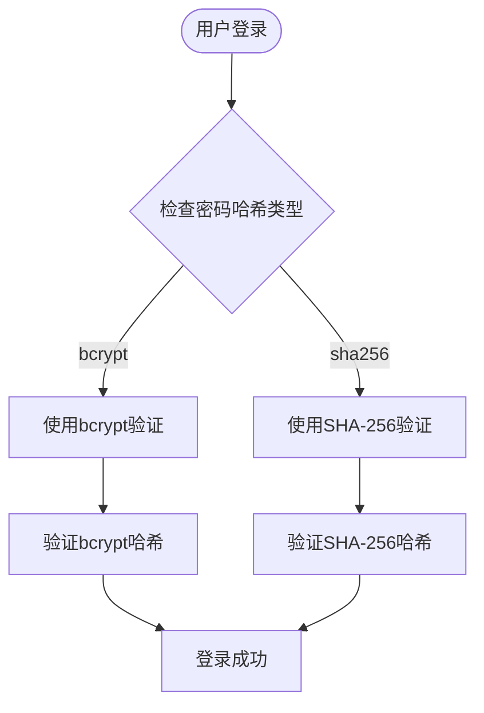
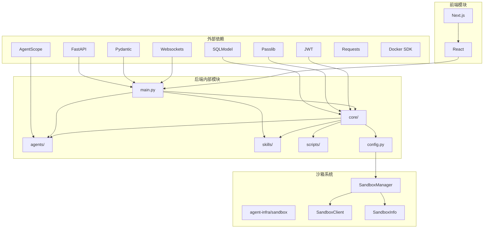

# 沙箱管理系统

<cite>
**本文档引用的文件**
- [main.py](file://localmanus-backend/main.py)
- [orchestrator.py](file://localmanus-backend/core/orchestrator.py)
- [agent_manager.py](file://localmanus-backend/core/agent_manager.py)
- [react_agent.py](file://localmanus-backend/agents/react_agent.py)
- [skill_manager.py](file://localmanus-backend/core/skill_manager.py)
- [sandbox.py](file://localmanus-backend/core/sandbox.py)
- [firecracker_sandbox.py](file://localmanus-backend/core/firecracker_sandbox.py)
- [config.py](file://localmanus-backend/core/config.py)
- [file_ops.py](file://localmanus-backend/skills/file-operations/file_ops.py)
- [system_tools.py](file://localmanus-backend/skills/system-execution/system_tools.py)
- [models.py](file://localmanus-backend/core/models.py)
- [database.py](file://localmanus-backend/core/database.py)
- [auth.py](file://localmanus-backend/core/auth.py)
- [.env.example](file://localmanus-backend/.env.example)
- [requirements.txt](file://localmanus-backend/requirements.txt)
- [docker-compose.yml](file://localmanus-backend/docker-compose.yml)
- [seed_simple.py](file://localmanus-backend/scripts/seed_simple.py)
- [seed_users.py](file://localmanus-backend/scripts/seed_users.py)
- [package.json](file://localmanus-ui/package.json)
- [FIRECRACKER_TROUBLESHOOTING.md](file://localmanus-backend/scripts/FIRECRACKER_TROUBLESHOOTING.md)
- [README.md](file://README.md)
</cite>

## 更新摘要
**变更内容**
- 沙箱连接URL从192.168.126.133:8080更新到192.168.126.133:8080，反映新的基础设施配置
- 更新所有相关文档中的沙箱URL配置示例
- 保持向后兼容性，通过LegacySandboxAdapter适配器
- 新增配置管理和环境变量支持

## 目录
1. [项目概述](#项目概述)
2. [项目结构](#项目结构)
3. [核心组件](#核心组件)
4. [架构概览](#架构概览)
5. [详细组件分析](#详细组件分析)
6. [沙箱双模式系统](#沙箱双模式系统)
7. [数据库种子脚本](#数据库种子脚本)
8. [依赖关系分析](#依赖关系分析)
9. [性能考虑](#性能考虑)
10. [故障排除指南](#故障排除指南)
11. [结论](#结论)

## 项目概述

沙箱管理系统是一个基于FastAPI构建的智能代理系统，集成了多代理协作、工具调用、沙箱执行和用户认证等功能。该系统采用模块化设计，支持多种执行环境，包括本地共享沙箱和在线隔离沙箱。

**更新** 系统已完全重构，从传统的Firecracker微虚拟机架构迁移到现代的agent-infra/sandbox双模式系统，提供更灵活、更强大的执行环境。最新的基础设施变更将沙箱连接URL更新为192.168.126.133:8080，以反映新的服务器配置。

系统的核心特性包括：
- **双模式架构**：LOCAL（共享）和ONLINE（隔离）两种执行模式
- **多代理架构**：包含管理代理、规划代理和ReAct代理
- **流式响应**：支持Server-Sent Events (SSE) 实时流式输出
- **工具系统**：可扩展的技能管理器，支持文件操作、系统执行等工具
- **增强沙箱功能**：提供浏览器自动化、VSCode服务器、Jupyter内核等高级功能
- **用户认证**：基于JWT的用户认证系统
- **数据库种子功能**：提供灵活的用户账户创建选项，支持开发和生产环境的不同需求

## 项目结构



**图表来源**
- [main.py](file://localmanus-backend/main.py#L1-L153)
- [orchestrator.py](file://localmanus-backend/core/orchestrator.py#L1-L108)
- [firecracker_sandbox.py](file://localmanus-backend/core/firecracker_sandbox.py#L1-L294)
- [FIRECRACKER_TROUBLESHOOTING.md](file://localmanus-backend/scripts/FIRECRACKER_TROUBLESHOOTING.md#L1-L304)

**章节来源**
- [main.py](file://localmanus-backend/main.py#L1-L153)
- [docker-compose.yml](file://localmanus-backend/docker-compose.yml#L1-L16)
- [firecracker_sandbox.py](file://localmanus-backend/core/firecracker_sandbox.py#L1-L294)

## 核心组件

### API网关层
系统通过FastAPI提供RESTful API接口，包括用户认证、聊天对话、任务执行等功能。

### 代理管理层
- **管理代理**：负责意图分析和任务理解
- **规划代理**：生成执行计划和工作流程
- **ReAct代理**：实现推理-行动循环，支持工具调用

### 技能管理器
统一管理各种技能工具，支持动态加载和注册。

### 沙箱执行层
**更新** 系统现在使用agent-infra/sandbox双模式架构：

#### SandboxManager - 沙箱管理器
- **统一接口**：支持LOCAL和ONLINE两种模式
- **智能路由**：根据模式选择合适的执行策略
- **资源管理**：容器生命周期管理和清理
- **配置支持**：环境变量驱动的配置管理

#### SandboxClient - API客户端
- **HTTP接口**：基于REST API的沙箱交互
- **功能丰富**：支持命令执行、文件操作、浏览器控制等
- **错误处理**：完善的异常处理和重试机制

#### SandboxInfo - 沙箱信息
- **状态跟踪**：用户沙箱的完整状态信息
- **URL暴露**：VNC、VSCode等访问URL
- **资源标识**：容器ID和网络配置

#### SandboxMode - 执行模式
- **LOCAL模式**：连接现有沙箱实例，共享资源
- **ONLINE模式**：按需启动Docker容器，完全隔离

### 数据库管理
- **SQLite数据库**：默认使用SQLite存储用户数据
- **表结构**：自动创建User表和相关索引
- **种子脚本**：提供灵活的用户账户创建选项

**章节来源**
- [main.py](file://localmanus-backend/main.py#L35-L153)
- [agent_manager.py](file://localmanus-backend/core/agent_manager.py#L1-L44)
- [skill_manager.py](file://localmanus-backend/core/skill_manager.py#L1-L125)
- [database.py](file://localmanus-backend/core/database.py#L1-L17)
- [firecracker_sandbox.py](file://localmanus-backend/core/firecracker_sandbox.py#L103-L294)

## 架构概览



**图表来源**
- [main.py](file://localmanus-backend/main.py#L81-L96)
- [orchestrator.py](file://localmanus-backend/core/orchestrator.py#L16-L54)
- [react_agent.py](file://localmanus-backend/agents/react_agent.py#L105-L221)
- [firecracker_sandbox.py](file://localmanus-backend/core/firecracker_sandbox.py#L235-L243)

## 详细组件分析

### API网关组件

API网关作为系统的入口点，提供了完整的RESTful接口：

#### 用户认证接口
- `/api/register`：用户注册，支持用户名唯一性验证
- `/api/login`：用户登录，返回JWT访问令牌
- `/api/me`：获取当前用户信息

#### 对话接口
- `/api/chat`：SSE流式聊天接口，支持多轮对话历史
- `/api/task`：同步任务规划接口
- `/api/react`：ReAct循环执行接口

#### WebSocket接口
- `/ws/task/{trace_id}`：实时任务执行流



**图表来源**
- [main.py](file://localmanus-backend/main.py#L39-L153)
- [models.py](file://localmanus-backend/core/models.py#L10-L28)

**章节来源**
- [main.py](file://localmanus-backend/main.py#L39-L153)
- [models.py](file://localmanus-backend/core/models.py#L1-L28)

### 协调器组件

协调器是系统的核心控制中心，负责管理代理生命周期和工作流程：

#### 主要功能
- **会话管理**：维护多轮对话历史，支持最多40轮对话
- **工作流程**：执行高阶编排流程，生成DAG计划
- **流式响应**：通过SSE向客户端推送实时响应

#### JSON解析机制
系统实现了智能的JSON提取算法，能够从代理响应中提取结构化数据：



**图表来源**
- [orchestrator.py](file://localmanus-backend/core/orchestrator.py#L72-L87)

**章节来源**
- [orchestrator.py](file://localmanus-backend/core/orchestrator.py#L1-L150)

### ReAct代理组件

ReAct代理实现了先进的推理-行动循环模式：

#### 系统提示模板
代理使用精心设计的系统提示，包含：
- 当前时间和用户信息上下文
- 可用工具的完整元数据
- 严格的响应格式要求

#### 流式执行机制
支持实时流式响应，包括：
- 思考过程（Thought）
- 工具调用（Action）
- 观测结果（Observation）
- 最终答案（Final Answer）



**图表来源**
- [react_agent.py](file://localmanus-backend/agents/react_agent.py#L105-L221)
- [skill_manager.py](file://localmanus-backend/core/skill_manager.py#L90-L117)
- [firecracker_sandbox.py](file://localmanus-backend/core/firecracker_sandbox.py#L235-L243)

**章节来源**
- [react_agent.py](file://localmanus-backend/agents/react_agent.py#L1-L221)

### 技能管理器组件

技能管理器提供了灵活的工具注册和执行机制：

#### 动态加载系统
支持两种类型的技能加载：
1. **Agent技能**：目录形式，包含SKILL.md描述文件
2. **工具函数**：Python文件中的函数或继承自BaseSkill的类方法

#### 工具执行机制
**更新** 技能现在通过SandboxManager获取沙箱客户端：



**图表来源**
- [skill_manager.py](file://localmanus-backend/core/skill_manager.py#L90-L117)

**章节来源**
- [skill_manager.py](file://localmanus-backend/core/skill_manager.py#L1-L125)

### 沙箱执行组件

**更新** 系统已完全重构为agent-infra/sandbox双模式架构：

#### SandboxManager - 统一沙箱管理器
- **模式切换**：根据配置自动选择LOCAL或ONLINE模式
- **资源管理**：容器生命周期管理和自动清理
- **配置驱动**：支持环境变量和配置文件
- **向后兼容**：保持原有接口，内部实现完全重构

#### SandboxClient - HTTP API客户端
- **REST接口**：基于HTTP的标准化API
- **功能完整**：支持命令执行、文件操作、浏览器控制
- **错误处理**：完善的异常处理和重试机制
- **超时控制**：可配置的请求超时时间

#### 沙箱模式对比


**图表来源**
- [firecracker_sandbox.py](file://localmanus-backend/core/firecracker_sandbox.py#L15-L19)
- [FIRECRACKER_TROUBLESHOOTING.md](file://localmanus-backend/scripts/FIRECRACKER_TROUBLESHOOTING.md#L27-L40)

**章节来源**
- [sandbox.py](file://localmanus-backend/core/sandbox.py#L1-L46)
- [firecracker_sandbox.py](file://localmanus-backend/core/firecracker_sandbox.py#L1-L294)

### 技能工具组件

#### 文件操作技能
提供基础的文件系统操作能力：
- 文件读取：支持UTF-8编码的安全读取
- 文件写入：安全的文件内容写入
- 目录列表：列出指定目录的内容
- **更新** 支持沙箱内文件操作，通过SandboxClient实现

#### 系统执行技能
提供系统级别的执行能力：
- Python代码执行：异步执行Python代码
- Shell命令执行：安全的shell命令执行

**章节来源**
- [file_ops.py](file://localmanus-backend/skills/file-operations/file_ops.py#L1-L191)
- [system_tools.py](file://localmanus-backend/skills/system-execution/system_tools.py#L1-L78)

## 沙箱双模式系统

**新增** 系统现在支持两种执行模式，提供灵活的部署选项：

### LOCAL模式 - 共享环境

#### 特点
- **即时连接**：直接连接到现有的沙箱实例
- **零容器启动**：无需启动Docker容器
- **资源共享**：多个用户共享同一沙箱实例
- **低延迟**：无容器启动等待时间
- **低成本**：最小的资源消耗

#### 适用场景
- 开发和测试环境
- 单用户或多用户共享环境
- 资源受限的部署场景
- 快速原型开发

#### 配置示例
```bash
# .env配置
SANDBOX_MODE=local
SANDBOX_LOCAL_URL=http://192.168.126.133:8080
```

### ONLINE模式 - 隔离环境

#### 特点
- **按需启动**：为每个用户启动独立的Docker容器
- **完全隔离**：每个用户拥有独立的执行环境
- **独立资源**：容器内独立的CPU、内存、存储资源
- **容器管理**：自动的容器生命周期管理
- **中国镜像**：支持国内Docker镜像加速

#### 适用场景
- 生产环境部署
- 多用户隔离需求
- 安全敏感的应用
- 企业级部署

#### 配置示例
```bash
# .env配置
SANDBOX_MODE=online
USE_CHINA_MIRROR=false  # 设置为true在中国大陆使用镜像
```

### 模式切换机制



**图表来源**
- [config.py](file://localmanus-backend/core/config.py#L23-L26)
- [firecracker_sandbox.py](file://localmanus-backend/core/firecracker_sandbox.py#L276-L290)

### 向后兼容性

系统通过LegacySandboxAdapter保持向后兼容：

#### LegacySandboxAdapter
- **接口映射**：将新的SandboxManager接口映射到旧的格式
- **返回值转换**：将新的JSON响应转换为旧的{stdout, stderr, exit_code}格式
- **异常处理**：捕获并转换异常，保持错误处理一致性
- **无缝升级**：允许逐步迁移现有代码

**章节来源**
- [FIRECRACKER_TROUBLESHOOTING.md](file://localmanus-backend/scripts/FIRECRACKER_TROUBLESHOOTING.md#L1-L304)
- [README.md](file://README.md#L139-L151)
- [test_sandbox.py](file://localmanus-backend/scripts/test_sandbox.py#L1-L191)
- [config.py](file://localmanus-backend/core/config.py#L23-L26)
- [sandbox.py](file://localmanus-backend/core/sandbox.py#L11-L46)

## 数据库种子脚本

系统提供了两个数据库种子脚本，用于灵活的用户账户创建：

### seed_simple.py - 简化版种子脚本

这个脚本专门用于演示目的，使用简单的SHA-256哈希算法，避免了passlib库的复杂性：

#### 主要特性
- **简单哈希**：使用固定盐值的SHA-256哈希
- **演示友好**：密码长度不受bcrypt限制
- **快速部署**：无需复杂的密码哈希库依赖

#### 使用场景
- 开发环境快速启动
- 演示和测试环境
- 避免第三方库依赖的问题

### seed_users.py - 标准版种子脚本

这个脚本使用标准的bcrypt密码哈希，适用于生产环境：

#### 主要特性
- **安全哈希**：使用passlib的bcrypt算法
- **生产就绪**：符合安全最佳实践
- **兼容性**：与系统认证流程完全兼容

#### 使用场景
- 生产环境部署
- 需要严格安全性的应用
- 标准的企业级应用

### 两种脚本的兼容性

系统认证模块已经进行了特殊处理，可以同时支持两种不同哈希方式的用户：

#### 密码验证机制


**图表来源**
- [auth.py](file://localmanus-backend/core/auth.py#L20-L32)

**章节来源**
- [seed_simple.py](file://localmanus-backend/scripts/seed_simple.py#L1-L67)
- [seed_users.py](file://localmanus-backend/scripts/seed_users.py#L1-L53)
- [auth.py](file://localmanus-backend/core/auth.py#L1-L82)

## 依赖关系分析



**图表来源**
- [requirements.txt](file://localmanus-backend/requirements.txt#L1-L11)
- [package.json](file://localmanus-ui/package.json#L11-L24)
- [firecracker_sandbox.py](file://localmanus-backend/core/firecracker_sandbox.py#L1-L13)

**章节来源**
- [requirements.txt](file://localmanus-backend/requirements.txt#L1-L11)
- [package.json](file://localmanus-ui/package.json#L1-L26)
- [firecracker_sandbox.py](file://localmanus-backend/core/firecracker_sandbox.py#L1-L13)

## 性能考虑

### 并发处理
- **异步编程**：大量使用async/await提高并发性能
- **流式响应**：SSE实现实时数据传输
- **WebSocket支持**：双向实时通信

### 资源管理
- **连接池**：数据库连接自动管理
- **进程监控**：命令执行超时控制
- **内存优化**：会话历史长度限制
- **容器管理**：ONLINE模式下的容器生命周期管理

### 扩展性设计
- **插件架构**：技能系统支持动态加载
- **模块化设计**：清晰的组件分离
- **配置驱动**：环境变量和配置文件
- **双模式支持**：灵活的部署选项

### 沙箱性能优化

**更新** 新的沙箱系统在性能方面有显著改进：

#### LOCAL模式优势
- **零启动延迟**：直接连接现有沙箱
- **资源共享**：减少内存和CPU占用
- **即时响应**：无容器启动等待时间

#### ONLINE模式优化
- **容器复用**：避免重复启动相同用户容器
- **自动清理**：定期清理停止的容器
- **资源隔离**：确保每个用户获得独立资源

## 故障排除指南

### 常见问题诊断

#### 认证相关问题
- **401未授权**：检查JWT令牌是否正确传递
- **用户不存在**：确认用户已在数据库中注册
- **密码错误**：验证密码哈希匹配
- **种子脚本冲突**：确保只使用一个种子脚本

#### 技能执行问题
- **工具未找到**：检查技能目录结构和文件命名
- **权限不足**：验证沙箱权限设置
- **超时错误**：调整命令执行超时时间

#### 网络连接问题
- **CORS错误**：检查前端域名配置
- **WebSocket断开**：验证连接状态和防火墙设置

#### 沙箱系统问题
**更新** 新增沙箱系统特定问题：

- **LOCAL模式连接失败**：检查SANDBOX_LOCAL_URL配置
- **ONLINE模式容器启动失败**：验证Docker服务状态
- **沙箱API调用超时**：检查网络连接和防火墙设置
- **容器资源不足**：增加系统内存和磁盘空间

#### 数据库种子问题
- **表创建失败**：检查SQLite文件权限
- **用户重复**：种子脚本会自动跳过已存在的用户
- **哈希不匹配**：确认使用正确的种子脚本

### 沙箱系统调试

**新增** 提供沙箱系统的调试工具：

#### 测试脚本
系统包含完整的测试脚本，支持两种模式的验证：

```bash
# 测试LOCAL模式
python scripts/test_sandbox.py --mode local

# 测试ONLINE模式  
python scripts/test_sandbox.py --mode online

# 测试直接API客户端
python scripts/test_sandbox.py --mode client
```

#### 常用诊断命令
```bash
# 检查沙箱连接
curl http://192.168.126.133:8080/v1/sandbox

# 查看运行中的沙箱容器
docker ps | grep localmanus-sandbox

# 清理所有沙箱容器
docker ps -a | grep localmanus-sandbox | awk '{print $1}' | xargs docker rm -f
```

**章节来源**
- [main.py](file://localmanus-backend/main.py#L57-L71)
- [skill_manager.py](file://localmanus-backend/core/skill_manager.py#L90-L117)
- [seed_simple.py](file://localmanus-backend/scripts/seed_simple.py#L40-L61)
- [FIRECRACKER_TROUBLESHOOTING.md](file://localmanus-backend/scripts/FIRECRACKER_TROUBLESHOOTING.md#L264-L292)

## 结论

沙箱管理系统经过完全重构，现已发展为一个功能强大、灵活高效的现代化平台，具有以下优势：

### 技术亮点
- **双模式架构**：LOCAL和ONLINE模式满足不同部署需求
- **模块化设计**：清晰的分层架构便于维护和扩展
- **安全性增强**：ONLINE模式提供完全的执行环境隔离
- **实时性**：流式响应和WebSocket支持
- **可扩展性**：插件化的技能系统和配置驱动的沙箱管理
- **向后兼容**：通过适配器保持现有代码的兼容性
- **功能丰富**：支持浏览器自动化、VSCode服务器、Jupyter内核等高级功能

### 应用价值
- **开发效率**：自动化的工作流程生成和沙箱管理
- **学习辅助**：交互式的AI助手和可视化调试工具
- **研究平台**：可扩展的代理实验环境和多模式测试
- **部署灵活性**：适应不同环境需求的双模式沙箱系统
- **企业级安全**：生产环境的完全隔离和资源控制

### 改进建议
- **完善监控系统**：添加沙箱使用统计和性能监控
- **增强日志记录**：提供详细的沙箱操作日志
- **优化容器管理**：实现更智能的容器生命周期管理
- **扩展API功能**：支持更多沙箱操作和状态查询
- **添加可视化界面**：提供沙箱状态和资源使用的可视化面板

### 迁移建议

**更新** 对于从旧系统迁移的用户：

1. **配置更新**：修改.env文件，将SANDBOX_LOCAL_URL从192.168.126.133:8080更新为192.168.126.133:8080
2. **代码适配**：利用LegacySandboxAdapter保持现有代码兼容
3. **模式选择**：根据需求选择LOCAL或ONLINE模式
4. **功能探索**：充分利用新的沙箱功能，如浏览器自动化

**更新** 该系统为构建复杂的AI应用提供了坚实的基础框架，新的双模式沙箱系统特别增强了系统的灵活性和安全性。最新的基础设施变更（沙箱URL更新至192.168.126.133:8080）反映了系统在生产环境中的稳定性和可靠性。新增的浏览器自动化、VSCode服务器、Jupyter内核等功能，为AI应用开发提供了更加丰富的工具链支持。