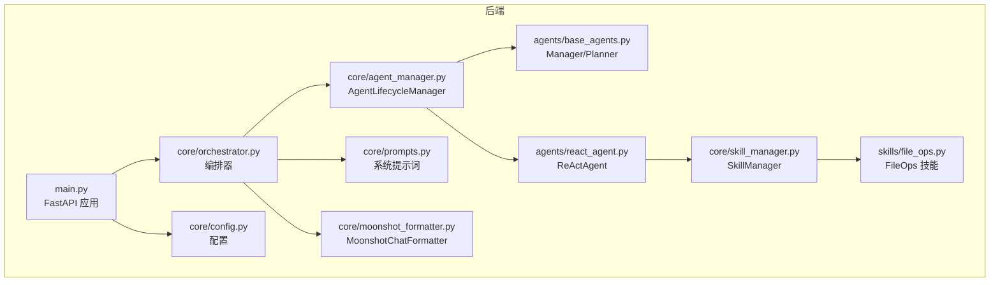
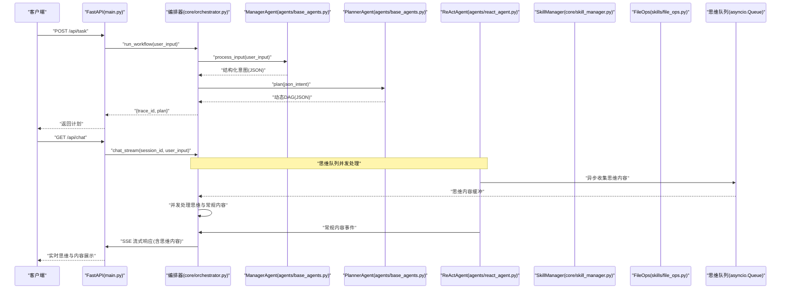
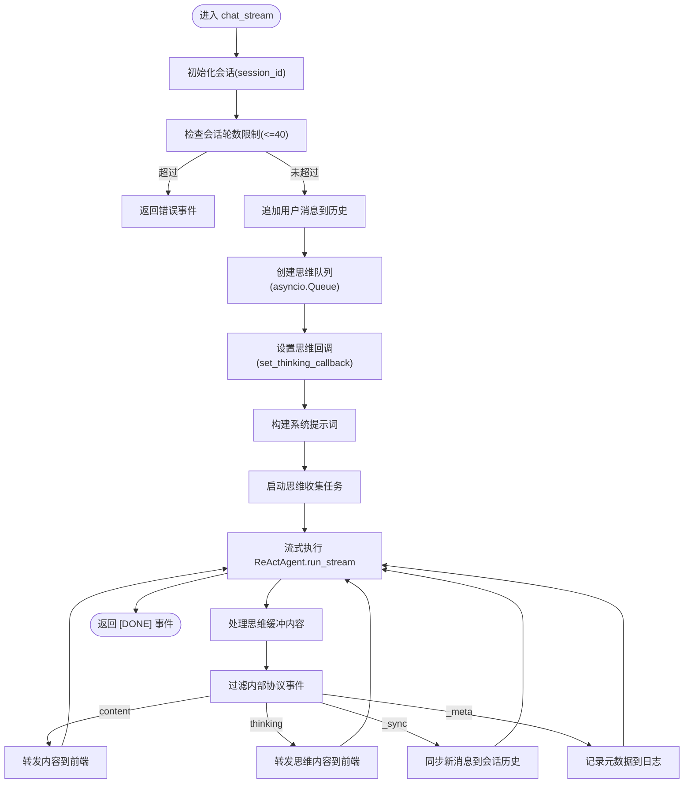
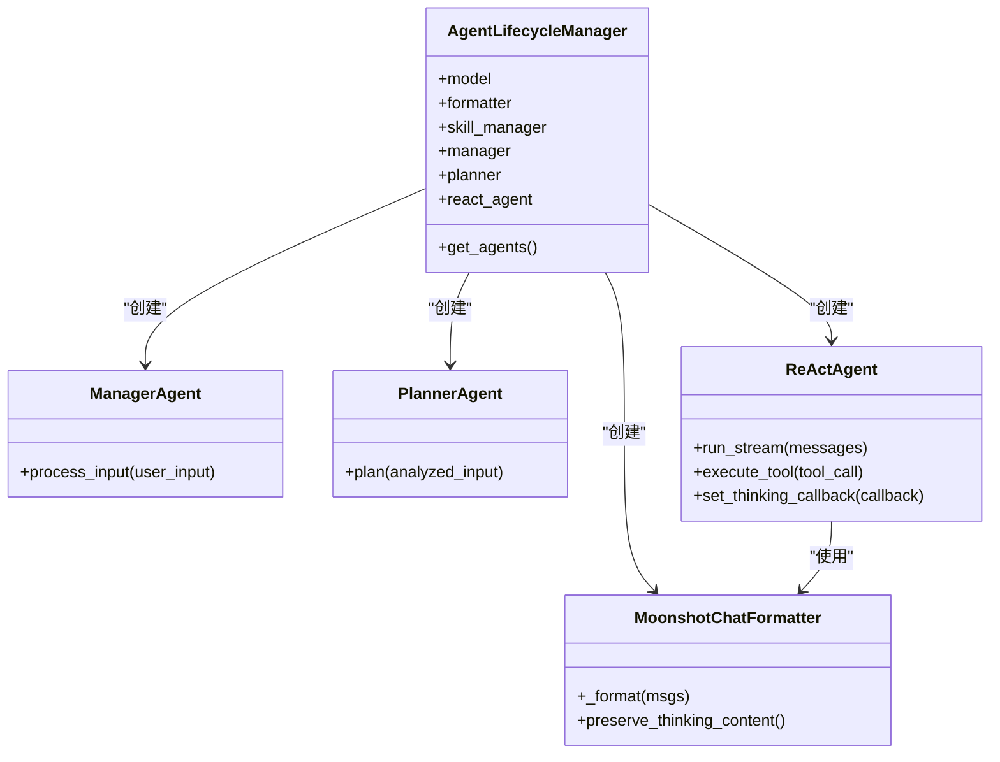
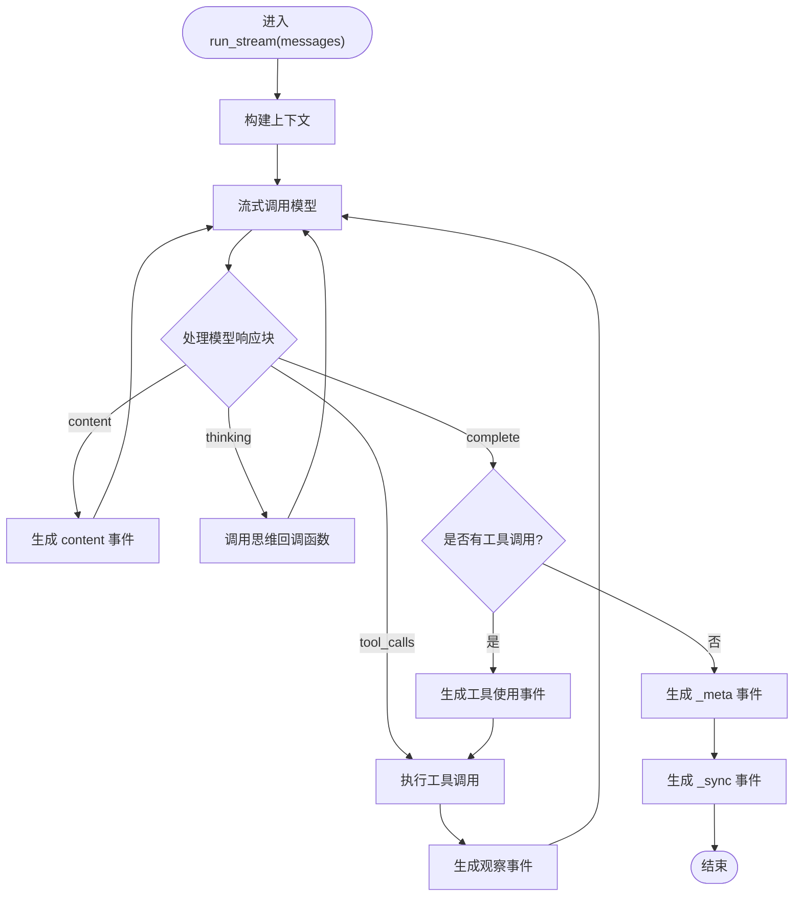
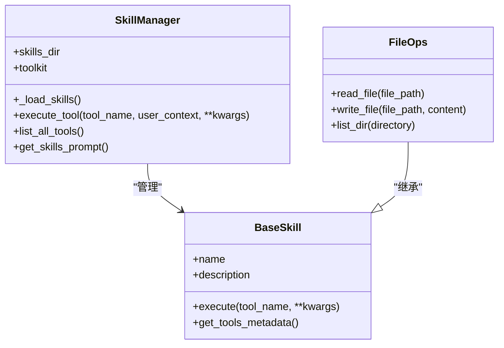
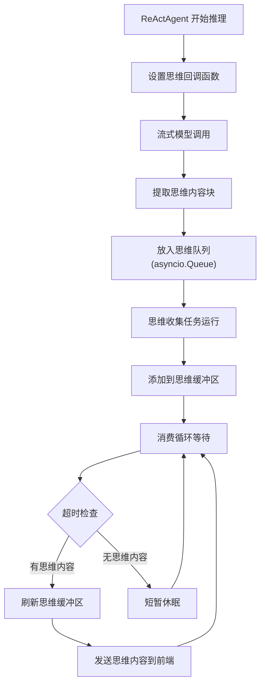
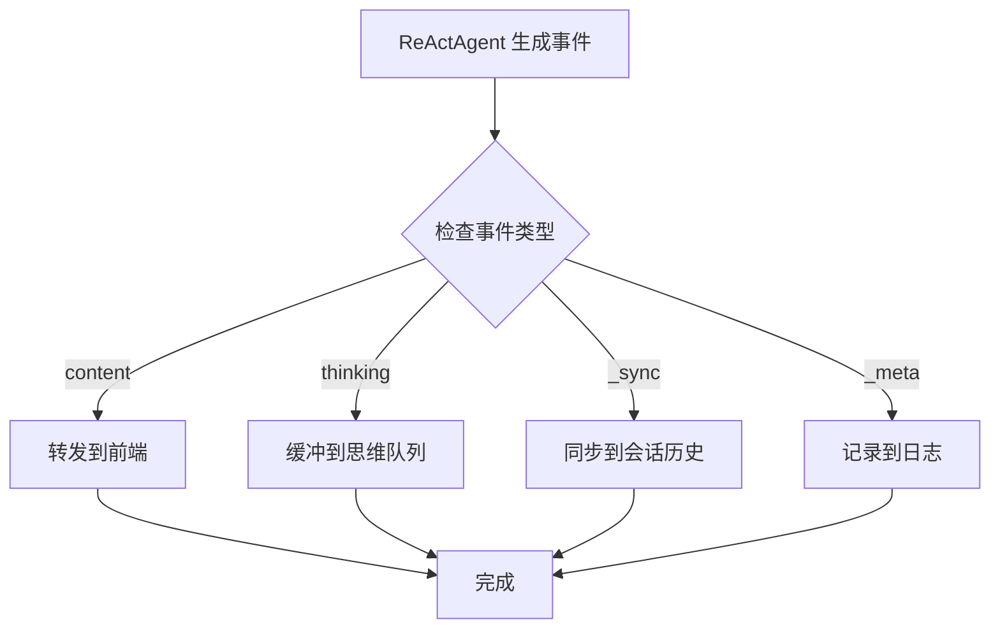
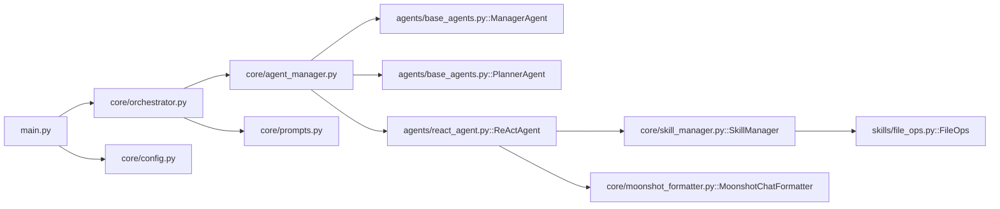

# 编排器系统

<cite>
**本文引用的文件**
- [localmanus-backend/core/orchestrator.py](file://localmanus-backend/core/orchestrator.py)
- [localmanus-backend/core/agent_manager.py](file://localmanus-backend/core/agent_manager.py)
- [localmanus-backend/agents/react_agent.py](file://localmanus-backend/agents/react_agent.py)
- [localmanus-backend/agents/base_agents.py](file://localmanus-backend/agents/base_agents.py)
- [localmanus-backend/core/skill_manager.py](file://localmanus-backend/core/skill_manager.py)
- [localmanus-backend/core/prompts.py](file://localmanus-backend/core/prompts.py)
- [localmanus-backend/skills/file_ops.py](file://localmanus-backend/skills/file_ops.py)
- [localmanus-backend/main.py](file://localmanus-backend/main.py)
- [localmanus-backend/scripts/test_orchestration.py](file://localmanus-backend/scripts/test_orchestration.py)
- [localmanus-backend/core/config.py](file://localmanus-backend/core/config.py)
- [localmanus-backend/core/moonshot_formatter.py](file://localmanus-backend/core/moonshot_formatter.py)
- [localmanus_architecture.md](file://localmanus_architecture.md)
- [localmanus_prd.md](file://localmanus_prd.md)
- [localmanus-ui/app/page.tsx](file://localmanus-ui/app/page.tsx)
</cite>

## 更新摘要
**变更内容**
- 新增思维队列并发处理能力，包括 asyncio.Queue 思维缓冲和思维内容与常规内容的并发处理
- 实现思维内容的异步收集和缓冲机制，提升 ReActAgent 思考过程的实时性
- 增强 MoonshotChatFormatter 对思维模式的支持，确保思维内容与工具调用的正确格式化
- 优化并发处理流程，实现思维内容与常规内容的并行处理和有序输出

## 目录
1. [引言](#引言)
2. [项目结构](#项目结构)
3. [核心组件](#核心组件)
4. [架构总览](#架构总览)
5. [详细组件分析](#详细组件分析)
6. [思维队列并发处理系统](#思维队列并发处理系统)
7. [内部协议事件系统](#内部协议事件系统)
8. [依赖关系分析](#依赖关系分析)
9. [性能考量](#性能考量)
10. [故障排除指南](#故障排除指南)
11. [结论](#结论)
12. [附录](#附录)

## 引言
本技术文档围绕 LocalManus 编排器系统展开，聚焦于以下目标：
- 深入解释编排器的核心职责与工作流程：任务工作流编排、ReAct 循环管理、JSON 解析与错误处理。
- 说明编排器如何协调不同类型的智能体完成复杂任务：会话状态管理、任务调度与结果聚合。
- 阐述与 AgentLifecycleManager 的协作关系与数据流转过程。
- 详细介绍新的思维队列并发处理能力，实现思维内容与常规内容的异步缓冲和并行处理。
- 提供性能优化建议与故障排除指南。

## 项目结构
后端采用模块化组织，核心位于 localmanus-backend，按"核心编排/智能体/技能"分层：
- core：编排器、智能体生命周期管理、提示词、技能管理、配置、思维格式化器
- agents：ReAct 智能体与基础智能体封装
- skills：可插拔技能集合
- scripts：测试脚本
- main.py：FastAPI 入口，提供 SSE/WebSocket 接口

**图表来源**
- [localmanus-backend/main.py](file://localmanus-backend/main.py#L1-L153)
- [localmanus-backend/core/orchestrator.py](file://localmanus-backend/core/orchestrator.py#L1-L216)
- [localmanus-backend/core/agent_manager.py](file://localmanus-backend/core/agent_manager.py#L1-L52)
- [localmanus-backend/agents/react_agent.py](file://localmanus-backend/agents/react_agent.py#L1-L390)
- [localmanus-backend/agents/base_agents.py](file://localmanus-backend/agents/base_agents.py#L1-L42)
- [localmanus-backend/core/skill_manager.py](file://localmanus-backend/core/skill_manager.py#L1-L143)
- [localmanus-backend/skills/file_ops.py](file://localmanus-backend/skills/file_ops.py#L1-L41)
- [localmanus-backend/core/prompts.py](file://localmanus-backend/core/prompts.py#L1-L53)
- [localmanus-backend/core/config.py](file://localmanus-backend/core/config.py#L1-L21)
- [localmanus-backend/core/moonshot_formatter.py](file://localmanus-backend/core/moonshot_formatter.py#L1-L143)

**章节来源**
- [localmanus-backend/main.py](file://localmanus-backend/main.py#L1-L153)
- [localmanus-backend/core/orchestrator.py](file://localmanus-backend/core/orchestrator.py#L1-L216)
- [localmanus-backend/core/agent_manager.py](file://localmanus-backend/core/agent_manager.py#L1-L52)
- [localmanus-backend/agents/react_agent.py](file://localmanus-backend/agents/react_agent.py#L1-L390)
- [localmanus-backend/agents/base_agents.py](file://localmanus-backend/agents/base_agents.py#L1-L42)
- [localmanus-backend/core/skill_manager.py](file://localmanus-backend/core/skill_manager.py#L1-L143)
- [localmanus-backend/skills/file_ops.py](file://localmanus-backend/skills/file_ops.py#L1-L41)
- [localmanus-backend/core/prompts.py](file://localmanus-backend/core/prompts.py#L1-L53)
- [localmanus-backend/core/config.py](file://localmanus-backend/core/config.py#L1-L21)
- [localmanus-backend/core/moonshot_formatter.py](file://localmanus-backend/core/moonshot_formatter.py#L1-L143)

## 核心组件
- Orchestrator：负责任务工作流编排、ReAct 循环管理、JSON 解析与错误处理、会话状态管理与结果聚合。**新增思维队列并发处理能力**。
- AgentLifecycleManager：初始化 AgentScope 模型、格式化器、记忆体、技能管理器，并创建 Manager/Planner/ReActAgent。
- ManagerAgent/PlannerAgent：基于 ReActAgent 的封装，分别承担意图解析与动态 DAG 规划。
- ReActAgent：执行 ReAct 循环（思考-行动-观察），解析动作字符串并调用技能执行，收集上下文直至得到最终答案。**增强流式执行能力与思维内容处理**。
- SkillManager：动态加载技能模块，提供工具元数据与技能路由。
- FileOps 技能：示例技能，提供文件读写与目录列举等基础能力。
- MoonshotChatFormatter：支持思维模式的 OpenAI 兼容格式化器，确保思维内容与工具调用的正确格式化。
- FastAPI 接口：提供 SSE、WebSocket、同步接口，驱动编排器执行。

**章节来源**
- [localmanus-backend/core/orchestrator.py](file://localmanus-backend/core/orchestrator.py#L12-L216)
- [localmanus-backend/core/agent_manager.py](file://localmanus-backend/core/agent_manager.py#L11-L52)
- [localmanus-backend/agents/base_agents.py](file://localmanus-backend/agents/base_agents.py#L6-L42)
- [localmanus-backend/agents/react_agent.py](file://localmanus-backend/agents/react_agent.py#L32-L390)
- [localmanus-backend/core/skill_manager.py](file://localmanus-backend/core/skill_manager.py#L17-L143)
- [localmanus-backend/skills/file_ops.py](file://localmanus-backend/skills/file_ops.py#L4-L41)
- [localmanus-backend/core/moonshot_formatter.py](file://localmanus-backend/core/moonshot_formatter.py#L19-L143)
- [localmanus-backend/main.py](file://localmanus-backend/main.py#L1-L153)

## 架构总览
编排器系统采用"智能体驱动"的动态工作流，核心链路如下：
- 输入经 ManagerAgent 标准化为结构化意图
- PlannerAgent 基于可用技能生成动态 DAG
- Orchestrator 注入 trace_id 并返回计划
- ReActAgent 在工具可用时执行 ReAct 循环，通过 SkillManager 调用具体技能
- **新增思维队列并发处理**：ReActAgent 的思维内容通过 asyncio.Queue 异步收集，与常规内容并行处理
- 会话状态在 Orchestrator 中维护，支持多轮对话与上限控制

**图表来源**
- [localmanus-backend/main.py](file://localmanus-backend/main.py#L81-L96)
- [localmanus-backend/core/orchestrator.py](file://localmanus-backend/core/orchestrator.py#L17-L161)
- [localmanus-backend/agents/base_agents.py](file://localmanus-backend/agents/base_agents.py#L19-L40)
- [localmanus-backend/agents/react_agent.py](file://localmanus-backend/agents/react_agent.py#L65-L125)
- [localmanus-backend/core/skill_manager.py](file://localmanus-backend/core/skill_manager.py#L75-L83)
- [localmanus-backend/skills/file_ops.py](file://localmanus-backend/skills/file_ops.py#L9-L30)

## 详细组件分析

### 编排器（Orchestrator）
职责与流程
- 会话状态管理：以 session_id 为键维护消息历史，支持多轮对话与上限控制（默认最多 40 轮）。
- 任务工作流编排：调用 ManagerAgent 标准化输入，再调用 PlannerAgent 生成动态 DAG，附加 trace_id 后返回。
- ReAct 循环管理：封装 ReActAgent.run_stream，收集中间思考与观察，直到出现 Final Answer 或达到最大迭代次数。
- **新增思维队列并发处理**：创建 asyncio.Queue 用于收集 ReActAgent 的思维内容，通过异步任务并行处理思维与常规内容。
- JSON 解析与错误处理：从智能体响应中抽取 JSON 块，若解析失败返回包含原始内容的错误对象；在流式接口中以事件流形式返回状态、内容与错误。

关键点
- 会话上限：超过上限时返回错误事件，避免无限增长。
- **思维队列管理**：使用 asyncio.Queue 和 asyncio.Lock 确保思维内容的线程安全缓冲。
- **并发处理**：思维内容通过独立的异步任务收集，与常规内容流式处理并行进行。
- **思维缓冲**：使用 thinking_buffer 和 thinking_lock 保证思维内容的有序输出。
- **资源清理**：正确取消思维收集任务，清理回调函数，避免内存泄漏。

**图表来源**
- [localmanus-backend/core/orchestrator.py](file://localmanus-backend/core/orchestrator.py#L17-L161)
- [localmanus-backend/agents/react_agent.py](file://localmanus-backend/agents/react_agent.py#L65-L125)

**章节来源**
- [localmanus-backend/core/orchestrator.py](file://localmanus-backend/core/orchestrator.py#L12-L216)

### AgentLifecycleManager 与智能体协作
职责与流程
- 初始化 AgentScope：创建模型、格式化器与记忆体。
- **新增 MoonshotChatFormatter**：使用支持思维模式的格式化器，确保思维内容与工具调用的正确格式化。
- 创建核心智能体：ManagerAgent、PlannerAgent、ReActAgent。
- 通过全局工厂函数 init_agents 提供统一入口，避免重复初始化。

**图表来源**
- [localmanus-backend/core/agent_manager.py](file://localmanus-backend/core/agent_manager.py#L11-L52)
- [localmanus-backend/agents/base_agents.py](file://localmanus-backend/agents/base_agents.py#L6-L42)
- [localmanus-backend/agents/react_agent.py](file://localmanus-backend/agents/react_agent.py#L32-L47)
- [localmanus-backend/core/moonshot_formatter.py](file://localmanus-backend/core/moonshot_formatter.py#L19-L143)

**章节来源**
- [localmanus-backend/core/agent_manager.py](file://localmanus-backend/core/agent_manager.py#L11-L52)

### ReActAgent 循环与工具执行
职责与流程
- 构建系统提示词：注入工具元数据，指导智能体遵循 ReAct 格式。
- **增强流式执行**：ReActAgent.run_stream 返回异步生成器，支持内容流式传输和内部协议事件。
- **思维内容处理**：通过 set_thinking_callback 设置回调函数，异步收集思维内容。
- ReAct 循环：接收上下文，生成响应；若包含 Final Answer 则结束；否则解析 Action 行，调用技能执行并追加 Observation。
- **内部协议事件生成**：在流式过程中生成三种类型的事件：
  - content：前端可见的内容片段
  - _sync：内部同步事件，包含本次运行产生的新消息
  - _meta：元数据事件，包含运行统计信息
- 参数解析：示例中使用 eval 解析参数字典，存在安全风险，建议替换为更安全的解析方式。
- 上下文累积：将每次思考、行动与观察加入上下文，提升推理连贯性。

**图表来源**
- [localmanus-backend/agents/react_agent.py](file://localmanus-backend/agents/react_agent.py#L65-L125)
- [localmanus-backend/agents/react_agent.py](file://localmanus-backend/agents/react_agent.py#L22-L30)
- [localmanus-backend/core/skill_manager.py](file://localmanus-backend/core/skill_manager.py#L90-L143)

**章节来源**
- [localmanus-backend/agents/react_agent.py](file://localmanus-backend/agents/react_agent.py#L32-L390)
- [localmanus-backend/core/skill_manager.py](file://localmanus-backend/core/skill_manager.py#L17-L143)

### 技能系统与工具元数据
职责与流程
- BaseSkill：统一技能接口，提供 execute 路由与 get_tools_metadata 元数据导出。
- SkillManager：动态扫描 skills 目录，导入技能类实例，建立名称到实例的映射；提供 list_all_tools 汇总工具元数据。
- FileOps：示例技能，提供文件读写与目录列举等方法，作为 ReActAgent 的工具之一。

**图表来源**
- [localmanus-backend/core/skill_manager.py](file://localmanus-backend/core/skill_manager.py#L17-L143)
- [localmanus-backend/skills/file_ops.py](file://localmanus-backend/skills/file_ops.py#L4-L41)

**章节来源**
- [localmanus-backend/core/skill_manager.py](file://localmanus-backend/core/skill_manager.py#L17-L143)
- [localmanus-backend/skills/file_ops.py](file://localmanus-backend/skills/file_ops.py#L4-L41)

### 会话状态管理与接口
- 会话存储：以 session_id 为键维护消息列表，支持多轮对话。
- 会话上限：默认最多 40 条消息（20 轮），超过则返回错误事件。
- 接口：
  - SSE /api/chat：多轮聊天流式输出，包含状态、内容与错误事件。
  - /api/task：同步任务规划，返回动态 DAG。
  - /api/react：同步 ReAct 循环执行，返回最终结果。
  - WebSocket /ws/task/{trace_id}：用于任务流式推进（示例中演示了 ReAct 思考与结果）。

**章节来源**
- [localmanus-backend/core/orchestrator.py](file://localmanus-backend/core/orchestrator.py#L17-L161)
- [localmanus-backend/main.py](file://localmanus-backend/main.py#L81-L153)

## 思维队列并发处理系统

### 系统架构概述
编排器系统引入了全新的思维队列并发处理能力，通过以下核心组件实现思维内容与常规内容的异步缓冲和并行处理：

- **asyncio.Queue 思维缓冲**：用于异步收集 ReActAgent 产生的思维内容
- **异步思维收集任务**：独立的 asyncio.Task 负责从队列中获取思维内容
- **思维缓冲区**：使用 asyncio.Lock 保护的共享缓冲区，确保线程安全
- **并发处理机制**：思维内容与常规内容流式处理并行进行

### 思维内容收集流程

**图表来源**
- [localmanus-backend/core/orchestrator.py](file://localmanus-backend/core/orchestrator.py#L45-L109)
- [localmanus-backend/agents/react_agent.py](file://localmanus-backend/agents/react_agent.py#L22-L30)

### 并发处理机制

**思维队列初始化**：
- 在 Orchestrator.chat_stream 中创建 `thinking_queue = asyncio.Queue()` 实例
- 设置思维回调函数 `set_thinking_callback(thinking_callback)`，将思维内容异步放入队列

**异步收集任务**：
- `collect_thinking()` 函数创建独立的 asyncio.Task
- 使用 `asyncio.wait_for(thinking_queue.get(), timeout=0.05)` 实现非阻塞获取
- 通过 `thinking_lock` 保护思维缓冲区的线程安全访问

**并发输出处理**：
- 在主循环中，先检查并输出任何待处理的思维内容
- 然后处理常规内容事件，确保思维内容的实时性
- 最终清理剩余的思维内容，避免丢失

### 思维内容格式化

**MoonshotChatFormatter 的作用**：
- 支持思维模式的 OpenAI 兼容格式化
- 将思维内容块转换为 `reasoning_content` 字段
- 确保思维内容与工具调用的正确关联

**格式化流程**：
- 检测 assistant 消息中的 thinking 块
- 提取思维文本内容
- 当同时存在工具调用时，将思维内容注入到 `reasoning_content` 字段
- 维护内容块的完整性，避免思维内容被丢弃

**章节来源**
- [localmanus-backend/core/orchestrator.py](file://localmanus-backend/core/orchestrator.py#L45-L161)
- [localmanus-backend/agents/react_agent.py](file://localmanus-backend/agents/react_agent.py#L22-L30)
- [localmanus-backend/core/moonshot_formatter.py](file://localmanus-backend/core/moonshot_formatter.py#L19-L143)

## 内部协议事件系统

### 事件类型定义
编排器系统引入了标准化的内部协议事件，用于区分前端可见内容和内部管理信息：

- **content 事件**：包含实际的聊天内容，直接转发给前端显示
- **_sync 事件**：内部同步事件，包含本次 ReAct 循环产生的新消息，用于更新会话历史
- **_meta 事件**：内部元数据事件，包含运行统计信息，用于日志记录和监控
- **thinking 事件**：**新增**思维内容事件，包含 ReActAgent 的推理过程

### 事件处理流程

**图表来源**
- [localmanus-backend/core/orchestrator.py](file://localmanus-backend/core/orchestrator.py#L112-L134)
- [localmanus-backend/agents/react_agent.py](file://localmanus-backend/agents/react_agent.py#L65-L125)

### 事件生成机制

**content 事件**：在流式模型响应中提取增量内容，逐字节或逐字符地生成事件，确保前端实时显示效果。

**thinking 事件**：**新增**在 ReActAgent 的推理过程中，当检测到思维内容块时，通过回调函数异步收集并生成事件，实现实时思维展示。

**_sync 事件**：在 ReAct 循环结束后，将本次运行产生的所有新消息（包括助手回复和系统观察）打包成 _sync 事件，确保会话历史的完整性。

**_meta 事件**：包含工具调用数量、是否需要继续等运行统计信息，用于调试和性能监控。

**章节来源**
- [localmanus-backend/core/orchestrator.py](file://localmanus-backend/core/orchestrator.py#L17-L161)
- [localmanus-backend/agents/react_agent.py](file://localmanus-backend/agents/react_agent.py#L65-L125)

## 依赖关系分析
- 模块耦合
  - Orchestrator 依赖 AgentLifecycleManager 提供的智能体实例。
  - ReActAgent 依赖 SkillManager 获取技能实例与工具元数据。
  - **新增 MoonshotChatFormatter**：支持思维模式的格式化器，确保思维内容正确处理。
  - Manager/Planner 基于 ReActAgent，复用系统提示词与格式化器。
  - FastAPI 作为入口，将请求委派给 Orchestrator 并返回结果。
- 外部依赖
  - AgentScope：提供智能体框架、消息传递与格式化器。
  - OpenAI Chat 模型：通过环境变量配置，支持本地或云端模型。
  - 技能目录：动态加载，支持扩展新技能。

**图表来源**
- [localmanus-backend/main.py](file://localmanus-backend/main.py#L1-L153)
- [localmanus-backend/core/orchestrator.py](file://localmanus-backend/core/orchestrator.py#L1-L216)
- [localmanus-backend/core/agent_manager.py](file://localmanus-backend/core/agent_manager.py#L1-L52)
- [localmanus-backend/agents/base_agents.py](file://localmanus-backend/agents/base_agents.py#L1-L42)
- [localmanus-backend/agents/react_agent.py](file://localmanus-backend/agents/react_agent.py#L1-L390)
- [localmanus-backend/core/skill_manager.py](file://localmanus-backend/core/skill_manager.py#L1-L143)
- [localmanus-backend/skills/file_ops.py](file://localmanus-backend/skills/file_ops.py#L1-L41)
- [localmanus-backend/core/prompts.py](file://localmanus-backend/core/prompts.py#L1-L53)
- [localmanus-backend/core/config.py](file://localmanus-backend/core/config.py#L1-L21)
- [localmanus-backend/core/moonshot_formatter.py](file://localmanus-backend/core/moonshot_formatter.py#L1-L143)

**章节来源**
- [localmanus-backend/main.py](file://localmanus-backend/main.py#L1-L153)
- [localmanus-backend/core/orchestrator.py](file://localmanus-backend/core/orchestrator.py#L1-L216)
- [localmanus-backend/core/agent_manager.py](file://localmanus-backend/core/agent_manager.py#L1-L52)
- [localmanus-backend/agents/react_agent.py](file://localmanus-backend/agents/react_agent.py#L1-L390)
- [localmanus-backend/core/skill_manager.py](file://localmanus-backend/core/skill_manager.py#L1-L143)
- [localmanus-backend/skills/file_ops.py](file://localmanus-backend/skills/file_ops.py#L1-L41)
- [localmanus-backend/core/prompts.py](file://localmanus-backend/core/prompts.py#L1-L53)
- [localmanus-backend/core/config.py](file://localmanus-backend/core/config.py#L1-L21)
- [localmanus-backend/core/moonshot_formatter.py](file://localmanus-backend/core/moonshot_formatter.py#L1-L143)

## 性能考量
- 模型与通信
  - 使用 AgentScope 的 OpenAI Chat 模型，通过环境变量切换本地或云端模型，减少网络往返。
  - FastAPI + SSE/WebSocket 提供低延迟实时反馈，适合长任务的渐进式展示。
  - **新增思维队列并发处理**：通过异步队列和独立任务，避免思维内容阻塞常规内容流式传输。
- 会话与上下文
  - 会话上限控制避免上下文无限增长，降低模型成本与延迟。
  - ReAct 循环中仅保留必要上下文，避免冗余信息影响推理效率。
  - **思维缓冲优化**：使用 asyncio.Lock 保护缓冲区，确保线程安全的同时最小化锁竞争。
- 技能加载
  - 动态加载技能，按需引入，减少启动时间与内存占用。
- 参数解析
  - 当前 Action 参数解析使用 eval 存在安全风险，建议替换为正则或安全解析库，提升稳定性与安全性。
- 并发与异步
  - 使用 asyncio 与异步生成器，提高并发吞吐与响应性。
  - **思维队列并发处理**：独立的异步任务和队列机制，提升思维内容的实时性。
  - **思维内容缓冲**：通过缓冲区和锁机制，平衡实时性和性能。

## 故障排除指南
常见问题与排查步骤
- API 未返回预期结果
  - 检查环境变量 OPENAI_API_KEY 与 OPENAI_API_BASE 是否正确配置。
  - 确认 AgentScope 已初始化且模型可用。
- JSON 解析失败
  - 智能体返回可能未包裹在 Markdown JSON 块中，Orchestrator 会回退到裸 JSON；若仍失败，检查提示词与输出格式。
- ReAct 循环卡住
  - 检查 Action 行格式是否符合 skill.tool(args)；确认工具名与参数键名匹配。
  - 若工具不存在，ReActAgent 会返回错误 Observation，Planner 可据此调整计划。
- 会话上限触发
  - 当历史消息达到上限（默认 20 轮）时，编排器返回错误事件；可在前端提示用户清理或新建会话。
- WebSocket 连接断开
  - 检查客户端是否正确发送 action=start 或 action=react；服务端在断开时记录日志。
- **新增思维队列处理问题**
  - 检查 Orchestrator.chat_stream 是否正确创建和使用 thinking_queue。
  - 确认 set_thinking_callback 是否正确设置和清理。
  - 验证 collect_thinking 任务是否正常运行且正确处理超时。
  - 检查思维缓冲区的线程安全访问是否正确。
  - 确认前端是否正确处理 thinking 事件类型。
- **MoonshotChatFormatter 相关问题**
  - 检查思维内容是否正确转换为 reasoning_content 字段。
  - 确认思维内容与工具调用的关联是否正确保持。

**章节来源**
- [localmanus-backend/core/orchestrator.py](file://localmanus-backend/core/orchestrator.py#L45-L161)
- [localmanus-backend/agents/react_agent.py](file://localmanus-backend/agents/react_agent.py#L22-L30)
- [localmanus-backend/core/agent_manager.py](file://localmanus-backend/core/agent_manager.py#L19-L31)
- [localmanus-backend/main.py](file://localmanus-backend/main.py#L81-L153)
- [localmanus-backend/core/moonshot_formatter.py](file://localmanus-backend/core/moonshot_formatter.py#L19-L143)

## 结论
LocalManus 编排器系统通过"智能体驱动"的动态工作流，实现了从意图解析到动态 DAG 规划再到 ReAct 循环执行的完整闭环。**最新的架构重构**引入了思维队列并发处理能力和 MoonshotChatFormatter 支持，显著提升了系统的可控性、可维护性和用户体验。其核心优势在于：
- 会话状态与上限控制保障了交互的可控性与稳定性
- 动态技能加载与工具元数据提升了系统的可扩展性
- ReAct 循环与工具执行的结合使得复杂任务可被逐步拆解与修正
- **新增思维队列并发处理系统**实现了思维内容与常规内容的异步缓冲和并行处理
- **MoonshotChatFormatter 支持**确保思维模式的正确格式化和传输
- FastAPI 接口提供了丰富的交互形态（SSE/WebSocket/同步）

**建议后续优化方向**：
- 替换 eval 为安全的参数解析方式
- 增强 JSON 抽取的健壮性与容错
- 扩展更多技能与提示词模板
- 引入缓存与热快照以提升执行效率
- **完善思维队列并发处理的监控指标和性能调优**
- **增强 MoonshotChatFormatter 的错误处理和兼容性**

## 附录
- 产品需求与架构背景参考
  - PRD：明确了 Omnibox、工具箱、管理与历史、技能与沙箱系统、模板引擎等模块目标与 UI/UX 需求。
  - 架构文档：描述了基于 AgentScope 的动态规划、Firecracker 沙箱集成、VSOCK 通信与安全隔离等高层设计。

**章节来源**
- [localmanus_prd.md](file://localmanus_prd.md#L1-L76)
- [localmanus_architecture.md](file://localmanus_architecture.md#L1-L137)