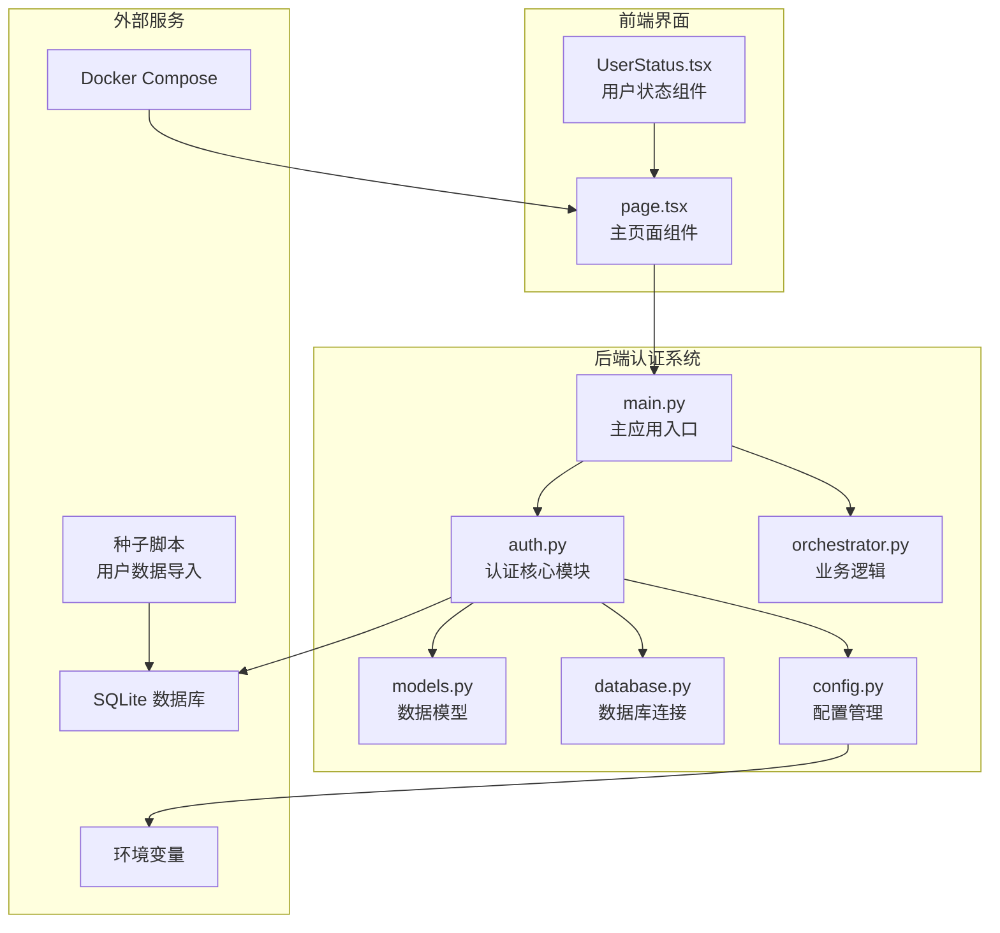
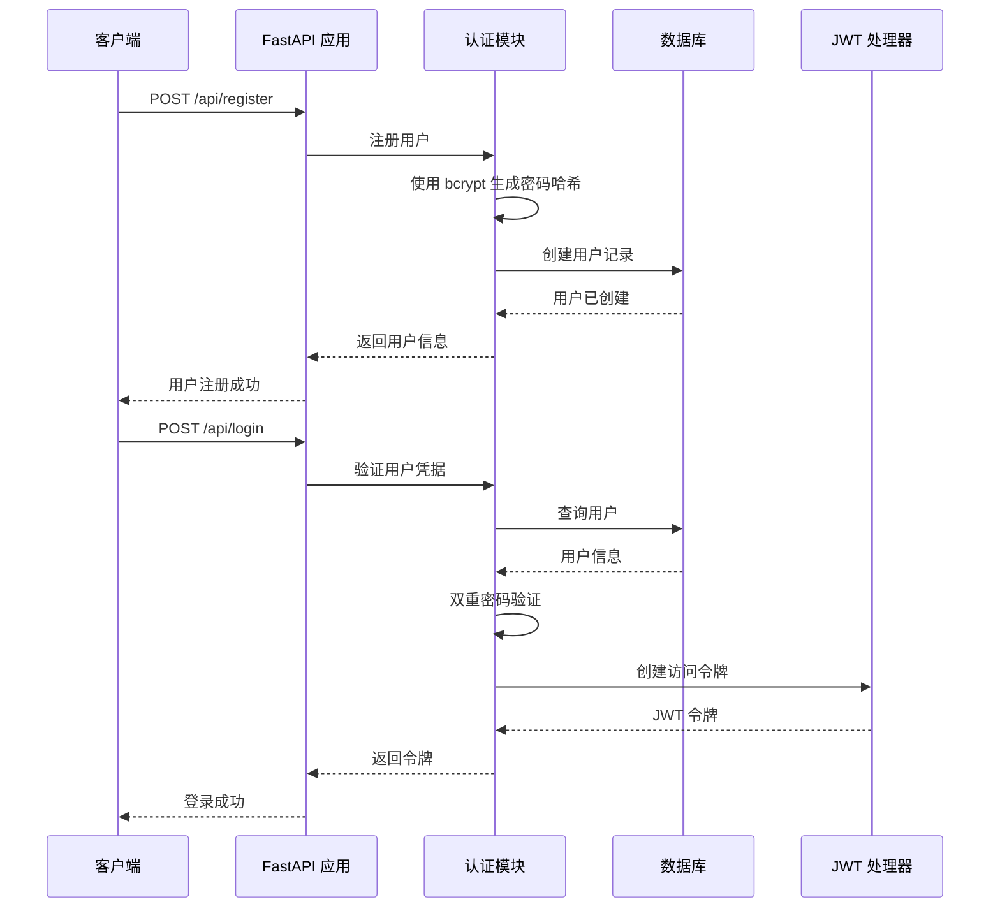
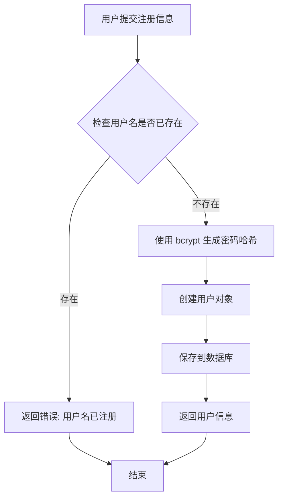
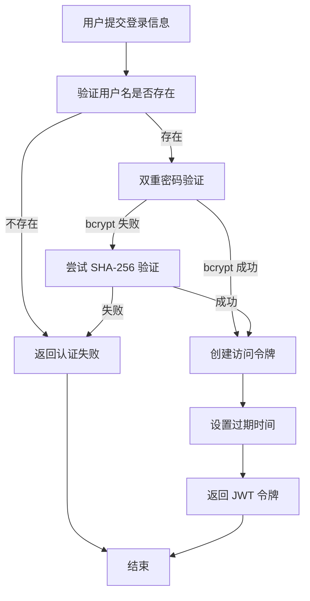
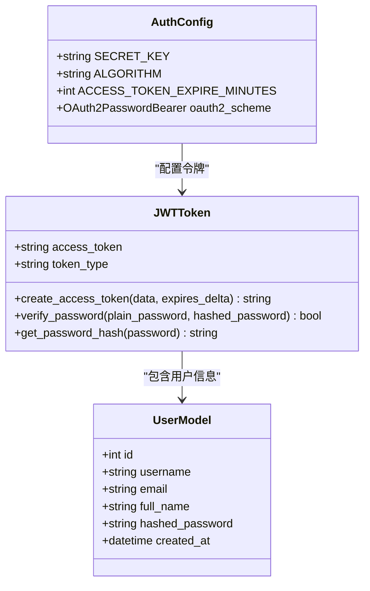
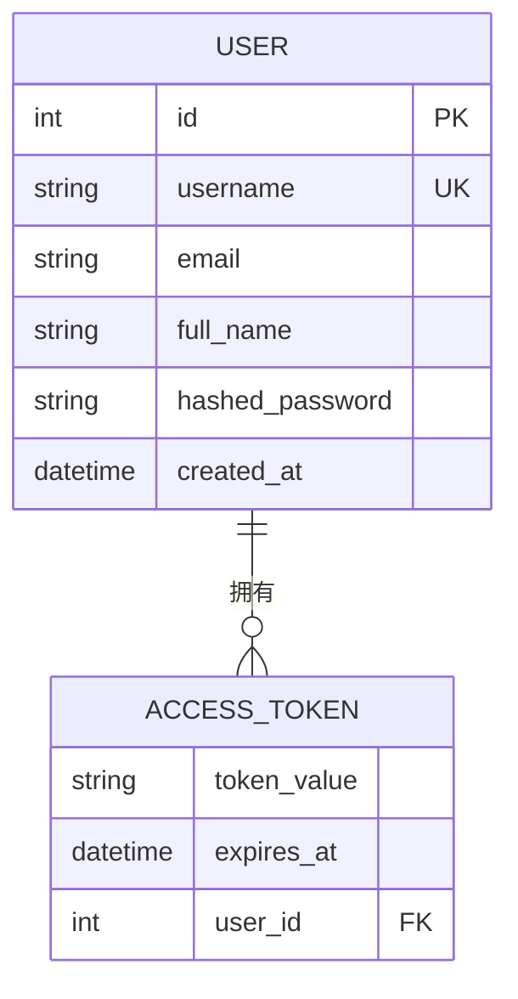
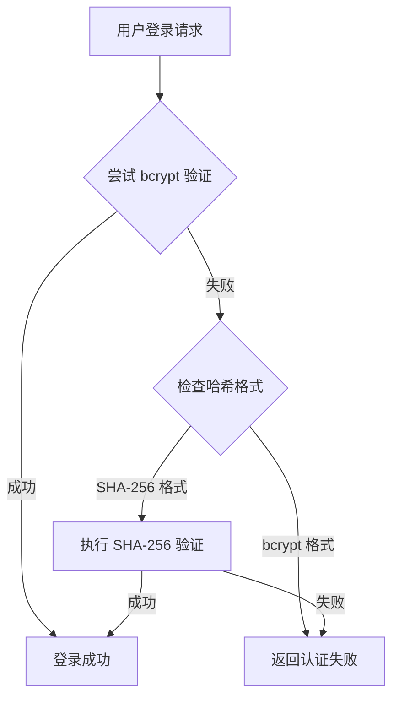
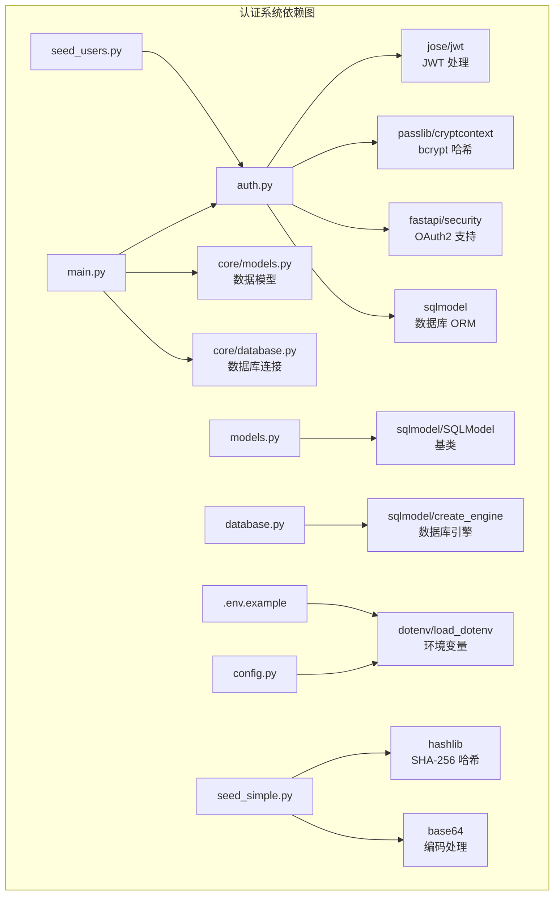

# 认证系统

<cite>
**本文档引用的文件**
- [auth.py](file://localmanus-backend/core/auth.py)
- [main.py](file://localmanus-backend/main.py)
- [models.py](file://localmanus-backend/core/models.py)
- [database.py](file://localmanus-backend/core/database.py)
- [config.py](file://localmanus-backend/core/config.py)
- [.env.example](file://localmanus-backend/.env.example)
- [page.tsx](file://localmanus-ui/app/page.tsx)
- [UserStatus.tsx](file://localmanus-ui/app/components/UserStatus.tsx)
- [docker-compose.yml](file://docker-compose.yml)
- [seed_users.py](file://localmanus-backend/scripts/seed_users.py)
- [seed_simple.py](file://localmanus-backend/scripts/seed_simple.py)
</cite>

## 更新摘要
**变更内容**
- 新增双密码哈希机制（bcrypt + SHA-256 fallback）
- 增强向后兼容性，支持遗留用户验证
- 更新密码验证流程，自动检测并适配不同哈希格式
- 新增SHA-256哈希支持用于演示和迁移场景

## 目录
1. [简介](#简介)
2. [项目结构](#项目结构)
3. [核心组件](#核心组件)
4. [架构概览](#架构概览)
5. [详细组件分析](#详细组件分析)
6. [双密码哈希机制](#双密码哈希机制)
7. [依赖关系分析](#依赖关系分析)
8. [性能考虑](#性能考虑)
9. [故障排除指南](#故障排除指南)
10. [结论](#结论)

## 简介

LocalManus 是一个基于 FastAPI 的 AI Agent 平台，提供了完整的认证系统实现。该认证系统采用现代的 OAuth2 密码流协议，结合 JWT（JSON Web Token）进行用户身份验证和授权管理。

**更新后的核心特性包括：**
- 基于 bcrypt 的密码哈希加密（新用户注册）
- 双重密码验证机制（bcrypt + SHA-256 fallback）
- JWT 令牌管理（1周有效期）
- OAuth2 密码流认证协议
- 支持查询参数的 SSE（Server-Sent Events）认证
- SQLite 数据库存储用户信息
- 向后兼容性支持遗留用户系统

## 项目结构

LocalManus 项目采用前后端分离的架构设计，认证系统主要集中在后端的 `localmanus-backend` 目录中：



**图表来源**
- [main.py](file://localmanus-backend/main.py#L1-L153)
- [auth.py](file://localmanus-backend/core/auth.py#L1-L82)
- [models.py](file://localmanus-backend/core/models.py#L1-L28)
- [seed_users.py](file://localmanus-backend/scripts/seed_users.py#L1-L53)
- [seed_simple.py](file://localmanus-backend/scripts/seed_simple.py#L1-L67)

**章节来源**
- [main.py](file://localmanus-backend/main.py#L1-L153)
- [auth.py](file://localmanus-backend/core/auth.py#L1-L82)
- [models.py](file://localmanus-backend/core/models.py#L1-L28)

## 核心组件

### 认证模块 (auth.py)

认证模块是整个系统的安全核心，负责处理用户注册、登录、密码验证和令牌管理。

**主要功能：**
- 密码哈希和验证（bcrypt + SHA-256 fallback）
- JWT 令牌生成和解析
- 用户认证流程
- 当前用户获取

**关键常量配置：**
- `SECRET_KEY`: JWT 加密密钥（从环境变量读取）
- `ALGORITHM`: HS256 签名算法
- `ACCESS_TOKEN_EXPIRE_MINUTES`: 令牌过期时间（1周）

**更新** 新增双密码哈希验证机制，支持新旧两种密码格式

**章节来源**
- [auth.py](file://localmanus-backend/core/auth.py#L1-L82)

### 主应用入口 (main.py)

主应用入口文件定义了所有 API 端点，并集成了认证系统。

**核心端点：**
- `/api/register`: 用户注册（使用 bcrypt 哈希）
- `/api/login`: 用户登录（支持双哈希验证）
- `/api/me`: 获取当前用户信息
- `/api/chat`: SSE 聊天接口

**章节来源**
- [main.py](file://localmanus-backend/main.py#L1-L153)

### 数据模型 (models.py)

定义了用户相关的数据结构和类型。

**核心模型：**
- `User`: 数据库用户表模型（包含哈希密码字段）
- `UserCreate`: 用户注册输入模型
- `UserRead`: 用户信息输出模型
- `Token`: 认证令牌模型

**章节来源**
- [models.py](file://localmanus-backend/core/models.py#L1-L28)

## 架构概览

认证系统采用分层架构设计，确保了良好的关注点分离和可维护性：



**图表来源**
- [main.py](file://localmanus-backend/main.py#L39-L71)
- [auth.py](file://localmanus-backend/core/auth.py#L47-L53)

**章节来源**
- [main.py](file://localmanus-backend/main.py#L39-L71)
- [auth.py](file://localmanus-backend/core/auth.py#L47-L53)

## 详细组件分析

### 认证流程分析

#### 用户注册流程



**图表来源**
- [main.py](file://localmanus-backend/main.py#L39-L55)
- [auth.py](file://localmanus-backend/core/auth.py#L34-L35)

#### 用户登录流程



**图表来源**
- [main.py](file://localmanus-backend/main.py#L57-L71)
- [auth.py](file://localmanus-backend/core/auth.py#L20-L32)

### JWT 令牌管理

JWT 令牌系统提供了无状态的身份验证机制：



**图表来源**
- [auth.py](file://localmanus-backend/core/auth.py#L13-L18)
- [models.py](file://localmanus-backend/core/models.py#L10-L13)

**章节来源**
- [auth.py](file://localmanus-backend/core/auth.py#L13-L34)

### 数据库集成

认证系统使用 SQLite 作为数据存储，通过 SQLModel ORM 进行数据操作：



**图表来源**
- [models.py](file://localmanus-backend/core/models.py#L10-L13)
- [database.py](file://localmanus-backend/core/database.py#L11-L16)

**章节来源**
- [database.py](file://localmanus-backend/core/database.py#L1-L17)

## 双密码哈希机制

### 设计原理

系统实现了智能的双密码哈希验证机制，确保新旧用户都能正常登录：



**图表来源**
- [auth.py](file://localmanus-backend/core/auth.py#L20-L32)

### 实现细节

**bcrypt 验证（新用户）：**
- 使用 passlib 的 CryptContext 进行验证
- 自动处理盐值和哈希比较
- 更高的安全性，推荐用于新用户

**SHA-256 回退验证（遗留用户）：**
- 兼容演示和迁移场景
- 使用固定盐值进行哈希计算
- 简单快速的验证过程

**章节来源**
- [auth.py](file://localmanus-backend/core/auth.py#L20-L32)
- [seed_simple.py](file://localmanus-backend/scripts/seed_simple.py#L14-L19)

### 种子脚本支持

系统提供了两个种子脚本来演示不同的哈希机制：

**seed_users.py（bcrypt 方式）：**
- 使用 get_password_hash() 生成 bcrypt 哈希
- 推荐用于生产环境的新用户

**seed_simple.py（SHA-256 方式）：**
- 直接使用 SHA-256 + base64 编码
- 用于演示和测试目的

**章节来源**
- [seed_users.py](file://localmanus-backend/scripts/seed_users.py#L39-L44)
- [seed_simple.py](file://localmanus-backend/scripts/seed_simple.py#L49-L56)

## 依赖关系分析

认证系统的依赖关系清晰明确，遵循了单一职责原则：



**图表来源**
- [auth.py](file://localmanus-backend/core/auth.py#L1-L10)
- [main.py](file://localmanus-backend/main.py#L1-L9)
- [seed_simple.py](file://localmanus-backend/scripts/seed_simple.py#L10-L19)

**章节来源**
- [auth.py](file://localmanus-backend/core/auth.py#L1-L10)
- [main.py](file://localmanus-backend/main.py#L1-L9)

## 性能考虑

### 认证性能优化

1. **密码哈希优化**
   - 使用 bcrypt 算法提供安全的密码存储
   - 合理的哈希成本参数平衡安全性与性能
   - 双重验证机制避免重复计算

2. **令牌缓存策略**
   - JWT 令牌在内存中验证，避免频繁的数据库查询
   - 令牌过期时间设置为 1 周，减少重新认证频率

3. **数据库连接管理**
   - 使用 SQLModel 的连接池机制
   - 单次请求内复用数据库会话

4. **向后兼容性优化**
   - 智能哈希格式检测，避免不必要的验证尝试
   - SHA-256 验证仅在 bcrypt 失败时触发

### 安全性考虑

1. **密码安全**
   - 永远不存储明文密码
   - 使用强哈希算法和随机盐值
   - 双重验证机制确保安全性

2. **令牌安全**
   - 使用强随机密钥
   - 设置合理的过期时间
   - 支持令牌撤销机制

3. **输入验证**
   - 严格的用户名和密码格式验证
   - SQL 注入防护

## 故障排除指南

### 常见问题及解决方案

#### 1. 认证失败问题

**症状：** 用户登录时返回 401 未授权错误

**可能原因：**
- 用户名或密码错误
- 令牌过期
- 环境变量配置错误
- 哈希格式不匹配

**解决步骤：**
1. 检查 `.env` 文件中的 `SECRET_KEY` 配置
2. 验证用户凭据的正确性
3. 确认 JWT 算法配置 (`ALGORITHM`)
4. 检查用户密码哈希格式（bcrypt vs SHA-256）

#### 2. 数据库连接问题

**症状：** 应用启动时报数据库连接错误

**可能原因：**
- SQLite 文件权限问题
- 数据库文件损坏

**解决步骤：**
1. 检查 `localmanus.db` 文件的读写权限
2. 确认 SQLite 引擎配置正确
3. 重启应用以重新建立连接

#### 3. CORS 跨域问题

**症状：** 前端无法访问后端 API

**解决步骤：**
1. 检查 `main.py` 中的 CORS 配置
2. 确认允许的源、方法和头信息
3. 验证前端和后端的端口配置

#### 4. 向后兼容性问题

**症状：** 遗留用户无法登录

**解决步骤：**
1. 验证遗留用户的密码哈希格式
2. 确认 SHA-256 验证逻辑正常工作
3. 检查盐值配置是否正确

**章节来源**
- [auth.py](file://localmanus-backend/core/auth.py#L51-L53)
- [main.py](file://localmanus-backend/main.py#L26-L33)

### 调试技巧

1. **启用详细日志**
   ```python
   logging.basicConfig(level=logging.DEBUG)
   ```

2. **检查环境变量**
   ```bash
   cat .env
   ```

3. **验证 API 端点**
   ```bash
   curl -X POST http://localhost:8000/api/register \
        -H "Content-Type: application/json" \
        -d '{"username":"test","email":"test@example.com","full_name":"Test User","password":"password"}'
   ```

4. **测试双哈希验证**
   ```bash
   # 测试 bcrypt 验证
   curl -X POST http://localhost:8000/api/login \
        -H "Content-Type: application/x-www-form-urlencoded" \
        -d "username=test&password=password"
   ```

## 结论

LocalManus 的认证系统实现了现代 Web 应用所需的安全性和可用性要求。通过采用标准的 OAuth2 密码流协议和 JWT 令牌机制，以及新增的双密码哈希验证功能，系统提供了：

**主要优势：**
- **安全性高**: 使用 bcrypt 哈希和 JWT 令牌
- **向后兼容**: 支持遗留用户系统
- **易于集成**: 标准化的 OAuth2 协议支持
- **性能良好**: 内存中令牌验证，减少数据库负载
- **可扩展性强**: 清晰的模块化设计
- **智能验证**: 自动适配不同密码格式

**双密码哈希机制的优势：**
- 无缝支持新旧用户系统
- 降低迁移成本
- 提供渐进式升级路径
- 确保系统稳定性

**未来改进建议：**
1. 添加密码强度验证规则
2. 实现账户锁定机制防止暴力破解
3. 增加多因素认证支持
4. 实现令牌刷新机制
5. 添加审计日志功能
6. 考虑引入密码迁移机制，将 SHA-256 用户迁移到 bcrypt

该认证系统为 LocalManus 平台提供了坚实的安全基础，支持后续的功能扩展和企业级部署需求。双密码哈希机制的引入特别适合需要从旧系统迁移的场景，确保了平滑的用户体验和系统的长期可维护性。