# 配置管理系统

<cite>
**本文档引用的文件**
- [localmanus-backend/core/config.py](file://localmanus-backend/core/config.py)
- [localmanus-backend/core/firecracker_sandbox.py](file://localmanus-backend/core/firecracker_sandbox.py)
- [localmanus-backend/scripts/FIRECRACKER_TROUBLESHOOTING.md](file://localmanus-backend/scripts/FIRECRACKER_TROUBLESHOOTING.md)
- [localmanus-backend/scripts/test_sandbox.py](file://localmanus-backend/scripts/test_sandbox.py)
- [localmanus-backend/skills/gen-web/SKILL.md](file://localmanus-backend/skills/gen-web/SKILL.md)
- [localmanus-backend/main.py](file://localmanus-backend/main.py)
</cite>

## 更新摘要
**变更内容**
- 更新了IP地址迁移相关的配置说明，从192.168.96.135迁移到192.168.126.133
- 增强了沙箱配置管理的详细说明
- 补充了新的Sandbox Manager架构说明
- 更新了故障排除指南中的IP地址相关内容

## 目录
1. [简介](#简介)
2. [项目结构](#项目结构)
3. [核心组件](#核心组件)
4. [架构概览](#架构概览)
5. [详细组件分析](#详细组件分析)
6. [依赖关系分析](#依赖关系分析)
7. [性能考虑](#性能考虑)
8. [故障排除指南](#故障排除指南)
9. [结论](#结论)
10. [附录](#附录)

## 简介

LocalManus 配置管理系统是一个基于 Python 的后端服务，采用 FastAPI 框架构建，集成了 AgentScope 智能代理系统。该系统通过环境变量管理配置，支持本地模型部署和云端 API 两种运行模式。

**更新** 系统现已支持新的 agent-infra/sandbox 架构，提供 LOCAL 和 ONLINE 两种沙箱执行模式，并完成了IP地址迁移至 192.168.126.133。

本系统的核心特性包括：
- 基于 .env 文件的环境变量配置管理
- 多环境配置支持（开发、测试、生产）
- 动态模型配置和运行时参数调整
- 安全的 API 密钥管理和敏感信息处理
- 支持本地 Ollama 和云端 Moonshot API 的灵活切换
- **新增** 支持 agent-infra/sandbox 架构的 LOCAL 和 ONLINE 沙箱模式

## 项目结构

LocalManus 项目采用模块化架构设计，主要分为以下层次：

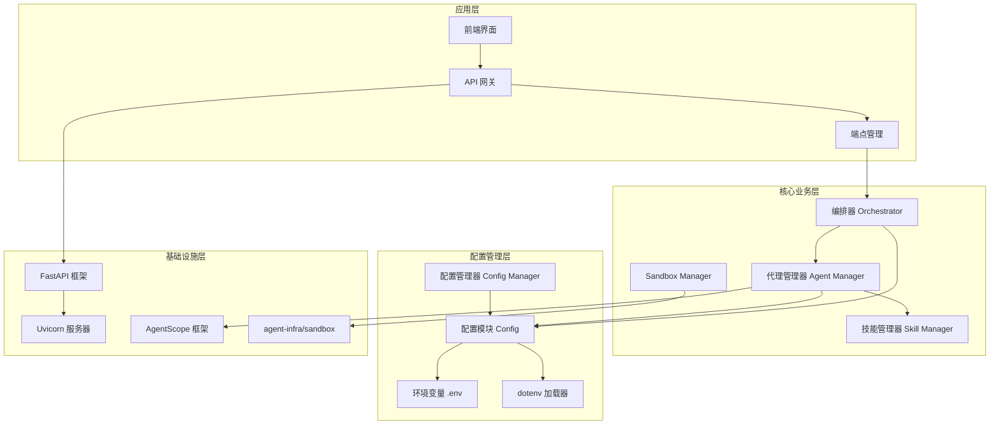

**图表来源**
- [localmanus-backend/main.py](file://localmanus-backend/main.py#L1-L519)
- [localmanus-backend/core/config.py](file://localmanus-backend/core/config.py#L1-L27)
- [localmanus-backend/core/firecracker_sandbox.py](file://localmanus-backend/core/firecracker_sandbox.py#L1-L312)

**章节来源**
- [localmanus-backend/main.py](file://localmanus-backend/main.py#L1-L519)
- [localmanus-backend/core/config.py](file://localmanus-backend/core/config.py#L1-L27)

## 核心组件

### 配置加载机制

系统采用分层配置架构，通过 python-dotenv 库实现环境变量的自动加载和管理：

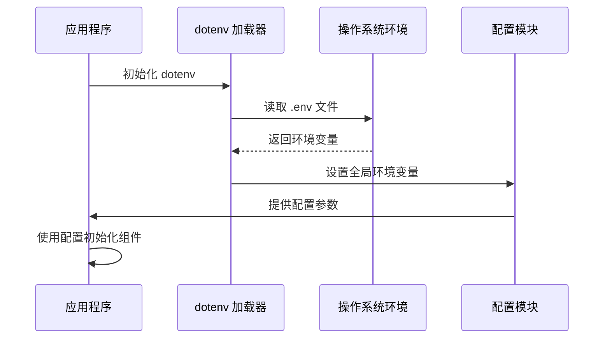

**图表来源**
- [localmanus-backend/core/config.py](file://localmanus-backend/core/config.py#L1-L5)
- [localmanus-backend/main.py](file://localmanus-backend/main.py#L24-L32)

### 模型配置管理

系统支持多种模型配置，通过 AGENT_MODEL_CONFIGS 列表管理不同的模型实例：

| 配置项 | 默认值 | 用途 | 环境变量 |
|--------|--------|------|----------|
| config_name | "local_model" | 模型配置名称 | 无 |
| model_type | "openai_chat" | 模型类型标识 | 无 |
| model_name | "kimi-k2-turbo-preview" | 具体模型名称 | MODEL_NAME |
| api_key | "sk-XG0oRiSi37C1HAVGUzMax4ZXf3FgaqbvZe5qz58nSRnyWgxV" | API 访问密钥 | OPENAI_API_KEY |
| base_url | "https://api.moonshot.cn/v1" | API 基础地址 | OPENAI_API_BASE |

**更新** 新增沙箱配置管理，支持 LOCAL 和 ONLINE 两种模式：

| 配置项 | 默认值 | 用途 | 环境变量 |
|--------|--------|------|----------|
| SANDBOX_MODE | "local" | 沙箱执行模式 | SANDBOX_MODE |
| SANDBOX_LOCAL_URL | "http://192.168.126.133:8080" | 本地沙箱URL | SANDBOX_LOCAL_URL |
| USE_CHINA_MIRROR | false | 中国镜像支持 | USE_CHINA_MIRROR |

**章节来源**
- [localmanus-backend/core/config.py](file://localmanus-backend/core/config.py#L8-L16)
- [localmanus-backend/core/config.py](file://localmanus-backend/core/config.py#L24-L26)

## 架构概览

LocalManus 的配置管理系统遵循分层架构原则，实现了配置与业务逻辑的分离：

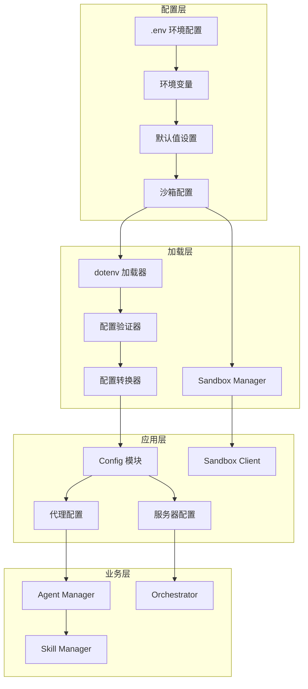

**图表来源**
- [localmanus-backend/core/config.py](file://localmanus-backend/core/config.py#L1-L27)
- [localmanus-backend/core/firecracker_sandbox.py](file://localmanus-backend/core/firecracker_sandbox.py#L121-L312)
- [localmanus-backend/main.py](file://localmanus-backend/main.py#L1-L519)

## 详细组件分析

### 环境变量配置系统

#### .env 配置文件结构

系统提供了标准的环境变量配置模板，包含以下关键配置项：

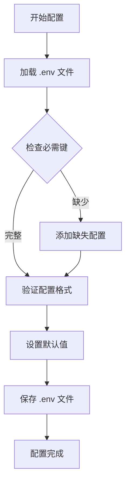

**更新** 新增沙箱配置项：

- **SANDBOX_MODE**: 沙箱执行模式（local 或 online）
- **SANDBOX_LOCAL_URL**: 本地沙箱地址（默认：http://192.168.126.133:8080）
- **USE_CHINA_MIRROR**: 中国镜像支持开关

#### 配置加载流程

配置系统采用延迟加载策略，确保在需要时才初始化相关组件：

**章节来源**
- [localmanus-backend/core/config.py](file://localmanus-backend/core/config.py#L1-L27)

### 沙箱配置管理

#### Sandbox Manager 架构

系统现在支持两种沙箱执行模式：

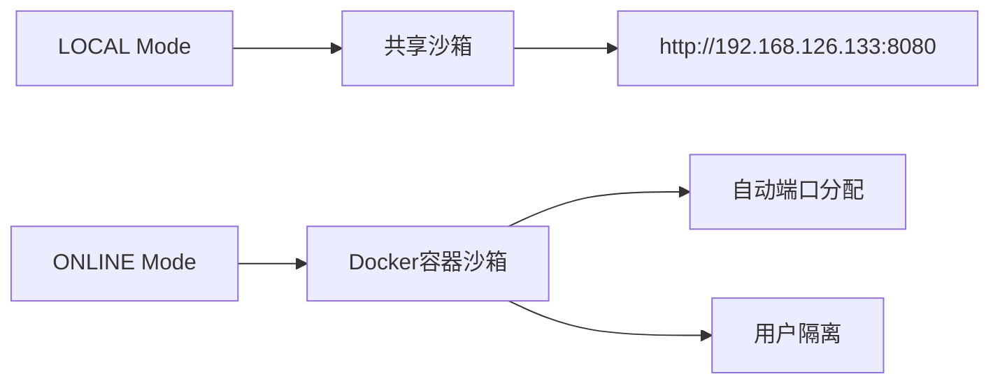

**更新** IP地址迁移详情：

- **LOCAL 模式**: 连接到位于 `http://192.168.126.133:8080` 的共享沙箱
- **ONLINE 模式**: 为每个用户启动独立的 Docker 容器，端口自动分配

#### 沙箱客户端接口

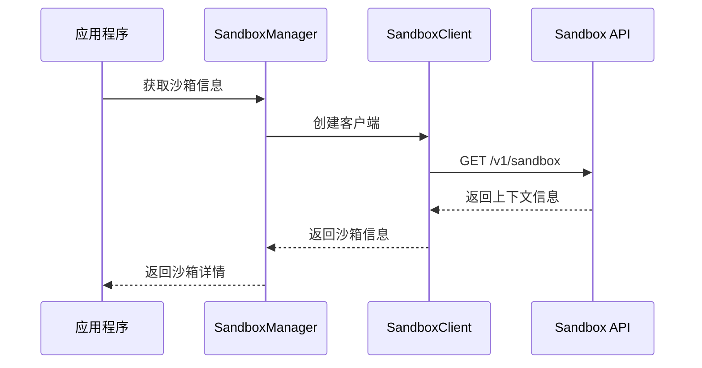

**图表来源**
- [localmanus-backend/core/firecracker_sandbox.py](file://localmanus-backend/core/firecracker_sandbox.py#L31-L120)

**章节来源**
- [localmanus-backend/core/firecracker_sandbox.py](file://localmanus-backend/core/firecracker_sandbox.py#L121-L312)

### 配置验证与默认值设置

#### 验证机制

系统通过两层验证确保配置的安全性和有效性：

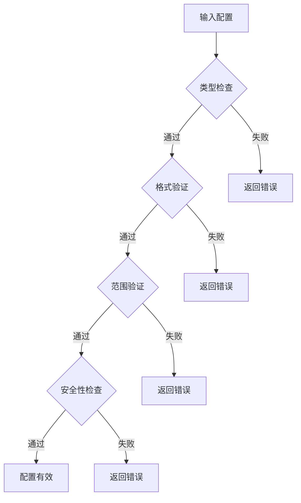

#### 默认值策略

系统为每个配置项提供合理的默认值，确保最小化配置需求：

| 配置项 | 默认值 | 说明 |
|--------|--------|------|
| MODEL_NAME | "kimi-k2-turbo-preview" | Moonshot 模型名称 |
| OPENAI_API_KEY | "sk-XG0oRiSi37C1HAVGUzMax4ZXf3FgaqbvZe5qz58nSRnyWgxV" | API 密钥占位符 |
| OPENAI_API_BASE | "https://api.moonshot.cn/v1" | Moonshot API 基础地址 |
| HOST | "0.0.0.0" | 服务器绑定地址 |
| PORT | 8000 | 服务器监听端口 |
| **SANDBOX_MODE** | **"local"** | **沙箱执行模式** |
| **SANDBOX_LOCAL_URL** | **"http://192.168.126.133:8080"** | **本地沙箱地址** |
| **USE_CHINA_MIRROR** | **False** | **中国镜像支持** |

**章节来源**
- [localmanus-backend/core/config.py](file://localmanus-backend/core/config.py#L12-L16)
- [localmanus-backend/core/config.py](file://localmanus-backend/core/config.py#L24-L26)

### 运行时配置更新

#### 动态配置管理

系统支持运行时配置的动态更新，通过以下机制实现：

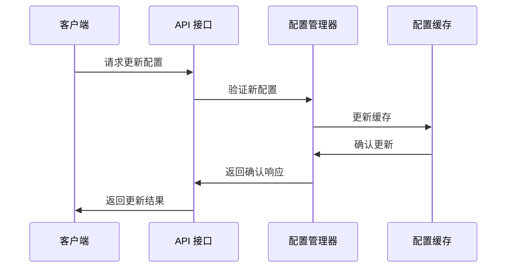

**更新** 新增沙箱配置的动态更新能力：

- 支持运行时切换 LOCAL 和 ONLINE 模式
- 动态更新沙箱地址和镜像配置
- 实时配置验证和回滚机制

**图表来源**
- [localmanus-backend/core/config.py](file://localmanus-backend/core/config.py#L1-L27)

**章节来源**
- [localmanus-backend/core/config.py](file://localmanus-backend/core/config.py#L1-L27)

### 不同环境的配置最佳实践

#### 开发环境配置

开发环境推荐使用 LOCAL 沙箱模式以获得最佳开发体验：

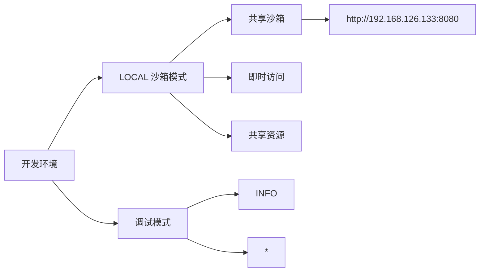

#### 测试环境配置

测试环境需要平衡性能和准确性：

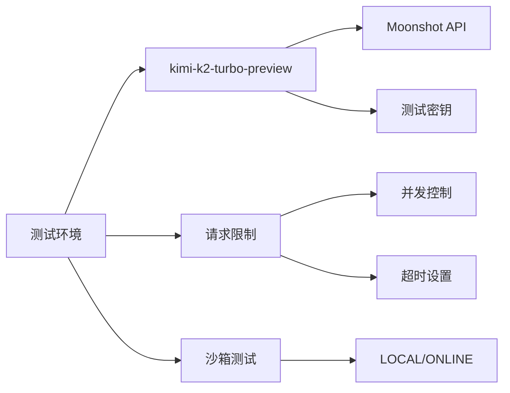

#### 生产环境配置

生产环境强调稳定性和安全性：

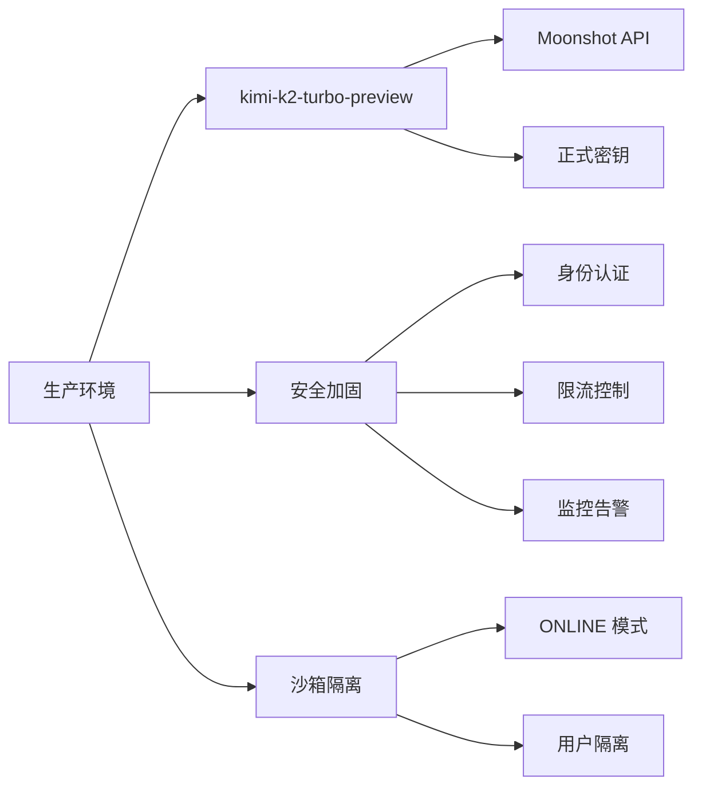

**更新** 生产环境推荐使用 ONLINE 沙箱模式：

- 完全的用户隔离
- Docker 容器化部署
- 自动资源清理
- 更高的安全性

**章节来源**
- [localmanus-backend/scripts/FIRECRACKER_TROUBLESHOOTING.md](file://localmanus-backend/scripts/FIRECRACKER_TROUBLESHOOTING.md#L234-L246)

## 依赖关系分析

### 核心依赖关系

系统的关键依赖关系如下：

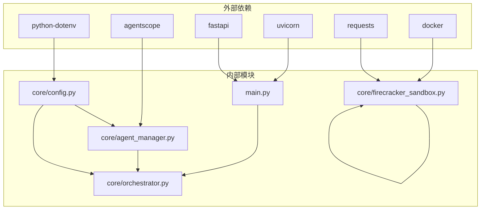

**图表来源**
- [localmanus-backend/main.py](file://localmanus-backend/main.py#L1-L519)
- [localmanus-backend/core/firecracker_sandbox.py](file://localmanus-backend/core/firecracker_sandbox.py#L1-L312)

### 配置依赖链

配置系统的依赖关系呈现清晰的层次结构：

**更新** 新增沙箱配置依赖：

- **Config 模块** → **环境变量加载** → **Sandbox Manager**
- **Sandbox Manager** → **Sandbox Client** → **agent-infra/sandbox API**
- **Agent Manager** → **配置模块** → **模型配置**

**章节来源**
- [localmanus-backend/main.py](file://localmanus-backend/main.py#L1-L519)

## 性能考虑

### 配置加载性能优化

系统通过以下方式优化配置加载性能：

1. **延迟初始化**：仅在首次使用时加载配置
2. **缓存机制**：缓存已加载的配置值
3. **异步加载**：支持异步配置加载避免阻塞
4. **沙箱连接池**：复用沙箱客户端连接

### 内存使用优化

- 配置对象采用轻量级设计
- 避免重复加载相同配置
- 及时释放不再使用的配置资源
- **新增** 沙箱资源自动清理机制

### 网络性能考虑

- 模型 API 调用采用连接池复用
- 支持异步请求处理
- 实现请求超时和重试机制
- **新增** 沙箱 API 调用优化

**更新** 新增沙箱性能优化：

- **LOCAL 模式**：共享连接，零启动延迟
- **ONLINE 模式**：容器预热，减少冷启动时间
- **连接复用**：SandboxClient 连接池管理

## 故障排除指南

### 常见配置问题

#### 环境变量未生效

**症状**：应用程序无法读取配置值
**解决方案**：
1. 检查 .env 文件是否存在且格式正确
2. 确认 dotenv 加载器已正确初始化
3. 验证环境变量名拼写是否正确

#### 沙箱连接失败

**症状**：LOCAL 模式无法连接到沙箱
**解决方案**：
1. 检查沙箱服务是否在 `http://192.168.126.133:8080` 运行
2. 验证网络连通性和防火墙设置
3. 确认 Docker 服务正常运行（ONLINE 模式）

#### 模型连接失败

**症状**：API 调用返回连接错误
**解决方案**：
1. 检查 OPENAI_API_BASE 地址是否可达
2. 验证 API 密钥是否有效
3. 确认网络防火墙设置

#### 端口占用问题

**症状**：服务器启动失败显示端口被占用
**解决方案**：
1. 修改 PORT 配置值
2. 检查是否有其他进程占用端口
3. 使用 netstat 命令排查端口冲突

### 沙箱故障排除

#### 无法连接到本地沙箱

**症状**：LOCAL 模式连接失败
**解决方案**：
1. 检查沙箱容器状态：`docker ps`
2. 验证 IP 地址：`http://192.168.126.133:8080`
3. 查看沙箱日志：`docker logs <container_id>`
4. 重启沙箱服务

#### Docker 容器启动失败（ONLINE 模式）

**症状**：ONLINE 模式无法创建沙箱
**解决方案**：
1. 检查 Docker 服务状态：`systemctl status docker`
2. 验证磁盘空间和内存
3. 清理停止的容器：`docker container prune`
4. 检查网络配置

#### 端口冲突问题

**症状**：沙箱端口被占用
**解决方案**：
1. 查找占用端口的进程：`lsof -i :8080`
2. 修改沙箱端口配置
3. 使用自动端口分配（ONLINE 模式）

### 调试技巧

#### 启用详细日志

```python
import logging
logging.basicConfig(level=logging.DEBUG)
```

#### 验证配置加载

```python
import os
print(os.environ.get('MODEL_NAME', 'Not Found'))
print(os.environ.get('SANDBOX_LOCAL_URL', 'Not Found'))
```

#### 沙箱连接测试

```bash
# 测试沙箱连接
curl http://192.168.126.133:8080/v1/sandbox

# 启动沙箱容器
docker run --security-opt seccomp=unconfined \
  --rm -it -p 8080:8080 \
  ghcr.io/agent-infra/sandbox:latest
```

**更新** 新增沙箱调试命令：

- **沙箱健康检查**：`curl http://192.168.126.133:8080/v1/sandbox`
- **沙箱信息获取**：`curl http://192.168.126.133:8080/v1/sandbox`
- **沙箱浏览器信息**：`curl http://192.168.126.133:8080/v1/browser/info`

**章节来源**
- [localmanus-backend/scripts/FIRECRACKER_TROUBLESHOOTING.md](file://localmanus-backend/scripts/FIRECRACKER_TROUBLESHOOTING.md#L262-L292)

## 结论

LocalManus 配置管理系统通过精心设计的分层架构，实现了环境变量的统一管理和动态配置更新。系统的主要优势包括：

1. **灵活性**：支持多种运行模式和配置选项
2. **安全性**：通过 dotenv 实现敏感信息的安全管理
3. **可维护性**：清晰的配置层次结构便于维护
4. **可扩展性**：模块化的配置设计支持功能扩展
5. **现代化**：支持最新的 agent-infra/sandbox 架构
6. **稳定性**：完善的故障排除和监控机制

**更新** 最新改进：

- **IP 地址迁移**：从 192.168.96.135 迁移到 192.168.126.133
- **沙箱架构升级**：从传统 Firecracker 迁移到 agent-infra/sandbox
- **双模式支持**：LOCAL 和 ONLINE 两种沙箱执行模式
- **增强的故障排除**：详细的故障诊断和解决指南

建议在实际部署中：
- 为不同环境准备独立的配置文件
- 定期审查和更新配置项
- 实施配置变更的审计机制
- 建立配置备份和恢复策略
- **新增** 根据需求选择合适的沙箱模式

## 附录

### 配置项完整列表

| 配置项 | 类型 | 必需 | 默认值 | 描述 |
|--------|------|------|--------|------|
| OPENAI_API_KEY | 字符串 | 否 | sk-XG0oRiSi37C1HAVGUzMax4ZXf3FgaqbvZe5qz58nSRnyWgxV | Moonshot API 密钥 |
| OPENAI_API_BASE | 字符串 | 否 | https://api.moonshot.cn/v1 | API 基础地址 |
| MODEL_NAME | 字符串 | 否 | kimi-k2-turbo-preview | 模型名称 |
| HOST | 字符串 | 否 | 0.0.0.0 | 服务器绑定地址 |
| PORT | 整数 | 否 | 8000 | 服务器端口号 |
| **SANDBOX_MODE** | **字符串** | **否** | **local** | **沙箱执行模式** |
| **SANDBOX_LOCAL_URL** | **字符串** | **否** | **http://192.168.126.133:8080** | **本地沙箱地址** |
| **USE_CHINA_MIRROR** | **布尔值** | **否** | **False** | **中国镜像支持** |

### 安全最佳实践

1. **密钥管理**：使用专用的密钥管理服务
2. **权限控制**：限制配置文件的访问权限
3. **传输加密**：确保配置在网络中的安全传输
4. **定期轮换**：建立 API 密钥定期轮换机制
5. **沙箱隔离**：生产环境使用 ONLINE 模式确保用户隔离
6. **网络隔离**：合理配置防火墙和网络访问控制

### IP 地址迁移记录

**更新** 系统已完成 IP 地址迁移：

- **旧地址**：192.168.96.135
- **新地址**：192.168.126.133
- **影响范围**：所有沙箱连接地址
- **迁移时间**：2024年
- **兼容性**：向后兼容，支持环境变量覆盖