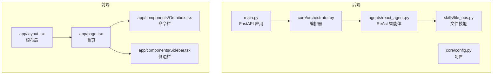
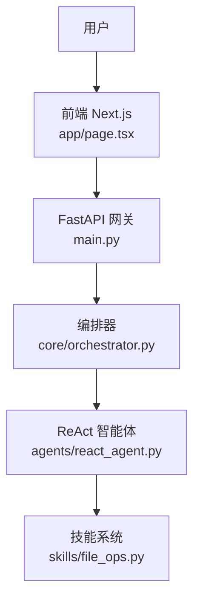
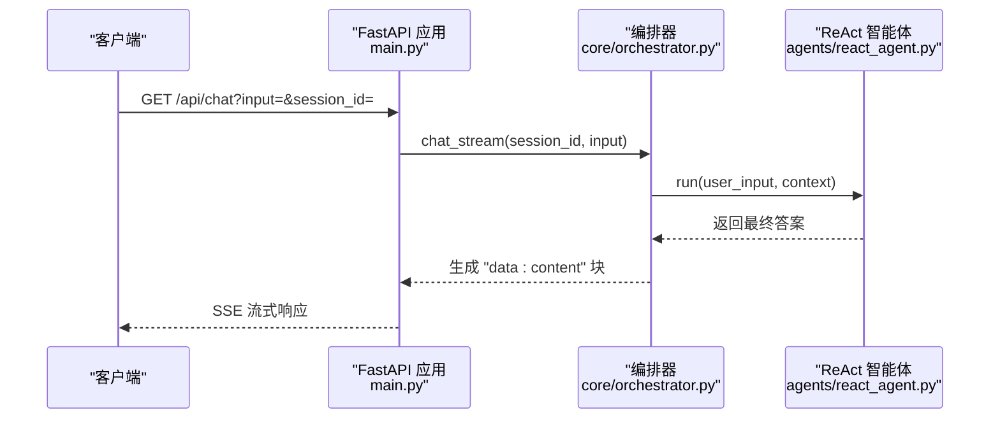
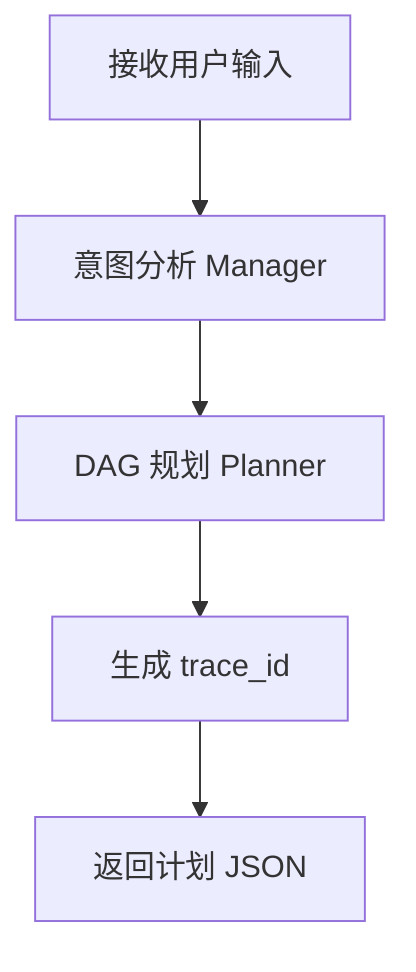
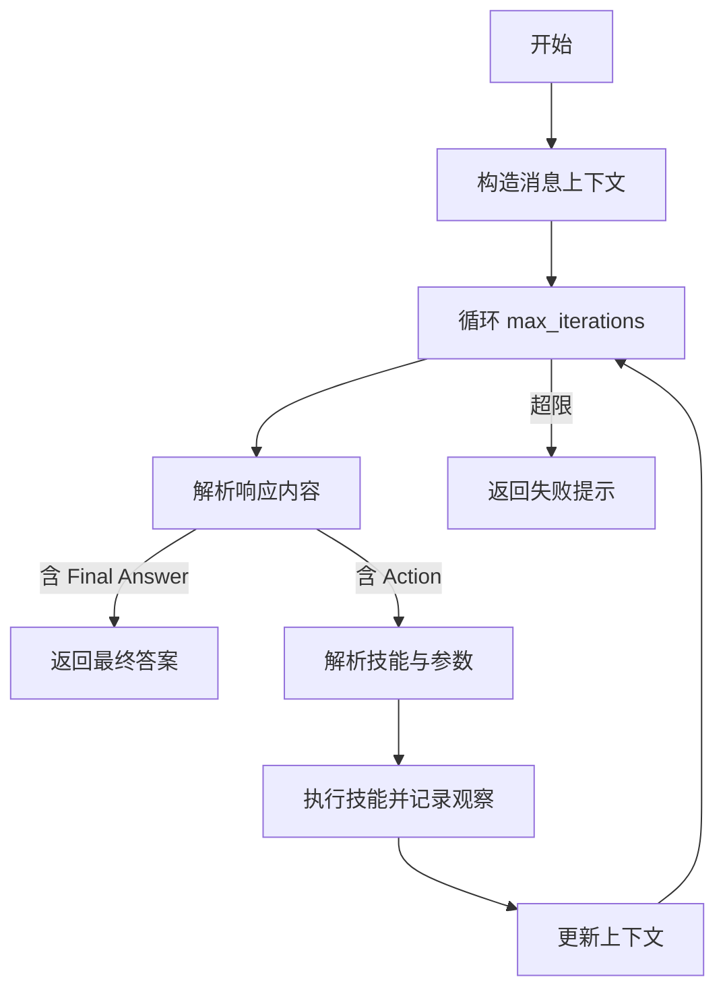
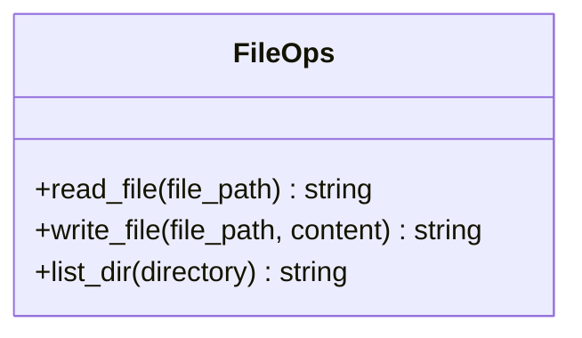
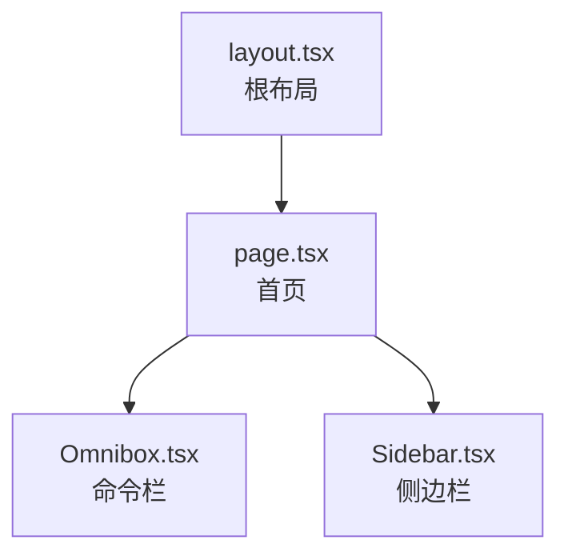
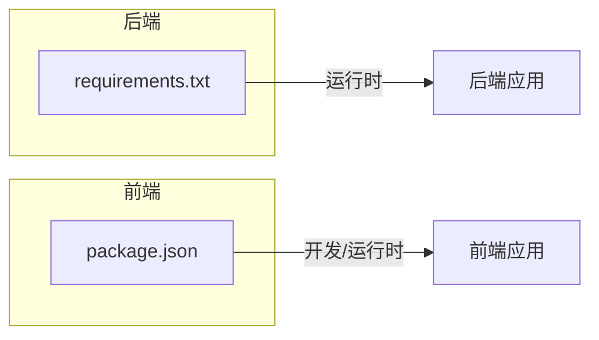

# 代码规范与最佳实践

<cite>
**本文档引用的文件**
- [main.py](file://localmanus-backend/main.py)
- [config.py](file://localmanus-backend/core/config.py)
- [react_agent.py](file://localmanus-backend/agents/react_agent.py)
- [orchestrator.py](file://localmanus-backend/core/orchestrator.py)
- [file_ops.py](file://localmanus-backend/skills/file_ops.py)
- [layout.tsx](file://localmanus-ui/app/layout.tsx)
- [page.tsx](file://localmanus-ui/app/page.tsx)
- [Omnibox.tsx](file://localmanus-ui/app/components/Omnibox.tsx)
- [Sidebar.tsx](file://localmanus-ui/app/components/Sidebar.tsx)
- [eslint.config.mjs](file://localmanus-ui/eslint.config.mjs)
- [tsconfig.json](file://localmanus-ui/tsconfig.json)
- [package.json](file://localmanus-ui/package.json)
- [requirements.txt](file://localmanus-backend/requirements.txt)
- [localmanus_architecture.md](file://localmanus_architecture.md)
- [localmanus_prd.md](file://localmanus_prd.md)
- [localmanus_skills_roadmap.md](file://localmanus_skills_roadmap.md)
- [.windsurfrules](file://.windsurfrules)
</cite>

## 目录
1. [引言](#引言)
2. [项目结构](#项目结构)
3. [核心组件](#核心组件)
4. [架构总览](#架构总览)
5. [详细组件分析](#详细组件分析)
6. [依赖关系分析](#依赖关系分析)
7. [性能考虑](#性能考虑)
8. [故障排查指南](#故障排查指南)
9. [结论](#结论)
10. [附录](#附录)

## 引言
本指南面向 LocalManus 项目，提供一套统一的代码规范与最佳实践，覆盖 Python 后端、TypeScript/Next.js 前端、Git 工作流与安全实践。目标是提升代码一致性、可维护性、可扩展性与安全性，支撑从原型到生产的演进。

## 项目结构
项目采用前后端分离架构：
- 后端（Python/FastAPI）：提供 API 网关、编排器、ReAct 智能体与技能系统
- 前端（Next.js/React/TypeScript）：提供聊天界面、组件化 UI、样式与类型约束
- 文档与路线图：架构设计、PRD、技能路线图与设计规则

**图表来源**
- [main.py](file://localmanus-backend/main.py#L1-L95)
- [config.py](file://localmanus-backend/core/config.py#L1-L21)
- [orchestrator.py](file://localmanus-backend/core/orchestrator.py#L1-L118)
- [react_agent.py](file://localmanus-backend/agents/react_agent.py#L1-L108)
- [file_ops.py](file://localmanus-backend/skills/file_ops.py#L1-L41)
- [layout.tsx](file://localmanus-ui/app/layout.tsx#L1-L20)
- [page.tsx](file://localmanus-ui/app/page.tsx#L1-L184)
- [Omnibox.tsx](file://localmanus-ui/app/components/Omnibox.tsx#L1-L63)
- [Sidebar.tsx](file://localmanus-ui/app/components/Sidebar.tsx#L1-L93)

**章节来源**
- [main.py](file://localmanus-backend/main.py#L1-L95)
- [layout.tsx](file://localmanus-ui/app/layout.tsx#L1-L20)

## 核心组件
- FastAPI 应用与中间件：提供 CORS 支持、SSE/WS 接口与路由
- 编排器：管理会话、JSON 提取、工作流执行与工具注册
- ReAct 智能体：基于工具的推理-行动循环，支持上下文与迭代
- 技能系统：文件操作等基础技能，未来扩展为沙箱执行
- 前端页面与组件：聊天流式渲染、模板展示、侧边导航

**章节来源**
- [main.py](file://localmanus-backend/main.py#L1-L95)
- [orchestrator.py](file://localmanus-backend/core/orchestrator.py#L1-L118)
- [react_agent.py](file://localmanus-backend/agents/react_agent.py#L1-L108)
- [file_ops.py](file://localmanus-backend/skills/file_ops.py#L1-L41)
- [page.tsx](file://localmanus-ui/app/page.tsx#L1-L184)
- [Omnibox.tsx](file://localmanus-ui/app/components/Omnibox.tsx#L1-L63)
- [Sidebar.tsx](file://localmanus-ui/app/components/Sidebar.tsx#L1-L93)

## 架构总览
系统采用“动态多智能体 + 沙箱执行”的架构，后端通过 AgentScope 编排，前端通过 SSE/WS 实时交互。

**图表来源**
- [main.py](file://localmanus-backend/main.py#L1-L95)
- [orchestrator.py](file://localmanus-backend/core/orchestrator.py#L1-L118)
- [react_agent.py](file://localmanus-backend/agents/react_agent.py#L1-L108)
- [file_ops.py](file://localmanus-backend/skills/file_ops.py#L1-L41)
- [page.tsx](file://localmanus-ui/app/page.tsx#L1-L184)

## 详细组件分析

### 后端：FastAPI 应用与中间件
- 路由与端点
  - 根路径健康检查
  - SSE 聊天流式响应
  - 同步任务规划与 ReAct 执行
  - WebSocket 任务流
- 中间件
  - CORS 允许任意来源、方法与头，便于前端联调
- 日志与异常
  - 使用标准日志模块记录连接与断开事件
  - WebSocketDisconnect 捕获断连

**图表来源**
- [main.py](file://localmanus-backend/main.py#L30-L38)
- [orchestrator.py](file://localmanus-backend/core/orchestrator.py#L13-L60)
- [react_agent.py](file://localmanus-backend/agents/react_agent.py#L53-L107)

**章节来源**
- [main.py](file://localmanus-backend/main.py#L1-L95)
- [orchestrator.py](file://localmanus-backend/core/orchestrator.py#L1-L118)

### 编排器：会话管理与工作流
- 会话字典按 session_id 维护 Msg 历史
- JSON 提取器支持 Markdown 包裹的 JSON
- 工作流三阶段：意图分析 → DAG 规划 → 注入 trace_id
- 技能注册表：声明可用技能及其元数据

**图表来源**
- [orchestrator.py](file://localmanus-backend/core/orchestrator.py#L65-L80)

**章节来源**
- [orchestrator.py](file://localmanus-backend/core/orchestrator.py#L1-L118)

### ReAct 智能体：推理-行动循环
- 系统提示包含工具元数据与格式化示例
- 上下文管理：合并历史消息，追加用户消息
- 迭代执行：解析 Thought/Action/Observation，调用技能执行
- 错误处理：捕获异常并注入观察消息

**图表来源**
- [react_agent.py](file://localmanus-backend/agents/react_agent.py#L53-L107)

**章节来源**
- [react_agent.py](file://localmanus-backend/agents/react_agent.py#L1-L108)

### 技能系统：文件操作
- 读取文件、写入文件、列出目录
- 异常捕获并返回错误信息字符串
- 与编排器的技能管理器协作

**图表来源**
- [file_ops.py](file://localmanus-backend/skills/file_ops.py#L1-L41)

**章节来源**
- [file_ops.py](file://localmanus-backend/skills/file_ops.py#L1-L41)

### 前端：页面与组件
- 根布局：定义站点元数据与根 HTML 结构
- 首页：聊天模式切换、消息列表、SSE 流式渲染
- 组件：命令栏（输入与提交）、侧边栏（导航与活动）

**图表来源**
- [layout.tsx](file://localmanus-ui/app/layout.tsx#L1-L20)
- [page.tsx](file://localmanus-ui/app/page.tsx#L1-L184)
- [Omnibox.tsx](file://localmanus-ui/app/components/Omnibox.tsx#L1-L63)
- [Sidebar.tsx](file://localmanus-ui/app/components/Sidebar.tsx#L1-L93)

**章节来源**
- [layout.tsx](file://localmanus-ui/app/layout.tsx#L1-L20)
- [page.tsx](file://localmanus-ui/app/page.tsx#L1-L184)
- [Omnibox.tsx](file://localmanus-ui/app/components/Omnibox.tsx#L1-L63)
- [Sidebar.tsx](file://localmanus-ui/app/components/Sidebar.tsx#L1-L93)

## 依赖关系分析
- 后端依赖：FastAPI、Uvicorn、AgentScope、Pydantic、WebSockets、python-multipart、dotenv
- 前端依赖：Next.js、React、Lucide React、ESLint、TypeScript

**图表来源**
- [requirements.txt](file://localmanus-backend/requirements.txt#L1-L8)
- [package.json](file://localmanus-ui/package.json#L1-L26)

**章节来源**
- [requirements.txt](file://localmanus-backend/requirements.txt#L1-L8)
- [package.json](file://localmanus-ui/package.json#L1-L26)

## 性能考虑
- SSE/WS 实时流：前端按行解析 data: 块，避免一次性缓冲大块数据
- 会话轮次限制：编排器限制历史长度，防止上下文膨胀
- 智能体迭代上限：ReAct 智能体设置最大迭代次数，避免无限循环
- 建议
  - 对大响应启用分块发送与背压控制
  - 对频繁调用的工具增加缓存与去重
  - 对 JSON 提取引入更健壮的解析器（如正则或 AST）
  - 前端消息渲染使用虚拟滚动与懒加载

[本节为通用指导，无需具体文件分析]

## 故障排查指南
- WebSocket 断连
  - 现象：日志记录断连事件
  - 排查：确认客户端网络、服务端未抛异常、客户端正确处理断连
- SSE 流异常
  - 现象：前端解析失败或报错
  - 排查：确认后端输出格式为 data: 行，末尾包含 [DONE]，前端逐行解析
- ReAct 执行错误
  - 现象：观察消息包含错误信息
  - 排查：检查工具名称与参数格式、技能是否存在、依赖是否满足
- 会话溢出
  - 现象：达到最大轮次限制
  - 排查：清理旧会话或调整限制阈值

**章节来源**
- [main.py](file://localmanus-backend/main.py#L89-L90)
- [page.tsx](file://localmanus-ui/app/page.tsx#L77-L80)
- [orchestrator.py](file://localmanus-backend/core/orchestrator.py#L23-L25)
- [react_agent.py](file://localmanus-backend/agents/react_agent.py#L98-L102)

## 结论
本规范以现有代码为基线，结合架构文档与 PRD，提出统一的风格、组织与工程实践。建议在后续迭代中逐步完善类型系统、错误处理与安全策略，并持续优化性能与可观测性。

[本节为总结，无需具体文件分析]

## 附录

### Python 代码风格规范（PEP8 及扩展）
- 命名约定
  - 模块与包：小写、下划线
  - 类：PascalCase
  - 函数与方法：snake_case
  - 常量：UPPER_CASE
  - 私有成员：_leading_underscore
- 导入顺序
  - 标准库
  - 第三方库
  - 项目内模块（相对导入）
- 注释与文档
  - 模块与类：使用三引号 docstring
  - 函数：参数、返回值、异常说明
  - 行内注释简洁明确
- 类型注解
  - 函数签名与属性添加类型注解
  - 使用 typing.AsyncGenerator、Dict、List 等
- 错误处理
  - 明确捕获异常范围，记录日志并返回可理解的错误信息
- 示例参考
  - [main.py](file://localmanus-backend/main.py#L1-L95)
  - [react_agent.py](file://localmanus-backend/agents/react_agent.py#L1-L108)
  - [orchestrator.py](file://localmanus-backend/core/orchestrator.py#L1-L118)
  - [file_ops.py](file://localmanus-backend/skills/file_ops.py#L1-L41)

**章节来源**
- [main.py](file://localmanus-backend/main.py#L1-L95)
- [react_agent.py](file://localmanus-backend/agents/react_agent.py#L1-L108)
- [orchestrator.py](file://localmanus-backend/core/orchestrator.py#L1-L118)
- [file_ops.py](file://localmanus-backend/skills/file_ops.py#L1-L41)

### TypeScript/JavaScript 编码标准
- 类型定义与接口
  - 使用 TypeScript 接口描述 props 与状态
  - 明确可选与必填字段
- 组件结构
  - 函数组件优先，合理拆分 UI 子组件
  - 使用 hooks 管理状态与副作用
- ESLint 配置
  - 基于 Next.js 推荐规则，保留默认忽略项
- tsconfig 严格性
  - 启用 strict、noEmit、isolatedModules
- 示例参考
  - [page.tsx](file://localmanus-ui/app/page.tsx#L1-L184)
  - [Omnibox.tsx](file://localmanus-ui/app/components/Omnibox.tsx#L1-L63)
  - [eslint.config.mjs](file://localmanus-ui/eslint.config.mjs#L1-L19)
  - [tsconfig.json](file://localmanus-ui/tsconfig.json#L1-L35)

**章节来源**
- [page.tsx](file://localmanus-ui/app/page.tsx#L1-L184)
- [Omnibox.tsx](file://localmanus-ui/app/components/Omnibox.tsx#L1-L63)
- [eslint.config.mjs](file://localmanus-ui/eslint.config.mjs#L1-L19)
- [tsconfig.json](file://localmanus-ui/tsconfig.json#L1-L35)

### 代码组织与模块化
- 后端
  - 按功能域划分：core（编排）、agents（智能体）、skills（技能）
  - 配置集中管理：环境变量与默认值分离
- 前端
  - 页面组件与业务组件分离
  - 样式模块化（CSS Modules）
- 示例参考
  - [config.py](file://localmanus-backend/core/config.py#L1-L21)
  - [layout.tsx](file://localmanus-ui/app/layout.tsx#L1-L20)

**章节来源**
- [config.py](file://localmanus-backend/core/config.py#L1-L21)
- [layout.tsx](file://localmanus-ui/app/layout.tsx#L1-L20)

### 错误处理模式
- 后端
  - WebSocketDisconnect 捕获与日志
  - 工具执行异常转为观察消息
- 前端
  - 网络错误统一提示
  - SSE 解析异常容错
- 示例参考
  - [main.py](file://localmanus-backend/main.py#L89-L90)
  - [react_agent.py](file://localmanus-backend/agents/react_agent.py#L98-L102)
  - [page.tsx](file://localmanus-ui/app/page.tsx#L84-L89)

**章节来源**
- [main.py](file://localmanus-backend/main.py#L89-L90)
- [react_agent.py](file://localmanus-backend/agents/react_agent.py#L98-L102)
- [page.tsx](file://localmanus-ui/app/page.tsx#L84-L89)

### Git 提交与分支管理
- 提交信息规范
  - 类型：feat/fix/docs/style/refactor/test/chore
  - 范围：模块或组件名（如 backend/core, ui/components）
  - 描述：简洁明了，必要时补充动机与影响
- 分支策略
  - 主干保护：master/main 仅允许 Pull Request 合并
  - 功能分支：feature/xxx、hotfix/xxx
  - 清理策略：合并后删除分支
- 代码审查
  - 至少一名审阅者同意
  - 关注：可读性、安全性、性能、测试覆盖
- 示例参考
  - [.windsurfrules](file://.windsurfrules#L1-L383)

**章节来源**
- [.windsurfrules](file://.windsurfrules#L1-L383)

### 性能优化与并发
- 后端
  - 使用异步函数与异步生成器（AsyncGenerator）
  - 控制会话轮次与迭代上限
- 前端
  - SSE 流式解析与增量渲染
  - 避免不必要的重渲染
- 示例参考
  - [orchestrator.py](file://localmanus-backend/core/orchestrator.py#L13-L60)
  - [page.tsx](file://localmanus-ui/app/page.tsx#L48-L82)

**章节来源**
- [orchestrator.py](file://localmanus-backend/core/orchestrator.py#L13-L60)
- [page.tsx](file://localmanus-ui/app/page.tsx#L48-L82)

### 安全编码实践
- 输入验证
  - 对用户输入进行最小必要校验与转义
- 权限控制
  - 后端中间件与路由级别鉴权（建议）
  - CORS 配置最小化（当前允许任意来源）
- 依赖与环境
  - 使用 requirements.txt 与 package.json 管理依赖
  - 环境变量通过 dotenv 管理
- 示例参考
  - [main.py](file://localmanus-backend/main.py#L18-L24)
  - [config.py](file://localmanus-backend/core/config.py#L1-L21)
  - [requirements.txt](file://localmanus-backend/requirements.txt#L1-L8)
  - [package.json](file://localmanus-ui/package.json#L1-L26)

**章节来源**
- [main.py](file://localmanus-backend/main.py#L18-L24)
- [config.py](file://localmanus-backend/core/config.py#L1-L21)
- [requirements.txt](file://localmanus-backend/requirements.txt#L1-L8)
- [package.json](file://localmanus-ui/package.json#L1-L26)

### 与架构/产品/技能路线的关联
- 架构文档：强调 AgentScope 动态编排与 Firecracker 沙箱执行
- PRD：定义 Omnibox、工具箱、侧边栏与模板引擎
- 技能路线图：优先实现数据处理、搜索、渲染与文档转换技能
- 示例参考
  - [localmanus_architecture.md](file://localmanus_architecture.md#L1-L137)
  - [localmanus_prd.md](file://localmanus_prd.md#L1-L76)
  - [localmanus_skills_roadmap.md](file://localmanus_skills_roadmap.md#L1-L62)

**章节来源**
- [localmanus_architecture.md](file://localmanus_architecture.md#L1-L137)
- [localmanus_prd.md](file://localmanus_prd.md#L1-L76)
- [localmanus_skills_roadmap.md](file://localmanus_skills_roadmap.md#L1-L62)