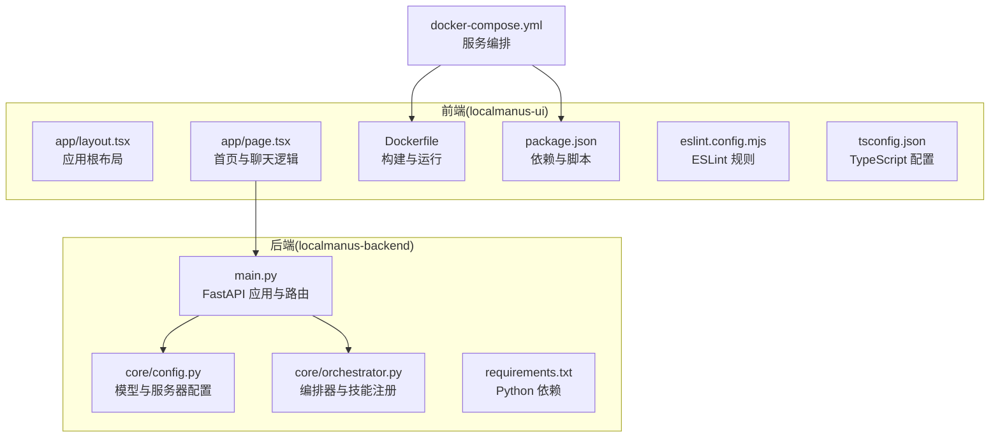
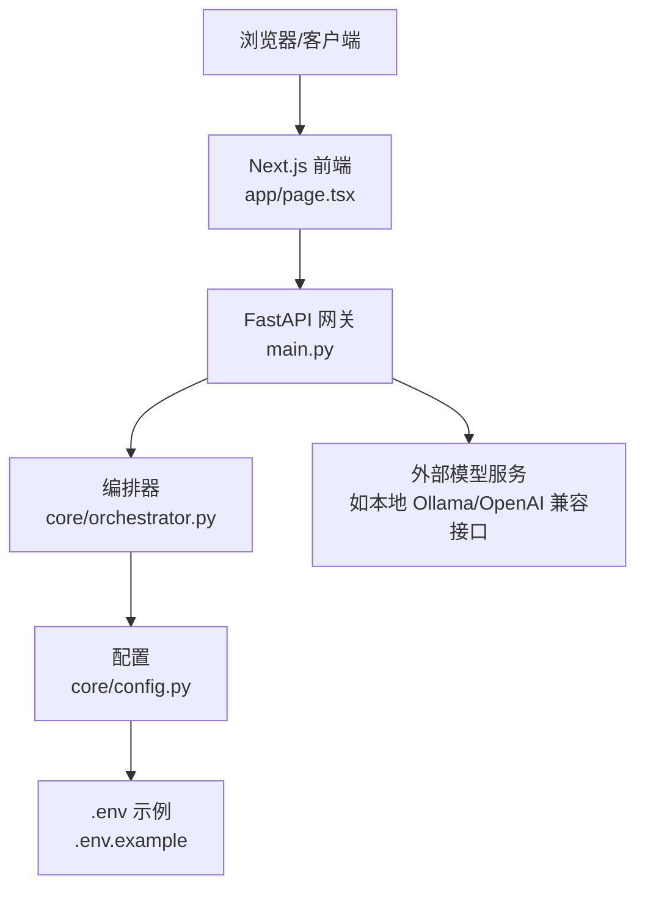
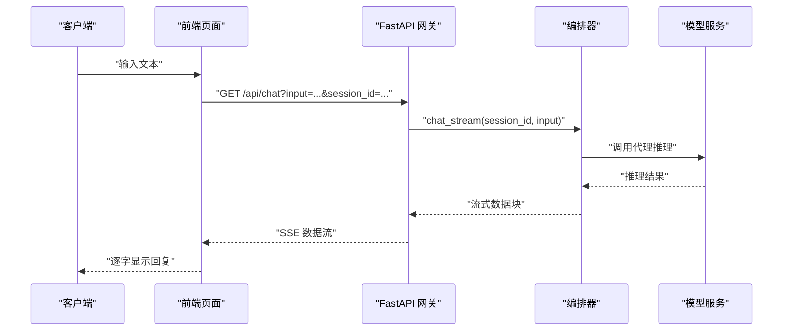
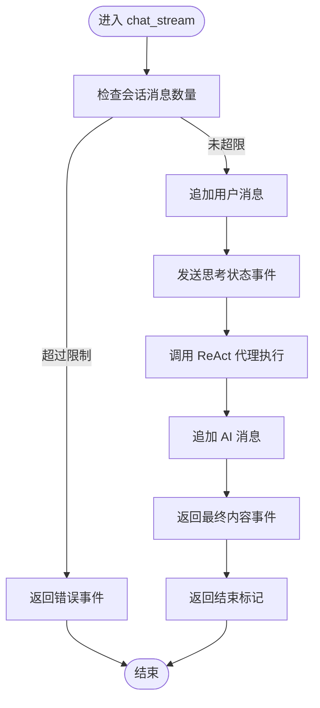
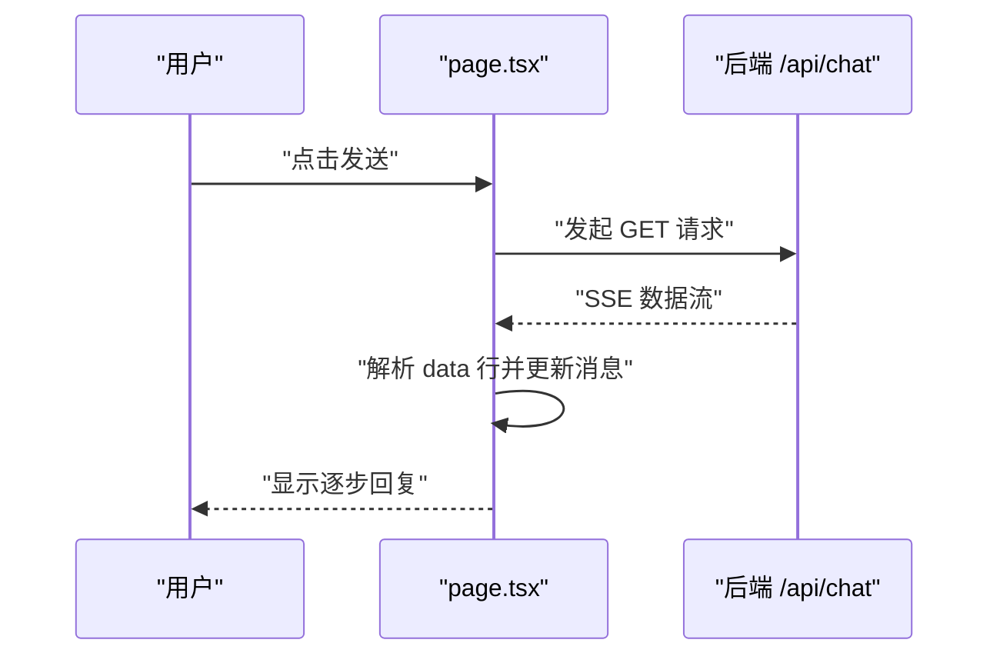
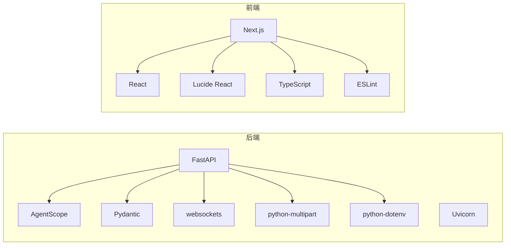

# 开发指南

<cite>
**本文引用的文件**
- [main.py](file://localmanus-backend/main.py)
- [requirements.txt](file://localmanus-backend/requirements.txt)
- [.env.example](file://localmanus-backend/.env.example)
- [config.py](file://localmanus-backend/core/config.py)
- [orchestrator.py](file://localmanus-backend/core/orchestrator.py)
- [package.json](file://localmanus-ui/package.json)
- [Dockerfile（UI）](file://localmanus-ui/Dockerfile)
- [docker-compose.yml](file://docker-compose.yml)
- [layout.tsx](file://localmanus-ui/app/layout.tsx)
- [page.tsx](file://localmanus-ui/app/page.tsx)
- [eslint.config.mjs](file://localmanus-ui/eslint.config.mjs)
- [tsconfig.json](file://localmanus-ui/tsconfig.json)
- [.windsurfrules](file://.windsurfrules)
</cite>

## 目录
1. [简介](#简介)
2. [项目结构](#项目结构)
3. [核心组件](#核心组件)
4. [架构总览](#架构总览)
5. [详细组件分析](#详细组件分析)
6. [依赖关系分析](#依赖关系分析)
7. [性能考虑](#性能考虑)
8. [故障排查指南](#故障排查指南)
9. [结论](#结论)
10. [附录](#附录)

## 简介
本开发指南面向 LocalManus 项目的开发者，覆盖从环境准备、依赖安装到日常开发、调试、测试、性能分析、代码评审与持续集成的全流程。项目采用前后端分离架构：后端基于 FastAPI 提供 API 网关与流式对话能力；前端基于 Next.js 16 构建用户界面，支持聊天流式输出与模板展示。

## 项目结构
- 后端（localmanus-backend）
  - 核心入口：FastAPI 应用与路由定义
  - 核心模块：编排器（Orchestrator）、配置（config）、提示词与技能管理预留
  - 示例脚本：任务编排测试
- 前端（localmanus-ui）
  - 应用布局与页面：Next.js 应用结构
  - 组件：侧边栏、工具箱、用户状态、搜索框等
  - 构建与运行：Dockerfile、package.json、TypeScript 配置、ESLint 规则
- 运维与协作
  - docker-compose：服务编排（当前仅 UI）
  - .env.example：后端模型与 API 配置示例
  - .windsurfrules：设计与前端工作流规则（可选）

图表来源
- [main.py](file://localmanus-backend/main.py#L1-L95)
- [config.py](file://localmanus-backend/core/config.py#L1-L21)
- [orchestrator.py](file://localmanus-backend/core/orchestrator.py#L1-L118)
- [requirements.txt](file://localmanus-backend/requirements.txt#L1-L8)
- [layout.tsx](file://localmanus-ui/app/layout.tsx#L1-L20)
- [page.tsx](file://localmanus-ui/app/page.tsx#L1-L184)
- [Dockerfile（UI）](file://localmanus-ui/Dockerfile#L1-L32)
- [package.json](file://localmanus-ui/package.json#L1-L26)
- [eslint.config.mjs](file://localmanus-ui/eslint.config.mjs#L1-L19)
- [tsconfig.json](file://localmanus-ui/tsconfig.json#L1-L35)
- [docker-compose.yml](file://docker-compose.yml#L1-L16)

章节来源
- [main.py](file://localmanus-backend/main.py#L1-L95)
- [requirements.txt](file://localmanus-backend/requirements.txt#L1-L8)
- [config.py](file://localmanus-backend/core/config.py#L1-L21)
- [orchestrator.py](file://localmanus-backend/core/orchestrator.py#L1-L118)
- [package.json](file://localmanus-ui/package.json#L1-L26)
- [Dockerfile（UI）](file://localmanus-ui/Dockerfile#L1-L32)
- [docker-compose.yml](file://docker-compose.yml#L1-L16)
- [layout.tsx](file://localmanus-ui/app/layout.tsx#L1-L20)
- [page.tsx](file://localmanus-ui/app/page.tsx#L1-L184)
- [eslint.config.mjs](file://localmanus-ui/eslint.config.mjs#L1-L19)
- [tsconfig.json](file://localmanus-ui/tsconfig.json#L1-L35)

## 核心组件
- 后端 API 网关
  - 路由：根路径健康检查、SSE 多轮聊天、同步任务规划、同步 ReAct 执行、WebSocket 任务流
  - 中间件：CORS 放通
  - 日志：INFO 级别日志记录
- 编排器（Orchestrator）
  - 会话管理：按 session_id 维护历史消息上限
  - 流式聊天：SSE 输出状态、内容与结束标记
  - 工作流：意图解析 → 计划生成 → 添加 trace_id
  - 技能注册：预置可用技能元数据（示例）
- 前端应用
  - 布局：根 HTML 语言与全局样式
  - 页面：聊天消息渲染、SSE 读取与增量更新、模板区与工具箱
  - 构建：多阶段 Docker 构建，生产启动命令
- 配置与环境
  - 后端：dotenv 加载，模型配置（名称、密钥、基础地址），服务器主机与端口
  - 前端：Next.js、React、TypeScript、ESLint 配置

章节来源
- [main.py](file://localmanus-backend/main.py#L1-L95)
- [orchestrator.py](file://localmanus-backend/core/orchestrator.py#L1-L118)
- [config.py](file://localmanus-backend/core/config.py#L1-L21)
- [layout.tsx](file://localmanus-ui/app/layout.tsx#L1-L20)
- [page.tsx](file://localmanus-ui/app/page.tsx#L1-L184)
- [Dockerfile（UI）](file://localmanus-ui/Dockerfile#L1-L32)
- [package.json](file://localmanus-ui/package.json#L1-L26)
- [eslint.config.mjs](file://localmanus-ui/eslint.config.mjs#L1-L19)
- [tsconfig.json](file://localmanus-ui/tsconfig.json#L1-L35)

## 架构总览
LocalManus 采用“前端 Next.js + 后端 FastAPI”的分层架构。前端通过 HTTP(SSE/WebSocket)与后端交互，后端通过编排器协调代理与工具执行，并将结果以流式方式返回。

图表来源
- [main.py](file://localmanus-backend/main.py#L1-L95)
- [orchestrator.py](file://localmanus-backend/core/orchestrator.py#L1-L118)
- [config.py](file://localmanus-backend/core/config.py#L1-L21)
- [.env.example](file://localmanus-backend/.env.example#L1-L4)

## 详细组件分析

### 后端 API 网关（FastAPI）
- 功能要点
  - 根路径返回版本信息
  - SSE 路由用于多轮聊天，支持 session_id
  - 同步任务规划与 ReAct 执行
  - WebSocket 路由用于实时任务流（当前演示 ReAct 思考与结果）
- 关键处理
  - CORS 放通所有来源
  - 流式响应封装为 text/event-stream
  - WebSocket 接收 action=start/react，执行 ReAct 并回传思考与结果

图表来源
- [main.py](file://localmanus-backend/main.py#L30-L38)
- [orchestrator.py](file://localmanus-backend/core/orchestrator.py#L13-L60)

章节来源
- [main.py](file://localmanus-backend/main.py#L1-L95)

### 编排器（Orchestrator）
- 会话与历史
  - 使用 session_id 管理消息列表，限制最多 10 轮（20 条消息）
  - 超限时返回错误流事件
- 流式聊天
  - 发送“正在思考”状态事件
  - 调用 ReAct 代理执行，追加 AI 回复到历史
  - 返回最终内容与结束标记
- 工作流
  - 意图解析 → 计划生成 → 注入 trace_id
- 技能注册
  - 预置示例技能（如 PPT 读取、Word 文档生成）

图表来源
- [orchestrator.py](file://localmanus-backend/core/orchestrator.py#L13-L60)

章节来源
- [orchestrator.py](file://localmanus-backend/core/orchestrator.py#L1-L118)

### 前端页面（Next.js）
- 聊天交互
  - 使用 fetch + ReadableStream 读取 SSE
  - 解析 data: 行，区分 content 与 error 类型，增量更新消息
  - 自动滚动到底部
- 模板与工具
  - 模板标签页与卡片展示
  - 工具箱在非聊天模式下可见
- 布局与国际化
  - 根布局设置语言与全局样式

图表来源
- [page.tsx](file://localmanus-ui/app/page.tsx#L24-L90)

章节来源
- [page.tsx](file://localmanus-ui/app/page.tsx#L1-L184)
- [layout.tsx](file://localmanus-ui/app/layout.tsx#L1-L20)

### 配置与环境
- 后端
  - 通过 dotenv 加载 OPENAI_API_KEY、OPENAI_API_BASE、MODEL_NAME
  - 默认回退值便于本地快速启动
- 前端
  - TypeScript 严格模式、ESLint Next 规则、路径别名 @/*

章节来源
- [config.py](file://localmanus-backend/core/config.py#L1-L21)
- [.env.example](file://localmanus-backend/.env.example#L1-L4)
- [tsconfig.json](file://localmanus-ui/tsconfig.json#L1-L35)
- [eslint.config.mjs](file://localmanus-ui/eslint.config.mjs#L1-L19)

## 依赖关系分析
- 后端依赖
  - FastAPI、Uvicorn、AgentScope、Pydantic、websockets、python-multipart、python-dotenv
- 前端依赖
  - Next.js、React、Lucide React、TypeScript、ESLint Next 规则
- 运维
  - Docker 多阶段构建 UI，docker-compose 当前仅编排 UI

图表来源
- [requirements.txt](file://localmanus-backend/requirements.txt#L1-L8)
- [package.json](file://localmanus-ui/package.json#L1-L26)

章节来源
- [requirements.txt](file://localmanus-backend/requirements.txt#L1-L8)
- [package.json](file://localmanus-ui/package.json#L1-L26)

## 性能考虑
- 后端
  - SSE 流式输出：减少一次性大响应，提升首字节时间
  - 会话上限：控制历史长度，避免内存膨胀
  - 异常捕获：在流中返回错误事件，避免连接中断
- 前端
  - 增量渲染：仅替换最后一条消息的内容，降低重绘成本
  - 自动滚动：在消息变化时滚动到底部
- 运维
  - Docker 多阶段构建：减小镜像体积，加速部署
  - 端口映射：UI 暴露 3000 端口，便于本地联调

章节来源
- [main.py](file://localmanus-backend/main.py#L30-L38)
- [orchestrator.py](file://localmanus-backend/core/orchestrator.py#L13-L60)
- [page.tsx](file://localmanus-ui/app/page.tsx#L18-L90)
- [Dockerfile（UI）](file://localmanus-ui/Dockerfile#L1-L32)

## 故障排查指南
- 后端
  - 端口占用：确认 HOST/PORT 配置与实际监听一致
  - 模型连接失败：检查 OPENAI_API_KEY、OPENAI_API_BASE、MODEL_NAME 是否正确
  - CORS 报错：确认前端访问域名与后端放通范围匹配
- 前端
  - SSE 不显示：检查后端是否返回 data: 行，确认网络请求成功
  - 模板不显示：核对模板数据结构与渲染逻辑
- 运维
  - Docker 构建失败：检查 node 版本与依赖安装步骤
  - docker-compose 服务不可用：确认端口映射与容器日志

章节来源
- [config.py](file://localmanus-backend/core/config.py#L18-L21)
- [.env.example](file://localmanus-backend/.env.example#L1-L4)
- [main.py](file://localmanus-backend/main.py#L17-L24)
- [page.tsx](file://localmanus-ui/app/page.tsx#L35-L90)
- [Dockerfile（UI）](file://localmanus-ui/Dockerfile#L1-L32)
- [docker-compose.yml](file://docker-compose.yml#L1-L16)

## 结论
本指南提供了 LocalManus 项目的完整开发与运维蓝图：从环境准备、依赖安装、代码规范、调试与测试、性能优化，到新功能开发流程、代码评审与持续集成建议。建议团队在开发过程中遵循统一的 Git 工作流与代码风格，确保前后端协同顺畅。

## 附录

### 环境与依赖安装指引
- Python 环境
  - 安装 Python 3.10+，创建虚拟环境
  - 在后端目录安装依赖：requirements.txt
- Node.js 环境
  - 安装 Node.js 20+，在前端目录安装依赖：package.json
- 模型服务
  - 可使用本地 Ollama 或 OpenAI 兼容接口，配置 .env 示例中的变量
- Docker
  - 使用 docker-compose 启动 UI 服务，或使用前端 Dockerfile 构建镜像

章节来源
- [requirements.txt](file://localmanus-backend/requirements.txt#L1-L8)
- [package.json](file://localmanus-ui/package.json#L1-L26)
- [.env.example](file://localmanus-backend/.env.example#L1-L4)
- [docker-compose.yml](file://docker-compose.yml#L1-L16)
- [Dockerfile（UI）](file://localmanus-ui/Dockerfile#L1-L32)

### 代码规范与最佳实践
- Python
  - 使用类型注解与 Pydantic 模型校验
  - 日志分级与异常捕获，保证流式输出稳定性
- TypeScript/Next.js
  - 严格模式与 ESLint Next 规则
  - 路径别名 @/*，保持导入一致性
- 前端组件
  - 将 UI 与逻辑拆分，组件职责单一
  - 使用 CSS Modules 或样式模块化，避免命名冲突

章节来源
- [config.py](file://localmanus-backend/core/config.py#L1-L21)
- [tsconfig.json](file://localmanus-ui/tsconfig.json#L1-L35)
- [eslint.config.mjs](file://localmanus-ui/eslint.config.mjs#L1-L19)
- [page.tsx](file://localmanus-ui/app/page.tsx#L1-L184)

### Git 工作流程与代码评审
- 分支策略
  - 主分支保护，功能开发在特性分支
  - 提交信息清晰描述变更与影响范围
- 代码评审
  - 至少一名维护者评审，关注安全性、性能与可维护性
  - 评审清单：新增依赖、日志级别、异常处理、SSE/WS 行为一致性

（本节为通用流程建议，无需特定文件引用）

### 调试技巧与测试策略
- 后端
  - 使用 Uvicorn 开发模式热重载
  - 通过 curl 或浏览器 SSE 工具验证 /api/chat
  - 单元测试：针对编排器与配置模块编写测试用例
- 前端
  - 使用浏览器开发者工具查看网络与 SSE
  - 组件测试：使用 React Testing Library 或 Next.js 测试工具
- 性能分析
  - 后端：监控响应时间与并发连接数
  - 前端：测量首字节时间与渲染耗时

（本节为通用方法建议，无需特定文件引用）

### 新功能开发流程
- 需求与设计
  - 明确前后端交互协议（HTTP/WS）
  - 设计数据模型与错误码
- 开发
  - 后端：新增路由与业务逻辑，必要时扩展编排器
  - 前端：新增页面或组件，处理流式数据
- 测试
  - 单测 + 集成测试 + 端到端测试
- 文档与评审
  - 更新 README 与 API 文档，提交评审

（本节为通用流程建议，无需特定文件引用）

### 持续集成配置
- 建议流水线步骤
  - Python 依赖安装与安全扫描
  - TypeScript 类型检查与 ESLint
  - 前端构建与静态资源检查
  - Docker 镜像构建与推送
- 触发条件
  - PR 自动化检查，主分支保护合并

（本节为通用流程建议，无需特定文件引用）

### 贡献指南与问题报告
- 贡献流程
  - Fork 仓库，创建特性分支，提交 PR
  - 遵循代码规范与评审要求
- 问题报告
  - 提供环境信息、复现步骤、期望与实际行为
- 功能请求
  - 描述场景、收益与实现建议

（本节为通用流程建议，无需特定文件引用）

### 开发环境搭建与维护
- 一键启动
  - 使用 docker-compose 启动 UI（后续可扩展后端服务）
- 本地联调
  - 前端访问 http://localhost:3000，后端默认 8000 端口
- 环境变量
  - 复制 .env.example 为 .env，填写模型密钥与基础地址
- 版本与依赖
  - 锁定关键依赖版本，定期更新安全补丁

章节来源
- [docker-compose.yml](file://docker-compose.yml#L1-L16)
- [.env.example](file://localmanus-backend/.env.example#L1-L4)