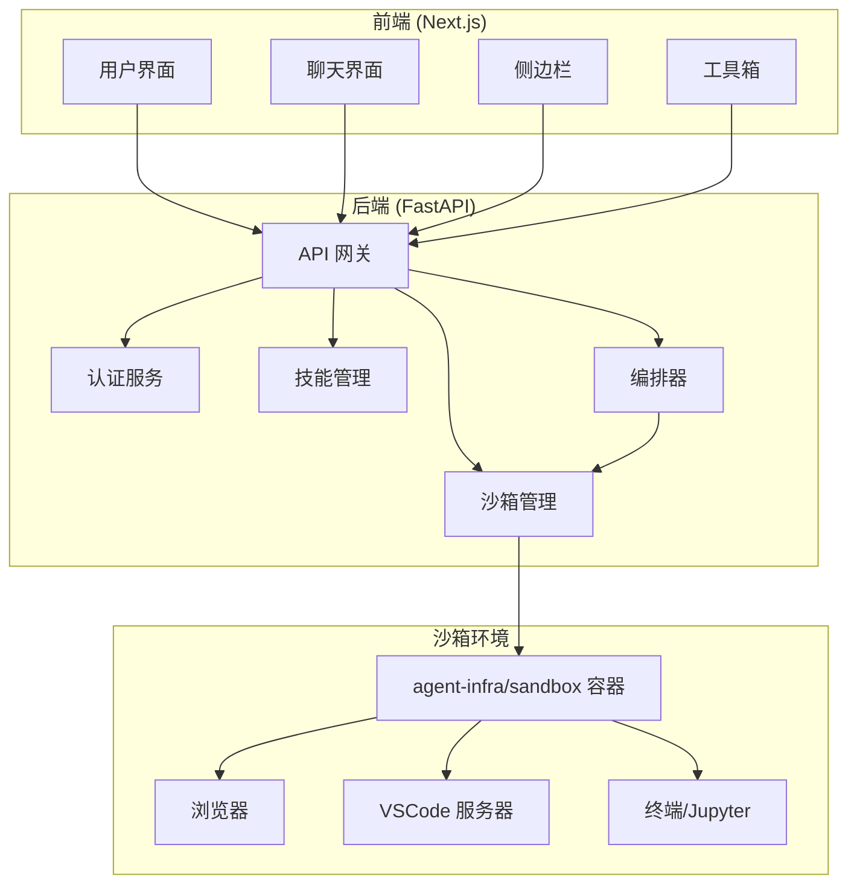
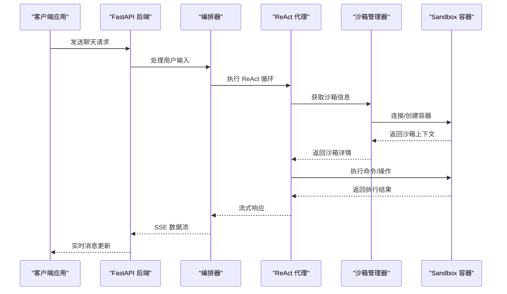
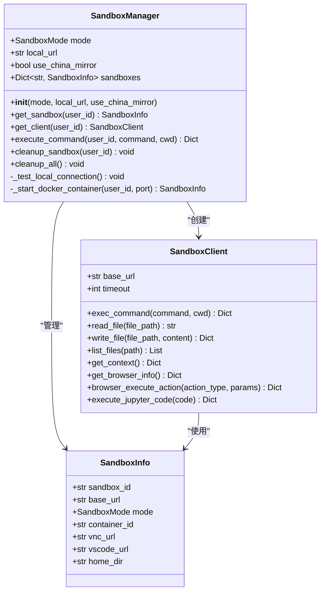
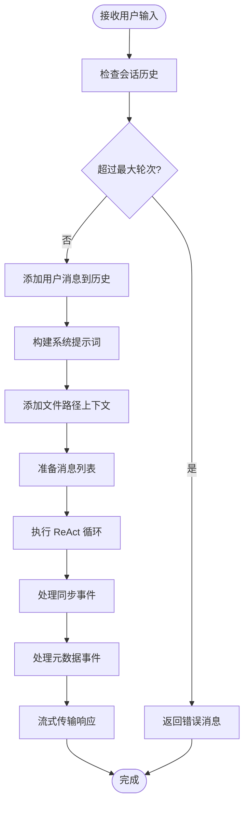
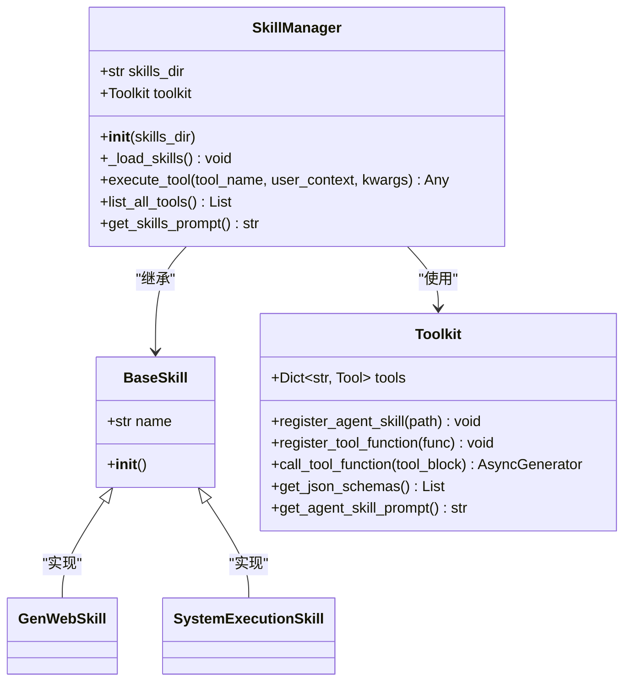
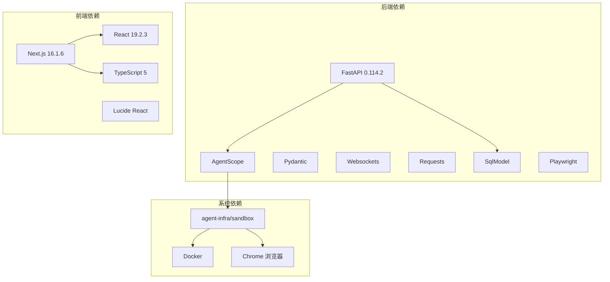

# 沙箱快速开始

<cite>
**本文档引用的文件**
- [README.md](file://README.md)
- [main.py](file://localmanus-backend/main.py)
- [firecracker_sandbox.py](file://localmanus-backend/core/firecracker_sandbox.py)
- [sandbox.py](file://localmanus-backend/core/sandbox.py)
- [SANDBOX_QUICKSTART.md](file://localmanus-backend/scripts/SANDBOX_QUICKSTART.md)
- [test_sandbox.py](file://localmanus-backend/scripts/test_sandbox.py)
- [orchestrator.py](file://localmanus-backend/core/orchestrator.py)
- [agent_manager.py](file://localmanus-backend/core/agent_manager.py)
- [skill_manager.py](file://localmanus-backend/core/skill_manager.py)
- [config.py](file://localmanus-backend/core/config.py)
- [gen_web.py](file://localmanus-backend/skills/gen-web/gen_web.py)
- [system_tools.py](file://localmanus-backend/skills/system-execution/system_tools.py)
- [requirements.txt](file://localmanus-backend/requirements.txt)
- [package.json](file://localmanus-ui/package.json)
- [page.tsx](file://localmanus-ui/app/page.tsx)
- [api.ts](file://localmanus-ui/app/utils/api.ts)
</cite>

## 目录
1. [简介](#简介)
2. [项目结构](#项目结构)
3. [核心组件](#核心组件)
4. [架构概览](#架构概览)
5. [详细组件分析](#详细组件分析)
6. [依赖关系分析](#依赖关系分析)
7. [性能考虑](#性能考虑)
8. [故障排除指南](#故障排除指南)
9. [结论](#结论)

## 简介

LocalManus 是一个本地优先的 AI 代理平台，集成了多代理编排、沙箱执行和实时流式传输功能。该项目的核心是基于 agent-infra/sandbox 的容器化沙箱环境，为安全的代码生成和网络自动化提供支持。

该平台具有以下主要特性：
- **多代理系统**：Manager、Planner 和 ReAct 代理通过 AgentScope 协同工作
- **实时流式传输**：使用 Server-Sent Events (SSE) 提供实时代理响应
- **可扩展技能系统**：工具包架构支持自定义能力
- **文件管理**：上传、管理和处理文件并与代理上下文集成
- **用户认证**：基于 JWT 的安全会话管理
- **双模式沙箱**：本地（共享）或在线（隔离）容器模式

## 项目结构

LocalManus 采用前后端分离的架构设计，包含以下主要组件：



**图表来源**
- [README.md](file://README.md#L37-L61)
- [main.py](file://localmanus-backend/main.py#L33-L40)

**章节来源**
- [README.md](file://README.md#L170-L192)
- [main.py](file://localmanus-backend/main.py#L1-L50)

## 核心组件

### 沙箱管理系统

沙箱系统是 LocalManus 的核心基础设施，提供了两种运行模式：

#### 本地模式 (Local Mode)
- **特点**：即时启动，共享资源，低资源消耗
- **适用场景**：开发测试、单用户环境
- **配置**：连接到预存在的沙箱容器

#### 在线模式 (Online Mode)
- **特点**：按需启动，隔离容器，中等资源消耗
- **适用场景**：生产环境、多用户部署
- **配置**：自动创建 Docker 容器

### 多代理编排系统

系统集成了三个核心代理：

1. **Manager Agent**：意图分析和任务分解
2. **Planner Agent**：DAG 计划生成和任务调度  
3. **ReAct Agent**：推理-行动循环执行

### 技能系统

技能系统采用 AgentScope 的工具包模式，支持：
- 自定义技能开发
- 动态技能注册
- 工具函数和代理技能混合

**章节来源**
- [firecracker_sandbox.py](file://localmanus-backend/core/firecracker_sandbox.py#L103-L126)
- [agent_manager.py](file://localmanus-backend/core/agent_manager.py#L11-L36)
- [skill_manager.py](file://localmanus-backend/core/skill_manager.py#L18-L27)

## 架构概览



**图表来源**
- [main.py](file://localmanus-backend/main.py#L391-L419)
- [orchestrator.py](file://localmanus-backend/core/orchestrator.py#L16-L90)
- [firecracker_sandbox.py](file://localmanus-backend/core/firecracker_sandbox.py#L205-L233)

## 详细组件分析

### 沙箱管理器 (SandboxManager)

SandboxManager 是沙箱系统的核心控制器，负责管理用户沙箱实例：



**图表来源**
- [firecracker_sandbox.py](file://localmanus-backend/core/firecracker_sandbox.py#L103-L126)
- [firecracker_sandbox.py](file://localmanus-backend/core/firecracker_sandbox.py#L31-L102)
- [firecracker_sandbox.py](file://localmanus-backend/core/firecracker_sandbox.py#L20-L30)

#### 关键功能特性

1. **双模式支持**：同时支持本地和在线两种运行模式
2. **智能连接**：自动检测和连接现有沙箱实例
3. **资源管理**：自动清理和资源回收
4. **容器编排**：Docker 容器的生命周期管理

**章节来源**
- [firecracker_sandbox.py](file://localmanus-backend/core/firecracker_sandbox.py#L103-L275)

### 编排器 (Orchestrator)

编排器负责协调多代理交互和流式响应：



**图表来源**
- [orchestrator.py](file://localmanus-backend/core/orchestrator.py#L16-L90)

#### 内部协议设计

编排器使用特殊的内部协议来区分不同类型的事件：

- `{'content': str}`：发送给前端的普通内容
- `{'_sync': list}`：内部同步消息到会话历史
- `{'_meta': dict}`：运行元数据用于日志记录

**章节来源**
- [orchestrator.py](file://localmanus-backend/core/orchestrator.py#L16-L90)

### 技能管理器 (SkillManager)

技能管理器实现了灵活的技能注册和执行机制：



**图表来源**
- [skill_manager.py](file://localmanus-backend/core/skill_manager.py#L18-L27)
- [skill_manager.py](file://localmanus-backend/core/skill_manager.py#L10-L17)
- [gen_web.py](file://localmanus-backend/skills/gen-web/gen_web.py#L8-L13)
- [system_tools.py](file://localmanus-backend/skills/system-execution/system_tools.py#L6-L14)

#### 技能加载机制

技能系统支持两种加载方式：

1. **代理技能**：目录结构包含 SKILL.md 文件
2. **工具函数**：直接扫描 .py 文件中的函数

**章节来源**
- [skill_manager.py](file://localmanus-backend/core/skill_manager.py#L29-L89)

## 依赖关系分析



**图表来源**
- [requirements.txt](file://localmanus-backend/requirements.txt#L1-L15)
- [package.json](file://localmanus-ui/package.json#L15-L32)

### 关键依赖说明

1. **FastAPI 生态系统**：提供高性能的 Web API 框架
2. **AgentScope**：多代理框架，支持 ReAct 循环
3. **Docker**：容器化沙箱环境
4. **Playwright**：浏览器自动化测试和交互
5. **Next.js**：现代 React 框架，支持 SSR 和静态生成

**章节来源**
- [requirements.txt](file://localmanus-backend/requirements.txt#L1-L15)
- [package.json](file://localmanus-ui/package.json#L15-L32)

## 性能考虑

### 沙箱性能优化

1. **连接池管理**：SandboxManager 维护沙箱实例缓存
2. **资源隔离**：在线模式确保每个用户的资源隔离
3. **延迟启动**：按需创建 Docker 容器，减少资源占用
4. **超时控制**：统一的请求超时和重试机制

### 编排器优化

1. **流式处理**：使用异步生成器实现实时响应
2. **会话管理**：限制对话轮次防止内存泄漏
3. **消息压缩**：只传输必要的消息内容
4. **错误恢复**：优雅处理异常情况

### 前端性能

1. **虚拟滚动**：大量消息时的高效渲染
2. **懒加载**：按需加载组件和资源
3. **缓存策略**：智能缓存用户数据和设置
4. **WebSocket 优化**：高效的实时通信

## 故障排除指南

### 沙箱连接问题

#### 本地模式连接失败
```bash
# 检查沙箱是否运行
curl http://localhost:8080/v1/sandbox

# 验证 Docker 状态
docker ps | grep sandbox
```

#### 在线模式容器问题
```bash
# 查看所有沙箱容器
docker ps -a | grep localmanus-sandbox

# 清理僵尸容器
docker ps -a | grep localmanus-sandbox | awk '{print $1}' | xargs docker rm -f

# 查看容器日志
docker logs localmanus-sandbox-{user_id}
```

### 开发环境问题

#### 后端启动失败
```bash
# 检查 Python 版本
python --version

# 验证依赖安装
pip install -r requirements.txt --upgrade

# 检查环境变量
cat .env
```

#### 前端构建错误
```bash
# 清理 Next.js 缓存
cd localmanus-ui
rm -rf .next
npm run build

# 检查 Node.js 版本
node --version
```

### 常见配置问题

#### 沙箱模式配置
```bash
# 本地模式配置
echo "SANDBOX_MODE=local" >> .env
echo "SANDBOX_LOCAL_URL=http://localhost:8080" >> .env

# 在线模式配置
echo "SANDBOX_MODE=online" >> .env
```

#### API 端点测试
```bash
# 健康检查
curl http://localhost:8000/api/health

# 用户认证
curl -X POST http://localhost:8000/api/login \
  -H "Content-Type: application/x-www-form-urlencoded" \
  -d "username=test&password=test"

# 技能列表
curl http://localhost:8000/api/skills
```

**章节来源**
- [SANDBOX_QUICKSTART.md](file://localmanus-backend/scripts/SANDBOX_QUICKSTART.md#L86-L100)
- [README.md](file://README.md#L250-L279)

## 结论

LocalManus 提供了一个完整、可扩展的本地 AI 代理平台解决方案。其核心优势包括：

1. **强大的沙箱系统**：通过 agent-infra/sandbox 提供安全的执行环境
2. **灵活的架构设计**：支持多种部署模式和配置选项
3. **丰富的功能特性**：从基础的聊天功能到复杂的代码生成
4. **良好的开发体验**：清晰的代码结构和完善的文档

### 快速开始步骤

1. **环境准备**：确保安装了 Python 3.8+、Node.js 18+ 和 Docker
2. **启动沙箱**：运行 `docker run` 命令启动沙箱容器
3. **配置环境**：设置 `.env` 文件中的必要配置
4. **启动服务**：分别启动后端和前端服务
5. **访问应用**：在浏览器中访问 `http://localhost:3000`

### 扩展建议

1. **自定义技能**：基于现有的技能模板开发新功能
2. **模型配置**：根据需求调整 LLM 参数和配置
3. **监控集成**：添加日志收集和性能监控
4. **安全加固**：实施更严格的安全策略和访问控制

通过这些组件和配置，LocalManus 为开发者提供了一个强大而灵活的本地 AI 代理开发平台。