# 沙箱迁移指南

<cite>
**本文档中引用的文件**
- [FIRECRACKER_TROUBLESHOOTING.md](file://localmanus-backend/scripts/FIRECRACKER_TROUBLESHOOTING.md)
- [firecracker_sandbox.py](file://localmanus-backend/core/firecracker_sandbox.py)
- [sandbox.py](file://localmanus-backend/core/sandbox.py)
- [test_sandbox.py](file://localmanus-backend/scripts/test_sandbox.py)
- [config.py](file://localmanus-backend/core/config.py)
- [.env.example](file://localmanus-backend/.env.example)
- [gen_web.py](file://localmanus-backend/skills/gen-web/gen_web.py)
- [system_tools.py](file://localmanus-backend/skills/system-execution/system_tools.py)
- [skill_manager.py](file://localmanus-backend/core/skill_manager.py)
- [main.py](file://localmanus-backend/main.py)
- [orchestrator.py](file://localmanus-backend/core/orchestrator.py)
- [agent_manager.py](file://localmanus-backend/core/agent_manager.py)
</cite>

## 更新摘要
**所做更改**
- 更新文档标题以反映文件重命名：从 SANDBOX_MIGRATION_GUIDE.md 到 FIRECRACKER_TROUBLESHOOTING.md
- 更新所有文件引用以使用新的文件名
- 更新架构图以反映新的 agent-infra/sandbox 架构
- 更新故障排除部分以包含新的故障排除指南
- 更新配置管理部分以反映新的环境变量
- 更新技能集成示例以使用新的沙箱 API

## 目录
1. [简介](#简介)
2. [项目结构概览](#项目结构概览)
3. [核心组件分析](#核心组件分析)
4. [架构对比](#架构对比)
5. [迁移步骤详解](#迁移步骤详解)
6. [配置管理](#配置管理)
7. [技能集成](#技能集成)
8. [测试与验证](#测试与验证)
9. [故障排除](#故障排除)
10. [最佳实践](#最佳实践)
11. [总结](#总结)

## 简介

LocalManus 项目已成功从传统的 Firecracker 虚拟机沙箱系统迁移到基于 [agent-infra/sandbox](https://github.com/agent-infra/sandbox) 的现代化沙箱架构。新系统提供了更强大的功能、更好的易用性和更高的灵活性，支持本地共享模式和在线隔离模式两种运行方式。

新沙箱系统的主要优势包括：
- **浏览器自动化** - 完整的 Playwright/CDP 支持和 VNC 访问
- **开发环境** - VSCode Server、Jupyter、终端等完整开发工具
- **文件操作** - 完整的文件系统访问能力
- **MCP 集成** - 模型上下文协议服务器支持
- **双模式运行** - 本地（共享）或在线（隔离）容器模式

**章节来源**
- [FIRECRACKER_TROUBLESHOOTING.md](file://localmanus-backend/scripts/FIRECRACKER_TROUBLESHOOTING.md#L1-L12)

## 项目结构概览

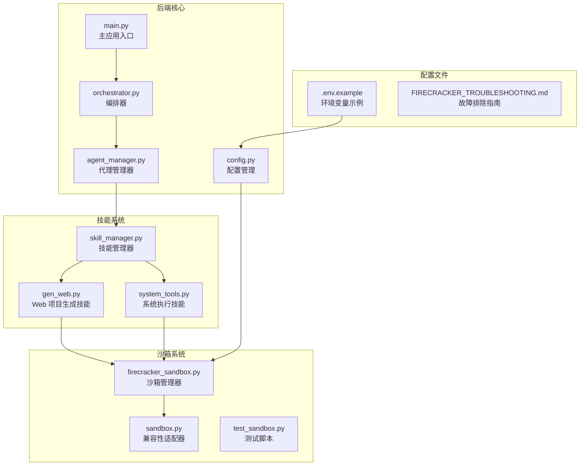

**图表来源**
- [main.py](file://localmanus-backend/main.py#L1-L50)
- [firecracker_sandbox.py](file://localmanus-backend/core/firecracker_sandbox.py#L1-L50)
- [gen_web.py](file://localmanus-backend/skills/gen-web/gen_web.py#L1-L30)

**章节来源**
- [main.py](file://localmanus-backend/main.py#L1-L100)
- [firecracker_sandbox.py](file://localmanus-backend/core/firecracker_sandbox.py#L1-L100)

## 核心组件分析

### 沙箱管理器 (SandboxManager)

沙箱管理器是整个系统的核心组件，负责管理用户沙箱实例的生命周期和资源分配。

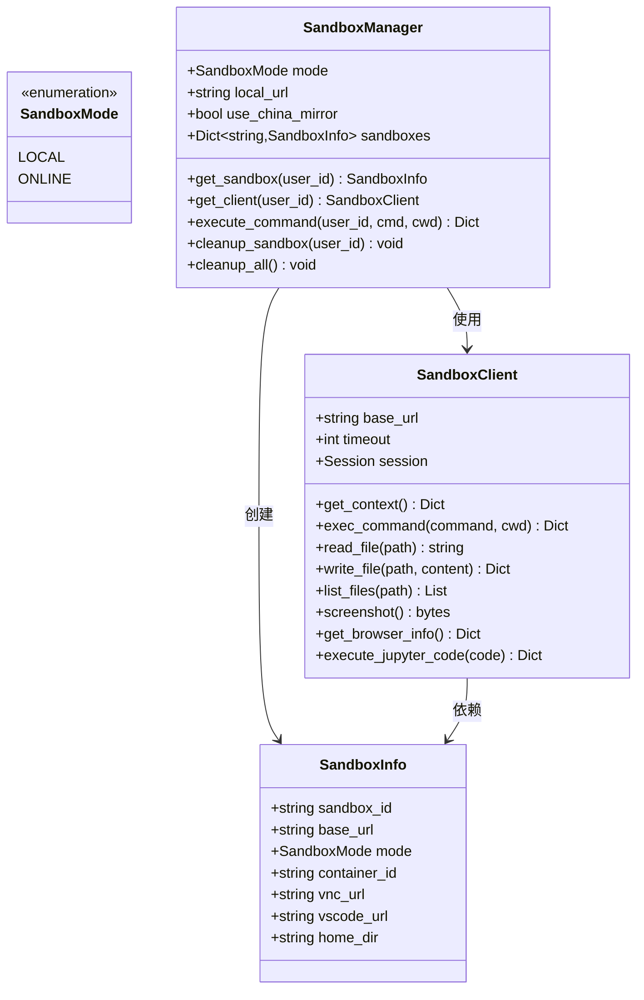

**图表来源**
- [firecracker_sandbox.py](file://localmanus-backend/core/firecracker_sandbox.py#L15-L120)

### 兼容性适配器

为了保持向后兼容性，系统提供了 LegacySandboxAdapter 来适配旧版本的返回格式。

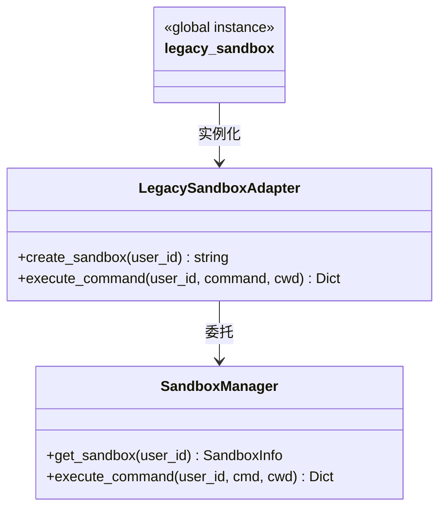

**图表来源**
- [sandbox.py](file://localmanus-backend/core/sandbox.py#L11-L40)

**章节来源**
- [firecracker_sandbox.py](file://localmanus-backend/core/firecracker_sandbox.py#L103-L294)
- [sandbox.py](file://localmanus-backend/core/sandbox.py#L1-L46)

## 架构对比

### 传统 Firecracker 架构

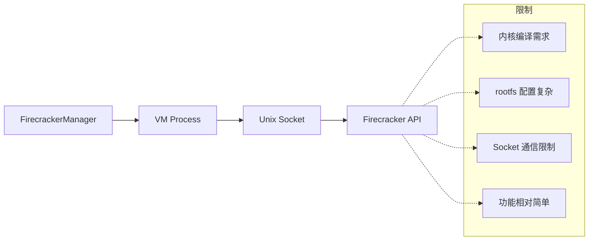

### 新版 agent-infra/sandbox 架构

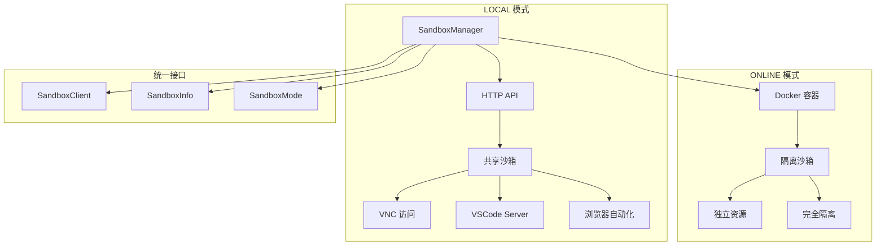

**图表来源**
- [FIRECRACKER_TROUBLESHOOTING.md](file://localmanus-backend/scripts/FIRECRACKER_TROUBLESHOOTING.md#L20-L25)

**章节来源**
- [FIRECRACKER_TROUBLESHOOTING.md](file://localmanus-backend/scripts/FIRECRACKER_TROUBLESHOOTING.md#L1-L50)

## 迁移步骤详解

### 第一步：环境准备

1. **安装 Docker**（仅在线模式需要）
   - 确保 Docker 已正确安装和运行
   - 验证 Docker 版本：`docker --version`

2. **配置环境变量**
   - 在 `.env` 文件中设置沙箱配置
   - 支持本地和在线两种模式切换

### 第二步：配置沙箱模式

#### 本地模式配置

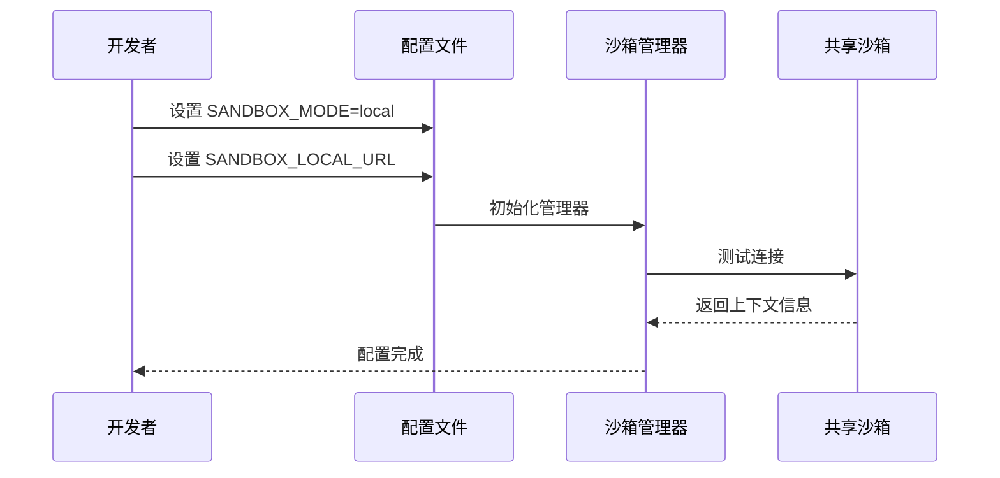

**图表来源**
- [config.py](file://localmanus-backend/core/config.py#L23-L27)
- [firecracker_sandbox.py](file://localmanus-backend/core/firecracker_sandbox.py#L127-L136)

#### 在线模式配置

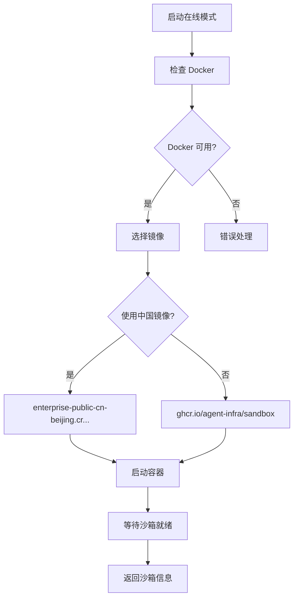

**图表来源**
- [firecracker_sandbox.py](file://localmanus-backend/core/firecracker_sandbox.py#L137-L203)

**章节来源**
- [FIRECRACKER_TROUBLESHOOTING.md](file://localmanus-backend/scripts/FIRECRACKER_TROUBLESHOOTING.md#L215-L232)

### 第三步：更新代码集成

#### 技能系统集成

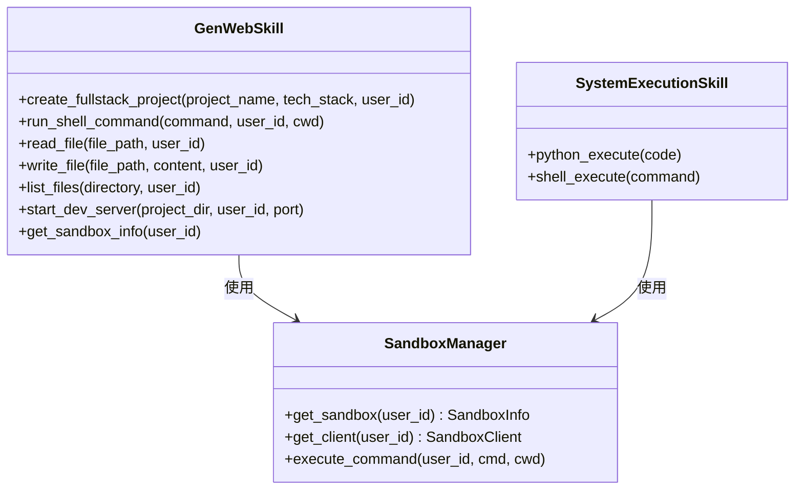

**图表来源**
- [gen_web.py](file://localmanus-backend/skills/gen-web/gen_web.py#L8-L254)
- [system_tools.py](file://localmanus-backend/skills/system-execution/system_tools.py#L6-L78)

**章节来源**
- [gen_web.py](file://localmanus-backend/skills/gen-web/gen_web.py#L15-L76)
- [system_tools.py](file://localmanus-backend/skills/system-execution/system_tools.py#L16-L41)

## 配置管理

### 环境变量配置

| 配置项 | 默认值 | 描述 | 用途 |
|--------|--------|------|------|
| `SANDBOX_MODE` | `local` | 沙箱运行模式 | 选择本地或在线模式 |
| `SANDBOX_LOCAL_URL` | `http://192.168.126.133:8080` | 本地沙箱地址 | 本地模式下的沙箱 URL |
| `USE_CHINA_MIRROR` | `false` | 是否使用中国镜像 | 在线模式下加速镜像下载 |

### 动态配置加载

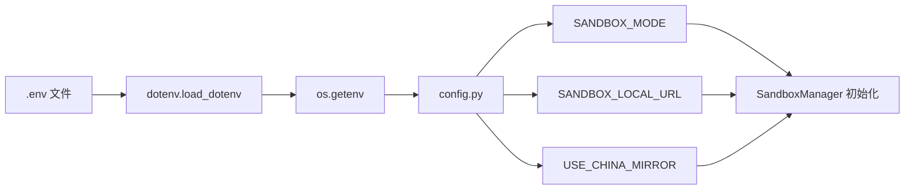

**图表来源**
- [config.py](file://localmanus-backend/core/config.py#L1-L27)
- [.env.example](file://localmanus-backend/.env.example#L5-L12)

**章节来源**
- [config.py](file://localmanus-backend/core/config.py#L23-L27)
- [.env.example](file://localmanus-backend/.env.example#L1-L12)

## 技能集成

### Web 项目生成技能

GenWebSkill 是沙箱系统集成的最佳实践示例，展示了如何在技能中使用新的沙箱 API。

#### 核心功能流程

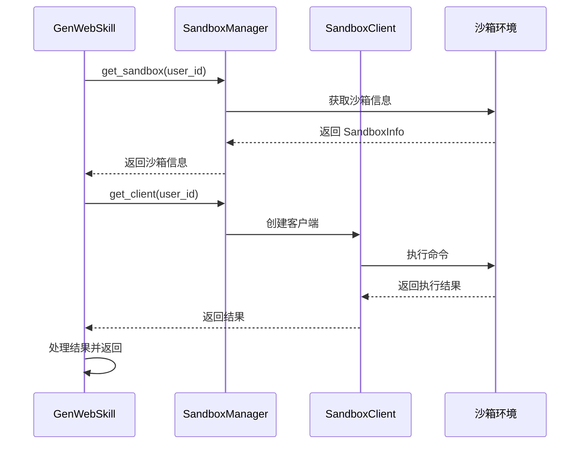

**图表来源**
- [gen_web.py](file://localmanus-backend/skills/gen-web/gen_web.py#L27-L76)

#### 文件操作示例

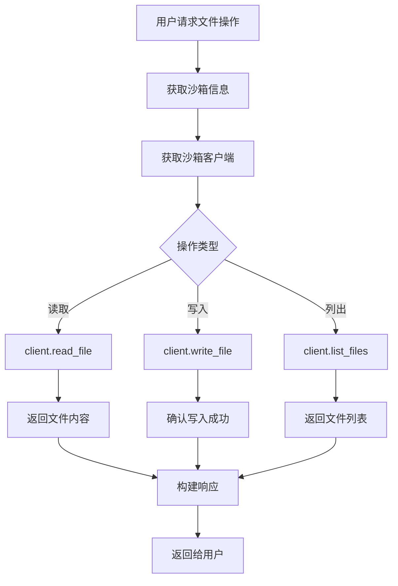

**图表来源**
- [gen_web.py](file://localmanus-backend/skills/gen-web/gen_web.py#L105-L172)

**章节来源**
- [gen_web.py](file://localmanus-backend/skills/gen-web/gen_web.py#L15-L254)

## 测试与验证

### 测试脚本使用

系统提供了完整的测试脚本来验证沙箱功能：

#### 本地模式测试

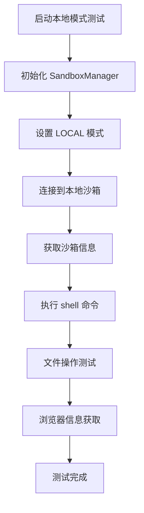

**图表来源**
- [test_sandbox.py](file://localmanus-backend/scripts/test_sandbox.py#L13-L84)

#### 在线模式测试

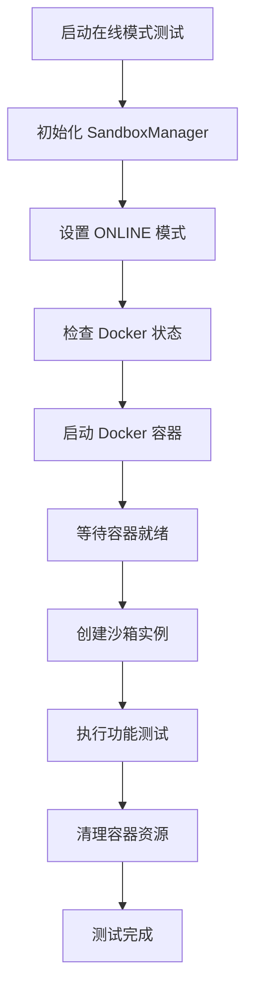

**图表来源**
- [test_sandbox.py](file://localmanus-backend/scripts/test_sandbox.py#L85-L141)

**章节来源**
- [test_sandbox.py](file://localmanus-backend/scripts/test_sandbox.py#L1-L191)

## 故障排除

### 常见问题及解决方案

#### 本地沙箱连接失败

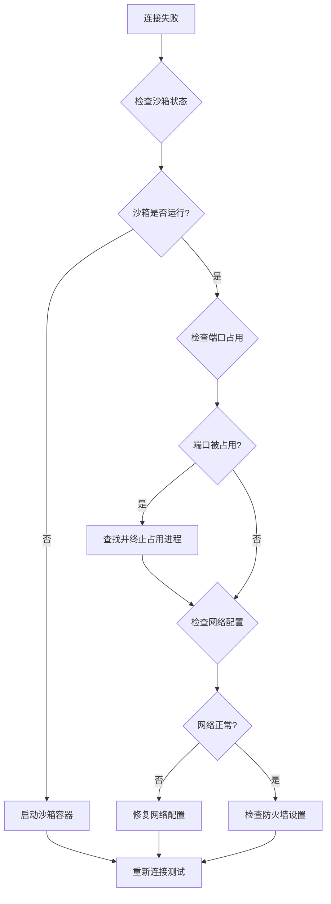

#### Docker 容器启动失败

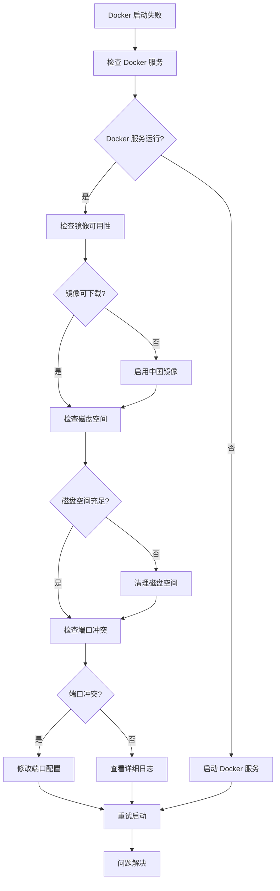

**章节来源**
- [FIRECRACKER_TROUBLESHOOTING.md](file://localmanus-backend/scripts/FIRECRACKER_TROUBLESHOOTING.md#L262-L292)

## 最佳实践

### 性能优化建议

1. **合理选择运行模式**
   - 开发阶段使用本地模式以获得最佳性能
   - 生产环境使用在线模式确保安全隔离

2. **资源管理**
   - 及时清理不再使用的沙箱容器
   - 监控内存和 CPU 使用情况

3. **错误处理**
   - 实现重试机制处理临时性故障
   - 记录详细的日志便于调试

### 安全考虑

1. **容器安全**
   - 使用适当的 seccomp 配置
   - 限制容器权限和资源使用

2. **数据保护**
   - 定期备份重要数据
   - 实施访问控制和审计日志

## 总结

LocalManus 项目的沙箱系统迁移是一个成功的现代化改造案例，展现了从传统虚拟机方案到现代容器化沙箱架构的完整转型过程。

### 主要成就

1. **架构升级** - 从 Firecracker VM 升级到 agent-infra/sandbox
2. **功能增强** - 添加浏览器自动化、VSCode、Jupyter 等高级功能
3. **易用性提升** - 简化的部署流程和配置管理
4. **灵活性改进** - 支持多种运行模式满足不同场景需求

### 未来展望

- 继续扩展沙箱功能，支持更多开发工具集成
- 优化性能表现，减少容器启动时间
- 增强监控和诊断能力
- 扩展多租户支持和资源隔离

通过这次迁移，LocalManus 项目为用户提供了更加丰富、灵活和可靠的开发体验，为未来的功能扩展奠定了坚实的基础。

**章节来源**
- [FIRECRACKER_TROUBLESHOOTING.md](file://localmanus-backend/scripts/FIRECRACKER_TROUBLESHOOTING.md#L247-L304)