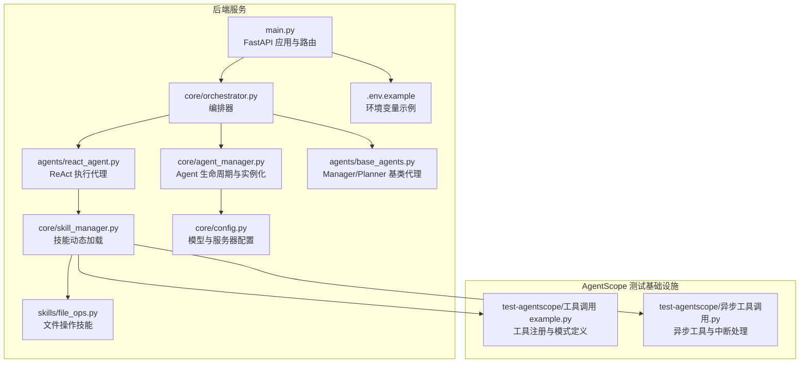
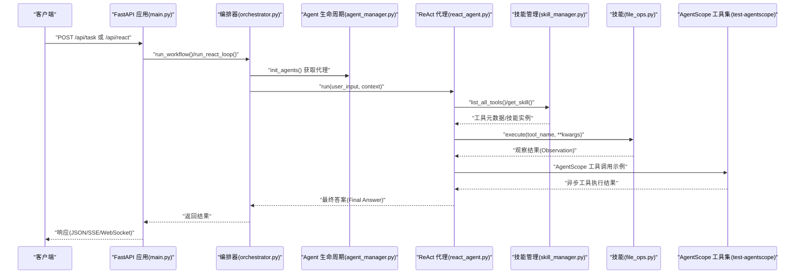
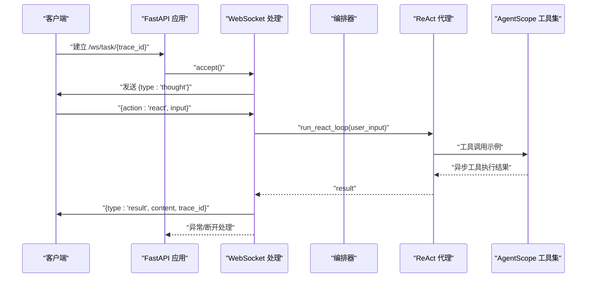
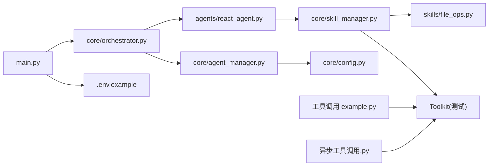

# 测试与调试

<cite>
**本文引用的文件**
- [main.py](file://localmanus-backend/main.py)
- [orchestrator.py](file://localmanus-backend/core/orchestrator.py)
- [agent_manager.py](file://localmanus-backend/core/agent_manager.py)
- [skill_manager.py](file://localmanus-backend/core/skill_manager.py)
- [react_agent.py](file://localmanus-backend/agents/react_agent.py)
- [base_agents.py](file://localmanus-backend/agents/base_agents.py)
- [file_ops.py](file://localmanus-backend/skills/file_ops.py)
- [config.py](file://localmanus-backend/core/config.py)
- [.env.example](file://localmanus-backend/.env.example)
- [requirements.txt](file://localmanus-backend/requirements.txt)
- [test_orchestration.py](file://localmanus-backend/scripts/test_orchestration.py)
- [docker-compose.yml](file://docker-compose.yml)
- [工具调用 example.py](file://test-agentscope/工具调用 example.py)
- [异步工具调用.py](file://test-agentscope/异步工具调用.py)
</cite>

## 目录
1. [简介](#简介)
2. [项目结构](#项目结构)
3. [核心组件](#核心组件)
4. [架构总览](#架构总览)
5. [详细组件分析](#详细组件分析)
6. [依赖分析](#依赖分析)
7. [性能考虑](#性能考虑)
8. [故障排查指南](#故障排查指南)
9. [结论](#结论)
10. [附录](#附录)

## 简介
本指南面向 LocalManus 后端服务，提供从单元测试、集成测试到调试与性能分析的完整实践建议。内容覆盖：
- 单元测试：pytest 使用、Mock 创建、测试数据准备
- 集成测试：API（SSE、POST、WebSocket）测试策略
- 端到端测试：结合前端 UI 的端到端验证思路
- 调试技巧：断点调试、日志分析、性能分析
- 测试覆盖率与持续集成：目标设定与流程自动化
- 常见问题诊断、性能瓶颈识别、测试环境与数据管理、回归测试策略
- **新增**：AgentScope 测试基础设施：工具注册、异步工具调用、中断处理

## 项目结构
后端采用 FastAPI 提供 REST 与 SSE 接口，并通过 Orchestrator 组织 ReActAgent、ManagerAgent、PlannerAgent 完成意图解析与任务规划；技能通过 SkillManager 动态加载，示例技能为文件操作。新增 AgentScope 测试基础设施用于演示工具注册和异步执行模式。

**更新** 新增 test-agentscope 目录，包含 AgentScope 工具调用示例和异步工具调用测试脚本

**图表来源**
- [main.py](file://localmanus-backend/main.py#L1-L95)
- [orchestrator.py](file://localmanus-backend/core/orchestrator.py#L1-L118)
- [agent_manager.py](file://localmanus-backend/core/agent_manager.py#L1-L44)
- [skill_manager.py](file://localmanus-backend/core/skill_manager.py#L1-L143)
- [react_agent.py](file://localmanus-backend/agents/react_agent.py#L1-L126)
- [base_agents.py](file://localmanus-backend/agents/base_agents.py#L1-L42)
- [file_ops.py](file://localmanus-backend/skills/file_ops.py#L1-L41)
- [config.py](file://localmanus-backend/core/config.py#L1-L21)
- [.env.example](file://localmanus-backend/.env.example#L1-L4)
- [工具调用 example.py](file://test-agentscope/工具调用 example.py#L1-L44)
- [异步工具调用.py](file://test-agentscope/异步工具调用.py#L1-L49)

**章节来源**
- [main.py](file://localmanus-backend/main.py#L1-L95)
- [requirements.txt](file://localmanus-backend/requirements.txt#L1-L14)
- [工具调用 example.py](file://test-agentscope/工具调用 example.py#L1-L44)
- [异步工具调用.py](file://test-agentscope/异步工具调用.py#L1-L49)

## 核心组件
- FastAPI 应用与路由：提供根路径、SSE 多轮对话、同步任务规划、同步 ReAct 循环、WebSocket 任务流。
- 编排器（Orchestrator）：负责会话历史管理、JSON 解析、工作流执行与结果生成。
- Agent 生命周期管理（AgentLifecycleManager）：初始化模型、格式化器、内存、技能管理器，并产出 Manager、Planner、ReAct 代理实例。
- 技能管理（SkillManager）：动态扫描 skills 目录，加载 BaseSkill 子类，暴露工具元数据。
- ReAct 代理：基于 AgentScope 的 ReActAgent 封装，支持工具调用与多轮推理。
- 文件操作技能（FileOps）：基础文件读写与目录列举。
- 配置与环境：dotenv 加载 OPENAI_API_KEY、OPENAI_API_BASE、MODEL_NAME；默认主机与端口。
- **新增**：AgentScope 测试基础设施：工具注册示例、异步工具调用、中断处理机制。

**更新** 新增 AgentScope 测试基础设施组件，支持工具注册和异步执行模式演示

**章节来源**
- [main.py](file://localmanus-backend/main.py#L1-L95)
- [orchestrator.py](file://localmanus-backend/core/orchestrator.py#L1-L118)
- [agent_manager.py](file://localmanus-backend/core/agent_manager.py#L1-L44)
- [skill_manager.py](file://localmanus-backend/core/skill_manager.py#L1-L143)
- [react_agent.py](file://localmanus-backend/agents/react_agent.py#L1-L126)
- [base_agents.py](file://localmanus-backend/agents/base_agents.py#L1-L42)
- [file_ops.py](file://localmanus-backend/skills/file_ops.py#L1-L41)
- [config.py](file://localmanus-backend/core/config.py#L1-L21)
- [.env.example](file://localmanus-backend/.env.example#L1-L4)
- [工具调用 example.py](file://test-agentscope/工具调用 example.py#L1-L44)
- [异步工具调用.py](file://test-agentscope/异步工具调用.py#L1-L49)

## 架构总览
下图展示从请求入口到代理执行与工具调用的关键交互，包括新增的 AgentScope 测试基础设施。

**更新** 新增 AgentScope 工具集交互流程，展示测试基础设施与主系统的集成

**图表来源**
- [main.py](file://localmanus-backend/main.py#L30-L56)
- [orchestrator.py](file://localmanus-backend/core/orchestrator.py#L65-L80)
- [agent_manager.py](file://localmanus-backend/core/agent_manager.py#L39-L44)
- [react_agent.py](file://localmanus-backend/agents/react_agent.py#L53-L126)
- [skill_manager.py](file://localmanus-backend/core/skill_manager.py#L72-L143)
- [file_ops.py](file://localmanus-backend/skills/file_ops.py#L9-L40)
- [工具调用 example.py](file://test-agentscope/工具调用 example.py#L28-L43)
- [异步工具调用.py](file://test-agentscope/异步工具调用.py#L29-L47)

## 详细组件分析

### 单元测试：pytest 与 Mock
- 测试范围
  - 编排器方法：chat_stream、run_workflow、JSON 提取逻辑
  - 代理封装：ReActAgent.run、工具解析与执行
  - 技能：FileOps 的读写与目录列举
  - 配置与环境：AgentLifecycleManager 初始化、环境变量加载
  - **新增**：AgentScope 工具注册：工具函数注册、模式定义、Schema 生成
- Mock 策略
  - 使用 unittest.mock 或 pytest-mock 模拟 AgentScope 的模型与格式化器，避免真实 LLM 调用
  - 对 SkillManager 的 get_skill 返回预设技能实例，或对具体工具方法进行 patch
  - 对 Orchestrator 的会话历史进行注入，验证多轮对话限制与状态
  - **新增**：Mock AgentScope Toolkit 的工具调用，模拟异步工具执行和中断处理
- 测试数据准备
  - 准备标准输入文本、预期 JSON 结构、工具参数字典
  - 使用临时文件路径与目录进行文件操作测试
  - 在测试前设置 OPENAI_API_KEY 为空或占位符以触发"模拟模式"分支
  - **新增**：准备 AgentScope 工具函数签名、Pydantic 模型定义、异步工具执行场景

**更新** 新增 AgentScope 工具注册和异步工具调用的测试策略

**章节来源**
- [orchestrator.py](file://localmanus-backend/core/orchestrator.py#L13-L80)
- [react_agent.py](file://localmanus-backend/agents/react_agent.py#L53-L126)
- [skill_manager.py](file://localmanus-backend/core/skill_manager.py#L42-L143)
- [file_ops.py](file://localmanus-backend/skills/file_ops.py#L4-L41)
- [agent_manager.py](file://localmanus-backend/core/agent_manager.py#L10-L34)
- [.env.example](file://localmanus-backend/.env.example#L1-L4)
- [工具调用 example.py](file://test-agentscope/工具调用 example.py#L9-L43)
- [异步工具调用.py](file://test-agentscope/异步工具调用.py#L11-L47)

### 集成测试：API 与 WebSocket
- SSE（多轮对话）
  - 路由：GET /api/chat
  - 断言：事件流中包含 status/content/error 分支，最大轮次限制生效
  - Mock：替换 Orchestrator.chat_stream 中的代理调用为固定响应
- 同步任务规划
  - 路由：POST /api/task
  - 断言：返回包含 trace_id、intent、plan 的结构，plan 步骤包含 skill、args、dependencies
  - Mock：在缺少 API Key 时返回预设计划结构
- 同步 ReAct 循环
  - 路由：POST /api/react
  - 断言：返回包含 result 的对象，ReAct 循环内工具调用可被 Mock
- WebSocket 任务流
  - 路由：/ws/task/{trace_id}
  - 断言：连接成功后发送 action=start/reaction，接收 thought/result 消息，断开处理
  - Mock：ReAct 执行阶段返回固定结果，避免真实 LLM 调用
- **新增**：AgentScope 工具调用集成测试
  - 测试工具注册流程：验证 Toolkit.register_tool_function 正常工作
  - 测试异步工具执行：验证非流式工具函数的异步调用和中断处理
  - 测试 Schema 生成：验证工具函数的 JSON Schema 正确生成

**更新** 新增 AgentScope 工具调用的集成测试策略

**更新** 新增 AgentScope 工具集交互序列图

**图表来源**
- [main.py](file://localmanus-backend/main.py#L58-L90)
- [orchestrator.py](file://localmanus-backend/core/orchestrator.py#L65-L80)
- [react_agent.py](file://localmanus-backend/agents/react_agent.py#L53-L126)
- [工具调用 example.py](file://test-agentscope/工具调用 example.py#L28-L43)
- [异步工具调用.py](file://test-agentscope/异步工具调用.py#L29-L47)

**章节来源**
- [main.py](file://localmanus-backend/main.py#L30-L56)
- [main.py](file://localmanus-backend/main.py#L58-L90)
- [test_orchestration.py](file://localmanus-backend/scripts/test_orchestration.py#L12-L56)
- [工具调用 example.py](file://test-agentscope/工具调用 example.py#L1-L44)
- [异步工具调用.py](file://test-agentscope/异步工具调用.py#L1-L49)

### 端到端测试：UI 集成
- 目标：验证前端发起请求、后端响应、WebSocket 实时更新、SSE 流式输出的完整链路
- 方法：使用 Playwright/Cypress 进行浏览器级 E2E，或使用 FastAPI TestClient 发起请求并校验响应
- 关键场景：
  - 输入自然语言，触发 /api/task 生成计划
  - 打开 /ws/task/{trace_id} 观察 thought/result
  - 订阅 /api/chat，验证多轮对话与轮次上限
  - **新增**：验证 AgentScope 工具调用在 UI 中的集成效果
- 数据与环境：
  - 使用 .env.example 设置 OPENAI_API_KEY、OPENAI_API_BASE、MODEL_NAME
  - docker-compose 可用于本地部署 UI 与后端服务镜像（当前仅 UI）
  - **新增**：确保 AgentScope 依赖正确安装，测试工具函数可用

**更新** 新增 AgentScope 工具调用在 UI 集成测试中的验证要点

**章节来源**
- [docker-compose.yml](file://docker-compose.yml#L1-L16)
- [.env.example](file://localmanus-backend/.env.example#L1-L4)
- [requirements.txt](file://localmanus-backend/requirements.txt#L3)

### 调试技巧与工具
- 断点调试
  - 使用 IDE 断点在 main.py 的路由处理、orchestrator 的 run_workflow、react_agent 的 run、skill 的 execute 处设置
  - 在 agent_manager 的 init_agents 中确认模型与格式化器已正确初始化
  - **新增**：在 AgentScope 工具注册和调用流程中设置断点，调试工具函数签名和 Schema 生成
- 日志分析
  - main.py 中已配置 INFO 级别日志；可在关键路径增加额外日志记录（如 trace_id、会话历史长度）
  - ReActAgent 内部也记录迭代响应与观察值，便于定位工具执行失败原因
  - **新增**：AgentScope 工具调用过程的日志记录，包括工具注册、执行状态、异步处理
- 性能分析
  - 使用 cProfile 或 py-spy 对长时间运行的任务（如 run_workflow、run_react_loop）进行采样
  - 关注 Orchestrator 会话存储增长、AgentScope 调用耗时、文件 I/O 操作
  - **新增**：AgentScope 工具执行性能分析，包括异步工具的中断处理开销

**更新** 新增 AgentScope 相关的调试技巧和性能分析要点

**章节来源**
- [main.py](file://localmanus-backend/main.py#L10-L12)
- [react_agent.py](file://localmanus-backend/agents/react_agent.py#L65-L126)
- [agent_manager.py](file://localmanus-backend/core/agent_manager.py#L12-L20)
- [工具调用 example.py](file://test-agentscope/工具调用 example.py#L1-L44)
- [异步工具调用.py](file://test-agentscope/异步工具调用.py#L1-L49)

### 测试覆盖率与持续集成
- 覆盖率目标建议
  - 关键模块：orchestrator.py ≥ 80%，react_agent.py ≥ 75%，skill_manager.py ≥ 70%
  - 工具函数：file_ops.py ≥ 90%，agent_manager.py ≥ 60%
  - **新增**：AgentScope 集成：工具注册测试 ≥ 85%，异步工具测试 ≥ 80%
- CI 流程建议
  - 安装依赖：pip install -r requirements.txt
  - 环境准备：复制 .env.example 并设置占位 API Key
  - 运行测试：pytest --cov=localmanus_backend --cov-report=xml
  - **新增**：AgentScope 测试执行，确保工具注册和异步调用功能正常
  - 上传覆盖率：codecov/github actions
- 自动化脚本
  - 使用 GitHub Actions 或 GitLab CI，分阶段执行：安装 → 环境准备 → 单元测试 → 集成测试 → 覆盖率上报
  - **新增**：AgentScope 测试专用流水线，独立验证工具集功能

**更新** 新增 AgentScope 相关的覆盖率目标和 CI 流程建议

**章节来源**
- [requirements.txt](file://localmanus-backend/requirements.txt#L1-L14)
- [config.py](file://localmanus-backend/core/config.py#L1-L21)
- [工具调用 example.py](file://test-agentscope/工具调用 example.py#L1-L44)
- [异步工具调用.py](file://test-agentscope/异步工具调用.py#L1-L49)

### 测试环境搭建与数据管理
- 环境变量
  - 复制 .env.example 为 .env，设置 OPENAI_API_KEY、OPENAI_API_BASE、MODEL_NAME
  - 若无真实密钥，保持占位符以启用"模拟模式"
- 依赖安装
  - pip install -r requirements.txt
  - **新增**：确保 AgentScope 版本兼容性，测试工具函数注册和异步调用
- 技能目录
  - skills 目录下新增技能需继承 BaseSkill 并实现工具方法，SkillManager 将自动发现
  - **新增**：AgentScope 工具函数可直接作为 .py 文件注册到 Toolkit
- 临时数据
  - 使用临时文件与目录进行文件操作测试，确保测试结束后清理
  - **新增**：AgentScope 工具测试数据的准备和清理

**更新** 新增 AgentScope 相关的环境搭建和数据管理要求

**章节来源**
- [.env.example](file://localmanus-backend/.env.example#L1-L4)
- [skill_manager.py](file://localmanus-backend/core/skill_manager.py#L48-L143)
- [file_ops.py](file://localmanus-backend/skills/file_ops.py#L9-L40)
- [requirements.txt](file://localmanus-backend/requirements.txt#L3)

### 回归测试策略
- 版本变更触发
  - 编排器、代理封装、技能接口变更时，优先回归对应单元与集成测试
  - **新增**：AgentScope 版本升级或工具注册机制变更时，执行专门的回归测试
- 兼容性检查
  - 保持 /api/chat、/api/task、/api/react、/ws/task/{trace_id} 的行为稳定
  - **新增**：确保 AgentScope 工具注册和异步调用功能向后兼容
- 自动化回归
  - 将关键 E2E 场景纳入 nightly job，监控失败趋势
  - **新增**：AgentScope 工具功能的自动化回归测试，定期验证工具注册和执行

**更新** 新增 AgentScope 相关的回归测试策略

## 依赖分析
- 组件耦合
  - main.py 依赖 Orchestrator；Orchestrator 依赖 AgentLifecycleManager 与 ReActAgent
  - ReActAgent 依赖 SkillManager；SkillManager 依赖 skills 目录下的具体技能
  - **新增**：AgentScope 测试基础设施独立于主系统，但与 SkillManager 的工具注册机制集成
- 外部依赖
  - FastAPI、Uvicorn、AgentScope、Pydantic、Websockets、python-dotenv
  - **新增**：AgentScope 1.0+ 版本，包含 OpenAIChatModel、OpenAIChatFormatter、Toolkit 等组件
- 潜在循环依赖
  - 当前未发现直接循环导入；注意在 skills 目录中避免相互引用
  - **新增**：AgentScope 工具函数不应依赖主系统模块，避免循环导入

**更新** 新增 AgentScope 测试基础设施与主系统的依赖关系图

**图表来源**
- [main.py](file://localmanus-backend/main.py#L1-L15)
- [orchestrator.py](file://localmanus-backend/core/orchestrator.py#L1-L12)
- [agent_manager.py](file://localmanus-backend/core/agent_manager.py#L1-L34)
- [react_agent.py](file://localmanus-backend/agents/react_agent.py#L1-L44)
- [skill_manager.py](file://localmanus-backend/core/skill_manager.py#L1-L46)
- [file_ops.py](file://localmanus-backend/skills/file_ops.py#L1-L4)
- [config.py](file://localmanus-backend/core/config.py#L1-L21)
- [.env.example](file://localmanus-backend/.env.example#L1-L4)
- [工具调用 example.py](file://test-agentscope/工具调用 example.py#L1-L44)
- [异步工具调用.py](file://test-agentscope/异步工具调用.py#L1-L49)

**章节来源**
- [requirements.txt](file://localmanus-backend/requirements.txt#L1-L14)

## 性能考虑
- 会话历史管理
  - Orchestrator 对会话历史有轮次上限控制，避免内存无限增长
- 工具调用与 I/O
  - 文件操作为阻塞 I/O，建议在高并发场景下限制同时打开的文件数量或引入异步文件库
  - **新增**：AgentScope 工具调用的异步执行优化，避免阻塞主线程
- 代理调用
  - AgentScope 的模型调用可能成为瓶颈，建议缓存常用提示词、减少不必要的上下文拼接
  - **新增**：工具函数的异步执行和中断处理，提高长任务的响应性
- WebSocket 与 SSE
  - 注意消息队列与背压处理，避免大量并发连接导致内存占用过高
  - **新增**：AgentScope 工具调用的流式响应处理，优化实时通信性能
- **新增**：AgentScope 工具注册性能
  - 工具函数扫描和注册过程的时间复杂度
  - 工具 Schema 生成的性能影响
  - 异步工具执行的内存占用和资源管理

**更新** 新增 AgentScope 相关的性能考虑和优化建议

**章节来源**
- [orchestrator.py](file://localmanus-backend/core/orchestrator.py#L17-L25)
- [file_ops.py](file://localmanus-backend/skills/file_ops.py#L9-L40)
- [skill_manager.py](file://localmanus-backend/core/skill_manager.py#L90-L143)
- [react_agent.py](file://localmanus-backend/agents/react_agent.py#L53-L126)
- [工具调用 example.py](file://test-agentscope/工具调用 example.py#L28-L43)
- [异步工具调用.py](file://test-agentscope/异步工具调用.py#L11-L47)

## 故障排查指南
- 常见问题
  - 无 API Key：触发"模拟模式"，返回预设计划结构
  - WebSocket 断开：检查客户端是否正确发送 action 与接收消息
  - 工具执行失败：查看 ReActAgent 的观察值与错误日志
  - 会话超限：确认最大轮次限制与历史长度
  - **新增**：AgentScope 工具注册失败：检查工具函数签名、Pydantic 模型定义、Schema 生成
  - **新增**：异步工具执行异常：检查工具函数的异步实现、取消信号处理、中断标志
- 排查步骤
  - 启用 INFO 日志，复现问题并收集 trace_id
  - 使用断点定位 Orchestrator.chat_stream、ReActAgent.run、SkillManager.get_skill
  - 检查 .env 中 OPENAI_API_KEY、OPENAI_API_BASE、MODEL_NAME 是否正确
  - **新增**：验证 AgentScope 工具函数的注册状态和执行日志
  - **新增**：检查异步工具的执行上下文和资源清理
- 性能瓶颈识别
  - 使用性能分析工具定位慢点，关注代理调用、工具执行、文件 I/O
  - 对高频调用的工具进行缓存或批处理
  - **新增**：AgentScope 工具调用的性能分析，包括注册开销、执行延迟、内存泄漏
- **新增**：AgentScope 工具调试
  - 工具函数签名验证：确保参数类型和默认值正确
  - Schema 生成问题：检查 Pydantic 模型的字段定义和描述
  - 异步执行问题：验证 await 语句和异常处理
  - 中断处理：确保工具函数能够正确响应取消信号

**更新** 新增 AgentScope 相关的故障排查指南和调试步骤

**章节来源**
- [test_orchestration.py](file://localmanus-backend/scripts/test_orchestration.py#L26-L50)
- [main.py](file://localmanus-backend/main.py#L89-L90)
- [react_agent.py](file://localmanus-backend/agents/react_agent.py#L98-L126)
- [orchestrator.py](file://localmanus-backend/core/orchestrator.py#L23-L25)
- [.env.example](file://localmanus-backend/.env.example#L1-L4)
- [skill_manager.py](file://localmanus-backend/core/skill_manager.py#L90-L143)
- [工具调用 example.py](file://test-agentscope/工具调用 example.py#L1-L44)
- [异步工具调用.py](file://test-agentscope/异步工具调用.py#L1-L49)

## 结论
通过明确的单元与集成测试策略、完善的调试与性能分析手段、以及可落地的 CI/CD 流程，LocalManus 后端可以在功能演进的同时保持稳定性与可维护性。新增的 AgentScope 测试基础设施为工具注册和异步执行提供了完整的验证框架。建议优先完善关键模块的覆盖率，强化 WebSocket 与 SSE 的端到端验证，并在持续集成中加入性能回归检查。AgentScope 集成的测试和调试策略将确保工具系统的稳定性和可靠性。

## 附录
- 快速开始（测试）
  - 安装依赖：pip install -r requirements.txt
  - 准备环境：复制 .env.example 并设置占位 API Key
  - 运行单测：pytest tests/（若存在 tests 目录），或针对具体模块运行
  - 运行演示脚本：python scripts/test_orchestration.py
  - **新增**：运行 AgentScope 测试：python test-agentscope/工具调用 example.py 和 python test-agentscope/异步工具调用.py
- 快速开始（E2E）
  - 启动 UI：docker-compose up ui
  - 启动后端：uvicorn main:app --host 0.0.0.0 --port 8000
  - 使用浏览器访问前端页面，触发请求并观察 WebSocket/SSE 响应
  - **新增**：验证 AgentScope 工具在 UI 中的显示和调用效果
- **新增**：AgentScope 测试基础设施使用指南
  - 工具注册示例：参考 test-agentscope/工具调用 example.py
  - 异步工具调用：参考 test-agentscope/异步工具调用.py
  - 工具 Schema 生成：验证 JSON Schema 的正确性和完整性
  - 中断处理测试：验证异步工具的取消和清理机制

**更新** 新增 AgentScope 测试基础设施的使用指南和示例

**章节来源**
- [requirements.txt](file://localmanus-backend/requirements.txt#L1-L14)
- [test_orchestration.py](file://localmanus-backend/scripts/test_orchestration.py#L55-L56)
- [docker-compose.yml](file://docker-compose.yml#L1-L16)
- [工具调用 example.py](file://test-agentscope/工具调用 example.py#L1-L44)
- [异步工具调用.py](file://test-agentscope/异步工具调用.py#L1-L49)