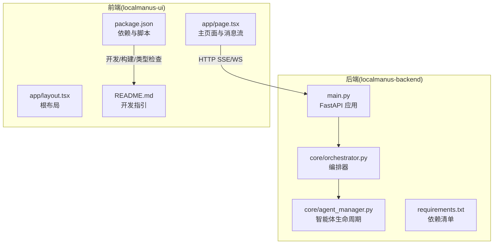
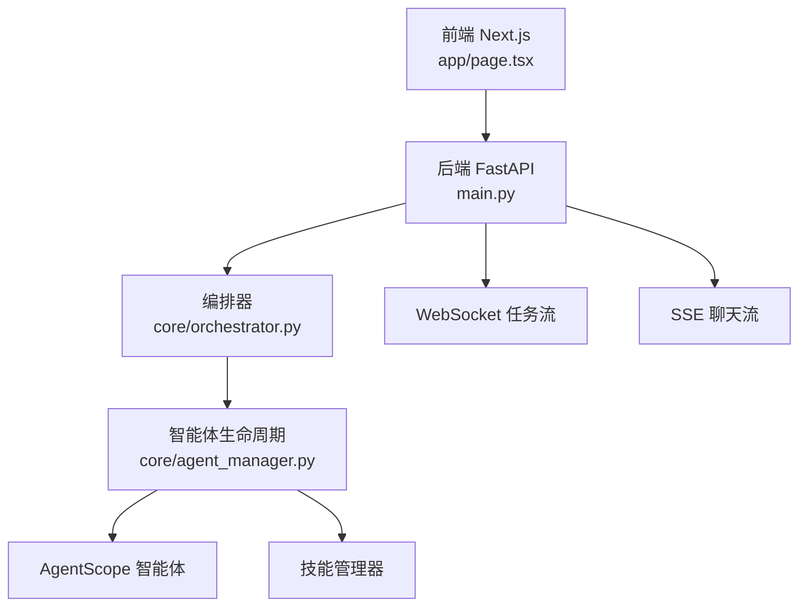
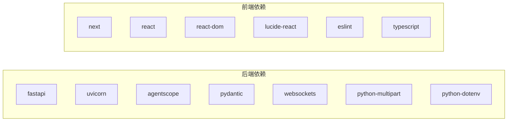

# 贡献流程与协作

<cite>
**本文引用的文件**
- [localmanus_architecture.md](file://localmanus_architecture.md)
- [localmanus_prd.md](file://localmanus_prd.md)
- [localmanus_skills_roadmap.md](file://localmanus_skills_roadmap.md)
- [.windsurfrules](file://.windsurfrules)
- [CLAUDE.md](file://CLAUDE.md)
- [localmanus-backend/main.py](file://localmanus-backend/main.py)
- [localmanus-backend/core/orchestrator.py](file://localmanus-backend/core/orchestrator.py)
- [localmanus-backend/core/agent_manager.py](file://localmanus-backend/core/agent_manager.py)
- [localmanus-backend/requirements.txt](file://localmanus-backend/requirements.txt)
- [localmanus-ui/README.md](file://localmanus-ui/README.md)
- [localmanus-ui/package.json](file://localmanus-ui/package.json)
- [localmanus-ui/app/layout.tsx](file://localmanus-ui/app/layout.tsx)
- [localmanus-ui/app/page.tsx](file://localmanus-ui/app/page.tsx)
</cite>

## 目录
1. [引言](#引言)
2. [项目结构](#项目结构)
3. [核心组件](#核心组件)
4. [架构总览](#架构总览)
5. [详细组件分析](#详细组件分析)
6. [依赖关系分析](#依赖关系分析)
7. [性能考量](#性能考量)
8. [故障排查指南](#故障排查指南)
9. [结论](#结论)
10. [附录](#附录)

## 引言
本指南面向 LocalManus 项目的贡献者，提供从入门到协作的全流程规范，包括：
- Fork 仓库、创建分支、提交代码、发起 Pull Request 的标准流程
- 代码审查流程、反馈处理与修改迭代
- 问题报告模板、功能请求流程、Bug 修复流程
- 社区行为准则、沟通规范、决策流程
- 版本发布流程、变更日志维护、文档更新要求
- 新贡献者培训、导师制度、知识分享机制

LocalManus 是一个基于 AgentScope 的动态多智能体系统，结合 Firecracker 沙箱实现安全可控的自动化执行。前端采用 Next.js，后端基于 FastAPI 提供实时流式接口。

## 项目结构
项目采用前后端分离的双仓库结构：
- localmanus-backend：后端 API 网关与编排核心，提供 SSE/WebSocket 接口与 ReAct 工作流
- localmanus-ui：前端应用，负责用户交互、消息流渲染与工具调用展示
- 文档与规则：架构设计、PRD、技能路线图、设计规则等

**图示来源**
- [localmanus-backend/main.py](file://localmanus-backend/main.py#L1-L98)
- [localmanus-backend/core/orchestrator.py](file://localmanus-backend/core/orchestrator.py#L1-L119)
- [localmanus-backend/core/agent_manager.py](file://localmanus-backend/core/agent_manager.py#L1-L44)
- [localmanus-backend/requirements.txt](file://localmanus-backend/requirements.txt#L1-L8)
- [localmanus-ui/app/layout.tsx](file://localmanus-ui/app/layout.tsx#L1-L20)
- [localmanus-ui/app/page.tsx](file://localmanus-ui/app/page.tsx#L1-L285)
- [localmanus-ui/package.json](file://localmanus-ui/package.json#L1-L26)
- [localmanus-ui/README.md](file://localmanus-ui/README.md#L1-L37)

**章节来源**
- [localmanus-backend/main.py](file://localmanus-backend/main.py#L1-L98)
- [localmanus-ui/README.md](file://localmanus-ui/README.md#L1-L37)

## 核心组件
- 后端 API 网关：提供根路径、SSE 聊天、同步任务规划、ReAct 循环与 WebSocket 任务流
- 编排器：负责会话管理、历史记录、JSON 提取与工作流规划
- 智能体生命周期管理：初始化 AgentScope、模型、格式化器、内存与技能管理器，并实例化 Manager、Planner、ReActAgent
- 前端页面：负责消息列表渲染、SSE 流式接收、ReAct 思考/工具调用/观察结果的可视化

**章节来源**
- [localmanus-backend/main.py](file://localmanus-backend/main.py#L29-L98)
- [localmanus-backend/core/orchestrator.py](file://localmanus-backend/core/orchestrator.py#L11-L119)
- [localmanus-backend/core/agent_manager.py](file://localmanus-backend/core/agent_manager.py#L10-L44)
- [localmanus-ui/app/page.tsx](file://localmanus-ui/app/page.tsx#L31-L159)

## 架构总览
LocalManus 采用“前端 Next.js + 后端 FastAPI + AgentScope 编排 + Firecracker 沙箱”的整体架构。前端通过 SSE/WS 与后端交互，后端通过编排器协调智能体完成任务规划与执行。

**图示来源**
- [localmanus-backend/main.py](file://localmanus-backend/main.py#L1-L98)
- [localmanus-backend/core/orchestrator.py](file://localmanus-backend/core/orchestrator.py#L1-L119)
- [localmanus-backend/core/agent_manager.py](file://localmanus-backend/core/agent_manager.py#L1-L44)
- [localmanus-ui/app/page.tsx](file://localmanus-ui/app/page.tsx#L31-L159)

## 详细组件分析

### 贡献入门流程
- Fork 仓库：在 GitHub 上 Fork 主仓库到个人账户
- 创建分支：基于 develop 或 main 分支新建特性分支，命名建议使用 feat/fix/docs/chore/infra 前缀
- 提交代码：遵循代码风格与提交信息规范，单次提交聚焦单一变更
- 发起 PR：填写 PR 模板，关联 Issue，确保 CI 通过与审查通过

### 代码审查流程
- 自检：本地运行 lint、类型检查与单元测试（如存在）
- 提交 PR：在 PR 描述中说明背景、变更范围、测试要点与风险
- 审查：至少一名维护者审查，关注可读性、健壮性、性能与安全性
- 反馈处理：逐条回复 review 意见，必要时补充测试与文档
- 合并：审查通过后由维护者合并，合并前确保分支最新且无冲突

### 问题报告与功能请求
- Bug 报告模板：包含环境信息、复现步骤、期望行为、实际行为、日志片段
- 功能请求模板：描述场景、收益、可行性评估、与现有功能的关系
- 优先级划分：P0/P1/P2/P3，由维护团队评估与分配

### Bug 修复流程
- 确认问题：复现并定位问题根因
- 设计修复：给出最小可行方案，避免引入新问题
- 实施与测试：编写/更新测试用例，验证修复
- 提交与回归：提交 PR 并进行回归测试

### 社区行为准则与沟通规范
- 行为准则：尊重、包容、建设性反馈，禁止骚扰与歧视
- 沟通渠道：Issue/PR/讨论区，保持公开透明
- 决策流程：简单共识（P0/P1）即时决策，重大变更（P2/P3）社区讨论与投票

### 版本发布与变更日志
- 版本号：遵循语义化版本，变更影响按 MAJOR/MINOR/PATCH 影响
- 发布流程：完成 PR 合并、更新 CHANGELOG、打 Tag、发布 Release Notes
- 变更日志：按类别汇总新增、修复、改进、废弃与迁移说明

### 文档更新要求
- 新功能：随 PR 附带文档更新，确保 README、API 文档与示例一致
- 架构变更：更新架构图与技术栈说明
- 示例与教程：提供最小可运行示例与常见问题解答

### 新贡献者培训与导师制度
- 培训内容：项目背景、技术栈、贡献流程、代码规范与审查要点
- 导师职责：协助新贡献者理解模块职责、代码结构与最佳实践
- 知识分享：定期组织技术分享、Review 互评与文档共建

**章节来源**
- [localmanus_backend_main.py](file://localmanus-backend/main.py#L29-L98)
- [localmanus_backend_orchestrator_py](file://localmanus-backend/core/orchestrator.py#L16-L81)
- [localmanus_backend_agent_manager_py](file://localmanus-backend/core/agent_manager.py#L39-L44)
- [localmanus_ui_page_tsx](file://localmanus-ui/app/page.tsx#L31-L159)

## 依赖关系分析
后端依赖 FastAPI、Uvicorn、AgentScope、Pydantic、WebSockets、Python-Multipart、python-dotenv；前端依赖 Next.js、React、Lucide React、ESLint 与 TypeScript。

**图示来源**
- [localmanus-backend/requirements.txt](file://localmanus-backend/requirements.txt#L1-L8)
- [localmanus-ui/package.json](file://localmanus-ui/package.json#L11-L24)

**章节来源**
- [localmanus-backend/requirements.txt](file://localmanus-backend/requirements.txt#L1-L8)
- [localmanus-ui/package.json](file://localmanus-ui/package.json#L1-L26)

## 性能考量
- 后端
  - SSE/WS：前端按行解析 data: 块，后端按流式 JSON 块推送，注意缓冲与超时
  - 会话上限：编排器限制最大轮次，避免无限增长的历史记录
  - 模型调用：AgentScope 初始化时指定模型与格式化器，减少重复初始化开销
- 前端
  - 消息增量渲染：按 is_chunk 字段增量更新思考/结果/观察，提升交互流畅度
  - 自动滚动与空闲状态：消息变化时自动滚动到底部，加载状态合理提示

**章节来源**
- [localmanus-backend/core/orchestrator.py](file://localmanus-backend/core/orchestrator.py#L16-L64)
- [localmanus-ui/app/page.tsx](file://localmanus-ui/app/page.tsx#L64-L151)

## 故障排查指南
- 后端
  - 端口占用：确认 8000 端口未被占用，或在运行命令中调整端口
  - CORS：前端与后端跨域已放开，若出现异常需检查代理与网络策略
  - 日志：后端使用 INFO 级别日志，可在异常时查看错误堆栈
- 前端
  - 开发服务器：参考 README 的开发命令，确保依赖安装完成
  - SSE/WS：确认后端接口可用，浏览器控制台查看网络与事件流
  - 类型与 ESLint：遵循 package.json 中的脚本与配置，修复类型与规则警告

**章节来源**
- [localmanus-backend/main.py](file://localmanus-backend/main.py#L20-L27)
- [localmanus-ui/README.md](file://localmanus-ui/README.md#L5-L15)

## 结论
本指南为 LocalManus 贡献者提供了从入门到协作的完整规范。建议贡献者在提交前充分阅读相关模块文档与代码注释，遵循审查流程与行为准则，共同维护高质量、可持续演进的开源生态。

## 附录
- 设计规则与样式参考：可参考 .windsurfrules 与 CLAUDE.md 中的设计与主题约定，用于前端组件与交互的一致性
- 产品需求与技能路线：PRD 与技能路线图为功能扩展与评审提供依据

**章节来源**
- [.windsurfrules](file://.windsurfrules#L1-L383)
- [CLAUDE.md](file://CLAUDE.md#L1-L383)
- [localmanus_prd.md](file://localmanus_prd.md#L1-L76)
- [localmanus_skills_roadmap.md](file://localmanus_skills_roadmap.md#L1-L62)