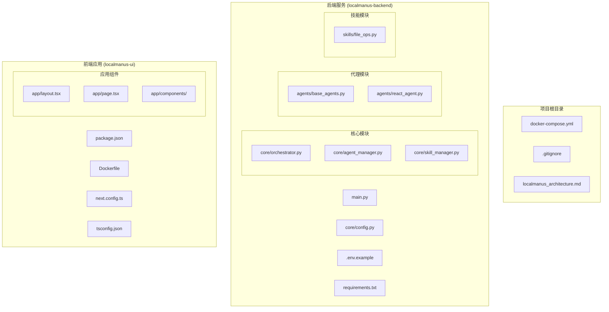
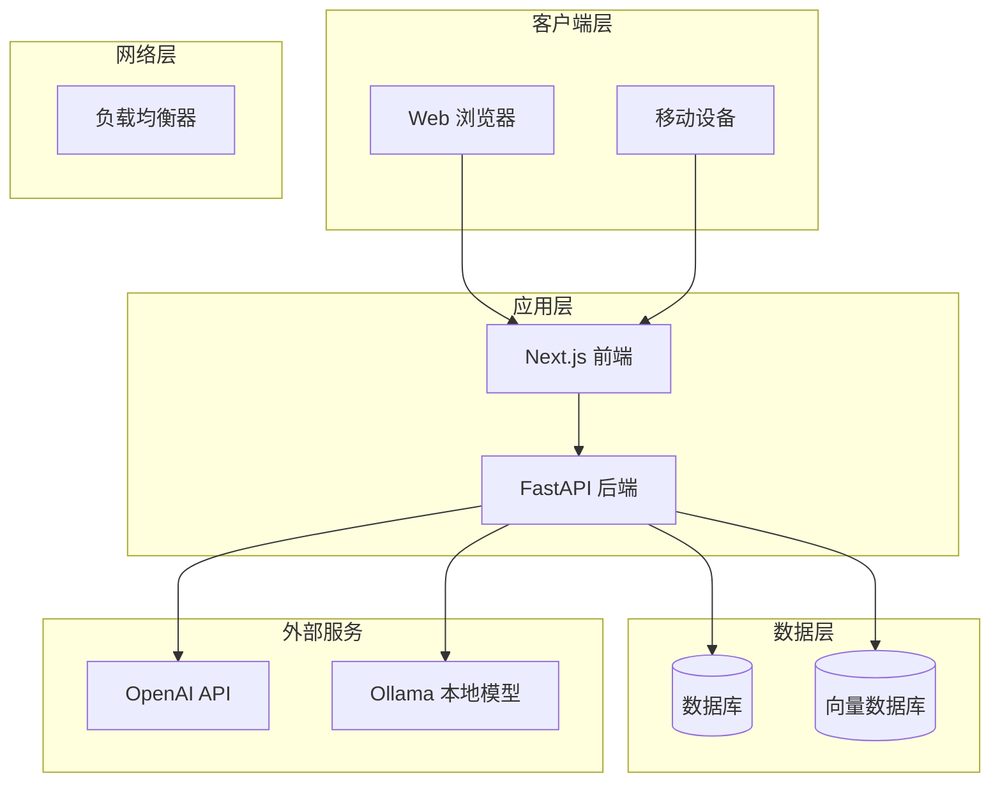
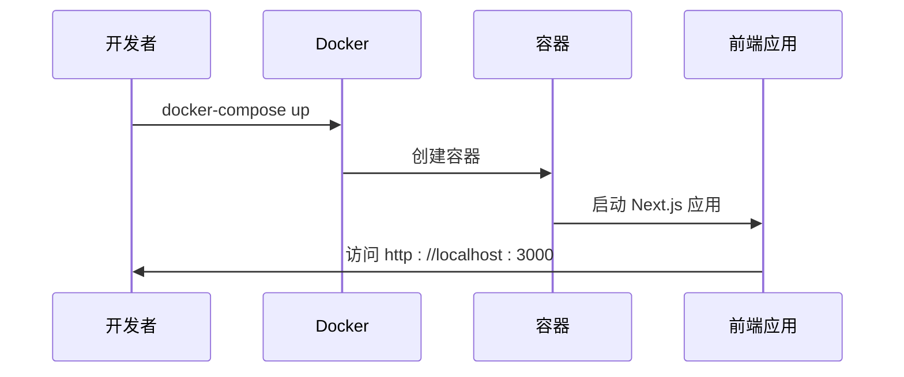
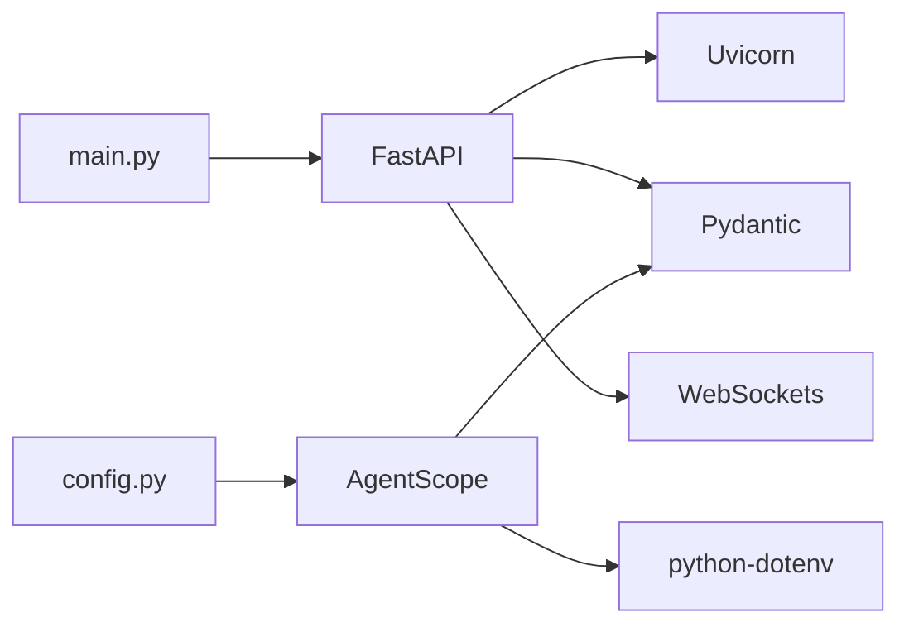

# 项目设置与环境配置

<cite>
**本文档引用的文件**
- [docker-compose.yml](file://docker-compose.yml)
- [Dockerfile](file://localmanus-ui/Dockerfile)
- [.env.example](file://localmanus-backend/.env.example)
- [requirements.txt](file://localmanus-backend/requirements.txt)
- [package.json](file://localmanus-ui/package.json)
- [main.py](file://localmanus-backend/main.py)
- [config.py](file://localmanus-backend/core/config.py)
- [next.config.ts](file://localmanus-ui/next.config.ts)
- [tsconfig.json](file://localmanus-ui/tsconfig.json)
- [layout.tsx](file://localmanus-ui/app/layout.tsx)
- [eslint.config.mjs](file://localmanus-ui/eslint.config.mjs)
- [next-env.d.ts](file://localmanus-ui/next-env.d.ts)
</cite>

## 目录
1. [简介](#简介)
2. [项目结构](#项目结构)
3. [核心组件](#核心组件)
4. [架构概览](#架构概览)
5. [详细组件分析](#详细组件分析)
6. [依赖分析](#依赖分析)
7. [性能考虑](#性能考虑)
8. [故障排除指南](#故障排除指南)
9. [结论](#结论)
10. [附录](#附录)

## 简介

LocalManus 是一个基于 FastAPI 和 Next.js 构建的多模态 AI Agent 平台。该项目采用前后端分离架构，后端提供 API 网关服务，前端提供用户界面。本指南将详细介绍完整的开发环境搭建步骤，包括 Python 环境配置、Node.js 环境配置、Docker 容器化部署以及 IDE 配置建议。

## 项目结构

LocalManus 项目采用模块化组织方式，主要包含以下核心目录：



**图表来源**
- [docker-compose.yml](file://docker-compose.yml#L1-L16)
- [main.py](file://localmanus-backend/main.py#L1-L95)
- [package.json](file://localmanus-ui/package.json#L1-L26)

**章节来源**
- [docker-compose.yml](file://docker-compose.yml#L1-L16)
- [main.py](file://localmanus-backend/main.py#L1-L95)
- [package.json](file://localmanus-ui/package.json#L1-L26)

## 核心组件

### 后端服务 (FastAPI)

后端服务基于 FastAPI 框架构建，提供以下核心功能：
- RESTful API 接口
- WebSocket 实时通信
- Server-Sent Events (SSE) 流式响应
- CORS 跨域支持

### 前端应用 (Next.js)

前端应用采用 Next.js 16.1.6 构建，使用 TypeScript 和 React 19.2.3：
- 单页应用架构
- 组件化设计模式
- TypeScript 类型安全
- ESLint 代码质量保证

### 配置管理

系统采用分层配置策略：
- 环境变量配置 (.env)
- Python 配置文件
- TypeScript 配置
- Docker 容器配置

**章节来源**
- [main.py](file://localmanus-backend/main.py#L1-L95)
- [config.py](file://localmanus-backend/core/config.py#L1-L21)
- [package.json](file://localmanus-ui/package.json#L1-L26)

## 架构概览

LocalManus 采用微服务架构，通过 Docker Compose 进行容器编排：



**图表来源**
- [docker-compose.yml](file://docker-compose.yml#L1-L16)
- [.env.example](file://localmanus-backend/.env.example#L1-L4)
- [config.py](file://localmanus-backend/core/config.py#L1-L21)

## 详细组件分析

### 环境变量配置

系统使用环境变量进行配置管理，关键配置项包括：

| 配置项 | 默认值 | 用途 | 必需性 |
|--------|--------|------|--------|
| OPENAI_API_KEY | your_api_key_here | OpenAI API 密钥 | 可选 |
| OPENAI_API_BASE | http://localhost:11434/v1 | API 基础地址 | 可选 |
| MODEL_NAME | gpt-4 | 模型名称 | 可选 |
| HOST | 0.0.0.0 | 服务器主机 | 必需 |
| PORT | 8000 | 服务器端口 | 必需 |

**章节来源**
- [.env.example](file://localmanus-backend/.env.example#L1-L4)
- [config.py](file://localmanus-backend/core/config.py#L18-L21)

### Docker 容器配置

Docker Compose 配置定义了前端服务的基本部署参数：



**图表来源**
- [docker-compose.yml](file://docker-compose.yml#L1-L16)
- [Dockerfile](file://localmanus-ui/Dockerfile#L1-L32)

**章节来源**
- [docker-compose.yml](file://docker-compose.yml#L1-L16)
- [Dockerfile](file://localmanus-ui/Dockerfile#L1-L32)

### API 端点设计

后端提供多个 API 端点支持不同的交互模式：

```mermaid
flowchart TD
Start[请求进入] --> Route{路由选择}
Route --> |GET /| Health[健康检查]
Route --> |GET /api/chat| SSE[SSE 流式聊天]
Route --> |POST /api/task| Task[任务规划]
Route --> |POST /api/react| React[ReAct 循环]
Route --> |WS /ws/task/{trace_id}| WS[WebSocket 通信]
SSE --> Stream[流式响应]
Task --> Plan[生成计划]
React --> Loop[执行循环]
WS --> Realtime[实时通信]
Stream --> End[响应完成]
Plan --> End
Loop --> End
Realtime --> End
```

**图表来源**
- [main.py](file://localmanus-backend/main.py#L26-L56)

**章节来源**
- [main.py](file://localmanus-backend/main.py#L26-L56)

## 依赖分析

### Python 依赖关系

后端服务的核心依赖包括：



**图表来源**
- [requirements.txt](file://localmanus-backend/requirements.txt#L1-L8)
- [main.py](file://localmanus-backend/main.py#L1-L95)
- [config.py](file://localmanus-backend/core/config.py#L1-L21)

### Node.js 依赖关系

前端应用的依赖层次结构：

```mermaid
graph TB
Next[Next.js 16.1.6] --> React[React 19.2.3]
Next --> ReactDOM[React DOM 19.2.3]
Types[TypeScript 类型] --> NodeTypes[@types/node]
Types --> ReactTypes[@types/react]
DevTools[开发工具] --> ESLint[ESLint 9]
DevTools --> TS[TypeScript 5]
Components[Lucide React] --> Icons[图标组件]
MainApp[main.py] --> Next
```

**图表来源**
- [package.json](file://localmanus-ui/package.json#L11-L24)
- [main.py](file://localmanus-backend/main.py#L1-L95)

**章节来源**
- [requirements.txt](file://localmanus-backend/requirements.txt#L1-L8)
- [package.json](file://localmanus-ui/package.json#L1-L26)

## 性能考虑

### 缓存策略

系统采用多层缓存机制：
- 前端组件缓存
- API 响应缓存
- 数据库查询缓存

### 连接池管理

后端服务配置了合理的连接池参数：
- 最大连接数限制
- 连接超时处理
- 自动重连机制

### 资源优化

- Docker 多阶段构建减少镜像大小
- TypeScript 编译优化
- ESLint 代码质量检查

## 故障排除指南

### 常见环境问题

#### Python 环境问题

**问题**: Python 版本不兼容
**解决方案**: 确保使用 Python 3.8+ 版本

**问题**: 依赖包安装失败
**解决方案**: 
1. 清理 pip 缓存
2. 使用国内镜像源
3. 检查网络连接

#### Node.js 环境问题

**问题**: npm/yarn 安装缓慢
**解决方案**:
1. 使用 npm 或 yarn 替代
2. 配置 npm registry
3. 清理缓存

#### Docker 部署问题

**问题**: 容器启动失败
**解决方案**:
1. 检查端口占用 (3000)
2. 验证 Docker 服务状态
3. 查看容器日志

#### API 连接问题

**问题**: 无法连接到后端服务
**解决方案**:
1. 检查后端服务是否启动
2. 验证 CORS 配置
3. 确认防火墙设置

**章节来源**
- [docker-compose.yml](file://docker-compose.yml#L6-L10)
- [config.py](file://localmanus-backend/core/config.py#L18-L21)

## 结论

LocalManus 项目提供了完整的开发环境配置方案，支持快速搭建和部署。通过合理的环境变量管理、Docker 容器化部署和 IDE 配置，开发者可以高效地进行开发工作。建议在开始开发前仔细阅读本指南，并根据实际需求调整配置参数。

## 附录

### 开发环境搭建步骤

#### 步骤 1: 系统要求
- Python 3.8+
- Node.js 20.x
- Docker 24.x
- Docker Compose 2.x

#### 步骤 2: 克隆项目
```bash
git clone <repository-url>
cd LocalManus
```

#### 步骤 3: 配置后端环境
```bash
cd localmanus-backend
python -m venv venv
source venv/bin/activate  # Windows: venv\Scripts\activate
pip install -r requirements.txt
```

#### 步骤 4: 配置前端环境
```bash
cd ../localmanus-ui
npm install
# 或使用 yarn
yarn install
```

#### 步骤 5: 设置环境变量
```bash
cp .env.example .env
# 编辑 .env 文件配置 API 密钥
```

#### 步骤 6: 启动开发服务器
```bash
# 后端开发
cd localmanus-backend
uvicorn main:app --reload --host 0.0.0.0 --port 8000

# 前端开发
cd ../localmanus-ui
npm run dev
```

#### 步骤 7: 使用 Docker 部署
```bash
# 构建并启动
docker-compose up --build

# 后台运行
docker-compose up -d
```

### IDE 配置建议

#### VS Code 扩展推荐

1. **Python**: 提供语法高亮和智能提示
2. **ESLint**: JavaScript/TypeScript 代码质量检查
3. **Prettier**: 代码格式化
4. **Docker**: Docker 容器开发支持
5. **EditorConfig**: 统一编辑器配置

#### 调试配置

**VS Code 调试配置示例**:
```json
{
    "version": "0.2.0",
    "configurations": [
        {
            "name": "Python: FastAPI",
            "type": "python",
            "request": "launch",
            "program": "${workspaceFolder}/localmanus-backend/main.py",
            "console": "integratedTerminal",
            "env": {
                "PYTHONPATH": "${workspaceFolder}"
            }
        },
        {
            "name": "Next.js: Debug Frontend",
            "type": "chrome",
            "request": "launch",
            "url": "http://localhost:3000",
            "webRoot": "${workspaceFolder}/localmanus-ui"
        }
    ]
}
```

### 环境变量完整列表

| 变量名 | 描述 | 默认值 | 示例 |
|--------|------|--------|------|
| OPENAI_API_KEY | OpenAI API 密钥 | your_api_key_here | sk-... |
| OPENAI_API_BASE | API 基础 URL | http://localhost:11434/v1 | http://localhost:11434/v1 |
| MODEL_NAME | AI 模型名称 | gpt-4 | llama3 |
| HOST | 服务器主机 | 0.0.0.0 | 0.0.0.0 |
| PORT | 服务器端口 | 8000 | 8000 |

### 数据库连接配置

虽然当前项目未包含数据库连接代码，但可参考以下配置模板：

```python
# 数据库连接配置示例
DATABASE_CONFIG = {
    "host": os.getenv("DB_HOST", "localhost"),
    "port": int(os.getenv("DB_PORT", 5432)),
    "username": os.getenv("DB_USER", "localmanus"),
    "password": os.getenv("DB_PASSWORD", ""),
    "database": os.getenv("DB_NAME", "localmanus_db")
}
```