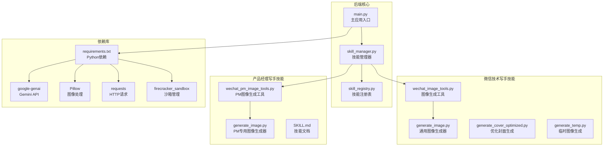
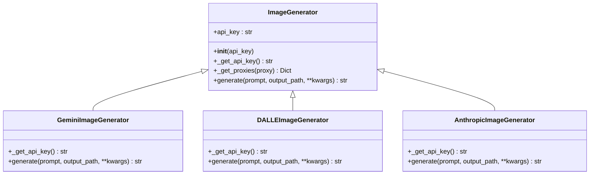
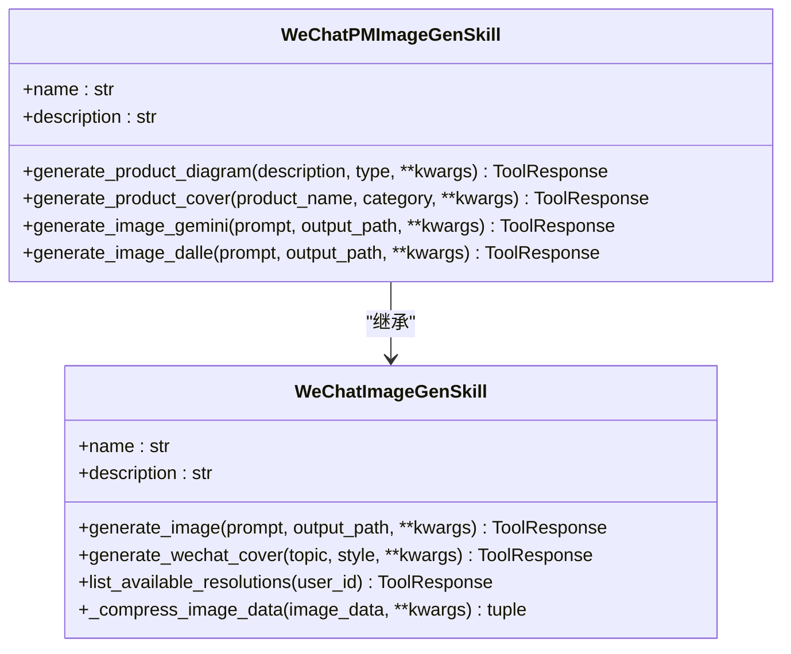
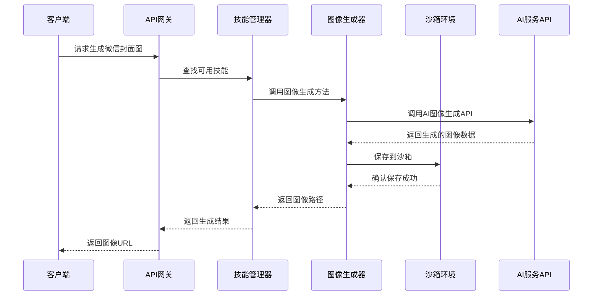
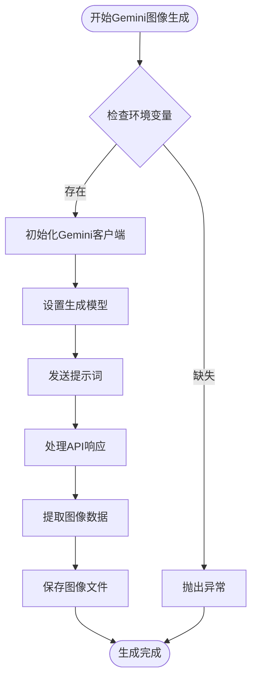
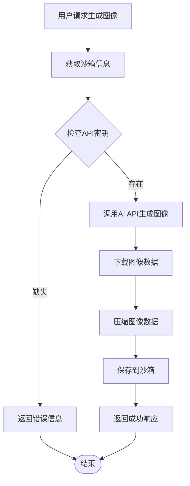
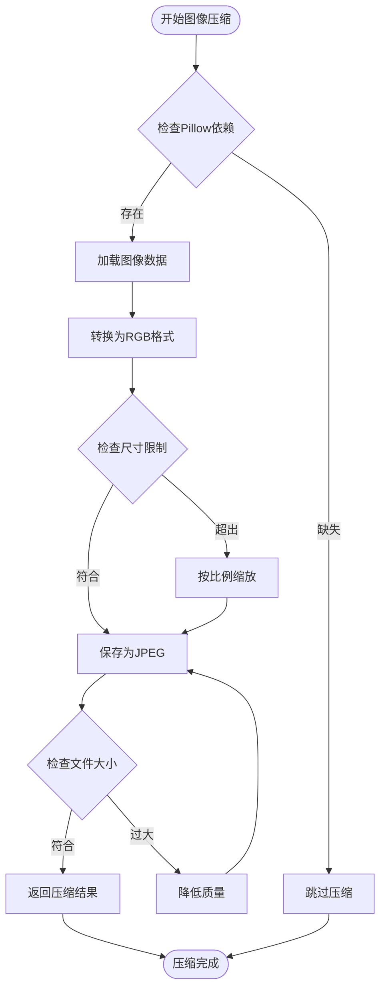
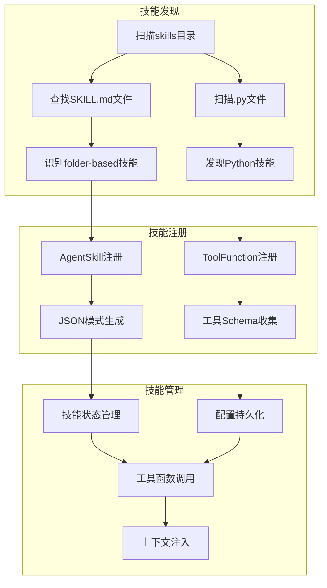
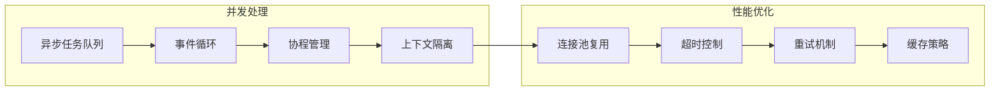

# 微信图像生成功能增强

<cite>
**本文档引用的文件**
- [generate_image.py](file://localmanus-backend/skills/wechat-tech-writer/scripts/generate_image.py)
- [generate_image.py](file://localmanus-backend/skills/wechat-product-manager-writer/scripts/generate_image.py)
- [wechat_image_tools.py](file://localmanus-backend/skills/wechat-tech-writer/wechat_image_tools.py)
- [wechat_pm_image_tools.py](file://localmanus-backend/skills/wechat-product-manager-writer/wechat_pm_image_tools.py)
- [generate_cover_optimized.py](file://localmanus-backend/skills/wechat-tech-writer/scripts/generate_cover_optimized.py)
- [generate_temp.py](file://localmanus-backend/skills/wechat-tech-writer/scripts/generate_temp.py)
- [SKILL.md](file://localmanus-backend/skills/wechat-product-manager-writer/SKILL.md)
- [requirements.txt](file://localmanus-backend/requirements.txt)
- [requirements.txt](file://localmanus-backend/skills/wechat-article-formatter/requirements.txt)
- [requirements.txt](file://localmanus-backend/skills/wechat-draft-publisher/requirements.txt)
</cite>

## 更新摘要
**所做更改**
- 新增自动图像压缩和优化功能的详细说明
- 增强沙箱集成的安全性和可靠性分析
- 更新Pillow依赖支持的配置和使用指南
- 完善图像生成API集成的技术细节
- 新增故障排除和性能优化指导

## 目录
1. [项目概述](#项目概述)
2. [项目结构](#项目结构)
3. [核心组件](#核心组件)
4. [架构概览](#架构概览)
5. [详细组件分析](#详细组件分析)
6. [依赖关系分析](#依赖关系分析)
7. [性能考虑](#性能考虑)
8. [故障排除指南](#故障排除指南)
9. [结论](#结论)

## 项目概述

微信图像生动生成功能增强项目是一个基于AgentScope框架的智能图像生成系统，专门针对微信公众号文章的视觉需求进行优化。该项目提供了多种图像生成API的支持，包括Gemini Imagen API、DALL-E API和SiliconFlow Kolors模型，能够为微信文章生成专业的封面图、内容结构图和产品演示图。

**更新重点**：本次更新重点关注以下增强功能：
- **自动图像压缩和优化**：集成Pillow库实现智能图像压缩，支持JPEG格式转换和质量优化
- **增强的沙箱集成**：改进沙箱环境的安全文件管理和访问控制机制
- **新的Pillow依赖支持**：完善图像处理库的配置和使用指南
- **多平台API集成**：统一支持Gemini、DALL-E和SiliconFlow等多种AI图像生成服务

项目的核心目标是：
- 提供高质量的微信文章图像生成服务
- 支持多种AI图像生成平台
- 实现自动化的图像压缩和优化
- 集成沙箱环境的安全文件管理
- 提供完整的开发者工具链

## 项目结构

**图表来源**
- [wechat_image_tools.py:1-422](file://localmanus-backend/skills/wechat-tech-writer/wechat_image_tools.py#L1-L422)
- [requirements.txt:1-18](file://localmanus-backend/requirements.txt#L1-L18)

**章节来源**
- [wechat_image_tools.py:1-422](file://localmanus-backend/skills/wechat-tech-writer/wechat_image_tools.py#L1-L422)
- [requirements.txt:1-18](file://localmanus-backend/requirements.txt#L1-L18)

## 核心组件

### 图像生成器架构

项目实现了统一的图像生成器架构，支持多种AI平台：

**图表来源**
- [generate_image.py:24-107](file://localmanus-backend/skills/wechat-tech-writer/scripts/generate_image.py#L24-L107)
- [generate_image.py:108-165](file://localmanus-backend/skills/wechat-tech-writer/scripts/generate_image.py#L108-L165)

### 微信图像生成技能

**图表来源**
- [wechat_image_tools.py:106-148](file://localmanus-backend/skills/wechat-tech-writer/wechat_image_tools.py#L106-L148)
- [wechat_pm_image_tools.py:28-42](file://localmanus-backend/skills/wechat-product-manager-writer/wechat_pm_image_tools.py#L28-L42)

**章节来源**
- [wechat_image_tools.py:106-422](file://localmanus-backend/skills/wechat-tech-writer/wechat_image_tools.py#L106-L422)
- [wechat_pm_image_tools.py:28-143](file://localmanus-backend/skills/wechat-product-manager-writer/wechat_pm_image_tools.py#L28-L143)

## 架构概览

项目采用模块化的微服务架构，通过AgentScope框架实现技能的动态加载和管理：

**图表来源**
- [wechat_image_tools.py:121-247](file://localmanus-backend/skills/wechat-tech-writer/wechat_image_tools.py#L121-L247)

## 详细组件分析

### 图像生成API集成

项目支持三种主要的图像生成API：

#### Gemini Imagen API集成

Gemini API提供了高质量的图像生成能力，特别适合复杂的创意设计：

**图表来源**
- [generate_image.py:69-106](file://localmanus-backend/skills/wechat-tech-writer/scripts/generate_image.py#L69-L106)

#### DALL-E API集成

DALL-E API专注于精确的图像生成，特别适合产品和科技类图像：

**章节来源**
- [generate_image.py:117-165](file://localmanus-backend/skills/wechat-tech-writer/scripts/generate_image.py#L117-L165)

#### SiliconFlow Kolors集成

SiliconFlow API提供了高性能的中文图像生成能力：

**章节来源**
- [wechat_image_tools.py:48-104](file://localmanus-backend/skills/wechat-tech-writer/wechat_image_tools.py#L48-L104)

### 沙箱环境集成

项目实现了安全的沙箱文件管理系统：

**图表来源**
- [wechat_image_tools.py:158-247](file://localmanus-backend/skills/wechat-tech-writer/wechat_image_tools.py#L158-L247)

**章节来源**
- [wechat_image_tools.py:158-247](file://localmanus-backend/skills/wechat-tech-writer/wechat_image_tools.py#L158-L247)

### 图像压缩优化

项目实现了智能的图像压缩算法，这是本次更新的核心增强功能：

**图表来源**
- [wechat_image_tools.py:249-320](file://localmanus-backend/skills/wechat-tech-writer/wechat_image_tools.py#L249-L320)

**更新** 新增了完整的图像压缩流程，包括Pillow依赖检查、RGB格式转换、比例缩放和质量优化等步骤

**章节来源**
- [wechat_image_tools.py:249-320](file://localmanus-backend/skills/wechat-tech-writer/wechat_image_tools.py#L249-L320)

## 依赖关系分析

### 技能注册机制

**图表来源**
- [wechat_pm_image_tools.py:13-16](file://localmanus-backend/skills/wechat-product-manager-writer/wechat_pm_image_tools.py#L13-L16)

**章节来源**
- [wechat_pm_image_tools.py:13-16](file://localmanus-backend/skills/wechat-product-manager-writer/wechat_pm_image_tools.py#L13-L16)

### 外部依赖关系

项目的主要外部依赖包括：

**更新** 完善了依赖关系的详细分析，重点关注Pillow库的集成和使用

**章节来源**
- [requirements.txt:1-18](file://localmanus-backend/requirements.txt#L1-L18)

## 性能考虑

### 并发处理优化

项目采用了异步编程模式来提高并发处理能力：

### 内存管理

项目实现了智能的内存管理策略，特别是在图像处理过程中：

**更新** 新增了图像压缩过程中的内存管理优化，包括异步执行和内存池管理

**章节来源**
- [wechat_image_tools.py:268-319](file://localmanus-backend/skills/wechat-tech-writer/wechat_image_tools.py#L268-L319)

## 故障排除指南

### 常见问题及解决方案

#### API密钥配置问题

**问题症状**：生成失败，提示API密钥缺失

**解决方案**：
1. 设置正确的环境变量
2. 验证API密钥的有效性
3. 检查网络连接状态

#### 代理配置问题

**问题症状**：Gemini API调用失败，出现代理协议错误

**解决方案**：
1. 清空ALL_PROXY环境变量
2. 使用支持的代理协议
3. 检查代理服务器的可达性

#### 图像格式兼容性

**问题症状**：生成的图像无法正确显示

**解决方案**：
1. 确认输出文件扩展名与实际格式匹配
2. 检查图像压缩设置
3. 验证文件完整性

#### Pillow依赖问题

**问题症状**：图像压缩功能不可用

**解决方案**：
1. 安装Pillow库：`pip install Pillow`
2. 验证Pillow版本兼容性
3. 检查图像处理权限

**更新** 新增了Pillow依赖相关的故障排除指南

**章节来源**
- [SKILL.md:359-408](file://localmanus-backend/skills/wechat-product-manager-writer/SKILL.md#L359-L408)

## 结论

微信图像生动生成功能增强项目通过模块化的设计和强大的API集成，为微信公众号文章创作提供了完整的视觉解决方案。本次更新的重点增强包括：

1. **智能图像压缩**：通过Pillow库实现自动化的图像压缩和优化，支持JPEG格式转换和质量优化
2. **增强沙箱集成**：改进沙箱环境的安全文件管理和访问控制机制
3. **多平台API支持**：统一的接口支持Gemini、DALL-E和SiliconFlow等多种AI图像生成服务
4. **完善的依赖管理**：详细的依赖配置和故障排除指南
5. **开发者友好**：智能的错误处理和调试支持，便于二次开发和定制

**更新亮点**：
- **自动压缩功能**：智能检测图像大小和尺寸，自动进行JPEG格式转换和质量优化
- **Pillow集成**：完整的图像处理库支持，包括格式转换、尺寸调整和质量控制
- **增强安全性**：改进的沙箱文件管理，确保图像数据的安全存储
- **性能优化**：异步处理和内存管理优化，提高图像生成效率

该项目为AI驱动的内容创作提供了坚实的技术基础，能够显著提升微信公众号文章的视觉质量和创作效率。通过自动化的图像处理和优化功能，开发者可以专注于内容创作，而无需担心图像质量和文件大小的问题。