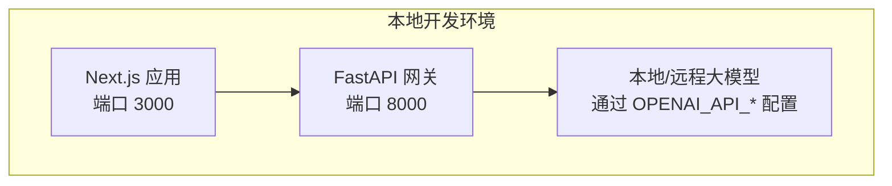
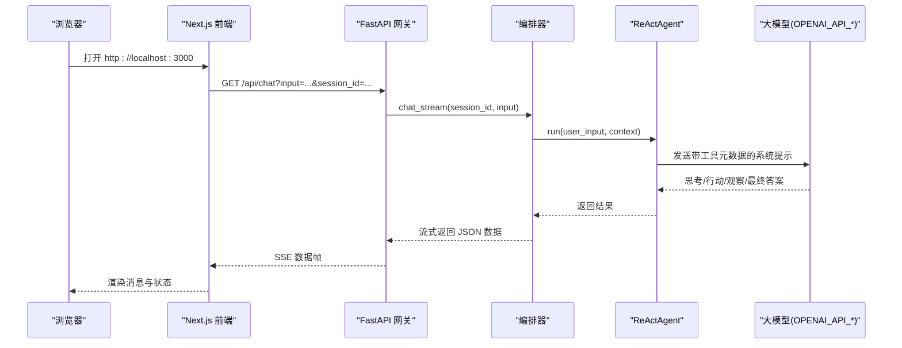
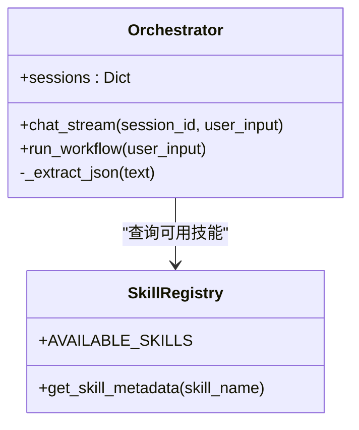
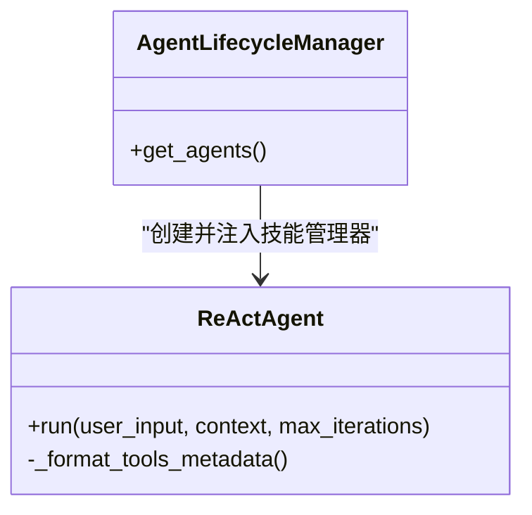
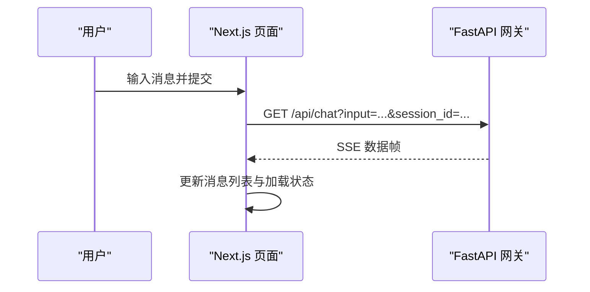
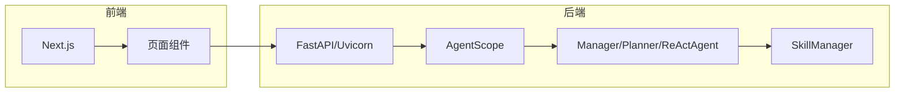

# 快速开始

<cite>
**本文引用的文件**
- [main.py](file://localmanus-backend/main.py)
- [.env.example](file://localmanus-backend/.env.example)
- [requirements.txt](file://localmanus-backend/requirements.txt)
- [config.py](file://localmanus-backend/core/config.py)
- [agent_manager.py](file://localmanus-backend/core/agent_manager.py)
- [orchestrator.py](file://localmanus-backend/core/orchestrator.py)
- [react_agent.py](file://localmanus-backend/agents/react_agent.py)
- [test_orchestration.py](file://localmanus-backend/scripts/test_orchestration.py)
- [Dockerfile（UI）](file://localmanus-ui/Dockerfile)
- [package.json（UI）](file://localmanus-ui/package.json)
- [page.tsx（UI）](file://localmanus-ui/app/page.tsx)
- [docker-compose.yml](file://docker-compose.yml)
- [localmanus_architecture.md](file://localmanus_architecture.md)
</cite>

## 目录
1. [简介](#简介)
2. [项目结构](#项目结构)
3. [核心组件](#核心组件)
4. [架构总览](#架构总览)
5. [详细组件分析](#详细组件分析)
6. [依赖关系分析](#依赖关系分析)
7. [性能注意事项](#性能注意事项)
8. [故障排除指南](#故障排除指南)
9. [结论](#结论)
10. [附录](#附录)

## 简介
本指南面向首次接触 LocalManus 的用户，帮助你在最短时间内完成安装、环境配置与首次运行。你将学会：
- 使用 Docker Compose 同时启动前端与后端服务
- 正确设置环境变量与依赖
- 通过自然语言输入发起对话、执行任务与获取结果
- 解决常见问题与进行故障排查

## 项目结构
LocalManus 采用前后端分离的双仓库结构：
- 后端：基于 FastAPI 的 API 网关，负责聊天、任务规划与 ReAct 执行
- 前端：基于 Next.js 的 Web UI，提供聊天界面与模板展示
- 编排：通过 docker-compose 统一编排 UI 与未来可能的后端服务



图表来源
- [docker-compose.yml](file://docker-compose.yml#L1-L16)
- [main.py](file://localmanus-backend/main.py#L14-L28)
- [config.py](file://localmanus-backend/core/config.py#L18-L21)

章节来源
- [docker-compose.yml](file://docker-compose.yml#L1-L16)
- [localmanus_architecture.md](file://localmanus_architecture.md#L1-L31)

## 核心组件
- 后端 API 网关（FastAPI）
  - 提供根接口、SSE 聊天、同步任务计划、ReAct 执行与 WebSocket 任务流
- Orchestrator（编排器）
  - 负责会话历史管理、JSON 提取、工作流规划与 ReAct 执行
- AgentScope 集成
  - 通过 AgentLifecycleManager 初始化管理/规划/ReAct 智能体，并注入模型配置
- 前端 UI（Next.js）
  - 提供聊天界面、消息列表与模板区域，通过 HTTP SSE 与后端交互

章节来源
- [main.py](file://localmanus-backend/main.py#L14-L95)
- [orchestrator.py](file://localmanus-backend/core/orchestrator.py#L8-L118)
- [agent_manager.py](file://localmanus-backend/core/agent_manager.py#L7-L31)
- [page.tsx（UI）](file://localmanus-ui/app/page.tsx#L11-L184)

## 架构总览
下面的图展示了从浏览器到后端 API，再到 AgentScope 智能体与外部 LLM 的整体调用链路。



图表来源
- [main.py](file://localmanus-backend/main.py#L30-L38)
- [orchestrator.py](file://localmanus-backend/core/orchestrator.py#L13-L60)
- [react_agent.py](file://localmanus-backend/agents/react_agent.py#L49-L104)
- [config.py](file://localmanus-backend/core/config.py#L8-L16)

## 详细组件分析

### 后端 API 网关（FastAPI）
- 根接口：返回服务状态与版本
- SSE 聊天：支持多轮会话历史，最大 10 轮
- 同步任务：生成工作流计划（演示）
- ReAct 执行：同步执行 ReAct 循环
- WebSocket 任务流：接收客户端动作，执行 ReAct 并回传结果

```mermaid
flowchart TD
Start(["请求进入"]) --> Route{"路由选择"}
Route --> |GET /api/chat| Chat["SSE 聊天流"]
Route --> |POST /api/task| TaskPlan["生成工作流计划"]
Route --> |POST /api/react| ReactExec["ReAct 执行"]
Route --> |WS /ws/task/{trace_id}| WS["WebSocket 任务流"]
Chat --> End(["响应结束"])
TaskPlan --> End
ReactExec --> End
WS --> End
```

图表来源
- [main.py](file://localmanus-backend/main.py#L26-L95)

章节来源
- [main.py](file://localmanus-backend/main.py#L14-L95)

### 编排器（Orchestrator）
- 会话管理：按 session_id 维护消息历史，限制最多 10 轮
- JSON 提取：从智能体回复中提取 JSON 结构
- 工作流规划：调用管理/规划智能体生成 DAG 计划
- ReAct 执行：驱动 ReActAgent，解析 Action 并执行技能



图表来源
- [orchestrator.py](file://localmanus-backend/core/orchestrator.py#L8-L118)

章节来源
- [orchestrator.py](file://localmanus-backend/core/orchestrator.py#L8-L118)

### AgentScope 集成
- AgentLifecycleManager：初始化 AgentScope 模型配置，创建 Manager/Planner/ReActAgent
- ReActAgent：根据工具元数据生成系统提示，解析 Action 并执行技能



图表来源
- [agent_manager.py](file://localmanus-backend/core/agent_manager.py#L7-L31)
- [react_agent.py](file://localmanus-backend/agents/react_agent.py#L32-L104)

章节来源
- [agent_manager.py](file://localmanus-backend/core/agent_manager.py#L7-L31)
- [react_agent.py](file://localmanus-backend/agents/react_agent.py#L32-L104)

### 前端 UI（Next.js）
- 聊天模式：发送消息后通过 SSE 获取流式响应，渲染用户与机器人消息
- 模板区域：展示多种模板卡片，支持上传/创建等入口
- 会话 ID：随机生成，保证多轮对话独立



图表来源
- [page.tsx（UI）](file://localmanus-ui/app/page.tsx#L24-L90)
- [main.py](file://localmanus-backend/main.py#L30-L38)

章节来源
- [page.tsx（UI）](file://localmanus-ui/app/page.tsx#L11-L184)

## 依赖关系分析
- 后端依赖
  - FastAPI、Uvicorn、AgentScope、Pydantic、WebSockets、python-multipart、python-dotenv
- 前端依赖
  - Next.js、React、TypeScript、ESLint 等
- 环境变量
  - OPENAI_API_KEY、OPENAI_API_BASE、MODEL_NAME



图表来源
- [requirements.txt](file://localmanus-backend/requirements.txt#L1-L8)
- [package.json（UI）](file://localmanus-ui/package.json#L11-L24)
- [config.py](file://localmanus-backend/core/config.py#L8-L16)

章节来源
- [requirements.txt](file://localmanus-backend/requirements.txt#L1-L8)
- [package.json（UI）](file://localmanus-ui/package.json#L11-L24)
- [.env.example](file://localmanus-backend/.env.example#L1-L4)

## 性能注意事项
- SSE 聊天：单次请求最大 10 轮对话，避免过长历史导致内存压力
- ReAct 循环：默认最多 5 次迭代，防止长时间阻塞
- WebSocket：适合实时任务流，注意客户端断开与日志清理
- 模型配置：通过 OPENAI_API_BASE 指向本地或远程推理服务，合理设置超时与并发

章节来源
- [orchestrator.py](file://localmanus-backend/core/orchestrator.py#L23-L25)
- [react_agent.py](file://localmanus-backend/agents/react_agent.py#L49-L104)
- [config.py](file://localmanus-backend/core/config.py#L18-L21)

## 故障排除指南
- 无法连接到后端
  - 确认后端服务已启动且监听 0.0.0.0:8000
  - 检查防火墙与端口占用
- 前端无法获取 SSE
  - 确保前端访问 http://localhost:8000/api/chat
  - 检查浏览器跨域设置（后端已允许任意来源）
- 未显示聊天结果
  - 查看浏览器控制台是否有网络错误
  - 确认后端日志中无异常
- 无 API Key 或模型不可用
  - 设置 OPENAI_API_KEY 与 OPENAI_API_BASE
  - 若使用本地 Ollama，请确认服务地址与端口
- Docker Compose 未启动后端
  - 当前 compose 文件仅构建 UI，后端需单独运行或加入 compose

章节来源
- [main.py](file://localmanus-backend/main.py#L18-L24)
- [page.tsx（UI）](file://localmanus-ui/app/page.tsx#L36-L90)
- [.env.example](file://localmanus-backend/.env.example#L1-L4)
- [docker-compose.yml](file://docker-compose.yml#L1-L16)

## 结论
通过本指南，你可以使用 Docker Compose 快速启动前端 UI，并通过本地或远程大模型完成自然语言对话与任务执行。建议先完成环境变量配置与依赖安装，再尝试首次运行与基本示例。

## 附录

### 安装与首次运行步骤
- 准备工作
  - 安装 Docker 与 Docker Compose
  - 准备 Python 3.8+ 与 Node.js 20+
- 后端（Python）
  - 进入后端目录，安装依赖
  - 复制并编辑环境变量文件，填写 OPENAI_API_KEY、OPENAI_API_BASE、MODEL_NAME
  - 启动后端服务
- 前端（Node.js）
  - 进入前端目录，安装依赖
  - 启动开发服务器
- 启动 Compose
  - 在项目根目录执行 compose，启动 UI 服务
- 首次运行
  - 打开浏览器访问 http://localhost:3000
  - 在聊天框输入自然语言指令，查看流式响应
  - 也可通过后端接口直接测试

章节来源
- [requirements.txt](file://localmanus-backend/requirements.txt#L1-L8)
- [package.json（UI）](file://localmanus-ui/package.json#L5-L10)
- [docker-compose.yml](file://docker-compose.yml#L1-L16)
- [page.tsx（UI）](file://localmanus-ui/app/page.tsx#L11-L184)

### 环境变量配置说明
- OPENAI_API_KEY：大模型访问密钥
- OPENAI_API_BASE：大模型 API 基础地址（可指向本地 Ollama）
- MODEL_NAME：使用的模型名称

章节来源
- [.env.example](file://localmanus-backend/.env.example#L1-L4)
- [config.py](file://localmanus-backend/core/config.py#L8-L16)

### 依赖安装步骤
- 后端
  - 使用 pip 安装 requirements.txt 中的依赖
- 前端
  - 使用 npm/yarn/pnpm/bun 安装 package.json 中的依赖

章节来源
- [requirements.txt](file://localmanus-backend/requirements.txt#L1-L8)
- [package.json（UI）](file://localmanus-ui/package.json#L11-L24)

### Docker 容器化部署流程
- UI 镜像构建
  - 使用本地 UI 目录的 Dockerfile 构建镜像
  - 暴露 3000 端口，生产模式运行
- Compose 编排
  - 使用 docker-compose.yml 启动 UI 服务
  - 如需后端，可在 compose 中添加后端服务条目

章节来源
- [Dockerfile（UI）](file://localmanus-ui/Dockerfile#L1-L32)
- [docker-compose.yml](file://docker-compose.yml#L1-L16)

### 基本使用示例
- 自然语言指令输入
  - 在前端聊天框输入自然语言，点击发送
  - 查看后端 SSE 返回的流式内容
- 任务执行
  - 使用后端接口 /api/task 或 /api/react 触发工作流或 ReAct 执行
- 结果获取
  - SSE 流中的 content 字段即为最终结果
  - WebSocket 场景下，接收类型为 result 的消息

章节来源
- [page.tsx（UI）](file://localmanus-ui/app/page.tsx#L24-L90)
- [main.py](file://localmanus-backend/main.py#L30-L56)
- [orchestrator.py](file://localmanus-backend/core/orchestrator.py#L13-L60)

### 常见问题与解决方案
- API Key 未配置
  - 使用示例脚本进行工作流测试，可模拟无 API Key 的预期结构
- 本地模型不可用
  - 确认 OPENAI_API_BASE 指向正确的推理服务
- 端口冲突
  - 修改 docker-compose 或系统端口映射
- 跨域问题
  - 后端已允许任意来源，检查代理与网络配置

章节来源
- [test_orchestration.py](file://localmanus-backend/scripts/test_orchestration.py#L12-L56)
- [.env.example](file://localmanus-backend/.env.example#L1-L4)
- [main.py](file://localmanus-backend/main.py#L18-L24)