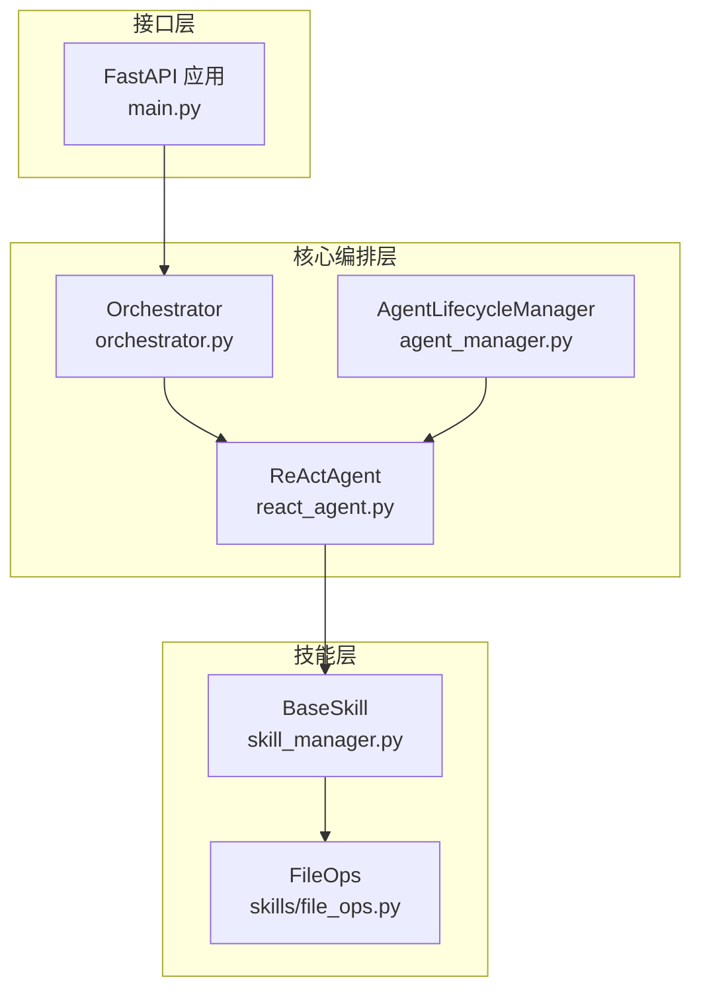
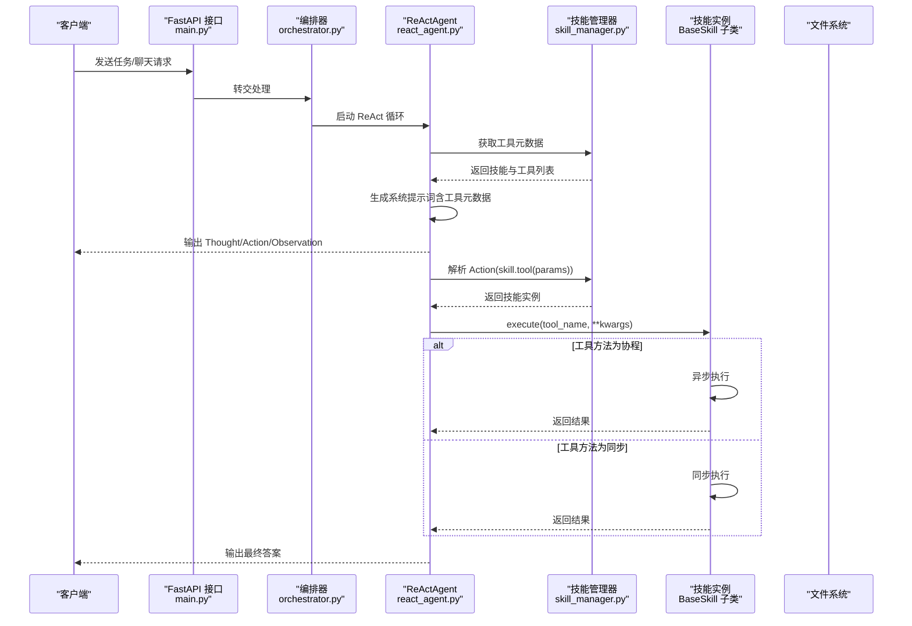
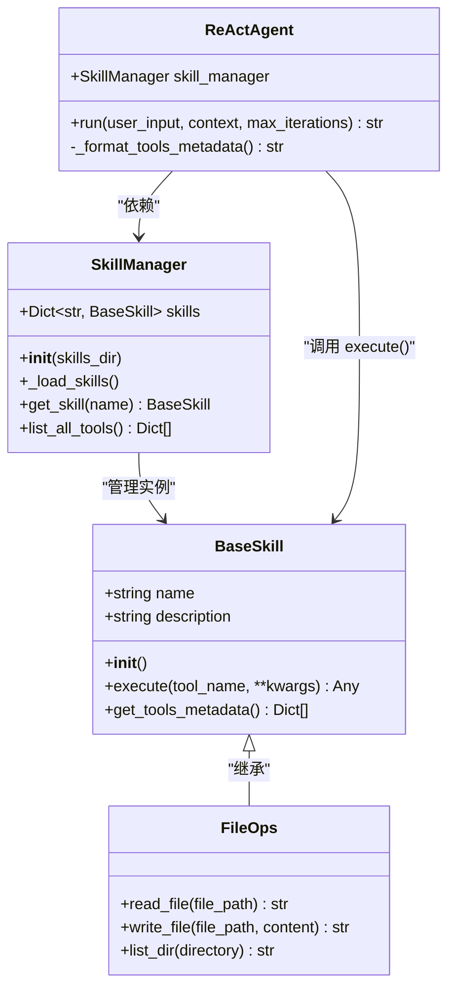
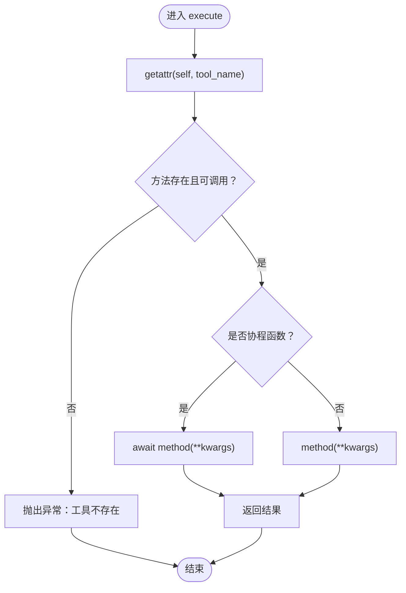
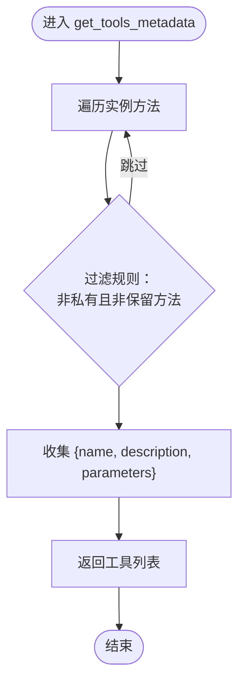
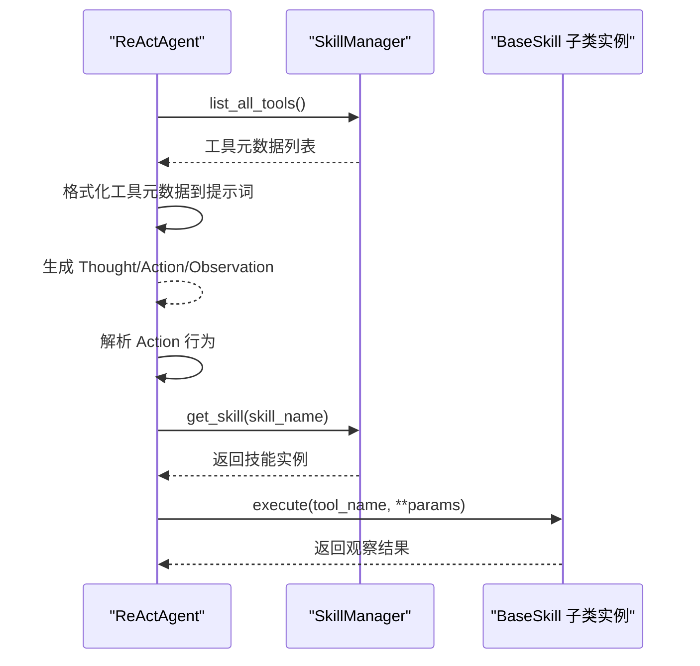
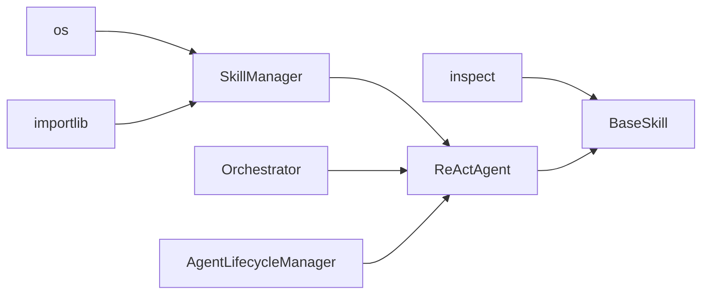

# BaseSkill 基类设计

<cite>
**本文档引用的文件**
- [skill_manager.py](file://localmanus-backend/core/skill_manager.py)
- [file_ops.py](file://localmanus-backend/skills/file_ops.py)
- [react_agent.py](file://localmanus-backend/agents/react_agent.py)
- [agent_manager.py](file://localmanus-backend/core/agent_manager.py)
- [main.py](file://localmanus-backend/main.py)
- [orchestrator.py](file://localmanus-backend/core/orchestrator.py)
- [localmanus_skills_roadmap.md](file://localmanus_skills_roadmap.md)
- [localmanus_architecture.md](file://localmanus_architecture.md)
</cite>

## 目录
1. [简介](#简介)
2. [项目结构](#项目结构)
3. [核心组件](#核心组件)
4. [架构总览](#架构总览)
5. [详细组件分析](#详细组件分析)
6. [依赖关系分析](#依赖关系分析)
7. [性能考量](#性能考量)
8. [故障排查指南](#故障排查指南)
9. [结论](#结论)
10. [附录](#附录)

## 简介
本文件围绕 BaseSkill 基类展开，系统性阐述其设计理念、核心方法实现、工具路由机制、execute 请求分发逻辑、异步方法支持与错误处理、get_tools_metadata 元数据自动生成机制，并提供最佳实践、命名规范与参数验证建议，辅以具体代码示例路径，帮助读者正确继承与实现 BaseSkill。

## 项目结构
该项目采用“核心编排 + 技能扩展”的分层架构：
- 核心编排层：AgentLifecycleManager、Orchestrator、ReActAgent
- 技能层：BaseSkill 抽象基类 + 具体技能实现（如 FileOps）
- 接口层：FastAPI 提供 REST/WebSocket 接口

**图表来源**
- [main.py](file://localmanus-backend/main.py#L1-L95)
- [agent_manager.py](file://localmanus-backend/core/agent_manager.py#L1-L39)
- [orchestrator.py](file://localmanus-backend/core/orchestrator.py#L1-L118)
- [react_agent.py](file://localmanus-backend/agents/react_agent.py#L1-L107)
- [skill_manager.py](file://localmanus-backend/core/skill_manager.py#L1-L84)
- [file_ops.py](file://localmanus-backend/./skills/file_ops.py#L1-L41)

**章节来源**
- [main.py](file://localmanus-backend/main.py#L1-L95)
- [agent_manager.py](file://localmanus-backend/core/agent_manager.py#L1-L39)
- [orchestrator.py](file://localmanus-backend/core/orchestrator.py#L1-L118)
- [react_agent.py](file://localmanus-backend/agents/react_agent.py#L1-L107)
- [skill_manager.py](file://localmanus-backend/core/skill_manager.py#L1-L84)
- [file_ops.py](file://localmanus-backend/skills/file_ops.py#L1-L41)

## 核心组件
- BaseSkill：抽象技能基类，提供统一的工具路由与元数据导出能力
- SkillManager：动态加载技能模块，实例化具体技能类
- ReActAgent：基于工具元数据的推理与行动循环，负责解析 Action 并调用技能
- FileOps：继承 BaseSkill 的具体技能示例，提供文件读写等工具方法

**章节来源**
- [skill_manager.py](file://localmanus-backend/core/skill_manager.py#L6-L41)
- [react_agent.py](file://localmanus-backend/agents/react_agent.py#L32-L50)
- [file_ops.py](file://localmanus-backend/skills/file_ops.py#L4-L41)

## 架构总览
BaseSkill 位于技能层，向上被 SkillManager 管理，向下被 ReActAgent 通过工具元数据驱动调用。整体流程如下：

**图表来源**
- [main.py](file://localmanus-backend/main.py#L30-L56)
- [orchestrator.py](file://localmanus-backend/core/orchestrator.py#L13-L60)
- [react_agent.py](file://localmanus-backend/agents/react_agent.py#L52-L106)
- [skill_manager.py](file://localmanus-backend/core/skill_manager.py#L42-L83)
- [skill_manager.py](file://localmanus-backend/core/skill_manager.py#L15-L25)
- [file_ops.py](file://localmanus-backend/skills/file_ops.py#L9-L41)

## 详细组件分析

### BaseSkill 基类设计与实现
BaseSkill 是所有技能的抽象基类，提供统一的工具路由与元数据导出能力：
- 初始化：自动设置 name 与 description（来自类名与文档字符串）
- execute：根据工具名称动态分发到具体方法，自动判断同步/异步
- get_tools_metadata：反射扫描所有公开方法，生成工具元数据（名称、描述、参数签名）

**图表来源**
- [skill_manager.py](file://localmanus-backend/core/skill_manager.py#L6-L41)
- [skill_manager.py](file://localmanus-backend/core/skill_manager.py#L42-L83)
- [file_ops.py](file://localmanus-backend/skills/file_ops.py#L4-L41)
- [react_agent.py](file://localmanus-backend/agents/react_agent.py#L32-L50)

**章节来源**
- [skill_manager.py](file://localmanus-backend/core/skill_manager.py#L6-L41)
- [skill_manager.py](file://localmanus-backend/core/skill_manager.py#L42-L83)

### execute 方法：请求分发逻辑与异步支持
- 分发逻辑：通过反射获取同名方法，若存在且可调用则执行
- 异步支持：检测方法是否为协程函数，若是则 await，否则直接调用
- 错误处理：未找到工具时抛出异常，便于上层捕获并生成观察消息

**图表来源**
- [skill_manager.py](file://localmanus-backend/core/skill_manager.py#L15-L25)

**章节来源**
- [skill_manager.py](file://localmanus-backend/core/skill_manager.py#L15-L25)

### get_tools_metadata：元数据自动生成与参数签名提取
- 元数据生成：遍历实例的公开方法（排除私有与保留方法），收集名称、描述、参数签名
- 文档字符串处理：优先使用方法的 __doc__，否则回退为默认描述
- 参数签名提取：使用 inspect.signature 获取方法签名字符串

**图表来源**
- [skill_manager.py](file://localmanus-backend/core/skill_manager.py#L27-L40)

**章节来源**
- [skill_manager.py](file://localmanus-backend/core/skill_manager.py#L27-L40)

### ReActAgent 与工具路由：Action 解析与执行
- 工具元数据注入：在系统提示词中注入所有可用工具的元数据
- Action 解析：从响应中提取 Action 行，解析为 skill_name.tool_name(params)
- 执行流程：通过 SkillManager 获取技能实例并调用 execute

**图表来源**
- [react_agent.py](file://localmanus-backend/agents/react_agent.py#L45-L50)
- [react_agent.py](file://localmanus-backend/agents/react_agent.py#L72-L101)
- [skill_manager.py](file://localmanus-backend/core/skill_manager.py#L75-L83)

**章节来源**
- [react_agent.py](file://localmanus-backend/agents/react_agent.py#L45-L50)
- [react_agent.py](file://localmanus-backend/agents/react_agent.py#L72-L101)
- [skill_manager.py](file://localmanus-backend/core/skill_manager.py#L75-L83)

### 具体技能实现示例：FileOps
FileOps 继承 BaseSkill，提供三个工具方法：
- read_file：读取文件内容，包含存在性检查与异常处理
- write_file：写入文件内容，包含异常处理
- list_dir：列出目录内容，包含异常处理

这些方法均遵循同步返回字符串的约定，便于 ReActAgent 的观察消息拼接。

**章节来源**
- [file_ops.py](file://localmanus-backend/skills/file_ops.py#L4-L41)

## 依赖关系分析
- BaseSkill 依赖于 Python 标准库的 inspect 模块进行方法反射与签名提取
- SkillManager 依赖 importlib 与 os 进行动态模块导入与目录扫描
- ReActAgent 依赖 SkillManager 提供的工具元数据与技能实例
- 主应用通过 Orchestrator 协调 AgentLifecycleManager 与 ReActAgent

**图表来源**
- [skill_manager.py](file://localmanus-backend/core/skill_manager.py#L1-L4)
- [skill_manager.py](file://localmanus-backend/core/skill_manager.py#L48-L71)
- [react_agent.py](file://localmanus-backend/agents/react_agent.py#L32-L43)
- [agent_manager.py](file://localmanus-backend/core/agent_manager.py#L8-L26)

**章节来源**
- [skill_manager.py](file://localmanus-backend/core/skill_manager.py#L1-L4)
- [skill_manager.py](file://localmanus-backend/core/skill_manager.py#L48-L71)
- [react_agent.py](file://localmanus-backend/agents/react_agent.py#L32-L43)
- [agent_manager.py](file://localmanus-backend/core/agent_manager.py#L8-L26)

## 性能考量
- 动态加载：SkillManager 在初始化时扫描 skills 目录并导入模块，适合按需加载
- 反射开销：get_tools_metadata 使用反射扫描方法，建议避免在高频路径重复调用
- 异步执行：execute 对协程函数进行 await，充分利用异步 I/O（如文件读写、网络请求）
- 参数解析：ReActAgent 使用 eval 进行参数解析（演示用途），生产环境建议改用更安全的解析方式（如 ast.literal_eval 或正则表达式）

[本节为通用性能建议，无需特定文件来源]

## 故障排查指南
- 工具不存在：execute 在找不到工具时抛出异常，ReActAgent 捕获后生成错误观察消息
- 参数解析错误：Action 行解析失败或参数格式不正确会导致异常，应检查 Action 格式与参数键值
- 动态加载失败：SkillManager 导入模块时捕获异常并打印错误信息，检查模块路径与依赖
- 文档字符串缺失：get_tools_metadata 未提供描述时回退为默认描述，建议为每个工具编写清晰的文档字符串

**章节来源**
- [skill_manager.py](file://localmanus-backend/core/skill_manager.py#L15-L25)
- [react_agent.py](file://localmanus-backend/agents/react_agent.py#L76-L101)
- [skill_manager.py](file://localmanus-backend/core/skill_manager.py#L69-L70)

## 结论
BaseSkill 通过统一的工具路由与元数据导出机制，为技能扩展提供了简洁一致的接口。结合 SkillManager 的动态加载与 ReActAgent 的工具驱动推理，系统实现了灵活、可扩展的技能执行链路。遵循本文的最佳实践与规范，可确保技能实现的一致性与可维护性。

[本节为总结性内容，无需特定文件来源]

## 附录

### 最佳实践与规范
- 方法命名规范
  - 工具方法应使用动词短语命名，如 read_file、write_file、list_dir
  - 避免使用下划线开头的私有方法作为工具入口
- 参数验证建议
  - 在工具方法内部进行参数类型与范围校验
  - 对外部输入进行必要的清理与转义，避免注入风险
- 文档字符串
  - 为每个工具方法编写清晰的描述，便于 get_tools_metadata 正确导出
- 异步方法支持
  - 对于耗时操作（如网络请求、大文件读写），建议实现为协程函数并使用 await
- 错误处理
  - 工具方法应返回可读的错误信息字符串，便于 ReActAgent 的观察消息展示
  - 对于严重错误，可抛出异常由上层捕获并记录日志

**章节来源**
- [file_ops.py](file://localmanus-backend/skills/file_ops.py#L9-L41)
- [skill_manager.py](file://localmanus-backend/core/skill_manager.py#L27-L40)
- [localmanus_skills_roadmap.md](file://localmanus_skills_roadmap.md#L5-L9)

### 如何正确继承与实现 BaseSkill
- 继承 BaseSkill 并实现多个工具方法
- 为每个工具方法添加文档字符串，便于元数据导出
- 在工具方法中进行参数校验与异常处理
- 若存在耗时操作，考虑实现为协程函数以提升性能

参考示例路径：
- [BaseSkill 类定义](file://localmanus-backend/core/skill_manager.py#L6-L41)
- [FileOps 技能实现](file://localmanus-backend/skills/file_ops.py#L4-L41)

**章节来源**
- [skill_manager.py](file://localmanus-backend/core/skill_manager.py#L6-L41)
- [file_ops.py](file://localmanus-backend/skills/file_ops.py#L4-L41)