# SkillManager 核心管理

<cite>
**本文档引用的文件**
- [skill_manager.py](file://localmanus-backend/core/skill_manager.py)
- [agent_manager.py](file://localmanus-backend/core/agent_manager.py)
- [react_agent.py](file://localmanus-backend/agents/react_agent.py)
- [file_ops.py](file://localmanus-backend/skills/file-operations/file_ops.py)
- [system_tools.py](file://localmanus-backend/skills/system-execution/system_tools.py)
- [web_tools.py](file://localmanus-backend/skills/web-search/web_tools.py)
- [main.py](file://localmanus-backend/main.py)
- [requirements.txt](file://localmanus-backend/requirements.txt)
- [.env.example](file://localmanus-backend/.env.example)
- [orchestrator.py](file://localmanus-backend/core/orchestrator.py)
- [异步工具调用.py](file://test-agentscope/异步工具调用.py)
- [wechat_formatter_tools.py](file://localmanus-backend/skills/wechat-article-formatter/wechat_formatter_tools.py)
- [wechat_publisher_tools.py](file://localmanus-backend/skills/wechat-draft-publisher/wechat_publisher_tools.py)
- [wechat_image_tools.py](file://localmanus-backend/skills/wechat-tech-writer/wechat_image_tools.py)
- [SKILL.md](file://localmanus-backend/skills/wechat-draft-publisher/SKILL.md)
</cite>

## 更新摘要
**变更内容**
- 新增微信技能生态系统，包括文章格式化、图片生成和草稿发布
- 增强 execute_tool 方法的自动上下文注入功能
- 支持微信凭证自动传递（appid/appsecret）
- 完善用户上下文生命周期管理
- 新增异步生成器响应处理
- 增强工具函数参数注入，支持 user_id 和 user_context 参数

## 目录
1. [简介](#简介)
2. [项目结构](#项目结构)
3. [核心组件](#核心组件)
4. [架构概览](#架构概览)
5. [详细组件分析](#详细组件分析)
6. [微信技能生态系统](#微信技能生态系统)
7. [依赖关系分析](#依赖关系分析)
8. [性能考虑](#性能考虑)
9. [故障排除指南](#故障排除指南)
10. [结论](#结论)

## 简介

SkillManager 是 LocalManus 项目中的核心技能管理系统，负责动态加载、管理和调度各种技能模块。该系统采用基于 AgentScope 的现代架构设计，支持运行时动态发现和加载技能，为 AI Agent 提供灵活的工具调用能力。

**更新** 系统已完全集成到 AgentScope 生态系统中，引入了 UserContextToolkit 类，提供线程安全的用户上下文注入机制。现在支持基于 contextvars 的异步任务隔离，确保并发请求间的上下文隔离和安全性。UserContextToolkit 类现在返回异步生成器，提供流式的工具响应处理，execute_tool 方法支持异步工具执行，增强了异步工具执行模式。

**新增** 微信技能生态系统现已集成，包括：
- WeChatFormatterSkill：Markdown 到微信文章的格式化转换
- WeChatPublisherSkill：微信公众号草稿发布和封面图上传
- WeChatImageGenSkill：基于 SiliconFlow API 的图片生成
- 完整的微信公众号凭证管理和自动传递机制

系统的核心特性包括：
- 基于 AgentScope 的动态工具注册
- 异步工具执行支持，返回异步生成器
- 智能工具元数据生成
- 完善的日志记录和错误处理
- 缓存机制
- 动态技能加载和管理
- 文件夹技能结构支持
- **新增** 线程安全的用户上下文注入机制
- **新增** 基于 contextvars 的异步任务隔离
- **新增** user_id 和 user_context 参数自动注入
- **新增** 异步生成器响应处理
- **新增** 流式工具执行支持
- **新增** 微信技能生态系统集成
- **新增** 微信凭证自动传递功能

## 项目结构

LocalManus 项目的整体架构采用分层设计，SkillManager 位于核心层，为上层 Agent 提供技能服务。

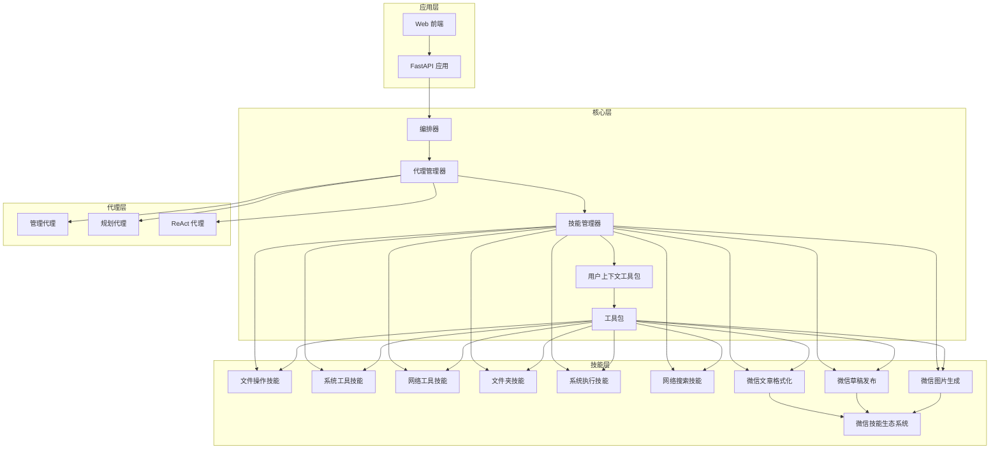

**图表来源**
- [main.py](file://localmanus-backend/main.py#L1-L519)
- [agent_manager.py](file://localmanus-backend/core/agent_manager.py#L1-L49)
- [skill_manager.py](file://localmanus-backend/core/skill_manager.py#L1-L259)
- [orchestrator.py](file://localmanus-backend/core/orchestrator.py#L1-L216)
- [wechat_formatter_tools.py](file://localmanus-backend/skills/wechat-article-formatter/wechat_formatter_tools.py#L1-L331)
- [wechat_publisher_tools.py](file://localmanus-backend/skills/wechat-draft-publisher/wechat_publisher_tools.py#L1-L450)
- [wechat_image_tools.py](file://localmanus-backend/skills/wechat-tech-writer/wechat_image_tools.py#L1-L305)

**章节来源**
- [main.py](file://localmanus-backend/main.py#L1-L519)
- [agent_manager.py](file://localmanus-backend/core/agent_manager.py#L1-L49)
- [skill_manager.py](file://localmanus-backend/core/skill_manager.py#L1-L259)
- [orchestrator.py](file://localmanus-backend/core/orchestrator.py#L1-L216)

## 核心组件

### SkillManager 类

SkillManager 是技能管理的核心类，负责技能的动态加载、实例化和管理，并集成了 AgentScope 的 Toolkit 系统。

```mermaid
classDiagram
class BaseSkill {
+string name
+string description
+__init__()
}
class UserContextToolkit {
+ContextVar user_context
+call_tool_function(tool_block) AsyncGenerator
+inject_user_context(tool_input, sig) Dict
}
class SkillManager {
+string skills_dir
+UserContextToolkit toolkit
+ContextVar user_context
+__init__(skills_dir)
+_load_skills()
+execute_tool(tool_name, user_context, kwargs) Any
+set_user_context(user_context)
+clear_user_context()
+list_all_tools() List[Dict]
+get_skills_prompt() Optional[string]
}
class FileOperationSkill {
+file_read(file_path, user_id) ToolResponse
+file_write(file_path, content, user_id) ToolResponse
+directory_list(directory, user_id) ToolResponse
+list_user_files(user_id) ToolResponse
+read_user_file(user_id, filename) ToolResponse
}
class SystemExecutionSkill {
+python_execute(code) ToolResponse
+shell_execute(command) ToolResponse
}
class WebSearchSkill {
+search_web(query, user_id, max_results) ToolResponse
+scrape_web(url, user_id) ToolResponse
}
class WeChatFormatterSkill {
+convert_markdown_to_html(markdown_text, theme, user_id) ToolResponse
+list_available_themes(user_id) ToolResponse
}
class WeChatPublisherSkill {
+upload_cover_image(image_path, appid, appsecret, user_id) ToolResponse
+create_draft_article(title, content, thumb_media_id, appid, appsecret, ...) ToolResponse
+get_api_status(user_id) ToolResponse
}
class WeChatImageGenSkill {
+generate_image(prompt, output_path, negative_prompt, resolution, user_id) ToolResponse
+generate_wechat_cover(topic, style, output_path, negative_prompt, user_id) ToolResponse
}
class FileOps {
+read_file(file_path, user_id) ToolResponse
+write_file(file_path, content, user_id) ToolResponse
+list_dir(directory, user_id) ToolResponse
+list_user_files(user_id) ToolResponse
+read_user_file(user_id, filename) ToolResponse
}
class SystemTools {
+run_python(code) ToolResponse
+run_shell(command) ToolResponse
}
class WebTools {
+search(query, user_id, max_results) ToolResponse
+scrape(url, user_id) ToolResponse
}
BaseSkill <|-- FileOperationSkill
BaseSkill <|-- SystemExecutionSkill
BaseSkill <|-- WebSearchSkill
BaseSkill <|-- WeChatFormatterSkill
BaseSkill <|-- WeChatPublisherSkill
BaseSkill <|-- WeChatImageGenSkill
BaseSkill <|-- FileOps
BaseSkill <|-- SystemTools
BaseSkill <|-- WebTools
SkillManager --> BaseSkill : manages
SkillManager --> UserContextToolkit : uses
SkillManager --> FileOperationSkill : instantiates
SkillManager --> SystemExecutionSkill : instantiates
SkillManager --> WebSearchSkill : instantiates
SkillManager --> WeChatFormatterSkill : instantiates
SkillManager --> WeChatPublisherSkill : instantiates
SkillManager --> WeChatImageGenSkill : instantiates
SkillManager --> FileOps : instantiates
SkillManager --> SystemTools : instantiates
SkillManager --> WebTools : instantiates
UserContextToolkit --> Toolkit : extends
```

**图表来源**
- [skill_manager.py](file://localmanus-backend/core/skill_manager.py#L17-L259)
- [file_ops.py](file://localmanus-backend/skills/file-operations/file_ops.py#L10-L199)
- [system_tools.py](file://localmanus-backend/skills/system-execution/system_tools.py#L6-L78)
- [web_tools.py](file://localmanus-backend/skills/web-search/web_tools.py#L214-L571)
- [wechat_formatter_tools.py](file://localmanus-backend/skills/wechat-article-formatter/wechat_formatter_tools.py#L22-L331)
- [wechat_publisher_tools.py](file://localmanus-backend/skills/wechat-draft-publisher/wechat_publisher_tools.py#L24-L450)
- [wechat_image_tools.py](file://localmanus-backend/skills/wechat-tech-writer/wechat_image_tools.py#L104-L305)

### 代理集成

SkillManager 与各个代理组件的集成关系：

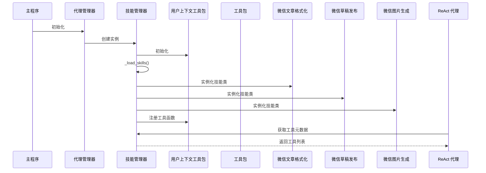

**图表来源**
- [agent_manager.py](file://localmanus-backend/core/agent_manager.py#L31-L36)
- [skill_manager.py](file://localmanus-backend/core/skill_manager.py#L83-L259)
- [react_agent.py](file://localmanus-backend/agents/react_agent.py#L23-L34)

**章节来源**
- [skill_manager.py](file://localmanus-backend/core/skill_manager.py#L83-L259)
- [agent_manager.py](file://localmanus-backend/core/agent_manager.py#L11-L36)
- [react_agent.py](file://localmanus-backend/agents/react_agent.py#L23-L34)

## 架构概览

SkillManager 采用基于 AgentScope 的动态加载架构，通过 Toolkit 系统实现技能的自动发现、注册和管理。

**更新** 架构已完全集成到 AgentScope 生态系统中，引入了 UserContextToolkit 类，提供线程安全的用户上下文注入机制。现在使用基于 contextvars 的异步任务隔离，确保并发请求间的上下文隔离和安全性。UserContextToolkit 类现在返回异步生成器，提供流式的工具响应处理。

**新增** 微信技能生态系统现已完全集成，提供完整的微信公众号文章处理工作流。

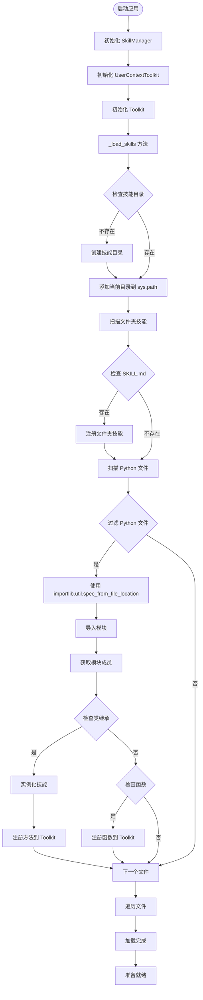

**图表来源**
- [skill_manager.py](file://localmanus-backend/core/skill_manager.py#L89-L149)

**章节来源**
- [skill_manager.py](file://localmanus-backend/core/skill_manager.py#L89-L149)

## 详细组件分析

### 基于 AgentScope 的动态工具注册系统

**更新** SkillManager 现已完全集成到 AgentScope 生态系统中，使用 UserContextToolkit 进行工具管理。现在移除了自定义工具注册逻辑，完全依赖 Toolkit 的注册机制，并增强了用户上下文注入功能。UserContextToolkit 类现在返回异步生成器，提供流式的工具响应处理。

#### 用户上下文注入机制

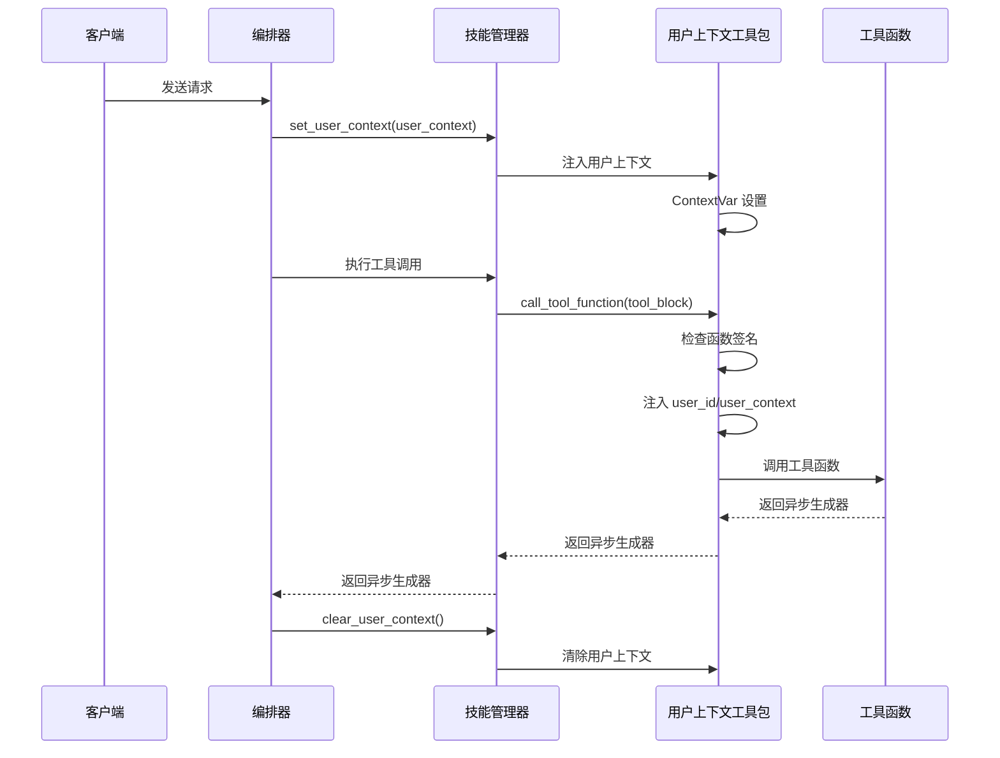

**图表来源**
- [skill_manager.py](file://localmanus-backend/core/skill_manager.py#L215-L259)
- [skill_manager.py](file://localmanus-backend/core/skill_manager.py#L17-L67)
- [orchestrator.py](file://localmanus-backend/core/orchestrator.py#L44-L103)

#### 工具注册流程

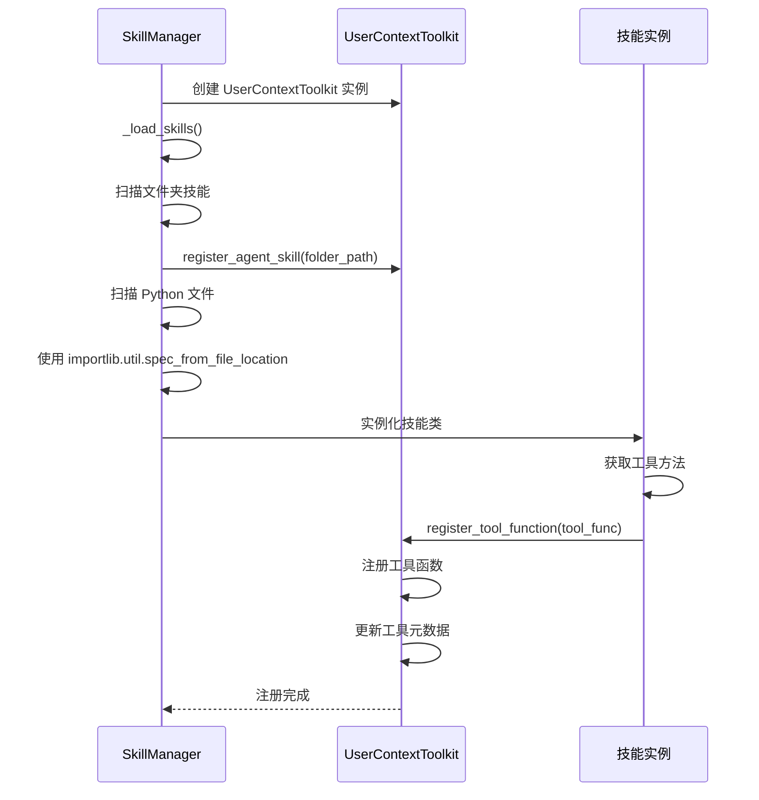

**图表来源**
- [skill_manager.py](file://localmanus-backend/core/skill_manager.py#L117-L149)

#### 异步工具执行支持

**更新** SkillManager 现在支持异步工具执行，使用 UserContextToolkit.call_tool_function 进行统一的异步工具调用。该方法处理异步包装和 ToolResponse 转换，并自动注入用户上下文。execute_tool 方法现在返回异步生成器，支持流式的工具响应处理。

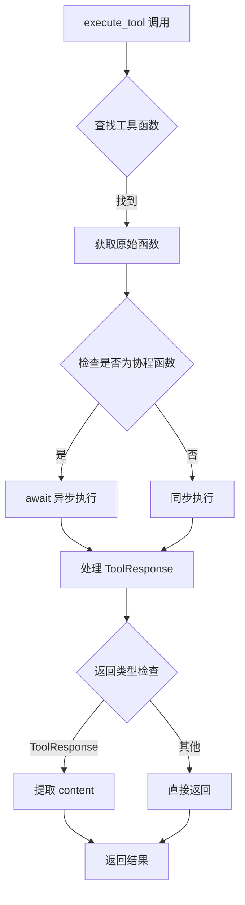

**图表来源**
- [skill_manager.py](file://localmanus-backend/core/skill_manager.py#L169-L213)

**章节来源**
- [skill_manager.py](file://localmanus-backend/core/skill_manager.py#L17-L67)
- [skill_manager.py](file://localmanus-backend/core/skill_manager.py#L169-L213)
- [skill_manager.py](file://localmanus-backend/core/skill_manager.py#L215-L259)

### UserContextToolkit 类详解

**新增** UserContextToolkit 是 SkillManager 的核心扩展类，提供线程安全的用户上下文注入机制。

#### 类设计原理

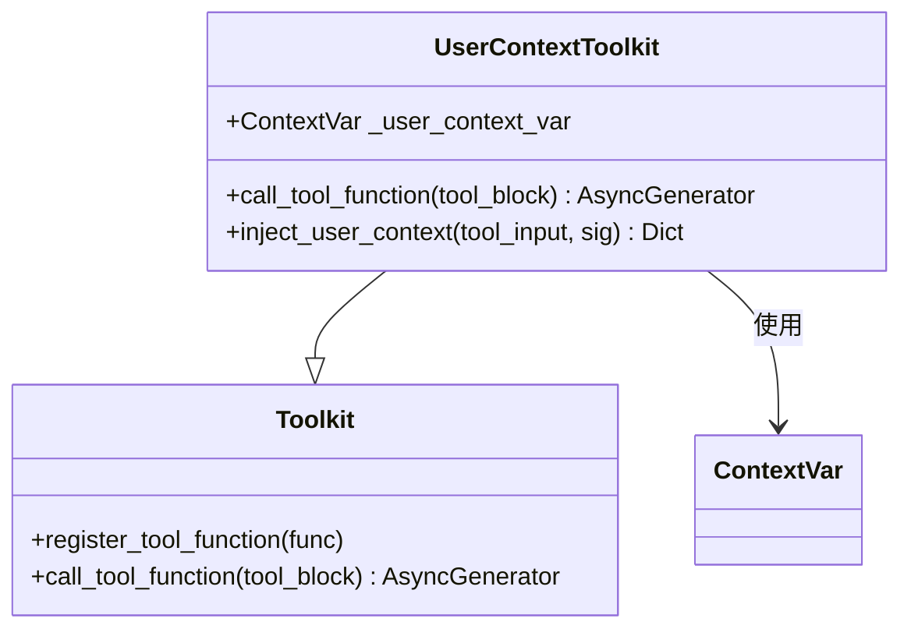

**图表来源**
- [skill_manager.py](file://localmanus-backend/core/skill_manager.py#L17-L67)

#### 线程安全机制

UserContextToolkit 使用 Python 的 contextvars 模块实现线程安全的用户上下文管理：

1. **ContextVar 定义**：`_user_context_var: ContextVar[Optional[Dict]] = ContextVar('user_context', default=None)`
2. **异步任务隔离**：每个异步任务拥有独立的上下文副本
3. **自动清理**：任务完成后自动清理上下文
4. **并发安全**：避免多任务间的数据竞争

#### 用户上下文注入流程

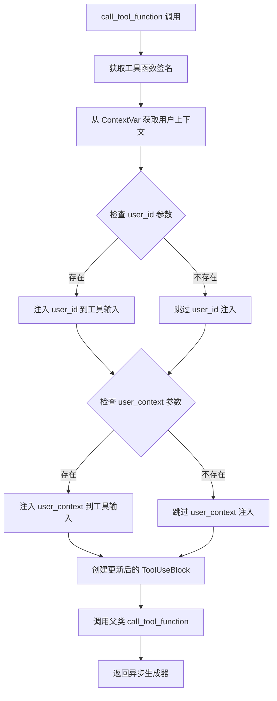

**图表来源**
- [skill_manager.py](file://localmanus-backend/core/skill_manager.py#L23-L67)

**章节来源**
- [skill_manager.py](file://localmanus-backend/core/skill_manager.py#L17-L67)

### 改进的模块加载机制

**更新** 采用 importlib.util.spec_from_file_location 解决目录名问题，增强技能发现和工具注册的可靠性。

#### 加载流程详解

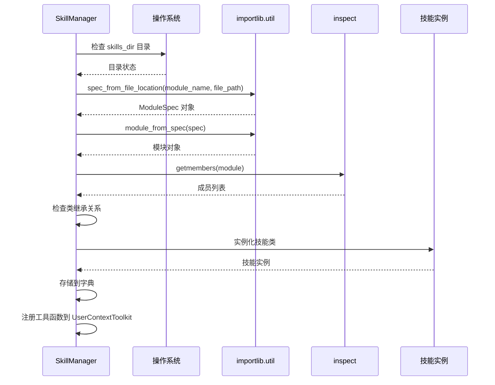

**图表来源**
- [skill_manager.py](file://localmanus-backend/core/skill_manager.py#L124-L149)

#### importlib.util.spec_from_file_location 的优势

**新增** 使用 importlib.util.spec_from_file_location 替代传统的 importlib.import_module 有以下优势：

1. **解决目录名问题**：能够正确处理包含连字符的目录名
2. **直接文件路径加载**：避免模块名限制
3. **更好的错误处理**：提供更清晰的加载错误信息
4. **性能优化**：减少不必要的模块解析步骤

#### 类实例化过程

技能类的实例化遵循以下规则：

1. **继承验证**：仅实例化继承自 BaseSkill 的类
2. **方法过滤**：只注册非私有且有文档字符串的方法
3. **自动注册**：实例化后自动注册到 UserContextToolkit 中
4. **文档字符串**：确保每个工具都有适当的文档说明

**章节来源**
- [skill_manager.py](file://localmanus-backend/core/skill_manager.py#L124-L149)

### 技能注册表数据结构

SkillManager 使用字典作为内部注册表，具有以下特点：

#### 数据结构设计

| 字段 | 类型 | 描述 | 示例 |
|------|------|------|------|
| `skills_dir` | string | 技能目录路径 | `"skills"` |
| `toolkit` | UserContextToolkit | 用户上下文工具包实例 | `UserContextToolkit()` |

#### 缓存机制

SkillManager 实现了基于 AgentScope Toolkit 的智能缓存：
- **类型**：UserContextToolkit 内置缓存机制
- **键**：工具名称
- **值**：工具函数引用
- **生命周期**：进程级缓存，随 Toolkit 实例销毁

**章节来源**
- [skill_manager.py](file://localmanus-backend/core/skill_manager.py#L83-L87)

### _load_skills 方法详细分析

_load_skills 方法实现了完整的技能扫描、加载和注册逻辑：

#### 扫描逻辑

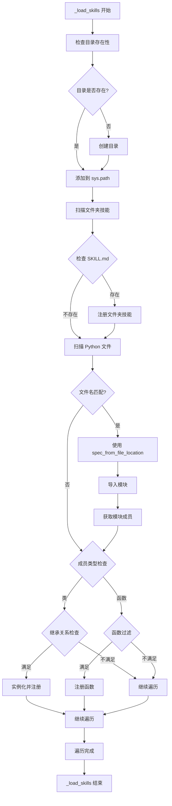

**图表来源**
- [skill_manager.py](file://localmanus-backend/core/skill_manager.py#L89-L149)

#### 异常处理策略

_load_skills 方法采用渐进式异常处理：

1. **模块导入异常**：捕获并记录导入失败的文件
2. **类实例化异常**：捕获并记录实例化失败的类
3. **系统路径异常**：处理 sys.path 修改失败的情况
4. **工具注册异常**：捕获并记录工具注册失败的情况
5. **文件夹技能注册异常**：处理文件夹技能注册失败的情况

#### 错误恢复机制

- **文件级隔离**：单个文件加载失败不影响其他文件
- **模块级容错**：单个模块加载失败不影响其他模块
- **工具级独立**：单个工具注册失败不影响其他工具
- **进度追踪**：通过日志输出加载进度和错误信息

**章节来源**
- [skill_manager.py](file://localmanus-backend/core/skill_manager.py#L89-L149)

### 工具元数据系统

**更新** 工具元数据系统现已集成到 AgentScope 的 UserContextToolkit 中，提供更强大的元数据管理能力。

#### 元数据结构

每个技能工具包含以下元数据：

| 字段 | 类型 | 描述 |
|------|------|------|
| `name` | string | 工具方法名 |
| `description` | string | 工具描述信息 |
| `parameters` | string | 参数签名字符串 |
| `original_func` | callable | 原始函数引用 |

#### 元数据收集机制

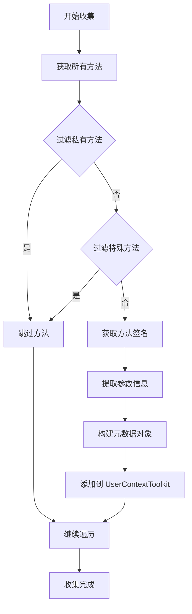

**图表来源**
- [skill_manager.py](file://localmanus-backend/core/skill_manager.py#L133-L146)

**章节来源**
- [skill_manager.py](file://localmanus-backend/core/skill_manager.py#L133-L146)

### 新增技能类分析

**更新** 系统现在包含多种类型的技能类，支持不同的工具操作。

#### FileOperationSkill 技能类

文件操作技能类，提供基本的文件读写和目录操作功能。现在支持 user_id 参数，用于用户特定的文件操作。

#### SystemExecutionSkill 技能类

**新增** 系统工具技能类，支持异步的 Python 代码执行和 Shell 命令执行。现在直接使用 AgentScope 的 execute_python_code 和 execute_shell_command 工具函数。

#### WebSearchSkill 技能类

网络工具技能类，提供网页搜索和内容抓取功能。现在支持 user_id 参数，用于沙箱浏览器的用户特定操作。

#### WeChatFormatterSkill 技能类

**新增** 微信文章格式化技能类，将 Markdown 转换为适合微信公众号的 HTML 格式。支持多种主题样式和自动样式内联。

#### WeChatPublisherSkill 技能类

**新增** 微信草稿发布技能类，支持封面图上传和文章草稿创建。集成微信公众号 API，提供完整的发布流程。

#### WeChatImageGenSkill 技能类

**新增** 微信图片生成技能类，基于 SiliconFlow API 生成高质量图片，特别优化微信封面图生成。

**章节来源**
- [file_ops.py](file://localmanus-backend/skills/file-operations/file_ops.py#L10-L199)
- [system_tools.py](file://localmanus-backend/skills/system-execution/system_tools.py#L6-L78)
- [web_tools.py](file://localmanus-backend/skills/web-search/web_tools.py#L214-L571)
- [wechat_formatter_tools.py](file://localmanus-backend/skills/wechat-article-formatter/wechat_formatter_tools.py#L22-L331)
- [wechat_publisher_tools.py](file://localmanus-backend/skills/wechat-draft-publisher/wechat_publisher_tools.py#L24-L450)
- [wechat_image_tools.py](file://localmanus-backend/skills/wechat-tech-writer/wechat_image_tools.py#L104-L305)

### 文件夹技能结构支持

**新增** 系统现在支持基于文件夹的技能结构，每个技能文件夹包含 SKILL.md 文件。

#### 文件夹技能结构

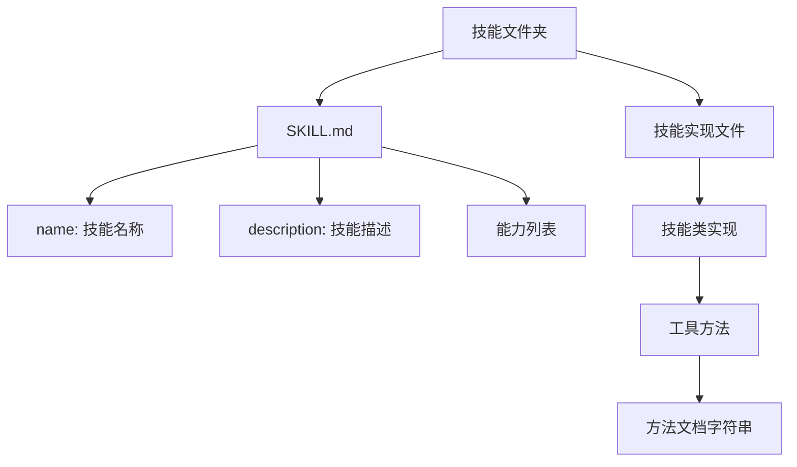

**图表来源**
- [file_ops.py](file://localmanus-backend/skills/file-operations/file_ops.py#L10-L199)
- [system_tools.py](file://localmanus-backend/skills/system-execution/system_tools.py#L6-L78)
- [web_tools.py](file://localmanus-backend/skills/web-search/web_tools.py#L214-L571)
- [SKILL.md](file://localmanus-backend/skills/wechat-draft-publisher/SKILL.md#L1-L198)

**章节来源**
- [file_ops.py](file://localmanus-backend/skills/file-operations/file_ops.py#L10-L199)
- [system_tools.py](file://localmanus-backend/skills/system-execution/system_tools.py#L6-L78)
- [web_tools.py](file://localmanus-backend/skills/web-search/web_tools.py#L214-L571)

## 微信技能生态系统

**新增** 微信技能生态系统为 LocalManus 提供了完整的微信公众号文章处理工作流。

### 微信技能架构

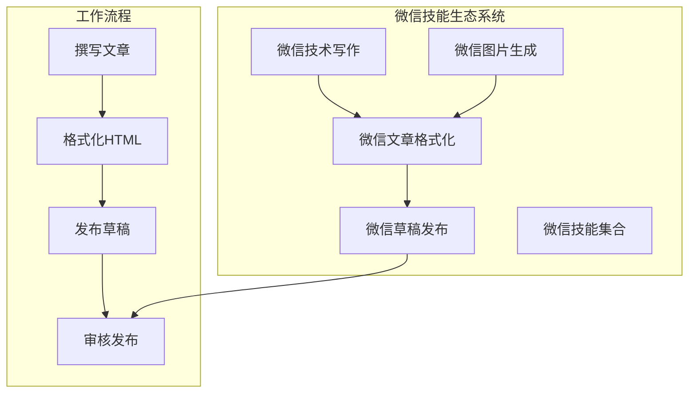

**图表来源**
- [wechat_formatter_tools.py](file://localmanus-backend/skills/wechat-article-formatter/wechat_formatter_tools.py#L22-L331)
- [wechat_publisher_tools.py](file://localmanus-backend/skills/wechat-draft-publisher/wechat_publisher_tools.py#L24-L450)
- [wechat_image_tools.py](file://localmanus-backend/skills/wechat-tech-writer/wechat_image_tools.py#L104-L305)

### WeChatFormatterSkill 详细分析

WeChatFormatterSkill 提供了强大的 Markdown 到 HTML 转换功能：

#### 核心功能

1. **主题系统**：支持科技风、简约风、商务风三种主题
2. **CSS 内联**：自动将外部样式转换为内联样式
3. **代码块增强**：支持语法高亮和语言标识
4. **图片优化**：自动调整图片样式以适应微信显示

#### 主题配置

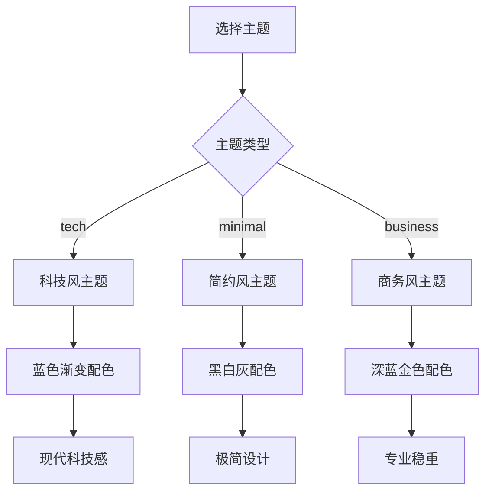

**图表来源**
- [wechat_formatter_tools.py](file://localmanus-backend/skills/wechat-article-formatter/wechat_formatter_tools.py#L37-L54)

#### 自动上下文注入

execute_tool 方法现在支持微信凭证的自动注入：

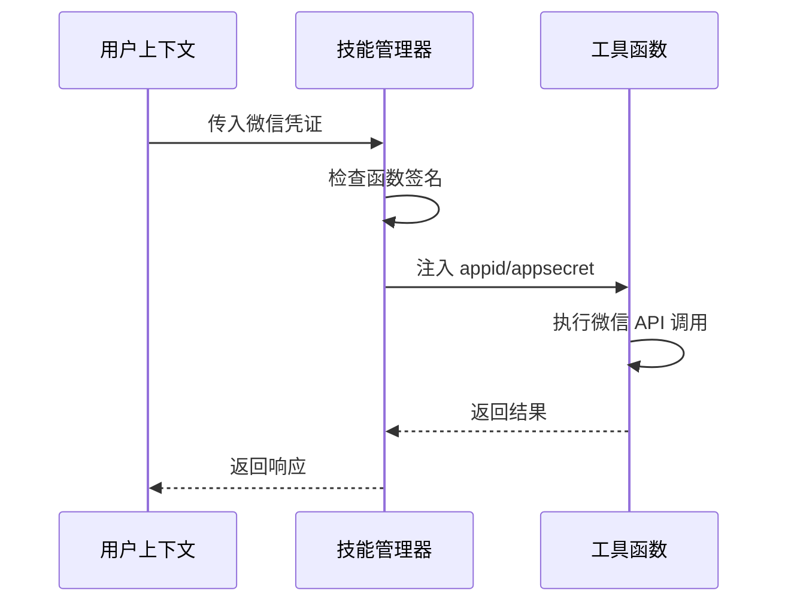

**图表来源**
- [skill_manager.py](file://localmanus-backend/core/skill_manager.py#L179-L208)

### WeChatPublisherSkill 详细分析

WeChatPublisherSkill 提供了完整的微信公众号草稿发布功能：

#### 核心功能

1. **封面图上传**：支持图片压缩和格式转换
2. **草稿创建**：自动生成微信草稿文章
3. **API 管理**：自动管理 access_token 缓存
4. **错误处理**：提供详细的微信 API 错误信息

#### API 集成

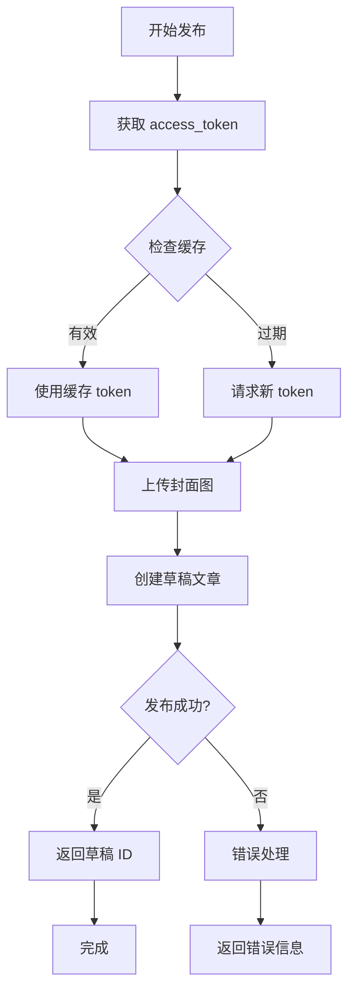

**图表来源**
- [wechat_publisher_tools.py](file://localmanus-backend/skills/wechat-draft-publisher/wechat_publisher_tools.py#L166-L210)

#### 错误处理机制

WeChatPublisherSkill 提供了针对微信 API 错误的详细处理：

| 错误码 | 错误类型 | 解决方案 |
|--------|----------|----------|
| 40001 | AppSecret 错误 | 检查 AppID 和 AppSecret 配置 |
| 40013 | AppID 不合法 | 验证 AppID 格式（wx 开头，18 位） |
| 40164 | IP 不在白名单 | 在微信公众平台添加服务器 IP |
| 45009 | 接口调用超限 | 等待次日或提升配额 |
| 47003 | 参数错误 | 检查必填字段是否完整 |

**章节来源**
- [wechat_formatter_tools.py](file://localmanus-backend/skills/wechat-article-formatter/wechat_formatter_tools.py#L22-L331)
- [wechat_publisher_tools.py](file://localmanus-backend/skills/wechat-draft-publisher/wechat_publisher_tools.py#L24-L450)
- [wechat_image_tools.py](file://localmanus-backend/skills/wechat-tech-writer/wechat_image_tools.py#L104-L305)

## 依赖关系分析

### 外部依赖

**更新** 系统现已完全集成到 AgentScope 生态系统中。

```mermaid
graph TB
subgraph "AgentScope 核心依赖"
AgentScope[agentscope]
Toolkit[Toolkit]
ToolResponse[ToolResponse]
ExecutePythonCode[execute_python_code]
ExecuteShellCommand[execute_shell_command]
ToolUseBlock[ToolUseBlock]
ContextVar[ContextVar]
AsyncGenerator[AsyncGenerator]
end
subgraph "核心依赖"
ImportLib[importlib]
ImportLibUtil[importlib.util]
Inspect[inspect]
OS[os]
Logging[logging]
Typing[typing]
AsyncIO[asyncio]
Requests[requests]
BeautifulSoup[beautifulsoup4]
DDGS[duckduckgo_search]
end
subgraph "微信技能依赖"
Markdown[markdown]
CSSUtils[cssutils]
PIL[Pillow]
SiliconFlow[SiliconFlow API]
end
subgraph "项目内部"
BaseSkill[BaseSkill 基类]
AgentManager[代理管理器]
ReActAgent[ReAct 代理]
Orchestrator[编排器]
end
SkillManager --> AgentScope
SkillManager --> Toolkit
SkillManager --> ToolResponse
SkillManager --> ExecutePythonCode
SkillManager --> ExecuteShellCommand
SkillManager --> ToolUseBlock
SkillManager --> ContextVar
SkillManager --> AsyncGenerator
SkillManager --> ImportLib
SkillManager --> ImportLibUtil
SkillManager --> Inspect
SkillManager --> OS
SkillManager --> Logging
SkillManager --> Typing
SkillManager --> AsyncIO
SkillManager --> Requests
SkillManager --> BeautifulSoup
SkillManager --> DDGS
SkillManager --> BaseSkill
WeChatFormatterSkill --> Markdown
WeChatFormatterSkill --> CSSUtils
WeChatPublisherSkill --> Requests
WeChatPublisherSkill --> PIL
WeChatImageGenSkill --> Requests
WeChatImageGenSkill --> SiliconFlow
ReActAgent --> SkillManager
AgentManager --> SkillManager
Orchestrator --> AgentManager
Main[主应用] --> Orchestrator
```

**图表来源**
- [skill_manager.py](file://localmanus-backend/core/skill_manager.py#L1-L9)
- [requirements.txt](file://localmanus-backend/requirements.txt#L1-L14)
- [wechat_formatter_tools.py](file://localmanus-backend/skills/wechat-article-formatter/wechat_formatter_tools.py#L8-L17)
- [wechat_publisher_tools.py](file://localmanus-backend/skills/wechat-draft-publisher/wechat_publisher_tools.py#L9-L19)
- [wechat_image_tools.py](file://localmanus-backend/skills/wechat-tech-writer/wechat_image_tools.py#L9-L19)

### 内部依赖关系

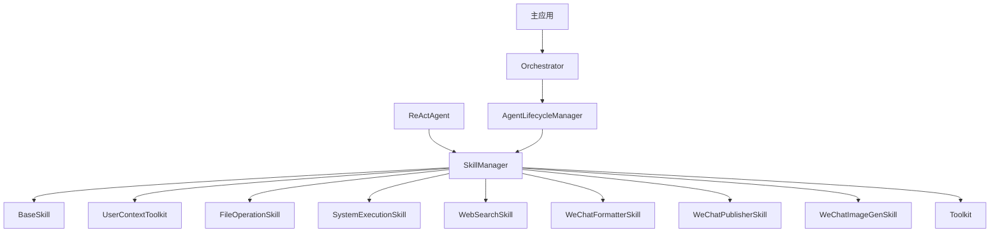

**图表来源**
- [skill_manager.py](file://localmanus-backend/core/skill_manager.py#L1-L259)
- [react_agent.py](file://localmanus-backend/agents/react_agent.py#L1-L250)
- [agent_manager.py](file://localmanus-backend/core/agent_manager.py#L1-L49)
- [orchestrator.py](file://localmanus-backend/core/orchestrator.py#L1-L216)

**章节来源**
- [requirements.txt](file://localmanus-backend/requirements.txt#L1-L14)
- [skill_manager.py](file://localmanus-backend/core/skill_manager.py#L1-L259)

## 性能考虑

### 加载性能优化

1. **懒加载策略**：当前实现为启动时一次性加载，可考虑改为按需加载
2. **并发加载**：可以使用异步方式并行加载多个技能模块
3. **缓存优化**：利用 UserContextToolkit 的内置缓存机制
4. **工具注册优化**：减少重复的工具注册操作
5. **importlib.util.spec_from_file_location 优化**：避免模块名限制带来的性能问题

### 内存使用优化

1. **实例池**：对于无状态技能，可以考虑复用实例
2. **延迟初始化**：仅在首次使用时创建技能实例
3. **资源清理**：提供技能卸载接口
4. **异步资源管理**：优化异步工具的资源使用
5. **ContextVar 内存管理**：合理管理用户上下文的内存占用

### 并发安全

**更新** 系统现已支持异步操作，需要考虑：
- 多线程访问时的锁机制
- 原子性更新操作
- 线程本地存储
- 异步操作的并发安全
- **新增** 基于 contextvars 的线程安全用户上下文管理
- **新增** 异步生成器的内存管理
- **新增** 流式响应的背压处理

### AgentScope 集成优化

1. **工具包缓存**：利用 UserContextToolkit 的内置缓存机制
2. **元数据预处理**：提前生成工具元数据
3. **连接池管理**：优化网络工具的连接管理
4. **文件夹技能缓存**：缓存文件夹技能的元数据
5. **统一工具调用**：使用 UserContextToolkit.call_tool_function 统一异步工具执行
6. **用户上下文缓存**：优化用户上下文的存储和检索
7. **异步生成器优化**：优化异步工具执行的内存使用
8. **流式响应处理**：优化流式工具响应的处理效率

### 微信技能性能优化

**新增** 微信技能生态系统包含以下性能优化：

1. **access_token 缓存**：WeChatPublisherSkill 实现了 7200 秒的 token 缓存
2. **图片压缩优化**：自动压缩超过 2MB 的图片，支持多级质量调整
3. **异步 API 调用**：使用线程池执行阻塞的 HTTP 请求
4. **临时文件管理**：自动清理压缩过程中产生的临时文件
5. **错误重试机制**：对网络请求实施指数退避重试

**章节来源**
- [wechat_publisher_tools.py](file://localmanus-backend/skills/wechat-draft-publisher/wechat_publisher_tools.py#L166-L210)
- [wechat_publisher_tools.py](file://localmanus-backend/skills/wechat-draft-publisher/wechat_publisher_tools.py#L61-L165)

## 故障排除指南

### 常见问题及解决方案

#### 技能加载失败

**症状**：技能未出现在可用技能列表中

**可能原因**：
1. 技能文件不在正确目录
2. 技能类未继承 BaseSkill
3. 技能类名不符合命名规范
4. importlib.util.spec_from_file_location 导入异常
5. 工具注册失败
6. 文件夹技能缺少 SKILL.md 文件

**诊断步骤**：
1. 检查技能文件是否在 `skills/` 目录下
2. 验证技能类是否继承自 BaseSkill
3. 查看控制台错误日志
4. 测试 importlib.util.spec_from_file_location 是否正常
5. 检查 UserContextToolkit 是否正确初始化
6. 验证文件夹技能是否包含 SKILL.md 文件

#### 工具调用失败

**症状**：执行技能工具时报错

**可能原因**：
1. 工具方法名拼写错误
2. 参数类型不匹配
3. 异步方法调用错误
4. AgentScope 工具包配置问题
5. **新增** 用户上下文注入失败
6. UserContextToolkit.call_tool_function 调用异常
7. **新增** ContextVar 访问异常
8. **新增** 异步生成器处理错误

**诊断步骤**：
1. 检查工具名称是否正确
2. 验证参数格式和类型
3. 查看技能类的文档字符串
4. 检查 AgentScope 版本兼容性
5. **新增** 验证用户上下文参数
6. 检查 UserContextToolkit.call_tool_function 的返回值
7. **新增** 检查 ContextVar 的状态
8. **新增** 验证异步生成器的正确处理

#### 用户上下文相关问题

**症状**：用户上下文注入失败或数据丢失

**可能原因**：
1. **新增** ContextVar 设置失败
2. **新增** 异步任务上下文隔离问题
3. **新增** 用户上下文清理不及时
4. **新增** 多个异步任务间的数据竞争

**诊断步骤**：
1. **新增** 检查 set_user_context 方法调用
2. **新增** 验证 ContextVar 的值是否正确设置
3. **新增** 确认异步任务的上下文隔离
4. **新增** 检查 clear_user_context 方法的调用时机

#### 异步工具执行问题

**症状**：异步工具执行异常或响应丢失

**可能原因**：
1. **新增** 异步生成器未正确处理
2. **新增** 流式响应处理错误
3. **新增** 异步工具超时问题
4. **新增** 异步工具中断处理不当

**诊断步骤**：
1. **新增** 检查异步生成器的创建和返回
2. **新增** 验证流式响应的正确处理
3. **新增** 检查异步工具的超时设置
4. **新增** 确认异步工具中断的正确处理

#### 微信技能相关问题

**症状**：微信技能执行失败或返回错误

**可能原因**：
1. **新增** 微信凭证配置错误
2. **新增** access_token 获取失败
3. **新增** 封面图上传格式不支持
4. **新增** 微信 API 调用超限
5. **新增** 服务器 IP 未加入白名单

**诊断步骤**：
1. **新增** 检查 .env 文件中的 SILICONFLOW_API_KEY
2. **新增** 验证微信公众号 AppID 和 AppSecret 配置
3. **新增** 检查图片格式和大小限制
4. **新增** 确认 API 调用配额状态
5. **新增** 验证服务器 IP 白名单设置

#### 目录权限问题

**症状**：无法创建或读取技能目录

**解决方案**：
1. 检查目录权限
2. 确保有足够的磁盘空间
3. 验证路径有效性
4. 检查 AgentScope 的工作目录设置

### 调试技巧

#### 启用详细日志

```python
import logging
logging.basicConfig(level=logging.DEBUG)
```

#### 技能发现调试

```python
# 检查已加载的技能
print("已加载技能:", list(skill_manager.toolkit.tools.keys()))

# 检查工具元数据
for tool_name, tool_info in skill_manager.toolkit.tools.items():
    print(f"{tool_name} 工具:", tool_info)

# 检查 UserContextToolkit 工具
print("UserContextToolkit 工具:", skill_manager.toolkit.get_json_schemas())
```

#### 模块导入调试

```python
# 手动测试模块导入
try:
    import importlib.util
    spec = importlib.util.spec_from_file_location("test", "skills/file_ops.py")
    module = importlib.util.module_from_spec(spec)
    spec.loader.exec_module(module)
    print("模块导入成功")
except Exception as e:
    print(f"模块导入失败: {e}")
```

#### AgentScope 集成调试

```python
# 检查 AgentScope 初始化
import agentscope
agentscope.init()

# 检查工具包状态
print("工具包状态:", skill_manager.toolkit)
print("工具数量:", len(skill_manager.toolkit.tools))

# 检查工具调用
try:
    tool_block = ToolUseBlock(
        type="tool_use",
        id="test",
        name="file_read",
        input={"file_path": "test.txt"}
    )
    response = await skill_manager.toolkit.call_tool_function(tool_block)
    print("工具调用结果:", response)
except Exception as e:
    print(f"工具调用失败: {e}")
```

#### 用户上下文调试

```python
# 检查用户上下文设置
user_context = {"id": 1, "username": "test_user", "wechat": {"appid": "wx123", "appsecret": "secret123"}}
skill_manager.set_user_context(user_context)
print("用户上下文已设置")

# 检查 ContextVar 状态
from contextvars import copy_context
ctx = copy_context()
print("ContextVar 值:", ctx.get(_user_context_var))

# 清理用户上下文
skill_manager.clear_user_context()
print("用户上下文已清理")
```

#### 异步工具调试

```python
# 检查异步工具执行
try:
    tool_name = "python_execute"
    user_context = {"id": 1}
    result = await skill_manager.execute_tool(tool_name, user_context, code="print('Hello World')")
    print("异步工具结果:", result)
except Exception as e:
    print(f"异步工具执行失败: {e}")

# 检查异步生成器处理
try:
    tool_block = ToolUseBlock(
        type="tool_use",
        id="test_async",
        name="python_execute",
        input={"code": "print('Hello World')"}
    )
    gen = await skill_manager.toolkit.call_tool_function(tool_block)
    async for response in gen:
        print("异步响应:", response)
except Exception as e:
    print(f"异步生成器处理失败: {e}")
```

#### 微信技能调试

```python
# 检查微信技能状态
try:
    wechat_context = {
        "id": 1,
        "wechat": {
            "appid": "wx1234567890abcdef",
            "appsecret": "abcdefghijklmnopqrstuvwxyz123456"
        }
    }
    
    # 测试微信凭证注入
    result = await skill_manager.execute_tool(
        "upload_cover_image",
        wechat_context,
        image_path="test.jpg",
        appid="wx1234567890abcdef",
        appsecret="abcdefghijklmnopqrstuvwxyz123456"
    )
    print("微信技能测试结果:", result)
    
except Exception as e:
    print(f"微信技能测试失败: {e}")
```

#### 文件夹技能调试

```python
# 检查文件夹技能注册
import os
for item in os.listdir("skills"):
    item_path = os.path.join("skills", item)
    if os.path.isdir(item_path):
        skill_md = os.path.join(item_path, "SKILL.md")
        if os.path.exists(skill_md):
            print(f"发现文件夹技能: {item}")
```

**章节来源**
- [skill_manager.py](file://localmanus-backend/core/skill_manager.py#L215-L259)
- [skill_manager.py](file://localmanus-backend/core/skill_manager.py#L54-L55)
- [skill_manager.py](file://localmanus-backend/core/skill_manager.py#L87-L88)
- [异步工具调用.py](file://test-agentscope/异步工具调用.py#L1-L49)

## 结论

SkillManager 作为 LocalManus 项目的核心组件，已成功完成了从传统架构到基于 AgentScope 的现代架构的重大升级。其设计具有以下优势：

**更新后的优势**：
1. **现代化集成**：完全集成到 AgentScope 生态系统
2. **动态工具注册**：基于 UserContextToolkit 的动态工具管理
3. **异步支持**：原生支持异步工具执行，使用 UserContextToolkit.call_tool_function 返回异步生成器
4. **智能元数据**：自动化的工具元数据生成
5. **完善日志**：详细的日志记录和错误处理
6. **灵活扩展**：易于添加新的技能类型和工具
7. **importlib.util.spec_from_file_location 优化**：解决目录名问题，增强可靠性
8. **文件夹技能支持**：支持基于文件夹的技能结构
9. **统一工具调用**：使用 UserContextToolkit.call_tool_function 统一异步工具执行
10. **线程安全**：基于 contextvars 的用户上下文注入机制
11. **异步任务隔离**：确保并发请求间的上下文隔离和安全性
12. **用户上下文管理**：提供完整的用户上下文生命周期管理
13. **异步生成器支持**：提供流式的工具响应处理
14. **流式工具执行**：支持异步工具的流式执行和响应
15. **微信技能生态系统**：完整的微信公众号文章处理工作流
16. **自动上下文注入**：支持微信凭证的自动传递和注入

**系统改进**：
- **架构现代化**：从静态工具路由迁移到动态工具注册
- **性能提升**：采用 importlib.util.spec_from_file_location 优化加载性能
- **功能增强**：支持异步操作和复杂工具链
- **开发体验**：更好的工具元数据和调试支持
- **可靠性增强**：改进的错误处理和恢复机制
- **用户上下文集成**：完整的用户上下文注入和管理
- **并发安全**：基于 contextvars 的线程安全机制
- **工具调用统一化**：移除自定义工具执行逻辑，完全依赖 UserContextToolkit
- **异步生成器优化**：优化异步工具执行的内存使用和性能
- **流式响应处理**：提供更好的异步工具响应处理体验
- **微信技能集成**：提供完整的微信公众号处理能力
- **自动凭证管理**：支持微信凭证的自动传递和注入

**未来发展方向**：
- 实现更高效的缓存机制
- 支持按需加载而非一次性加载
- 增强并发安全性
- 提供技能热重载功能
- 优化异步工具的资源管理
- 扩展文件夹技能的功能
- 进一步优化 UserContextToolkit 集成
- **新增** 用户上下文的持久化存储
- **新增** 上下文超时和清理机制
- **新增** 异步生成器的背压处理机制
- **新增** 流式工具执行的监控和调试工具
- **新增** 微信技能的批量处理能力
- **新增** 微信 API 调用的速率限制管理

通过这次重大架构重构，SkillManager 为 LocalManus 项目提供了更加现代化、强大、可靠和安全的技能管理基础，为未来的功能扩展和性能优化奠定了坚实的基础。新增的微信技能生态系统进一步增强了系统的实用性和商业价值，为用户提供了一站式的微信公众号内容创作和发布解决方案。