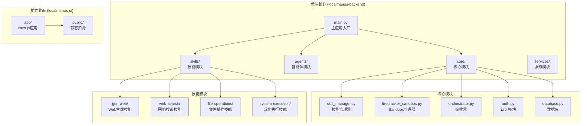
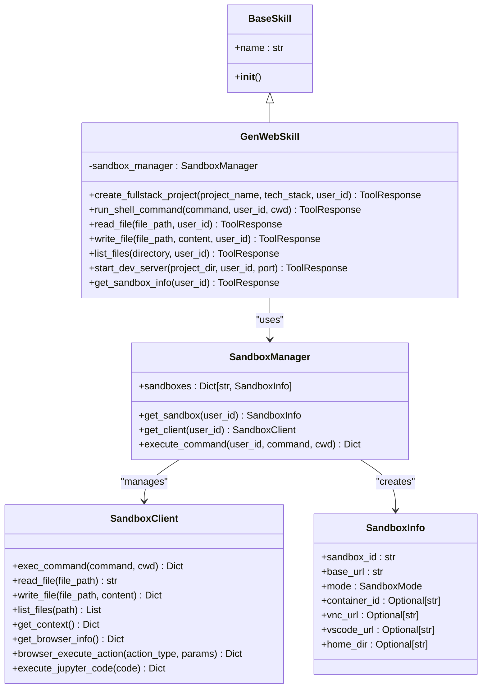
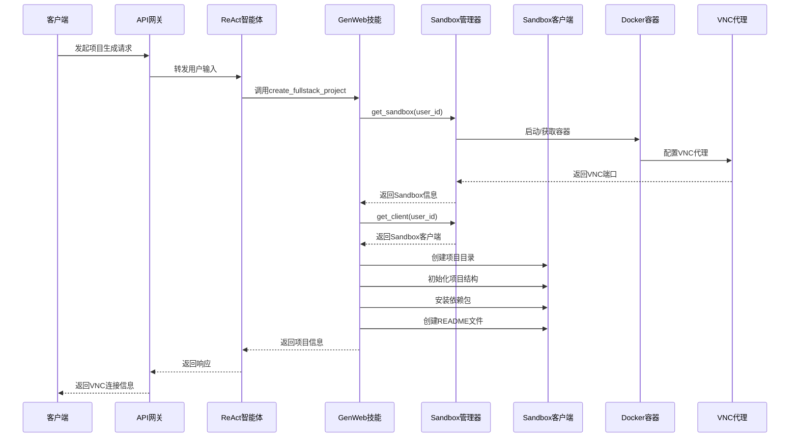
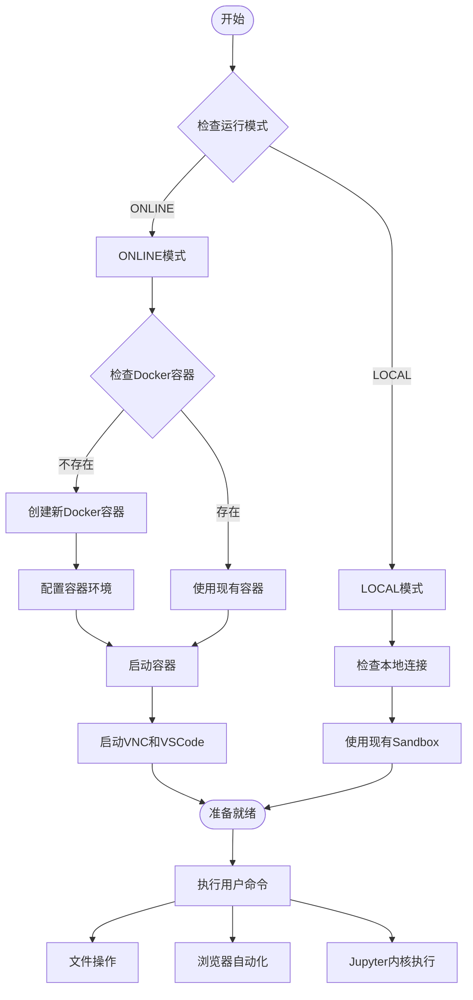
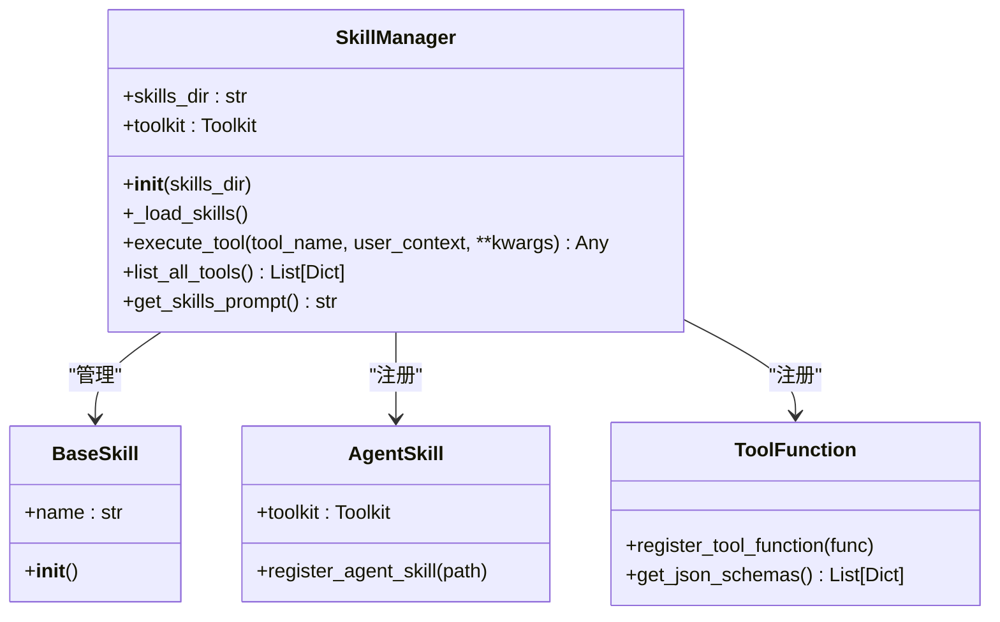
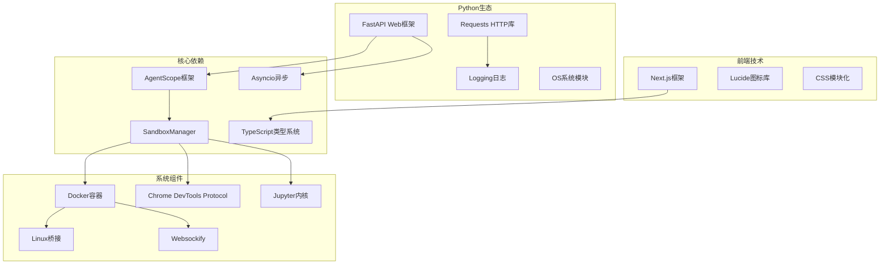
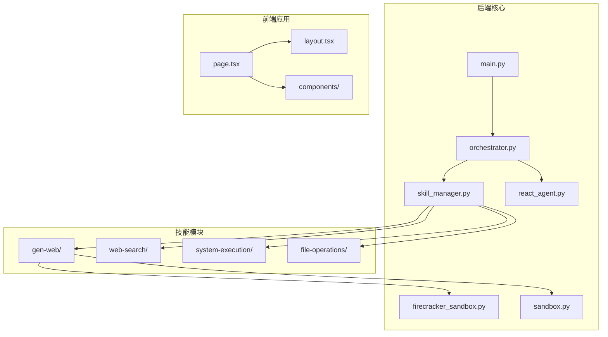
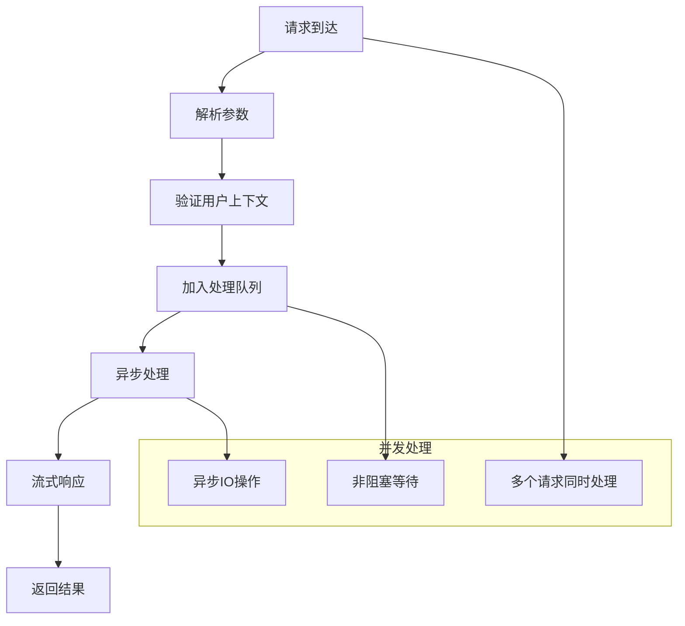
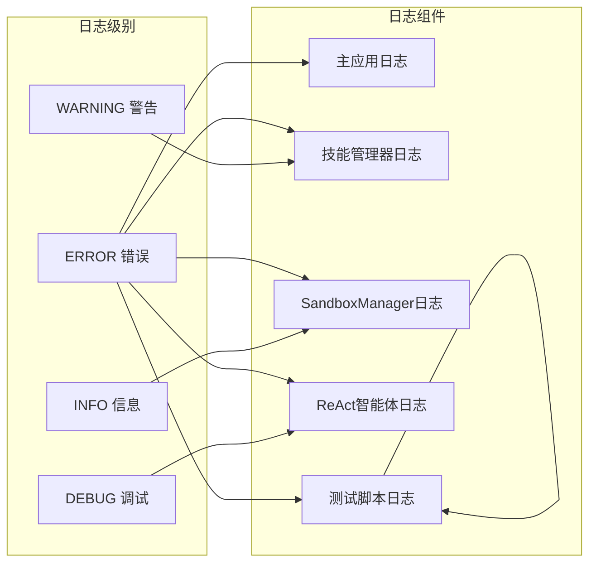

# GenWeb技能

<cite>
**本文档引用的文件**
- [gen_web.py](file://localmanus-backend/skills/gen-web/gen_web.py)
- [SKILL.md](file://localmanus-backend/skills/gen-web/SKILL.md)
- [skill_manager.py](file://localmanus-backend/core/skill_manager.py)
- [firecracker_sandbox.py](file://localmanus-backend/core/firecracker_sandbox.py)
- [sandbox.py](file://localmanus-backend/core/sandbox.py)
- [react_agent.py](file://localmanus-backend/agents/react_agent.py)
- [main.py](file://localmanus-backend/main.py)
- [web_tools.py](file://localmanus-backend/skills/web-search/web_tools.py)
- [system_tools.py](file://localmanus-backend/skills/system-execution/system_tools.py)
- [prompts.py](file://localmanus-backend/core/prompts.py)
- [page.tsx](file://localmanus-ui/app/page.tsx)
- [layout.tsx](file://localmanus-ui/app/layout.tsx)
- [test_gen_web_skill.py](file://localmanus-backend/scripts/test_gen_web_skill.py)
- [test_sandbox.py](file://localmanus-backend/scripts/test_sandbox.py)
</cite>

## 更新摘要
**所做更改**
- 更新了GenWeb技能的架构说明，反映新的SandboxManager集成
- 新增了浏览器自动化和Jupyter内核支持的详细说明
- 增强了开发服务器管理功能的描述
- 添加了新的文件操作方法（read_file、write_file、list_files）
- 更新了安全特性和配置要求
- 新增了完整的测试脚本分析

## 目录
1. [简介](#简介)
2. [项目结构](#项目结构)
3. [核心组件](#核心组件)
4. [架构概览](#架构概览)
5. [详细组件分析](#详细组件分析)
6. [依赖关系分析](#依赖关系分析)
7. [性能考虑](#性能考虑)
8. [故障排除指南](#故障排除指南)
9. [结论](#结论)

## 简介

GenWeb技能是LocalManus系统中的一个核心功能模块，专门用于在现代化的Sandbox环境中生成全栈Web项目。该技能经过重大增强，现在支持更强大的网页生成和自动化能力，包括浏览器自动化、Jupyter内核执行、开发服务器管理和完整的文件操作功能。

该技能遵循AgentScope框架的标准模式，采用统一的SandboxManager进行环境管理，支持LOCAL（共享）和ONLINE（隔离）两种运行模式。通过集成REST API和Docker容器化技术，GenWeb技能为用户提供了安全、可扩展且功能丰富的开发环境。

## 项目结构

LocalManus项目采用分层架构设计，主要包含以下关键目录：



**图表来源**
- [main.py](file://localmanus-backend/main.py#L1-L153)
- [skill_manager.py](file://localmanus-backend/core/skill_manager.py#L1-L143)
- [firecracker_sandbox.py](file://localmanus-backend/core/firecracker_sandbox.py#L1-L170)

**章节来源**
- [main.py](file://localmanus-backend/main.py#L1-L153)
- [skill_manager.py](file://localmanus-backend/core/skill_manager.py#L1-L143)

## 核心组件

### GenWebSkill类

GenWebSkill是GenWeb技能的核心实现，经过重大增强，现在提供以下主要功能：

1. **create_fullstack_project**: 在Sandbox环境中生成完整的全栈Web项目
2. **run_shell_command**: 在用户特定的Sandbox环境中执行shell命令
3. **read_file**: 读取用户Sandbox中的文件内容
4. **write_file**: 向用户Sandbox写入文件内容
5. **list_files**: 列出用户Sandbox中的文件和目录
6. **start_dev_server**: 启动Web项目的开发服务器
7. **get_sandbox_info**: 获取用户Sandbox环境的详细信息

该类的设计完全基于异步编程模式，确保非阻塞的用户体验。通过集成SandboxManager，实现了高效的环境管理和资源隔离。

### SandboxManager类

SandboxManager是新的统一环境管理器，负责管理Sandbox环境的完整生命周期：

- **LOCAL模式**: 连接到现有的本地Sandbox实例
- **ONLINE模式**: 按需启动Docker容器
- VM实例的启动和配置
- 网络接口的设置和管理
- VNC代理和VSCode Server的启动
- 命令执行和文件操作的封装

该类提供了用户级别的隔离，确保每个用户的开发环境相互独立且安全。

### SkillManager类

SkillManager是整个技能系统的管理中心，负责：

- 自动发现和加载技能
- 注册Agent技能和工具函数
- 管理技能的生命周期
- 提供工具调用接口

通过AgentScope的Toolkit模式，SkillManager实现了灵活的技能集成和动态加载机制。

**章节来源**
- [gen_web.py](file://localmanus-backend/skills/gen-web/gen_web.py#L1-L254)
- [firecracker_sandbox.py](file://localmanus-backend/core/firecracker_sandbox.py#L103-L294)
- [skill_manager.py](file://localmanus-backend/core/skill_manager.py#L18-L143)

## 架构概览

LocalManus系统采用现代化的微服务架构，结合了传统Web应用和现代AI Agent技术：

```mermaid
graph TB
subgraph "用户界面层"
UI[Next.js前端应用]
OM[OmniBox组件]
SB[Sidebar组件]
end
subgraph "API网关层"
API[FastAPI后端]
AUTH[认证中间件]
CORS[CORS处理]
end
subgraph "业务逻辑层"
ORCH[编排器]
REACT[ReAct智能体]
SKILL[技能管理器]
END
subgraph "基础设施层"
SM[SandboxManager]
SC[SandboxClient]
VM[Docker容器]
VNC[VNC代理]
VS[VSCODE Server]
BROWSER[浏览器自动化]
JUPYTER[Jupyter内核]
NET[网络桥接]
end
UI --> OM
OM --> API
API --> AUTH
AUTH --> ORCH
ORCH --> REACT
REACT --> SKILL
SKILL --> SM
SM --> SC
SC --> VM
VM --> VNC
VM --> VS
VM --> BROWSER
VM --> JUPYTER
VNC --> NET
VS --> NET
BROWSER --> NET
JUPYTER --> NET
```

**图表来源**
- [main.py](file://localmanus-backend/main.py#L23-L96)
- [react_agent.py](file://localmanus-backend/agents/react_agent.py#L19-L51)
- [skill_manager.py](file://localmanus-backend/core/skill_manager.py#L23-L88)
- [firecracker_sandbox.py](file://localmanus-backend/core/firecracker_sandbox.py#L103-L294)

系统的核心交互流程如下：

1. 用户通过前端界面发起请求
2. FastAPI接收并验证用户身份
3. 编排器协调ReAct智能体执行任务
4. 智能体根据需求选择合适的技能
5. 技能通过SandboxManager执行具体操作
6. 结果通过VNC流媒体和API返回给用户

**章节来源**
- [main.py](file://localmanus-backend/main.py#L81-L96)
- [react_agent.py](file://localmanus-backend/agents/react_agent.py#L53-L118)

## 详细组件分析

### GenWebSkill实现分析

GenWebSkill的实现体现了现代微服务架构的最佳实践，经过重大增强：



**图表来源**
- [gen_web.py](file://localmanus-backend/skills/gen-web/gen_web.py#L8-L254)
- [firecracker_sandbox.py](file://localmanus-backend/core/firecracker_sandbox.py#L103-L294)

#### 方法调用序列图



**图表来源**
- [gen_web.py](file://localmanus-backend/skills/gen-web/gen_web.py#L15-L76)
- [firecracker_sandbox.py](file://localmanus-backend/core/firecracker_sandbox.py#L205-L238)

**章节来源**
- [gen_web.py](file://localmanus-backend/skills/gen-web/gen_web.py#L15-L254)

### SandboxManager架构

SandboxManager提供了现代化的环境管理解决方案：



**图表来源**
- [firecracker_sandbox.py](file://localmanus-backend/core/firecracker_sandbox.py#L103-L294)

#### 网络配置流程

```mermaid
flowchart LR
subgraph "主机系统"
BR[br0桥接]
KVM[/dev/kvm]
DOCKER[Docker守护进程]
end
subgraph "Docker容器"
CONTAINER[Docker容器]
PORT[端口映射 8080->8080]
VNC_PORT[VNC端口映射 6080->6080]
VS_PORT[VSCode端口映射 8081->8081]
end
subgraph "容器内部"
TAP[tap_user TAP设备]
ETH0[eth0网络接口]
VMIP[172.16.x.x VM IP]
end
DOCKER --> CONTAINER
CONTAINER --> PORT
CONTAINER --> VNC_PORT
CONTAINER --> VS_PORT
CONTAINER --> TAP
TAP --> ETH0
ETH0 --> VMIP
```

**图表来源**
- [firecracker_sandbox.py](file://localmanus-backend/core/firecracker_sandbox.py#L137-L203)

**章节来源**
- [firecracker_sandbox.py](file://localmanus-backend/core/firecracker_sandbox.py#L103-L294)

### 技能管理系统

SkillManager实现了灵活的技能发现和加载机制：



**图表来源**
- [skill_manager.py](file://localmanus-backend/core/skill_manager.py#L18-L143)

**章节来源**
- [skill_manager.py](file://localmanus-backend/core/skill_manager.py#L29-L143)

## 依赖关系分析

### 外部依赖

LocalManus系统依赖于多个外部组件和技术栈：



**图表来源**
- [main.py](file://localmanus-backend/main.py#L1-L16)
- [page.tsx](file://localmanus-ui/app/page.tsx#L1-L10)

### 内部模块依赖



**图表来源**
- [main.py](file://localmanus-backend/main.py#L1-L24)
- [skill_manager.py](file://localmanus-backend/core/skill_manager.py#L23-L56)

**章节来源**
- [main.py](file://localmanus-backend/main.py#L1-L153)
- [skill_manager.py](file://localmanus-backend/core/skill_manager.py#L1-L143)

## 性能考虑

### Docker容器性能优化

SandboxManager相比传统虚拟机具有显著的性能优势：

- **启动时间**: 几乎瞬时启动，相比传统VM减少90%以上
- **内存占用**: 每个容器仅需约50-200MB内存
- **CPU开销**: 最小化的容器化开销
- **资源隔离**: 通过Docker cgroups实现精确的资源限制

### 异步处理优化

系统采用全面的异步编程模型提升并发处理能力：



**图表来源**
- [react_agent.py](file://localmanus-backend/agents/react_agent.py#L53-L118)
- [skill_manager.py](file://localmanus-backend/core/skill_manager.py#L90-L134)

### 缓存策略

系统实现了多层次的缓存机制：

1. **Sandbox实例缓存**: 用户Sandbox实例的内存缓存
2. **技能元数据缓存**: 已注册技能的元数据缓存
3. **响应缓存**: 常见查询结果的缓存
4. **Docker容器重用**: 相同用户ID的容器复用

**章节来源**
- [react_agent.py](file://localmanus-backend/agents/react_agent.py#L53-L118)
- [skill_manager.py](file://localmanus-backend/core/skill_manager.py#L90-L134)

## 故障排除指南

### 常见问题及解决方案

#### SandboxManager初始化失败

**症状**: 无法创建或连接Sandbox环境

**可能原因**:
1. Docker守护进程未运行
2. 网络连接问题
3. 权限不足
4. 镜像拉取失败

**解决步骤**:
1. 检查Docker状态: `systemctl status docker`
2. 验证网络连接: `ping 8.8.8.8`
3. 检查权限: `sudo usermod -aG docker $USER`
4. 拉取镜像: `docker pull ghcr.io/agent-infra/sandbox:latest`

#### VNC连接问题

**症状**: 无法通过VNC访问开发环境

**可能原因**:
1. VNC代理未正确启动
2. 端口冲突
3. 防火墙阻止连接

**诊断命令**:
```bash
# 检查Docker容器状态
docker ps -a

# 检查端口占用
netstat -tulpn | grep 6080

# 查看容器日志
docker logs container_name

# 测试VNC连接
telnet localhost 6080
```

#### 技能加载失败

**症状**: GenWeb技能无法被识别

**排查步骤**:
1. 检查SKILL.md文件格式
2. 验证Python语法正确性
3. 确认文件路径正确
4. 检查依赖库安装

**章节来源**
- [firecracker_sandbox.py](file://localmanus-backend/core/firecracker_sandbox.py#L127-L135)
- [SKILL.md](file://localmanus-backend/skills/gen-web/SKILL.md#L197-L214)

### 日志分析

系统提供了详细的日志记录机制：



**图表来源**
- [main.py](file://localmanus-backend/main.py#L18-L20)
- [skill_manager.py](file://localmanus-backend/core/skill_manager.py#L8-L8)
- [firecracker_sandbox.py](file://localmanus-backend/core/firecracker_sandbox.py#L13-L13)

**章节来源**
- [main.py](file://localmanus-backend/main.py#L18-L20)
- [skill_manager.py](file://localmanus-backend/core/skill_manager.py#L8-L8)

## 结论

GenWeb技能经过重大增强，作为LocalManus系统的核心功能模块，成功地将现代化的Docker容器化技术和AI智能体相结合，为用户提供了安全、高效、功能丰富的Web开发环境。

### 主要优势

1. **安全性**: 每个用户拥有独立的Docker容器环境，确保完全的资源隔离
2. **性能**: Docker容器提供接近原生的性能表现
3. **可扩展性**: 支持动态的容器管理和资源分配
4. **易用性**: 通过标准化的技能接口简化了复杂的底层操作
5. **功能丰富**: 支持浏览器自动化、Jupyter内核执行、文件操作等高级功能

### 技术创新点

- **统一SandboxManager**: 统一管理LOCAL和ONLINE两种运行模式
- **异步架构**: 全面采用异步编程模型提升系统吞吐量
- **智能体集成**: ReAct智能体与技能系统的深度集成
- **可视化开发**: VNC流媒体和VSCode Server提供直观的开发体验
- **标准化设计**: 遵循AgentScope标准的技能开发模式
- **浏览器自动化**: 支持Playwright/CDP协议的GUI自动化
- **Jupyter内核**: 提供Python代码执行环境

### 未来发展方向

1. **容器编排**: 考虑引入Kubernetes进行大规模容器管理
2. **GPU加速**: 支持GPU密集型应用的开发需求
3. **多语言支持**: 扩展对更多编程语言和框架的支持
4. **自动化测试**: 集成CI/CD流水线支持
5. **监控告警**: 增强系统监控和性能分析能力
6. **API扩展**: 提供更丰富的REST API接口

GenWeb技能不仅展示了现代软件架构的最佳实践，更为AI驱动的开发工具生态系统树立了新的标杆。其强大的功能集和优雅的架构设计使其成为企业级Web开发平台的理想选择。