# SystemExecutionSkill 系统执行技能

<cite>
**本文档引用的文件**
- [system_tools.py](file://localmanus-backend/skills/system_tools.py)
- [skill_manager.py](file://localmanus-backend/core/skill_manager.py)
- [base_agents.py](file://localmanus-backend/agents/base_agents.py)
- [orchestrator.py](file://localmanus-backend/core/orchestrator.py)
- [main.py](file://localmanus-backend/main.py)
- [requirements.txt](file://localmanus-backend/requirements.txt)
- [config.py](file://localmanus-backend/core/config.py)
- [test_orchestration.py](file://localmanus-backend/scripts/test_orchestration.py)
- [localmanus_architecture.md](file://localmanus_architecture.md)
- [system-execution/SKILL.md](file://localmanus-backend/skills/system-execution/SKILL.md)
- [skills/README.md](file://localmanus-backend/skills/README.md)
</cite>

## 更新摘要
**变更内容**
- 类名标准化：SystemTools → SystemExecutionSkill
- 方法名标准化：run_python → python_execute，run_shell → shell_execute
- 新增兼容性包装类：SystemTools 作为向后兼容层
- 目录结构调整：system-tools → system-execution
- 技能注册机制升级：支持文件夹式技能和传统 Python 技能

## 目录
1. [简介](#简介)
2. [项目结构](#项目结构)
3. [核心组件](#核心组件)
4. [架构概览](#架构概览)
5. [详细组件分析](#详细组件分析)
6. [依赖关系分析](#依赖关系分析)
7. [性能考虑](#性能考虑)
8. [故障排除指南](#故障排除指南)
9. [结论](#结论)

## 简介

SystemExecutionSkill 是 LocalManus 系统中的关键技能模块，专门负责执行系统级操作，包括 Python 代码执行和 Shell 命令执行。该技能模块基于标准化的 AgentScope 框架构建，提供了异步执行能力，支持在受控环境中安全地执行各种系统操作。

SystemExecutionSkill 作为 LocalManus 动态多智能体系统的一部分，与其他技能模块（如文件操作、网络工具等）协同工作，为用户提供完整的自动化解决方案。该模块的设计遵循了最小权限原则和安全隔离理念，确保系统操作的安全性和可控性。

**重要更新**：该模块现已标准化重命名，提供更清晰的命名约定和向后兼容的包装类支持。

## 项目结构

LocalManus 项目采用模块化架构设计，SystemExecutionSkill 技能位于技能库目录中，与核心框架紧密集成。技能结构现已标准化为文件夹式组织：

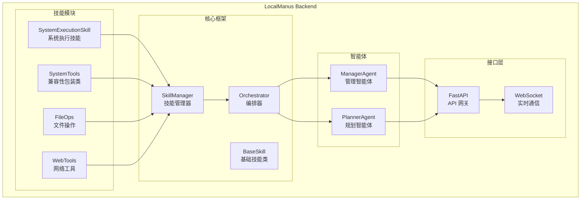

**图表来源**
- [system_tools.py](file://localmanus-backend/skills/system_tools.py#L6-L41)
- [skill_manager.py](file://localmanus-backend/core/skill_manager.py#L142-L179)
- [main.py](file://localmanus-backend/main.py#L1-L98)

**章节来源**
- [system_tools.py](file://localmanus-backend/skills/system_tools.py#L1-L78)
- [skill_manager.py](file://localmanus-backend/core/skill_manager.py#L1-L292)
- [main.py](file://localmanus-backend/main.py#L1-L98)

## 核心组件

SystemExecutionSkill 技能模块的核心组件包括基础技能类、技能管理器和异步执行机制。这些组件共同构成了一个功能完整、安全可靠的系统操作框架。

### 技能类层次结构

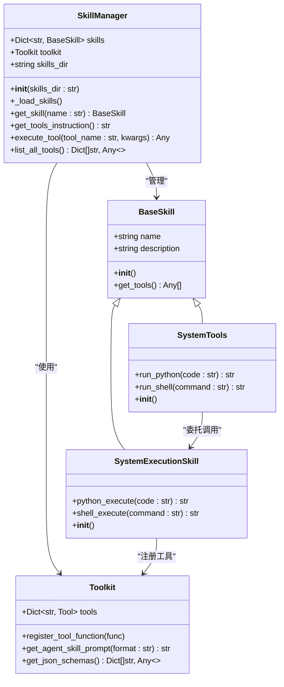

**图表来源**
- [system_tools.py](file://localmanus-backend/skills/system_tools.py#L6-L78)
- [skill_manager.py](file://localmanus-backend/core/skill_manager.py#L12-L179)

### 异步执行流程

SystemExecutionSkill 提供了两种主要的系统操作能力，都采用了异步执行模式：

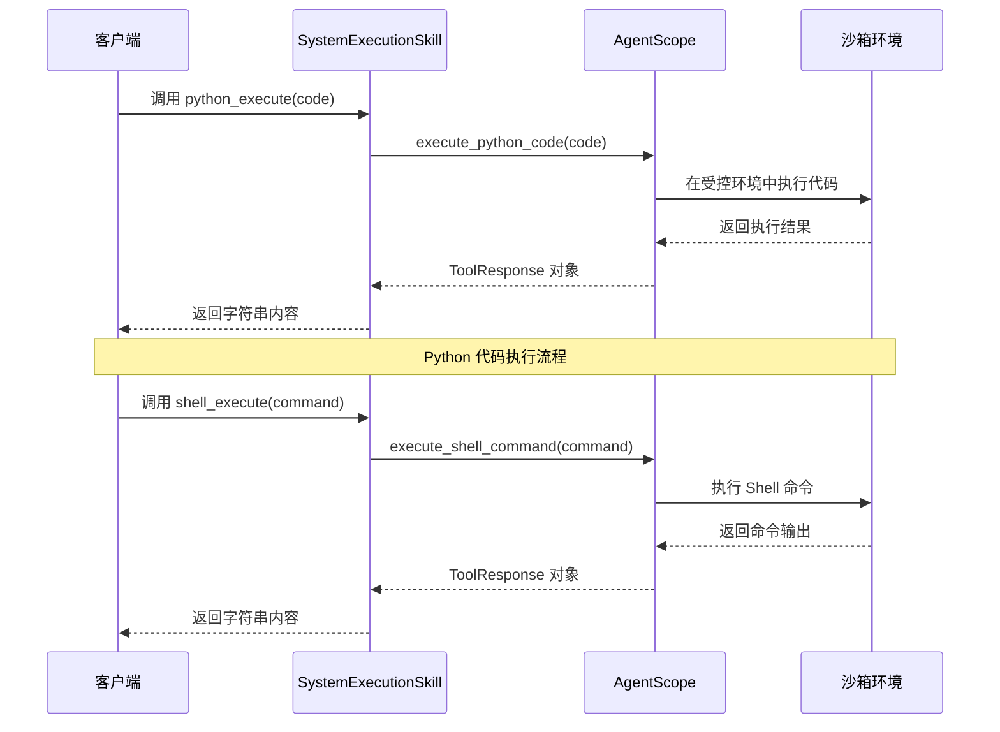

**图表来源**
- [system_tools.py](file://localmanus-backend/skills/system_tools.py#L16-L41)
- [skill_manager.py](file://localmanus-backend/core/skill_manager.py#L257-L284)

**章节来源**
- [system_tools.py](file://localmanus-backend/skills/system_tools.py#L1-L78)
- [skill_manager.py](file://localmanus-backend/core/skill_manager.py#L1-L292)

## 架构概览

SystemExecutionSkill 技能模块在整个 LocalManus 架构中扮演着关键角色，它与 AgentScope 框架深度集成，形成了一个完整的动态多智能体系统。

### 系统架构图

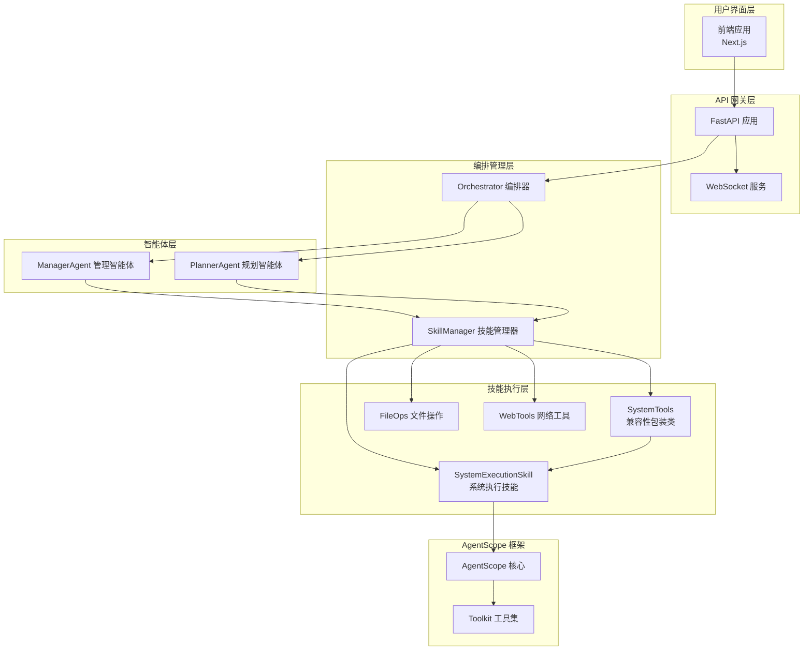

**图表来源**
- [main.py](file://localmanus-backend/main.py#L1-L98)
- [orchestrator.py](file://localmanus-backend/core/orchestrator.py#L11-L119)
- [skill_manager.py](file://localmanus-backend/core/skill_manager.py#L142-L179)

### 技能注册与发现机制

SystemExecutionSkill 技能通过 SkillManager 自动注册到 AgentScope 的工具集中，实现了动态技能发现和调用。新版本支持两种技能类型：

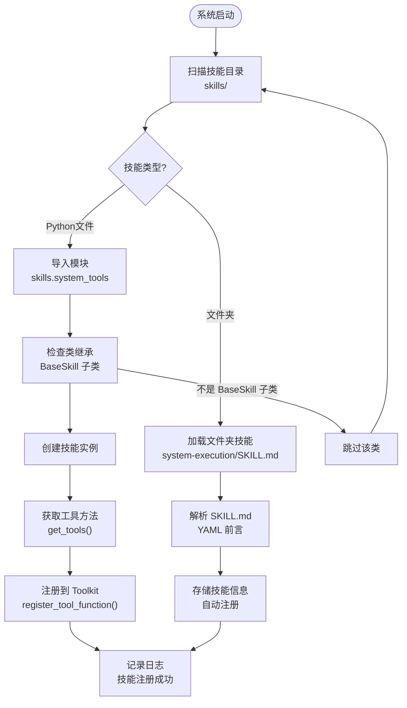

**图表来源**
- [skill_manager.py](file://localmanus-backend/core/skill_manager.py#L149-L230)

**章节来源**
- [main.py](file://localmanus-backend/main.py#L1-L98)
- [orchestrator.py](file://localmanus-backend/core/orchestrator.py#L1-L119)
- [skill_manager.py](file://localmanus-backend/core/skill_manager.py#L1-L292)

## 详细组件分析

### SystemExecutionSkill 类实现

SystemExecutionSkill 类是系统执行技能的核心实现，提供了两个主要的异步方法来执行系统操作。

#### 方法实现分析

| 方法名 | 参数类型 | 返回类型 | 功能描述 |
|--------|----------|----------|----------|
| python_execute | str | str | 异步执行 Python 代码，需要使用 print() 输出结果 |
| shell_execute | str | str | 异步执行 Shell 命令，返回命令执行结果 |

#### 异步执行机制

SystemExecutionSkill 使用 asyncio 来实现异步执行，这使得多个系统操作可以并发执行而不阻塞主线程：

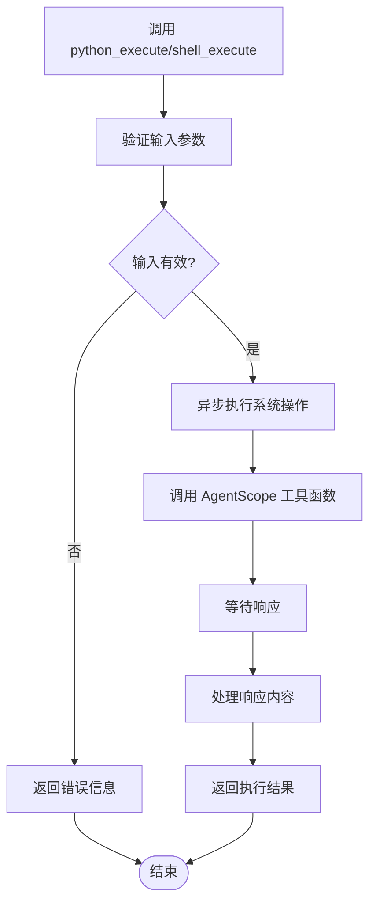

**图表来源**
- [system_tools.py](file://localmanus-backend/skills/system_tools.py#L16-L41)

**章节来源**
- [system_tools.py](file://localmanus-backend/skills/system_tools.py#L1-L78)

### 兼容性包装类 SystemTools

为了保持向后兼容性，新增了 SystemTools 包装类，它委托给 SystemExecutionSkill 实例：

#### 兼容性设计

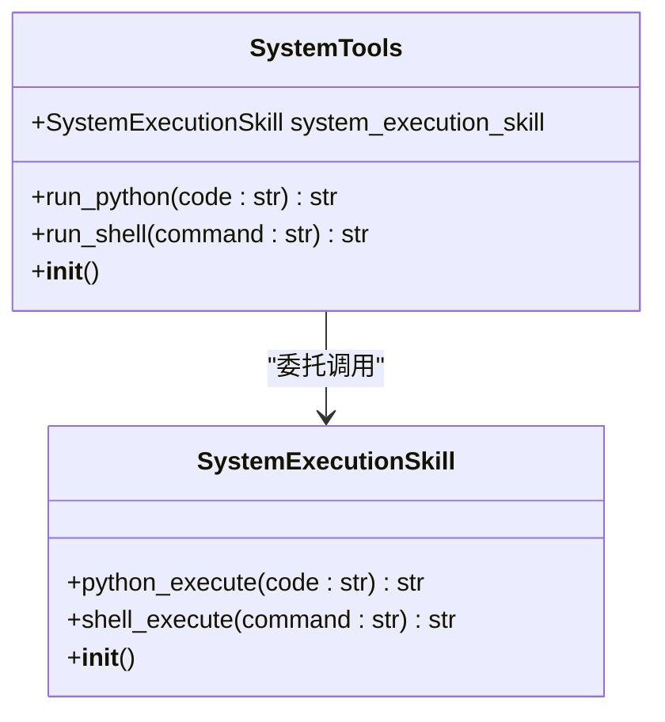

**图表来源**
- [system_tools.py](file://localmanus-backend/skills/system_tools.py#L44-L78)

#### 向后兼容策略

| 方法名 | 新版本方法 | 兼容性处理 |
|--------|------------|------------|
| run_python | python_execute | 直接委托调用 |
| run_shell | shell_execute | 直接委托调用 |
| 描述信息 | 标准化文档 | 保持兼容性说明 |

**章节来源**
- [system_tools.py](file://localmanus-backend/skills/system_tools.py#L44-L78)

### 技能管理器集成

SystemExecutionSkill 通过继承 BaseSkill 基类，自动获得了技能管理器的完整支持。

#### 技能元数据管理

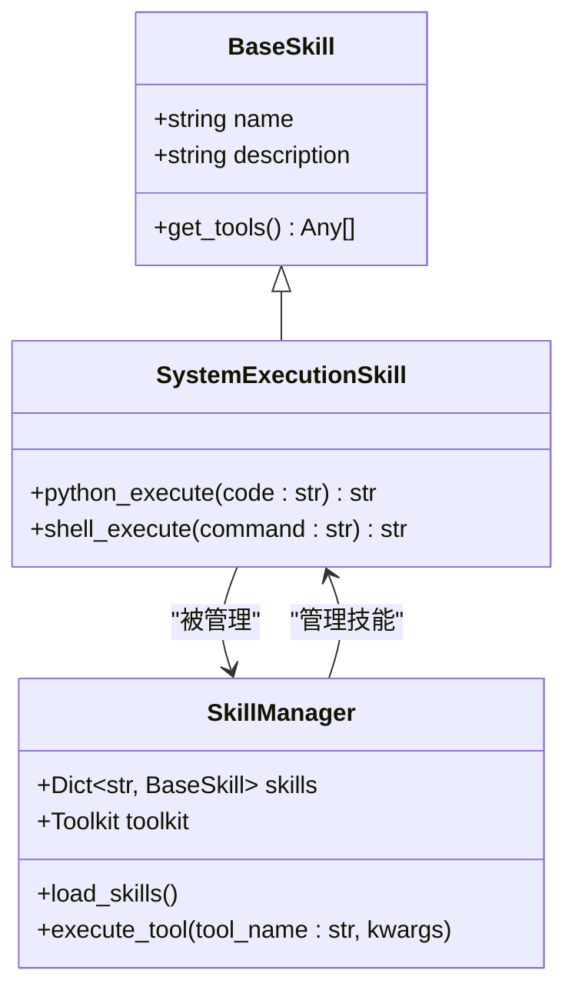

**图表来源**
- [skill_manager.py](file://localmanus-backend/core/skill_manager.py#L12-L179)

#### 工具注册流程

SystemExecutionSkill 的工具注册过程如下：

1. **自动发现**：SkillManager 扫描 skills 目录下的所有 Python 文件
2. **类加载**：动态导入模块并查找 BaseSkill 的子类
3. **实例创建**：为每个技能类创建实例
4. **方法提取**：通过反射机制获取所有公共方法
5. **工具注册**：将方法注册到 AgentScope 的 Toolkit 中

**章节来源**
- [skill_manager.py](file://localmanus-backend/core/skill_manager.py#L1-L292)

### AgentScope 集成

SystemExecutionSkill 与 AgentScope 框架的深度集成体现在以下几个方面：

#### 工具函数包装

SystemExecutionSkill 使用 AgentScope 提供的工具函数来执行实际的系统操作：

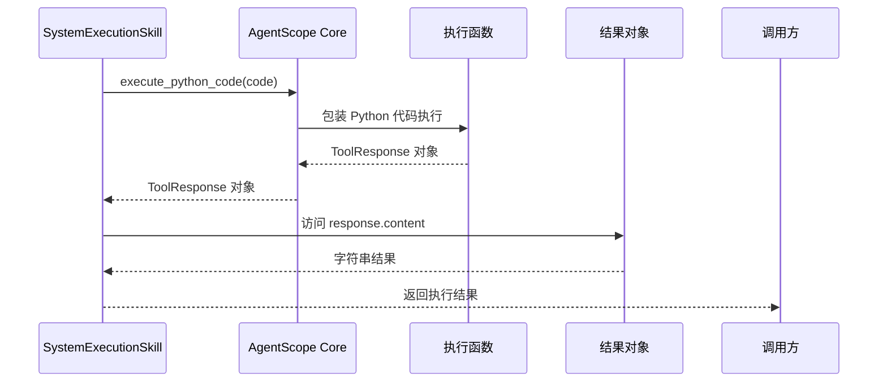

**图表来源**
- [system_tools.py](file://localmanus-backend/skills/system_tools.py#L27-L28)

#### 错误处理机制

SystemExecutionSkill 实现了完善的错误处理机制，确保系统操作的稳定性和可靠性：

| 错误类型 | 处理方式 | 用户反馈 |
|----------|----------|----------|
| 语法错误 | 捕获异常并返回错误信息 | "Error: 语法错误详情" |
| 运行时错误 | 捕获异常并返回错误信息 | "Error: 运行时错误详情" |
| 超时错误 | 捕获异常并返回超时信息 | "Error: 执行超时" |
| 权限错误 | 捕获异常并返回权限信息 | "Error: 权限不足" |

**章节来源**
- [system_tools.py](file://localmanus-backend/skills/system_tools.py#L1-L78)

## 依赖关系分析

SystemExecutionSkill 技能模块的依赖关系相对简单但功能明确，主要依赖于 AgentScope 框架提供的工具执行能力。

### 外部依赖

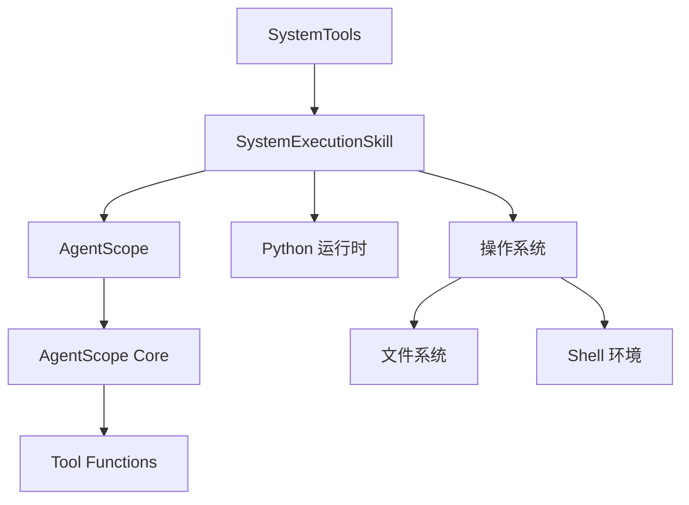

**图表来源**
- [system_tools.py](file://localmanus-backend/skills/system_tools.py#L1-L3)
- [requirements.txt](file://localmanus-backend/requirements.txt#L1-L11)

### 内部依赖

SystemExecutionSkill 与 LocalManus 系统其他组件的依赖关系：

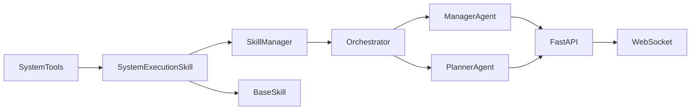

**图表来源**
- [skill_manager.py](file://localmanus-backend/core/skill_manager.py#L1-L292)
- [orchestrator.py](file://localmanus-backend/core/orchestrator.py#L1-L119)
- [base_agents.py](file://localmanus-backend/agents/base_agents.py#L1-L42)
- [main.py](file://localmanus-backend/main.py#L1-L98)

**章节来源**
- [requirements.txt](file://localmanus-backend/requirements.txt#L1-L11)
- [skill_manager.py](file://localmanus-backend/core/skill_manager.py#L1-L292)
- [orchestrator.py](file://localmanus-backend/core/orchestrator.py#L1-L119)

## 性能考虑

SystemExecutionSkill 技能模块在设计时充分考虑了性能优化和资源管理：

### 异步执行优势

1. **非阻塞操作**：使用 asyncio 实现异步执行，避免阻塞主线程
2. **并发处理**：支持多个系统操作同时执行
3. **资源利用率**：提高 CPU 和内存资源的利用效率

### 内存管理

1. **响应式处理**：及时释放中间结果和临时变量
2. **输出限制**：对长输出进行截断，避免内存溢出
3. **连接复用**：复用 AgentScope 的连接池

### 安全性考虑

1. **权限控制**：通过 AgentScope 框架限制执行权限
2. **超时保护**：设置合理的执行超时时间
3. **输出验证**：验证和清理执行结果

## 故障排除指南

### 常见问题及解决方案

#### Python 代码执行问题

| 问题症状 | 可能原因 | 解决方案 |
|----------|----------|----------|
| 代码无输出 | 没有使用 print() 函数 | 添加 print() 输出语句 |
| 语法错误 | Python 语法不正确 | 检查代码语法和缩进 |
| 运行时错误 | 代码逻辑错误 | 使用 try-except 捕获异常 |
| 超时错误 | 代码执行时间过长 | 优化算法或增加超时时间 |

#### Shell 命令执行问题

| 问题症状 | 可能原因 | 解决方案 |
|----------|----------|----------|
| 命令不存在 | 路径配置错误 | 检查 PATH 环境变量 |
| 权限不足 | 权限不够 | 使用 sudo 或调整权限 |
| 命令超时 | 系统负载过高 | 优化命令或减少并发 |
| 输出过大 | 内存不足 | 分批处理或增加内存 |

### 调试技巧

1. **启用详细日志**：查看 AgentScope 的详细执行日志
2. **简化测试**：使用简单的代码片段进行测试
3. **逐步调试**：将复杂任务分解为简单步骤
4. **监控资源**：观察系统资源使用情况

### 向后兼容性问题

由于引入了 SystemTools 包装类，可能出现以下兼容性问题：

| 问题症状 | 可能原因 | 解决方案 |
|----------|----------|----------|
| 导入错误 | 旧代码使用 SystemTools | 更新导入路径为 SystemExecutionSkill |
| 方法调用失败 | 旧方法名不再支持 | 使用 python_execute 和 shell_execute |
| 功能差异 | 包装类与新类的细微差别 | 检查文档并更新代码 |

**章节来源**
- [system_tools.py](file://localmanus-backend/skills/system_tools.py#L16-L41)
- [skill_manager.py](file://localmanus-backend/core/skill_manager.py#L257-L284)

## 结论

SystemExecutionSkill 系统执行技能模块是 LocalManus 动态多智能体系统的重要组成部分，它提供了安全、可靠的系统操作能力。通过与 AgentScope 框架的深度集成，SystemExecutionSkill 实现了异步执行、自动注册和统一管理等功能。

**重要更新**：该模块现已标准化重命名，提供更清晰的命名约定和向后兼容的包装类支持。新版本的设计体现了现代软件架构的最佳实践：

- **模块化设计**：清晰的职责分离和接口定义
- **异步编程**：高效的并发处理能力
- **安全隔离**：通过 AgentScope 框架实现受控执行
- **自动管理**：动态技能发现和注册机制
- **向后兼容**：通过包装类确保现有代码正常运行
- **标准化命名**：统一的方法命名约定

SystemExecutionSkill 为 LocalManus 系统提供了强大的系统操作能力，是实现复杂自动化任务的基础支撑。随着 LocalManus 系统的不断发展，SystemExecutionSkill 也将持续演进，为用户提供更加丰富和强大的系统操作功能。

**使用建议**：
- 新项目应直接使用 SystemExecutionSkill 类
- 现有项目可继续使用 SystemTools 包装类，但建议逐步迁移到新类名
- 所有方法调用应使用标准化的方法名：python_execute 和 shell_execute