# WebTools 网络工具技能

<cite>
**本文档中引用的文件**
- [web_tools.py](file://localmanus-backend/skills/web-search/web_tools.py)
- [SKILL.md](file://localmanus-backend/skills/web-search/SKILL.md)
- [skill_manager.py](file://localmanus-backend/core/skill_manager.py)
- [firecracker_sandbox.py](file://localmanus-backend/core/firecracker_sandbox.py)
- [react_agent.py](file://localmanus-backend/agents/react_agent.py)
- [orchestrator.py](file://localmanus-backend/core/orchestrator.py)
- [main.py](file://localmanus-backend/main.py)
- [requirements.txt](file://localmanus-backend/requirements.txt)
- [.env.example](file://localmanus-backend/.env.example)
- [page.tsx](file://localmanus-ui/app/page.tsx)
</cite>

## 更新摘要
**变更内容**
- WebTools 类标准化重命名为 WebSearchSkill，提供更清晰的类名语义
- 方法名标准化为 search_web、scrape_web 和 browser_screenshot，符合统一命名规范
- 新增兼容性包装类 WebTools，保持向后兼容性
- **完全重构为Playwright/CDP直接浏览器自动化**：从REST API方式重构为直接Playwright/CDP浏览器控制
- **新增浏览器控制方法**：browser_click、browser_type、browser_scroll，支持元素点击、文本输入和页面滚动
- **增强错误处理和状态检查功能**：新增check_browser_status方法，提供浏览器状态检查能力
- **智能CDP URL解析**：新增_get_cdp_url函数，支持从容器浏览器信息API和沙箱基础URL智能解析CDP WebSocket URL
- **改进的结果解析**：新增Baidu搜索引擎支持，改进的搜索结果解析器

## 目录
1. [简介](#简介)
2. [项目结构](#项目结构)
3. [核心组件](#核心组件)
4. [架构概览](#架构概览)
5. [WebSearchSkill 详细分析](#websearchskill-详细分析)
6. [技能管理机制](#技能管理机制)
7. [ReAct 推理循环](#react-推理循环)
8. [前端集成](#前端集成)
9. [依赖关系分析](#依赖关系分析)
10. [性能考虑](#性能考虑)
11. [故障排除指南](#故障排除指南)
12. [结论](#结论)

## 简介

WebSearchSkill 是 LocalManus 项目中的一个专门技能模块，负责处理网络相关的操作，包括网页搜索、内容抓取和页面截图。该技能基于沙箱化的Chrome浏览器实例，使用**Playwright连接Chrome DevTools Protocol (CDP)**直接驱动真实的Chromium实例，绕过机器人检测机制，提供更可靠的网络信息检索能力。WebSearchSkill 作为 AgentScope 框架的一部分，能够被 ReAct 推理代理自动调用，为用户提供智能化的网络信息检索能力。

**更新** 完全重构为Playwright/CDP直接浏览器自动化方式，新增浏览器控制方法，提供更简洁的架构和更强的功能。

## 项目结构

LocalManus 采用前后端分离的架构设计，主要包含以下关键目录：

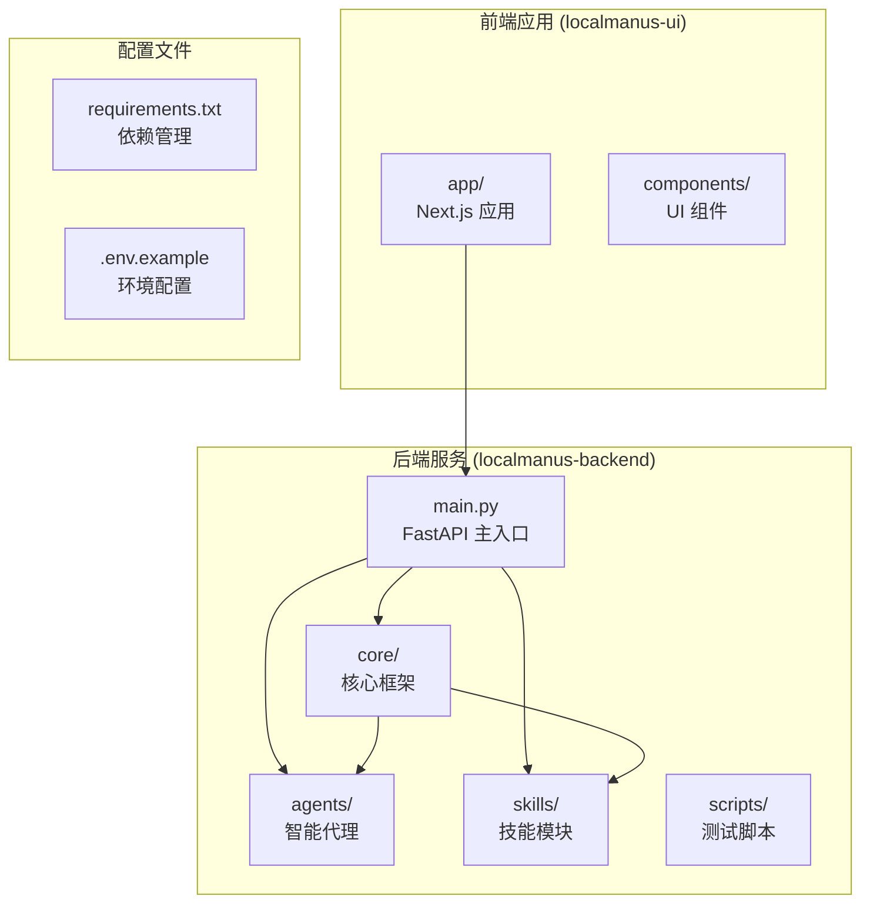

**图表来源**
- [main.py](file://localmanus-backend/main.py#L1-L519)
- [requirements.txt](file://localmanus-backend/requirements.txt#L1-L15)

**章节来源**
- [main.py](file://localmanus-backend/main.py#L1-L519)
- [requirements.txt](file://localmanus-backend/requirements.txt#L1-L15)

## 核心组件

WebSearchSkill 技能系统由多个核心组件构成，每个组件都有特定的职责和功能：

### 标准化技能类体系

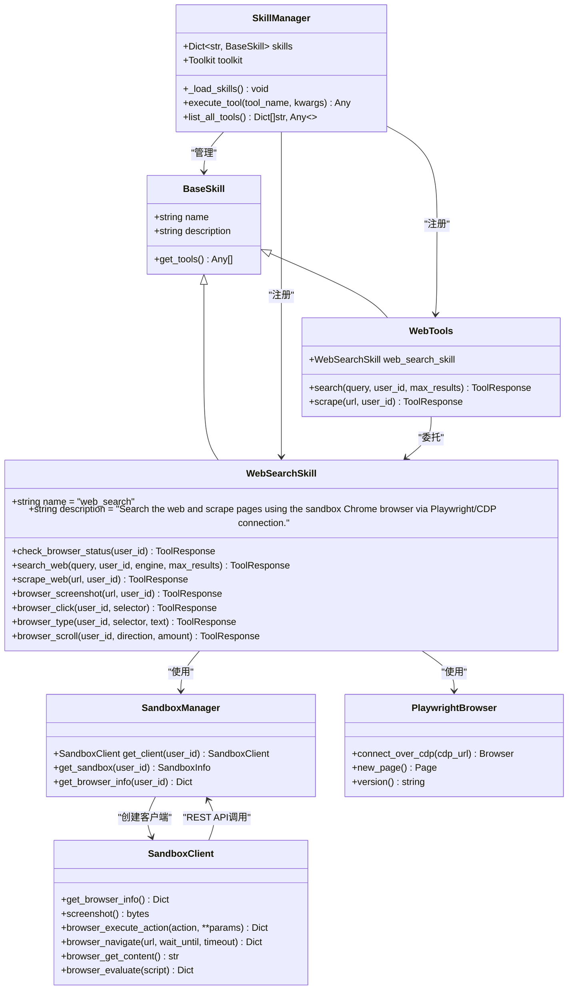

**图表来源**
- [skill_manager.py](file://localmanus-backend/core/skill_manager.py#L78-L216)
- [web_tools.py](file://localmanus-backend/skills/web-search/web_tools.py#L214-L571)
- [firecracker_sandbox.py](file://localmanus-backend/core/firecracker_sandbox.py#L121-L312)

### 技能执行流程

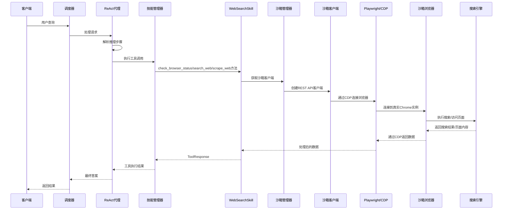

**更新** 完全重构为Playwright/CDP直接浏览器自动化方式，展示通过沙箱客户端和CDP连接浏览器的流程。

**图表来源**
- [react_agent.py](file://localmanus-backend/agents/react_agent.py#L20-L250)
- [skill_manager.py](file://localmanus-backend/core/skill_manager.py#L150-L216)
- [web_tools.py](file://localmanus-backend/skills/web-search/web_tools.py#L240-L571)

**章节来源**
- [skill_manager.py](file://localmanus-backend/core/skill_manager.py#L78-L216)
- [web_tools.py](file://localmanus-backend/skills/web-search/web_tools.py#L214-L571)

## 架构概览

WebSearchSkill 技能在整体系统架构中扮演着重要的角色，它通过标准化的接口与其他组件进行交互：

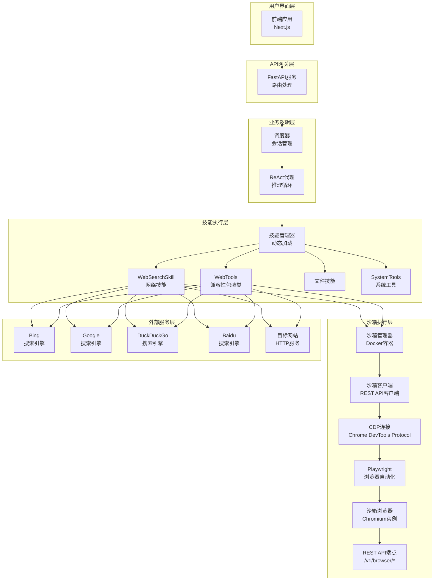

**更新** 新增了Playwright/CDP直接浏览器自动化架构图，展示完全重构后的架构变化。

**图表来源**
- [main.py](file://localmanus-backend/main.py#L33-L519)
- [orchestrator.py](file://localmanus-backend/core/orchestrator.py#L11-L158)
- [firecracker_sandbox.py](file://localmanus-backend/core/firecracker_sandbox.py#L121-L312)

## WebSearchSkill 详细分析

### 类结构设计

WebSearchSkill 类继承自 BaseSkill 基类，提供了七个核心方法：`check_browser_status`、`search_web`、`scrape_web`、`browser_screenshot`、`browser_click`、`browser_type` 和 `browser_scroll`，用于处理浏览器状态检查、网络搜索、网页内容提取、页面截图、元素点击、文本输入和页面滚动任务。

#### 标准化方法命名

**更新** 方法名已标准化为 search_web、scrape_web、browser_screenshot、browser_click、browser_type、browser_scroll，提供更清晰的语义表达。

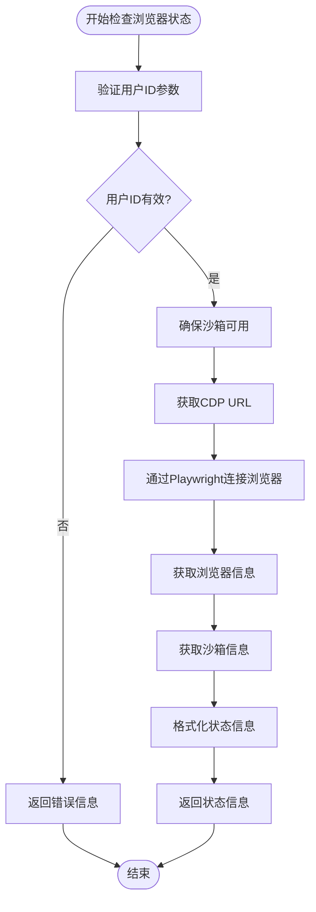

**图表来源**
- [web_tools.py](file://localmanus-backend/skills/web-search/web_tools.py#L240-L284)

#### 搜索功能实现

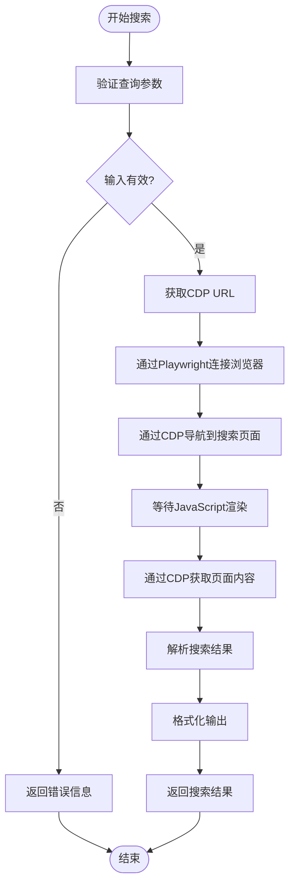

**图表来源**
- [web_tools.py](file://localmanus-backend/skills/web-search/web_tools.py#L286-L323)

#### 内容抓取功能实现

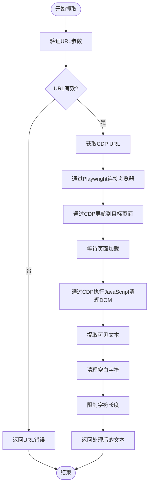

**图表来源**
- [web_tools.py](file://localmanus-backend/skills/web-search/web_tools.py#L325-L344)

#### 截图功能实现

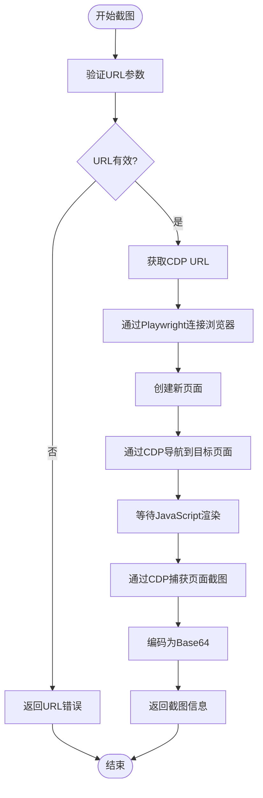

**图表来源**
- [web_tools.py](file://localmanus-backend/skills/web-search/web_tools.py#L346-L383)

#### 新增浏览器控制方法

**更新** 新增了三个浏览器控制方法，提供更丰富的浏览器操作能力：

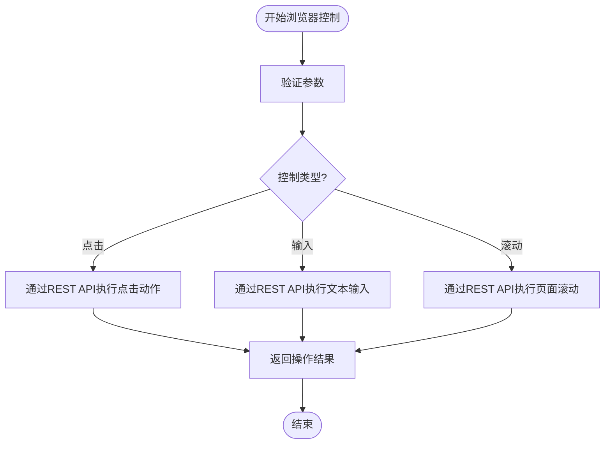

**图表来源**
- [web_tools.py](file://localmanus-backend/skills/web-search/web_tools.py#L385-L454)

**章节来源**
- [web_tools.py](file://localmanus-backend/skills/web-search/web_tools.py#L214-L571)

### Playwright/CDP直接浏览器自动化架构

**更新** WebSearchSkill 通过Playwright连接Chrome DevTools Protocol (CDP)直接控制沙箱浏览器：

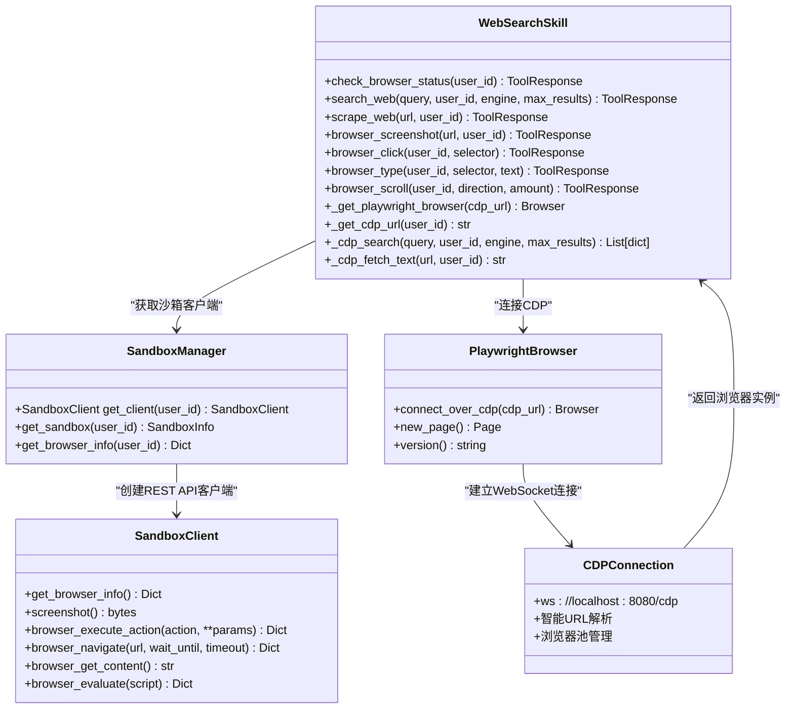

**图表来源**
- [web_tools.py](file://localmanus-backend/skills/web-search/web_tools.py#L24-L53)
- [web_tools.py](file://localmanus-backend/skills/web-search/web_tools.py#L55-L90)
- [firecracker_sandbox.py](file://localmanus-backend/core/firecracker_sandbox.py#L121-L312)

**章节来源**
- [web_tools.py](file://localmanus-backend/skills/web-search/web_tools.py#L24-L53)
- [web_tools.py](file://localmanus-backend/skills/web-search/web_tools.py#L55-L90)
- [firecracker_sandbox.py](file://localmanus-backend/core/firecracker_sandbox.py#L121-L312)

### 兼容性包装类

**新增** WebTools 兼容性包装类确保向后兼容性，内部委托给 WebSearchSkill 实例。

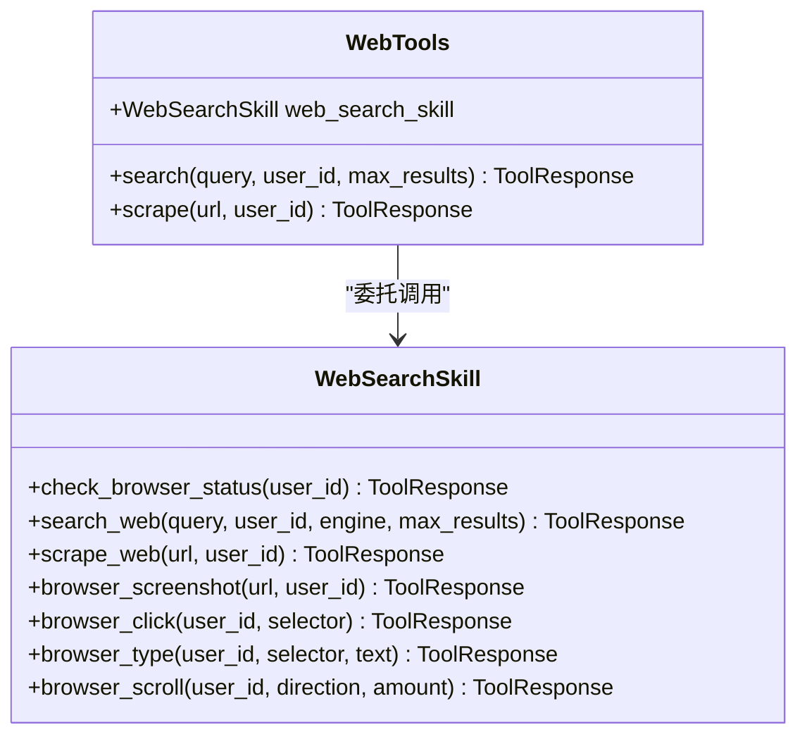

**图表来源**
- [web_tools.py](file://localmanus-backend/skills/web-search/web_tools.py#L532-L571)

**章节来源**
- [web_tools.py](file://localmanus-backend/skills/web-search/web_tools.py#L532-L571)

### 错误处理机制

**更新** WebSearchSkill 实现了完善的错误处理机制，包括沙箱可用性检查、CDP连接错误处理和Playwright浏览器异常处理：

| 错误类型 | 触发条件 | 处理方式 | 返回信息 |
|---------|---------|---------|---------|
| 沙箱不可用 | 沙箱未运行或无法连接 | 捕获SandboxBrowserError并返回详细错误 | "❌ Sandbox Error: {错误详情}" |
| CDP连接失败 | 浏览器CDP连接建立失败 | 捕获异常并返回错误信息 | "❌ Sandbox Error: Failed to connect to sandbox browser at CDP URL" |
| Playwright安装缺失 | Playwright包未安装 | 捕获ImportError并返回安装指引 | "playwright is not installed. Run: pip install playwright && playwright install chromium" |
| 搜索异常 | 搜索超时或解析错误 | 捕获异常并返回错误信息 | "Search error: {错误详情}" |
| 网页抓取异常 | 页面加载失败或内容提取错误 | 捕获异常并返回详细错误 | "Scrape error: {错误详情}" |
| 截图异常 | 页面截图失败或编码错误 | 捕获异常并返回错误信息 | "Screenshot error: {错误详情}" |
| 浏览器控制异常 | 元素点击/输入/滚动失败 | 捕获异常并返回错误信息 | "Click/Type/Scroll error: {错误详情}" |
| 网络超时 | 请求超过30秒未响应 | 捕获超时异常 | 超时错误信息 |
| 未知错误 | 未预期的异常情况 | 捕获并返回通用错误信息 | "❌ Unexpected error: {错误详情}" |

**章节来源**
- [web_tools.py](file://localmanus-backend/skills/web-search/web_tools.py#L19-L21)
- [web_tools.py](file://localmanus-backend/skills/web-search/web_tools.py#L34-L50)
- [web_tools.py](file://localmanus-backend/skills/web-search/web_tools.py#L319-L323)
- [web_tools.py](file://localmanus-backend/skills/web-search/web_tools.py#L340-L344)
- [web_tools.py](file://localmanus-backend/skills/web-search/web_tools.py#L379-L383)
- [web_tools.py](file://localmanus-backend/skills/web-search/web_tools.py#L402-L406)
- [web_tools.py](file://localmanus-backend/skills/web-search/web_tools.py#L426-L430)
- [web_tools.py](file://localmanus-backend/skills/web-search/web_tools.py#L450-L454)

## 技能管理机制

### 动态技能加载

SkillManager 类实现了动态技能加载机制，能够自动发现和注册位于 skills 目录下的所有技能模块：

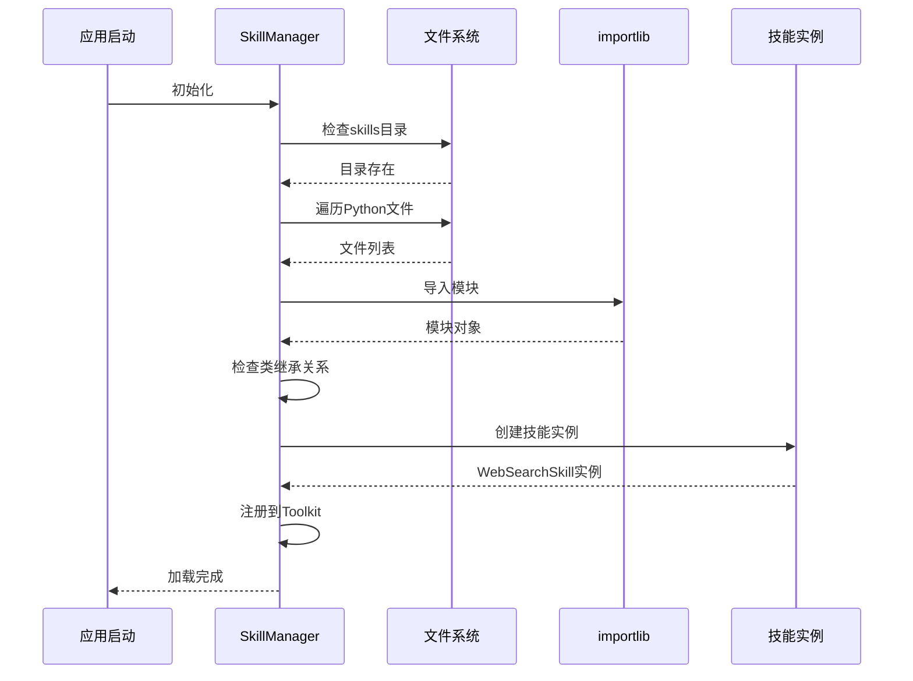

**更新** 新增了对 WebSearchSkill 类的识别和注册流程。

**图表来源**
- [skill_manager.py](file://localmanus-backend/core/skill_manager.py#L89-L149)

### 工具函数注册

SkillManager 将技能类中的公共方法自动注册为可调用的工具函数，支持异步和同步两种执行模式：

**更新** 工具函数现在注册为 check_browser_status、search_web、scrape_web、browser_screenshot、browser_click、browser_type、browser_scroll，符合新的方法命名规范。

**章节来源**
- [skill_manager.py](file://localmanus-backend/core/skill_manager.py#L137-L140)

## ReAct 推理循环

### 推理过程监控

ReActAgent 实现了完整的推理循环，能够实时监控和展示工具调用过程：

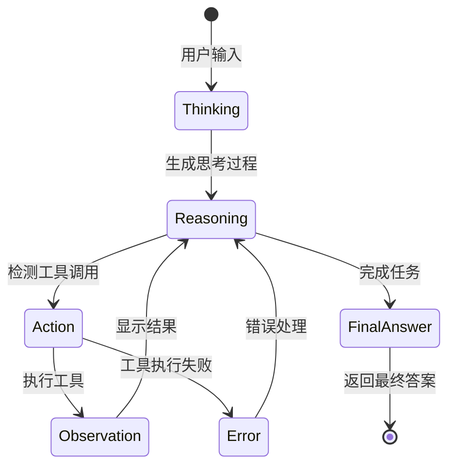

**图表来源**
- [react_agent.py](file://localmanus-backend/agents/react_agent.py#L20-L250)

### 事件流处理

ReActAgent 通过结构化的事件类型向前端传输实时状态更新：

| 事件类型 | 数据结构 | 用途 | 前端显示 |
|---------|---------|------|---------|
| thought | {type: "thought", content: string} | 推理过程 | 思考框 |
| call | {type: "call", content: {skill, tool, params}} | 工具调用 | 工具调用框 |
| observation | {type: "observation", content: string} | 工具结果 | 观察结果框 |
| result | {type: "result", content: string} | 最终答案 | 主消息框 |
| error | {type: "error", content: string} | 错误信息 | 错误提示 |

**更新** 工具调用格式现在显示为 skill.tool（如 web_search.search_web），符合新的命名规范。

**章节来源**
- [react_agent.py](file://localmanus-backend/agents/react_agent.py#L114-L227)

## 前端集成

### 实时消息流

前端应用通过 Server-Sent Events (SSE) 实现与后端的实时通信，支持渐进式消息显示：

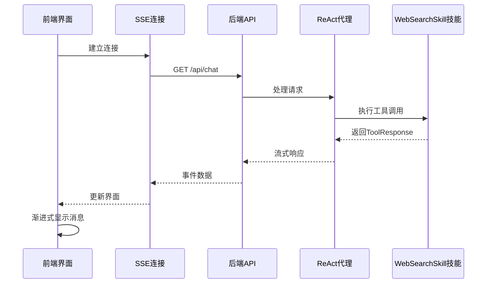

**图表来源**
- [page.tsx](file://localmanus-ui/app/page.tsx#L89-L131)

### 消息渲染策略

前端实现了智能的消息渲染策略，能够区分不同类型的消息并采用相应的显示方式：

**更新** 工具调用显示格式现在为 skill.tool（如 web_search.search_web），提供更清晰的工具标识。

**章节来源**
- [page.tsx](file://localmanus-ui/app/page.tsx#L1-L297)

## 依赖关系分析

### 外部依赖

WebSearchSkill 技能依赖于以下关键外部库：

```mermaid
graph TB
subgraph "核心依赖"
FASTAPI[FastAPI<br/>Web框架]
AGENTS[AgentScope<br/>智能代理框架]
UVICORN[Uvicorn<br/>ASGI服务器]
PLAYWRIGHT[playwright<br/>浏览器自动化]
BEAUTIFULSOUP[beautifulsoup4<br/>HTML解析]
END
subgraph "沙箱技术"
DOCKER[docker<br/>容器化运行]
REST[REST API<br/>HTTP协议]
CDP[Chrome DevTools Protocol<br/>WebSocket连接]
MCP[MCP工具<br/>浏览器控制]
END
subgraph "开发工具"
PYTHON[python-dotenv<br/>环境变量]
WEBSOCKETS[websockets<br/>WebSocket支持]
PYDANTIC[pydantic<br/>数据验证]
END
FASTAPI --> PLAYWRIGHT
FASTAPI --> REST
PLAYWRIGHT --> CDP
REST --> MCP
BEAUTIFULSOUP --> PLAYWRIGHT
AGENTS --> FASTAPI
UVICORN --> FASTAPI
```

**更新** 完全重构为Playwright/CDP直接浏览器自动化方式，移除了REST API依赖，新增Playwright和CDP支持。

**图表来源**
- [requirements.txt](file://localmanus-backend/requirements.txt#L1-L15)

### 环境配置

系统需要以下环境变量才能正常运行：

| 变量名 | 默认值 | 说明 |
|-------|--------|------|
| OPENAI_API_KEY | your_api_key_here | API密钥 |
| OPENAI_API_BASE | http://localhost:11434/v1 | API基础URL |
| MODEL_NAME | gpt-4 | 模型名称 |
| SANDBOX_MODE | local | 沙箱模式（local/online） |
| SANDBOX_LOCAL_URL | http://192.168.126.132:8080 | 本地沙箱URL |
| USE_CHINA_MIRROR | false | 使用中国镜像 |

**章节来源**
- [.env.example](file://localmanus-backend/.env.example#L1-L12)

## 性能考虑

### Playwright/CDP优化

WebSearchSkill 在浏览器连接方面采用了多项优化措施：

1. **浏览器池管理**: 通过全局字典 `_browser_pool` 缓存CDP连接，避免重复建立连接
2. **智能CDP URL解析**: 新增 `_get_cdp_url` 函数，支持从容器浏览器信息API和沙箱基础URL智能解析CDP WebSocket URL
3. **浏览器状态检查**: 新增 `check_browser_status` 方法，允许在执行操作前检查浏览器可用性
4. **异步处理**: 支持异步工具调用，提升并发性能
5. **资源清理**: 确保浏览器操作完成后正确关闭页面和清理资源
6. **错误快速失败**: 通过沙箱可用性检查和CDP连接检查快速发现和报告问题

### 内存管理

```mermaid
flowchart LR
Input[输入参数] --> Validate[参数验证]
Validate --> Process[数据处理]
Process --> Limit[长度限制]
Limit --> Output[输出结果]
subgraph "内存优化"
Validate -.-> GC[垃圾回收]
Limit -.-> Buffer[缓冲区管理]
Output -.-> Cleanup[资源清理]
Cleanup -.-> BrowserPool[浏览器池管理]
BrowserPool -.-> StatusCheck[浏览器状态检查]
End
```

### 并发处理

系统支持多轮对话和并发请求处理，通过会话管理和消息队列确保系统的稳定性。

## 故障排除指南

### 常见问题及解决方案

| 问题类型 | 症状 | 可能原因 | 解决方案 |
|---------|------|---------|---------|
| 沙箱不可用 | "❌ Sandbox Error: No sandbox available for user {id}" | 沙箱服务未运行或无法连接 | 检查沙箱服务状态，确保Docker容器正在运行 |
| CDP连接失败 | "❌ Sandbox Error: Failed to connect to sandbox browser at CDP URL" | CDP WebSocket连接建立失败 | 检查SANDBOX_LOCAL_URL配置，验证CDP端点可达性 |
| Playwright安装缺失 | "playwright is not installed. Run: pip install playwright && playwright install chromium" | Playwright包未安装 | 运行pip install playwright && playwright install chromium命令 |
| 智能CDP URL解析失败 | "Cannot get browser CDP URL for user {id}" | 无法从容器获取CDP URL或构造失败 | 检查沙箱容器是否正确暴露CDP端点 |
| 搜索无结果 | "No results found." | 沙箱浏览器连接失败 | 检查沙箱服务状态，重启Docker容器 |
| 抓取失败 | "Scrape error: ..." | 页面加载超时或内容提取错误 | 检查目标网站可达性，增加等待时间 |
| 截图失败 | "Screenshot error: ..." | 页面截图失败或编码错误 | 检查浏览器权限，确认页面渲染完成 |
| 浏览器控制失败 | "Click/Type/Scroll error: ..." | 元素选择器无效或浏览器状态异常 | 检查CSS选择器或XPath，确认元素存在 |
| 超时错误 | 连接超时 | 网络延迟或沙箱服务繁忙 | 增加超时时间，检查Docker资源限制 |
| 浏览器连接失败 | CDP连接建立失败 | Docker容器未启动或端口冲突 | 启动沙箱容器，检查端口占用 |
| 工具调用失败 | "Error: Tool 'search' not found." | 使用过时的方法名 | 更新为 'search_web' 或 'scrape_web' |

**更新** 新增了Playwright/CDP相关故障排除指南，指导用户解决浏览器状态检查和浏览器控制问题。

### 调试技巧

1. **启用详细日志**: 在环境变量中设置更详细的日志级别
2. **检查依赖版本**: 确保所有依赖库版本兼容
3. **网络连通性测试**: 验证与外部服务的连接
4. **Docker容器监控**: 监控沙箱容器状态和资源使用
5. **CDP端点测试**: 使用浏览器开发者工具检查CDP连接
6. **浏览器状态检查**: 使用 `check_browser_status` 方法验证浏览器可用性
7. **Playwright安装验证**: 运行playwright安装命令验证环境配置

**章节来源**
- [web_tools.py](file://localmanus-backend/skills/web-search/web_tools.py#L98-L108)
- [web_tools.py](file://localmanus-backend/skills/web-search/web_tools.py#L46-L50)
- [web_tools.py](file://localmanus-backend/skills/web-search/web_tools.py#L85-L90)
- [web_tools.py](file://localmanus-backend/skills/web-search/web_tools.py#L319-L323)
- [web_tools.py](file://localmanus-backend/skills/web-search/web_tools.py#L340-L344)
- [web_tools.py](file://localmanus-backend/skills/web-search/web_tools.py#L379-L383)
- [web_tools.py](file://localmanus-backend/skills/web-search/web_tools.py#L402-L406)
- [web_tools.py](file://localmanus-backend/skills/web-search/web_tools.py#L426-L430)
- [web_tools.py](file://localmanus-backend/skills/web-search/web_tools.py#L450-L454)

## 结论

WebSearchSkill 网络工具技能为 LocalManus 项目提供了强大的网络信息检索能力。通过完全重构为Playwright/CDP直接浏览器自动化方式，该技能能够绕过机器人检测机制，提供更可靠和真实的网页搜索体验。新架构移除了复杂的REST API管理，使用Playwright连接Chrome DevTools Protocol (CDP)，同时新增了浏览器控制方法（browser_click、browser_type、browser_scroll）和状态检查功能（check_browser_status），提供了更丰富和灵活的浏览器操作能力。

通过标准化的类名和方法命名，以及完善的错误处理机制，该技能能够稳定地执行网页搜索、内容抓取、页面截图和浏览器控制任务，并与整个系统的其他组件无缝集成。

**更新** 本次更新实现了类名和方法名的标准化，完全重构为Playwright/CDP直接浏览器自动化方式，新增了浏览器控制方法和状态检查功能，提供了更简洁的架构和更强的功能，同时通过兼容性包装类确保了向后兼容性。

### 主要优势

1. **直接浏览器自动化**: 移除REST API复杂性，使用Playwright/CDP直接连接真实浏览器
2. **智能CDP URL解析**: 新增_get_cdp_url函数，支持从容器浏览器信息API和沙箱基础URL智能解析CDP WebSocket URL
3. **增强功能**: 新增浏览器控制方法和状态检查能力
4. **沙箱化执行**: 基于Docker容器的沙箱化Chrome浏览器，绕过机器人检测
5. **多搜索引擎支持**: 支持Bing、Google、DuckDuckGo、Baidu四种主流搜索引擎
6. **异步架构**: 基于异步编程模型，支持高并发和流式响应
7. **智能集成**: 与 ReAct 推理循环深度集成
8. **错误处理**: 完善的异常捕获和恢复机制
9. **性能优化**: 浏览器池管理和资源清理
10. **向后兼容**: 兼容性包装类确保现有代码正常运行
11. **前端友好**: 实时消息流支持优秀的用户体验

### 发展方向

未来可以考虑的功能增强：
- 支持更多搜索引擎和数据源
- 实现更智能的内容过滤和摘要
- 添加缓存机制提升重复查询性能
- 扩展支持图片、PDF等非文本内容抓取
- 提供更丰富的搜索结果处理选项
- 增强沙箱管理功能，支持更多自定义配置
- 添加浏览器自动化录制和回放功能
- 实现跨浏览器兼容性和测试套件
- 集成机器学习模型进行智能内容分析

WebSearchSkill 技能作为 LocalManus 生态系统的重要组成部分，为用户提供了强大而可靠的网络信息处理能力，是构建智能化 AI Agent 平台的关键基础设施。