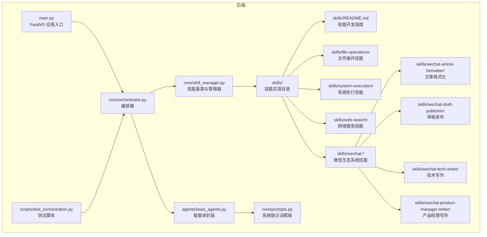
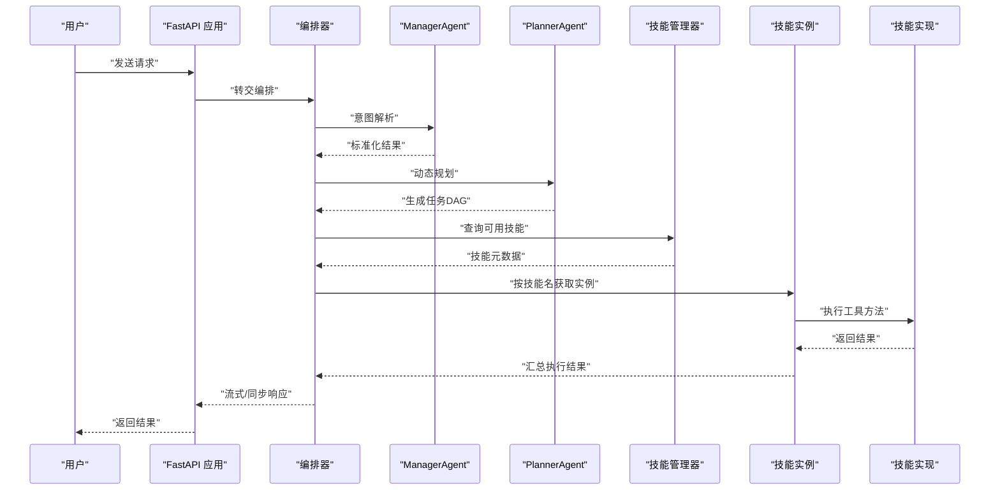
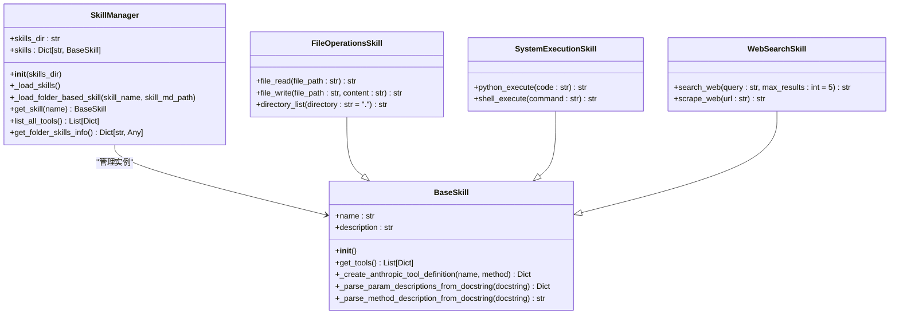
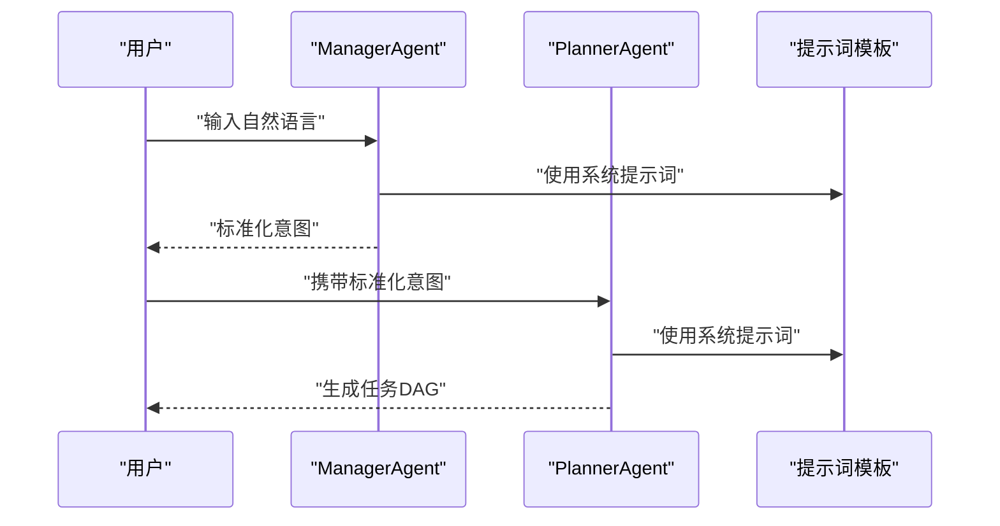
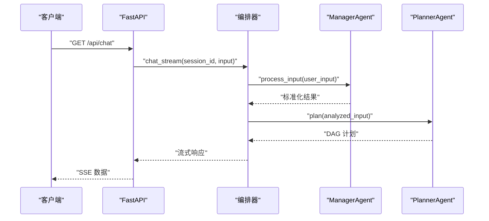
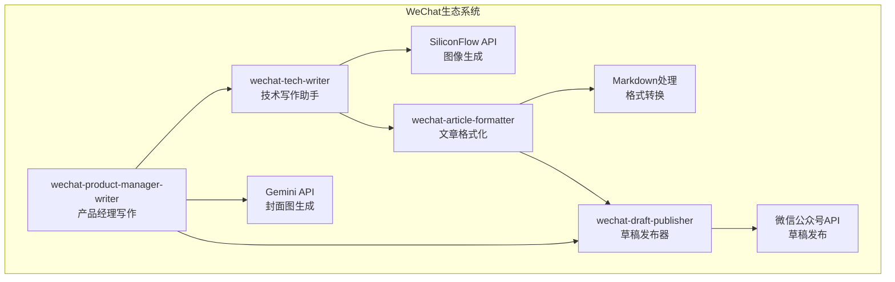
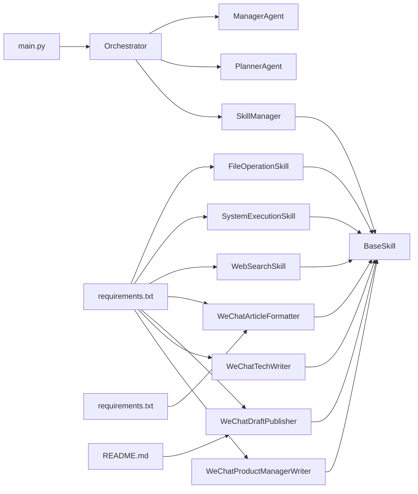

# 技能开发指南

<cite>
**本文引用的文件**
- [skills/README.md](file://localmanus-backend/skills/README.md)
- [skill_manager.py](file://localmanus-backend/core/skill_manager.py)
- [base_agents.py](file://localmanus-backend/agents/base_agents.py)
- [orchestrator.py](file://localmanus-backend/core/orchestrator.py)
- [prompts.py](file://localmanus-backend/core/prompts.py)
- [main.py](file://localmanus-backend/main.py)
- [requirements.txt](file://localmanus-backend/requirements.txt)
- [test_orchestration.py](file://localmanus-backend/scripts/test_orchestration.py)
- [localmanus_architecture.md](file://localmanus_architecture.md)
- [localmanus_skills_roadmap.md](file://localmanus_skills_roadmap.md)
- [.env.example](file://localmanus-backend/.env.example)
- [file_ops.py](file://localmanus-backend/skills/file_ops.py)
- [system_tools.py](file://localmanus-backend/skills/system_tools.py)
- [web_tools.py](file://localmanus-backend/skills/web_tools.py)
- [file-operations/SKILL.md](file://localmanus-backend/skills/file-operations/SKILL.md)
- [system-execution/SKILL.md](file://localmanus-backend/skills/system-execution/SKILL.md)
- [web-search/SKILL.md](file://localmanus-backend/skills/web-search/SKILL.md)
- [wechat-article-formatter/README.md](file://localmanus-backend/skills/wechat-article-formatter/README.md)
- [wechat-draft-publisher/SKILL.md](file://localmanus-backend/skills/wechat-draft-publisher/SKILL.md)
- [wechat-product-manager-writer/SKILL.md](file://localmanus-backend/skills/wechat-product-manager-writer/SKILL.md)
- [wechat-tech-writer/wechat_image_tools.py](file://localmanus-backend/skills/wechat-tech-writer/wechat_image_tools.py)
- [wechat-draft-publisher/publisher.py](file://localmanus-backend/skills/wechat-draft-publisher/publisher.py)
- [wechat-tech-writer/scripts/generate_image.py](file://localmanus-backend/skills/wechat-tech-writer/scripts/generate_image.py)
- [wechat-product-manager-writer/references/writing-style.md](file://localmanus-backend/skills/wechat-product-manager-writer/references/writing-style.md)
- [wechat-article-formatter/requirements.txt](file://localmanus-backend/skills/wechat-article-formatter/requirements.txt)
- [wechat-draft-publisher/README.md](file://localmanus-backend/skills/wechat-draft-publisher/README.md)
</cite>

## 更新摘要
**所做更改**
- 新增WeChat生态系统技能开发最佳实践章节
- 添加微信文章格式化、发布、写作等完整技能栈
- 更新文件夹技能结构规范，包含YAML前言要求
- 扩展参数设计原则，涵盖微信平台特殊要求
- 新增微信生态专用工具类和API集成示例

## 目录
1. [简介](#简介)
2. [项目结构](#项目结构)
3. [核心组件](#核心组件)
4. [架构总览](#架构总览)
5. [详细组件分析](#详细组件分析)
6. [WeChat生态系统技能开发](#wechat生态系统技能开发)
7. [依赖关系分析](#依赖关系分析)
8. [性能考量](#性能考量)
9. [故障排查指南](#故障排查指南)
10. [结论](#结论)
11. [附录](#附录)

## 简介
本指南面向希望基于现有技能实现，开发新技能的工程师。文档从ComposioHQ样式技能结构出发，系统阐述文件夹技能开发标准、YAML前言要求、参数设计原则，并给出从设计到测试再到部署的完整流程。同时提供性能优化建议、安全考虑与错误处理策略，并附上多个实际技能开发案例与代码示例路径，帮助快速落地高质量技能。

**新增** WeChat生态系统技能开发章节，详细介绍微信公众号文章格式化、发布、写作等完整技能栈的最佳实践，包括微信平台限制、API集成、工作流程优化等内容。

## 项目结构
该项目采用前后端分离架构，后端使用FastAPI提供API网关，AgentScope智能体负责意图解析与任务规划，技能系统通过动态加载实现扩展。核心目录与职责如下：
- localmanus-backend
  - agents：智能体封装（ManagerAgent、PlannerAgent）
  - core：编排器、技能管理器、提示词模板、主应用入口
  - skills：技能实现（示例：FileOps、SystemExecution、WebSearch、WeChat系列）
  - scripts：本地测试脚本
  - .env.example：环境变量示例
  - requirements.txt：Python依赖清单



**图表来源**
- [main.py](file://localmanus-backend/main.py#L1-L95)
- [orchestrator.py](file://localmanus-backend/core/orchestrator.py#L1-L118)
- [skill_manager.py](file://localmanus-backend/core/skill_manager.py#L1-L292)
- [base_agents.py](file://localmanus-backend/agents/base_agents.py#L1-L42)
- [skills/README.md](file://localmanus-backend/skills/README.md#L1-L122)

**章节来源**
- [main.py](file://localmanus-backend/main.py#L1-L95)
- [orchestrator.py](file://localmanus-backend/core/orchestrator.py#L1-L118)
- [skill_manager.py](file://localmanus-backend/core/skill_manager.py#L1-L292)
- [base_agents.py](file://localmanus-backend/agents/base_agents.py#L1-L42)
- [skills/README.md](file://localmanus-backend/skills/README.md#L1-L122)

## 核心组件
- 技能基类 BaseSkill
  - 负责统一的工具路由与元数据导出
  - 提供异步 execute 方法，按工具名分发调用
  - 通过反射自动生成工具元数据（名称、描述、参数签名）
- 技能管理器 SkillManager
  - 动态扫描 skills 目录，自动加载继承自 BaseSkill 的类
  - 支持两种技能类型：Python-based技能和folder-based技能
  - 维护技能实例字典，提供查询与聚合工具列表能力
- 编排器 Orchestrator
  - 管理对话历史、流式响应与工作流执行
  - 提供 JSON提取辅助函数，便于从智能体输出中解析结构化数据
- 智能体封装 ManagerAgent、PlannerAgent
  - 使用 ReActAgent，分别承担意图标准化与动态任务规划
- 主应用入口 main.py
  - 提供 SSE、WebSocket、同步接口等端点，连接编排器与前端

**章节来源**
- [skill_manager.py](file://localmanus-backend/core/skill_manager.py#L142-L292)
- [orchestrator.py](file://localmanus-backend/core/orchestrator.py#L8-L118)
- [base_agents.py](file://localmanus-backend/agents/base_agents.py#L6-L42)
- [main.py](file://localmanus-backend/main.py#L1-L95)

## 架构总览
系统采用"动态多智能体 + 技能库"的架构，用户请求经由 ManagerAgent 标准化，PlannerAgent 生成动态任务 DAG 并路由到具体技能。技能通过 SkillManager 动态加载，执行结果回传给编排器，最终由前端以流式方式呈现。



**图表来源**
- [main.py](file://localmanus-backend/main.py#L30-L56)
- [orchestrator.py](file://localmanus-backend/core/orchestrator.py#L65-L80)
- [base_agents.py](file://localmanus-backend/agents/base_agents.py#L19-L40)
- [skill_manager.py](file://localmanus-backend/core/skill_manager.py#L231-L234)
- [file_ops.py](file://localmanus-backend/skills/file_ops.py#L5-L114)

## 详细组件分析

### ComposioHQ样式技能结构
- 技能类型
  - **文件夹技能（推荐）**：每个技能以文件夹形式组织，包含SKILL.md文件
  - **Python技能（兼容支持）**：传统的Python类实现
- 文件夹结构
  ```
  skill-folder-name/
  ├── SKILL.md          # YAML前言和技能描述
  └── [可选支持文件]    # 其他实现文件
  ```



**图表来源**
- [skill_manager.py](file://localmanus-backend/core/skill_manager.py#L142-L292)
- [file_ops.py](file://localmanus-backend/skills/file_ops.py#L5-L114)
- [system_tools.py](file://localmanus-backend/skills/system_tools.py#L6-L78)
- [web_tools.py](file://localmanus-backend/skills/web_tools.py#L8-L107)

**章节来源**
- [skills/README.md](file://localmanus-backend/skills/README.md#L5-L41)
- [skill_manager.py](file://localmanus-backend/core/skill_manager.py#L149-L229)

### YAML前言要求
- SKILL.md文件必须包含标准YAML前言
- 前言格式
  ```yaml
  ---
  name: skill-name
  description: Brief description of what this skill does.
  ---
  ```
- 前言字段
  - `name`：技能显示名称
  - `description`：技能功能描述

**章节来源**
- [skills/README.md](file://localmanus-backend/skills/README.md#L18-L23)
- [file-operations/SKILL.md](file://localmanus-backend/skills/file-operations/SKILL.md#L1-L4)
- [system-execution/SKILL.md](file://localmanus-backend/skills/system-execution/SKILL.md#L1-L4)
- [web-search/SKILL.md](file://localmanus-backend/skills/web-search/SKILL.md#L1-L4)

### 技能开发模板
- 文件夹技能模板
  1. 创建技能文件夹：`skills/my-skill/`
  2. 创建SKILL.md文件，包含YAML前言
  3. 实现技能类，继承BaseSkill
  4. 添加工具方法，包含完整的文档字符串
- Python技能模板
  ```python
  from core.skill_manager import BaseSkill
  
  class MySkill(BaseSkill):
      """
      [技能描述]
      """
  
      def __init__(self):
          super().__init__()
          self.name = "[技能标识符]"
          self.description = "[技能功能描述]"
  
      def [动作方法](self, param1: type, param2: type = default) -> str:
          """
          [方法功能描述]

          Args:
              param1 (type): [参数1描述]
              param2 (type): [参数2描述，默认值]

          Returns:
              str: [返回值描述]
          """
          # 实现逻辑
          pass
  ```

**章节来源**
- [skills/README.md](file://localmanus-backend/skills/README.md#L43-L72)
- [skills/README.md](file://localmanus-backend/skills/README.md#L102-L116)

### 技能管理器增强功能
- 双重技能加载机制
  - Python-based技能：从.py文件动态导入类
  - Folder-based技能：从SKILL.md文件解析元数据
- 自动注册工具
  - 通过反射获取所有公共方法
  - 生成Anthropic兼容的工具定义
  - 注册到Toolkit中供智能体使用
- 文件夹技能信息获取
  - `get_folder_skills_info()`方法返回文件夹技能元数据
  - 支持技能展示和文档生成

**章节来源**
- [skill_manager.py](file://localmanus-backend/core/skill_manager.py#L149-L255)

### 示例技能实现

#### 文件操作技能
- 功能特性
  - 文件读取：支持UTF-8编码，异常处理
  - 文件写入：安全写入，错误反馈
  - 目录列表：默认当前目录，支持路径参数
- 设计要点
  - 使用类型注解确保类型安全
  - 完整的文档字符串，包含Args和Returns
  - 异常捕获和用户友好的错误信息

**章节来源**
- [file_ops.py](file://localmanus-backend/skills/file_ops.py#L5-L114)
- [file-operations/SKILL.md](file://localmanus-backend/skills/file-operations/SKILL.md#L1-L28)

#### 系统执行技能
- 功能特性
  - Python代码执行：异步执行，print输出可见
  - Shell命令执行：安全的命令执行环境
- 设计要点
  - 异步方法支持AgentScope执行
  - 安全的沙箱执行环境
  - 详细的错误处理和超时控制

**章节来源**
- [system_tools.py](file://localmanus-backend/skills/system_tools.py#L6-L78)
- [system-execution/SKILL.md](file://localmanus-backend/skills/system-execution/SKILL.md#L1-L27)

#### 网络搜索技能
- 功能特性
  - DuckDuckGo搜索：支持关键词搜索和结果数量控制
  - 网页抓取：BeautifulSoup解析，文本清理
- 设计要点
  - 请求头设置，模拟浏览器访问
  - HTML元素过滤，只保留文本内容
  - 结果长度限制，防止过长输出

**章节来源**
- [web_tools.py](file://localmanus-backend/skills/web_tools.py#L8-L107)
- [web-search/SKILL.md](file://localmanus-backend/skills/web-search/SKILL.md#L1-L27)

### 智能体与提示词
- ManagerAgent
  - 将用户输入标准化为结构化意图，维护会话TraceID
  - 通过ReActAgent执行推理与输出
- PlannerAgent
  - 依据可用技能生成动态任务DAG
  - 输出包含步骤ID、技能名、参数与依赖关系
- 提示词模板
  - MANAGER_SYSTEM_PROMPT：定义Manager的职责与输出格式
  - PLANNER_SYSTEM_PROMPT：定义Planner的可用技能与输出格式



**图表来源**
- [base_agents.py](file://localmanus-backend/agents/base_agents.py#L19-L40)
- [prompts.py](file://localmanus-backend/core/prompts.py#L3-L52)

**章节来源**
- [base_agents.py](file://localmanus-backend/agents/base_agents.py#L6-L42)
- [prompts.py](file://localmanus-backend/core/prompts.py#L3-L52)

### 编排器与工作流
- 对话流式接口
  - 支持多轮历史、最大轮次限制与错误处理
  - 通过SSE向前端推送状态、内容与结束信号
- 工作流执行
  - 从ManagerAgent获取意图，PlannerAgent生成DAG
  - 添加trace_id并返回结构化计划
- JSON提取
  - 从智能体输出中提取JSON块，支持多种包裹格式



**图表来源**
- [main.py](file://localmanus-backend/main.py#L30-L38)
- [orchestrator.py](file://localmanus-backend/core/orchestrator.py#L13-L64)
- [base_agents.py](file://localmanus-backend/agents/base_agents.py#L19-L40)

**章节来源**
- [main.py](file://localmanus-backend/main.py#L30-L56)
- [orchestrator.py](file://localmanus-backend/core/orchestrator.py#L13-L84)

### 技能开发完整流程
- 设计阶段
  - 明确技能目标与工具集合
  - 设计参数与返回值，编写docstring
  - 创建YAML前言和技能描述
- 实现阶段
  - 创建新技能类，继承BaseSkill
  - 实现工具方法，添加异常处理
  - 确保方法命名与参数符合约定
- 测试阶段
  - 使用test_orchestration.py进行端到端验证
  - 检查元数据导出与工具可用性
  - 验证文件夹技能的SKILL.md解析
- 部署阶段
  - 将技能文件放入skills目录
  - 重启后端服务，确认动态加载成功
  - 通过API端点验证工作流

**章节来源**
- [test_orchestration.py](file://localmanus-backend/scripts/test_orchestration.py#L12-L56)
- [skills/README.md](file://localmanus-backend/skills/README.md#L102-L122)

## WeChat生态系统技能开发

### WeChat技能栈概览
WeChat生态系统包含四个核心技能模块，形成完整的文章创作到发布的闭环：



**图表来源**
- [wechat-tech-writer/wechat_image_tools.py](file://localmanus-backend/skills/wechat-tech-writer/wechat_image_tools.py#L104-L305)
- [wechat-article-formatter/README.md](file://localmanus-backend/skills/wechat-article-formatter/README.md#L1-L398)
- [wechat-draft-publisher/SKILL.md](file://localmanus-backend/skills/wechat-draft-publisher/SKILL.md#L1-L198)
- [wechat-product-manager-writer/SKILL.md](file://localmanus-backend/skills/wechat-product-manager-writer/SKILL.md#L1-L598)

### WeChat文章格式化技能
**功能特性**
- Markdown到HTML转换：完整支持Markdown语法
- 多主题支持：tech（科技风）、minimal（简约风）、business（商务风）
- 样式美化：专业的CSS样式，适配微信公众号
- 代码高亮：支持多种编程语言的语法高亮
- 响应式设计：完美适配移动端阅读
- 批量转换：支持批量处理多个文件
- 实时预览：边写边看，提高效率
- 高度可定制：支持自定义CSS主题

**文件结构**
```
wechat-article-formatter/
├── SKILL.md                    # 主技能文档
├── README.md                   # 本文件
├── EXAMPLES.md                 # 使用示例
├── requirements.txt            # Python依赖
├── test_article.md             # 测试文件
│
├── scripts/                    # 转换脚本
│   ├── markdown_to_html.py     # 主转换脚本
│   ├── batch_convert.py        # 批量转换
│   └── preview_generator.py    # 实时预览
│
├── templates/                  # CSS主题模板
│   ├── tech-theme.css          # 科技风主题
│   ├── minimal-theme.css       # 简约风主题
│   └── business-theme.css      # 商务风主题
│
└── references/                 # 参考文档
    ├── README.md               # 文档导航
    ├── wechat-constraints.md   # 平台限制
    ├── conversion-guide.md     # 转换详解
    ├── publishing-guide.md     # 发布指南
    └── theme-customization.md  # 主题定制
```

**微信平台限制**
- 不支持外部CSS - 本工具会自动转换为内联样式
- 不支持JavaScript - 使用纯CSS实现所有效果
- 图片需要重新上传 - 本地图片无法直接使用
- 部分CSS属性不支持 - 只使用微信支持的CSS属性

**章节来源**
- [wechat-article-formatter/README.md](file://localmanus-backend/skills/wechat-article-formatter/README.md#L1-L398)
- [wechat-article-formatter/requirements.txt](file://localmanus-backend/skills/wechat-article-formatter/requirements.txt#L1-L19)

### WeChat草稿发布技能
**核心功能**
- 自动将HTML文章发布到微信公众号草稿箱
- 支持封面图上传、标题、作者和元数据管理
- access_token自动缓存（有效期7200秒）
- 封面图上传和管理
- HTML内容自动优化（适配微信）
- 字段长度自动截断（标题/作者/摘要）
- 错误处理和重试机制
- 中文错误提示和解决方案
- 交互模式和命令行模式

**发布流程**
1. 查找HTML文件 - 优先查找`*_formatted.html`（formatter输出）
2. 提取文章标题 - 从HTML注释提取：`<!-- Title: xxx -->`
3. 检查封面图 - 查找`cover.png`，如缺失则警告但继续发布
4. 调用发布脚本 - 自动处理HTML优化和发布
5. 验证结果 - 确认草稿创建成功，获取草稿media_id
6. 提示用户 - 提供微信后台链接和下一步操作

**配置要求**
- 首次使用会引导配置微信公众号凭证
- 配置文件位置：`~/.wechat-publisher/config.json`
- 包含appid和appsecret字段
- 支持服务器IP白名单配置

**章节来源**
- [wechat-draft-publisher/SKILL.md](file://localmanus-backend/skills/wechat-draft-publisher/SKILL.md#L1-L198)
- [wechat-draft-publisher/publisher.py](file://localmanus-backend/skills/wechat-draft-publisher/publisher.py#L1-L800)
- [wechat-draft-publisher/README.md](file://localmanus-backend/skills/wechat-draft-publisher/README.md#L1-L240)

### WeChat技术写作技能
**功能特性**
- 基于SiliconFlow API的图像生成
- 支持多种分辨率：1792x1024、1024x1024、1024x1792
- 优化的提示词工程，针对微信封面设计
- 异步图像生成，支持负向提示词
- 自动下载和保存生成的图像
- 详细的错误处理和API状态码映射

**图像生成API集成**
```python
class WeChatImageGenSkill(BaseSkill):
    async def generate_image(
        self,
        prompt: str,
        output_path: str,
        negative_prompt: str = "",
        resolution: str = "1792x1024",
        user_id: str = ""
    ) -> ToolResponse:
        # 使用SiliconFlow API生成图像
        pass
    
    async def generate_wechat_cover(
        self,
        topic: str,
        style: str = "tech",
        output_path: str = "cover.png",
        negative_prompt: str = "",
        user_id: str = ""
    ) -> ToolResponse:
        # 生成微信文章封面图像
        pass
```

**章节来源**
- [wechat-tech-writer/wechat_image_tools.py](file://localmanus-backend/skills/wechat-tech-writer/wechat_image_tools.py#L104-L305)
- [wechat-tech-writer/scripts/generate_image.py](file://localmanus-backend/skills/wechat-tech-writer/scripts/generate_image.py#L1-L293)

### WeChat产品经理写作技能
**核心原则**
- 第一人称叙述：用"我"的视角写作
- 观点鲜明但有理有据：敢于表达立场但给出理由
- 实战导向：少讲"是什么"，多讲"怎么用""踩过什么坑"
- 封面图和内容结构图强制要求
- 链接使用纯文本格式

**五类内容方向**
1. **AI产品拆解**：从产品经理视角分析AI产品的设计逻辑、商业模式、用户体验
2. **场景解决方案**：用AI解决具体的业务/工作场景问题
3. **效率提升实战**：Claude Code、Dify、Cursor等工具的实操技巧
4. **产品方法论**：AI时代产品经理的思维方式、能力要求、工作方法
5. **行业观察**：新产品、新趋势的产品化解读

**写作流程**
1. 判断内容类型 - 根据用户输入的选题判断属于哪类内容
2. 搜索资料 - 使用WebSearch进行2-4轮搜索
3. 抓取内容 - 使用WebFetch获取2-4篇高质量内容
4. 构思文章框架 - 根据内容类型确定文章结构
5. 写作 - 严格按照写作指南进行创作
6. 生成封面图 - 每篇文章必须生成一张主题封面图
7. 生成内容结构图 - 每篇文章必须生成一张内容结构图
8. 输出文章 - 使用Write工具创建Markdown文件

**章节来源**
- [wechat-product-manager-writer/SKILL.md](file://localmanus-backend/skills/wechat-product-manager-writer/SKILL.md#L1-L598)
- [wechat-product-manager-writer/references/writing-style.md](file://localmanus-backend/skills/wechat-product-manager-writer/references/writing-style.md#L1-L299)

### WeChat技能开发最佳实践

#### 参数设计原则
- **微信平台限制考虑**：严格遵守微信公众号平台的限制和要求
- **API集成规范**：遵循各第三方API的认证和使用规范
- **错误处理策略**：实现完善的错误处理和用户友好的错误提示
- **配置管理**：支持环境变量配置和配置文件管理
- **安全性考虑**：保护API密钥和用户数据的安全

#### 文件夹技能结构
- **标准化的文件组织**：按照WeChat技能栈的标准结构组织文件
- **完整的文档体系**：包含SKILL.md、README.md、EXAMPLES.md等文档
- **依赖管理**：通过requirements.txt管理Python依赖
- **示例和测试**：提供完整的使用示例和测试文件
- **脚本工具**：提供实用的命令行工具和自动化脚本

#### 性能优化建议
- **异步处理**：对于网络请求和API调用使用异步处理
- **缓存策略**：实现access_token等敏感信息的缓存
- **批量处理**：支持批量转换和批量发布功能
- **资源管理**：合理管理图像资源和临时文件
- **超时控制**：为外部API调用设置合理的超时时间

#### 安全考虑
- **API密钥保护**：通过环境变量管理API密钥，避免硬编码
- **文件访问控制**：限制文件系统访问权限，避免路径穿越
- **输入验证**：对用户输入进行严格的验证和过滤
- **错误信息处理**：避免泄露敏感信息，提供用户友好的错误提示
- **配置文件安全**：设置适当的文件权限，保护配置文件安全

**章节来源**
- [wechat-tech-writer/wechat_image_tools.py](file://localmanus-backend/skills/wechat-tech-writer/wechat_image_tools.py#L24-L44)
- [wechat-draft-publisher/publisher.py](file://localmanus-backend/skills/wechat-draft-publisher/publisher.py#L41-L90)

## 依赖关系分析
- 技能与管理器
  - 技能类通过继承BaseSkill获得统一的工具路由与元数据导出能力
  - SkillManager动态加载技能类，支持两种技能类型
- 编排器与智能体
  - Orchestrator依赖ManagerAgent与PlannerAgent进行意图解析与任务规划
  - 通过提示词模板约束输出格式，便于后续解析
- API网关
  - main.py提供SSE与WebSocket接口，连接编排器与前端
- 技能依赖
  - 文件操作技能：os模块，UTF-8编码
  - 系统执行技能：agentscope工具，异步执行
  - 网络搜索技能：requests、beautifulsoup4、duckduckgo-search
  - **WeChat技能依赖**：SiliconFlow API、微信公众号API、图像处理库、Gemini API



**图表来源**
- [skill_manager.py](file://localmanus-backend/core/skill_manager.py#L142-L292)
- [file_ops.py](file://localmanus-backend/skills/file_ops.py#L1-L114)
- [system_tools.py](file://localmanus-backend/skills/system_tools.py#L1-L78)
- [web_tools.py](file://localmanus-backend/skills/web_tools.py#L1-L107)
- [wechat-article-formatter/README.md](file://localmanus-backend/skills/wechat-article-formatter/README.md#L114-L128)
- [wechat-draft-publisher/SKILL.md](file://localmanus-backend/skills/wechat-draft-publisher/SKILL.md#L80-L89)
- [wechat-tech-writer/wechat_image_tools.py](file://localmanus-backend/skills/wechat-tech-writer/wechat_image_tools.py#L6-L7)
- [wechat-article-formatter/requirements.txt](file://localmanus-backend/skills/wechat-article-formatter/requirements.txt#L1-L19)
- [wechat-draft-publisher/README.md](file://localmanus-backend/skills/wechat-draft-publisher/README.md#L1-L240)

**章节来源**
- [skill_manager.py](file://localmanus-backend/core/skill_manager.py#L149-L292)
- [orchestrator.py](file://localmanus-backend/core/orchestrator.py#L8-L118)
- [main.py](file://localmanus-backend/main.py#L1-L95)
- [requirements.txt](file://localmanus-backend/requirements.txt#L1-L11)

## 性能考量
- I/O优化
  - 使用缓冲读写与合理的编码设置，减少磁盘压力
  - 文件夹技能使用YAML解析，避免不必要的Python导入
  - **WeChat技能优化**：实现图像生成的异步处理和缓存机制
- 并发与异步
  - 对耗时操作采用异步方法，提升并发能力
  - 系统执行技能使用异步执行，提高响应速度
  - **WeChat技能优化**：使用异步API调用和批量处理功能
- 元数据导出
  - 通过反射导出工具元数据，避免硬编码，降低维护成本
  - 文件夹技能元数据缓存，减少重复解析
- 缓存策略
  - 对热点文件与中间结果进行缓存，减少重复I/O
  - 网络请求结果缓存，减少重复网络调用
  - **WeChat技能优化**：access_token缓存，图像资源缓存

## 故障排查指南
- 技能未被加载
  - 检查技能文件是否位于skills目录且以.py结尾
  - 确认类继承自BaseSkill，且不在__init__.py中忽略
  - 验证文件夹技能的SKILL.md格式正确
- 工具不可用
  - 检查工具方法是否以单下划线开头（会被忽略）
  - 确认方法签名与类型注解正确
  - 验证YAML前言格式和字段完整性
- 编排器报错
  - 查看流式响应中的错误消息，定位具体步骤
  - 检查智能体输出格式是否符合预期
- YAML解析错误
  - 检查SKILL.md文件的YAML前言格式
  - 确认YAML语法正确，字段完整
- 环境变量问题
  - 确认.env.example中的API密钥与模型地址已正确配置
- **WeChat技能问题**
  - **API密钥问题**：检查SiliconFlow API密钥和微信公众号配置
  - **网络连接问题**：验证外网访问和代理设置
  - **文件权限问题**：检查配置文件和输出目录的权限设置
  - **图像生成失败**：确认提示词格式和API调用参数

**章节来源**
- [skill_manager.py](file://localmanus-backend/core/skill_manager.py#L161-L192)
- [skill_manager.py](file://localmanus-backend/core/skill_manager.py#L224-L229)
- [orchestrator.py](file://localmanus-backend/core/orchestrator.py#L62-L63)
- [.env.example](file://localmanus-backend/.env.example#L1-L4)

## 结论
通过遵循ComposioHQ样式技能结构、YAML前言要求与参数设计原则，结合元数据自动生成机制与完善的错误处理策略，可以高效地开发高质量技能。新的文件夹技能结构提供了更好的可维护性和文档化能力，配合动态加载与编排器的工作流，技能能够在系统中无缝集成并参与复杂任务的执行。

**新增的WeChat生态系统技能开发指南**进一步扩展了技能开发的应用场景，涵盖了从技术写作、文章格式化到草稿发布的完整工作流程。通过深入理解微信平台的特殊要求、API集成规范和最佳实践，开发者可以构建更加专业和实用的WeChat相关技能，为微信公众号运营提供强有力的技术支持。

建议在开发过程中重视YAML前言规范与类型注解，确保可维护性与可扩展性。对于WeChat技能，特别要注意平台限制、API使用规范和安全性考虑，以确保技能的稳定性和可靠性。

## 附录
- 相关架构与路线图
  - 架构文档：[localmanus_architecture.md](file://localmanus_architecture.md)
  - 技能路线图：[localmanus_skills_roadmap.md](file://localmanus_skills_roadmap.md)
- 依赖清单
  - 依赖文件：[requirements.txt](file://localmanus-backend/requirements.txt#L1-L11)
- 技能开发模板
  - 文件夹技能模板：[skills/README.md](file://localmanus-backend/skills/README.md#L102-L116)
  - Python技能模板：[skills/README.md](file://localmanus-backend/skills/README.md#L43-L72)
- **WeChat技能参考**
  - **文章格式化技能**：[wechat-article-formatter/README.md](file://localmanus-backend/skills/wechat-article-formatter/README.md#L1-L398)
  - **草稿发布技能**：[wechat-draft-publisher/SKILL.md](file://localmanus-backend/skills/wechat-draft-publisher/SKILL.md#L1-L198)
  - **技术写作技能**：[wechat-tech-writer/wechat_image_tools.py](file://localmanus-backend/skills/wechat-tech-writer/wechat_image_tools.py#L104-L305)
  - **产品经理写作技能**：[wechat-product-manager-writer/SKILL.md](file://localmanus-backend/skills/wechat-product-manager-writer/SKILL.md#L1-L598)
  - **技术写作脚本**：[wechat-tech-writer/scripts/generate_image.py](file://localmanus-backend/skills/wechat-tech-writer/scripts/generate_image.py#L1-L293)
  - **文章格式化依赖**：[wechat-article-formatter/requirements.txt](file://localmanus-backend/skills/wechat-article-formatter/requirements.txt#L1-L19)
  - **草稿发布说明**：[wechat-draft-publisher/README.md](file://localmanus-backend/skills/wechat-draft-publisher/README.md#L1-L240)