# 技能管理系统

<cite>
**本文引用的文件**
- [localmanus-backend/core/skill_registry.py](file://localmanus-backend/core/skill_registry.py)
- [localmanus-backend/core/skill_manager.py](file://localmanus-backend/core/skill_manager.py)
- [localmanus-backend/agents/react_agent.py](file://localmanus-backend/agents/react_agent.py)
- [localmanus-backend/main.py](file://localmanus-backend/main.py)
- [localmanus-backend/skills/web-search/web_tools.py](file://localmanus-backend/skills/web-search/web_tools.py)
- [localmanus-backend/skills/system-execution/system_tools.py](file://localmanus-backend/skills/system-execution/system_tools.py)
- [localmanus-backend/skills/file-operations/file_ops.py](file://localmanus-backend/skills/file-operations/file_ops.py)
- [localmanus-backend/skills/gen-web/gen_web.py](file://localmanus-backend/skills/gen-web/gen_web.py)
- [localmanus-backend/skills/web-search/SKILL.md](file://localmanus-backend/skills/web-search/SKILL.md)
- [localmanus-backend/skills/system-execution/SKILL.md](file://localmanus-backend/skills/system-execution/SKILL.md)
- [localmanus-backend/skills/file-operations/SKILL.md](file://localmanus-backend/skills/file-operations/SKILL.md)
- [localmanus-backend/skills/gen-web/SKILL.md](file://localmanus-backend/skills/gen-web/SKILL.md)
- [localmanus-backend/skills/README.md](file://localmanus-backend/skills/README.md)
- [localmanus-backend/core/orchestrator.py](file://localmanus-backend/core/orchestrator.py)
- [localmanus-backend/agents/base_agents.py](file://localmanus-backend/agents/base_agents.py)
- [localmanus-backend/agents/react_agent.py](file://localmanus-backend/agents/react_agent.py)
- [localmanus-backend/core/agent_manager.py](file://localmanus-backend/core/agent_manager.py)
- [localmanus-backend/core/prompts.py](file://localmanus-backend/core/prompts.py)
- [localmanus-backend/core/config.py](file://localmanus-backend/core/config.py)
- [localmanus-backend/requirements.txt](file://localmanus-backend/requirements.txt)
- [localmanus_architecture.md](file://localmanus_architecture.md)
- [localmanus_skills_roadmap.md](file://localmanus_skills_roadmap.md)
</cite>

## 更新摘要
**所做更改**
- 更新了工具调用执行机制：从异步生成器改为同步列表返回，提升 AgentScope 兼容性
- 优化了 UserContextToolkit 的工具调用实现，确保与 AgentScope 框架的完全兼容
- 改进了工具执行的错误处理和响应格式化
- 更新了技能执行流程，支持更高效的工具调用和响应收集

## 目录
1. [引言](#引言)
2. [项目结构](#项目结构)
3. [核心组件](#核心组件)
4. [架构总览](#架构总览)
5. [详细组件分析](#详细组件分析)
6. [依赖关系分析](#依赖关系分析)
7. [性能考虑](#性能考虑)
8. [故障排查指南](#故障排查指南)
9. [结论](#结论)
10. [附录](#附录)

## 引言
本技术文档面向 LocalManus 技能管理系统，聚焦新的 SkillRegistry 架构设计、自动化元数据管理、技能注册表的集中化管理，以及 BaseSkill 基类的使用方法、技能开发规范、参数验证与错误处理。系统现已实现完整的技能生命周期管理，包括技能发现、元数据提取、分类组织、配置持久化和 RESTful API 接口。新架构通过 SkillRegistry 提供统一的技能管理入口，支持从 AgentScope Toolkit 自动提取工具信息，实现真正的自动化元数据管理。同时，文档阐述技能执行流程、依赖管理与沙箱隔离机制，并提供技能开发最佳实践、性能优化建议与调试技巧，辅以现有技能实现分析与扩展指南。

**更新** 本次更新重点关注工具调用执行机制的优化，从异步生成器改为同步列表返回，显著提升了与 AgentScope 框架的兼容性和工具执行效率。

## 项目结构
后端采用模块化分层组织，新增 SkillRegistry 作为技能管理中心：
- core：核心编排与基础设施（技能管理、技能注册表、编排器、提示词、配置）
- agents：智能体封装（管理/规划/ReAct）
- skills：技能实现（支持 Python 模块和文件夹技能两种形式）
- main.py：FastAPI 入口，提供 SSE/WebSocket 接口和技能管理 API
- skills 目录：包含各种技能实现，支持 SKILL.md 文件描述和 config.json 配置

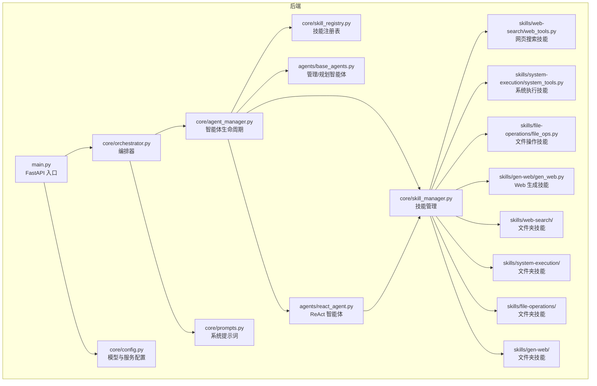

**图表来源**
- [localmanus-backend/main.py](file://localmanus-backend/main.py#L1-L519)
- [localmanus-backend/core/orchestrator.py](file://localmanus-backend/core/orchestrator.py#L1-L150)
- [localmanus-backend/core/agent_manager.py](file://localmanus-backend/core/agent_manager.py#L1-L44)
- [localmanus-backend/core/skill_manager.py](file://localmanus-backend/core/skill_manager.py#L1-L236)
- [localmanus-backend/core/skill_registry.py](file://localmanus-backend/core/skill_registry.py#L1-L156)
- [localmanus-backend/agents/base_agents.py](file://localmanus-backend/agents/base_agents.py#L1-L42)
- [localmanus-backend/agents/react_agent.py](file://localmanus-backend/agents/react_agent.py#L1-L390)
- [localmanus-backend/skills/web-search/web_tools.py](file://localmanus-backend/skills/web-search/web_tools.py#L1-L571)
- [localmanus-backend/skills/system-execution/system_tools.py](file://localmanus-backend/skills/system-execution/system_tools.py#L1-L78)
- [localmanus-backend/skills/file-operations/file_ops.py](file://localmanus-backend/skills/file-operations/file_ops.py#L1-L114)
- [localmanus-backend/skills/gen-web/gen_web.py](file://localmanus-backend/skills/gen-web/gen_web.py#L1-L200)

**章节来源**
- [localmanus-backend/main.py](file://localmanus-backend/main.py#L1-L519)
- [localmanus-backend/core/orchestrator.py](file://localmanus-backend/core/orchestrator.py#L1-L150)
- [localmanus-backend/core/agent_manager.py](file://localmanus-backend/core/agent_manager.py#L1-L44)
- [localmanus-backend/core/skill_manager.py](file://localmanus-backend/core/skill_manager.py#L1-L236)
- [localmanus-backend/core/skill_registry.py](file://localmanus-backend/core/skill_registry.py#L1-L156)
- [localmanus-backend/agents/base_agents.py](file://localmanus-backend/agents/base_agents.py#L1-L42)
- [localmanus-backend/agents/react_agent.py](file://localmanus-backend/agents/react_agent.py#L1-L390)
- [localmanus-backend/skills/web-search/web_tools.py](file://localmanus-backend/skills/web-search/web_tools.py#L1-L571)
- [localmanus-backend/skills/system-execution/system_tools.py](file://localmanus-backend/skills/system-execution/system_tools.py#L1-L78)
- [localmanus-backend/skills/file-operations/file_ops.py](file://localmanus-backend/skills/file-operations/file_ops.py#L1-L114)
- [localmanus-backend/skills/gen-web/gen_web.py](file://localmanus-backend/skills/gen-web/gen_web.py#L1-L200)

## 核心组件
- BaseSkill：技能基类，统一提供标准化的技能接口和元数据管理
- SkillManager：动态加载技能、聚合工具元数据、按名称检索技能，支持 Python 和文件夹技能
- SkillRegistry：技能注册表，提供集中化的技能元数据管理、分类组织和配置持久化
- Orchestrator：会话管理、JSON 解析、工作流编排
- ManagerAgent/PlannerAgent：意图解析与任务 DAG 规划
- ReActAgent：基于工具的推理与行动循环，集成 AgentScope Toolkit
- AgentLifecycleManager：AgentScope 初始化与智能体装配
- FastAPI 入口：SSE、WebSocket 接口和技能管理 RESTful API

**更新** 工具调用执行机制已优化，UserContextToolkit 现在返回同步列表而非异步生成器，提升与 AgentScope 的兼容性。

**章节来源**
- [localmanus-backend/core/skill_manager.py](file://localmanus-backend/core/skill_manager.py#L17-L236)
- [localmanus-backend/core/skill_registry.py](file://localmanus-backend/core/skill_registry.py#L12-L156)
- [localmanus-backend/core/orchestrator.py](file://localmanus-backend/core/orchestrator.py#L11-L150)
- [localmanus-backend/agents/base_agents.py](file://localmanus-backend/agents/base_agents.py#L6-L42)
- [localmanus-backend/agents/react_agent.py](file://localmanus-backend/agents/react_agent.py#L20-L390)
- [localmanus-backend/core/agent_manager.py](file://localmanus-backend/core/agent_manager.py#L10-L44)
- [localmanus-backend/main.py](file://localmanus-backend/main.py#L1-L519)

## 架构总览
系统采用"动态多智能体 + 技能注册表 + 沙箱执行"的整体架构。前端通过 SSE/WebSocket 与后端交互，后端通过 AgentScope 的智能体完成意图解析、任务规划与工具调用，技能通过增强的动态加载机制注入，最终在沙箱中受控执行。新的 SkillRegistry 架构提供统一的技能管理中心，支持自动化元数据管理、技能分类和配置持久化。

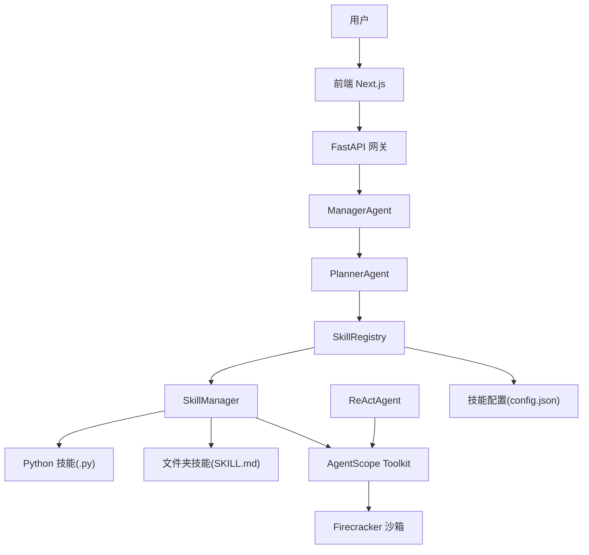

**图表来源**
- [localmanus_architecture.md](file://localmanus_architecture.md#L1-L137)
- [localmanus-backend/core/orchestrator.py](file://localmanus-backend/core/orchestrator.py#L130-L150)
- [localmanus-backend/core/skill_manager.py](file://localmanus-backend/core/skill_manager.py#L17-L236)
- [localmanus-backend/core/skill_registry.py](file://localmanus-backend/core/skill_registry.py#L12-L156)
- [localmanus-backend/agents/react_agent.py](file://localmanus-backend/agents/react_agent.py#L20-L390)

## 详细组件分析

### 新增的 SkillRegistry 架构
SkillRegistry 是系统的核心技能管理中心，提供以下关键功能：

- **集中化管理**：统一管理所有已注册技能的元数据和配置
- **自动化元数据提取**：从 AgentScope Toolkit 自动提取工具信息
- **技能分类系统**：基于函数名称自动推断技能类别（web_search、file_operations、generation、system_execution、general）
- **配置持久化**：支持技能启用/禁用状态和自定义配置的保存
- **RESTful API 集成**：提供完整的技能管理接口

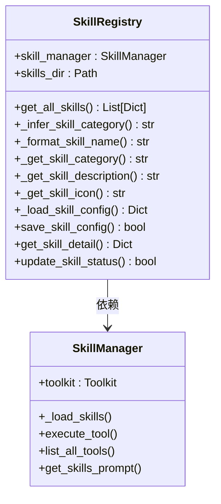

**图表来源**
- [localmanus-backend/core/skill_registry.py](file://localmanus-backend/core/skill_registry.py#L12-L156)
- [localmanus-backend/core/skill_manager.py](file://localmanus-backend/core/skill_manager.py#L17-L236)

**章节来源**
- [localmanus-backend/core/skill_registry.py](file://localmanus-backend/core/skill_registry.py#L12-L156)
- [localmanus-backend/core/skill_manager.py](file://localmanus-backend/core/skill_manager.py#L17-L236)

### 自动化元数据管理机制
SkillRegistry 实现了完整的自动化元数据管理，包括：

- **工具信息提取**：从 AgentScope Toolkit 的 get_json_schemas() 获取所有工具定义
- **技能分组**：按技能类别自动组织工具，支持 5 种预定义类别
- **元数据映射**：将函数名称映射到对应的技能显示名称、描述和图标
- **配置加载**：自动加载每个技能目录下的 config.json 配置文件
- **动态分类**：基于函数名称关键字自动推断技能类别

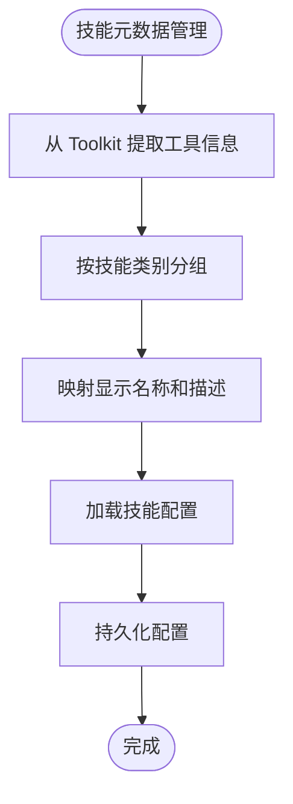

**图表来源**
- [localmanus-backend/core/skill_registry.py](file://localmanus-backend/core/skill_registry.py#L19-L59)

**章节来源**
- [localmanus-backend/core/skill_registry.py](file://localmanus-backend/core/skill_registry.py#L19-L156)

### 增强的 SkillManager 动态加载机制
SkillManager 保持原有的双重加载支持，同时增强了与 SkillRegistry 的集成：

- **双重加载支持**：同时支持 Python 基础技能和文件夹技能
- **AgentScope 集成**：使用 toolkit.register_agent_skill() 注册文件夹技能
- **工具函数注册**：自动注册继承自 BaseSkill 的类方法和独立函数
- **异步支持**：支持协程函数的异步执行
- **用户上下文注入**：自动注入 user_id 和 user_context 参数

**更新** 工具调用执行机制已优化，UserContextToolkit 现在使用同步列表收集响应，提升与 AgentScope 的兼容性。

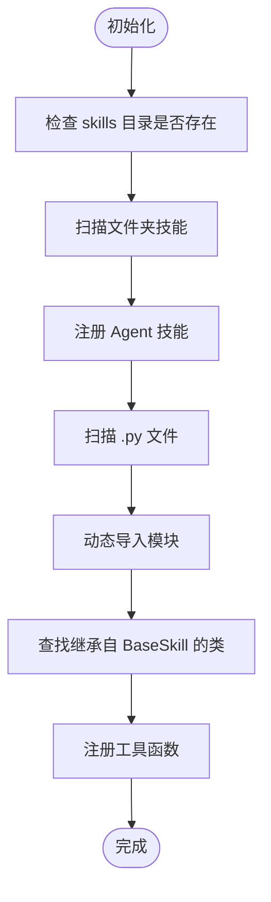

**图表来源**
- [localmanus-backend/core/skill_manager.py](file://localmanus-backend/core/skill_manager.py#L109-L169)

**章节来源**
- [localmanus-backend/core/skill_manager.py](file://localmanus-backend/core/skill_manager.py#L17-L236)

### UserContextToolkit 工具调用优化
UserContextToolkit 是技能管理的核心组件，负责工具函数的调用和响应处理。经过优化后，它现在使用同步列表收集响应，确保与 AgentScope 框架的完全兼容。

- **同步响应收集**：将异步生成器转换为同步列表，满足 AgentScope 的期望
- **错误处理**：当工具不存在时返回标准化的错误响应列表
- **参数注入**：自动注入 user_id 和 user_context 参数
- **响应格式化**：确保所有响应都符合 ToolResponse 格式

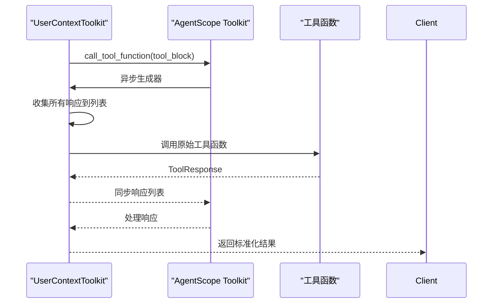

**图表来源**
- [localmanus-backend/core/skill_manager.py](file://localmanus-backend/core/skill_manager.py#L23-L87)

**章节来源**
- [localmanus-backend/core/skill_manager.py](file://localmanus-backend/core/skill_manager.py#L17-L236)

### 文件夹技能支持与 ComposioHQ 模式
文件夹技能现在通过 SkillRegistry 进行更智能的管理：

- **SKILL.md 支持**：支持 YAML 前言和 Markdown 内容
- **自动注册**：通过 toolkit.register_agent_skill() 自动注册
- **配置文件**：支持 config.json 配置文件的自动加载
- **类别推断**：基于文件夹名称和内容自动推断技能类别
- **元数据提取**：从 SKILL.md 中提取技能名称和描述

**章节来源**
- [localmanus-backend/skills/web-search/SKILL.md](file://localmanus-backend/skills/web-search/SKILL.md#L1-L27)
- [localmanus-backend/skills/system-execution/SKILL.md](file://localmanus-backend/skills/system-execution/SKILL.md#L1-L27)
- [localmanus-backend/skills/file-operations/SKILL.md](file://localmanus-backend/skills/file-operations/SKILL.md#L1-L28)
- [localmanus-backend/skills/gen-web/SKILL.md](file://localmanus-backend/skills/gen-web/SKILL.md#L1-L77)
- [localmanus-backend/skills/README.md](file://localmanus-backend/skills/README.md#L1-L122)

### 新增的 RESTful API 端点
SkillRegistry 通过 main.py 提供完整的技能管理 API：

- **GET /api/skills**：获取所有技能列表和元数据
- **GET /api/skills/{skill_id}**：获取特定技能的详细信息
- **PUT /api/skills/{skill_id}/config**：更新技能配置
- **PUT /api/skills/{skill_id}/status**：启用或禁用技能
- **认证集成**：所有端点都需要用户认证

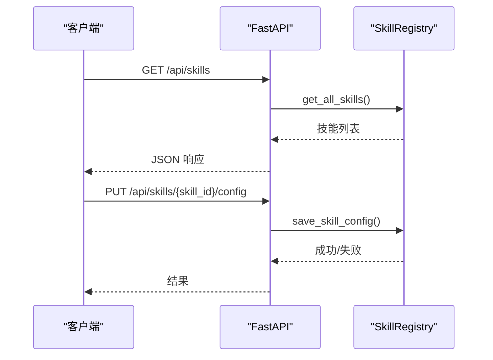

**图表来源**
- [localmanus-backend/main.py](file://localmanus-backend/main.py#L222-L267)
- [localmanus-backend/core/skill_registry.py](file://localmanus-backend/core/skill_registry.py#L129-L156)

**章节来源**
- [localmanus-backend/main.py](file://localmanus-backend/main.py#L222-L267)
- [localmanus-backend/core/skill_registry.py](file://localmanus-backend/core/skill_registry.py#L129-L156)

### 技能执行流程与参数解析
ReActAgent 保持原有的执行流程，但增强了与 SkillRegistry 的集成：

- **系统提示构建**：从 SkillManager 获取技能提示和工具元数据
- **实时流式响应**：支持模型输出的实时流式传输
- **工具调用提取**：从流式响应中提取工具调用信息
- **阻塞式执行**：工具调用完成后才继续下一步
- **上下文同步**：自动同步消息到会话历史

**更新** 工具执行现在使用优化的 UserContextToolkit，确保与 AgentScope 的完全兼容。

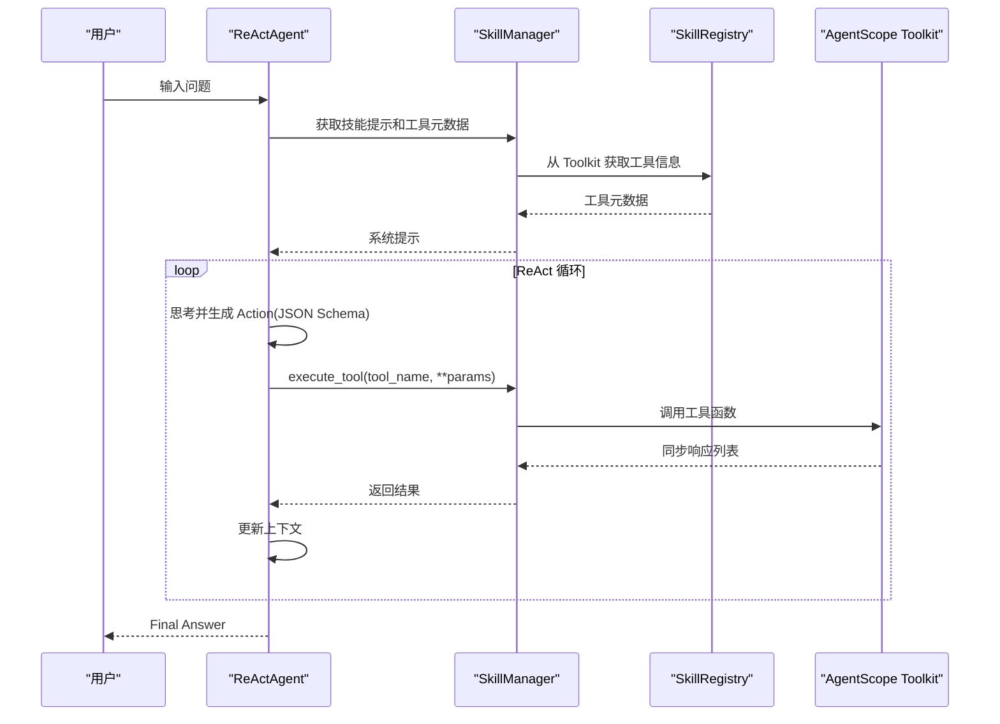

**图表来源**
- [localmanus-backend/agents/react_agent.py](file://localmanus-backend/agents/react_agent.py#L65-L125)
- [localmanus-backend/core/skill_manager.py](file://localmanus-backend/core/skill_manager.py#L170-L215)
- [localmanus-backend/core/skill_registry.py](file://localmanus-backend/core/skill_registry.py#L23-L29)

**章节来源**
- [localmanus-backend/agents/react_agent.py](file://localmanus-backend/agents/react_agent.py#L65-L125)
- [localmanus-backend/core/skill_manager.py](file://localmanus-backend/core/skill_manager.py#L170-L215)
- [localmanus-backend/core/skill_registry.py](file://localmanus-backend/core/skill_registry.py#L23-L29)

### 现有技能实现分析
**网页搜索技能 (WebSearchSkill)**
- **功能**：使用 DuckDuckGo 进行网络搜索和 BeautifulSoup 进行网页抓取
- **方法**：search_web() 和 scrape_web()，支持异步执行
- **错误处理**：显式检查异常并返回可读错误信息
- **类型注解**：完整的方法签名和参数类型注解

**系统执行技能 (SystemExecutionSkill)**
- **功能**：执行 Python 代码和 shell 命令
- **异步支持**：python_execute() 和 shell_execute() 均为异步方法
- **AgentScope 集成**：使用 execute_python_code 和 execute_shell_command 工具
- **错误处理**：返回详细的错误信息

**文件操作技能 (FileOperationSkill)**
- **功能**：文件读取、写入和目录列表
- **安全检查**：检查文件存在性和权限
- **错误处理**：显式捕获文件操作异常
- **类型注解**：完整的参数和返回值类型注解

**Web 生成技能 (GenWebSkill)**
- **功能**：生成全栈 Web 项目，使用 Firecracker 微虚拟机
- **安全隔离**：每个用户拥有独立的虚拟机环境
- **VNC 支持**：提供可视化开发环境访问
- **资源管理**：自动清理未使用的 VM 资源

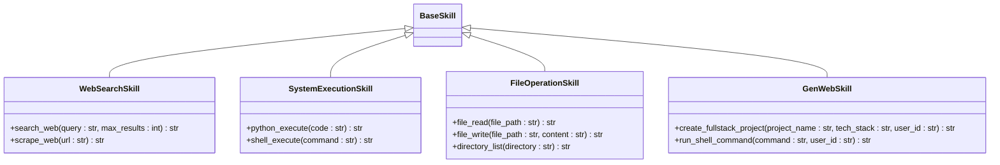

**图表来源**
- [localmanus-backend/skills/web-search/web_tools.py](file://localmanus-backend/skills/web-search/web_tools.py#L214-L571)
- [localmanus-backend/skills/system-execution/system_tools.py](file://localmanus-backend/skills/system-execution/system_tools.py#L6-L78)
- [localmanus-backend/skills/file-operations/file_ops.py](file://localmanus-backend/skills/file-operations/file_ops.py#L15-L114)
- [localmanus-backend/skills/gen-web/gen_web.py](file://localmanus-backend/skills/gen-web/gen_web.py#L1-L200)

**章节来源**
- [localmanus-backend/skills/web-search/web_tools.py](file://localmanus-backend/skills/web-search/web_tools.py#L1-L571)
- [localmanus-backend/skills/system-execution/system_tools.py](file://localmanus-backend/skills/system-execution/system_tools.py#L1-L78)
- [localmanus-backend/skills/file-operations/file_ops.py](file://localmanus-backend/skills/file-operations/file_ops.py#L1-L114)
- [localmanus-backend/skills/gen-web/gen_web.py](file://localmanus-backend/skills/gen-web/gen_web.py#L1-L200)

### 编排器与会话管理
编排器保持原有功能，但增强了与 SkillRegistry 的集成：

- **会话存储**：按 session_id 维护历史消息
- **流式聊天**：SSE 输出状态、内容与结束标记
- **JSON 提取**：从智能体响应中抽取 JSON 块
- **工作流编排**：调用 Manager/Planner 生成 DAG 并附加 trace_id
- **工具元数据集成**：通过 SkillManager 获取最新的工具清单

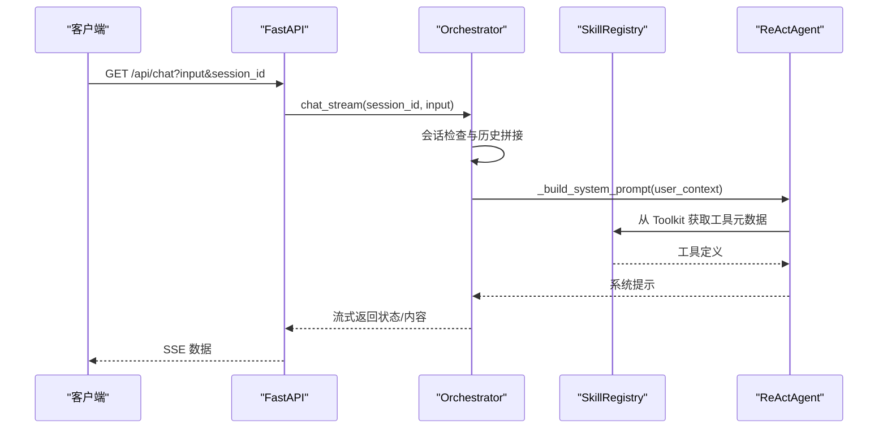

**图表来源**
- [localmanus-backend/main.py](file://localmanus-backend/main.py#L392-L420)
- [localmanus-backend/core/orchestrator.py](file://localmanus-backend/core/orchestrator.py#L16-L89)
- [localmanus-backend/agents/react_agent.py](file://localmanus-backend/agents/react_agent.py#L48-L63)

**章节来源**
- [localmanus-backend/main.py](file://localmanus-backend/main.py#L392-L420)
- [localmanus-backend/core/orchestrator.py](file://localmanus-backend/core/orchestrator.py#L16-L89)
- [localmanus-backend/agents/react_agent.py](file://localmanus-backend/agents/react_agent.py#L48-L63)

### 智能体生命周期与装配
智能体生命周期管理保持原有流程，但增强了与 SkillRegistry 的集成：

- **AgentScope 初始化**：根据配置加载模型
- **工具元数据注入**：ReActAgent 依赖 SkillManager 提供工具元数据
- **全局单例**：init_agents() 确保全局共享同一实例
- **工具注册**：自动将所有技能工具注册到 Toolkit

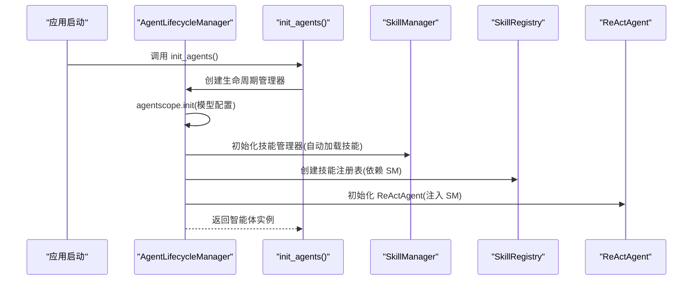

**图表来源**
- [localmanus-backend/core/agent_manager.py](file://localmanus-backend/core/agent_manager.py#L10-L34)
- [localmanus-backend/main.py](file://localmanus-backend/main.py#L35-L39)

**章节来源**
- [localmanus-backend/core/agent_manager.py](file://localmanus-backend/core/agent_manager.py#L10-L34)
- [localmanus-backend/main.py](file://localmanus-backend/main.py#L35-L39)

### 技能注册表与依赖管理
SkillRegistry 提供了完整的技能注册表管理：

- **技能分类**：支持 5 种预定义技能类别（web_search、file_operations、generation、system_execution、general）
- **元数据映射**：为每种技能类别提供显示名称、描述和图标映射
- **配置持久化**：支持技能启用/禁用状态和自定义配置的保存
- **动态路由**：Planner 基于注册表选择合适技能
- **文件夹技能支持**：自动发现和注册文件夹格式的技能

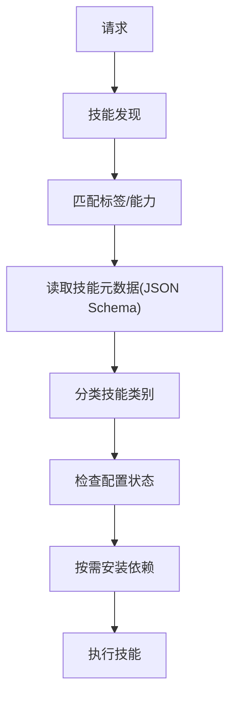

**图表来源**
- [localmanus-backend/core/orchestrator.py](file://localmanus-backend/core/orchestrator.py#L130-L150)
- [localmanus-backend/core/skill_registry.py](file://localmanus-backend/core/skill_registry.py#L61-L72)

**章节来源**
- [localmanus-backend/core/orchestrator.py](file://localmanus-backend/core/orchestrator.py#L130-L150)
- [localmanus-backend/core/skill_registry.py](file://localmanus-backend/core/skill_registry.py#L61-L72)

### 沙箱隔离机制与执行链路
沙箱隔离机制保持原有设计，但增强了与 SkillRegistry 的集成：

- **快照恢复**：热快照池实现亚毫秒级恢复
- **通信通道**：MMDS 与 AF_VSOCK 用于注入与数据传输
- **权限降级**：Jailer + seccomp 降低虚拟机权限
- **反馈闭环**：执行结果驱动自纠正与重试
- **资源隔离**：Web 生成技能提供用户级别的资源隔离

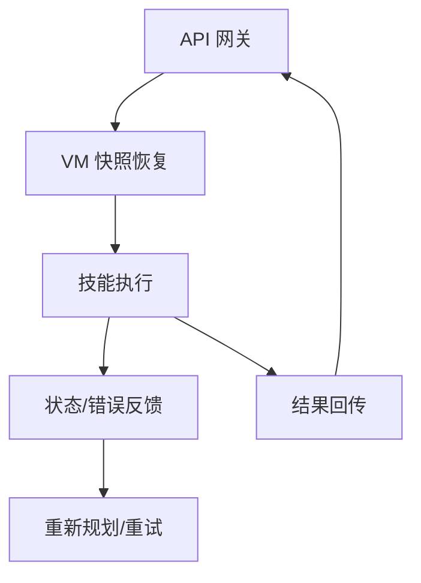

**图表来源**
- [localmanus_architecture.md](file://localmanus_architecture.md#L50-L66)

**章节来源**
- [localmanus_architecture.md](file://localmanus_architecture.md#L50-L66)

## 依赖关系分析
- **后端依赖**：FastAPI、Uvicorn、AgentScope、Pydantic、WebSockets、python-multipart、python-dotenv
- **模型配置**：通过环境变量注入，支持本地或远程大模型服务
- **智能体依赖**：AgentScope 提供对话与消息传递能力
- **文件夹技能依赖**：PyYAML 用于解析 SKILL.md 中的 YAML 前言
- **技能注册表依赖**：Pathlib 用于文件路径操作，json 用于配置持久化

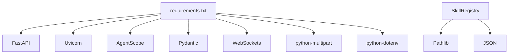

**图表来源**
- [localmanus-backend/requirements.txt](file://localmanus-backend/requirements.txt#L1-L8)
- [localmanus-backend/core/skill_registry.py](file://localmanus-backend/core/skill_registry.py#L4-L8)

**章节来源**
- [localmanus-backend/requirements.txt](file://localmanus-backend/requirements.txt#L1-L8)
- [localmanus-backend/core/config.py](file://localmanus-backend/core/config.py#L8-L16)
- [localmanus-backend/core/skill_registry.py](file://localmanus-backend/core/skill_registry.py#L4-L8)

## 性能考虑
- **动态加载优化**：仅在首次访问时加载技能，减少启动开销
- **工具元数据缓存**：ReActAgent 可缓存工具清单，避免重复扫描
- **异步执行**：支持协程函数的异步执行，提升并发性能
- **参数解析优化**：使用 JSON Schema 进行参数验证，提升安全性
- **会话上限**：限制历史轮次，避免上下文膨胀导致性能下降
- **沙箱快照**：热快照恢复显著降低冷启动时间
- **文件夹技能缓存**：解析后的文件夹技能信息可缓存复用
- **技能配置缓存**：SkillRegistry 缓存技能配置，减少磁盘 I/O
- **自动化元数据提取**：通过 Toolkit 一次性提取所有工具信息
- **工具调用优化**：UserContextToolkit 使用同步列表收集响应，提升执行效率

**更新** 工具调用执行效率已显著提升，UserContextToolkit 的同步响应收集机制确保了与 AgentScope 框架的完全兼容。

**章节来源**
- [localmanus-backend/core/skill_manager.py](file://localmanus-backend/core/skill_manager.py#L170-L236)
- [localmanus-backend/agents/react_agent.py](file://localmanus-backend/agents/react_agent.py#L241-L253)
- [localmanus-backend/core/orchestrator.py](file://localmanus-backend/core/orchestrator.py#L34-L37)
- [localmanus-backend/core/skill_registry.py](file://localmanus-backend/core/skill_registry.py#L118-L127)
- [localmanus_architecture.md](file://localmanus_architecture.md#L52-L56)

## 故障排查指南
- **技能未加载**：确认技能文件位于 skills 目录；检查类是否继承 BaseSkill；查看控制台导入异常日志
- **文件夹技能加载失败**：检查 SKILL.md 文件格式是否正确；确认 YAML 前言格式；验证文件编码
- **工具不存在**：execute 抛出"工具未找到"异常，检查工具名大小写与拼写
- **JSON Schema 解析错误**：检查方法的类型注解和文档字符串格式
- **会话超限**：超过最大轮次限制会返回错误，需清理会话或增加上限
- **沙箱通信**：若 VSOCK/MMDS 异常，检查宿主机与虚拟机网络配置与权限
- **技能配置保存失败**：检查文件权限和磁盘空间；确认 JSON 格式正确
- **RESTful API 认证失败**：确认用户已登录并提供有效的访问令牌
- **技能分类错误**：检查函数名称是否包含正确的关键词；必要时手动指定技能类别
- **工具调用失败**：检查 UserContextToolkit 是否正确收集响应；验证工具函数签名

**更新** 工具调用相关的问题现在主要集中在 UserContextToolkit 的响应收集上，确保同步列表格式的正确性。

**章节来源**
- [localmanus-backend/core/skill_manager.py](file://localmanus-backend/core/skill_manager.py#L45-L53)
- [localmanus-backend/core/skill_registry.py](file://localmanus-backend/core/skill_registry.py#L129-L156)
- [localmanus-backend/agents/react_agent.py](file://localmanus-backend/agents/react_agent.py#L328-L340)
- [localmanus-backend/core/orchestrator.py](file://localmanus-backend/core/orchestrator.py#L34-L37)
- [localmanus-backend/main.py](file://localmanus-backend/main.py#L222-L267)
- [localmanus_architecture.md](file://localmanus_architecture.md#L57-L60)

## 结论
LocalManus 技能管理系统通过新增的 SkillRegistry 架构实现了真正的自动化元数据管理，形成了"技能发现—元数据提取—分类组织—配置持久化—API 管理"的完整闭环。新的架构在保持向后兼容性的同时，提供了更强的标准化能力和更好的可维护性。SkillRegistry 的集中化管理使得技能的生命周期管理更加完善，支持从 AgentScope Toolkit 自动提取工具信息，实现真正的自动化元数据管理。配合增强的 RESTful API 和 Firecracker 沙箱的高性能与强隔离，系统在安全性、可扩展性和标准化方面具备显著优势。

**更新** 最重要的改进是工具调用执行机制的优化，从异步生成器改为同步列表返回，显著提升了与 AgentScope 框架的兼容性和工具执行效率。这一优化确保了所有工具调用都能正确返回标准化的响应格式，消除了与 AgentScope 框架的兼容性问题。

后续可在技能分类智能化、配置模板化、依赖自动安装等方面持续优化。

## 附录

### 技能开发最佳实践
- **使用 BaseSkill 基类**：确保工具方法公开且无前缀下划线
- **遵循 Anthropic 标准**：使用类型注解和完整的文档字符串
- **JSON Schema 兼容**：方法签名应符合 Anthropic 工具模式要求
- **为每个工具编写清晰的 docstring**：包含 Args 和 Returns 部分
- **对输入进行显式校验与异常捕获**：返回可读错误信息
- **使用类型注解**：便于生成参数签名与 Schema
- **文件夹技能格式**：遵循 ComposioHQ awesome-claude-skills 模式
- **配置文件**：为复杂技能创建 config.json 文件
- **图标和描述**：为技能提供合适的 Lucide 图标和描述
- **工具调用兼容性**：确保工具函数返回 ToolResponse 或支持同步响应格式

**更新** 新增工具调用兼容性要求，确保与 AgentScope 框架的完全兼容。

**章节来源**
- [localmanus-backend/core/skill_manager.py](file://localmanus-backend/core/skill_manager.py#L17-L236)
- [localmanus-backend/skills/web-search/web_tools.py](file://localmanus-backend/skills/web-search/web_tools.py#L214-L571)
- [localmanus-backend/skills/README.md](file://localmanus-backend/skills/README.md#L104-L115)
- [localmanus-backend/core/skill_registry.py](file://localmanus-backend/core/skill_registry.py#L107-L116)

### 扩展指南：新增技能
**新增 Python 技能**
- 在 skills 目录新建 Python 文件，定义继承 BaseSkill 的类
- 实现工具方法，使用类型注解和完整文档字符串
- 系统将自动发现并注册新技能

**新增文件夹技能**
- 在 skills 目录创建新文件夹
- 在文件夹中创建 SKILL.md 文件，包含 YAML 前言和 Markdown 内容
- 可选：创建 config.json 文件进行配置
- 系统将自动加载并注册该文件夹技能

**技能模板参考**
- Python 技能模板：参考 WebSearchSkill、SystemExecutionSkill、FileOperationSkill 类
- 文件夹技能模板：参考 web-search、system-execution、file-operations、gen-web 目录
- Web 生成技能模板：参考 gen-web 目录的完整实现

**章节来源**
- [localmanus-backend/core/skill_manager.py](file://localmanus-backend/core/skill_manager.py#L109-L169)
- [localmanus-backend/core/skill_manager.py](file://localmanus-backend/core/skill_manager.py#L137-L169)
- [localmanus-backend/skills/README.md](file://localmanus-backend/skills/README.md#L104-L122)
- [localmanus-backend/skills/gen-web/SKILL.md](file://localmanus-backend/skills/gen-web/SKILL.md#L1-L77)

### 路线图与优先级
- **优先实现**：DataScope（基础 Python 代码执行）、IntelSearch（网络搜索）、Studio-Render（PPTX/PDF 渲染）、Doc-Transformer（文档转换）
- **设计原则**：Schema 驱动、环境标签、可观测日志
- **标准化推进**：逐步将所有技能迁移到 Anthropic 工具模式标准
- **文件夹技能扩展**：增加更多文件夹技能示例和模板
- **SkillRegistry 优化**：增强技能分类智能化、配置模板化
- **API 完善**：添加技能搜索、过滤和批量管理功能
- **工具调用优化**：进一步优化 UserContextToolkit 的响应处理性能

**更新** 工具调用优化已作为优先事项完成，后续可关注性能监控和进一步优化。

**章节来源**
- [localmanus_skills_roadmap.md](file://localmanus_skills_roadmap.md#L5-L10)
- [localmanus_skills_roadmap.md](file://localmanus_skills_roadmap.md#L58-L62)
- [localmanus-backend/skills/README.md](file://localmanus-backend/skills/README.md#L7-L122)
- [localmanus-backend/core/skill_registry.py](file://localmanus-backend/core/skill_registry.py#L61-L94)