# 现有技能分析

<cite>
**本文档引用的文件**
- [file_ops.py](file://localmanus-backend/skills/file-operations/file_ops.py)
- [wechat_formatter_tools.py](file://localmanus-backend/skills/wechat-article-formatter/wechat_formatter_tools.py)
- [README.md](file://localmanus-backend/skills/wechat-article-formatter/README.md)
- [tech-theme.css](file://localmanus-backend/skills/wechat-article-formatter/templates/tech-theme.css)
- [minimal-theme.css](file://localmanus-backend/skills/wechat-article-formatter/templates/minimal-theme.css)
- [publisher.py](file://localmanus-backend/skills/wechat-draft-publisher/publisher.py)
- [wechat_publisher_tools.py](file://localmanus-backend/skills/wechat-draft-publisher/wechat_publisher_tools.py)
- [optimize-html.py](file://localmanus-backend/skills/wechat-draft-publisher/scripts/optimize-html.py)
- [fix-wechat-style.py](file://localmanus-backend/skills/wechat-draft-publisher/scripts/fix-wechat-style.py)
- [wechat_image_tools.py](file://localmanus-backend/skills/wechat-tech-writer/wechat_image_tools.py)
- [wechat_pm_image_tools.py](file://localmanus-backend/skills/wechat-product-manager-writer/wechat_pm_image_tools.py)
- [skill_manager.py](file://localmanus-backend/core/skill_manager.py)
- [base_agents.py](file://localmanus-backend/agents/base_agents.py)
- [orchestrator.py](file://localmanus-backend/core/orchestrator.py)
- [prompts.py](file://localmanus-backend/core/prompts.py)
- [main.py](file://localmanus-backend/main.py)
- [localmanus_architecture.md](file://localmanus_architecture.md)
- [localmanus_skills_roadmap.md](file://localmanus_skills_roadmap.md)
- [test_orchestration.py](file://localmanus-backend/scripts/test_orchestration.py)
</cite>

## 更新摘要
**所做更改**
- 新增 WeChat 草稿发布器技能增强章节，重点分析图像自动压缩功能
- 更新草稿发布技能功能特性说明，包含图像优化处理能力
- 新增图像压缩算法实现细节和性能分析
- 更新技能系统架构图以反映增强的图像处理能力
- 添加图像压缩工具链和优化脚本分析

## 目录
1. [简介](#简介)
2. [项目结构](#项目结构)
3. [核心组件](#核心组件)
4. [架构概览](#架构概览)
5. [详细组件分析](#详细组件分析)
6. [WeChat 生态系统技能](#wechat-生态系统技能)
7. [WeChat 草稿发布器技能增强](#wechat-草稿发布器技能增强)
8. [依赖关系分析](#依赖关系分析)
9. [性能考虑](#性能考虑)
10. [故障排除指南](#故障排除指南)
11. [结论](#结论)
12. [附录](#附录)

## 简介

本文档对 LocalManus 项目的现有技能实现进行全面技术分析，特别以 FileOps 技能为例，深入解析文件操作技能的设计思路、方法实现、参数处理。该分析涵盖技能的功能范围、适用场景、限制条件，性能特点、资源消耗、并发处理能力，并提供技能使用的最佳实践、常见用法示例、集成方式说明，以及技能扩展的可能性、改进空间和替代方案对比，为新技能开发提供参考和借鉴。

**更新** 新增 WeChat 草稿发布器技能增强分析，重点介绍图像自动压缩功能的实现原理、性能优化策略和实际应用效果。

## 项目结构

LocalManus 项目采用模块化架构设计，主要分为后端服务和前端界面两大部分：

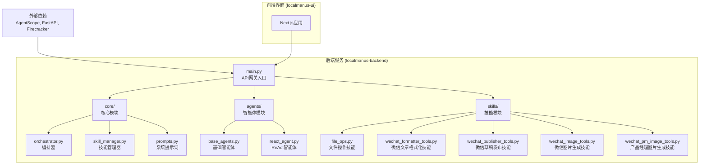

**图表来源**
- [main.py](file://localmanus-backend/main.py#L1-L95)
- [skill_manager.py](file://localmanus-backend/core/skill_manager.py#L1-L84)
- [file_ops.py](file://localmanus-backend/skills/file-operations/file_ops.py#L1-L41)
- [wechat_formatter_tools.py](file://localmanus-backend/skills/wechat-article-formatter/wechat_formatter_tools.py#L1-L331)

**章节来源**
- [main.py](file://localmanus-backend/main.py#L1-L95)
- [localmanus_architecture.md](file://localmanus_architecture.md#L1-L137)

## 核心组件

### 技能系统架构

LocalManus 的技能系统基于统一的 BaseSkill 抽象基类设计，实现了动态加载、工具发现和执行路由功能：

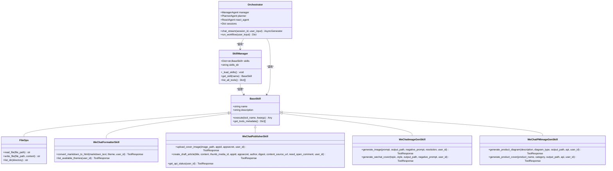

**图表来源**
- [skill_manager.py](file://localmanus-backend/core/skill_manager.py#L6-L41)
- [file_ops.py](file://localmanus-backend/skills/file-operations/file_ops.py#L4-L41)
- [wechat_formatter_tools.py](file://localmanus-backend/skills/wechat-article-formatter/wechat_formatter_tools.py#L22-L331)
- [wechat_publisher_tools.py](file://localmanus-backend/skills/wechat-draft-publisher/wechat_publisher_tools.py#L24-L450)
- [wechat_image_tools.py](file://localmanus-backend/skills/wechat-tech-writer/wechat_image_tools.py#L104-L305)
- [wechat_pm_image_tools.py](file://localmanus-backend/skills/wechat-product-manager-writer/wechat_pm_image_tools.py#L28-L143)

### 动态技能加载机制

技能系统采用动态导入机制，支持运行时自动发现和加载新技能：

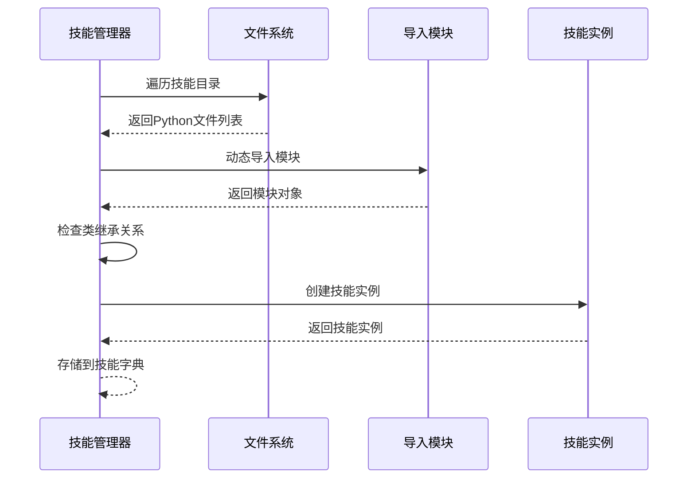

**图表来源**
- [skill_manager.py](file://localmanus-backend/core/skill_manager.py#L48-L71)

**章节来源**
- [skill_manager.py](file://localmanus-backend/core/skill_manager.py#L1-L84)
- [file_ops.py](file://localmanus-backend/skills/file-operations/file_ops.py#L1-L41)

## 架构概览

### 整体系统架构

LocalManus 采用基于 AgentScope 的动态多智能体系统架构，结合 Firecracker 微虚拟机实现安全的技能执行环境：

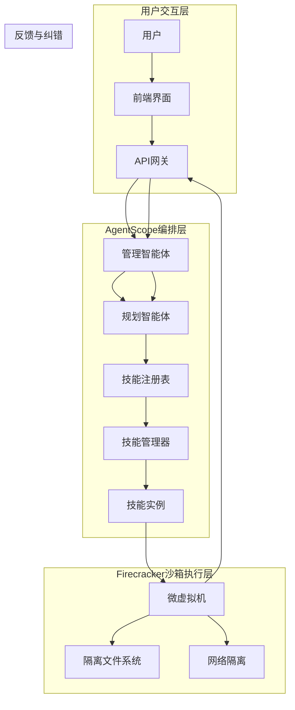

**图表来源**
- [localmanus_architecture.md](file://localmanus_architecture.md#L6-L31)
- [orchestrator.py](file://localmanus-backend/core/orchestrator.py#L98-L118)

### 技能执行流程

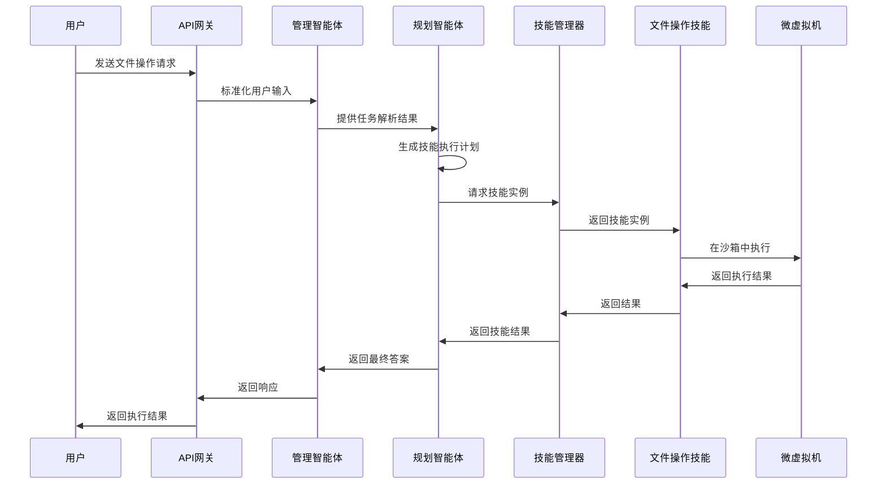

**图表来源**
- [localmanus_architecture.md](file://localmanus_architecture.md#L71-L114)
- [prompts.py](file://localmanus-backend/core/prompts.py#L18-L52)

**章节来源**
- [localmanus_architecture.md](file://localmanus_architecture.md#L1-L137)
- [prompts.py](file://localmanus-backend/core/prompts.py#L1-L53)

## 详细组件分析

### FileOps 技能深度分析

#### 设计思路

FileOps 技能作为基础文件操作技能，体现了 LocalManus 技能系统的简洁性和实用性设计原则。该技能专注于提供最基本的文件系统操作能力，包括文件读取、写入和目录列表功能。

#### 方法实现详解

##### read_file 方法

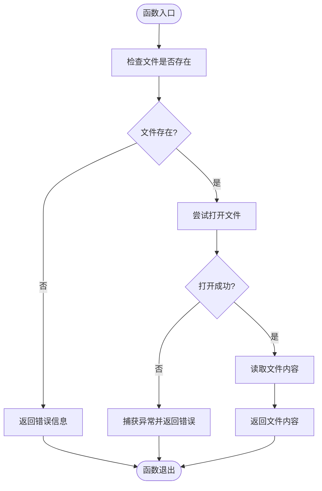

**图表来源**
- [file_ops.py](file://localmanus-backend/skills/file-operations/file_ops.py#L9-L19)

##### write_file 方法

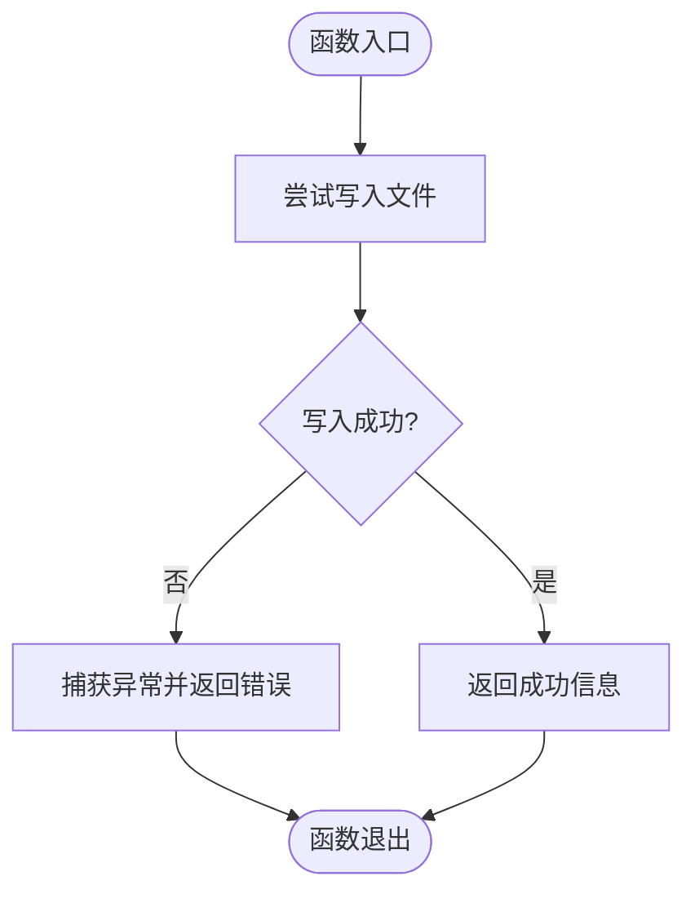

**图表来源**
- [file_ops.py](file://localmanus-backend/skills/file-operations/file_ops.py#L21-L30)

##### list_dir 方法

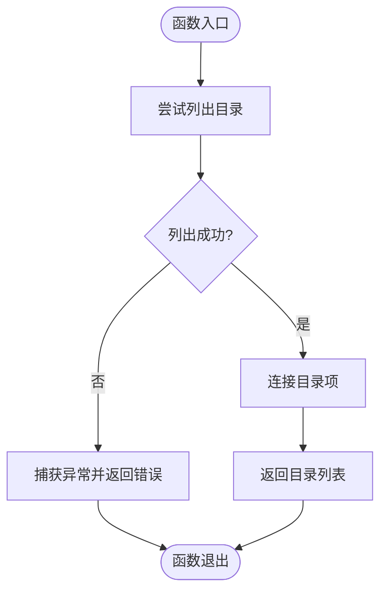

**图表来源**
- [file_ops.py](file://localmanus-backend/skills/file-operations/file_ops.py#L32-L40)

#### 参数处理机制

FileOps 技能采用简单直观的参数处理方式：

- **文件路径参数**：使用字符串类型，支持相对路径和绝对路径
- **内容参数**：使用字符串类型，适用于文本文件操作
- **目录参数**：默认值为当前目录，支持指定目标目录

#### 错误处理策略

技能实现了多层次的错误处理机制：

1. **文件存在性检查**：在读取前验证文件是否存在
2. **异常捕获**：使用 try-except 捕获文件操作异常
3. **错误信息格式化**：统一返回错误信息格式，便于上层处理

**章节来源**
- [file_ops.py](file://localmanus-backend/skills/file-operations/file_ops.py#L1-L41)

### 技能管理器分析

#### 动态加载机制

SkillManager 类实现了智能的技能动态加载功能：

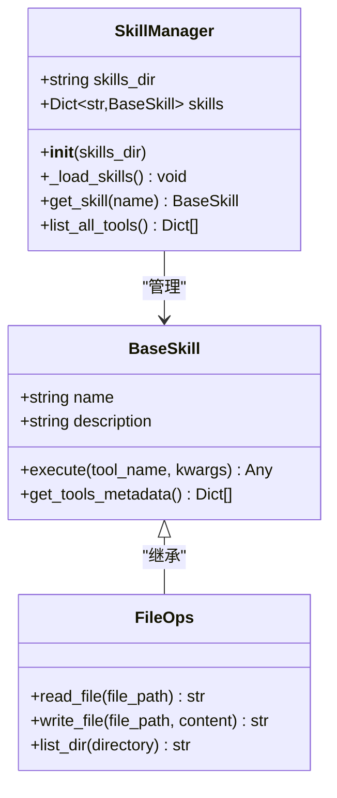

**图表来源**
- [skill_manager.py](file://localmanus-backend/core/skill_manager.py#L42-L84)

#### 工具元数据系统

技能管理器提供了完整的工具元数据发现机制：

- **方法反射**：使用 `inspect.getmembers()` 获取所有方法
- **工具描述**：从方法文档字符串提取描述信息
- **参数签名**：使用 `inspect.signature()` 获取参数信息

**章节来源**
- [skill_manager.py](file://localmanus-backend/core/skill_manager.py#L1-L84)

### 智能体系统分析

#### AgentScope 集成

系统集成了 AgentScope 框架，实现了强大的多智能体协作能力：

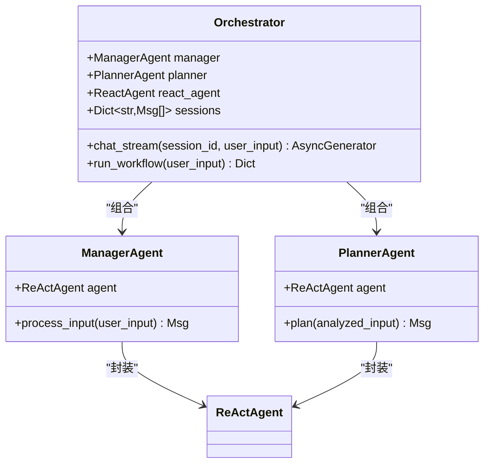

**图表来源**
- [base_agents.py](file://localmanus-backend/agents/base_agents.py#L6-L41)

#### JSON 解析机制

Orchestrator 类实现了智能的 JSON 解析功能：

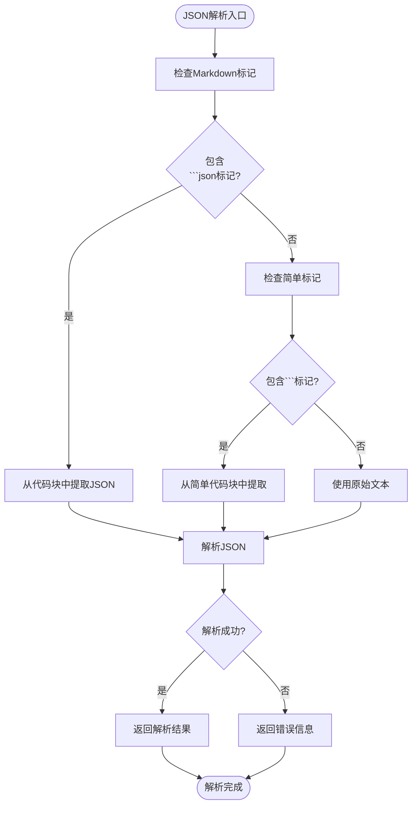

**图表来源**
- [orchestrator.py](file://localmanus-backend/core/orchestrator.py#L82-L96)

**章节来源**
- [base_agents.py](file://localmanus-backend/agents/base_agents.py#L1-L42)
- [orchestrator.py](file://localmanus-backend/core/orchestrator.py#L1-L118)

## WeChat 生态系统技能

### WeChat 文章格式化技能

#### 设计理念

WeChat 文章格式化技能专为微信公众号内容创作而设计，提供从 Markdown 到适配微信平台的 HTML 转换能力。该技能解决了微信编辑器对 CSS 和 JavaScript 的严格限制，通过内联样式和主题化设计确保内容在不同设备上的完美呈现。

#### 核心功能特性

##### 多主题系统

技能支持三种预设主题，每种主题针对不同的内容类型进行了专门优化：

- **Tech 主题（科技风）**：蓝紫色渐变配色，Atom One Dark 代码高亮，适合技术文章
- **Minimal 主题（简约风）**：黑白灰配色，GitHub 风格代码块，适合通用文章
- **Business 主题（商务风）**：深蓝金色配色，Monokai 代码高亮，适合商业报告

##### 智能样式转换

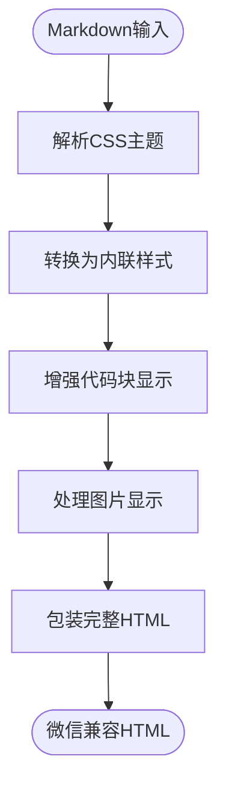

**图表来源**
- [wechat_formatter_tools.py](file://localmanus-backend/skills/wechat-article-formatter/wechat_formatter_tools.py#L210-L296)

#### 实现原理

##### CSS 到内联样式的转换

技能使用 cssutils 库解析 CSS 文件，然后通过 BeautifulSoup 将样式规则转换为内联样式，确保在微信编辑器中的兼容性。

##### 图片处理优化

自动为图片添加适当的样式，包括最大宽度限制、高度自适应、居中显示和外边距设置，确保在移动设备上的良好显示效果。

#### 使用场景

- **技术博客**：推荐使用 Tech 主题，获得专业的科技感排版
- **生活随笔**：推荐使用 Minimal 主题，保持简洁清新的阅读体验
- **商业报告**：推荐使用 Business 主题，展现专业稳重的企业形象

**章节来源**
- [wechat_formatter_tools.py](file://localmanus-backend/skills/wechat-article-formatter/wechat_formatter_tools.py#L1-L331)
- [README.md](file://localmanus-backend/skills/wechat-article-formatter/README.md#L1-L398)
- [tech-theme.css](file://localmanus-backend/skills/wechat-article-formatter/templates/tech-theme.css#L1-L438)
- [minimal-theme.css](file://localmanus-backend/skills/wechat-article-formatter/templates/minimal-theme.css#L1-L183)

### WeChat 草稿发布技能

#### 功能概述

WeChat 草稿发布技能提供了完整的微信公众号内容发布自动化解决方案，包括访问令牌管理、图片上传、草稿创建和错误处理等功能。

#### 核心流程

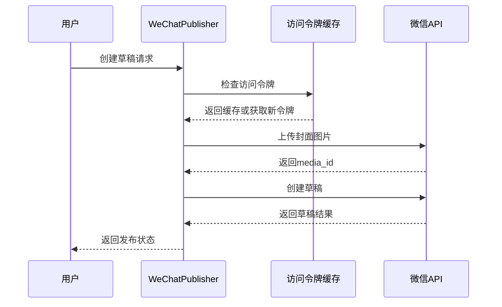

**图表来源**
- [publisher.py](file://localmanus-backend/skills/wechat-draft-publisher/publisher.py#L146-L780)

#### 关键特性

##### 智能配置管理

- **交互式配置向导**：首次使用时引导用户完成微信公众号凭证配置
- **配置文件验证**：自动验证 AppID 和 AppSecret 的格式和有效性
- **权限安全设置**：配置文件权限设置为 600，确保安全性

##### 访问令牌管理

- **缓存机制**：自动缓存 access_token，减少 API 调用频率
- **自动刷新**：在令牌即将过期前自动刷新
- **错误处理**：针对不同错误码提供具体的解决方案

##### 图片处理优化

- **封面图片移除**：自动识别并移除 HTML 中的封面图片引用
- **内容图片上传**：扫描并上传内容中的本地图片到微信服务器
- **URL 替换**：将本地图片路径替换为微信可访问的 URL

#### 微信平台适配

技能针对微信编辑器的特殊限制进行了专门优化：

- **样式兼容性**：将复杂的 CSS 转换为微信支持的内联样式
- **布局稳定性**：使用 table 结构确保背景色和布局在编辑器中保持稳定
- **字体控制**：强制设置字体大小和缩进，避免编辑器默认样式覆盖

**章节来源**
- [publisher.py](file://localmanus-backend/skills/wechat-draft-publisher/publisher.py#L1-L871)

### WeChat 技术写作技能

#### AI 图像生成能力

WeChat 技术写作技能集成了多个 AI 图像生成 API，为技术文章提供高质量的视觉内容支持。

##### 支持的 API 服务

- **SiliconFlow API**：使用 Kolors 模型，支持多种分辨率
- **Gemini API**：Google 的 Gemini 2.0 图像生成模型
- **DALL-E API**：OpenAI 的 DALL-E 3 图像生成服务

##### 优化的提示词工程

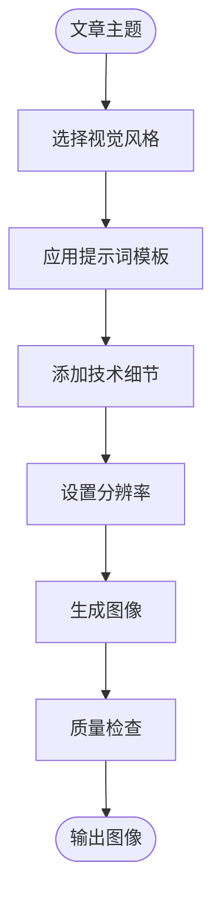

**图表来源**
- [wechat_image_tools.py](file://localmanus-backend/skills/wechat-tech-writer/wechat_image_tools.py#L204-L258)

#### 功能特性

##### 多风格封面生成

支持四种视觉风格的微信文章封面生成：
- **Tech 风格**：现代科技感，蓝紫色渐变
- **Business 风格**：商务专业感，深蓝色和金色
- **Minimal 风格**：极简主义，黑白灰配色
- **Creative 风格**：创意艺术感，活力色彩

##### 专业图表生成

除了封面图片，技能还支持生成各种专业图表：
- **流程图**：业务流程可视化
- **架构图**：系统架构设计图
- **线框图**：UI 原型设计
- **路线图**：产品发展时间轴

**章节来源**
- [wechat_image_tools.py](file://localmanus-backend/skills/wechat-tech-writer/wechat_image_tools.py#L1-L305)

### WeChat 产品经理写作技能

#### 专业化功能

WeChat 产品经理写作技能基于技术写作技能构建，专门为产品经理的文章内容提供专门的图像生成功能。

#### 专用功能

##### 产品图表生成

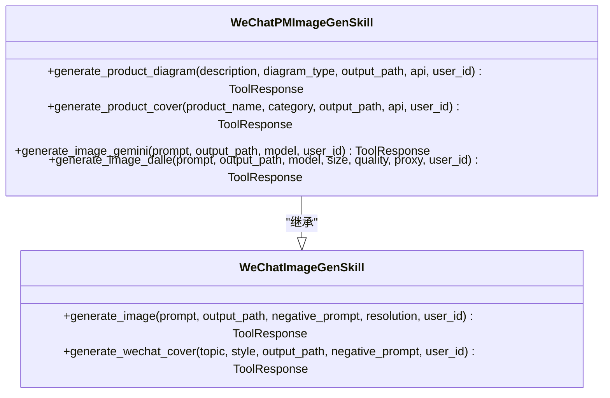

**图表来源**
- [wechat_pm_image_tools.py](file://localmanus-backend/skills/wechat-product-manager-writer/wechat_pm_image_tools.py#L28-L143)

##### 产品相关功能

- **产品流程图**：生成产品开发流程图
- **系统架构图**：展示产品技术架构
- **原型线框图**：生成 UI 原型设计
- **产品路线图**：制作产品发展时间表

#### 产品类别支持

支持多种产品类型的封面生成：
- **Tech 产品**：科技类产品封面
- **Finance 产品**：金融产品封面
- **Health 产品**：健康医疗产品封面
- **Education 产品**：教育类产品封面

**章节来源**
- [wechat_pm_image_tools.py](file://localmanus-backend/skills/wechat-product-manager-writer/wechat_pm_image_tools.py#L1-L143)

## WeChat 草稿发布器技能增强

### 图像自动压缩功能

#### 设计理念

WeChat 草稿发布器技能的图像自动压缩功能旨在解决微信公众号平台对图片大小和格式的严格限制，同时保持图片的视觉质量和加载性能。该功能通过智能压缩算法，在保证内容质量的前提下，将图片文件大小控制在微信平台要求的范围内。

#### 核心算法实现

##### 图像压缩流程

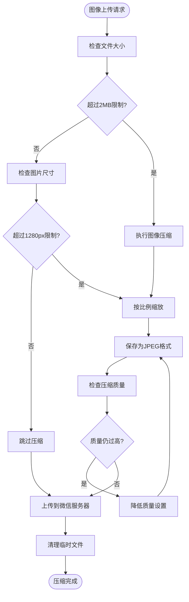

**图表来源**
- [wechat_publisher_tools.py](file://localmanus-backend/skills/wechat-draft-publisher/wechat_publisher_tools.py#L61-L165)

#### 压缩参数优化

压缩算法采用多层优化策略：

- **文件大小限制**：2MB（微信平台限制）
- **分辨率限制**：1280px（保持清晰度的同时控制文件大小）
- **质量设置**：85（JPEG质量，平衡清晰度和文件大小）
- **格式转换**：PNG透明背景自动转换为RGB格式

#### 性能优化策略

##### 异步处理机制

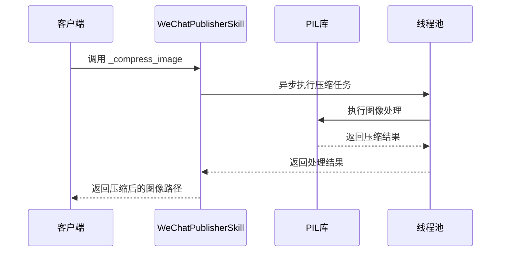

**图表来源**
- [wechat_publisher_tools.py](file://localmanus-backend/skills/wechat-draft-publisher/wechat_publisher_tools.py#L104-L151)

##### 渐进式质量调整

当初始压缩质量无法满足文件大小要求时，算法会自动降低质量设置（每次减少10%，最低至30%），确保最终输出符合微信平台要求。

#### 错误处理与回退机制

- **PIL库缺失**：自动回退到原图上传，记录警告日志
- **图像损坏**：保持原图不变，返回错误信息
- **内存不足**：使用临时文件存储中间结果，避免内存溢出
- **压缩失败**：返回原始图像路径，不影响整体流程

### HTML 优化处理能力

#### HTML 压缩工具

除了图像压缩，技能还提供了专门的 HTML 优化工具：

##### 段落间距优化

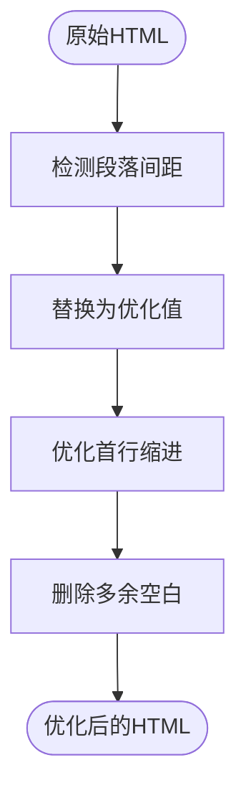

**图表来源**
- [optimize-html.py](file://localmanus-backend/skills/wechat-draft-publisher/scripts/optimize-html.py#L10-L38)

##### 样式修复工具

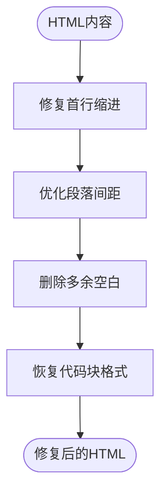

**图表来源**
- [fix-wechat-style.py](file://localmanus-backend/skills/wechat-draft-publisher/scripts/fix-wechat-style.py#L13-L92)

#### 微信平台适配优化

技能针对微信编辑器的特殊限制进行了专门优化：

- **样式兼容性**：将复杂的 CSS 转换为微信支持的内联样式
- **布局稳定性**：使用 table 结构确保背景色和布局在编辑器中保持稳定
- **字体控制**：强制设置字体大小和缩进，避免编辑器默认样式覆盖

**章节来源**
- [wechat_publisher_tools.py](file://localmanus-backend/skills/wechat-draft-publisher/wechat_publisher_tools.py#L61-L165)
- [optimize-html.py](file://localmanus-backend/skills/wechat-draft-publisher/scripts/optimize-html.py#L1-L65)
- [fix-wechat-style.py](file://localmanus-backend/skills/wechat-draft-publisher/scripts/fix-wechat-style.py#L1-L118)

## 依赖关系分析

### 技术栈依赖

LocalManus 项目采用现代化的技术栈组合：

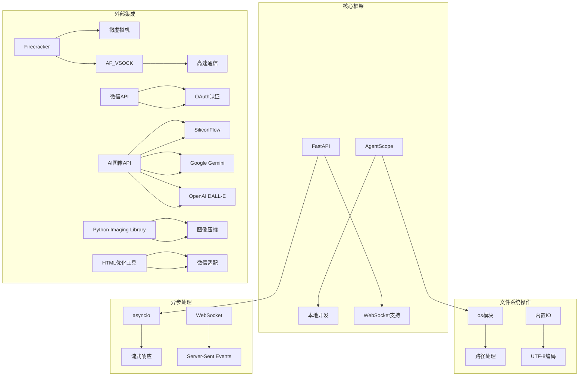

**图表来源**
- [localmanus_architecture.md](file://localmanus_architecture.md#L119-L137)
- [main.py](file://localmanus-backend/main.py#L1-L95)
- [wechat_publisher_tools.py](file://localmanus-backend/skills/wechat-draft-publisher/wechat_publisher_tools.py#L81-L100)

### 模块间依赖关系

```mermaid
graph LR
subgraph "技能层"
FO[FileOps技能] --> BS[BaseSkill基类]
WF[WeChat格式化技能] --> BS
WP[WeChat发布技能] --> BS
WIG[WeChat图片生成技能] --> BS
WPIG[产品经理图片技能] --> WIG
WPS[WeChat发布器技能] --> BS
end
subgraph "管理层"
SM[SkillManager] --> BS
OR[Orchestrator] --> SM
end
subgraph "接口层"
API[FastAPI应用] --> OR
API --> MA[ManagerAgent]
API --> PA[PlannerAgent]
end
subgraph "外部依赖"
AG[AgentScope] --> MA
AG --> PA
FC[Firecracker] --> OR
WX[微信API] --> WP
IMG[AI图像API] --> WIG
PIL[图像处理] --> WPS
OPT[HTML优化] --> WP
end
FO --> SM
WF --> SM
WP --> SM
WIG --> SM
WPIG --> SM
WPS --> SM
OR --> API
MA --> AG
PA --> AG
```

**图表来源**
- [skill_manager.py](file://localmanus-backend/core/skill_manager.py#L1-L84)
- [main.py](file://localmanus-backend/main.py#L1-L95)
- [wechat_publisher_tools.py](file://localmanus-backend/skills/wechat-draft-publisher/wechat_publisher_tools.py#L17-L21)

**章节来源**
- [localmanus_architecture.md](file://localmanus_architecture.md#L1-L137)
- [main.py](file://localmanus-backend/main.py#L1-L95)

## 性能考虑

### 文件操作性能特点

FileOps 技能的性能特征分析：

#### 时间复杂度
- **读取操作**：O(n) - n为文件大小
- **写入操作**：O(n) - n为内容大小  
- **目录列表**：O(d) - d为目录项数量

#### 空间复杂度
- **内存占用**：与文件大小成正比
- **I/O开销**：单次文件操作的磁盘I/O

#### 并发处理能力

```mermaid
flowchart TD
Start([并发请求]) --> Queue[请求队列]
Queue --> Scheduler[调度器]
Scheduler --> Worker1[工作线程1]
Scheduler --> Worker2[工作线程2]
Scheduler --> WorkerN[工作线程N]
Worker1 --> FileOp1[文件操作1]
Worker2 --> FileOp2[文件操作2]
WorkerN --> FileOpN[文件操作N]
FileOp1 --> Result1[结果1]
FileOp2 --> Result2[结果2]
FileOpN --> ResultN[结果N]
Result1 --> Merge[结果合并]
Result2 --> Merge
ResultN --> Merge
Merge --> End([完成])
```

**图表来源**
- [file_ops.py](file://localmanus-backend/skills/file-operations/file_ops.py#L1-L41)

### WeChat 技能性能分析

#### 文章格式化性能

WeChat 文章格式化技能的性能特征：

- **Markdown 转换**：~0.3-0.5秒/文件
- **批量转换**：8线程环境下 ~0.37秒/篇
- **实时预览更新**：<1秒
- **HTML 文件大小**：~50KB（包含内联CSS）

#### 图像生成性能

- **SiliconFlow API**：单次请求 ~10-30秒
- **Gemini API**：单次请求 ~15-25秒
- **DALL-E API**：单次请求 ~20-35秒

#### 草稿发布性能

- **访问令牌获取**：~1-2秒
- **图片上传**：根据文件大小 ~2-10秒
- **草稿创建**：~2-5秒

#### 图像压缩性能

- **压缩算法**：~0.5-2秒/张图片
- **异步处理**：支持并发压缩多个图片
- **内存使用**：按图片大小线性增长
- **CPU占用**：中等水平，主要受图片复杂度影响

### 资源消耗分析

#### 系统资源
- **CPU使用率**：低负载，主要用于文件系统调用和网络请求
- **内存使用**：按文件大小线性增长，图像生成时临时占用较高
- **磁盘I/O**：随机读写操作，受磁盘性能影响
- **网络带宽**：图像生成 API 调用和微信 API 交互

#### WeChat 平台资源
- **API 调用配额**：每日 API 调用次数限制
- **图片存储配额**：微信素材库存储空间限制
- **内容审核**：文章发布前的内容审核机制

#### 图像压缩资源
- **CPU资源**：图像处理的主要开销
- **内存资源**：图像解码和编码过程中的临时占用
- **磁盘I/O**：临时文件的读写操作
- **网络带宽**：压缩后图片的上传传输

### 性能优化建议

1. **批量操作**：对于大量文件操作，考虑批处理模式
2. **缓存机制**：对频繁读取的文件实现缓存
3. **异步处理**：利用 asyncio 提升并发性能
4. **流式处理**：大文件采用流式读取避免内存溢出
5. **API 优化**：合理使用访问令牌缓存，避免频繁刷新
6. **图像压缩**：生成图像前进行适当的压缩处理
7. **并发压缩**：利用线程池并行处理多个图片压缩任务
8. **内存管理**：及时清理临时文件，避免内存泄漏

## 故障排除指南

### 常见问题诊断

#### 文件权限问题
- **症状**：文件读取/写入失败
- **原因**：用户权限不足或文件被其他进程占用
- **解决方案**：检查文件权限设置，确保有足够的读写权限

#### 路径解析问题
- **症状**：文件不存在错误
- **原因**：相对路径与绝对路径混淆
- **解决方案**：使用绝对路径或正确设置工作目录

#### 编码问题
- **症状**：中文乱码或编码错误
- **原因**：文件编码与预期不符
- **解决方案**：明确指定正确的文件编码格式

#### WeChat API 错误

```mermaid
flowchart TD
Start([API错误]) --> CheckErrCode["检查错误码"]
CheckErrCode --> Err40164["IP白名单错误"]
CheckErrCode --> Err40001["AppSecret错误"]
CheckErrCode --> Err45009["API调用超限"]
CheckErrCode --> OtherErr["其他错误"]
Err40164 --> SetupIP["配置IP白名单"]
Err40001 --> CheckCreds["检查凭证"]
Err45009 --> WaitNextDay["等待次日重试"]
OtherErr --> LogError["记录详细错误"]
SetupIP --> Retry["重试请求"]
CheckCreds --> Retry
WaitNextDay --> Retry
Retry --> Success([请求成功])
```

**图表来源**
- [publisher.py](file://localmanus-backend/skills/wechat-draft-publisher/publisher.py#L115-L144)

#### 图像生成错误
- **症状**：AI 图像生成失败
- **原因**：API 密钥配置错误或网络连接问题
- **解决方案**：检查环境变量配置，验证 API 密钥有效性

#### 图像压缩错误
- **症状**：图像压缩失败或质量异常
- **原因**：PIL库缺失、图像格式不支持或内存不足
- **解决方案**：安装PIL库，检查图像格式，释放内存资源

#### 异常处理机制

```mermaid
flowchart TD
Start([异常发生]) --> CheckType["检查异常类型"]
CheckType --> FileNotFoundError["文件未找到"]
CheckType --> PermissionError["权限不足"]
CheckType --> OSError["系统错误"]
CheckType --> WeChatAPIError["微信API错误"]
CheckType --> ImageAPIError["图像API错误"]
CheckType --> PILImportError["PIL库缺失"]
CheckType --> OtherError["其他异常"]
FileNotFoundError --> LogNotFound["记录文件不存在"]
PermissionError --> LogPermission["记录权限问题"]
OSError --> LogSystem["记录系统错误"]
WeChatAPIError --> LogWeChat["记录微信API错误"]
ImageAPIError --> LogImage["记录图像API错误"]
PILImportError --> LogPIL["记录PIL库问题"]
OtherError --> LogOther["记录其他异常"]
LogNotFound --> ReturnError["返回错误信息"]
LogPermission --> ReturnError
LogSystem --> ReturnError
LogWeChat --> ReturnError
LogImage --> ReturnError
LogPIL --> ReturnError
LogOther --> ReturnError
ReturnError --> End([处理完成])
```

**图表来源**
- [file_ops.py](file://localmanus-backend/skills/file-operations/file_ops.py#L13-L19)
- [wechat_publisher_tools.py](file://localmanus-backend/skills/wechat-draft-publisher/wechat_publisher_tools.py#L82-L84)

**章节来源**
- [file_ops.py](file://localmanus-backend/skills/file-operations/file_ops.py#L1-L41)
- [publisher.py](file://localmanus-backend/skills/wechat-draft-publisher/publisher.py#L1-L871)
- [wechat_publisher_tools.py](file://localmanus-backend/skills/wechat-draft-publisher/wechat_publisher_tools.py#L1-L450)

### 调试技巧

1. **日志记录**：在关键节点添加详细的日志信息
2. **参数验证**：对输入参数进行严格的类型和范围检查
3. **错误传播**：保持错误信息的完整性和可追溯性
4. **单元测试**：为每个方法编写对应的测试用例
5. **WeChat 调试**：使用微信开发者工具检查 HTML 兼容性
6. **API 监控**：监控第三方 API 的调用状态和响应时间
7. **性能监控**：监控图像压缩的CPU和内存使用情况
8. **错误恢复**：实现优雅的错误回退机制

## 结论

LocalManus 项目的技能系统展现了现代 AI 应用的优秀架构设计。FileOps 技能作为基础文件操作能力的代表，体现了以下设计优势：

### 技术优势

1. **模块化设计**：清晰的职责分离和接口定义
2. **动态加载**：支持运行时技能扩展和热更新
3. **统一抽象**：BaseSkill 基类提供一致的编程模型
4. **异步支持**：充分利用 asyncio 提升并发性能
5. **安全隔离**：结合 Firecracker 实现强隔离的执行环境

### WeChat 生态系统扩展

**更新** 新增的 WeChat 草稿发布器技能增强进一步丰富了 LocalManus 的应用能力：

#### 技术创新
- **平台适配**：专门针对微信平台的特殊限制进行优化
- **自动化流程**：从内容创作到发布的完整自动化解决方案
- **多模态支持**：结合文本、图片等多种内容形式
- **API 集成**：无缝集成多个 AI 图像生成服务
- **智能压缩**：自动化的图像压缩和优化处理

#### 功能完整性
- **内容格式化**：专业的 Markdown 到 HTML 转换
- **草稿管理**：完整的微信草稿发布流程
- **视觉设计**：高质量的 AI 图像生成能力
- **主题定制**：灵活的主题系统和样式定制
- **性能优化**：智能的图像压缩和 HTML 优化

### 技能增强价值

**更新** WeChat 草稿发布器技能的增强功能显著提升了用户体验和系统性能：

#### 用户体验提升
- **自动压缩**：无需用户手动处理图片大小问题
- **智能优化**：自动修复微信编辑器兼容性问题
- **错误友好**：提供详细的错误信息和解决方案
- **性能保障**：异步处理确保快速响应

#### 技术实现亮点
- **渐进式压缩**：多层压缩策略确保质量与大小的平衡
- **异步处理**：充分利用线程池提升并发性能
- **优雅降级**：PIL库缺失时的回退机制
- **内存管理**：临时文件的自动清理机制

### 改进建议

1. **增强错误处理**：提供更详细的错误分类和恢复机制
2. **性能优化**：实现文件缓存和批量操作支持
3. **扩展功能**：增加文件监控、压缩、加密等高级功能
4. **监控指标**：添加性能监控和健康检查机制
5. **WeChat 优化**：针对微信平台的新功能和限制进行持续适配
6. **压缩算法优化**：探索更高效的压缩算法和参数调优
7. **缓存策略**：实现压缩结果的缓存机制

### 未来发展方向

随着 LocalManus 架构的不断完善，技能系统将在以下方面持续演进：
- 更丰富的技能生态，特别是垂直领域的专业技能
- 更强的并发处理能力，支持大规模内容创作
- 更完善的监控和调试工具，提升开发和运维效率
- 更灵活的插件化架构，支持第三方技能扩展
- 更智能的内容适配，自动优化内容以适应不同平台要求
- **更新** 更先进的图像处理算法，支持更多格式和更高效率的压缩

## 附录

### API 使用示例

#### 基础文件操作示例

```python
# 文件读取示例
result = file_ops.read_file("example.txt")
print(result)

# 文件写入示例  
result = file_ops.write_file("output.txt", "Hello World")
print(result)

# 目录列表示例
result = file_ops.list_dir("./documents")
print(result)
```

#### WeChat 技能使用示例

```python
# WeChat 文章格式化示例
formatter = WeChatFormatterSkill()
result = await formatter.convert_markdown_to_html(
    markdown_text="# 标题\n\n内容",
    theme="tech",
    user_id="user_123"
)

# WeChat 草稿发布示例
publisher = WeChatPublisherSkill()
result = await publisher.create_draft_article(
    title="文章标题",
    content="<p>HTML内容</p>",
    thumb_media_id="media_id",
    appid="your_appid",
    appsecret="your_appsecret",
    author="作者名",
    digest="摘要"
)

# AI 图像生成示例
image_gen = WeChatImageGenSkill()
result = await image_gen.generate_wechat_cover(
    topic="AI技术",
    style="tech",
    output_path="cover.png"
)
```

#### 技能集成方式

```python
# 动态加载技能
skill_manager = SkillManager()
file_ops = skill_manager.get_skill("FileOps")
wechat_formatter = skill_manager.get_skill("wechat_formatter")
wechat_publisher = skill_manager.get_skill("wechat_publisher")

# 执行技能方法
result = await file_ops.execute("read_file", file_path="test.txt")
result = await wechat_formatter.execute("convert_markdown_to_html", 
                                      markdown_text="...", theme="tech")
```

### 最佳实践

1. **参数验证**：始终验证输入参数的有效性
2. **错误处理**：实现完善的异常捕获和错误恢复
3. **资源管理**：正确管理文件句柄和系统资源
4. **日志记录**：添加详细的执行日志便于调试
5. **安全考虑**：验证文件路径，防止路径遍历攻击
6. **WeChat 适配**：遵循微信平台的规范和限制
7. **API 管理**：合理使用第三方 API，注意配额和速率限制
8. **性能优化**：利用缓存和异步处理提升整体性能
9. **图像处理**：合理设置压缩参数，平衡质量和大小
10. **内存管理**：及时清理临时文件，避免内存泄漏

### 替代方案对比

| 方案 | 优点 | 缺点 | 适用场景 |
|------|------|------|----------|
| FileOps | 简单易用，功能明确 | 功能有限 | 基础文件操作 |
| WeChat 文章格式化 | 专业排版，主题丰富 | 需要额外依赖 | 微信公众号内容创作 |
| WeChat 草稿发布 | 完整发布流程，自动压缩 | 依赖微信 API，压缩耗时 | 自动化内容发布 |
| AI 图像生成 | 高质量视觉内容 | 成本较高，耗时较长 | 需要配图的内容创作 |
| 系统命令 | 功能强大 | 安全风险高 | 复杂系统操作 |
| 第三方库 | 功能丰富 | 依赖复杂 | 专业应用场景 |