# ReAct 智能体

<cite>
**本文档引用的文件**
- [react_agent.py](file://localmanus-backend/agents/react_agent.py)
- [base_agents.py](file://localmanus-backend/agents/base_agents.py)
- [skill_manager.py](file://localmanus-backend/core/skill_manager.py)
- [orchestrator.py](file://localmanus-backend/core/orchestrator.py)
- [prompts.py](file://localmanus-backend/core/prompts.py)
- [main.py](file://localmanus-backend/main.py)
- [file_ops.py](file://localmanus-backend/skills/file-operations/file_ops.py)
- [page.tsx](file://localmanus-ui/app/page.tsx)
- [test_chat_sse.py](file://localmanus-backend/test_chat_sse.py)
</cite>

## 更新摘要
**变更内容**
- 新增智能体记忆压缩功能，包括自动对话历史压缩、自定义token计数器和压缩摘要模式等新特性
- 新增思维内容流式传输功能，包括全局回调机制、思维内容拦截和实时前端传输能力
- 更新了流式实现部分，反映 ReAct 智能体的流式实现已简化，移除了复杂的回退机制
- 新增了纯实时 token 流式传输的详细说明
- 更新了推理循环机制的实现细节
- 增强了流式响应优化的性能分析
- 新增了思维内容流式传输的完整架构说明

## 目录
1. [简介](#简介)
2. [项目结构](#项目结构)
3. [核心组件](#核心组件)
4. [架构概览](#架构概览)
5. [详细组件分析](#详细组件分析)
6. [思维内容流式传输系统](#思维内容流式传输系统)
7. [智能体记忆压缩系统](#智能体记忆压缩系统)
8. [依赖关系分析](#依赖关系分析)
9. [性能考虑](#性能考虑)
10. [故障排除指南](#故障排除指南)
11. [结论](#结论)

## 简介

LocalManus ReAct 智能体是一个基于 AgentScope 框架构建的高级人工智能代理系统，实现了推理(Reason)和行动(Action)的完美结合。该系统通过 ReAct 框架的核心理念，使智能体能够在每次迭代中进行深度思考、观察环境状态、采取适当行动，直到完成用户指定的目标任务。

ReAct 智能体的核心优势在于其动态技能管理和实时流式响应机制。它不仅能够根据任务需求自动选择和调用合适的工具，还能在执行过程中实时反馈进度和结果，为用户提供沉浸式的交互体验。

**更新** ReAct 智能体现已集成了先进的思维内容流式传输功能和智能体记忆压缩功能，通过全局回调机制实现实时思维内容拦截和传输，并通过智能压缩机制有效管理长期对话的历史记录，为用户提供前所未有的透明度和交互体验。

## 项目结构

LocalManus 后端采用模块化架构设计，主要分为以下几个核心层次：

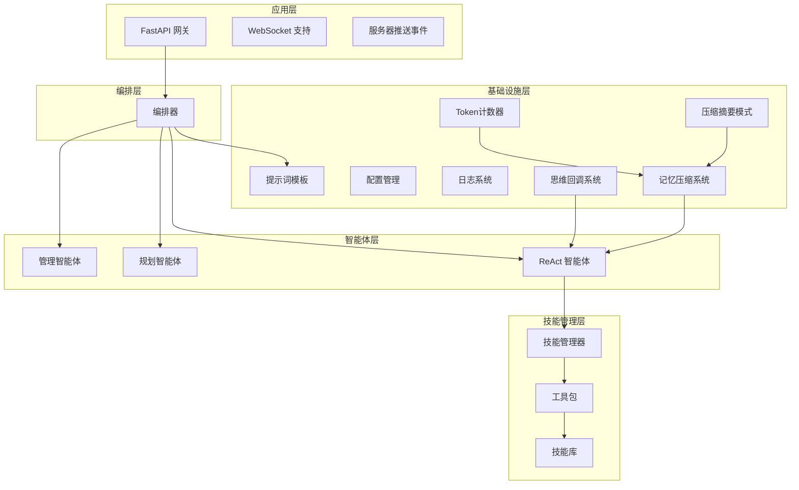

**图表来源**
- [main.py](file://localmanus-backend/main.py#L390-L421)
- [orchestrator.py](file://localmanus-backend/core/orchestrator.py#L11-L96)
- [react_agent.py](file://localmanus-backend/agents/react_agent.py#L19-L30)

**章节来源**
- [main.py](file://localmanus-backend/main.py#L390-L476)
- [orchestrator.py](file://localmanus-backend/core/orchestrator.py#L11-L150)

## 核心组件

### ReAct 智能体核心架构

ReAct 智能体是整个系统的核心组件，基于 AgentScope 的原生 ReActAgent 实现，具备以下关键特性：

#### 推理循环机制
- **多轮对话支持**：支持最多40轮的历史对话管理
- **纯实时流式响应**：提供毫秒级的响应延迟体验，移除了复杂的回退机制
- **智能工具调用**：根据任务需求自动选择和执行合适工具
- **思维内容流式传输**：通过全局回调机制实时传输推理过程
- **智能记忆压缩**：自动压缩历史对话以管理上下文窗口

#### 系统提示词构建
- **动态上下文集成**：实时整合用户信息和文件上下文
- **技能描述注入**：自动包含所有可用技能的详细描述
- **工具元数据管理**：维护完整的工具接口规范

**更新** 推理循环现在采用纯流式实现，直接从模型获取流式响应，无需额外的回退处理，并且集成了思维内容流式传输功能和智能记忆压缩功能。

**章节来源**
- [react_agent.py](file://localmanus-backend/agents/react_agent.py#L36-L51)
- [prompts.py](file://localmanus-backend/core/prompts.py#L54-L75)

### 思维内容流式传输系统

**新增功能** ReAct 智能体现在支持完整的思维内容流式传输系统：

#### 全局回调机制
- **全局回调注册**：通过 `set_thinking_callback()` 函数设置全局思维内容回调
- **实时思维拦截**：在推理过程中实时拦截和传输思维内容块
- **多格式支持**：支持多种思维内容格式的识别和处理

#### 思维内容拦截
- **内容块识别**：自动识别模型输出中的思维内容块
- **类型检测**：区分不同类型的思维内容（文本、JSON、结构化数据）
- **实时传输**：通过队列系统实时传输思维内容到前端

#### 实时前端传输
- **SSE 协议**：使用服务器推送事件协议传输思维内容
- **缓冲管理**：智能缓冲思维内容，确保传输顺序和完整性
- **并发处理**：支持思维内容和常规内容的并发处理

**章节来源**
- [react_agent.py](file://localmanus-backend/agents/react_agent.py#L19-L30)
- [react_agent.py](file://localmanus-backend/agents/react_agent.py#L263-L390)
- [orchestrator.py](file://localmanus-backend/core/orchestrator.py#L45-L161)

### 智能体记忆压缩系统

**新增功能** ReAct 智能体现在支持智能的记忆压缩功能：

#### 记忆压缩配置
- **阈值触发**：默认10000 token阈值触发压缩
- **最近消息保留**：默认保留3条最近消息不压缩
- **自动压缩机制**：当历史消息超过阈值时自动触发压缩

#### 自定义Token计数器
- **字符基础估算**：SimpleTokenCounter提供字符数除以4的估算
- **多格式支持**：支持字符串、Msg对象、字典等多种输入格式
- **内容块处理**：自动处理消息内容块中的文本内容

#### 压缩摘要模式
- **结构化摘要**：CompressionSummarySchema定义了5个关键字段
- **任务概述**：用户的核心请求和成功标准
- **当前状态**：已完成的工作和关键输出
- **重要发现**：技术约束、决策和错误解决
- **下一步骤**：完成任务的具体行动
- **上下文保留**：用户偏好和风格要求

#### 压缩流程
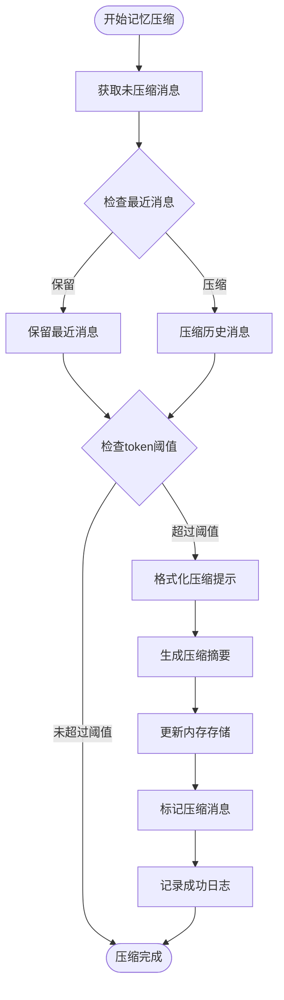

**图表来源**
- [react_agent.py](file://localmanus-backend/agents/react_agent.py#L142-L171)
- [react_agent.py](file://localmanus-backend/agents/react_agent.py#L38-L81)

**章节来源**
- [react_agent.py](file://localmanus-backend/agents/react_agent.py#L87-L131)
- [react_agent.py](file://localmanus-backend/agents/react_agent.py#L38-L81)
- [react_agent.py](file://localmanus-backend/agents/react_agent.py#L142-L171)

### 技能管理系统

技能管理器负责整个技能生态系统的管理，包括技能发现、注册和执行：

#### 技能发现机制
- **自动扫描**：递归扫描技能目录，自动发现新技能
- **兼容性支持**：同时支持传统技能类和函数式技能
- **动态注册**：运行时动态注册新发现的技能

#### 工具包集成
- **统一接口**：为所有技能提供统一的工具调用接口
- **异步执行**：支持异步技能执行，提升系统响应性
- **错误处理**：完善的异常捕获和错误恢复机制

**章节来源**
- [skill_manager.py](file://localmanus-backend/core/skill_manager.py#L29-L89)
- [file_ops.py](file://localmanus-backend/skills/file-operations/file_ops.py#L10-L53)

### 编排器系统

编排器负责协调整个智能体系统的运行，实现多智能体协作：

#### 会话管理
- **历史追踪**：维护完整的对话历史记录
- **状态同步**：实时同步各智能体的状态变化
- **并发控制**：支持多会话并发处理

#### 流式协议
- **SSE 支持**：提供标准的服务器推送事件接口
- **内部协议**：定义清晰的内部通信协议
- **错误传播**：确保错误信息正确传播到前端
- **思维内容处理**：专门处理思维内容的流式传输

**章节来源**
- [orchestrator.py](file://localmanus-backend/core/orchestrator.py#L16-L96)

## 架构概览

LocalManus 采用基于 AgentScope 的动态多智能体系统架构，实现了从静态工作流到动态智能体编排的转变：

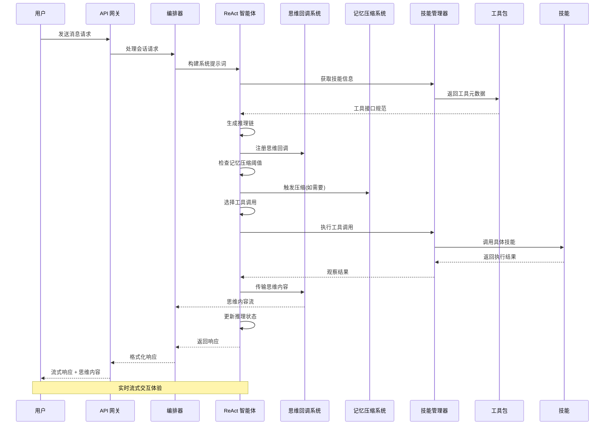

**图表来源**
- [main.py](file://localmanus-backend/main.py#L390-L421)
- [orchestrator.py](file://localmanus-backend/core/orchestrator.py#L16-L96)
- [react_agent.py](file://localmanus-backend/agents/react_agent.py#L53-L113)

### 系统架构设计

系统采用分层架构设计，确保各组件职责清晰、耦合度低：

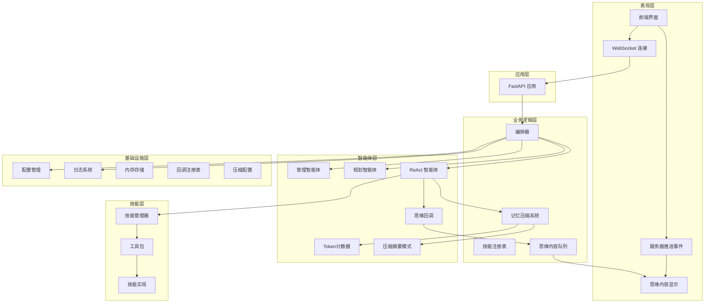

**图表来源**
- [main.py](file://localmanus-backend/main.py#L390-L476)
- [base_agents.py](file://localmanus-backend/agents/base_agents.py#L6-L42)
- [react_agent.py](file://localmanus-backend/agents/react_agent.py#L19-L30)

## 详细组件分析

### ReActAgent 类实现

ReActAgent 是系统的核心类，继承自 AgentScope 的原生 ReActAgent，实现了完整的 ReAct 框架：

#### 初始化流程
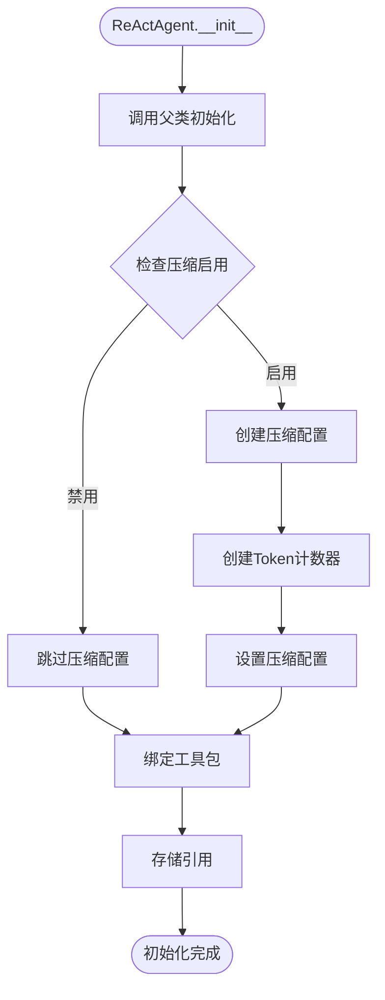

**图表来源**
- [react_agent.py](file://localmanus-backend/agents/react_agent.py#L173-L231)

#### 推理循环核心逻辑

**更新** ReAct 智能体的推理循环现在采用简化的纯流式实现，并集成了思维内容流式传输和智能记忆压缩：

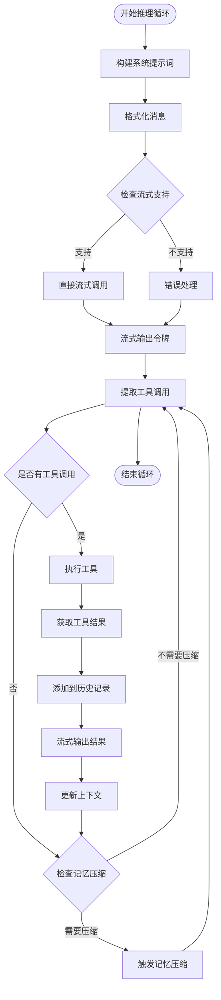

**图表来源**
- [react_agent.py](file://localmanus-backend/agents/react_agent.py#L53-L113)

**章节来源**
- [react_agent.py](file://localmanus-backend/agents/react_agent.py#L20-L250)

### 思维内容流式传输系统

**新增功能** 思维内容流式传输系统是 ReAct 智能体的重要增强功能：

#### 全局回调注册
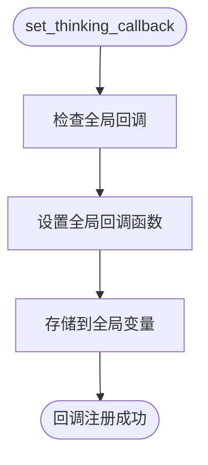

**图表来源**
- [react_agent.py](file://localmanus-backend/agents/react_agent.py#L24-L32)

#### 思维内容拦截流程
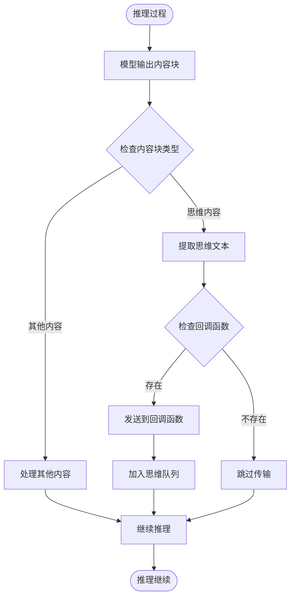

**图表来源**
- [react_agent.py](file://localmanus-backend/agents/react_agent.py#L600-L610)

#### 编排器思维内容处理
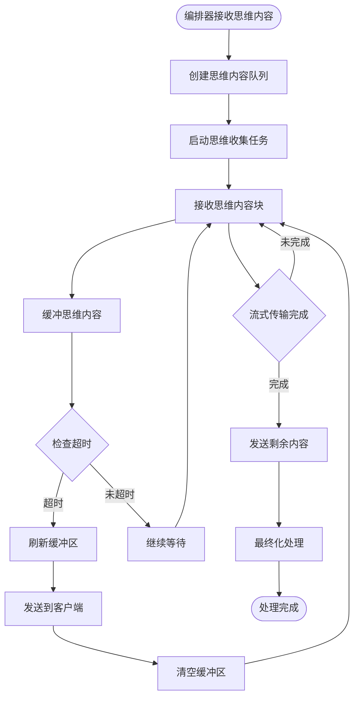

**图表来源**
- [orchestrator.py](file://localmanus-backend/core/orchestrator.py#L88-L148)

**章节来源**
- [react_agent.py](file://localmanus-backend/agents/react_agent.py#L19-L390)
- [orchestrator.py](file://localmanus-backend/core/orchestrator.py#L45-L161)

### 智能体记忆压缩系统

**新增功能** 智能体记忆压缩系统是 ReAct 智能体的重要增强功能：

#### 记忆压缩配置
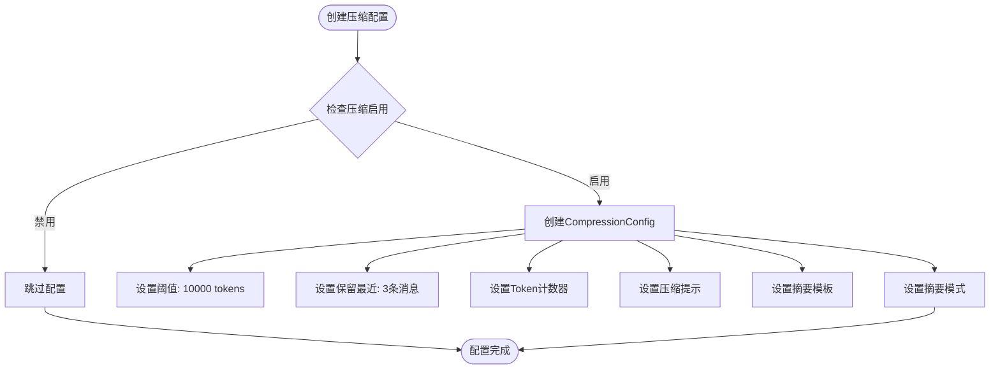

**图表来源**
- [react_agent.py](file://localmanus-backend/agents/react_agent.py#L196-L229)

#### 压缩摘要模式
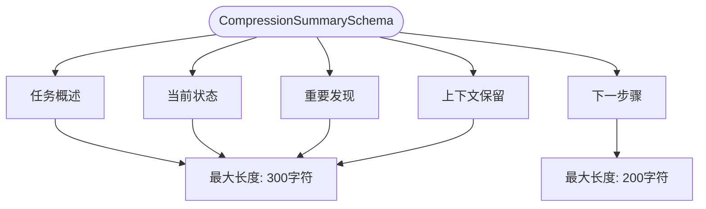

**图表来源**
- [react_agent.py](file://localmanus-backend/agents/react_agent.py#L38-L81)

#### Token计数器实现
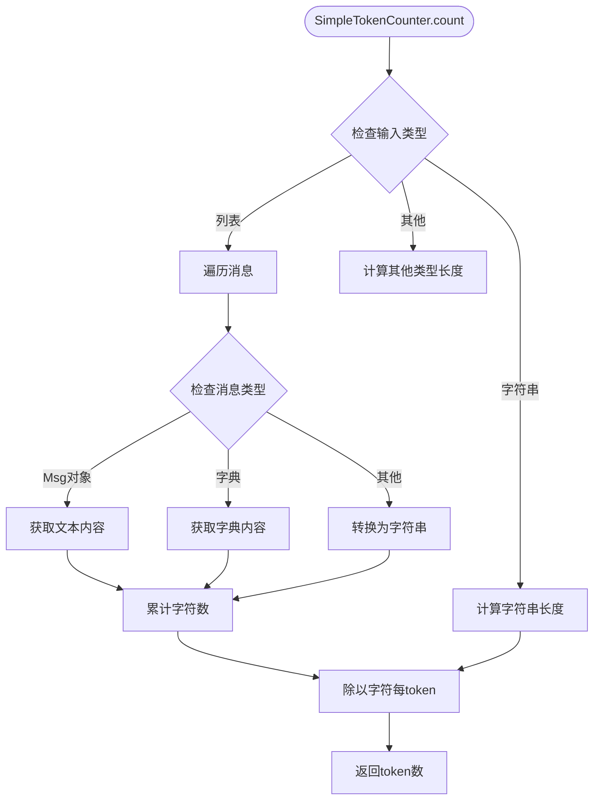

**图表来源**
- [react_agent.py](file://localmanus-backend/agents/react_agent.py#L97-L130)

**章节来源**
- [react_agent.py](file://localmanus-backend/agents/react_agent.py#L87-L131)
- [react_agent.py](file://localmanus-backend/agents/react_agent.py#L38-L81)
- [react_agent.py](file://localmanus-backend/agents/react_agent.py#L142-L171)

### 技能管理器详细分析

技能管理器实现了完整的技能生命周期管理：

#### 技能加载机制
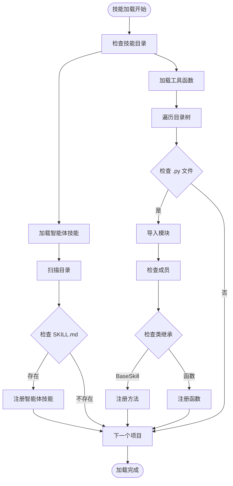

**图表来源**
- [skill_manager.py](file://localmanus-backend/core/skill_manager.py#L29-L89)

**章节来源**
- [skill_manager.py](file://localmanus-backend/core/skill_manager.py#L18-L143)

### 编排器工作流程

编排器负责协调多个智能体的协作：

#### 会话管理流程
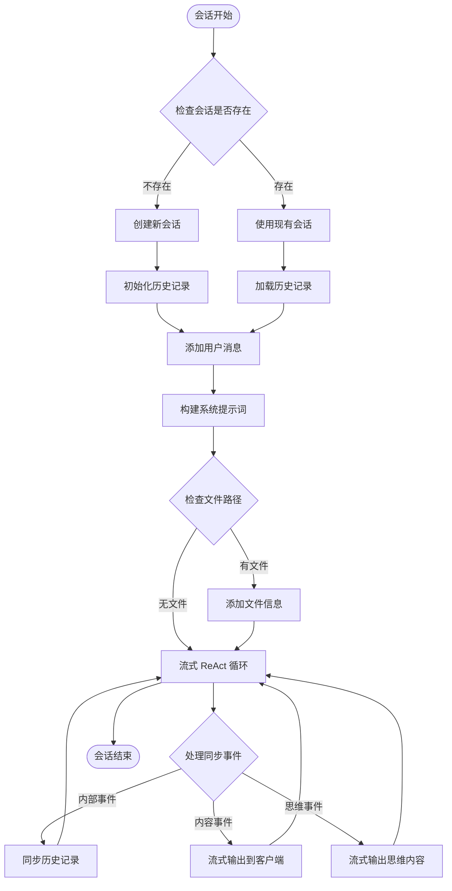

**图表来源**
- [orchestrator.py](file://localmanus-backend/core/orchestrator.py#L16-L96)

**章节来源**
- [orchestrator.py](file://localmanus-backend/core/orchestrator.py#L11-L150)

## 依赖关系分析

系统采用松耦合的设计模式，各组件之间的依赖关系清晰明确：

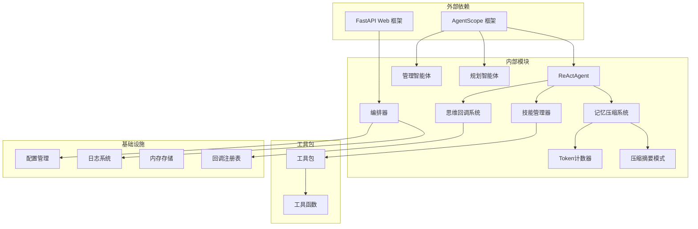

**图表来源**
- [base_agents.py](file://localmanus-backend/agents/base_agents.py#L1-L42)
- [main.py](file://localmanus-backend/main.py#L390-L476)

### 关键依赖关系

#### 模型配置依赖
系统通过 AgentScope 的模型管理机制实现灵活的模型配置：

- **配置来源**：支持环境变量和配置文件双重配置
- **模型类型**：支持多种 OpenAI 兼容模型
- **流式支持**：内置流式响应支持

#### 技能依赖管理
技能系统采用动态依赖管理机制：

- **运行时加载**：技能在运行时动态加载和注册
- **依赖隔离**：每个技能拥有独立的依赖环境
- **版本管理**：支持技能版本的并存和切换

#### 思维回调依赖
**新增依赖** 思维内容流式传输系统引入了新的依赖关系：

- **全局回调注册**：通过全局变量管理回调函数
- **队列系统**：使用 asyncio.Queue 进行思维内容缓冲
- **并发处理**：支持思维内容和常规内容的并发处理

#### 记忆压缩依赖
**新增依赖** 智能体记忆压缩系统引入了新的依赖关系：

- **Token计数器**：SimpleTokenCounter用于估算token数量
- **压缩配置**：CompressionConfig管理压缩参数
- **摘要模式**：CompressionSummarySchema定义结构化摘要
- **内存标记**：_MemoryMark用于标记压缩消息

**章节来源**
- [base_agents.py](file://localmanus-backend/agents/base_agents.py#L11-L37)
- [prompts.py](file://localmanus-backend/core/prompts.py#L1-L75)

## 性能考虑

### 流式响应优化

**更新** ReAct 智能体实现了简化的流式响应优化：

#### 纯流式调用
- **直接流式接口**：当底层模型支持流式时，直接使用模型的流式接口
- **即时反馈**：用户可以立即看到模型的生成过程
- **内存优化**：避免一次性缓存大量中间结果
- **简化实现**：移除了复杂的回退机制，代码更简洁

#### 流式处理优化
- **增量响应**：流式输出令牌时进行增量处理
- **工具调用检测**：在流式过程中实时检测工具调用
- **异步处理**：使用 asyncio 确保流式响应的非阻塞特性

### 思维内容流式传输性能

**新增性能考虑** 思维内容流式传输系统在性能方面的优化：

#### 实时传输优化
- **异步队列**：使用 asyncio.Queue 实现非阻塞思维内容传输
- **缓冲管理**：智能缓冲思维内容，减少传输开销
- **并发处理**：支持思维内容和常规内容的并发处理
- **内存控制**：限制思维内容缓冲区大小，防止内存泄漏

#### 传输协议优化
- **SSE 协议**：使用服务器推送事件协议，支持持久连接
- **增量传输**：思维内容按块传输，减少延迟
- **错误恢复**：支持传输中断后的恢复机制
- **心跳机制**：保持连接活跃，防止连接超时

### 智能体记忆压缩性能

**新增性能考虑** 智能体记忆压缩系统在性能方面的优化：

#### 压缩触发优化
- **阈值配置**：默认10000 token阈值平衡性能和效果
- **最近消息保留**：默认保留3条最近消息确保上下文连续性
- **工具调用对齐**：自动处理工具使用和结果配对，避免中断

#### Token计数优化
- **字符估算**：SimpleTokenCounter使用字符数除以4的快速估算
- **多格式支持**：支持多种消息格式的高效处理
- **内容块优化**：智能提取文本内容，避免处理非文本块

#### 压缩摘要优化
- **结构化输出**：使用CompressionSummarySchema确保一致的摘要格式
- **字段长度控制**：严格控制各字段的最大长度，避免过度压缩
- **模板化处理**：使用SUMMARY_TEMPLATE统一摘要格式

### 并发处理能力

系统支持多会话并发处理：

#### 会话隔离
- **独立状态**：每个会话拥有独立的消息历史
- **资源隔离**：不同会话间不会相互影响
- **并发安全**：所有共享资源都经过线程安全处理

#### 资源管理
- **连接池**：数据库连接和网络连接使用连接池管理
- **内存控制**：限制单个会话的最大历史长度
- **超时控制**：为长时间运行的操作设置超时机制

## 故障排除指南

### 常见问题诊断

#### 流式响应问题
**症状**：用户无法看到实时响应
**可能原因**：
- 底层模型不支持流式接口
- 网络连接中断
- 前端 SSE 处理异常

**解决方案**：
- 检查模型配置是否正确
- 验证网络连接稳定性
- 检查前端 JavaScript 代码

#### 思维内容传输问题
**新增症状**：用户看不到思维内容
**可能原因**：
- 全局回调函数未正确设置
- 思维内容队列阻塞
- 前端思维内容显示异常

**新增解决方案**：
- 检查 `set_thinking_callback()` 是否被正确调用
- 验证思维内容队列的消费情况
- 检查前端思维内容渲染组件

#### 记忆压缩问题
**新增症状**：历史消息过多导致上下文溢出
**可能原因**：
- 压缩阈值设置过高
- Token计数器估算不准确
- 压缩摘要格式不匹配

**新增解决方案**：
- 调整DEFAULT_COMPRESSION_THRESHOLD参数
- 考虑使用更精确的token计数器
- 验证CompressionSummarySchema的字段完整性

#### 技能调用失败
**症状**：工具调用返回错误
**可能原因**：
- 技能未正确注册
- 参数格式不正确
- 权限不足

**解决方案**：
- 检查技能目录结构
- 验证工具函数签名
- 确认文件系统权限

#### 内存泄漏问题
**症状**：系统运行时间越长内存占用越高
**可能原因**：
- 会话历史未及时清理
- 异步任务未正确取消
- 缓存未及时释放

**解决方案**：
- 设置合理的会话超时时间
- 确保异步任务的正确生命周期管理
- 实施定期的垃圾回收机制

**章节来源**
- [react_agent.py](file://localmanus-backend/agents/react_agent.py#L106-L108)
- [orchestrator.py](file://localmanus-backend/core/orchestrator.py#L34-L38)

### 日志分析技巧

系统提供了完整的日志记录机制：

#### 关键日志级别
- **DEBUG**：详细的操作日志和调试信息
- **INFO**：正常操作的确认信息
- **WARNING**：潜在问题的警告信息
- **ERROR**：错误事件的详细记录

#### 日志分析要点
- **会话标识**：通过 session_id 追踪用户交互
- **性能指标**：记录关键操作的执行时间
- **错误堆栈**：保存完整的异常信息
- **思维内容流**：记录思维内容传输的详细信息
- **记忆压缩**：记录压缩触发和摘要生成的日志

## 结论

LocalManus ReAct 智能体代表了现代人工智能代理系统的发展方向，通过将推理和行动有机结合，实现了真正意义上的智能自动化。该系统的主要优势包括：

### 技术优势
- **动态适应性**：能够根据任务需求自动调整策略
- **实时交互性**：提供毫秒级的响应延迟
- **扩展性强**：支持无限数量的自定义技能
- **可靠性高**：完善的错误处理和恢复机制
- **实现简化**：流式实现更加简洁高效
- **透明度高**：通过思维内容流式传输提供推理过程可视化
- **智能记忆管理**：通过记忆压缩功能有效管理长期对话历史

### 应用价值
- **复杂任务处理**：能够处理多步骤、跨领域的复杂任务
- **用户体验优秀**：提供流畅的实时交互体验
- **开发效率高**：通过技能复用减少重复开发
- **维护成本低**：模块化设计便于维护和升级
- **教育价值**：思维内容的可视化有助于用户理解 AI 的决策过程
- **长期对话支持**：通过记忆压缩确保长时间交互的稳定性

### 发展前景
随着 AgentScope 框架的不断完善和 LocalManus 生态系统的持续发展，ReAct 智能体将在更多领域发挥重要作用，为用户提供更加智能化的服务体验。

**更新** 该系统不仅展示了 ReAct 框架的强大功能，更为构建下一代智能代理系统提供了宝贵的实践经验和技术参考。最新的思维内容流式传输功能和智能体记忆压缩功能进一步增强了系统的透明度、用户交互体验和长期稳定性，为 AI 系统的可解释性和实用性发展做出了重要贡献。最新的流式实现简化了架构，提升了性能，为用户提供了更加流畅的交互体验。智能记忆压缩功能确保了系统在长期对话中的稳定性和效率，为复杂任务的处理提供了坚实的基础。