# ReAct智能体流式增强

<cite>
**本文档引用的文件**
- [main.py](file://localmanus-backend/main.py)
- [react_agent.py](file://localmanus-backend/agents/react_agent.py)
- [streaming.py](file://localmanus-backend/learning/streaming.py)
- [orchestrator.py](file://localmanus-backend/core/orchestrator.py)
- [skill_manager.py](file://localmanus-backend/core/skill_manager.py)
- [prompts.py](file://localmanus-backend/core/prompts.py)
- [base_agents.py](file://localmanus-backend/agents/base_agents.py)
- [agent_manager.py](file://localmanus-backend/core/agent_manager.py)
- [test_chat_sse.py](file://localmanus-backend/test_chat_sse.py)
- [SKILL.md](file://localmanus-backend/skills/web-search/SKILL.md)
- [README.md](file://README.md)
</cite>

## 目录
1. [简介](#简介)
2. [项目结构](#项目结构)
3. [核心组件](#核心组件)
4. [架构概览](#架构概览)
5. [详细组件分析](#详细组件分析)
6. [依赖关系分析](#依赖关系分析)
7. [性能考虑](#性能考虑)
8. [故障排除指南](#故障排除指南)
9. [结论](#结论)

## 简介

LocalManus是一个基于AgentScope框架的多智能体AI平台，专注于ReAct（推理与行动）智能体的流式增强实现。该项目通过Server-Sent Events (SSE)技术实现了真正的实时流式响应，为用户提供了流畅的交互体验。

该项目的核心创新在于：
- **ReAct智能体流式增强**：通过AgentScope原生API实现完整的ReAct循环流式处理
- **多轮对话历史管理**：支持会话级别的消息历史同步
- **思维内容实时传输**：将智能体的思考过程实时传递给前端
- **工具调用流式执行**：在工具执行过程中提供进度反馈
- **异步并发处理**：使用asyncio实现高并发的流式处理

## 项目结构

LocalManus采用模块化设计，主要分为以下几个核心部分：

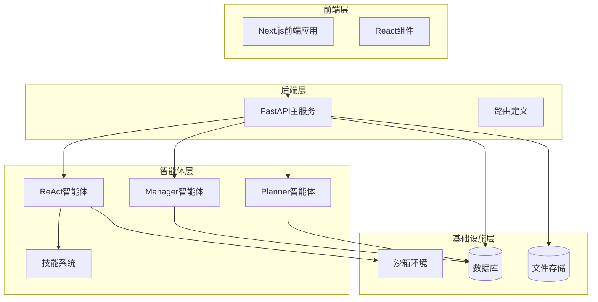

**图表来源**
- [main.py](file://localmanus-backend/main.py#L33-L524)
- [agent_manager.py](file://localmanus-backend/core/agent_manager.py#L11-L52)

**章节来源**
- [README.md](file://README.md#L1-L312)
- [main.py](file://localmanus-backend/main.py#L1-L524)

## 核心组件

### ReAct智能体系统

ReAct智能体是整个系统的核心，负责推理和行动的协调执行。它基于AgentScope框架，实现了完整的ReAct循环：

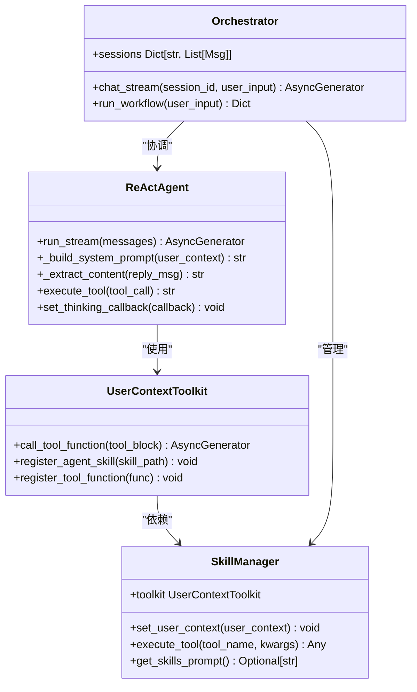

**图表来源**
- [react_agent.py](file://localmanus-backend/agents/react_agent.py#L32-L490)
- [skill_manager.py](file://localmanus-backend/core/skill_manager.py#L98-L236)
- [orchestrator.py](file://localmanus-backend/core/orchestrator.py#L12-L216)

### 流式处理架构

系统采用异步流式处理架构，确保实时响应：

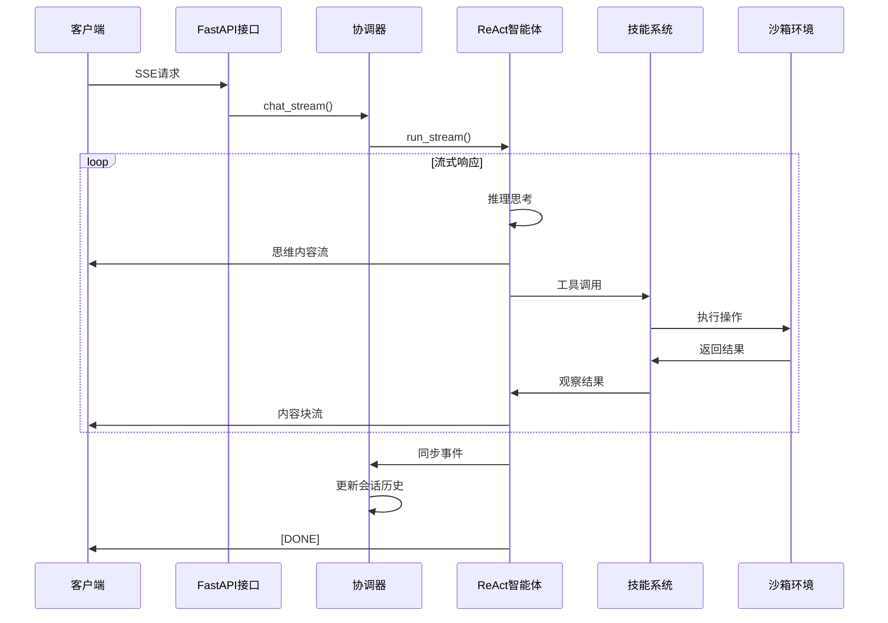

**图表来源**
- [main.py](file://localmanus-backend/main.py#L391-L424)
- [orchestrator.py](file://localmanus-backend/core/orchestrator.py#L17-L162)
- [react_agent.py](file://localmanus-backend/agents/react_agent.py#L65-L172)

**章节来源**
- [react_agent.py](file://localmanus-backend/agents/react_agent.py#L1-L490)
- [orchestrator.py](file://localmanus-backend/core/orchestrator.py#L1-L216)
- [skill_manager.py](file://localmanus-backend/core/skill_manager.py#L1-L236)

## 架构概览

### 整体系统架构

LocalManus采用分层架构设计，每层都有明确的职责分工：

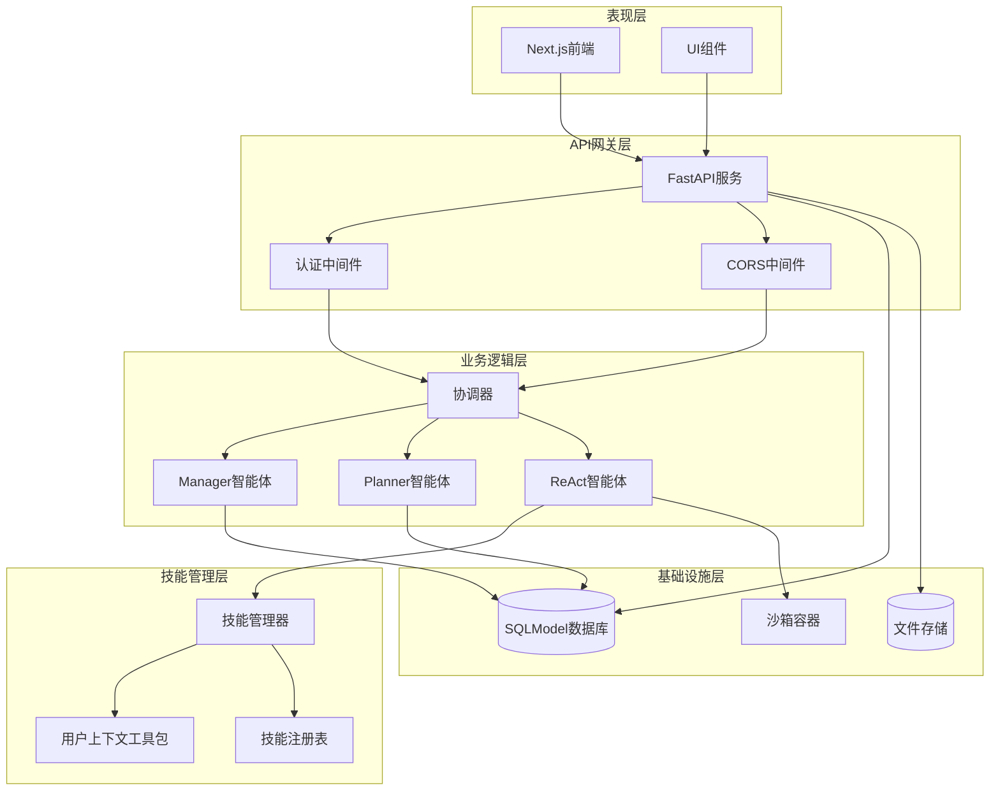

**图表来源**
- [main.py](file://localmanus-backend/main.py#L33-L524)
- [agent_manager.py](file://localmanus-backend/core/agent_manager.py#L11-L52)
- [skill_manager.py](file://localmanus-backend/core/skill_manager.py#L98-L236)

### 数据流架构

系统内部的数据流遵循严格的协议规范：

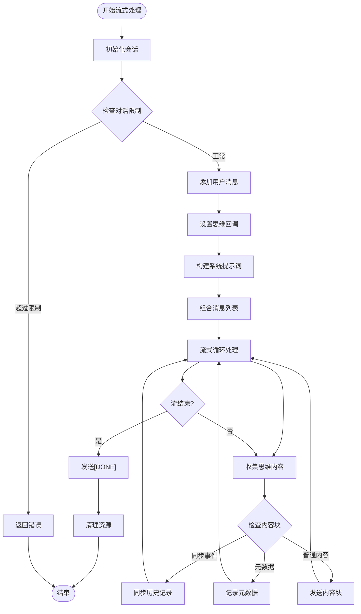

**图表来源**
- [orchestrator.py](file://localmanus-backend/core/orchestrator.py#L17-L162)

**章节来源**
- [main.py](file://localmanus-backend/main.py#L391-L424)
- [prompts.py](file://localmanus-backend/core/prompts.py#L54-L75)

## 详细组件分析

### ReAct智能体实现

ReAct智能体是系统的核心组件，实现了完整的推理-行动循环：

#### 核心方法分析

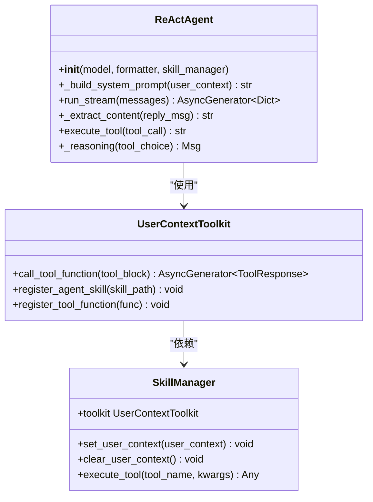

**图表来源**
- [react_agent.py](file://localmanus-backend/agents/react_agent.py#L32-L490)
- [skill_manager.py](file://localmanus-backend/core/skill_manager.py#L17-L88)

#### 流式处理机制

ReAct智能体采用异步生成器模式实现流式处理：

1. **消息转换**：将字典格式的消息转换为Msg对象
2. **响应生成**：调用父类ReActAgent的回复方法
3. **内容提取**：从响应中提取文本内容
4. **分块传输**：将长内容分割为小块进行传输
5. **工具调用检测**：实时检测并报告工具调用

**章节来源**
- [react_agent.py](file://localmanus-backend/agents/react_agent.py#L65-L172)

### 协调器系统

协调器负责管理多个智能体之间的协作和会话状态：

#### 会话管理

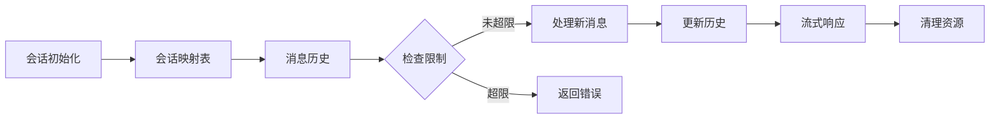

**图表来源**
- [orchestrator.py](file://localmanus-backend/core/orchestrator.py#L31-L40)

#### 思维内容收集

协调器实现了复杂的思维内容收集机制：

1. **异步队列**：使用asyncio.Queue存储思维内容
2. **并发处理**：同时处理思维内容收集和内容流传输
3. **缓冲区管理**：使用锁机制保护共享缓冲区
4. **超时处理**：防止无限等待

**章节来源**
- [orchestrator.py](file://localmanus-backend/core/orchestrator.py#L45-L162)

### 技能管理系统

技能管理系统提供了灵活的工具注册和执行机制：

#### 用户上下文注入

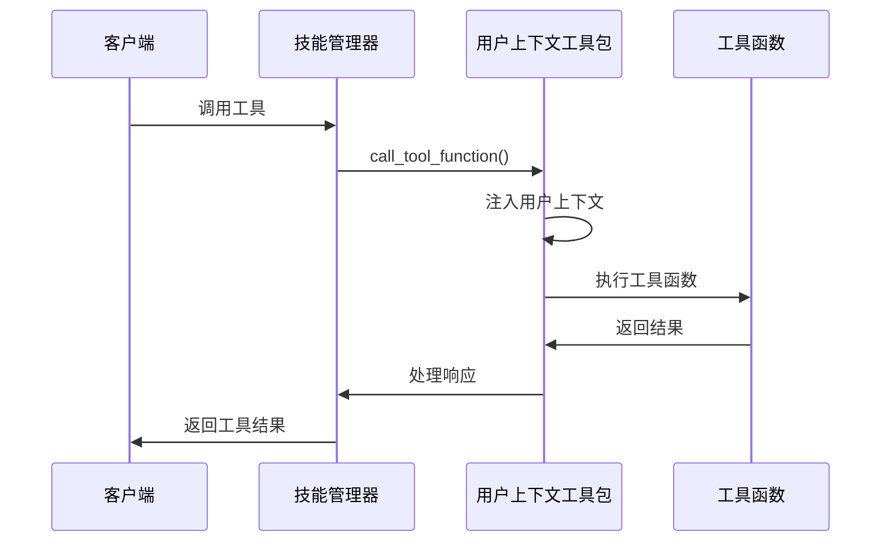

**图表来源**
- [skill_manager.py](file://localmanus-backend/core/skill_manager.py#L23-L87)

#### 动态技能加载

系统支持动态技能加载，包括：
- **Agent技能**：目录形式的复杂技能
- **工具函数**：单个Python函数
- **自动注册**：启动时自动扫描和注册

**章节来源**
- [skill_manager.py](file://localmanus-backend/core/skill_manager.py#L109-L169)

### API接口设计

系统提供了丰富的REST API接口：

#### SSE聊天接口

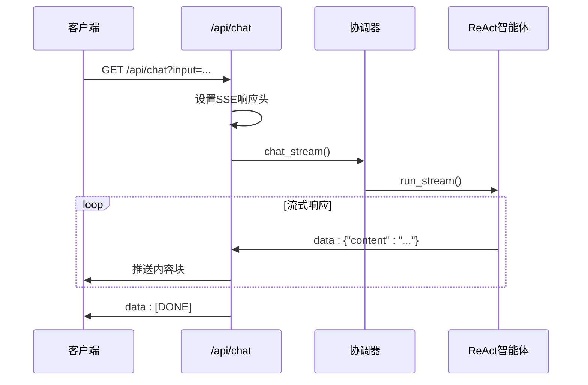

**图表来源**
- [main.py](file://localmanus-backend/main.py#L391-L424)

#### WebSocket接口

系统还提供了WebSocket接口用于实时任务监控：

**章节来源**
- [main.py](file://localmanus-backend/main.py#L444-L477)

## 依赖关系分析

### 外部依赖

系统依赖于多个关键的外部库：

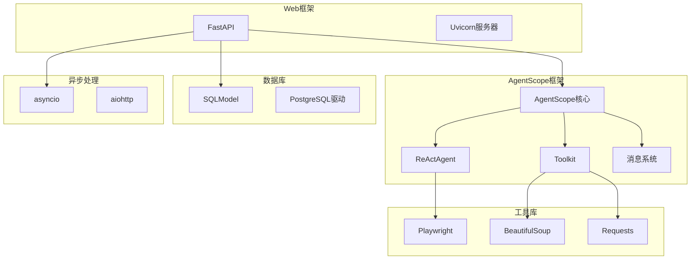

**图表来源**
- [main.py](file://localmanus-backend/main.py#L1-L26)
- [agent_manager.py](file://localmanus-backend/core/agent_manager.py#L1-L10)

### 内部模块依赖

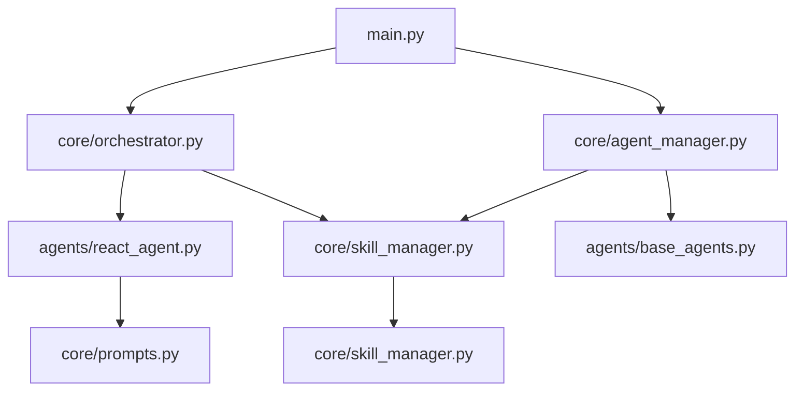

**图表来源**
- [main.py](file://localmanus-backend/main.py#L5-L16)
- [agent_manager.py](file://localmanus-backend/core/agent_manager.py#L6-L9)

**章节来源**
- [main.py](file://localmanus-backend/main.py#L1-L26)
- [agent_manager.py](file://localmanus-backend/core/agent_manager.py#L1-L52)

## 性能考虑

### 流式处理优化

系统在性能方面采用了多项优化策略：

1. **异步I/O**：使用asyncio实现非阻塞的流式处理
2. **内存管理**：及时清理异步任务和队列资源
3. **内容分块**：将长内容分割为小块传输，减少内存占用
4. **并发控制**：合理控制并发任务数量，避免资源争用

### 缓存策略

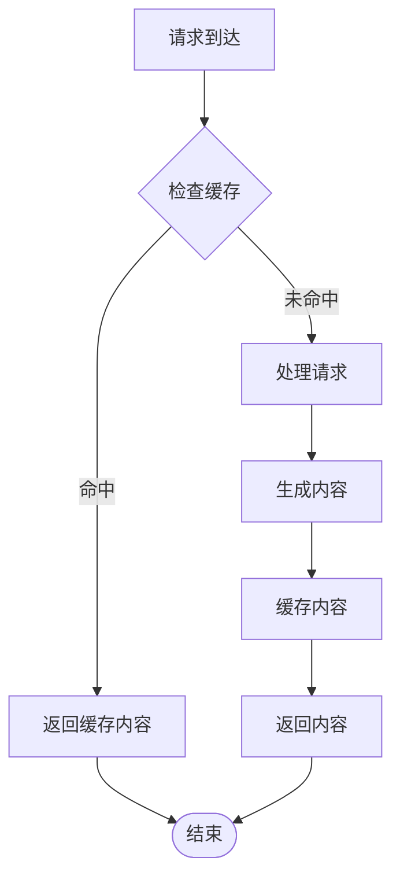

### 错误处理机制

系统实现了完善的错误处理机制：

1. **异常捕获**：在关键位置捕获和处理异常
2. **资源清理**：确保异步任务和连接得到正确清理
3. **降级策略**：在网络或服务不可用时提供降级响应
4. **日志记录**：详细记录错误信息便于调试

## 故障排除指南

### 常见问题诊断

#### SSE连接问题

**症状**：客户端无法接收流式响应

**可能原因**：
1. CORS配置不正确
2. Nginx缓冲导致的延迟
3. WebSocket连接冲突
4. 代理服务器配置问题

**解决方案**：
1. 检查CORS中间件配置
2. 验证Nginx配置中的缓冲禁用设置
3. 确认SSE和WebSocket端点分离
4. 检查代理服务器的WebSocket支持

#### 智能体响应缓慢

**症状**：ReAct智能体响应时间过长

**可能原因**：
1. LLM模型响应慢
2. 工具调用执行时间长
3. 网络延迟
4. 并发任务过多

**解决方案**：
1. 优化模型配置和参数
2. 实现工具调用的超时机制
3. 检查网络连接质量
4. 调整并发限制

#### 技能执行失败

**症状**：工具调用返回错误

**可能原因**：
1. 技能未正确注册
2. 用户上下文缺失
3. 权限不足
4. 外部服务不可用

**解决方案**：
1. 检查技能注册日志
2. 验证用户上下文设置
3. 确认权限配置
4. 检查外部服务状态

**章节来源**
- [test_chat_sse.py](file://localmanus-backend/test_chat_sse.py#L30-L115)

### 调试工具

系统提供了多种调试工具：

#### 测试套件

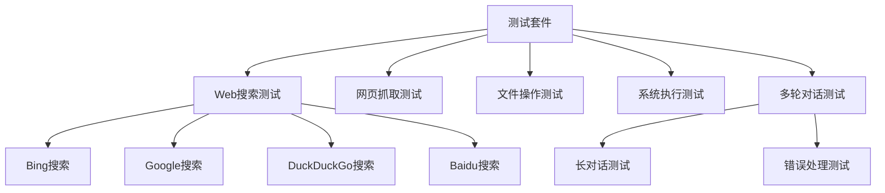

**图表来源**
- [test_chat_sse.py](file://localmanus-backend/test_chat_sse.py#L411-L466)

#### 日志分析

系统使用结构化日志记录所有关键操作：

1. **请求日志**：记录所有API请求的详细信息
2. **智能体日志**：跟踪ReAct智能体的推理过程
3. **技能日志**：记录工具调用的执行情况
4. **错误日志**：捕获和记录所有异常情况

**章节来源**
- [test_chat_sse.py](file://localmanus-backend/test_chat_sse.py#L1-L509)

## 结论

LocalManus的ReAct智能体流式增强项目展示了现代AI应用的最佳实践。通过精心设计的架构和实现，系统成功地解决了传统AI应用中的延迟和用户体验问题。

### 主要成就

1. **实时流式响应**：通过SSE技术实现了真正的实时交互
2. **智能体协作**：多智能体系统的有效协调和管理
3. **可扩展性**：模块化的架构设计支持功能扩展
4. **安全性**：沙箱环境和权限控制确保系统安全

### 技术亮点

- **异步流式处理**：使用asyncio实现高效的并发处理
- **思维内容可视化**：实时展示AI的思考过程
- **工具调用集成**：无缝集成各种外部工具和服务
- **会话状态管理**：支持多轮对话的历史记录

### 未来发展

该项目为AI应用的流式增强提供了优秀的参考模型，未来可以在以下方面进一步发展：

1. **性能优化**：进一步优化流式处理的性能
2. **功能扩展**：增加更多类型的智能体和技能
3. **用户体验**：改进前端界面和交互设计
4. **部署优化**：简化部署流程和配置管理

通过持续的改进和优化，LocalManus将成为一个功能完整、性能优异的AI智能体平台。