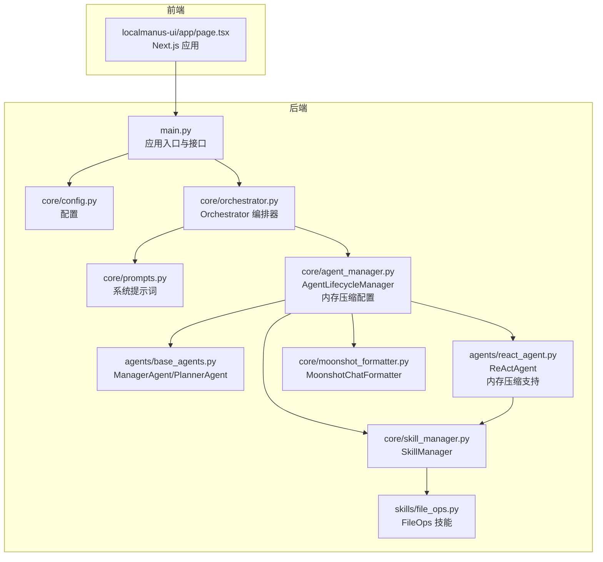
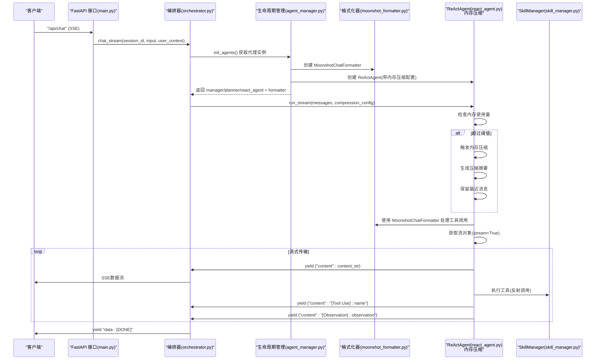
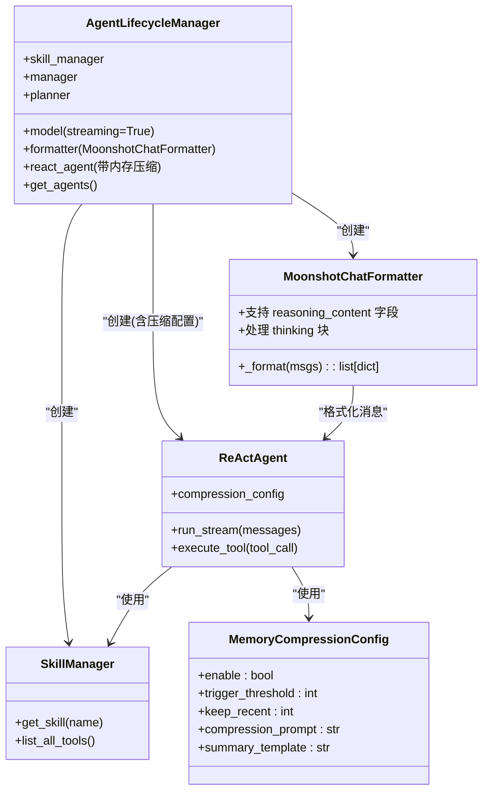
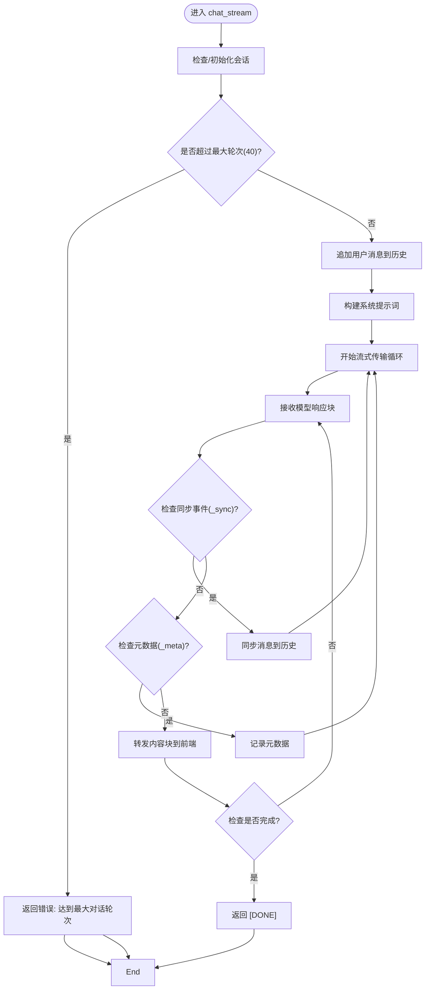
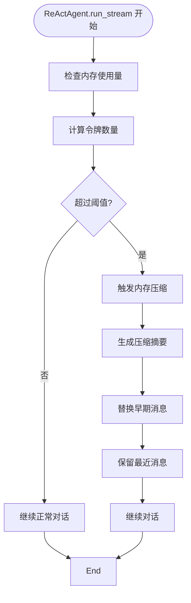
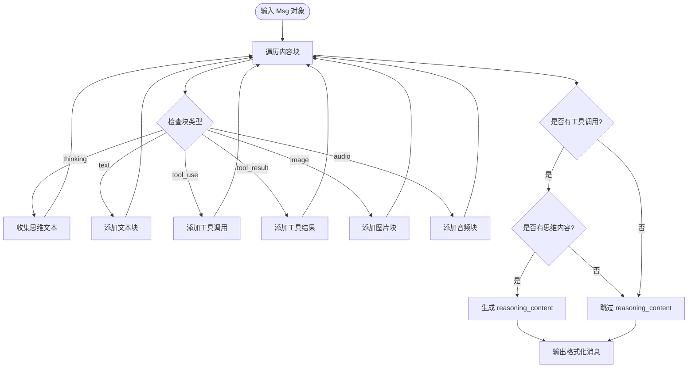
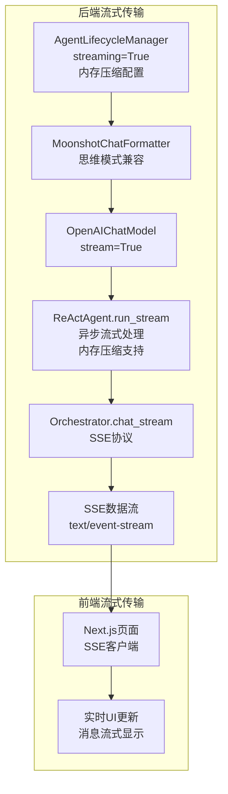
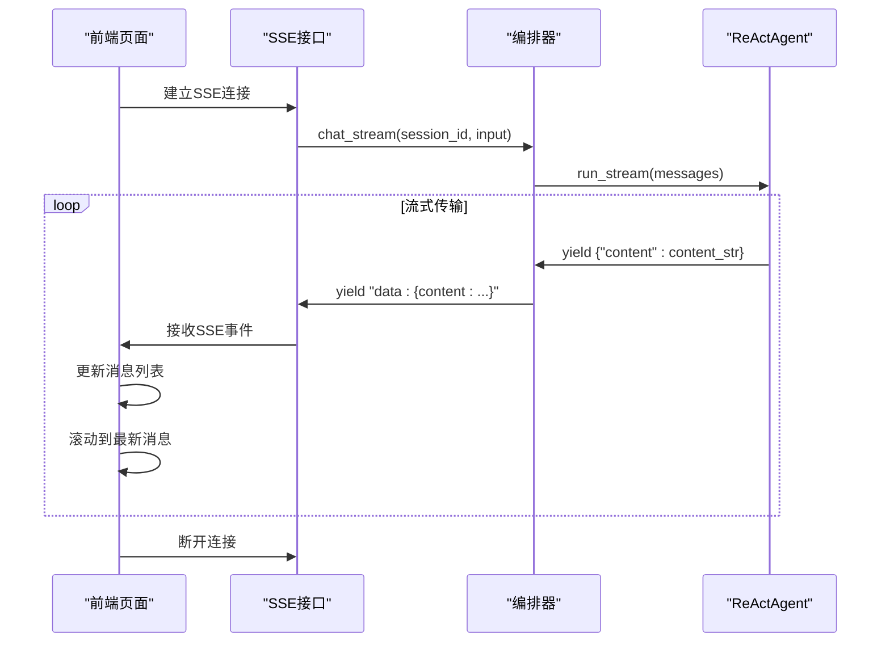
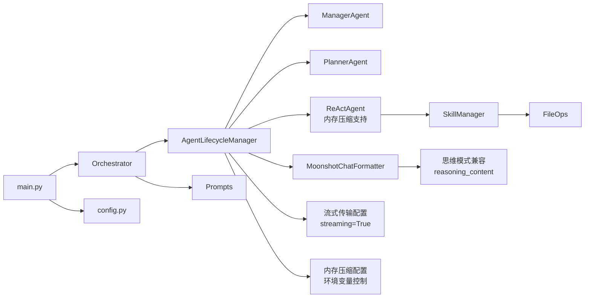

# 智能体管理器

<cite>
**本文引用的文件列表**
- [main.py](file://localmanus-backend/main.py)
- [agent_manager.py](file://localmanus-backend/core/agent_manager.py)
- [orchestrator.py](file://localmanus-backend/core/orchestrator.py)
- [base_agents.py](file://localmanus-backend/agents/base_agents.py)
- [react_agent.py](file://localmanus-backend/agents/react_agent.py)
- [skill_manager.py](file://localmanus-backend/core/skill_manager.py)
- [prompts.py](file://localmanus-backend/core/prompts.py)
- [file_ops.py](file://localmanus-backend/skills/file_ops.py)
- [config.py](file://localmanus-backend/core/config.py)
- [test_orchestration.py](file://localmanus-backend/scripts/test_orchestration.py)
- [.env.example](file://localmanus-backend/.env.example)
- [page.tsx](file://localmanus-ui/app/page.tsx)
- [moonshot_formatter.py](file://localmanus-backend/core/moonshot_formatter.py)
</cite>

## 更新摘要
**变更内容**
- 更新了AgentLifecycleManager的配置，启用可配置的内存压缩设置
- 新增了环境变量控制内存压缩功能，支持ENABLE_MEMORY_COMPRESSION、MEMORY_COMPRESSION_THRESHOLD、MEMORY_KEEP_RECENT
- 增强了ReActAgent的内存压缩机制，支持阈值触发和最近消息保留策略
- 完善了内存压缩的配置管理和运行时控制
- 新增了内存压缩相关的性能优化和资源管理策略

## 目录
1. [简介](#简介)
2. [项目结构](#项目结构)
3. [核心组件](#核心组件)
4. [架构总览](#架构总览)
5. [详细组件分析](#详细组件分析)
6. [内存压缩管理](#内存压缩管理)
7. [MoonshotChatFormatter：思维模式兼容性](#moonshotchatformatter思维模式兼容性)
8. [流式传输系统](#流式传输系统)
9. [依赖关系分析](#依赖关系分析)
10. [性能考量](#性能考量)
11. [故障排查指南](#故障排查指南)
12. [结论](#结论)
13. [附录](#附录)

## 简介
本技术文档围绕 LocalManus 智能体管理器展开，重点阐释 AgentLifecycleManager 的核心职责：智能体生命周期管理、实例创建与销毁、状态监控；以及智能体管理器如何协调多个智能体的启动顺序、资源分配与内存管理。文档还涵盖智能体间通信机制、消息路由与事件通知，智能体注册流程、配置管理与动态加载机制，并通过实际代码示例展示智能体实例化过程、生命周期钩子与异常处理策略。特别强调了最新的流式传输能力，该能力通过OpenAIChatModel的streaming=True配置实现，为用户提供端到端的实时响应体验。**新增**：AgentLifecycleManager现在支持可配置的内存压缩功能，通过环境变量控制压缩开关、阈值和最近消息保留策略，有效优化大容量对话场景的内存使用。**新增**：MoonshotChatFormatter确保与 Moonshot/Kimi 等思维模式模型的兼容性，支持 reasoning_content 字段的正确处理。最后说明与编排器的集成方式、任务分发机制与结果聚合方法，解释智能体池化管理、并发控制与性能优化策略。

## 项目结构
后端采用模块化设计，按功能域划分：
- 核心层（core）：编排器、智能体生命周期管理、技能管理、提示词模板、配置、**新增**：内存压缩管理
- 智能体层（agents）：基础智能体与 ReAct 智能体，**新增**：内存压缩支持
- 技能层（skills）：可插拔工具集合
- 入口（main.py）：FastAPI 应用入口与接口定义
- 脚本（scripts）：演示脚本
- 前端（localmanus-ui）：Next.js 应用，支持实时流式传输



**图表来源**
- [main.py](file://localmanus-backend/main.py#L1-L524)
- [agent_manager.py](file://localmanus-backend/core/agent_manager.py#L1-L65)
- [orchestrator.py](file://localmanus-backend/core/orchestrator.py#L1-L131)
- [base_agents.py](file://localmanus-backend/agents/base_agents.py#L1-L42)
- [react_agent.py](file://localmanus-backend/agents/react_agent.py#L1-L675)
- [skill_manager.py](file://localmanus-backend/core/skill_manager.py#L1-L259)
- [prompts.py](file://localmanus-backend/core/prompts.py#L1-L53)
- [file_ops.py](file://localmanus-backend/skills/file_ops.py#L1-L41)
- [config.py](file://localmanus-backend/core/config.py#L1-L27)
- [page.tsx](file://localmanus-ui/app/page.tsx#L1-L239)
- [moonshot_formatter.py](file://localmanus-backend/core/moonshot_formatter.py#L1-L143)

**章节来源**
- [main.py](file://localmanus-backend/main.py#L1-L524)
- [agent_manager.py](file://localmanus-backend/core/agent_manager.py#L1-L65)
- [orchestrator.py](file://localmanus-backend/core/orchestrator.py#L1-L131)

## 核心组件
- AgentLifecycleManager：负责初始化 AgentScope、构建模型与格式化器、实例化核心智能体（ManagerAgent、PlannerAgent、ReActAgent），并提供全局代理实例获取接口。**已更新**：配置了streaming=True以支持实时流式传输，**新增**：集成内存压缩配置管理，支持通过环境变量控制压缩行为，**新增**：使用 MoonshotChatFormatter 以支持思维模式模型兼容性。
- Orchestrator：编排器，负责会话管理、意图解析、任务规划、工作流执行与结果聚合。**已更新**：支持流式传输协议，处理内部同步事件和元数据。
- ManagerAgent/PlannerAgent：基于 ReActAgent 的封装，分别承担输入标准化与任务规划职责。
- ReActAgent：具备 ReAct 思维链能力，支持工具调用与上下文迭代。**已更新**：实现了完整的流式传输支持，包括内容流、工具调用流和观察值流，**新增**：内置内存压缩机制，支持阈值触发和最近消息保留策略。
- SkillManager：动态加载技能目录中的技能类，提供工具元数据与执行路由。
- 基础技能 FileOps：文件读写与目录列举等基础操作示例。
- **新增**：内存压缩配置：通过环境变量ENABLE_MEMORY_COMPRESSION、MEMORY_COMPRESSION_THRESHOLD、MEMORY_KEEP_RECENT控制压缩行为，支持动态阈值调整和最近消息保护。
- **新增**：MoonshotChatFormatter：扩展自 OpenAIChatFormatter，专门处理 Moonshot/Kimi 等思维模式模型的特殊要求，包括 reasoning_content 字段的正确处理。

**章节来源**
- [agent_manager.py](file://localmanus-backend/core/agent_manager.py#L11-L65)
- [orchestrator.py](file://localmanus-backend/core/orchestrator.py#L11-L131)
- [base_agents.py](file://localmanus-backend/agents/base_agents.py#L6-L42)
- [react_agent.py](file://localmanus-backend/agents/react_agent.py#L133-L232)
- [skill_manager.py](file://localmanus-backend/core/skill_manager.py#L98-L259)
- [file_ops.py](file://localmanus-backend/skills/file_ops.py#L4-L41)
- [moonshot_formatter.py](file://localmanus-backend/core/moonshot_formatter.py#L19-L143)
- [.env.example](file://localmanus-backend/.env.example#L13-L19)

## 架构总览
LocalManus 后端以 FastAPI 提供 API 网关，内部通过 Orchestrator 协调 ManagerAgent、PlannerAgent 与 ReActAgent 完成从用户输入到任务规划再到工具执行的完整链路。AgentLifecycleManager 统一管理 AgentScope 初始化与代理实例化，**已更新**：配置了流式传输支持，**新增**：集成内存压缩配置管理，**新增**：集成 MoonshotChatFormatter 以支持思维模式模型兼容性，SkillManager 动态加载技能并暴露工具元数据，实现"智能体 + 工具"的可扩展架构。前端通过 Next.js 应用实现实时流式传输体验。



**图表来源**
- [main.py](file://localmanus-backend/main.py#L391-L424)
- [orchestrator.py](file://localmanus-backend/core/orchestrator.py#L16-L77)
- [agent_manager.py](file://localmanus-backend/core/agent_manager.py#L45-L52)
- [moonshot_formatter.py](file://localmanus-backend/core/moonshot_formatter.py#L19-L143)
- [react_agent.py](file://localmanus-backend/agents/react_agent.py#L173-L232)
- [skill_manager.py](file://localmanus-backend/core/skill_manager.py#L72-L83)

## 详细组件分析

### AgentLifecycleManager：生命周期与实例化
- 职责
  - 初始化 AgentScope 运行时
  - 构建模型与格式化器实例
  - 实例化核心智能体（ManagerAgent、PlannerAgent、ReActAgent）
  - 提供全局代理实例获取接口，避免重复初始化
  - **新增**：配置内存压缩参数，支持环境变量控制
- 关键点
  - 使用环境变量配置模型名称、API Key 与基地址
  - **已更新**：配置了streaming=True以支持实时流式传输
  - **新增**：内存压缩配置管理，通过环境变量ENABLE_MEMORY_COMPRESSION控制开关
  - **新增**：MEMORY_COMPRESSION_THRESHOLD设置压缩触发阈值，默认10000令牌
  - **新增**：MEMORY_KEEP_RECENT设置保留的最近消息数量，默认3条
  - **新增**：将内存压缩配置传递给ReActAgent实例
  - **新增**：使用 MoonshotChatFormatter 替代标准 OpenAIChatFormatter，确保与思维模式模型兼容
  - 将 SkillManager 注入 ReActAgent，使其具备工具调用能力
  - 通过全局单例确保多处调用共享同一套代理实例
- 生命周期钩子
  - 初始化阶段完成依赖装配
  - 销毁阶段由进程退出触发，未显式实现自定义析构
- 异常处理
  - 模型与格式化器构造失败会在后续调用中抛出
  - 建议在上层捕获并返回友好错误



**图表来源**
- [agent_manager.py](file://localmanus-backend/core/agent_manager.py#L11-L65)
- [moonshot_formatter.py](file://localmanus-backend/core/moonshot_formatter.py#L19-L143)
- [react_agent.py](file://localmanus-backend/agents/react_agent.py#L173-L232)
- [skill_manager.py](file://localmanus-backend/core/skill_manager.py#L98-L259)

**章节来源**
- [agent_manager.py](file://localmanus-backend/core/agent_manager.py#L11-L65)

### Orchestrator：编排与会话管理
- 职责
  - 维护会话历史（按 session_id 分组）
  - 意图解析：调用 ManagerAgent 标准化用户输入
  - 任务规划：调用 PlannerAgent 生成任务 DAG
  - 工作流执行：将意图与规划整合为可执行计划
  - **已更新**：流式聊天：通过 ReActAgent.run_stream 生成中间思考与最终答案的实时流
- 关键点
  - 会话上限控制（最多 40 轮对话）
  - JSON 提取辅助函数用于从智能体输出中解析结构化数据
  - **已更新**：SSE 接口用于实时交互，支持流式传输协议
  - **已更新**：内部协议处理：'_sync'（同步事件）、'_meta'（元数据事件）
- 并发与资源
  - 每个会话独立维护上下文列表
  - 通过 session_id 隔离不同用户的对话状态
- 异常处理
  - 对聊天流与工作流执行进行异常捕获并返回错误信息



**图表来源**
- [orchestrator.py](file://localmanus-backend/core/orchestrator.py#L16-L77)

**章节来源**
- [orchestrator.py](file://localmanus-backend/core/orchestrator.py#L11-L131)

### ManagerAgent 与 PlannerAgent：意图与规划
- ManagerAgent
  - 使用系统提示词对用户输入进行标准化，输出结构化意图
  - 作为编排器的第一步，负责清理与提炼用户请求
- PlannerAgent
  - 基于可用技能生成任务 DAG，描述步骤、依赖与参数
  - 输出包含 trace_id 的计划，便于追踪与聚合

**章节来源**
- [base_agents.py](file://localmanus-backend/agents/base_agents.py#L6-L42)
- [prompts.py](file://localmanus-backend/core/prompts.py#L3-L52)

### ReActAgent：思维链与工具调用
- 能力
  - 支持 Thought/Action/Observation 循环
  - 从 SkillManager 获取工具元数据，动态注入系统提示词
  - 解析 Action 行，反射调用对应技能工具
  - **已更新**：完整的流式传输支持，包括内容流、工具调用流和观察值流
  - **新增**：内置内存压缩机制，支持令牌计数和阈值触发
  - **新增**：最近消息保留策略，保护关键对话上下文
- 内存压缩配置
  - **新增**：DEFAULT_COMPRESSION_THRESHOLD = 10000 令牌
  - **新增**：DEFAULT_KEEP_RECENT = 3 条消息
  - **新增**：COMPRESSION_PROMPT 提供压缩指导
  - **新增**：SUMMARY_TEMPLATE 结构化摘要模板
  - **新增**：CompressionConfig 结构化配置对象
- 上下文管理
  - 接收历史消息列表，逐步扩展为 full_context
  - 每轮迭代将 Agent 的输出加入上下文，形成闭环
  - **新增**：内存使用量监控，超过阈值时触发压缩
  - **新增**：最近消息保护，避免关键信息丢失
- 异常处理
  - 工具执行异常会被包装为观察值返回，避免中断循环
  - **已更新**：流式传输中的异常会被转换为错误消息返回
  - **新增**：内存压缩异常会被优雅处理，不影响主流程
- 并发与性能
  - 默认最大迭代次数限制，防止无限循环
  - 可根据任务复杂度调整迭代上限
  - **已更新**：流式传输支持异步处理，提高响应速度
  - **新增**：内存压缩支持异步执行，减少延迟影响

```mermaid
sequenceDiagram
participant RCT as "ReActAgent"
participant MF as "MoonshotChatFormatter"
participant SKM as "SkillManager"
participant Tool as "具体技能工具"
RCT->>MF : 格式化消息(支持 reasoning_content)
MF-->>RCT : 格式化后的消息列表
RCT->>SKM : list_all_tools()
SKM-->>RCT : 工具元数据列表
RCT->>RCT : 生成系统提示词(含工具元数据)
loop N 轮流式循环
RCT->>RCT : 检查内存使用量
alt 超过阈值
RCT->>RCT : 触发内存压缩
RCT->>RCT : 生成压缩摘要
RCT->>RCT : 保留最近消息
end
RCT->>RCT : 获取流对象(stream=True)
loop 流式块
RCT->>RCT : 生成 Thought/Action/Observation
alt 包含 Action
RCT->>MF : 格式化工具调用消息
MF-->>RCT : 包含 reasoning_content 的消息
RCT->>SKM : get_skill(skill_name)
SKM-->>RCT : 技能实例
RCT->>Tool : execute_tool(tool_name, **params)
Tool-->>RCT : 观察结果
RCT->>RCT : 将观察加入上下文
RCT->>Client : yield {"content" : "[Tool Use] : name"}
RCT->>Client : yield {"content" : "[Observation] : observation"}
else 无 Action/有 Final Answer
RCT-->>Client : yield {"content" : content_str}
end
end
RCT->>Client : yield {"_meta" : {...}}
RCT-->>Client : 返回最终答案
```

**图表来源**
- [react_agent.py](file://localmanus-backend/agents/react_agent.py#L250-L357)
- [moonshot_formatter.py](file://localmanus-backend/core/moonshot_formatter.py#L30-L142)
- [skill_manager.py](file://localmanus-backend/core/skill_manager.py#L252-L259)

**章节来源**
- [react_agent.py](file://localmanus-backend/agents/react_agent.py#L133-L232)

### SkillManager：动态加载与工具路由
- 职责
  - 动态扫描 skills 目录，自动发现并实例化继承自 BaseSkill 的类
  - 提供工具元数据查询与技能执行路由
- 关键点
  - 使用 importlib 与 inspect 实现反射式加载
  - BaseSkill 的 execute 方法统一调度具体工具方法
  - 支持同步与异步工具方法的自动识别
  - **已更新**：支持异步工具执行，提高流式传输性能
  - **新增**：UserContextToolkit 支持用户上下文注入
  - **新增**：ContextVar 确保并发请求的上下文隔离
- 扩展性
  - 新增技能仅需在 skills 目录新增模块并实现 BaseSkill 子类
  - 自动暴露工具签名与描述，无需修改编排逻辑

**章节来源**
- [skill_manager.py](file://localmanus-backend/core/skill_manager.py#L98-L259)
- [file_ops.py](file://localmanus-backend/skills/file_ops.py#L4-L41)

### 配置管理与环境变量
- 配置来源
  - 通过 .env 文件设置 OPENAI_API_KEY、OPENAI_API_BASE、MODEL_NAME
  - config.py 读取环境变量并导出 AGENT_MODEL_CONFIGS 与服务端口
  - **新增**：MEMORY_COMPRESSION_* 环境变量控制内存压缩行为
- 影响范围
  - AgentLifecycleManager 使用环境变量初始化模型
  - **已更新**：配置了streaming=True以支持实时流式传输
  - **新增**：内存压缩配置通过环境变量控制
  - **新增**：ENABLE_MEMORY_COMPRESSION 控制压缩开关
  - **新增**：MEMORY_COMPRESSION_THRESHOLD 设置压缩阈值
  - **新增**：MEMORY_KEEP_RECENT 设置最近消息保留数量
  - **新增**：默认使用 Moonshot/Kimi 模型名称和 API 基地址
  - Orchestrator 与前端均依赖统一的服务端口配置

**章节来源**
- [.env.example](file://localmanus-backend/.env.example#L1-L23)
- [config.py](file://localmanus-backend/core/config.py#L1-L27)
- [agent_manager.py](file://localmanus-backend/core/agent_manager.py#L40-L52)

### 与编排器的集成与任务分发
- 接口集成
  - FastAPI 提供 /api/chat（SSE）、/api/task（同步）、/api/react（同步）、/ws/task/{trace_id}（WebSocket）
  - main.py 中的 orchestrator 实例贯穿所有接口
  - **已更新**：/api/chat 支持流式传输协议
- 任务分发
  - run_workflow：Manager -> Planner -> DAG
  - run_react_loop：直接交给 ReActAgent 执行工具链
  - **已更新**：chat_stream：通过流式传输实现实时响应
- 结果聚合
  - Manager 与 Planner 的输出经 JSON 提取后合并为 DAG 计划
  - ReActAgent 的最终答案作为结果返回
  - **已更新**：流式传输中实时聚合中间结果

**章节来源**
- [main.py](file://localmanus-backend/main.py#L391-L424)
- [orchestrator.py](file://localmanus-backend/core/orchestrator.py#L78-L131)
- [test_orchestration.py](file://localmanus-backend/scripts/test_orchestration.py#L12-L56)

## 内存压缩管理

### 设计目标
内存压缩管理是 LocalManus 智能体管理器的重要性能优化功能，旨在解决长时间对话导致的内存膨胀问题。通过可配置的压缩机制，在保证对话质量的前提下有效控制内存使用量。

### 核心特性
- **阈值触发**：当对话上下文令牌数超过设定阈值时自动触发压缩
- **最近消息保护**：保留最近的若干条消息，确保关键上下文不被压缩
- **结构化摘要**：生成结构化的压缩摘要，包含任务概览、当前状态、重要发现等
- **环境变量控制**：通过环境变量灵活配置压缩行为
- **异步执行**：压缩过程异步执行，不影响主对话流程

### 配置参数
- **ENABLE_MEMORY_COMPRESSION**：启用/禁用内存压缩，默认 true
- **MEMORY_COMPRESSION_THRESHOLD**：压缩触发阈值，单位令牌，默认 10000
- **MEMORY_KEEP_RECENT**：保留的最近消息数量，默认 3

### 实现原理
内存压缩机制在 ReActAgent 中实现，通过以下步骤完成：

1. **令牌计数**：使用 SimpleTokenCounter 计算当前上下文的令牌数量
2. **阈值检查**：比较当前令牌数与配置的阈值
3. **压缩触发**：超过阈值时触发压缩流程
4. **摘要生成**：使用 COMPRESSION_PROMPT 和 SUMMARY_TEMPLATE 生成压缩摘要
5. **消息替换**：用压缩摘要替换早期对话内容
6. **最近消息保留**：保留最近的 KEEP_RECENT 条消息



**图表来源**
- [react_agent.py](file://localmanus-backend/agents/react_agent.py#L196-L232)

**章节来源**
- [agent_manager.py](file://localmanus-backend/core/agent_manager.py#L40-L52)
- [react_agent.py](file://localmanus-backend/agents/react_agent.py#L142-L232)
- [.env.example](file://localmanus-backend/.env.example#L13-L19)

## MoonshotChatFormatter：思维模式兼容性

### 设计目标
MoonshotChatFormatter 是专门为支持 Moonshot/Kimi 等思维模式模型而设计的格式化器。这些模型具有独特的思维链功能，要求在包含工具调用的助手消息中必须包含 reasoning_content 字段，其中包含推理/思考文本。

### 核心特性
- **思维内容保留**：将思维块（thinking blocks）转换为 reasoning_content 字段，而不是简单跳过
- **工具调用兼容**：在同时包含思维内容和工具调用时，正确生成 reasoning_content
- **格式化扩展**：继承自 OpenAIChatFormatter，保持向后兼容性
- **多模态支持**：支持文本、图像、音频等多种内容块类型

### 实现原理
MoonshotChatFormatter 在格式化过程中会遍历消息中的每个内容块：
1. 提取 thinking 类型的内容块，收集所有思维文本
2. 处理 text、tool_use、tool_result 等标准内容块
3. 当检测到工具调用时，将收集到的所有思维文本合并为 reasoning_content
4. 生成符合 Moonshot API 要求的消息格式



**图表来源**
- [moonshot_formatter.py](file://localmanus-backend/core/moonshot_formatter.py#L30-L142)

**章节来源**
- [moonshot_formatter.py](file://localmanus-backend/core/moonshot_formatter.py#L1-L143)

## 流式传输系统

### 流式传输架构
LocalManus 系统实现了完整的端到端实时流式传输能力，从后端模型调用到前端实时显示的完整链路：



**图表来源**
- [agent_manager.py](file://localmanus-backend/core/agent_manager.py#L22-L27)
- [moonshot_formatter.py](file://localmanus-backend/core/moonshot_formatter.py#L19-L28)
- [react_agent.py](file://localmanus-backend/agents/react_agent.py#L250-L357)
- [orchestrator.py](file://localmanus-backend/core/orchestrator.py#L53-L69)
- [page.tsx](file://localmanus-ui/app/page.tsx#L61-L102)

### 流式传输协议
系统采用自定义的内部协议来区分不同类型的消息：

- **内容块**：`{"content": "字符串内容"}`
  - 用于实时显示模型生成的内容
  - 支持多模态内容（文本列表）

- **同步事件**：`{"_sync": [消息列表]}`
  - 内部协议，用于同步新添加的消息到会话历史
  - 不发送到前端，仅用于后端状态管理

- **元数据事件**：`{"_meta": {字典数据}}`
  - 内部协议，包含运行元数据（如工具调用数量、是否需要继续）
  - 不发送到前端，仅用于日志和调试

### 前端流式传输实现
前端使用标准的 Server-Sent Events API 实现实时消息显示：



**图表来源**
- [page.tsx](file://localmanus-ui/app/page.tsx#L61-L102)
- [main.py](file://localmanus-backend/main.py#L391-L424)
- [orchestrator.py](file://localmanus-backend/core/orchestrator.py#L53-L69)

**章节来源**
- [react_agent.py](file://localmanus-backend/agents/react_agent.py#L250-L357)
- [orchestrator.py](file://localmanus-backend/core/orchestrator.py#L16-L77)
- [page.tsx](file://localmanus-ui/app/page.tsx#L39-L110)

## 依赖关系分析
- 组件耦合
  - Orchestrator 依赖 AgentLifecycleManager 提供的代理实例
  - ReActAgent 依赖 SkillManager 提供的工具集
  - ManagerAgent/PlannerAgent 依赖系统提示词模板
  - **已更新**：ReActAgent 依赖 AgentLifecycleManager 的流式模型配置
  - **新增**：ReActAgent 依赖内存压缩配置管理
  - **新增**：ReActAgent 依赖 MoonshotChatFormatter 进行消息格式化
- 外部依赖
  - AgentScope：模型、格式化器、消息类型
  - FastAPI：接口定义与运行时
  - Python 标准库：os、json、asyncio、dotenv 等
  - **已更新**：SSE（Server-Sent Events）支持
  - **新增**：内存压缩相关依赖（SimpleTokenCounter、CompressionConfig）
  - **新增**：Moonshot/Kimi API 兼容性
- 潜在循环依赖
  - 当前结构清晰，未见循环导入



**图表来源**
- [orchestrator.py](file://localmanus-backend/core/orchestrator.py#L12-L14)
- [agent_manager.py](file://localmanus-backend/core/agent_manager.py#L29-L52)
- [react_agent.py](file://localmanus-backend/agents/react_agent.py#L173-L232)
- [skill_manager.py](file://localmanus-backend/core/skill_manager.py#L106-L107)
- [prompts.py](file://localmanus-backend/core/prompts.py#L3-L16)
- [main.py](file://localmanus-backend/main.py#L34-L36)
- [config.py](file://localmanus-backend/core/config.py#L20-L27)
- [moonshot_formatter.py](file://localmanus-backend/core/moonshot_formatter.py#L19-L28)

**章节来源**
- [orchestrator.py](file://localmanus-backend/core/orchestrator.py#L12-L14)
- [agent_manager.py](file://localmanus-backend/core/agent_manager.py#L29-L52)
- [react_agent.py](file://localmanus-backend/agents/react_agent.py#L173-L232)
- [skill_manager.py](file://localmanus-backend/core/skill_manager.py#L106-L107)
- [prompts.py](file://localmanus-backend/core/prompts.py#L3-L16)
- [main.py](file://localmanus-backend/main.py#L34-L36)
- [config.py](file://localmanus-backend/core/config.py#L20-L27)
- [moonshot_formatter.py](file://localmanus-backend/core/moonshot_formatter.py#L19-L28)

## 性能考量
- 并发控制
  - FastAPI 默认基于 asyncio，接口天然支持高并发
  - Orchestrator 通过 session_id 隔离状态，避免跨会话干扰
  - **已更新**：流式传输支持异步处理，提高并发性能
  - **新增**：内存压缩异步执行，减少对主流程的影响
- 内存管理
  - 会话历史存储在内存字典中，建议在生产环境引入持久化与过期回收策略
  - ReActAgent 的上下文随迭代增长，应合理设置 max_iterations
  - **已更新**：流式传输中实时释放中间结果，减少内存占用
  - **新增**：内存压缩机制有效控制长期对话的内存使用
  - **新增**：可配置的压缩阈值适应不同场景需求
  - **新增**：最近消息保护确保关键上下文不被压缩
- 资源分配
  - AgentScope 模型实例在 AgentLifecycleManager 中集中管理，减少重复初始化开销
  - **已更新**：流式传输配置优化，支持更高效的模型调用
  - **新增**：内存压缩配置支持动态调整，平衡性能与内存使用
  - **新增**：MoonshotChatFormatter 的格式化开销较小，对性能影响有限
- I/O 优化
  - SSE 与 WebSocket 适合长连接与流式输出，注意客户端缓冲与断线重连
  - **已更新**：SSE 协议优化，支持更好的实时性
  - **新增**：内存压缩减少大容量对话的 I/O 压力
- 可扩展性
  - SkillManager 动态加载技能，便于按需扩展工具集
  - 建议将工具执行封装为异步方法，提升吞吐
  - **已更新**：异步工具执行支持，提高整体性能
  - **新增**：内存压缩配置支持环境变量热更新
  - **新增**：MoonshotChatFormatter 支持多种内容块类型，增强系统灵活性

## 故障排查指南
- 环境变量缺失
  - 现象：模型初始化失败或 API 调用报错
  - 处理：检查 .env 文件，确保 OPENAI_API_KEY、OPENAI_API_BASE、MODEL_NAME 设置正确
- 会话上限
  - 现象：达到最大对话轮次后返回错误
  - 处理：清理旧会话或增加轮次限制
- 工具执行异常
  - 现象：Action 执行失败，返回错误观察值
  - 处理：检查技能实现与参数传递，确认工具存在且签名匹配
- JSON 解析失败
  - 现象：智能体输出非结构化导致解析异常
  - 处理：增强提示词约束或在编排器中添加容错逻辑
- **新增**：流式传输问题
  - 现象：SSE 连接断开或消息丢失
  - 处理：检查网络连接、服务器配置和客户端缓冲，确认流式传输协议正确实现
- **新增**：前端显示问题
  - 现象：实时消息不显示或显示异常
  - 处理：检查浏览器对 SSE 的支持、网络代理设置和前端代码实现
- **新增**：思维模式兼容性问题
  - 现象：Moonshot/Kimi 模型调用失败或返回错误
  - 处理：检查 API 密钥、基础 URL 和模型名称配置，确认 MoonshotChatFormatter 正确加载
- **新增**：reasoning_content 处理问题
  - 现象：工具调用时缺少推理内容或格式错误
  - 处理：检查 MoonshotChatFormatter 的格式化逻辑，确认思维内容正确提取和转换
- **新增**：内存压缩问题
  - 现象：内存压缩触发异常或压缩效果不佳
  - 处理：检查 ENABLE_MEMORY_COMPRESSION、MEMORY_COMPRESSION_THRESHOLD、MEMORY_KEEP_RECENT 配置，确认令牌计数准确，压缩摘要生成正常
- **新增**：性能问题
  - 现象：长时间对话导致内存使用过高或响应变慢
  - 处理：调整 MEMORY_COMPRESSION_THRESHOLD 阈值，优化 MEMORY_KEEP_RECENT 保留数量，检查压缩配置是否生效

**章节来源**
- [.env.example](file://localmanus-backend/.env.example#L1-L23)
- [orchestrator.py](file://localmanus-backend/core/orchestrator.py#L35-L37)
- [react_agent.py](file://localmanus-backend/agents/react_agent.py#L118-L120)
- [orchestrator.py](file://localmanus-backend/core/orchestrator.py#L74-L76)
- [page.tsx](file://localmanus-ui/app/page.tsx#L57-L106)
- [moonshot_formatter.py](file://localmanus-backend/core/moonshot_formatter.py#L30-L142)
- [agent_manager.py](file://localmanus-backend/core/agent_manager.py#L40-L52)

## 结论
LocalManus 智能体管理器通过 AgentLifecycleManager 统一初始化与装配 AgentScope 与核心智能体，**已更新**：配置了流式传输支持，**新增**：集成了可配置的内存压缩机制，**新增**：集成了 MoonshotChatFormatter 以支持思维模式模型兼容性，结合 Orchestrator 的编排能力，实现了从意图解析到任务规划再到工具执行的完整链路。SkillManager 的动态加载机制提供了良好的扩展性，配合 FastAPI 的接口设计和前端的实时流式传输，满足了多场景下的智能体协作需求。最新的流式传输能力、内存压缩管理和 MoonshotChatFormatter 显著提升了用户体验，实现了真正的端到端实时响应、智能的内存管理和思维模式模型的无缝兼容。未来可在会话持久化、并发隔离、工具执行异步化和内存压缩算法优化等方面进一步提升性能。

## 附录
- 实际代码示例路径（不展示具体代码）
  - 智能体实例化与注入：[agent_manager.py](file://localmanus-backend/core/agent_manager.py#L11-L65)
  - 编排器工作流：[orchestrator.py](file://localmanus-backend/core/orchestrator.py#L78-L131)
  - ReAct 循环与工具调用：[react_agent.py](file://localmanus-backend/agents/react_agent.py#L250-L357)
  - 技能动态加载：[skill_manager.py](file://localmanus-backend/core/skill_manager.py#L109-L259)
  - 接口集成与 WebSocket：[main.py](file://localmanus-backend/main.py#L391-L424)
  - 配置与环境变量：[config.py](file://localmanus-backend/core/config.py#L1-L27)，[.env.example](file://localmanus-backend/.env.example#L1-L23)
  - 演示脚本：[test_orchestration.py](file://localmanus-backend/scripts/test_orchestration.py#L12-L56)
  - **新增**：前端流式传输：[page.tsx](file://localmanus-ui/app/page.tsx#L39-L110)
  - **新增**：思维模式格式化器：[moonshot_formatter.py](file://localmanus-backend/core/moonshot_formatter.py#L1-L143)
  - **新增**：内存压缩配置：[agent_manager.py](file://localmanus-backend/core/agent_manager.py#L40-L52)，[react_agent.py](file://localmanus-backend/agents/react_agent.py#L142-L232)