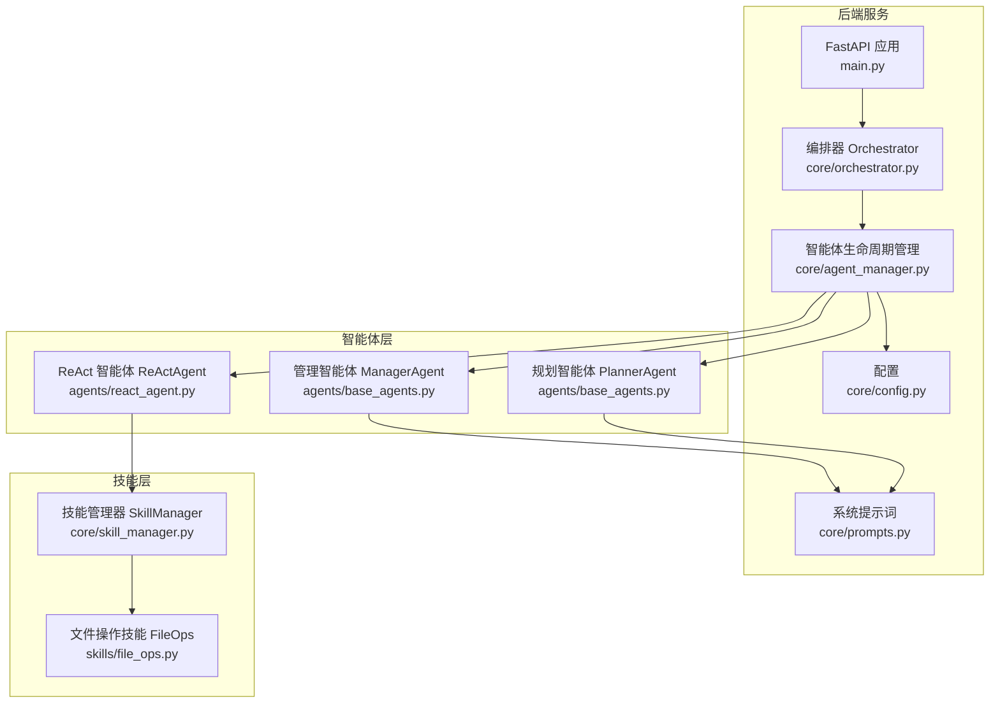
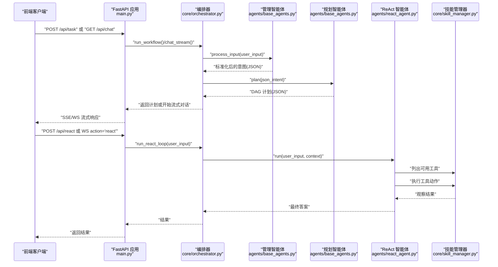
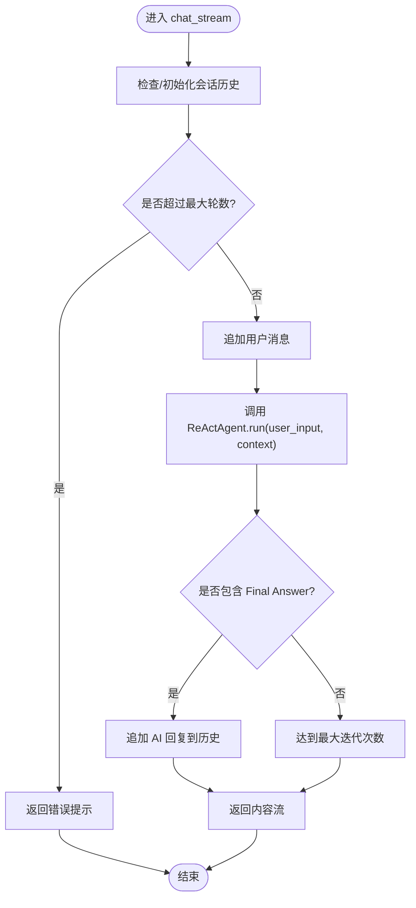
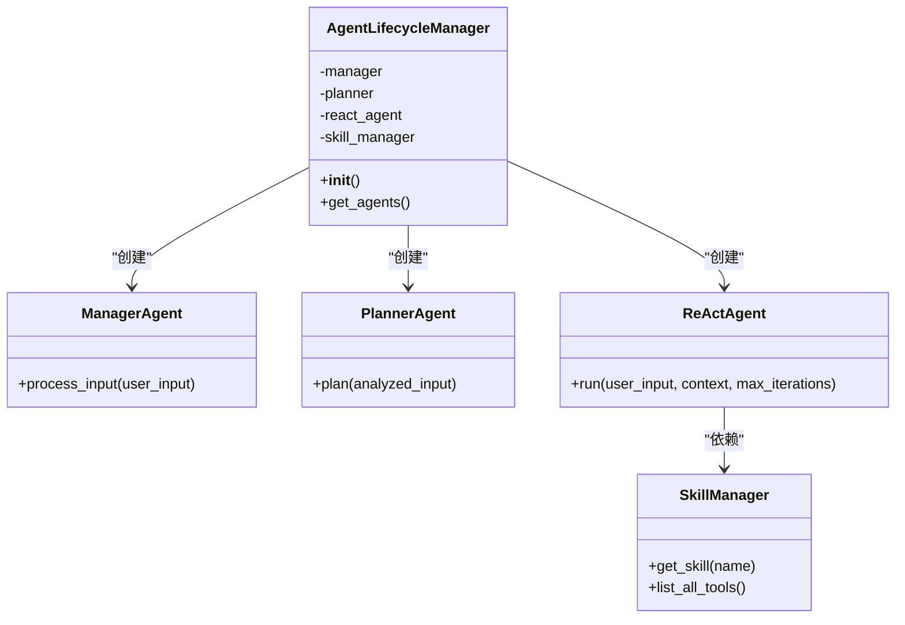
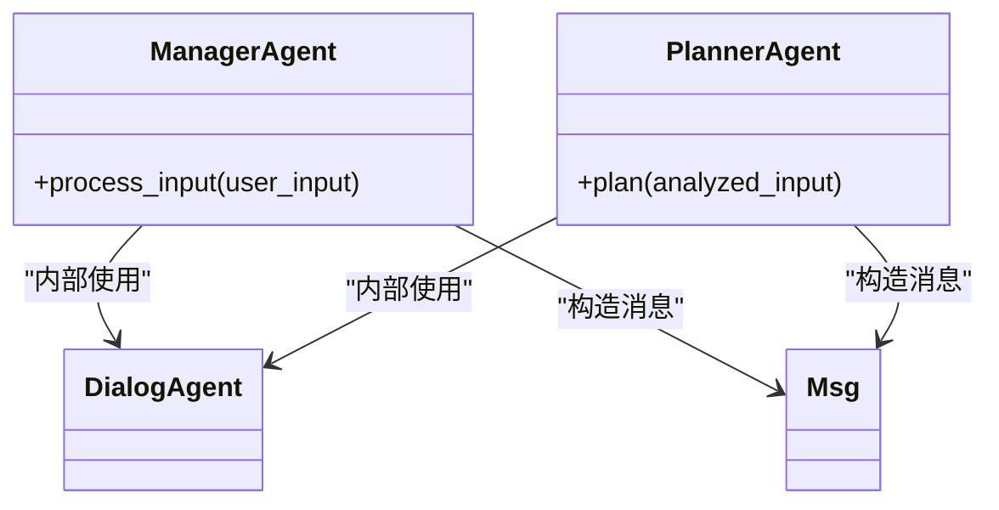
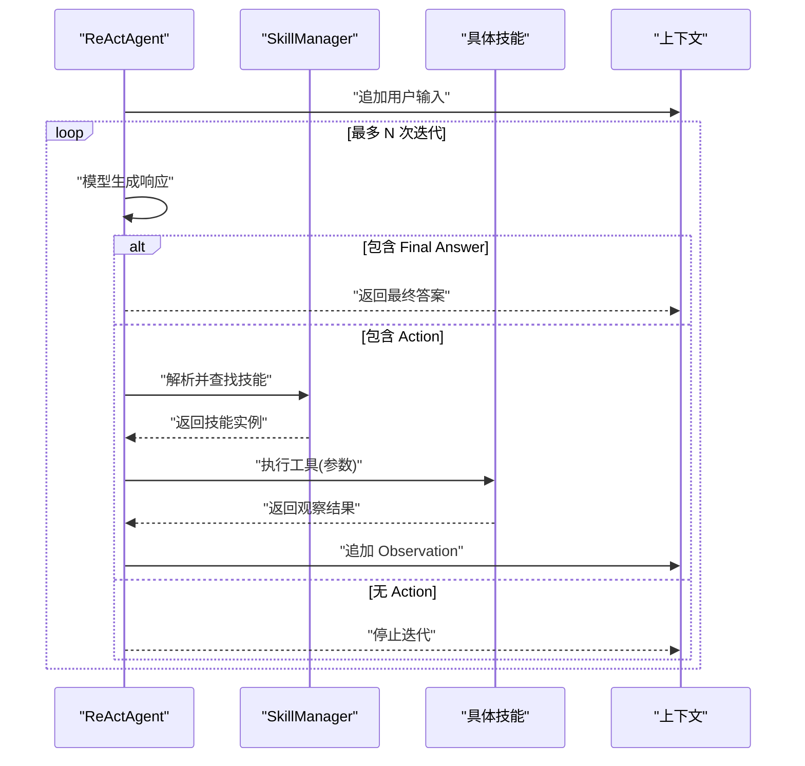
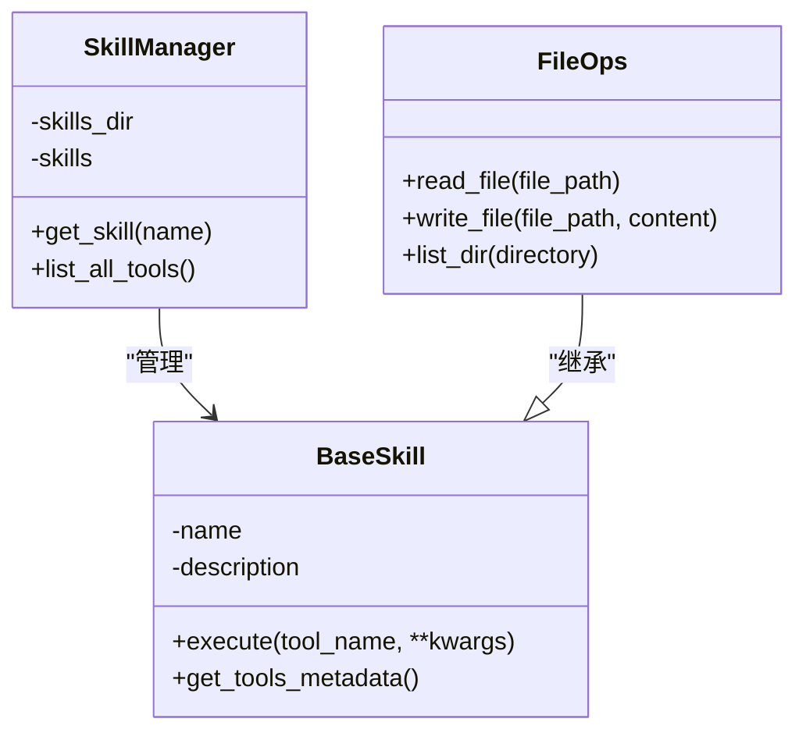
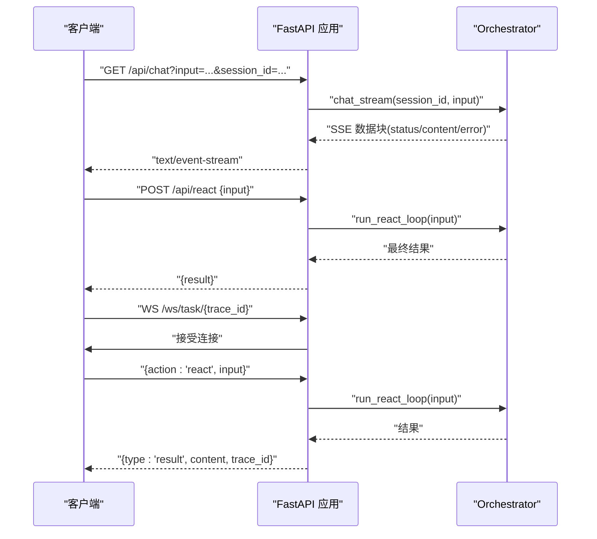
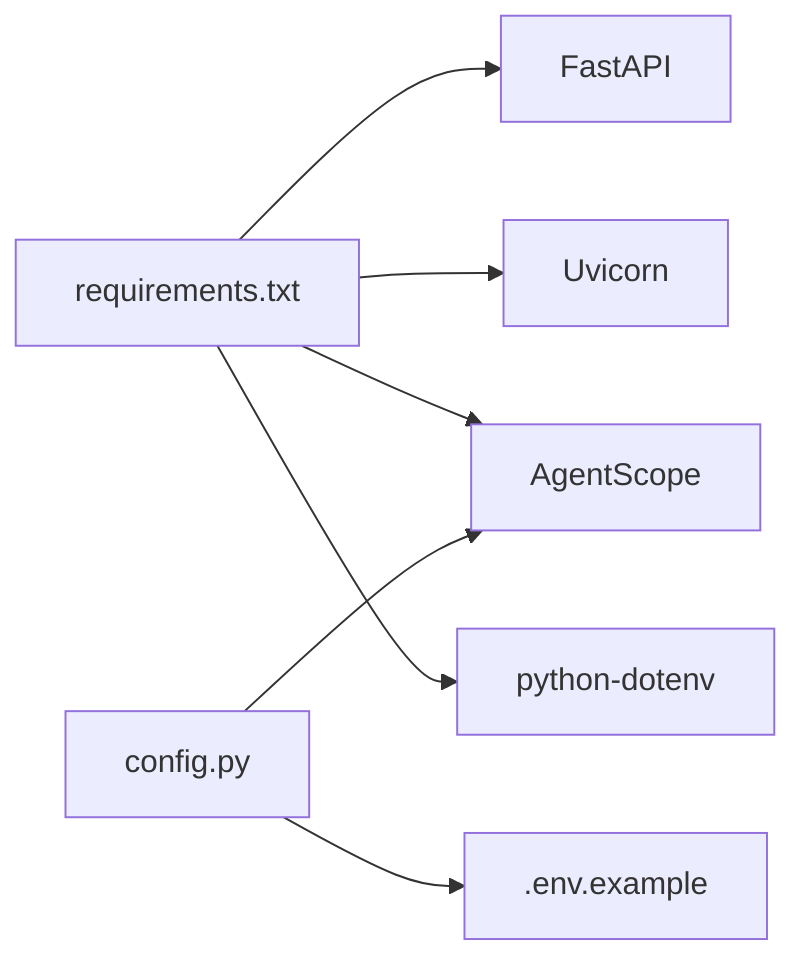

# 智能体系统

<cite>
**本文引用的文件列表**
- [main.py](file://localmanus-backend/main.py)
- [orchestrator.py](file://localmanus-backend/core/orchestrator.py)
- [agent_manager.py](file://localmanus-backend/core/agent_manager.py)
- [base_agents.py](file://localmanus-backend/agents/base_agents.py)
- [react_agent.py](file://localmanus-backend/agents/react_agent.py)
- [skill_manager.py](file://localmanus-backend/core/skill_manager.py)
- [prompts.py](file://localmanus-backend/core/prompts.py)
- [config.py](file://localmanus-backend/core/config.py)
- [file_ops.py](file://localmanus-backend/skills/file_ops.py)
- [test_orchestration.py](file://localmanus-backend/scripts/test_orchestration.py)
- [requirements.txt](file://localmanus-backend/requirements.txt)
- [.env.example](file://localmanus-backend/.env.example)
</cite>

## 目录
1. [简介](#简介)
2. [项目结构](#项目结构)
3. [核心组件](#核心组件)
4. [架构总览](#架构总览)
5. [详细组件分析](#详细组件分析)
6. [依赖关系分析](#依赖关系分析)
7. [性能考量](#性能考量)
8. [故障排查指南](#故障排查指南)
9. [结论](#结论)
10. [附录](#附录)

## 简介
本技术文档面向 LocalManus 智能体系统，围绕基于 AgentScope 的多智能体协作机制进行深入解析，涵盖以下主题：
- 管理智能体的意图分析流程
- 规划智能体的任务规划与 DAG 生成
- ReAct 智能体的推理行动循环（Thought/Action/Observation）
- 智能体生命周期管理、消息传递协议、状态同步机制
- 智能体间协调策略、冲突解决与动态调度思路
- 智能体开发规范、扩展接口与测试方法
- 实际使用模式与代码示例路径

## 项目结构
后端采用 FastAPI 提供 API 网关，核心编排由 Orchestrator 协调三个基础智能体：Manager、Planner、ReActAgent；技能通过 SkillManager 动态加载，支持可插拔扩展。

图表来源
- [main.py](file://localmanus-backend/main.py#L1-L95)
- [orchestrator.py](file://localmanus-backend/core/orchestrator.py#L1-L118)
- [agent_manager.py](file://localmanus-backend/core/agent_manager.py#L1-L31)
- [base_agents.py](file://localmanus-backend/agents/base_agents.py#L1-L41)
- [react_agent.py](file://localmanus-backend/agents/react_agent.py#L1-L104)
- [skill_manager.py](file://localmanus-backend/core/skill_manager.py#L1-L84)
- [prompts.py](file://localmanus-backend/core/prompts.py#L1-L53)
- [config.py](file://localmanus-backend/core/config.py#L1-L21)
- [file_ops.py](file://localmanus-backend/skills/file_ops.py#L1-L41)

章节来源
- [main.py](file://localmanus-backend/main.py#L1-L95)
- [config.py](file://localmanus-backend/core/config.py#L1-L21)

## 核心组件
- 编排器 Orchestrator：负责会话历史管理、意图分析、任务规划、ReAct 循环执行与结果输出。
- 智能体生命周期管理 AgentLifecycleManager：初始化 AgentScope、构建 Manager/Planner/ReActAgent，并注入 SkillManager。
- 基础智能体 ManagerAgent/PlannerAgent：分别承担输入标准化与任务分解职责。
- ReActAgent：实现 ReAct 推理行动循环，解析并执行工具动作，产出最终答案。
- SkillManager：动态扫描 skills 目录，注册技能与工具元数据，提供工具执行能力。
- 文件操作技能 FileOps：示例技能，提供读写文件与目录列举等基础能力。

章节来源
- [orchestrator.py](file://localmanus-backend/core/orchestrator.py#L1-L118)
- [agent_manager.py](file://localmanus-backend/core/agent_manager.py#L1-L31)
- [base_agents.py](file://localmanus-backend/agents/base_agents.py#L1-L41)
- [react_agent.py](file://localmanus-backend/agents/react_agent.py#L1-L104)
- [skill_manager.py](file://localmanus-backend/core/skill_manager.py#L1-L84)
- [file_ops.py](file://localmanus-backend/skills/file_ops.py#L1-L41)

## 架构总览
LocalManus 采用“入口管理—意图分析—任务规划—执行回路”的分层架构。前端通过 SSE 或 WebSocket 与后端交互，后端通过 Orchestrator 协调各智能体完成端到端工作流。

图表来源
- [main.py](file://localmanus-backend/main.py#L30-L91)
- [orchestrator.py](file://localmanus-backend/core/orchestrator.py#L65-L80)
- [base_agents.py](file://localmanus-backend/agents/base_agents.py#L11-L39)
- [react_agent.py](file://localmanus-backend/agents/react_agent.py#L49-L103)
- [skill_manager.py](file://localmanus-backend/core/skill_manager.py#L75-L83)

## 详细组件分析

### 编排器 Orchestrator
- 会话管理：维护每个 session_id 的消息历史，限制最大轮数，避免无限增长。
- 意图分析：调用 ManagerAgent 处理用户输入，提取 JSON 结构化意图。
- 任务规划：调用 PlannerAgent 生成 DAG 计划，并注入 trace_id。
- ReAct 循环：封装 ReActAgent 的推理行动循环，支持传入上下文历史。
- JSON 解析：从模型输出中提取 JSON 块，增强鲁棒性。

图表来源
- [orchestrator.py](file://localmanus-backend/core/orchestrator.py#L13-L63)

章节来源
- [orchestrator.py](file://localmanus-backend/core/orchestrator.py#L1-L118)

### 智能体生命周期管理 AgentLifecycleManager
- 初始化 AgentScope：加载模型配置，支持本地或远程大模型。
- 构建核心智能体：ManagerAgent、PlannerAgent、ReActAgent。
- 注入技能管理：向 ReActAgent 注入 SkillManager，使其具备工具执行能力。

图表来源
- [agent_manager.py](file://localmanus-backend/core/agent_manager.py#L7-L21)
- [react_agent.py](file://localmanus-backend/agents/react_agent.py#L32-L40)
- [skill_manager.py](file://localmanus-backend/core/skill_manager.py#L42-L83)

章节来源
- [agent_manager.py](file://localmanus-backend/core/agent_manager.py#L1-L31)

### 基础智能体 ManagerAgent 与 PlannerAgent
- ManagerAgent：接收用户输入，按系统提示词进行标准化处理，输出结构化意图。
- PlannerAgent：接收标准化意图，生成任务 DAG，包含步骤、依赖与参数映射。

图表来源
- [base_agents.py](file://localmanus-backend/agents/base_agents.py#L6-L39)
- [prompts.py](file://localmanus-backend/core/prompts.py#L3-L52)

章节来源
- [base_agents.py](file://localmanus-backend/agents/base_agents.py#L1-L41)
- [prompts.py](file://localmanus-backend/core/prompts.py#L1-L53)

### ReAct 智能体 ReActAgent
- 系统提示词：定义 ReAct 框架格式、可用工具列表与输出规范。
- 工具元数据：从 SkillManager 获取所有可用工具的描述与签名。
- 推理行动循环：交替进行思考、行动与观察，直至出现 Final Answer。
- 动作执行：解析 Action 行，调用对应技能工具，将结果作为 Observation 追加到上下文。

图表来源
- [react_agent.py](file://localmanus-backend/agents/react_agent.py#L49-L103)
- [skill_manager.py](file://localmanus-backend/core/skill_manager.py#L72-L83)

章节来源
- [react_agent.py](file://localmanus-backend/agents/react_agent.py#L1-L104)

### 技能管理器 SkillManager 与文件操作技能 FileOps
- SkillManager：动态扫描 skills 目录，自动发现并注册技能类，提供工具元数据查询与执行路由。
- BaseSkill：统一技能接口，要求实现工具方法，支持异步/同步方法自动识别。
- FileOps：示例技能，提供读取、写入、列出目录等基础文件操作。

图表来源
- [skill_manager.py](file://localmanus-backend/core/skill_manager.py#L6-L83)
- [file_ops.py](file://localmanus-backend/skills/file_ops.py#L4-L41)

章节来源
- [skill_manager.py](file://localmanus-backend/core/skill_manager.py#L1-L84)
- [file_ops.py](file://localmanus-backend/skills/file_ops.py#L1-L41)

### API 网关与消息协议
- SSE 对话流：/api/chat 返回事件流，支持状态与内容分片。
- 同步任务规划：/api/task 返回 DAG 计划。
- ReAct 同步执行：/api/react 直接返回最终结果。
- WebSocket：/ws/task/{trace_id} 支持交互式 ReAct 循环，发送 thought/result 类型消息。

图表来源
- [main.py](file://localmanus-backend/main.py#L30-L91)
- [orchestrator.py](file://localmanus-backend/core/orchestrator.py#L13-L63)

章节来源
- [main.py](file://localmanus-backend/main.py#L1-L95)

## 依赖关系分析
- 外部依赖：FastAPI、Uvicorn、AgentScope、Python-Dotenv、Pydantic、Websockets。
- 环境变量：OPENAI_API_KEY、OPENAI_API_BASE、MODEL_NAME。
- AgentScope 初始化：通过配置文件中的模型配置启动本地或远程大模型。

图表来源
- [requirements.txt](file://localmanus-backend/requirements.txt#L1-L8)
- [config.py](file://localmanus-backend/core/config.py#L1-L21)
- [.env.example](file://localmanus-backend/.env.example#L1-L4)

章节来源
- [requirements.txt](file://localmanus-backend/requirements.txt#L1-L8)
- [config.py](file://localmanus-backend/core/config.py#L1-L21)
- [.env.example](file://localmanus-backend/.env.example#L1-L4)

## 性能考量
- 会话轮次限制：防止历史过长导致上下文膨胀与延迟增加。
- ReAct 迭代上限：避免长时间循环，提升系统稳定性。
- 工具执行异步化：SkillManager 支持异步工具方法，减少阻塞。
- 模型配置优化：通过 config.py 配置本地或远程模型，平衡延迟与质量。
- SSE/WS 流式输出：提升用户体验，降低首字节延迟。

[本节为通用指导，无需特定文件来源]

## 故障排查指南
- API 未返回结果或报错
  - 检查 OPENAI_API_KEY 是否正确设置，或本地模型服务是否可用。
  - 查看 Orchestrator 的 JSON 提取逻辑是否能正确解析模型输出。
- ReAct 循环卡住
  - 检查 Action 行是否符合格式，参数是否正确解析。
  - 确认技能名称与工具名称是否存在，工具参数是否匹配。
- 技能未被识别
  - 确认技能类位于 skills 目录且继承 BaseSkill。
  - 检查技能类名与工具方法名是否符合命名约定。
- 会话历史异常
  - 确认 session_id 一致，最大轮次限制是否触发。

章节来源
- [config.py](file://localmanus-backend/core/config.py#L1-L21)
- [orchestrator.py](file://localmanus-backend/core/orchestrator.py#L82-L96)
- [react_agent.py](file://localmanus-backend/agents/react_agent.py#L73-L98)
- [skill_manager.py](file://localmanus-backend/core/skill_manager.py#L48-L71)

## 结论
LocalManus 通过清晰的分层设计与 AgentScope 集成，实现了从意图分析到任务规划再到 ReAct 执行的完整闭环。其可插拔的技能体系与灵活的消息协议，为后续扩展与集成提供了良好基础。建议在生产环境中进一步完善工具参数解析、错误恢复与可观测性。

[本节为总结性内容，无需特定文件来源]

## 附录

### 使用模式与示例路径
- 启动后端服务
  - 参考路径：[main.py](file://localmanus-backend/main.py#L92-L95)
- 发起任务规划
  - 参考路径：[main.py](file://localmanus-backend/main.py#L40-L47)，[orchestrator.py](file://localmanus-backend/core/orchestrator.py#L65-L80)
- 发起 ReAct 循环
  - 参考路径：[main.py](file://localmanus-backend/main.py#L49-L56)，[orchestrator.py](file://localmanus-backend/core/orchestrator.py#L13-L63)，[react_agent.py](file://localmanus-backend/agents/react_agent.py#L49-L103)
- 测试编排流程
  - 参考路径：[test_orchestration.py](file://localmanus-backend/scripts/test_orchestration.py#L12-L56)

### 开发规范与扩展接口
- 新增技能
  - 在 skills 目录下新增 Python 文件，定义继承 BaseSkill 的类，实现工具方法。
  - 参考路径：[skill_manager.py](file://localmanus-backend/core/skill_manager.py#L6-L41)，[file_ops.py](file://localmanus-backend/skills/file_ops.py#L4-L41)
- 自定义系统提示词
  - 修改 prompts.py 中的系统提示词模板。
  - 参考路径：[prompts.py](file://localmanus-backend/core/prompts.py#L3-L52)
- 自定义模型配置
  - 在 config.py 中添加或修改模型配置。
  - 参考路径：[config.py](file://localmanus-backend/core/config.py#L8-L16)
- 扩展编排器
  - 在 Orchestrator 中增加新的阶段或中间件，保持会话历史与 trace_id 的一致性。
  - 参考路径：[orchestrator.py](file://localmanus-backend/core/orchestrator.py#L1-L118)

### 测试方法
- 单元测试
  - 对 ManagerAgent/PlannerAgent 的输入输出进行断言。
  - 对 ReActAgent 的 Action 解析与工具执行进行模拟。
- 集成测试
  - 使用 test_orchestration.py 演示端到端流程。
  - 参考路径：[test_orchestration.py](file://localmanus-backend/scripts/test_orchestration.py#L12-L56)
- 性能测试
  - 通过 WebSocket/SSERequest 对不同轮次与工具复杂度进行压测。

章节来源
- [test_orchestration.py](file://localmanus-backend/scripts/test_orchestration.py#L1-L57)