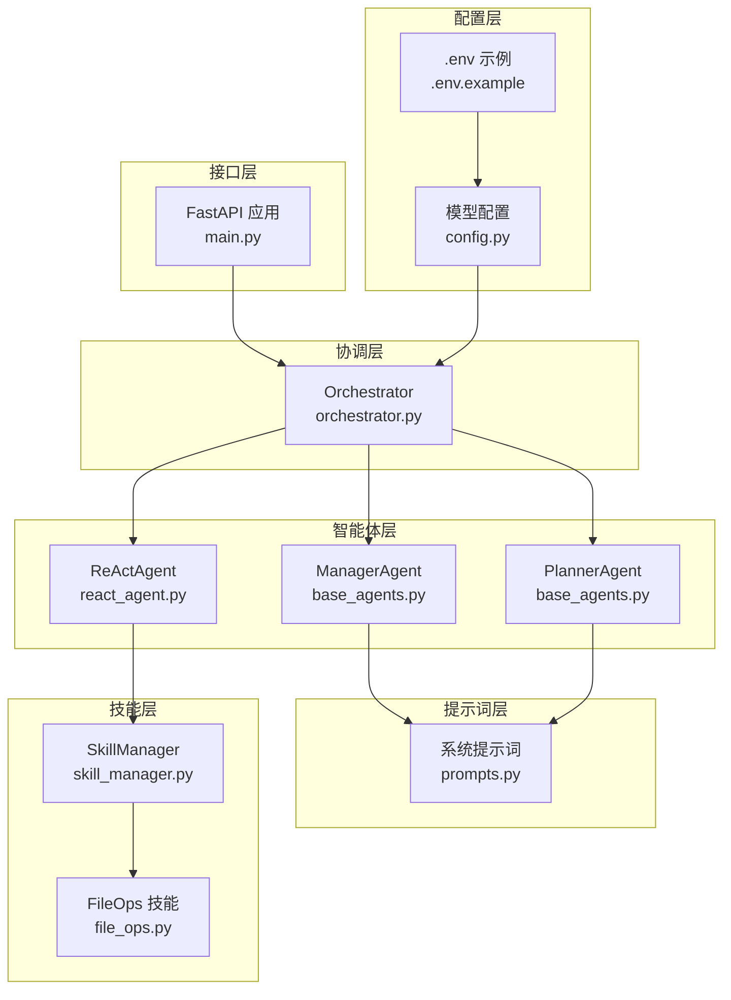
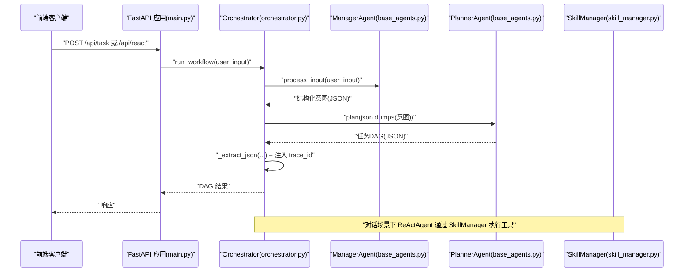
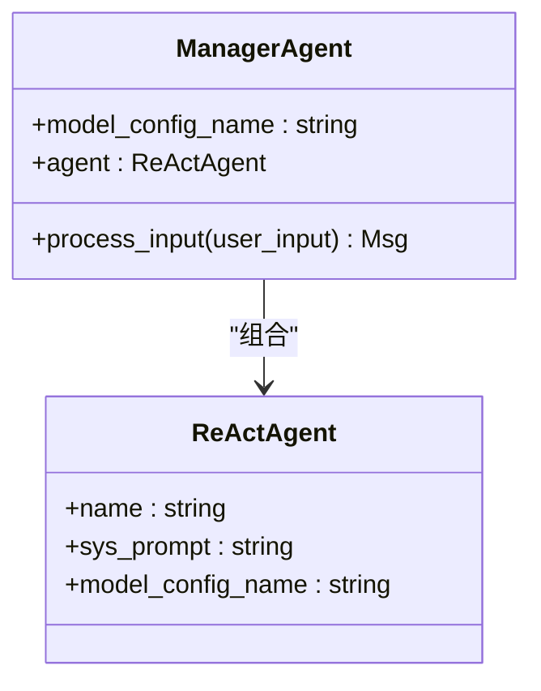
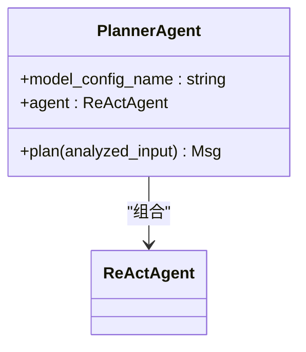
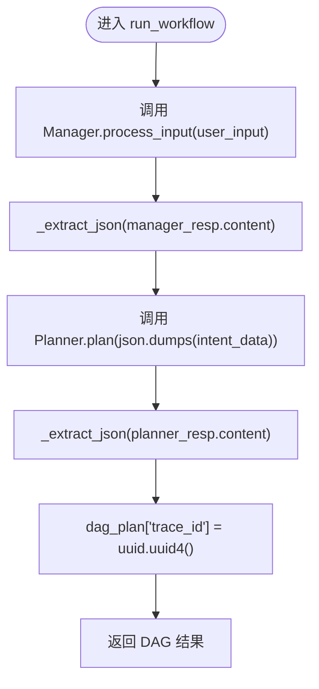
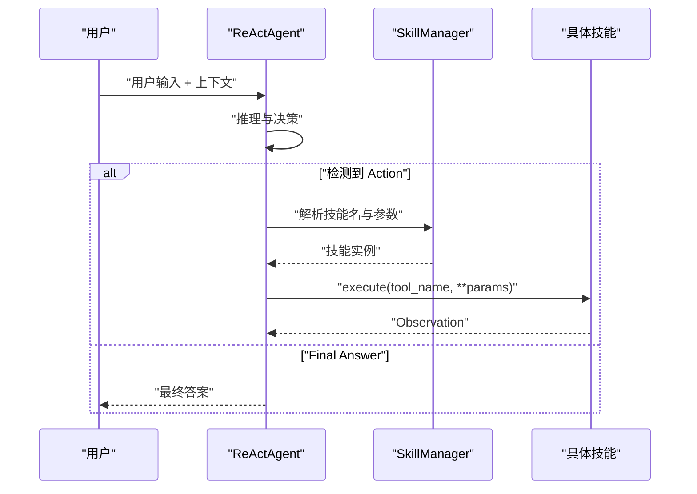
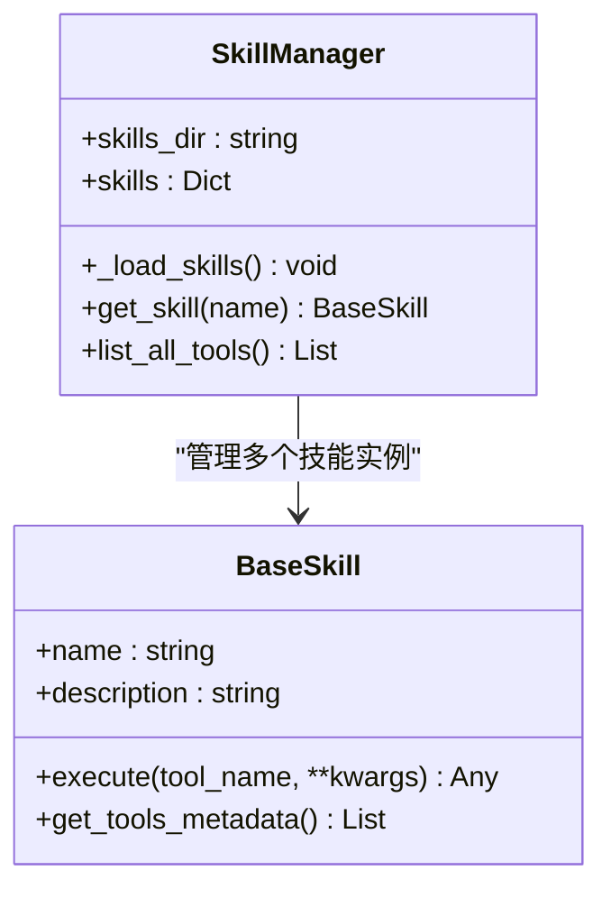
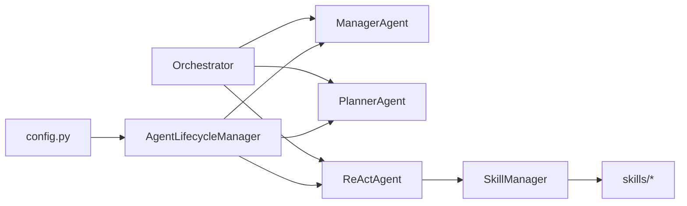

# 管理智能体

<cite>
**本文引用的文件列表**
- [main.py](file://localmanus-backend/main.py)
- [base_agents.py](file://localmanus-backend/agents/base_agents.py)
- [react_agent.py](file://localmanus-backend/agents/react_agent.py)
- [orchestrator.py](file://localmanus-backend/core/orchestrator.py)
- [prompts.py](file://localmanus-backend/core/prompts.py)
- [agent_manager.py](file://localmanus-backend/core/agent_manager.py)
- [config.py](file://localmanus-backend/core/config.py)
- [skill_manager.py](file://localmanus-backend/core/skill_manager.py)
- [file_ops.py](file://localmanus-backend/skills/file_ops.py)
- [.env.example](file://localmanus-backend/.env.example)
- [test_orchestration.py](file://localmanus-backend/scripts/test_orchestration.py)
</cite>

## 目录
1. [简介](#简介)
2. [项目结构](#项目结构)
3. [核心组件](#核心组件)
4. [架构总览](#架构总览)
5. [详细组件分析](#详细组件分析)
6. [依赖关系分析](#依赖关系分析)
7. [性能与可扩展性](#性能与可扩展性)
8. [故障排查指南](#故障排查指南)
9. [结论](#结论)
10. [附录](#附录)

## 简介
本文件聚焦于 LocalManus 系统中的“管理智能体”（ManagerAgent），其核心职责包括：
- 标准化用户输入，生成可被后续智能体使用的结构化意图数据
- 维护会话上下文与 TraceID，确保跨模块一致的追踪能力
- 作为系统入口点，协调对话与任务规划流程

我们将从系统架构、组件职责、数据流、配置参数、消息处理流程、JSON 解析与错误处理等方面进行深入解析，并通过时序图与类图帮助读者建立清晰的认知。

## 项目结构
后端采用分层组织方式：
- 接口层：FastAPI 应用，提供 REST 与 WebSocket 入口
- 协调层：Orchestrator 负责编排 Manager、Planner、ReActAgent
- 智能体层：ManagerAgent、PlannerAgent、ReActAgent
- 提示词层：系统提示词模板
- 配置层：模型与服务配置
- 技能层：动态加载的工具集合

图表来源
- [main.py](file://localmanus-backend/main.py#L1-L95)
- [orchestrator.py](file://localmanus-backend/core/orchestrator.py#L1-L118)
- [base_agents.py](file://localmanus-backend/agents/base_agents.py#L1-L40)
- [react_agent.py](file://localmanus-backend/agents/react_agent.py#L1-L107)
- [prompts.py](file://localmanus-backend/core/prompts.py#L1-L53)
- [config.py](file://localmanus-backend/core/config.py#L1-L20)
- [skill_manager.py](file://localmanus-backend/core/skill_manager.py#L1-L84)
- [file_ops.py](file://localmanus-backend/skills/file_ops.py#L1-L41)
- [.env.example](file://localmanus-backend/.env.example#L1-L3)

章节来源
- [main.py](file://localmanus-backend/main.py#L1-L95)
- [orchestrator.py](file://localmanus-backend/core/orchestrator.py#L1-L118)
- [base_agents.py](file://localmanus-backend/agents/base_agents.py#L1-L40)
- [prompts.py](file://localmanus-backend/core/prompts.py#L1-L53)
- [config.py](file://localmanus-backend/core/config.py#L1-L20)

## 核心组件
- 管理智能体（ManagerAgent）
  - 职责：标准化用户输入，输出结构化意图数据；作为系统入口点，承接前端请求并为后续 Planner 与 ReActAgent 提供上下文
  - 关键方法：process_input
  - 配置参数：model_config_name（来自模型配置）
  - 系统提示词：MANAGER_SYSTEM_PROMPT
- 规划智能体（PlannerAgent）
  - 职责：基于 Manager 的意图数据生成动态任务 DAG（含步骤、依赖、参数）
  - 关键方法：plan
  - 系统提示词：PLANNER_SYSTEM_PROMPT
- 协调器（Orchestrator）
  - 职责：编排 Manager 与 Planner 的工作流；维护会话历史；生成 TraceID；封装 JSON 提取与错误处理
  - 关键方法：run_workflow、chat_stream、_extract_json
- ReAct 智能体（ReActAgent）
  - 职责：执行工具链路，按 Thought/Action/Observation 循环推进，最终给出 Final Answer
  - 关键方法：run
  - 工具元数据：由 SkillManager 动态注入
- 技能管理（SkillManager）
  - 职责：动态发现与加载技能模块，提供工具元数据
  - 关键方法：list_all_tools、get_skill
- 配置与环境
  - 模型配置：AGENT_MODEL_CONFIGS
  - 环境变量：OPENAI_API_KEY、OPENAI_API_BASE、MODEL_NAME

章节来源
- [base_agents.py](file://localmanus-backend/agents/base_agents.py#L1-L40)
- [prompts.py](file://localmanus-backend/core/prompts.py#L1-L53)
- [orchestrator.py](file://localmanus-backend/core/orchestrator.py#L1-L118)
- [react_agent.py](file://localmanus-backend/agents/react_agent.py#L1-L107)
- [skill_manager.py](file://localmanus-backend/core/skill_manager.py#L1-L84)
- [config.py](file://localmanus-backend/core/config.py#L1-L20)

## 架构总览
管理智能体在系统中扮演“入口与标准化”的角色，典型工作流如下：
- 前端通过 REST 或 WebSocket 发起请求
- 接口层将请求交由 Orchestrator 处理
- Orchestrator 调用 ManagerAgent 对用户输入进行标准化
- Manager 输出结构化意图数据，随后 Planner 生成任务 DAG
- Orchestrator 为 DAG 注入 TraceID 并返回给调用方
- 对话场景下，Orchestrator 使用 ReActAgent 执行工具链路并返回结果

图表来源
- [main.py](file://localmanus-backend/main.py#L40-L56)
- [orchestrator.py](file://localmanus-backend/core/orchestrator.py#L65-L80)
- [base_agents.py](file://localmanus-backend/agents/base_agents.py#L18-L21)
- [skill_manager.py](file://localmanus-backend/core/skill_manager.py#L75-L83)

## 详细组件分析

### 管理智能体（ManagerAgent）
- 角色定位
  - 系统入口点，负责将原始用户输入标准化为结构化意图数据
  - 为 Planner 提供上下文与实体信息
- 配置参数
  - model_config_name：用于初始化底层 ReActAgent 的模型配置名称
- 系统提示词
  - MANAGER_SYSTEM_PROMPT：定义输出格式（intent、entities、context）
- 核心方法
  - process_input(user_input): 将字符串输入封装为 Msg，调用 ReActAgent 并返回响应
- 数据结构
  - 输入：原始用户文本
  - 输出：符合系统提示词格式的结构化 JSON（由 Orchestrator 进一步提取）

图表来源
- [base_agents.py](file://localmanus-backend/agents/base_agents.py#L6-L21)

章节来源
- [base_agents.py](file://localmanus-backend/agents/base_agents.py#L6-L21)
- [prompts.py](file://localmanus-backend/core/prompts.py#L3-L16)

### 规划智能体（PlannerAgent）
- 角色定位
  - 基于 Manager 的意图数据生成动态任务 DAG，包含步骤、依赖与参数
- 配置参数
  - model_config_name：同上
- 系统提示词
  - PLANNER_SYSTEM_PROMPT：定义可用技能与输出格式（trace_id、plan 列表）
- 核心方法
  - plan(analyzed_input): 将结构化意图封装为 Msg，调用 ReActAgent 并返回响应

图表来源
- [base_agents.py](file://localmanus-backend/agents/base_agents.py#L23-L38)
- [prompts.py](file://localmanus-backend/core/prompts.py#L18-L52)

章节来源
- [base_agents.py](file://localmanus-backend/agents/base_agents.py#L23-L38)
- [prompts.py](file://localmanus-backend/core/prompts.py#L18-L52)

### 协调器（Orchestrator）
- 会话管理
  - sessions: 以 session_id 为键存储历史消息列表（Msg）
  - 支持多轮对话，限制最大轮数（默认 10 轮）
- 工作流编排
  - run_workflow(user_input): 调用 Manager -> Planner -> 注入 trace_id
  - chat_stream(session_id, user_input): 对话流式处理，支持状态与错误事件
- JSON 解析与错误处理
  - _extract_json(text): 提取 Markdown 包裹的 JSON 或纯文本 JSON，异常时返回包含 raw 的字典
- TraceID 维护
  - 在 DAG 中注入唯一 trace_id，便于跨模块追踪

图表来源
- [orchestrator.py](file://localmanus-backend/core/orchestrator.py#L65-L80)
- [orchestrator.py](file://localmanus-backend/core/orchestrator.py#L82-L96)

章节来源
- [orchestrator.py](file://localmanus-backend/core/orchestrator.py#L8-L118)

### ReAct 智能体（ReActAgent）
- 工具链路
  - 通过 SkillManager 获取工具元数据，动态注入到系统提示词
  - 在循环中根据 Action 行解析技能名与参数，执行对应工具并记录 Observation
- 错误处理
  - 工具执行异常时记录日志并注入错误观察值
- 最终答案
  - 当内容包含 Final Answer 时，截取并返回

图表来源
- [react_agent.py](file://localmanus-backend/agents/react_agent.py#L52-L106)
- [skill_manager.py](file://localmanus-backend/core/skill_manager.py#L75-L83)

章节来源
- [react_agent.py](file://localmanus-backend/agents/react_agent.py#L32-L106)
- [skill_manager.py](file://localmanus-backend/core/skill_manager.py#L42-L83)

### 技能管理（SkillManager）
- 动态加载
  - 遍历 skills 目录，导入模块并实例化继承自 BaseSkill 的类
- 工具元数据
  - list_all_tools(): 汇总所有技能的工具签名与描述，供 ReActAgent 注入提示词
- 执行路由
  - execute(tool_name, **kwargs): 反射调用具体工具方法（支持协程）

图表来源
- [skill_manager.py](file://localmanus-backend/core/skill_manager.py#L42-L83)
- [file_ops.py](file://localmanus-backend/skills/file_ops.py#L4-L41)

章节来源
- [skill_manager.py](file://localmanus-backend/core/skill_manager.py#L1-L84)
- [file_ops.py](file://localmanus-backend/skills/file_ops.py#L1-L41)

### 配置与环境
- 模型配置
  - AGENT_MODEL_CONFIGS：包含 config_name、model_type、model_name、api_key、base_url
  - 通过 .env 文件覆盖默认值
- 环境变量
  - OPENAI_API_KEY、OPENAI_API_BASE、MODEL_NAME

章节来源
- [config.py](file://localmanus-backend/core/config.py#L1-L20)
- [.env.example](file://localmanus-backend/.env.example#L1-L3)

## 依赖关系分析
- 组件耦合
  - Orchestrator 依赖 ManagerAgent、PlannerAgent、ReActAgent
  - ReActAgent 依赖 SkillManager，SkillManager 依赖 skills 目录下的具体技能
  - AgentLifecycleManager 负责初始化 AgentScope 与 Agent 实例
- 外部依赖
  - AgentScope 框架、OpenAI 兼容的 LLM 服务
  - FastAPI、WebSocket、SSE

图表来源
- [agent_manager.py](file://localmanus-backend/core/agent_manager.py#L1-L31)
- [orchestrator.py](file://localmanus-backend/core/orchestrator.py#L1-L118)
- [react_agent.py](file://localmanus-backend/agents/react_agent.py#L1-L107)
- [skill_manager.py](file://localmanus-backend/core/skill_manager.py#L1-L84)
- [config.py](file://localmanus-backend/core/config.py#L1-L20)

章节来源
- [agent_manager.py](file://localmanus-backend/core/agent_manager.py#L1-L31)
- [orchestrator.py](file://localmanus-backend/core/orchestrator.py#L1-L118)

## 性能与可扩展性
- JSON 解析健壮性
  - _extract_json 支持 Markdown 包裹的 JSON 与纯 JSON，异常时返回包含原始文本的字典，便于调试
- 会话轮次限制
  - 默认最多 10 轮对话，避免上下文过长导致性能下降
- 工具链路优化
  - 建议在 Action 解析阶段引入更安全的参数解析（如正则或 ast.literal_eval），替代 eval
- 日志与可观测性
  - ReActAgent 对每轮迭代进行日志记录，便于问题定位

章节来源
- [orchestrator.py](file://localmanus-backend/core/orchestrator.py#L82-L96)
- [react_agent.py](file://localmanus-backend/agents/react_agent.py#L76-L84)

## 故障排查指南
- API 未配置密钥
  - 现象：AgentScope 初始化失败或调用报错
  - 处理：设置 OPENAI_API_KEY、OPENAI_API_BASE、MODEL_NAME
- JSON 解析失败
  - 现象：_extract_json 返回包含 raw 的字典
  - 处理：检查 Manager/Planner 输出是否符合系统提示词格式
- 工具执行异常
  - 现象：Observation 包含错误信息
  - 处理：确认技能名与参数正确，检查技能实现
- 会话超限
  - 现象：chat_stream 返回错误事件
  - 处理：清理会话或增加轮次上限

章节来源
- [.env.example](file://localmanus-backend/.env.example#L1-L3)
- [orchestrator.py](file://localmanus-backend/core/orchestrator.py#L22-L25)
- [react_agent.py](file://localmanus-backend/agents/react_agent.py#L97-L101)

## 结论
管理智能体（ManagerAgent）在 LocalManus 中承担“入口与标准化”的关键职责，通过结构化的系统提示词与 Orchestrator 的编排，为 Planner 与 ReActAgent 提供高质量的输入与上下文。其设计强调：
- 明确的职责边界与清晰的数据契约
- 可扩展的技能体系与动态工具注入
- 完备的错误处理与可观测性
- 会话追踪与 TraceID 的一致性保障

## 附录
- 实际代码示例路径
  - ManagerAgent.process_input: [base_agents.py](file://localmanus-backend/agents/base_agents.py#L18-L21)
  - Orchestrator.run_workflow: [orchestrator.py](file://localmanus-backend/core/orchestrator.py#L65-L80)
  - Orchestrator._extract_json: [orchestrator.py](file://localmanus-backend/core/orchestrator.py#L82-L96)
  - ReActAgent.run: [react_agent.py](file://localmanus-backend/agents/react_agent.py#L52-L106)
  - SkillManager.list_all_tools: [skill_manager.py](file://localmanus-backend/core/skill_manager.py#L75-L83)
  - 测试脚本演示：[test_orchestration.py](file://localmanus-backend/scripts/test_orchestration.py#L12-L50)