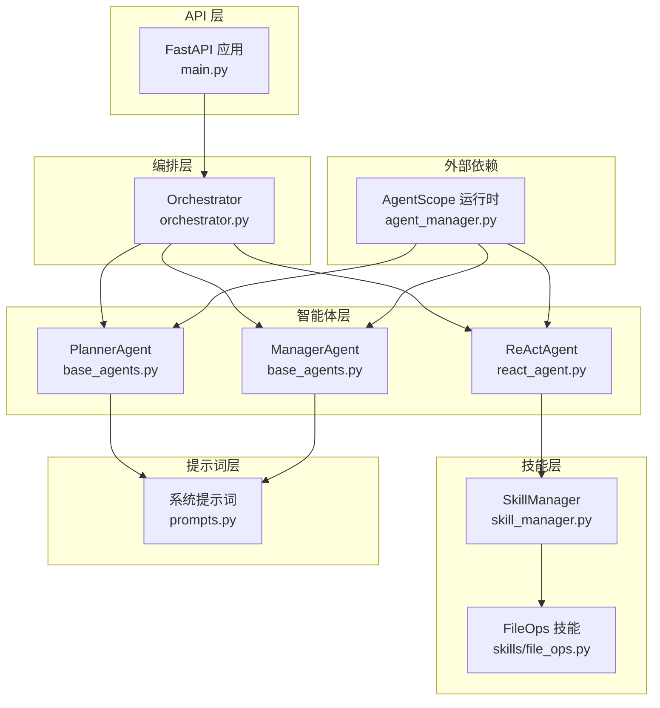
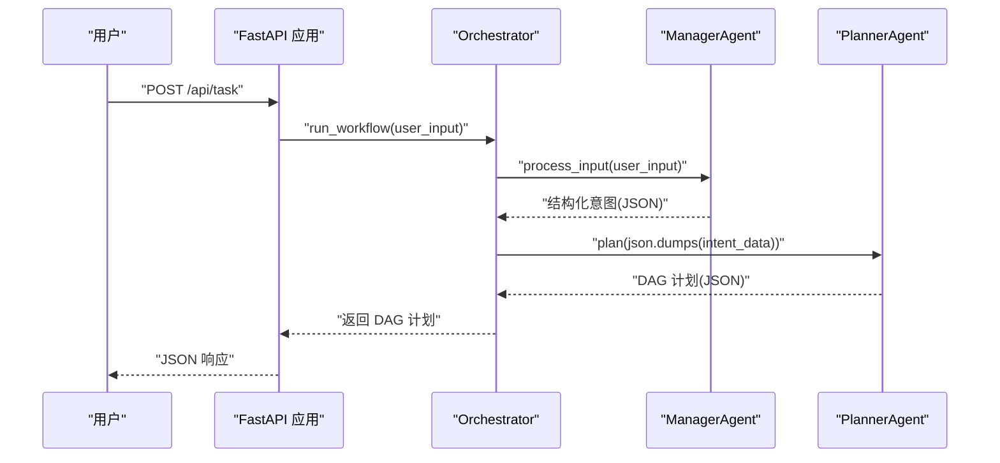
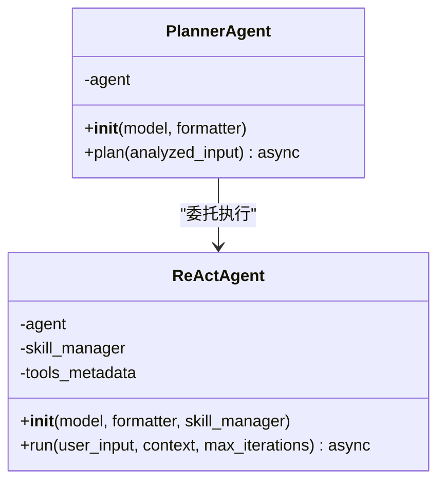
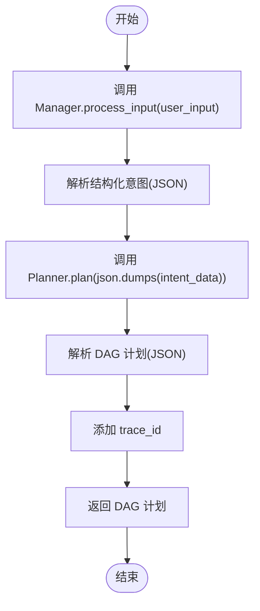
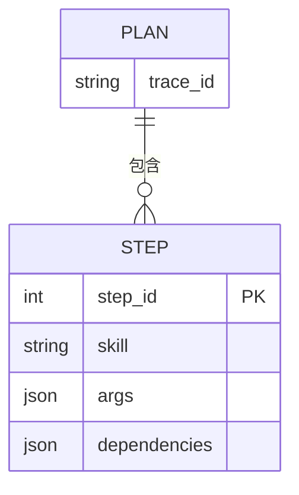
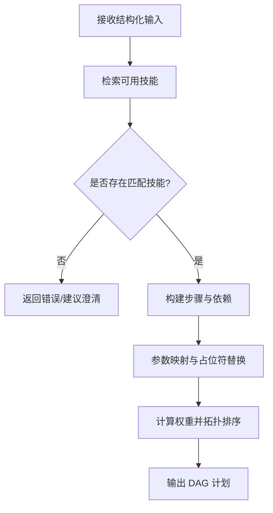
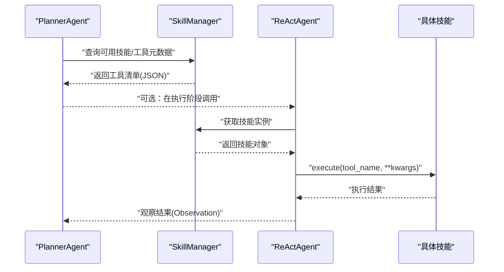
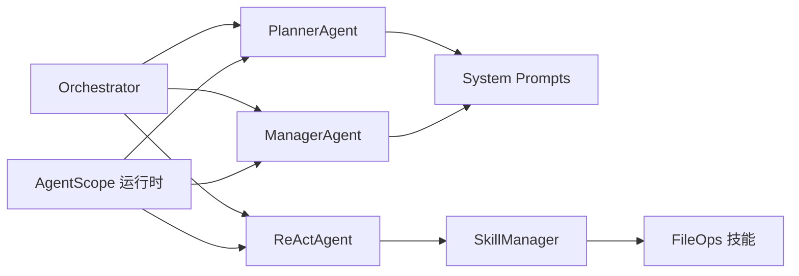

# 规划智能体

<cite>
**本文引用的文件列表**
- [main.py](file://localmanus-backend/main.py)
- [base_agents.py](file://localmanus-backend/agents/base_agents.py)
- [react_agent.py](file://localmanus-backend/agents/react_agent.py)
- [agent_manager.py](file://localmanus-backend/core/agent_manager.py)
- [orchestrator.py](file://localmanus-backend/core/orchestrator.py)
- [prompts.py](file://localmanus-backend/core/prompts.py)
- [skill_manager.py](file://localmanus-backend/core/skill_manager.py)
- [file_ops.py](file://localmanus-backend/skills/file_ops.py)
- [localmanus_architecture.md](file://localmanus_architecture.md)
- [localmanus_skills_roadmap.md](file://localmanus_skills_roadmap.md)
- [test_orchestration.py](file://localmanus-backend/scripts/test_orchestration.py)
</cite>

## 目录
1. [引言](#引言)
2. [项目结构](#项目结构)
3. [核心组件](#核心组件)
4. [架构总览](#架构总览)
5. [详细组件分析](#详细组件分析)
6. [依赖关系分析](#依赖关系分析)
7. [性能考量](#性能考量)
8. [故障排查指南](#故障排查指南)
9. [结论](#结论)
10. [附录](#附录)

## 引言
本文件面向 LocalManus 的规划智能体（PlannerAgent）创建一份系统化技术文档，聚焦其核心职责：
- 生成动态任务有向无环图（DAG）
- 检索可用工具（技能）
- 制定执行计划

文档将详细说明 PlannerAgent 的初始化配置、系统提示词的作用、任务规划算法，并阐述其如何接收管理智能体的标准化输入，分析任务需求，构建任务依赖关系图，确定执行顺序与资源分配。同时给出 DAG 数据结构的设计原理、节点类型定义、边权重计算思路，提供实际代码示例路径，展示 plan 方法的实现逻辑、任务分解策略与工具选择机制，并说明与技能管理器的集成方式与任务调度流程。

## 项目结构
LocalManus 后端采用模块化组织，核心围绕 AgentScope 的多智能体编排展开：
- API 网关：FastAPI 提供 REST/WebSocket 接口
- 编排器：Orchestrator 负责串联 Manager、Planner、ReActAgent
- 智能体：ManagerAgent、PlannerAgent、ReActAgent
- 技能系统：SkillManager 动态加载技能，提供工具元数据
- 提示词：统一的系统提示词模板
- 示例脚本：测试编排流程

**图表来源**
- [main.py](file://localmanus-backend/main.py#L1-L95)
- [orchestrator.py](file://localmanus-backend/core/orchestrator.py#L1-L118)
- [base_agents.py](file://localmanus-backend/agents/base_agents.py#L1-L42)
- [react_agent.py](file://localmanus-backend/agents/react_agent.py#L1-L108)
- [agent_manager.py](file://localmanus-backend/core/agent_manager.py#L1-L44)
- [prompts.py](file://localmanus-backend/core/prompts.py#L1-L53)
- [skill_manager.py](file://localmanus-backend/core/skill_manager.py#L1-L84)
- [file_ops.py](file://localmanus-backend/skills/file_ops.py#L1-L41)

**章节来源**
- [main.py](file://localmanus-backend/main.py#L1-L95)
- [localmanus_architecture.md](file://localmanus_architecture.md#L1-L137)

## 核心组件
- ManagerAgent：负责标准化用户输入，生成结构化意图与上下文，为 Planner 提供干净输入。
- PlannerAgent：根据可用技能生成动态任务 DAG，包含步骤、依赖与参数映射。
- ReActAgent：在工具可用时执行具体动作，支持多轮推理与行动。
- Orchestrator：编排 Manager -> Planner -> 执行（可选）的流水线，负责 JSON 提取与会话管理。
- SkillManager：动态加载技能，聚合工具元数据，供 Planner/ReActAgent 使用。
- 提示词模板：定义 Manager 与 Planner 的系统提示词，约束输出格式与行为。

**章节来源**
- [base_agents.py](file://localmanus-backend/agents/base_agents.py#L6-L41)
- [prompts.py](file://localmanus-backend/core/prompts.py#L3-L52)
- [orchestrator.py](file://localmanus-backend/core/orchestrator.py#L65-L80)
- [skill_manager.py](file://localmanus-backend/core/skill_manager.py#L42-L84)

## 架构总览
规划智能体在整体架构中的位置如下：
- 用户通过 API 输入请求，Orchestrator 调用 ManagerAgent 标准化输入
- PlannerAgent 基于系统提示词与可用技能生成 DAG
- Orchestrator 将结果封装为可执行计划，必要时驱动 ReActAgent 执行

**图表来源**
- [main.py](file://localmanus-backend/main.py#L40-L47)
- [orchestrator.py](file://localmanus-backend/core/orchestrator.py#L65-L80)
- [base_agents.py](file://localmanus-backend/agents/base_agents.py#L19-L40)

**章节来源**
- [localmanus_architecture.md](file://localmanus_architecture.md#L37-L41)
- [main.py](file://localmanus-backend/main.py#L40-L47)
- [orchestrator.py](file://localmanus-backend/core/orchestrator.py#L65-L80)

## 详细组件分析

### PlannerAgent 初始化与系统提示词
- 初始化：PlannerAgent 通过 AgentScope 的 ReActAgent 创建自身实例，使用 PLANNER_SYSTEM_PROMPT 作为系统提示词，绑定模型与格式化器。
- 系统提示词作用：
  - 明确角色定位：任务分解与技能路由专家
  - 约束输出格式：要求输出 JSON 格式的 DAG，包含步骤、依赖与参数
  - 暴露可用技能清单：帮助 Planner 选择合适技能
- plan 方法：接收 ManagerAgent 输出的结构化输入，构造消息并调用底层 ReActAgent，返回 Planner 的 JSON 计划。

**图表来源**
- [base_agents.py](file://localmanus-backend/agents/base_agents.py#L24-L40)
- [react_agent.py](file://localmanus-backend/agents/react_agent.py#L32-L108)

**章节来源**
- [base_agents.py](file://localmanus-backend/agents/base_agents.py#L24-L40)
- [prompts.py](file://localmanus-backend/core/prompts.py#L18-L52)

### ManagerAgent 输入标准化
- 初始化：使用 MANAGER_SYSTEM_PROMPT，绑定模型与格式化器
- process_input：接收原始用户输入，调用 ReActAgent 生成结构化 JSON，包含意图、实体与上下文
- 为 Planner 提供稳定、可解析的输入，便于后续 DAG 生成

**章节来源**
- [base_agents.py](file://localmanus-backend/agents/base_agents.py#L6-L23)
- [prompts.py](file://localmanus-backend/core/prompts.py#L3-L16)

### Orchestrator 编排流程
- run_workflow：串联 Manager -> Planner -> 返回 DAG
- _extract_json：从 Agent 响应中抽取 JSON，支持 Markdown 包裹的代码块
- sessions：维护会话历史，支持多轮对话（当前 ReActAgent 用于聊天）

**图表来源**
- [orchestrator.py](file://localmanus-backend/core/orchestrator.py#L65-L80)
- [orchestrator.py](file://localmanus-backend/core/orchestrator.py#L82-L96)

**章节来源**
- [orchestrator.py](file://localmanus-backend/core/orchestrator.py#L65-L80)
- [orchestrator.py](file://localmanus-backend/core/orchestrator.py#L82-L96)

### DAG 数据结构设计与节点类型
- 设计目标：将复杂任务拆分为可执行步骤，显式表达依赖关系，便于调度与回滚
- 节点类型定义（参考提示词输出格式）：
  - 步骤标识：step_id（整数）
  - 技能名称：skill（字符串，来自技能注册表）
  - 参数映射：args（字典，支持直接值或“output_from_<id>”占位符）
  - 依赖关系：dependencies（整数数组，指向前置步骤）
- 边权重计算（建议）：
  - 优先级权重：根据步骤重要性或业务规则赋予权重
  - 资源权重：根据技能所需资源（CPU/内存/IO）估算权重
  - 依赖权重：前置步骤完成时间决定最早可执行时间
  - 综合权重 = α·优先级 + β·资源 + γ·依赖
- 执行顺序：拓扑排序，按权重与依赖约束确定并发与串行

**图表来源**
- [prompts.py](file://localmanus-backend/core/prompts.py#L34-L51)

**章节来源**
- [prompts.py](file://localmanus-backend/core/prompts.py#L34-L51)

### 任务规划算法与工具选择机制
- 任务规划算法（概念流程）：
  1) 输入标准化：Manager 输出结构化意图
  2) 技能检索：Planner 基于可用技能清单选择匹配技能
  3) 依赖建模：根据输入/输出关系构建依赖边
  4) 参数映射：将占位符映射为上游输出键
  5) 权重计算：综合优先级、资源与依赖权重
  6) 拓扑排序：得到执行序列，支持并发与串行混合
- 工具选择机制：
  - Planner 通过系统提示词了解可用技能
  - 若需执行具体动作，ReActAgent 从 SkillManager 获取技能并执行
  - 工具元数据由 SkillManager 动态聚合，保证 Planner 的可见性

**图表来源**
- [prompts.py](file://localmanus-backend/core/prompts.py#L18-L52)
- [react_agent.py](file://localmanus-backend/agents/react_agent.py#L46-L51)
- [skill_manager.py](file://localmanus-backend/core/skill_manager.py#L75-L83)

**章节来源**
- [prompts.py](file://localmanus-backend/core/prompts.py#L18-L52)
- [react_agent.py](file://localmanus-backend/agents/react_agent.py#L46-L51)
- [skill_manager.py](file://localmanus-backend/core/skill_manager.py#L75-L83)

### 与技能管理器的集成与任务调度
- 集成方式：
  - ReActAgent 初始化时注入 SkillManager，动态获取工具元数据
  - Planner 通过系统提示词了解可用技能；执行阶段由 ReActAgent 调用具体技能
- 任务调度流程：
  - Planner 生成 DAG 后，Orchestrator 可将其转交执行（当前示例中未直接执行，但接口预留）
  - ReActAgent 支持多轮推理与行动，适合在执行阶段使用
  - 技能加载：SkillManager 动态扫描 skills 目录，实例化技能类，提供工具元数据

**图表来源**
- [react_agent.py](file://localmanus-backend/agents/react_agent.py#L32-L108)
- [skill_manager.py](file://localmanus-backend/core/skill_manager.py#L42-L84)

**章节来源**
- [react_agent.py](file://localmanus-backend/agents/react_agent.py#L32-L108)
- [skill_manager.py](file://localmanus-backend/core/skill_manager.py#L42-L84)

### 实际代码示例路径
- PlannerAgent 初始化与 plan 方法
  - [PlannerAgent.__init__](file://localmanus-backend/agents/base_agents.py#L29-L35)
  - [PlannerAgent.plan](file://localmanus-backend/agents/base_agents.py#L37-L40)
- ManagerAgent 输入标准化
  - [ManagerAgent.__init__](file://localmanus-backend/agents/base_agents.py#L11-L17)
  - [ManagerAgent.process_input](file://localmanus-backend/agents/base_agents.py#L19-L22)
- Orchestrator 编排与 JSON 提取
  - [Orchestrator.run_workflow](file://localmanus-backend/core/orchestrator.py#L65-L80)
  - [_extract_json](file://localmanus-backend/core/orchestrator.py#L82-L96)
- ReActAgent 工具元数据与执行
  - [_format_tools_metadata](file://localmanus-backend/agents/react_agent.py#L46-L51)
  - [run](file://localmanus-backend/agents/react_agent.py#L53-L107)
- SkillManager 技能加载与工具元数据
  - [SkillManager.__init__](file://localmanus-backend/core/skill_manager.py#L42-L46)
  - [_load_skills](file://localmanus-backend/core/skill_manager.py#L48-L71)
  - [list_all_tools](file://localmanus-backend/core/skill_manager.py#L75-L83)
- 示例脚本
  - [test_ppt_to_word_flow](file://localmanus-backend/scripts/test_orchestration.py#L12-L56)

**章节来源**
- [base_agents.py](file://localmanus-backend/agents/base_agents.py#L11-L40)
- [orchestrator.py](file://localmanus-backend/core/orchestrator.py#L65-L96)
- [react_agent.py](file://localmanus-backend/agents/react_agent.py#L46-L107)
- [skill_manager.py](file://localmanus-backend/core/skill_manager.py#L42-L83)
- [test_orchestration.py](file://localmanus-backend/scripts/test_orchestration.py#L12-L56)

## 依赖关系分析
- 组件耦合与内聚：
  - Orchestrator 对 Manager、Planner、ReActAgent 存在高层依赖，但通过 AgentScope 的统一初始化降低耦合
  - Planner 与 ReActAgent 通过系统提示词与工具元数据间接耦合
  - SkillManager 与 ReActAgent 直接耦合，提供工具元数据与执行能力
- 外部依赖与集成点：
  - AgentScope：提供 ReActAgent、消息传递与编排能力
  - OpenAI Chat Model：通过 AgentScope 的模型适配器接入
  - FastAPI：提供 API 网关与 WebSocket 通道
- 潜在循环依赖：
  - 当前结构未见循环依赖；若未来引入更复杂的调度器，需避免 Planner <-> Scheduler 的双向依赖

**图表来源**
- [agent_manager.py](file://localmanus-backend/core/agent_manager.py#L10-L34)
- [orchestrator.py](file://localmanus-backend/core/orchestrator.py#L8-L11)
- [prompts.py](file://localmanus-backend/core/prompts.py#L1-L53)
- [skill_manager.py](file://localmanus-backend/core/skill_manager.py#L42-L84)
- [file_ops.py](file://localmanus-backend/skills/file_ops.py#L4-L41)

**章节来源**
- [agent_manager.py](file://localmanus-backend/core/agent_manager.py#L10-L34)
- [orchestrator.py](file://localmanus-backend/core/orchestrator.py#L8-L11)

## 性能考量
- LLM 调用成本控制：
  - 使用系统提示词约束输出格式，减少无效 token
  - 通过 JSON 提取器避免重复解析与错误重试
- 工具元数据缓存：
  - ReActAgent 在初始化时格式化工具元数据，避免每次调用重复拼接
- 并发与串行：
  - DAG 拓扑排序后，依据权重与依赖并行执行可并行步骤，减少总时延
- I/O 与网络：
  - API 层采用 SSE/WebSocket，前端可渐进式展示进度
- 可观测性：
  - 建议在 Planner 与 ReActAgent 中增加 trace_id 传播，便于端到端追踪

[本节为通用指导，无需列出具体文件来源]

## 故障排查指南
- JSON 解析失败：
  - 现象：Orchestrator._extract_json 返回错误包装
  - 排查：确认 Agent 输出是否包裹在 Markdown 代码块中；检查提示词是否严格约束输出格式
  - 参考路径：[_extract_json](file://localmanus-backend/core/orchestrator.py#L82-L96)
- API 密钥缺失导致 LLM 调用失败：
  - 现象：Manager/Planner 无法生成结构化响应
  - 排查：检查 OPENAI_API_KEY、OPENAI_API_BASE 等环境变量；示例脚本提供模拟模式
  - 参考路径：[test_ppt_to_word_flow](file://localmanus-backend/scripts/test_orchestration.py#L26-L47)
- 技能加载失败：
  - 现象：SkillManager 无法发现技能或工具元数据为空
  - 排查：确认 skills 目录存在且包含可导入模块；检查技能类继承 BaseSkill
  - 参考路径：[_load_skills](file://localmanus-backend/core/skill_manager.py#L48-L71)
- 工具执行异常：
  - 现象：ReActAgent 执行 Action 后返回错误
  - 排查：检查技能名/工具名是否正确；确认参数格式；查看日志输出
  - 参考路径：[run](file://localmanus-backend/agents/react_agent.py#L77-L102)

**章节来源**
- [orchestrator.py](file://localmanus-backend/core/orchestrator.py#L82-L96)
- [test_orchestration.py](file://localmanus-backend/scripts/test_orchestration.py#L26-L47)
- [skill_manager.py](file://localmanus-backend/core/skill_manager.py#L48-L71)
- [react_agent.py](file://localmanus-backend/agents/react_agent.py#L77-L102)

## 结论
PlannerAgent 通过系统提示词与 AgentScope 的消息编排能力，实现了从用户意图到动态 DAG 的自动化生成。结合 SkillManager 的工具元数据与 ReActAgent 的执行能力，系统形成了“规划—路由—执行”的闭环。建议在后续版本中：
- 强化 Planner 的依赖建模与权重计算，提升调度效率
- 增强 JSON 输出的校验与回退策略，提升鲁棒性
- 在 API 层引入更细粒度的状态与进度推送，改善用户体验

[本节为总结性内容，无需列出具体文件来源]

## 附录
- 相关文档与路线图
  - [localmanus_architecture.md](file://localmanus_architecture.md#L1-L137)
  - [localmanus_skills_roadmap.md](file://localmanus_skills_roadmap.md#L1-L62)

**章节来源**
- [localmanus_architecture.md](file://localmanus_architecture.md#L1-L137)
- [localmanus_skills_roadmap.md](file://localmanus_skills_roadmap.md#L1-L62)