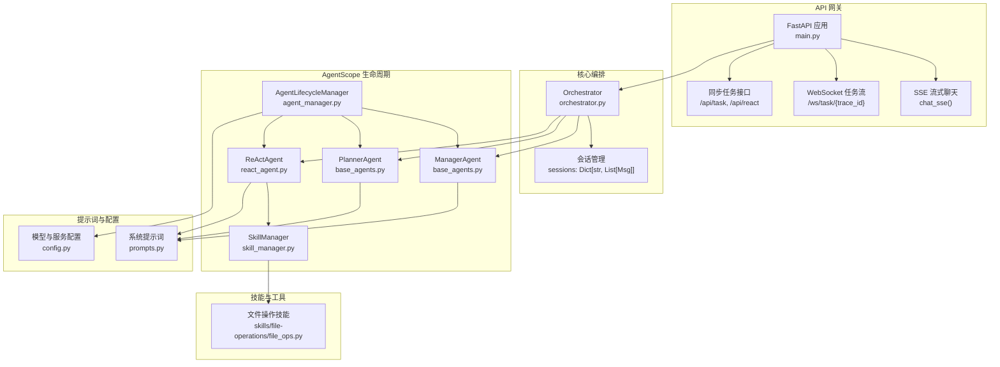
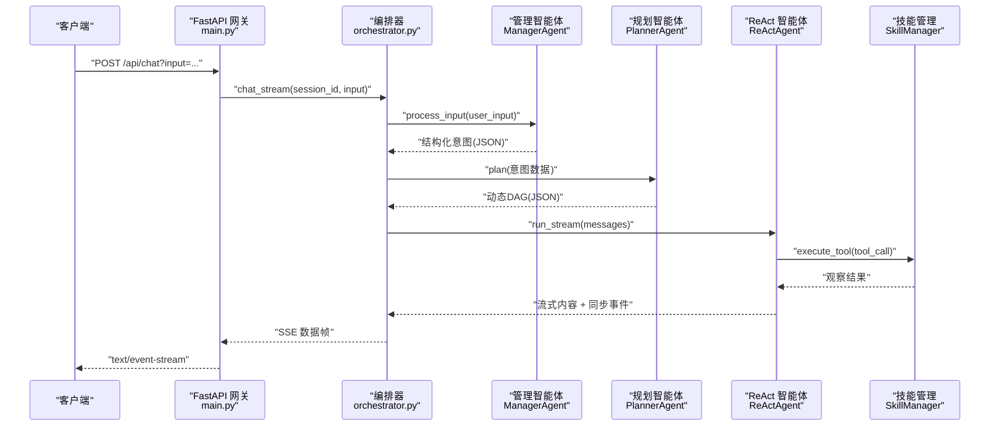
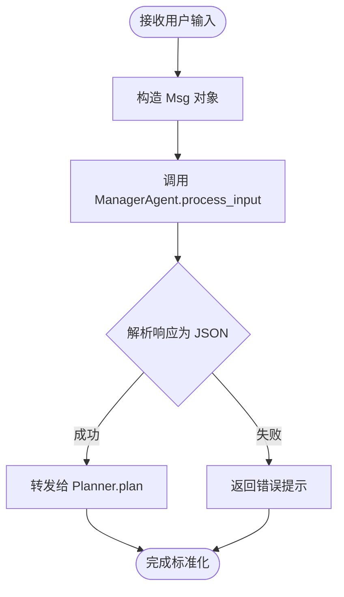
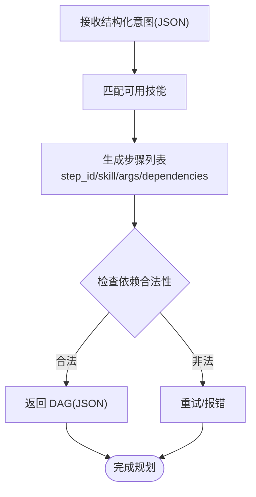
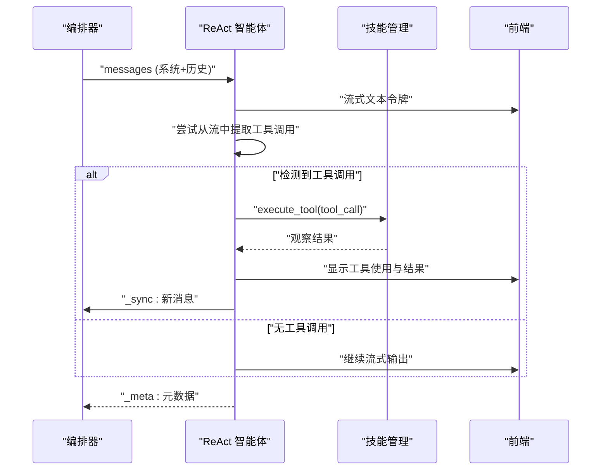
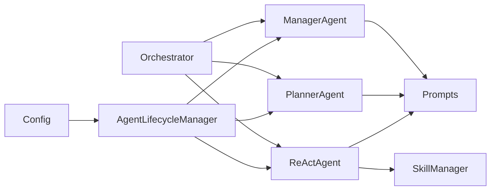

# AgentScope 多智能体系统

<cite>
**本文引用的文件**
- [main.py](file://localmanus-backend/main.py)
- [orchestrator.py](file://localmanus-backend/core/orchestrator.py)
- [agent_manager.py](file://localmanus-backend/core/agent_manager.py)
- [base_agents.py](file://localmanus-backend/agents/base_agents.py)
- [react_agent.py](file://localmanus-backend/agents/react_agent.py)
- [skill_manager.py](file://localmanus-backend/core/skill_manager.py)
- [prompts.py](file://localmanus-backend/core/prompts.py)
- [config.py](file://localmanus-backend/core/config.py)
- [file_ops.py](file://localmanus-backend/skills/file-operations/file_ops.py)
- [localmanus_architecture.md](file://localmanus_architecture.md)
- [localmanus_skills_roadmap.md](file://localmanus_skills_roadmap.md)
</cite>

## 目录
1. [简介](#简介)
2. [项目结构](#项目结构)
3. [核心组件](#核心组件)
4. [架构总览](#架构总览)
5. [详细组件分析](#详细组件分析)
6. [依赖关系分析](#依赖关系分析)
7. [性能考量](#性能考量)
8. [故障排查指南](#故障排查指南)
9. [结论](#结论)
10. [附录](#附录)

## 简介
本文件面向 LocalManus 的 AgentScope 多智能体系统，聚焦以下目标：
- 管理智能体（Manager Agent）的输入标准化与会话管理
- 规划智能体（Planner Agent）的动态 DAG 任务生成机制
- ReAct 智能体（ReAct Agent）的推理-行动循环架构与流式输出
- 智能体间通信协议、消息传递格式与状态同步机制
- 智能体生命周期管理、自适应学习机制与错误恢复策略
- 智能体配置参数、性能优化建议与调试方法
- 实际使用模式与代码示例路径

## 项目结构
后端采用 FastAPI 作为 API 网关，核心编排由 Orchestrator 负责，AgentScope 的三个核心智能体（Manager、Planner、ReAct）在 AgentLifecycleManager 中统一初始化与注入。技能系统通过 SkillManager 动态加载工具函数与 Agent 技能，Prompts 提供系统提示词模板，Config 提供模型与服务配置。

**图示来源**
- [main.py](file://localmanus-backend/main.py#L34-L477)
- [orchestrator.py](file://localmanus-backend/core/orchestrator.py#L11-L150)
- [agent_manager.py](file://localmanus-backend/core/agent_manager.py#L11-L49)
- [base_agents.py](file://localmanus-backend/agents/base_agents.py#L6-L42)
- [react_agent.py](file://localmanus-backend/agents/react_agent.py#L20-L349)
- [skill_manager.py](file://localmanus-backend/core/skill_manager.py#L18-L143)
- [prompts.py](file://localmanus-backend/core/prompts.py#L1-L75)
- [config.py](file://localmanus-backend/core/config.py#L1-L21)
- [file_ops.py](file://localmanus-backend/skills/file-operations/file_ops.py#L9-L165)

**章节来源**
- [main.py](file://localmanus-backend/main.py#L34-L477)
- [localmanus_architecture.md](file://localmanus_architecture.md#L1-L172)

## 核心组件
- 管理智能体（Manager Agent）
  - 职责：标准化用户输入，输出结构化意图与实体信息，维护会话 TraceID
  - 关键实现：封装 ReActAgent，使用系统提示词进行意图抽取与澄清
  - 示例路径：[ManagerAgent.process_input](file://localmanus-backend/agents/base_agents.py#L19-L22)

- 规划智能体（Planner Agent）
  - 职责：接收标准化输入，生成动态任务 DAG（含步骤、依赖、参数）
  - 关键实现：封装 ReActAgent，使用系统提示词进行任务分解与技能路由
  - 示例路径：[PlannerAgent.plan](file://localmanus-backend/agents/base_agents.py#L37-L40)

- ReAct 智能体（ReAct Agent）
  - 职责：推理-行动循环，实时流式输出，工具调用与观察
  - 关键实现：继承 AgentScope ReActAgent，集成 SkillManager 工具集，支持流式令牌与工具调用提取
  - 示例路径：[ReActAgent.run_stream](file://localmanus-backend/agents/react_agent.py#L53-L215)

- Orchestrator 编排器
  - 职责：会话管理、消息历史同步、SSE 输出、JSON 解析与错误处理
  - 关键实现：维护 sessions 字典，组装系统提示词与历史消息，驱动 ReAct 流式循环
  - 示例路径：[Orchestrator.chat_stream](file://localmanus-backend/core/orchestrator.py#L16-L96)

- 技能管理（SkillManager）
  - 职责：扫描 skills 目录，注册 Agent 技能与工具函数，提供工具元数据与技能提示
  - 关键实现：Toolkit 注册、异步执行工具、注入用户上下文参数
  - 示例路径：[SkillManager._load_skills](file://localmanus-backend/core/skill_manager.py#L29-L89)

**章节来源**
- [base_agents.py](file://localmanus-backend/agents/base_agents.py#L6-L42)
- [react_agent.py](file://localmanus-backend/agents/react_agent.py#L20-L349)
- [orchestrator.py](file://localmanus-backend/core/orchestrator.py#L11-L150)
- [skill_manager.py](file://localmanus-backend/core/skill_manager.py#L18-L143)

## 架构总览
系统采用“管理-规划-执行”的三层协作模式，结合 AgentScope 的消息与工具能力，形成可扩展的多智能体编排框架。ReAct Agent 通过流式响应与工具调用实现“边思考、边行动”，Orchestrator 负责会话状态与消息同步，SkillManager 提供技能生态。

**图示来源**
- [main.py](file://localmanus-backend/main.py#L392-L420)
- [orchestrator.py](file://localmanus-backend/core/orchestrator.py#L16-L96)
- [base_agents.py](file://localmanus-backend/agents/base_agents.py#L19-L40)
- [react_agent.py](file://localmanus-backend/agents/react_agent.py#L53-L215)
- [skill_manager.py](file://localmanus-backend/core/skill_manager.py#L90-L134)

## 详细组件分析

### 管理智能体（Manager Agent）：输入标准化与会话管理
- 输入标准化
  - 使用系统提示词将自然语言转为结构化 JSON，包含 intent、entities、context
  - 通过 ReActAgent 的对话能力处理模糊请求并引导澄清
  - 示例路径：[ManagerAgent.__init__](file://localmanus-backend/agents/base_agents.py#L11-L17)

- 会话管理
  - Orchestrator 维护 sessions 字典，按 session_id 管理消息历史
  - 历史消息在 ReAct 流中被同步更新，保证上下文连续性
  - 示例路径：[Orchestrator.sessions](file://localmanus-backend/core/orchestrator.py#L14)

- 通信与协议
  - Manager-Agent 返回的结构化 JSON 由 Orchestrator 解析并注入 Planner
  - JSON 提取采用 Markdown 包裹块解析，增强鲁棒性
  - 示例路径：[Orchestrator._extract_json](file://localmanus-backend/core/orchestrator.py#L114-L128)

**图示来源**
- [base_agents.py](file://localmanus-backend/agents/base_agents.py#L19-L22)
- [orchestrator.py](file://localmanus-backend/core/orchestrator.py#L101-L112)
- [prompts.py](file://localmanus-backend/core/prompts.py#L3-L16)

**章节来源**
- [base_agents.py](file://localmanus-backend/agents/base_agents.py#L6-L22)
- [orchestrator.py](file://localmanus-backend/core/orchestrator.py#L14-L38)
- [prompts.py](file://localmanus-backend/core/prompts.py#L1-L16)

### 规划智能体（Planner Agent）：动态 DAG 任务生成机制
- 任务分解
  - 基于可用技能集合与系统提示词，将高层目标拆解为有序步骤
  - 步骤包含 step_id、skill、args、dependencies 等字段
  - 示例路径：[PlannerAgent.plan](file://localmanus-backend/agents/base_agents.py#L37-L40)

- 技能路由
  - Planner 依据输入意图与上下文选择最合适技能
  - 依赖关系确保步骤顺序与数据传递
  - 示例路径：[PLANNER_SYSTEM_PROMPT](file://localmanus-backend/core/prompts.py#L18-L52)

- 与 Orchestrator 的协作
  - Orchestrator 将 Manager 的 JSON 结果传入 Planner
  - Planner 返回 DAG，Orchestrator 添加 trace_id 并返回给调用方
  - 示例路径：[Orchestrator.run_workflow](file://localmanus-backend/core/orchestrator.py#L97-L112)

**图示来源**
- [base_agents.py](file://localmanus-backend/agents/base_agents.py#L24-L40)
- [prompts.py](file://localmanus-backend/core/prompts.py#L18-L52)
- [orchestrator.py](file://localmanus-backend/core/orchestrator.py#L97-L112)

**章节来源**
- [base_agents.py](file://localmanus-backend/agents/base_agents.py#L24-L40)
- [prompts.py](file://localmanus-backend/core/prompts.py#L18-L52)
- [orchestrator.py](file://localmanus-backend/core/orchestrator.py#L97-L112)

### ReAct 智能体（ReAct Agent）：推理-行动循环架构
- 推理-行动循环
  - 流式生成文本令牌，同时尝试从流中提取工具调用
  - 若未检测到工具调用，回退到完整响应解析
  - 执行工具后将观察结果注入上下文，继续推理直至完成
  - 示例路径：[ReActAgent.run_stream](file://localmanus-backend/agents/react_agent.py#L53-L215)

- 流式输出与同步
  - 通过内部协议区分前端可见内容与内部同步事件
  - 同步事件以 "_sync" 形式追加到会话历史，不发送给前端
  - 示例路径：[Orchestrator.chat_stream 同步处理](file://localmanus-backend/core/orchestrator.py#L72-L81)

- 工具集成
  - 通过 SkillManager 的 Toolkit 注册工具函数与 Agent 技能
  - 支持注入 user_context（如 user_id、用户名等）到工具签名
  - 示例路径：[SkillManager.execute_tool 参数注入](file://localmanus-backend/core/skill_manager.py#L99-L105)

- 系统提示词构建
  - 动态拼接时间、用户信息、技能提示与工具元数据
  - 示例路径：[ReActAgent._build_system_prompt](file://localmanus-backend/agents/react_agent.py#L36-L51)

**图示来源**
- [react_agent.py](file://localmanus-backend/agents/react_agent.py#L53-L215)
- [skill_manager.py](file://localmanus-backend/core/skill_manager.py#L90-L134)
- [orchestrator.py](file://localmanus-backend/core/orchestrator.py#L72-L90)

**章节来源**
- [react_agent.py](file://localmanus-backend/agents/react_agent.py#L20-L349)
- [skill_manager.py](file://localmanus-backend/core/skill_manager.py#L18-L143)
- [prompts.py](file://localmanus-backend/core/prompts.py#L54-L75)

### 智能体间通信协议、消息传递格式与状态同步
- 消息格式
  - 统一使用 Msg 对象（name、content、role），Orchestrator 在内部兼容 dict 与 Msg
  - 示例路径：[Orchestrator.chat_stream 消息构建](file://localmanus-backend/core/orchestrator.py#L46-L69)

- 内部协议
  - 前端可见内容：{"content": "..."}
  - 内部同步事件：{"_sync": [...]}
  - 内部元数据：{"_meta": {...}}
  - 示例路径：[Orchestrator.chat_stream 协议处理](file://localmanus-backend/core/orchestrator.py#L72-L88)

- 状态同步机制
  - ReActAgent.run_stream 在 finally 中发出 "_sync"，Orchestrator 将新消息追加到会话历史
  - 示例路径：[ReActAgent.run_stream 同步出口](file://localmanus-backend/agents/react_agent.py#L211-L214)

**章节来源**
- [orchestrator.py](file://localmanus-backend/core/orchestrator.py#L16-L96)
- [react_agent.py](file://localmanus-backend/agents/react_agent.py#L211-L214)

### 智能体生命周期管理、自适应学习与错误恢复
- 生命周期管理
  - AgentLifecycleManager 初始化模型、格式化器、记忆体与 SkillManager
  - 统一注入 Manager、Planner、ReAct 三个智能体
  - 示例路径：[AgentLifecycleManager.__init__](file://localmanus-backend/core/agent_manager.py#L11-L36)

- 自适应学习
  - 当前实现未显式包含在线学习模块；可通过以下方式扩展：
    - 记录 ReAct 的工具调用次数与成功率，动态调整 Planner 的技能偏好
    - 将失败案例加入 Manager 的澄清策略
  - 参考：[SkillManager.execute_tool 返回值聚合](file://localmanus-backend/core/skill_manager.py#L118-L130)

- 错误恢复策略
  - JSON 解析失败时返回兜底结构
  - ReAct 循环异常捕获并返回错误提示
  - Orchestrator 将异常包装为 SSE 错误消息
  - 示例路径：[Orchestrator._extract_json 异常处理](file://localmanus-backend/core/orchestrator.py#L118-L128), [react_agent.py 异常处理](file://localmanus-backend/agents/react_agent.py#L207-L210), [orchestrator.py 错误封装](file://localmanus-backend/core/orchestrator.py#L92-L95)

**章节来源**
- [agent_manager.py](file://localmanus-backend/core/agent_manager.py#L11-L36)
- [orchestrator.py](file://localmanus-backend/core/orchestrator.py#L114-L128)
- [react_agent.py](file://localmanus-backend/agents/react_agent.py#L207-L210)

### 智能体配置参数、性能优化与调试方法
- 配置参数
  - 模型配置：模型名称、API Key、基础 URL
  - 服务配置：主机地址、端口
  - 示例路径：[config.py](file://localmanus-backend/core/config.py#L8-L21)

- 性能优化
  - ReActAgent 优先尝试从流中提取工具调用，减少二次解析开销
  - 流式令牌逐字符或逐块推送，降低首屏延迟
  - 会话轮次上限保护，避免无限增长
  - 示例路径：[react_agent.py 流式优化](file://localmanus-backend/agents/react_agent.py#L85-L162), [orchestrator.py 会话上限](file://localmanus-backend/core/orchestrator.py#L34-L37)

- 调试方法
  - 启用详细日志，关注 ReActAgent 与 Orchestrator 的调试输出
  - 使用 WebSocket 接口模拟 ReAct 循环进度，便于前端联调
  - 示例路径：[main.py WebSocket 任务流](file://localmanus-backend/main.py#L440-L473)

**章节来源**
- [config.py](file://localmanus-backend/core/config.py#L8-L21)
- [react_agent.py](file://localmanus-backend/agents/react_agent.py#L53-L162)
- [orchestrator.py](file://localmanus-backend/core/orchestrator.py#L34-L37)
- [main.py](file://localmanus-backend/main.py#L440-L473)

## 依赖关系分析
- 组件耦合
  - Orchestrator 依赖 Manager、Planner、ReAct 与 SkillManager
  - ReAct 依赖 SkillManager 的工具集
  - AgentLifecycleManager 为所有智能体提供共享模型与格式化器
- 外部依赖
  - AgentScope 的 ReActAgent、Toolkit、Msg
  - FastAPI、WebSocket、SSE
  - 环境变量与 .env 配置

**图示来源**
- [orchestrator.py](file://localmanus-backend/core/orchestrator.py#L12-L13)
- [agent_manager.py](file://localmanus-backend/core/agent_manager.py#L33-L36)
- [prompts.py](file://localmanus-backend/core/prompts.py#L1-L75)
- [config.py](file://localmanus-backend/core/config.py#L1-L21)

**章节来源**
- [orchestrator.py](file://localmanus-backend/core/orchestrator.py#L12-L13)
- [agent_manager.py](file://localmanus-backend/core/agent_manager.py#L33-L36)

## 性能考量
- 流式优先：ReActAgent 优先从流中提取工具调用，避免完整响应后再解析
- 令牌级推送：SSE 逐字符/块推送，显著改善感知延迟
- 会话上限：防止历史消息无限增长导致性能下降
- 工具调用批处理：同一轮 ReAct 循环中收集多个工具调用，减少往返次数
- 日志与错误：在关键节点记录元数据，便于定位瓶颈与异常

[本节为通用指导，无需具体文件引用]

## 故障排查指南
- 无法解析 JSON
  - 现象：Manager/Planner 返回内容未包裹在 JSON 中
  - 处理：检查系统提示词与模型输出稳定性；确认 _extract_json 的解析逻辑
  - 参考路径：[Orchestrator._extract_json](file://localmanus-backend/core/orchestrator.py#L114-L128)

- ReAct 循环卡顿或无工具调用
  - 现象：流式输出正常但未检测到工具调用
  - 处理：确认模型输出格式与 _extract_tool_call_from_chunk 的适配；必要时回退到完整响应解析
  - 参考路径：[react_agent.py 工具调用提取](file://localmanus-backend/agents/react_agent.py#L216-L253)

- WebSocket/SSE 无响应
  - 现象：前端未收到流式数据
  - 处理：检查 WebSocket 接收与发送逻辑；确认 Orchestrator 的 SSE 格式
  - 参考路径：[main.py WebSocket 任务流](file://localmanus-backend/main.py#L440-L473), [orchestrator.py chat_stream](file://localmanus-backend/core/orchestrator.py#L16-L96)

**章节来源**
- [orchestrator.py](file://localmanus-backend/core/orchestrator.py#L114-L128)
- [react_agent.py](file://localmanus-backend/agents/react_agent.py#L216-L253)
- [main.py](file://localmanus-backend/main.py#L440-L473)

## 结论
LocalManus 的 AgentScope 多智能体系统通过“管理-规划-执行”的分层协作，实现了从自然语言到可执行任务的自动化编排。Manager 与 Planner 负责意图与任务的标准化，ReAct 通过流式推理与工具调用实现闭环执行，Orchestrator 统一会话与消息同步。SkillManager 提供灵活的技能生态，支持未来扩展更多专业领域技能。

[本节为总结，无需具体文件引用]

## 附录

### 实际使用模式与示例路径
- SSE 多轮聊天
  - 路径：[main.py chat_sse](file://localmanus-backend/main.py#L392-L420)
  - 说明：支持文件路径上下文与用户上下文注入

- 同步任务规划
  - 路径：[main.py /api/task](file://localmanus-backend/main.py#L422-L429)
  - 说明：返回 Planner 生成的动态 DAG

- ReAct 推理循环
  - 路径：[main.py /api/react](file://localmanus-backend/main.py#L431-L438)
  - 说明：同步执行 ReAct 循环并返回结果

- WebSocket 任务流
  - 路径：[main.py /ws/task/{trace_id}](file://localmanus-backend/main.py#L440-L473)
  - 说明：前端实时接收 ReAct 思考与工具调用进度

- 文件操作技能
  - 路径：[skills/file-operations/file_ops.py](file://localmanus-backend/skills/file-operations/file_ops.py#L24-L121)
  - 说明：列出、读取、写入用户上传文件

**章节来源**
- [main.py](file://localmanus-backend/main.py#L392-L473)
- [file_ops.py](file://localmanus-backend/skills/file-operations/file_ops.py#L24-L121)