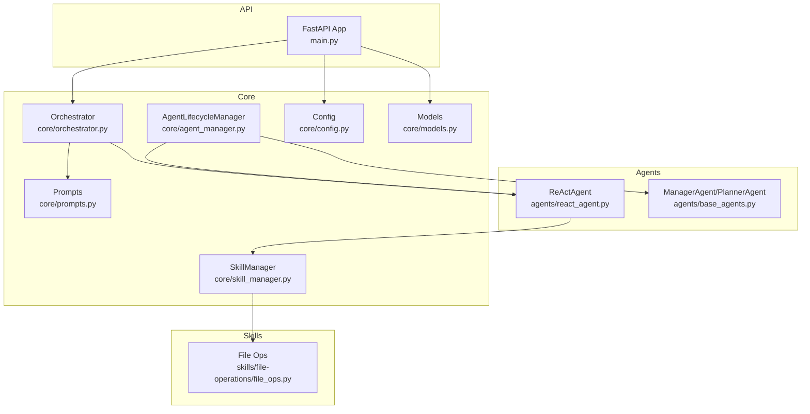
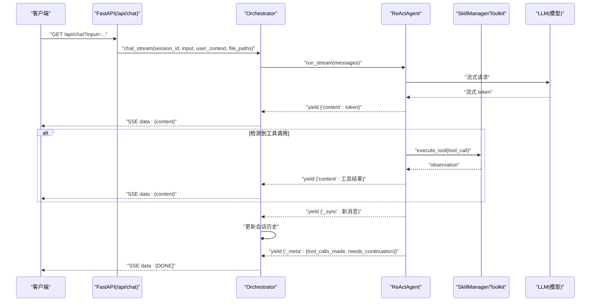
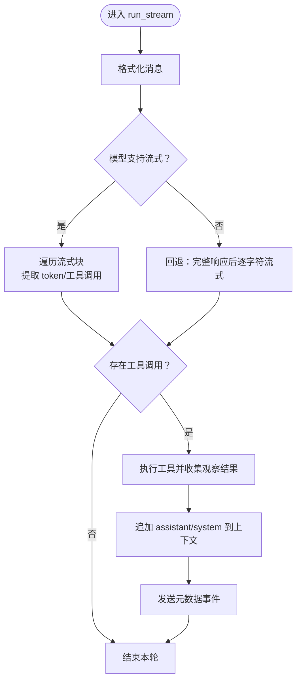
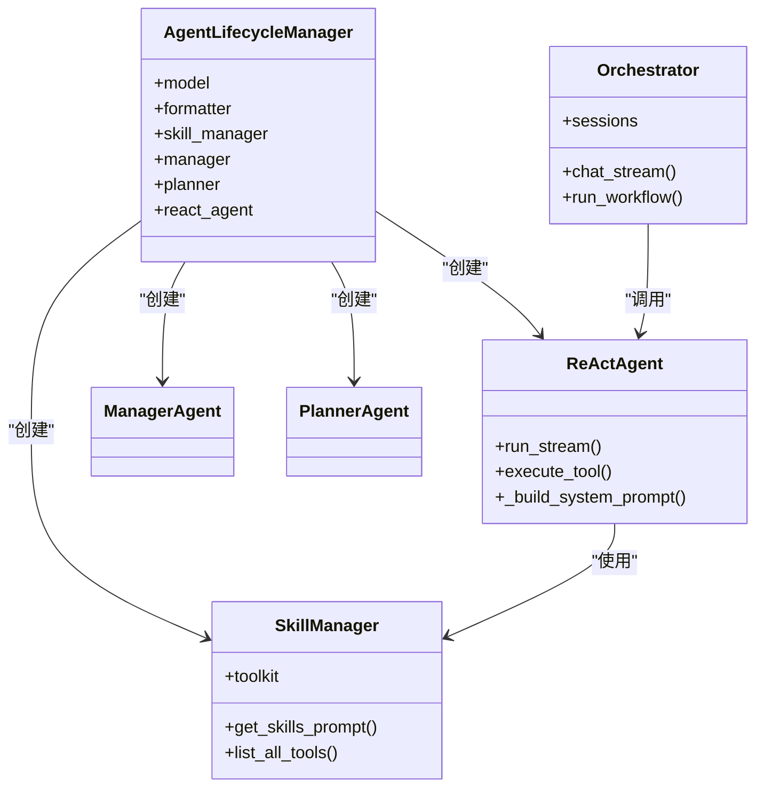

# ReAct 智能体 (ReAct Agent)

<cite>
**本文引用的文件**
- [react_agent.py](file://localmanus-backend/agents/react_agent.py)
- [base_agents.py](file://localmanus-backend/agents/base_agents.py)
- [prompts.py](file://localmanus-backend/core/prompts.py)
- [orchestrator.py](file://localmanus-backend/core/orchestrator.py)
- [skill_manager.py](file://localmanus-backend/core/skill_manager.py)
- [agent_manager.py](file://localmanus-backend/core/agent_manager.py)
- [main.py](file://localmanus-backend/main.py)
- [file_ops.py](file://localmanus-backend/skills/file-operations/file_ops.py)
- [config.py](file://localmanus-backend/core/config.py)
- [models.py](file://localmanus-backend/core/models.py)
- [test_orchestration.py](file://localmanus-backend/scripts/test_orchestration.py)
</cite>

## 目录
1. [简介](#简介)
2. [项目结构](#项目结构)
3. [核心组件](#核心组件)
4. [架构总览](#架构总览)
5. [组件详解](#组件详解)
6. [依赖关系分析](#依赖关系分析)
7. [性能与优化](#性能与优化)
8. [故障排查指南](#故障排查指南)
9. [结论](#结论)
10. [附录：使用模式与调试技巧](#附录使用模式与调试技巧)

## 简介
本技术文档围绕 ReAct 智能体（ReAct Agent）在 LocalManus 后端中的实现进行系统化说明，重点阐述以下方面：
- ReAct 核心理念：推理（Reason）与行动（Act）的循环机制
- ReActAgent 的初始化配置、系统提示词设计与消息处理流程
- 推理阶段的消息格式、行动阶段的工具调用机制与结果评估
- ReAct 循环的实现细节、错误处理策略与性能优化建议
- 实际代码示例路径、使用模式与调试技巧

ReAct 智能体基于 AgentScope 的原生 ReActAgent，结合自定义的系统提示词模板、工具注册与流式输出能力，实现了“边推理、边行动”的实时交互体验，并通过会话历史管理与内部协议（_sync/_meta）确保前端 SSE 流的稳定与可追踪性。

## 项目结构
后端采用模块化分层组织，ReAct 智能体相关的关键模块如下：
- agents：ReActAgent 及基础 Agent（ManagerAgent、PlannerAgent）
- core：提示词模板、编排器、技能管理、Agent 生命周期管理、配置与模型定义
- skills：工具函数与技能实现（如文件操作）
- main.py：FastAPI 入口，提供 SSE/WS 接口与业务路由
- scripts：测试脚本（演示工作流）

图表来源
- [react_agent.py](file://localmanus-backend/agents/react_agent.py#L20-L349)
- [base_agents.py](file://localmanus-backend/agents/base_agents.py#L6-L42)
- [orchestrator.py](file://localmanus-backend/core/orchestrator.py#L11-L150)
- [skill_manager.py](file://localmanus-backend/core/skill_manager.py#L18-L143)
- [agent_manager.py](file://localmanus-backend/core/agent_manager.py#L11-L49)
- [prompts.py](file://localmanus-backend/core/prompts.py#L1-L75)
- [main.py](file://localmanus-backend/main.py#L1-L477)
- [file_ops.py](file://localmanus-backend/skills/file-operations/file_ops.py#L9-L165)
- [config.py](file://localmanus-backend/core/config.py#L1-L22)
- [models.py](file://localmanus-backend/core/models.py#L1-L80)

章节来源
- [main.py](file://localmanus-backend/main.py#L34-L40)
- [agent_manager.py](file://localmanus-backend/core/agent_manager.py#L11-L49)

## 核心组件
- ReActAgent：继承自 AgentScope 的 ReActAgent，负责构建系统提示词、执行流式推理、解析工具调用、执行工具并回写上下文。
- Orchestrator：会话管理与编排，负责将用户输入转换为消息列表、注入系统提示词与文件上下文、处理内部同步事件与元数据事件，并以 SSE 形式输出。
- SkillManager：扫描 skills 目录，注册工具函数与 Agent 技能，提供工具元数据与技能提示。
- ManagerAgent/PlannerAgent：基础 Agent，分别负责意图标准化与任务规划（JSON DAG），用于更高层的编排。
- 主应用（FastAPI）：提供 SSE/WS 接口，调用 Orchestrator 执行 ReAct 循环或同步任务。

章节来源
- [react_agent.py](file://localmanus-backend/agents/react_agent.py#L20-L349)
- [orchestrator.py](file://localmanus-backend/core/orchestrator.py#L11-L150)
- [skill_manager.py](file://localmanus-backend/core/skill_manager.py#L18-L143)
- [base_agents.py](file://localmanus-backend/agents/base_agents.py#L6-L42)
- [main.py](file://localmanus-backend/main.py#L392-L439)

## 架构总览
ReAct 智能体的端到端流程如下：
- 客户端发起 SSE 请求，携带用户输入与可选文件路径
- 编排器构建系统提示词（含时间、用户信息、技能提示、工具元数据），拼接历史消息
- ReActAgent 执行流式推理，优先从流中提取 token 与工具调用
- 若检测到工具调用，则执行工具并将结果作为 system 消息回写上下文
- 编排器将内容块以 SSE data 字段推送，内部同步事件用于更新会话历史，元数据事件用于日志记录

图表来源
- [main.py](file://localmanus-backend/main.py#L392-L421)
- [orchestrator.py](file://localmanus-backend/core/orchestrator.py#L16-L96)
- [react_agent.py](file://localmanus-backend/agents/react_agent.py#L53-L215)

## 组件详解

### ReActAgent：初始化、系统提示词与消息处理
- 初始化：接收模型、格式化器与技能管理器，将 toolkit 注入父类 ReActAgent；保留原始模型以便直接流式调用。
- 系统提示词构建：动态注入当前时间、用户信息、技能提示与工具元数据，确保模型具备上下文与可用工具清单。
- 流式执行 run_stream：
  - 首先尝试直接从模型流式返回中抽取 token 与工具调用
  - 若失败则回退到完整响应后再逐字符流式输出
  - 将 assistant 回答与 system 观察结果写入上下文，并通过内部同步事件通知编排器更新会话
  - 通过元数据事件传递运行状态（是否产生工具调用、是否需要继续）

图表来源
- [react_agent.py](file://localmanus-backend/agents/react_agent.py#L53-L215)

章节来源
- [react_agent.py](file://localmanus-backend/agents/react_agent.py#L20-L349)

### 推理阶段的消息格式与工具调用解析
- 推理阶段消息格式：由编排器将系统提示词与历史消息合并为消息列表，供模型消费
- 工具调用解析：
  - 优先从流式块中提取工具调用（支持 OpenAI 流式格式与对象属性）
  - 若无流式工具调用，则回退到从结构化消息中解析工具调用块
- 工具执行：通过 toolkit 调用工具函数，将用户上下文注入参数签名匹配的字段（如 user_id、user_context）

章节来源
- [react_agent.py](file://localmanus-backend/agents/react_agent.py#L216-L327)
- [react_agent.py](file://localmanus-backend/agents/react_agent.py#L328-L340)

### 行动阶段：工具调用机制与结果评估
- 工具注册：SkillManager 扫描 skills 目录，注册 Agent 技能与工具函数，生成工具元数据与技能提示
- 工具调用：ReActAgent 在推理阶段识别工具调用后，委托 SkillManager 执行工具，返回字符串化的观察结果
- 结果评估：观察结果作为 system 消息回写上下文，驱动下一轮推理直至完成

章节来源
- [skill_manager.py](file://localmanus-backend/core/skill_manager.py#L18-L143)
- [react_agent.py](file://localmanus-backend/agents/react_agent.py#L328-L340)

### 编排器：会话管理与内部协议
- 会话管理：维护每个 session_id 的消息历史，限制最大轮次，避免无限增长
- 内部协议：
  - content：前端可见的增量文本
  - _sync：内部同步事件，用于更新会话历史（不透传给前端）
  - _meta：内部元数据事件，用于日志记录（不透传给前端）
- 文件上下文：当提供文件路径时，在系统提示词中附加用户上传文件清单，指导模型使用 read_user_file 工具

章节来源
- [orchestrator.py](file://localmanus-backend/core/orchestrator.py#L16-L96)

### 基础 Agent：ManagerAgent 与 PlannerAgent
- ManagerAgent：负责标准化用户输入，输出结构化意图（intent/entities/context）
- PlannerAgent：根据意图生成动态任务 DAG（含依赖映射），输出可执行计划
- 两者均基于 AgentScope 的 ReActAgent，使用各自系统提示词模板

章节来源
- [base_agents.py](file://localmanus-backend/agents/base_agents.py#L6-L42)
- [prompts.py](file://localmanus-backend/core/prompts.py#L3-L52)

### 系统提示词设计
- Manager/Planner 提示词：明确角色职责与输出格式，便于后续解析
- ReActAgent 提示词：包含当前时间、用户信息、技能提示与工具元数据，指导模型在复杂任务中按需使用工具

章节来源
- [prompts.py](file://localmanus-backend/core/prompts.py#L3-L75)

### 技能与工具：文件操作示例
- FileOperationSkill：提供列出用户文件、读取用户文件、读取任意文件、写入文件、目录列举等工具
- 通过 SkillManager 自动注册，供 ReActAgent 在推理阶段选择与调用

章节来源
- [file_ops.py](file://localmanus-backend/skills/file-operations/file_ops.py#L9-L165)
- [skill_manager.py](file://localmanus-backend/core/skill_manager.py#L29-L89)

## 依赖关系分析
- ReActAgent 依赖 SkillManager 提供的工具集与工具元数据
- Orchestrator 依赖 ReActAgent 进行流式推理，并与 FastAPI 接口对接
- AgentLifecycleManager 负责初始化模型、格式化器与技能管理器，并产出三类核心 Agent
- 主应用通过路由调用 Orchestrator，提供 SSE/WS 两种交互方式

图表来源
- [agent_manager.py](file://localmanus-backend/core/agent_manager.py#L11-L49)
- [orchestrator.py](file://localmanus-backend/core/orchestrator.py#L11-L150)
- [react_agent.py](file://localmanus-backend/agents/react_agent.py#L20-L349)
- [skill_manager.py](file://localmanus-backend/core/skill_manager.py#L18-L143)
- [base_agents.py](file://localmanus-backend/agents/base_agents.py#L6-L42)

章节来源
- [agent_manager.py](file://localmanus-backend/core/agent_manager.py#L11-L49)
- [orchestrator.py](file://localmanus-backend/core/orchestrator.py#L11-L150)

## 性能与优化
- 流式优先：ReActAgent 优先尝试从模型流式响应中提取 token 与工具调用，减少等待时间
- 事件分离：通过内部协议（_sync/_meta）与前端输出解耦，避免重复序列化与传输
- 上下文同步：仅在内部同步事件中更新会话历史，降低前端压力
- 工具执行阻塞：工具执行为阻塞等待，确保结果顺序一致；若需并发，可在工具层引入异步队列与去重
- 轮次限制：编排器对会话轮次进行上限控制，防止内存膨胀
- 日志与可观测性：内部元数据事件可用于统计工具调用次数、是否需要继续等指标

章节来源
- [react_agent.py](file://localmanus-backend/agents/react_agent.py#L53-L215)
- [orchestrator.py](file://localmanus-backend/core/orchestrator.py#L16-L96)

## 故障排查指南
- 流式失败回退：若模型不支持流式或流式接口异常，ReActAgent 会回退到完整响应后逐字符流式输出
- 工具调用解析失败：若流式块未包含工具调用，ReActAgent 会在必要时重新调用模型以解析结构化消息中的工具调用块
- 工具执行异常：execute_tool 对工具执行进行异常捕获，返回错误信息字符串
- 会话历史不同步：确认编排器收到 _sync 事件后已更新 sessions；检查消息格式与 Msg 对象转换逻辑
- JSON 解析失败：编排器在高层工作流中使用简单 JSON 提取器，若失败会返回包含原始文本的字典，便于定位问题

章节来源
- [react_agent.py](file://localmanus-backend/agents/react_agent.py#L148-L210)
- [react_agent.py](file://localmanus-backend/agents/react_agent.py#L328-L340)
- [orchestrator.py](file://localmanus-backend/core/orchestrator.py#L82-L96)
- [orchestrator.py](file://localmanus-backend/core/orchestrator.py#L114-L129)

## 结论
ReAct 智能体在 LocalManus 中通过 AgentScope 的原生能力与自定义扩展，实现了“推理—行动—反馈—再推理”的闭环。其优势在于：
- 流式体验：即时输出 token 与工具调用，提升交互感知
- 工具集成：统一的工具注册与调用机制，便于扩展新技能
- 会话管理：通过内部协议与轮次限制，保证长对话稳定性
- 可观测性：内部元数据事件便于监控与优化

未来可进一步探索：
- 工具并发执行与依赖图调度
- 更丰富的工具类型与安全沙箱
- 多模态输入与输出的统一格式

[无需章节来源：总结性内容]

## 附录：使用模式与调试技巧
- 使用模式
  - SSE 多轮对话：通过 /api/chat 发起请求，接收 data 字段的增量内容；当出现 _sync 时，编排器内部已更新历史
  - 同步任务：通过 /api/task 或 /api/react 获取一次性结果
  - WebSocket：通过 /ws/task/{trace_id} 发送 action=start/react，观察 thought/result 类型消息
- 调试技巧
  - 开启日志：关注 LocalManus-Orchestrator 与 LocalManus-ReActAgent 的日志级别
  - 检查内部事件：留意 _meta 与 _sync 的出现时机，判断是否正确同步了上下文
  - 工具验证：在 skills 目录新增工具后，确认 SkillManager 已注册并出现在工具元数据中
  - 模型配置：通过环境变量或配置文件调整模型名称、API Key 与 base_url
- 示例路径
  - SSE 调用入口：[main.py](file://localmanus-backend/main.py#L392-L421)
  - ReAct 循环实现：[react_agent.py](file://localmanus-backend/agents/react_agent.py#L53-L215)
  - 编排器会话管理：[orchestrator.py](file://localmanus-backend/core/orchestrator.py#L16-L96)
  - 工具注册与执行：[skill_manager.py](file://localmanus-backend/core/skill_manager.py#L29-L143)
  - 文件操作工具：[file_ops.py](file://localmanus-backend/skills/file-operations/file_ops.py#L24-L121)
  - Agent 生命周期与模型初始化：[agent_manager.py](file://localmanus-backend/core/agent_manager.py#L11-L49)
  - 模型配置：[config.py](file://localmanus-backend/core/config.py#L8-L16)
  - 数据模型：[models.py](file://localmanus-backend/core/models.py#L10-L80)
  - 工作流测试脚本：[test_orchestration.py](file://localmanus-backend/scripts/test_orchestration.py#L12-L57)

章节来源
- [main.py](file://localmanus-backend/main.py#L392-L477)
- [react_agent.py](file://localmanus-backend/agents/react_agent.py#L53-L215)
- [orchestrator.py](file://localmanus-backend/core/orchestrator.py#L16-L96)
- [skill_manager.py](file://localmanus-backend/core/skill_manager.py#L29-L143)
- [file_ops.py](file://localmanus-backend/skills/file-operations/file_ops.py#L24-L121)
- [agent_manager.py](file://localmanus-backend/core/agent_manager.py#L11-L49)
- [config.py](file://localmanus-backend/core/config.py#L8-L16)
- [models.py](file://localmanus-backend/core/models.py#L10-L80)
- [test_orchestration.py](file://localmanus-backend/scripts/test_orchestration.py#L12-L57)