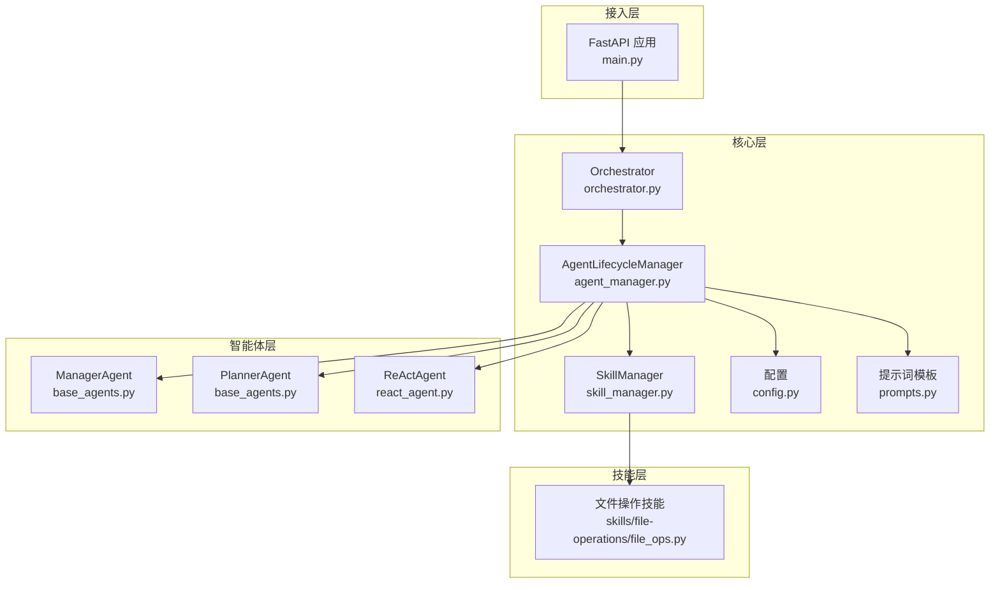
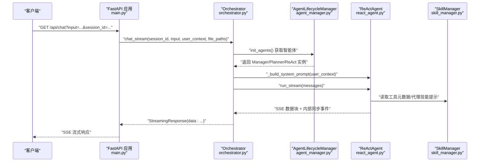
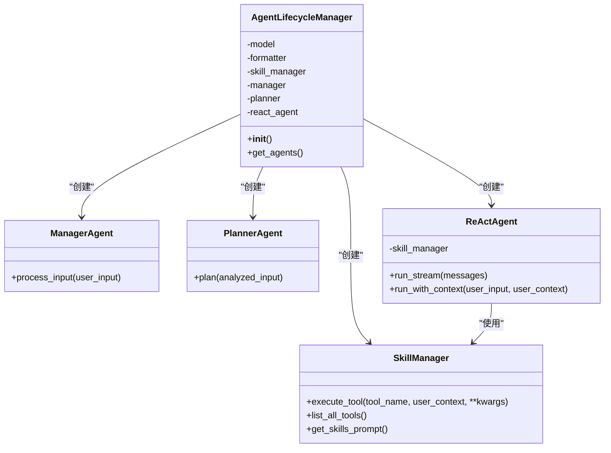
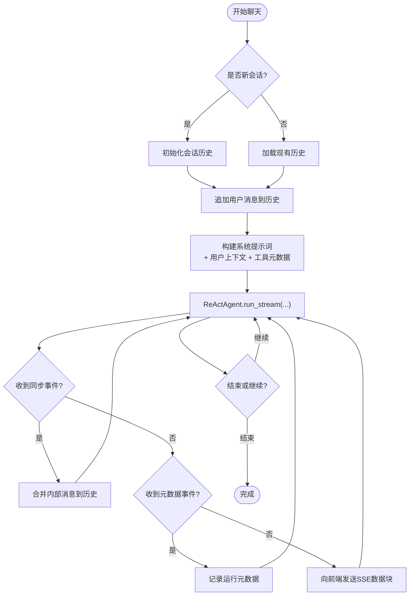
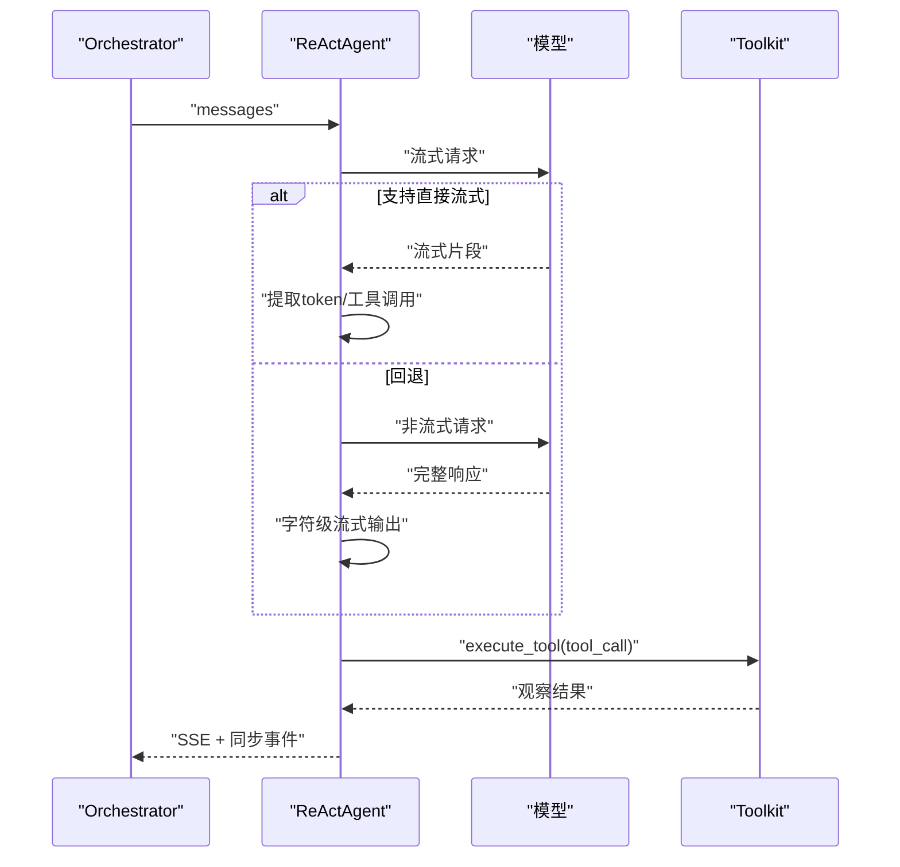
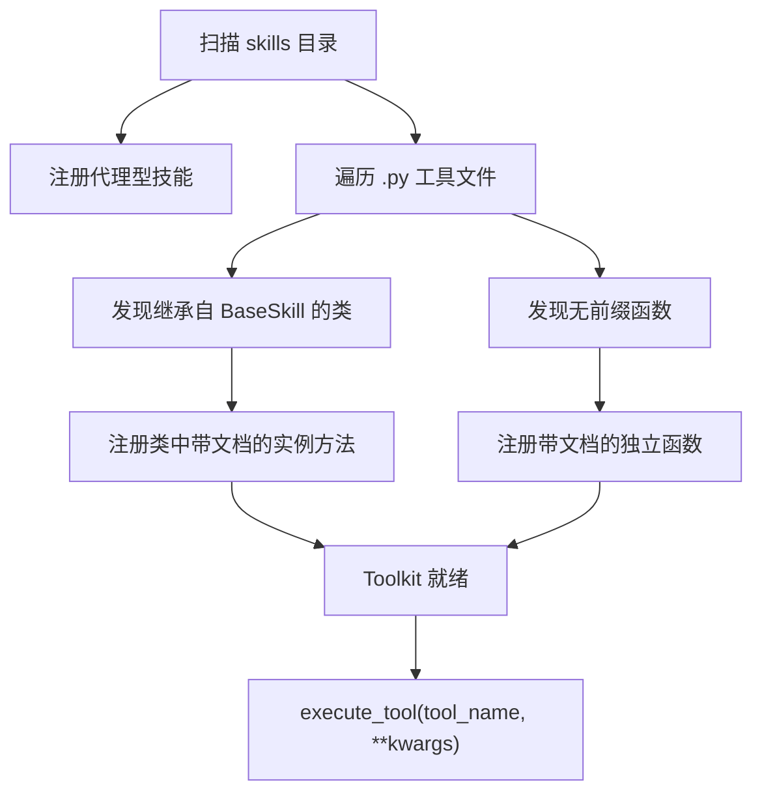
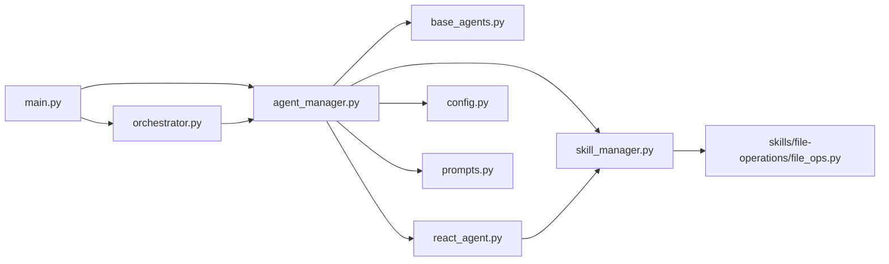

# 智能体生命周期管理

<cite>
**本文引用的文件**
- [main.py](file://localmanus-backend/main.py)
- [agent_manager.py](file://localmanus-backend/core/agent_manager.py)
- [base_agents.py](file://localmanus-backend/agents/base_agents.py)
- [react_agent.py](file://localmanus-backend/agents/react_agent.py)
- [orchestrator.py](file://localmanus-backend/core/orchestrator.py)
- [skill_manager.py](file://localmanus-backend/core/skill_manager.py)
- [prompts.py](file://localmanus-backend/core/prompts.py)
- [config.py](file://localmanus-backend/core/config.py)
- [file_ops.py](file://localmanus-backend/skills/file-operations/file_ops.py)
- [requirements.txt](file://localmanus-backend/requirements.txt)
</cite>

## 目录
1. [引言](#引言)
2. [项目结构](#项目结构)
3. [核心组件](#核心组件)
4. [架构总览](#架构总览)
5. [详细组件分析](#详细组件分析)
6. [依赖关系分析](#依赖关系分析)
7. [性能考量](#性能考量)
8. [故障排查指南](#故障排查指南)
9. [结论](#结论)
10. [附录](#附录)

## 引言
本技术文档围绕智能体生命周期管理展开，系统性阐述智能体的创建、初始化、运行与销毁流程；深入解析 AgentLifecycleManager 的职责与实现机制（含实例化、状态监控与资源管理）；说明智能体之间的协调机制、通信协议与消息路由；给出配置管理、故障恢复策略与性能监控方法；并提供最佳实践、调试技巧与扩展指南。文档以实际源码为依据，辅以可视化图示帮助不同背景读者理解。

## 项目结构
后端采用分层与功能模块化组织方式：
- 核心层：负责智能体生命周期管理、编排调度、技能管理与提示词模板
- 智能体层：基础智能体与 ReAct 智能体实现
- 技能层：工具函数与代理型技能注册
- 接入层：FastAPI 提供 REST/SSE/WebSocket 接口

图表来源
- [main.py](file://localmanus-backend/main.py#L34-L40)
- [agent_manager.py](file://localmanus-backend/core/agent_manager.py#L11-L36)
- [orchestrator.py](file://localmanus-backend/core/orchestrator.py#L11-L14)
- [skill_manager.py](file://localmanus-backend/core/skill_manager.py#L18-L27)
- [prompts.py](file://localmanus-backend/core/prompts.py#L1-L75)
- [config.py](file://localmanus-backend/core/config.py#L6-L22)
- [base_agents.py](file://localmanus-backend/agents/base_agents.py#L6-L41)
- [react_agent.py](file://localmanus-backend/agents/react_agent.py#L20-L35)
- [file_ops.py](file://localmanus-backend/skills/file-operations/file_ops.py#L9-L165)

章节来源
- [main.py](file://localmanus-backend/main.py#L34-L40)
- [agent_manager.py](file://localmanus-backend/core/agent_manager.py#L11-L36)
- [orchestrator.py](file://localmanus-backend/core/orchestrator.py#L11-L14)
- [skill_manager.py](file://localmanus-backend/core/skill_manager.py#L18-L27)
- [prompts.py](file://localmanus-backend/core/prompts.py#L1-L75)
- [config.py](file://localmanus-backend/core/config.py#L6-L22)
- [base_agents.py](file://localmanus-backend/agents/base_agents.py#L6-L41)
- [react_agent.py](file://localmanus-backend/agents/react_agent.py#L20-L35)
- [file_ops.py](file://localmanus-backend/skills/file-operations/file_ops.py#L9-L165)

## 核心组件
- AgentLifecycleManager：统一初始化 AgentScope、模型、格式化器、内存、技能管理器与核心智能体实例，提供全局访问入口
- Orchestrator：会话管理、SSE 流式输出、历史同步、JSON 解析、工作流编排
- ManagerAgent/PlannerAgent：标准化输入与任务规划
- ReActAgent：基于 AgentScope 的 ReAct 循环，支持实时流式输出、工具调用与上下文同步
- SkillManager：扫描 skills 目录，注册代理型技能与工具函数，提供工具执行与元数据导出
- 配置与提示词：集中管理模型配置、系统提示词模板

章节来源
- [agent_manager.py](file://localmanus-backend/core/agent_manager.py#L11-L48)
- [orchestrator.py](file://localmanus-backend/core/orchestrator.py#L11-L96)
- [base_agents.py](file://localmanus-backend/agents/base_agents.py#L6-L41)
- [react_agent.py](file://localmanus-backend/agents/react_agent.py#L20-L349)
- [skill_manager.py](file://localmanus-backend/core/skill_manager.py#L18-L143)
- [prompts.py](file://localmanus-backend/core/prompts.py#L1-L75)
- [config.py](file://localmanus-backend/core/config.py#L6-L22)

## 架构总览
系统通过 FastAPI 提供 REST 与 SSE 接口，Orchestrator 统一编排 Manager/Planner/ReAct 三类智能体，ReActAgent 在运行时动态构建系统提示词并进行推理与行动（工具调用），SkillManager 注册工具与代理型技能，AgentLifecycleManager 负责全局生命周期与资源管理。

图表来源
- [main.py](file://localmanus-backend/main.py#L392-L420)
- [orchestrator.py](file://localmanus-backend/core/orchestrator.py#L16-L96)
- [agent_manager.py](file://localmanus-backend/core/agent_manager.py#L44-L48)
- [react_agent.py](file://localmanus-backend/agents/react_agent.py#L53-L215)
- [skill_manager.py](file://localmanus-backend/core/skill_manager.py#L140-L143)

## 详细组件分析

### AgentLifecycleManager 生命周期与资源管理
职责与实现要点：
- 初始化 AgentScope 运行环境
- 从配置加载模型参数（名称、密钥、基础地址等），支持环境变量回退
- 构造格式化器与技能管理器
- 实例化 ManagerAgent、PlannerAgent、ReActAgent 并注入共享依赖
- 提供全局访问入口，避免重复初始化

图表来源
- [agent_manager.py](file://localmanus-backend/core/agent_manager.py#L11-L36)
- [base_agents.py](file://localmanus-backend/agents/base_agents.py#L6-L41)
- [react_agent.py](file://localmanus-backend/agents/react_agent.py#L20-L35)
- [skill_manager.py](file://localmanus-backend/core/skill_manager.py#L18-L27)

章节来源
- [agent_manager.py](file://localmanus-backend/core/agent_manager.py#L11-L48)
- [config.py](file://localmanus-backend/core/config.py#L6-L16)

### 智能体间协调机制与消息路由
- 会话管理：Orchestrator 维护 session_id 到消息历史的映射，确保多轮对话上下文一致
- 协调流程：ManagerAgent 标准化用户输入；PlannerAgent 基于可用技能生成动态任务 DAG；ReActAgent 执行推理与工具调用
- 内部协议：SSE 数据块中区分前端可见内容与内部同步/元数据事件，保证历史一致性与可观测性
- 文件路径上下文：当提供上传文件路径时，自动注入系统提示词，增强 ReActAgent 的上下文感知能力

图表来源
- [orchestrator.py](file://localmanus-backend/core/orchestrator.py#L16-L96)
- [react_agent.py](file://localmanus-backend/agents/react_agent.py#L53-L215)

章节来源
- [orchestrator.py](file://localmanus-backend/core/orchestrator.py#L16-L96)

### ReActAgent 推理与工具调用
- 系统提示词构建：动态拼接当前时间、用户信息、技能提示与工具元数据
- 流式输出：优先尝试模型直接流式输出，失败则回退为完整响应字符级流式
- 工具调用：从流式片段提取工具调用，若不可得则回退解析结构化消息中的工具调用
- 上下文同步：在内部事件中同步新增消息，确保后续调用保持上下文连贯

图表来源
- [react_agent.py](file://localmanus-backend/agents/react_agent.py#L53-L215)
- [skill_manager.py](file://localmanus-backend/core/skill_manager.py#L90-L134)

章节来源
- [react_agent.py](file://localmanus-backend/agents/react_agent.py#L20-L349)
- [skill_manager.py](file://localmanus-backend/core/skill_manager.py#L90-L134)

### 技能管理与工具注册
- 目录扫描：自动发现代理型技能目录与工具函数文件
- 注册策略：代理型技能通过目录内特定文件注册；工具函数通过类方法或独立函数注册
- 执行机制：根据函数签名注入 user_id/user_context 参数，统一异步执行并聚合响应
- 元数据导出：提供工具 JSON Schema 与代理技能提示，供 ReActAgent 动态拼装系统提示词

图表来源
- [skill_manager.py](file://localmanus-backend/core/skill_manager.py#L29-L88)
- [file_ops.py](file://localmanus-backend/skills/file-operations/file_ops.py#L9-L165)

章节来源
- [skill_manager.py](file://localmanus-backend/core/skill_manager.py#L18-L143)
- [file_ops.py](file://localmanus-backend/skills/file-operations/file_ops.py#L9-L165)

### 配置管理与环境变量
- 模型配置：支持多配置项，优先使用环境变量回退，便于本地与生产切换
- 服务器配置：主机与端口集中定义，便于部署调整
- 提示词模板：集中维护系统提示词，确保智能体行为一致性

章节来源
- [config.py](file://localmanus-backend/core/config.py#L6-L22)
- [prompts.py](file://localmanus-backend/core/prompts.py#L1-L75)

## 依赖关系分析
- 组件耦合：AgentLifecycleManager 作为“容器”，向上提供智能体实例；Orchestrator 依赖其提供的实例；ReActAgent 依赖 SkillManager；SkillManager 依赖 Toolkit
- 外部依赖：FastAPI、AgentScope、Python 标准库与第三方工具库
- 可能的循环依赖：当前结构清晰，未见循环导入

图表来源
- [main.py](file://localmanus-backend/main.py#L34-L40)
- [agent_manager.py](file://localmanus-backend/core/agent_manager.py#L11-L36)
- [orchestrator.py](file://localmanus-backend/core/orchestrator.py#L11-L14)
- [skill_manager.py](file://localmanus-backend/core/skill_manager.py#L18-L27)
- [react_agent.py](file://localmanus-backend/agents/react_agent.py#L20-L35)
- [base_agents.py](file://localmanus-backend/agents/base_agents.py#L6-L41)
- [config.py](file://localmanus-backend/core/config.py#L6-L22)
- [prompts.py](file://localmanus-backend/core/prompts.py#L1-L75)
- [file_ops.py](file://localmanus-backend/skills/file-operations/file_ops.py#L9-L165)

章节来源
- [requirements.txt](file://localmanus-backend/requirements.txt#L1-L14)

## 性能考量
- 流式输出优化：优先使用模型直接流式接口，降低首字节延迟；回退策略保证兼容性
- 工具调用并发：当前工具执行为阻塞等待，建议在工具层引入并发控制与超时策略
- 历史长度限制：会话历史上限可防止上下文过长导致性能下降
- 缓存与复用：模型与格式化器实例单例化，减少重复初始化开销
- 日志与指标：在关键路径增加日志与指标埋点，便于定位瓶颈

## 故障排查指南
- API 密钥与模型地址：检查环境变量与配置文件，确认模型可用性
- SSE 连接中断：关注 Orchestrator 的异常捕获与错误消息封装
- 工具执行失败：查看 SkillManager 的工具注册与签名匹配，确认 user_id/user_context 注入
- 会话历史异常：确认内部同步事件是否正确合并至历史
- 文件读写问题：核对上传目录权限与路径合法性

章节来源
- [config.py](file://localmanus-backend/core/config.py#L6-L16)
- [orchestrator.py](file://localmanus-backend/core/orchestrator.py#L92-L96)
- [skill_manager.py](file://localmanus-backend/core/skill_manager.py#L90-L134)
- [file_ops.py](file://localmanus-backend/skills/file-operations/file_ops.py#L64-L85)

## 结论
该系统通过 AgentLifecycleManager 统一管理智能体生命周期，结合 Orchestrator 的编排能力与 ReActAgent 的推理-行动闭环，实现了从输入标准化、任务规划到工具执行的完整链路。SkillManager 提供灵活的技能扩展机制，配合集中式配置与提示词模板，确保系统可维护性与可扩展性。建议在工具执行层面引入并发与超时控制，并在关键路径增加可观测性指标，持续优化用户体验与系统稳定性。

## 附录
- 最佳实践
  - 使用环境变量管理敏感配置，避免硬编码
  - 将工具函数与代理型技能按领域拆分目录，便于维护
  - 对外暴露的 SSE/WS 接口需严格校验输入与会话状态
  - 定期清理上传目录与数据库冗余文件
- 调试技巧
  - 开启详细日志，定位流式输出与工具调用阶段的问题
  - 使用测试脚本模拟工作流，快速验证编排逻辑
  - 在 WebSocket 场景下模拟 ReAct 步骤，辅助前端联调
- 扩展指南
  - 新增工具：在 skills 目录添加 .py 文件或代理型技能目录
  - 新增智能体：在 agents 目录实现并注册到 AgentLifecycleManager
  - 新增提示词：在 prompts 中维护模板，ReActAgent 自动拼装
  - 新增模型：在 config 中新增配置项并通过环境变量覆盖