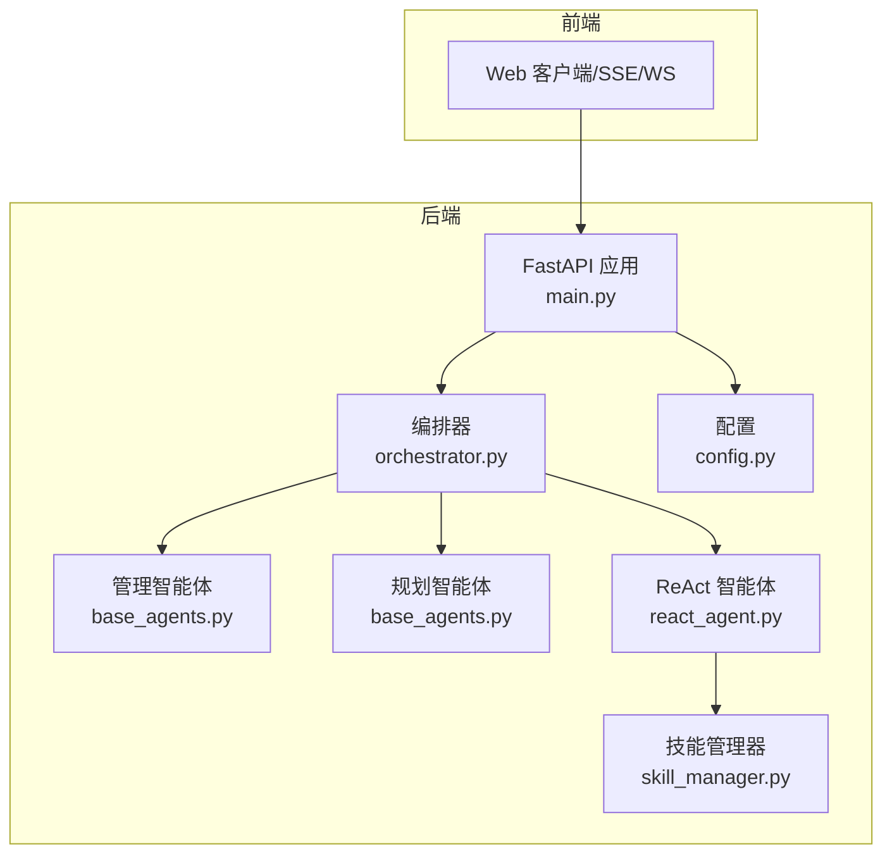
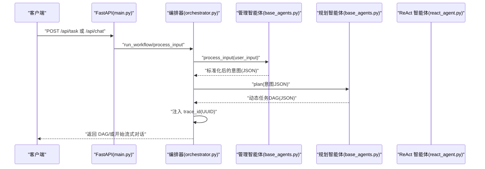
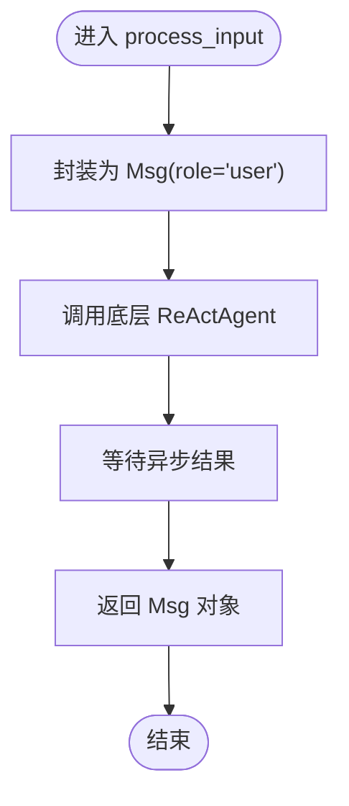
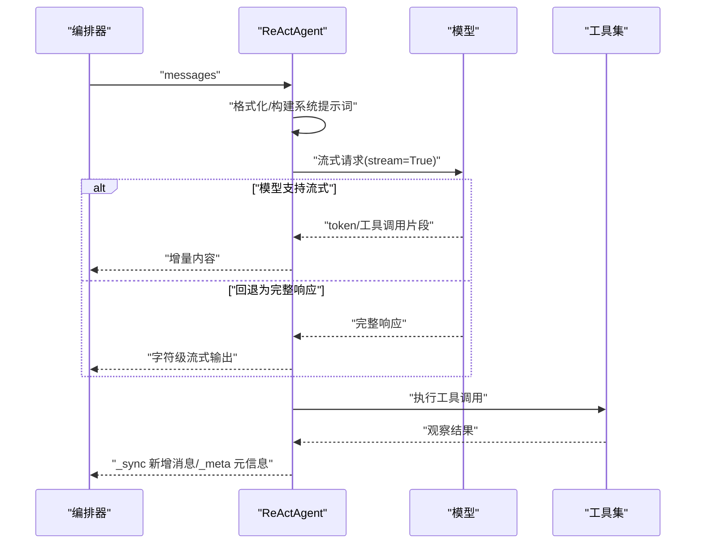
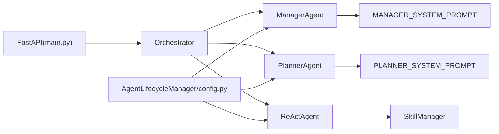

# 管理智能体（Manager Agent）

<cite>
**本文引用的文件列表**
- [react_agent.py](file://localmanus-backend/agents/react_agent.py)
- [base_agents.py](file://localmanus-backend/agents/base_agents.py)
- [prompts.py](file://localmanus-backend/core/prompts.py)
- [orchestrator.py](file://localmanus-backend/core/orchestrator.py)
- [agent_manager.py](file://localmanus-backend/core/agent_manager.py)
- [skill_manager.py](file://localmanus-backend/core/skill_manager.py)
- [config.py](file://localmanus-backend/core/config.py)
- [main.py](file://localmanus-backend/main.py)
- [file_ops.py](file://localmanus-backend/skills/file-operations/file_ops.py)
</cite>

## 目录
1. [简介](#简介)
2. [项目结构](#项目结构)
3. [核心组件](#核心组件)
4. [架构总览](#架构总览)
5. [详细组件分析](#详细组件分析)
6. [依赖关系分析](#依赖关系分析)
7. [性能考虑](#性能考虑)
8. [故障排查指南](#故障排查指南)
9. [结论](#结论)
10. [附录：配置与使用模式](#附录配置与使用模式)

## 简介
本文件面向“管理智能体（Manager Agent）”的实现与使用，重点阐述以下方面：
- 输入标准化机制：用户输入的预处理、格式转换与会话TraceID管理
- ReActAgent 初始化配置、系统提示词（MANAGER_SYSTEM_PROMPT）的作用与消息格式
- process_input 方法的工作流程：Msg 消息对象的创建、异步处理机制与响应返回
- 智能体配置参数说明、性能优化建议与常见问题解决方案
- 实际代码示例与使用模式（通过文件路径引用而非直接粘贴代码）

## 项目结构
后端采用模块化分层设计：
- agents 层：封装具体智能体（Manager、Planner、ReAct）
- core 层：编排器、提示词模板、模型与工具管理、配置
- skills 层：可插拔工具与技能注册
- main.py：FastAPI 入口，提供 SSE/WS 接口与业务路由

图表来源
- [main.py](file://localmanus-backend/main.py#L392-L421)
- [orchestrator.py](file://localmanus-backend/core/orchestrator.py#L11-L96)
- [base_agents.py](file://localmanus-backend/agents/base_agents.py#L6-L42)
- [react_agent.py](file://localmanus-backend/agents/react_agent.py#L20-L349)
- [skill_manager.py](file://localmanus-backend/core/skill_manager.py#L18-L143)
- [config.py](file://localmanus-backend/core/config.py#L8-L22)

章节来源
- [main.py](file://localmanus-backend/main.py#L392-L421)
- [orchestrator.py](file://localmanus-backend/core/orchestrator.py#L11-L96)

## 核心组件
- 管理智能体（ManagerAgent）：负责将用户输入标准化为结构化意图，作为系统入口与上下文维护者
- 规划智能体（PlannerAgent）：基于意图生成动态任务 DAG，并注入 TraceID
- ReAct 智能体（ReActAgent）：遵循 ReAct 思维与行动范式，支持流式输出与工具调用
- 编排器（Orchestrator）：会话管理、消息历史同步、SSE/WS 输出协议
- 技能管理器（SkillManager）：自动扫描 skills 目录，注册工具函数与 AgentSkill
- 配置管理（AgentLifecycleManager + config.py）：模型实例化、格式化器、内存与工具集初始化

章节来源
- [base_agents.py](file://localmanus-backend/agents/base_agents.py#L6-L42)
- [react_agent.py](file://localmanus-backend/agents/react_agent.py#L20-L349)
- [orchestrator.py](file://localmanus-backend/core/orchestrator.py#L11-L96)
- [skill_manager.py](file://localmanus-backend/core/skill_manager.py#L18-L143)
- [agent_manager.py](file://localmanus-backend/core/agent_manager.py#L11-L49)
- [config.py](file://localmanus-backend/core/config.py#L8-L22)

## 架构总览
管理智能体在整体工作流中的职责与交互如下：

图表来源
- [main.py](file://localmanus-backend/main.py#L422-L439)
- [orchestrator.py](file://localmanus-backend/core/orchestrator.py#L97-L113)
- [base_agents.py](file://localmanus-backend/agents/base_agents.py#L19-L22)

## 详细组件分析

### 管理智能体（ManagerAgent）与输入标准化
- 初始化配置
  - 使用 AgentScope 的 ReActAgent 作为底层能力，传入系统提示词（MANAGER_SYSTEM_PROMPT）、模型与格式化器
  - 通过 Msg 对象承载用户输入，确保后续链路统一的消息格式
- 输入标准化流程
  - 将原始用户输入包装为 Msg（role=user），交由底层 ReActAgent 处理
  - 返回值为标准的 Msg 对象，其中 content 为结构化 JSON 字符串（包含 intent、entities、context）
- 会话与 TraceID
  - 当前实现中，ManagerAgent 不直接维护 TraceID；TraceID 在规划阶段由编排器注入到 DAG 中
  - 若需在 Manager 层维护 TraceID，可在 process_input 前后增加 UUID 生成与传递逻辑

章节来源
- [base_agents.py](file://localmanus-backend/agents/base_agents.py#L6-L22)
- [prompts.py](file://localmanus-backend/core/prompts.py#L3-L16)
- [orchestrator.py](file://localmanus-backend/core/orchestrator.py#L97-L113)

### ReAct 智能体（ReActAgent）初始化与系统提示词
- 初始化
  - 继承自 AgentScope 的 ReActAgent，注入 toolkit（由 SkillManager 提供）
  - 通过 _build_system_prompt 动态拼装系统提示词，包含当前时间、用户信息、技能说明与工具元数据
- 系统提示词（MANAGER_SYSTEM_PROMPT）作用
  - 明确管理智能体的角色边界：标准化请求、维护上下文、必要时提出澄清问题
  - 输出格式约束：要求返回 intent、entities、context 的 JSON 结构
- 消息格式
  - 使用 Msg 对象承载消息，支持多轮历史与系统提示词组合
  - 与 Orchestrator 协议配合，内部使用 _sync 同步消息到会话历史，_meta 传递运行元信息

章节来源
- [react_agent.py](file://localmanus-backend/agents/react_agent.py#L20-L51)
- [prompts.py](file://localmanus-backend/core/prompts.py#L3-L16)
- [orchestrator.py](file://localmanus-backend/core/orchestrator.py#L40-L89)

### process_input 方法工作流程
- 输入预处理
  - 将字符串输入封装为 Msg（role=user），交由底层 ReActAgent
- 异步处理
  - 底层 ReActAgent 支持异步调用，process_input 返回 awaitable 的 Msg 对象
- 响应返回
  - 返回的 Msg 对象包含结构化 content（JSON），供后续 Planner 使用
- 与编排器集成
  - Orchestrator.run_workflow 调用 manager.process_input，解析 JSON 并继续规划流程

图表来源
- [base_agents.py](file://localmanus-backend/agents/base_agents.py#L19-L22)

章节来源
- [base_agents.py](file://localmanus-backend/agents/base_agents.py#L19-L22)

### ReActAgent.run_stream 流程与工具调用
- 格式化与消息构建
  - 支持 formatter.format 的异步/同步适配，确保 messages 符合模型输入格式
  - 将系统提示词与历史消息合并为完整 messages 列表
- 流式输出策略
  - 优先尝试模型原生流式接口，若失败则回退为完整响应字符级流式输出
  - 从流式块中提取 token 与工具调用片段，提升实时性
- 工具执行
  - 若检测到工具调用，逐个执行并返回观察结果，写入上下文
  - 通过内部协议 _sync 同步新增消息，_meta 传递运行元信息
- 错误处理
  - 捕获异常并以错误消息形式反馈给前端

图表来源
- [react_agent.py](file://localmanus-backend/agents/react_agent.py#L53-L215)
- [skill_manager.py](file://localmanus-backend/core/skill_manager.py#L90-L135)

章节来源
- [react_agent.py](file://localmanus-backend/agents/react_agent.py#L53-L215)
- [skill_manager.py](file://localmanus-backend/core/skill_manager.py#L90-L135)

### 技能管理与工具注册
- 自动发现与注册
  - 扫描 skills 目录，注册两类技能：
    - AgentSkill：目录含 SKILL.md 的技能包
    - 工具函数：.py 文件中带文档字符串的公开函数或 BaseSkill 子类的方法
- 工具执行
  - 通过 Toolkit.call_tool_function 执行，支持注入 user_id、user_context 等上下文参数
  - 返回 ToolResponse，统一为文本块列表

章节来源
- [skill_manager.py](file://localmanus-backend/core/skill_manager.py#L29-L89)
- [skill_manager.py](file://localmanus-backend/core/skill_manager.py#L90-L135)
- [file_ops.py](file://localmanus-backend/skills/file-operations/file_ops.py#L24-L86)

## 依赖关系分析
- 模块耦合
  - ManagerAgent/PlannerAgent 依赖 AgentScope ReActAgent 与系统提示词
  - ReActAgent 依赖 SkillManager 的 toolkit 与格式化器
  - Orchestrator 依赖 Manager/Planner/ReAct 三者，负责会话与输出协议
- 外部依赖
  - AgentScope：模型、格式化器、消息、工具集
  - FastAPI：SSE/WS 接口与认证
  - 环境变量：OPENAI_API_KEY、OPENAI_API_BASE、MODEL_NAME 等

图表来源
- [base_agents.py](file://localmanus-backend/agents/base_agents.py#L6-L42)
- [react_agent.py](file://localmanus-backend/agents/react_agent.py#L20-L35)
- [orchestrator.py](file://localmanus-backend/core/orchestrator.py#L11-L15)
- [agent_manager.py](file://localmanus-backend/core/agent_manager.py#L11-L49)
- [config.py](file://localmanus-backend/core/config.py#L8-L22)

章节来源
- [base_agents.py](file://localmanus-backend/agents/base_agents.py#L6-L42)
- [react_agent.py](file://localmanus-backend/agents/react_agent.py#L20-L35)
- [orchestrator.py](file://localmanus-backend/core/orchestrator.py#L11-L15)
- [agent_manager.py](file://localmanus-backend/core/agent_manager.py#L11-L49)
- [config.py](file://localmanus-backend/core/config.py#L8-L22)

## 性能考虑
- 流式输出优先
  - 优先使用模型原生流式接口，减少首字延迟；若不支持则回退为字符级流式输出
- 工具调用优化
  - 从流式块中提取工具调用片段，避免二次解析；若无流式支持再进行结构化解析
- 会话历史控制
  - 编排器限制最大轮次，防止历史过长导致上下文溢出
- 模型与格式化器
  - 使用 OpenAIChatFormatter 与 OpenAIChatModel，确保消息格式与流式兼容
- I/O 与并发
  - 工具执行为阻塞式，建议在工具内部尽量异步化（如文件读写）并合理限流

章节来源
- [react_agent.py](file://localmanus-backend/agents/react_agent.py#L53-L215)
- [orchestrator.py](file://localmanus-backend/core/orchestrator.py#L34-L38)

## 故障排查指南
- 输入未被标准化
  - 现象：ManagerAgent 返回非 JSON 或字段缺失
  - 排查：确认系统提示词 MANAGER_SYSTEM_PROMPT 是否正确注入；检查底层 ReActAgent 的格式化器是否生效
- 工具未被识别
  - 现象：ReActAgent 报错“工具不存在”
  - 排查：确认工具函数已注册（文档字符串存在）；检查 skills 目录结构与文件命名
- 流式输出异常
  - 现象：前端无增量输出或报错
  - 排查：确认模型支持 stream 参数；检查 _extract_token_from_chunk 的兼容性
- 会话历史不同步
  - 现象：前端显示不完整的历史
  - 排查：确认 Orchestrator 是否收到 _sync 事件并追加到 sessions
- 认证与权限
  - 现象：SSE/WS 请求 401
  - 排查：确认访问令牌有效且已通过依赖注入获取当前用户

章节来源
- [prompts.py](file://localmanus-backend/core/prompts.py#L3-L16)
- [react_agent.py](file://localmanus-backend/agents/react_agent.py#L216-L290)
- [skill_manager.py](file://localmanus-backend/core/skill_manager.py#L90-L135)
- [orchestrator.py](file://localmanus-backend/core/orchestrator.py#L72-L96)

## 结论
管理智能体（Manager Agent）在系统中承担“入口与标准化”的关键角色，通过结构化输出为规划与执行奠定基础。ReActAgent 在其之上实现了强大的推理与工具调用能力，并通过流式输出提供良好的用户体验。结合编排器的会话管理与 TraceID 注入，系统形成了清晰的职责划分与可扩展的技能生态。

## 附录：配置与使用模式

### 智能体配置参数说明
- 模型配置（AgentLifecycleManager）
  - model_name：模型名称（默认从环境变量读取）
  - api_key：API 密钥（默认从环境变量读取）
  - base_url：服务端点（默认从环境变量读取）
  - streaming：启用流式输出
- 格式化器与内存
  - OpenAIChatFormatter：用于消息格式化
  - InMemoryMemory：可选的内存存储（按需启用）
- 技能管理
  - skills 目录：自动扫描并注册工具函数与 AgentSkill

章节来源
- [agent_manager.py](file://localmanus-backend/core/agent_manager.py#L20-L36)
- [config.py](file://localmanus-backend/core/config.py#L8-L22)
- [skill_manager.py](file://localmanus-backend/core/skill_manager.py#L23-L28)

### 使用模式与示例（路径引用）
- 管理智能体输入标准化
  - 调用路径：[ManagerAgent.process_input](file://localmanus-backend/agents/base_agents.py#L19-L22)
  - 返回：[Msg 对象](file://localmanus-backend/agents/base_agents.py#L21-L22)
- 规划智能体生成 DAG
  - 调用路径：[PlannerAgent.plan](file://localmanus-backend/agents/base_agents.py#L37-L40)
  - 输入：ManagerAgent 的结构化输出（JSON 字符串）
- ReAct 循环与工具调用
  - 调用路径：[ReActAgent.run_stream](file://localmanus-backend/agents/react_agent.py#L53-L215)
  - 工具执行：[SkillManager.execute_tool](file://localmanus-backend/core/skill_manager.py#L90-L135)
- SSE/WS 对接
  - SSE：[chat_sse](file://localmanus-backend/main.py#L392-L421)
  - WS：[websocket_task_stream](file://localmanus-backend/main.py#L440-L473)
- 文件操作工具示例
  - 工具函数：[file_read/read_user_file/list_user_files](file://localmanus-backend/skills/file-operations/file_ops.py#L54-L86)