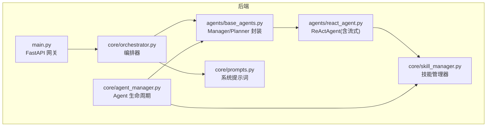
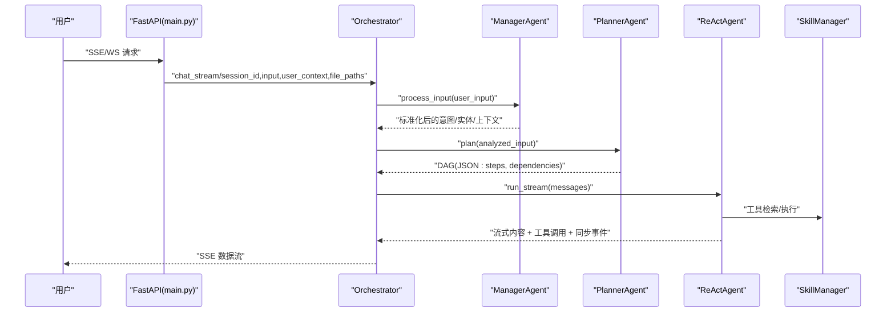
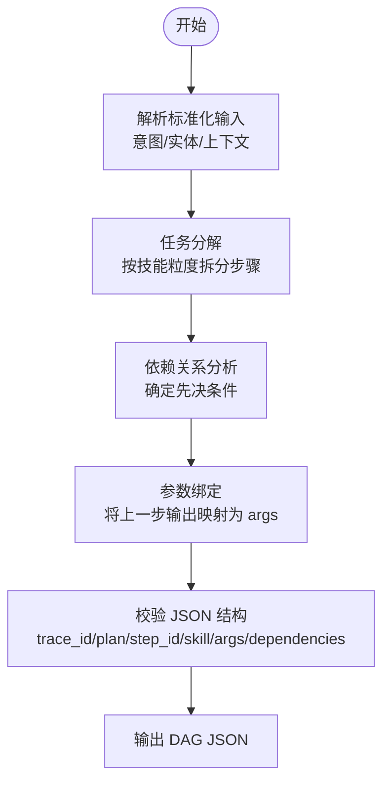
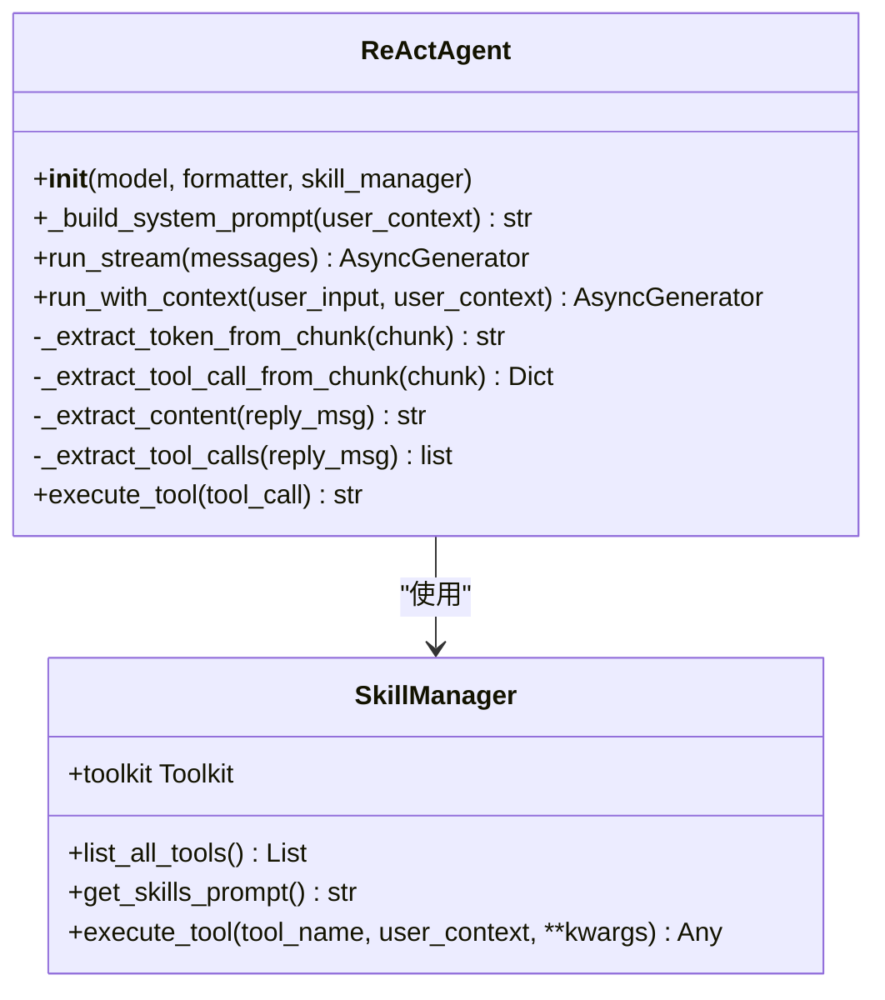
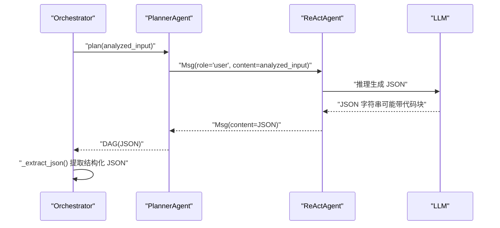
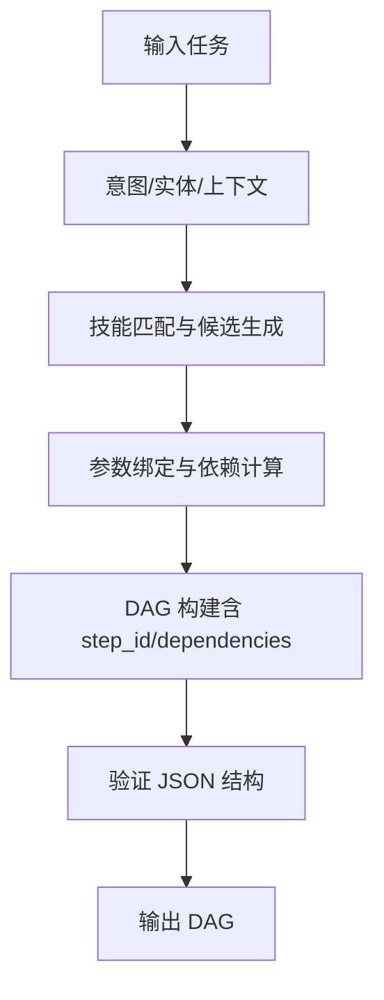
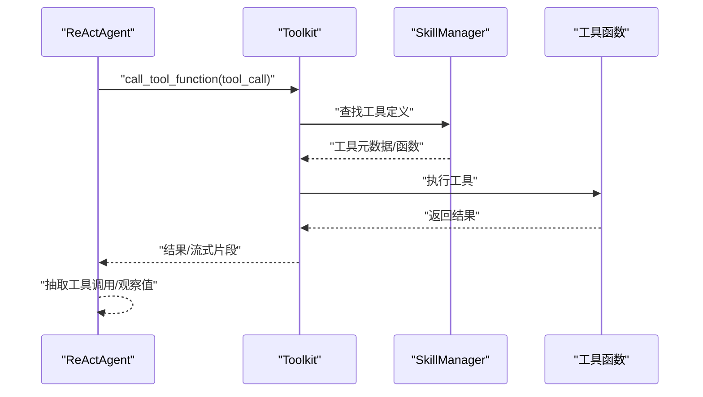
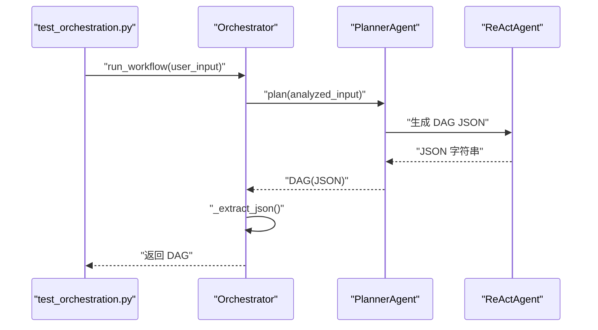
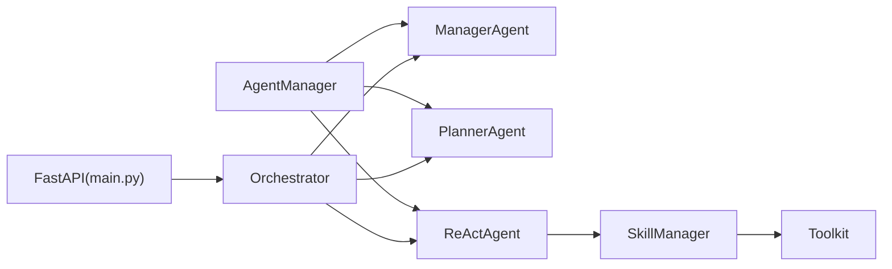

# 规划智能体 (Planner Agent)

<cite>
**本文引用的文件列表**
- [react_agent.py](file://localmanus-backend/agents/react_agent.py)
- [base_agents.py](file://localmanus-backend/agents/base_agents.py)
- [prompts.py](file://localmanus-backend/core/prompts.py)
- [orchestrator.py](file://localmanus-backend/core/orchestrator.py)
- [skill_manager.py](file://localmanus-backend/core/skill_manager.py)
- [agent_manager.py](file://localmanus-backend/core/agent_manager.py)
- [main.py](file://localmanus-backend/main.py)
- [test_orchestration.py](file://localmanus-backend/scripts/test_orchestration.py)
- [localmanus_architecture.md](file://localmanus_architecture.md)
- [localmanus_skills_roadmap.md](file://localmanus_skills_roadmap.md)
</cite>

## 目录
1. [简介](#简介)
2. [项目结构](#项目结构)
3. [核心组件](#核心组件)
4. [架构总览](#架构总览)
5. [详细组件分析](#详细组件分析)
6. [依赖关系分析](#依赖关系分析)
7. [性能考量](#性能考量)
8. [故障排查指南](#故障排查指南)
9. [结论](#结论)
10. [附录](#附录)

## 简介
本技术文档聚焦于规划智能体(Planner Agent)在 LocalManus 后端中的实现与使用，深入解释其动态DAG任务生成机制、任务分解算法、依赖关系分析与执行顺序优化。文档还详细说明 ReActAgent 的配置、系统提示词(PLANNER_SYSTEM_PROMPT)的设计原理与消息传递格式，以及 plan 方法的实现逻辑（输入分析、DAG 图构建与工具检索）。最后提供任务规划最佳实践、性能调优建议与调试方法，并给出实际代码示例与任务规划案例。

## 项目结构
LocalManus 后端采用模块化组织，围绕 AgentScope 的 ReActAgent 与自研 PlannerAgent 构建动态任务编排链路：
- agents：ReActAgent 与基础智能体封装
- core：提示词、编排器、技能管理器、Agent 生命周期管理
- scripts：测试脚本
- main.py：FastAPI 网关，提供 SSE/WS 接口与任务规划入口
- 文档：架构与技能路线图

**图表来源**
- [main.py](file://localmanus-backend/main.py#L392-L438)
- [orchestrator.py](file://localmanus-backend/core/orchestrator.py#L11-L112)
- [prompts.py](file://localmanus-backend/core/prompts.py#L18-L52)
- [skill_manager.py](file://localmanus-backend/core/skill_manager.py#L18-L143)
- [agent_manager.py](file://localmanus-backend/core/agent_manager.py#L11-L48)
- [base_agents.py](file://localmanus-backend/agents/base_agents.py#L6-L42)
- [react_agent.py](file://localmanus-backend/agents/react_agent.py#L20-L349)

**章节来源**
- [main.py](file://localmanus-backend/main.py#L392-L438)
- [orchestrator.py](file://localmanus-backend/core/orchestrator.py#L11-L112)
- [prompts.py](file://localmanus-backend/core/prompts.py#L18-L52)
- [skill_manager.py](file://localmanus-backend/core/skill_manager.py#L18-L143)
- [agent_manager.py](file://localmanus-backend/core/agent_manager.py#L11-L48)
- [base_agents.py](file://localmanus-backend/agents/base_agents.py#L6-L42)
- [react_agent.py](file://localmanus-backend/agents/react_agent.py#L20-L349)

## 核心组件
- PlannerAgent：基于 ReActAgent 的 Planner 封装，负责接收经 ManagerAgent 标准化后的输入，生成动态任务 DAG 并检索工具。
- ReActAgent：继承自 AgentScope 的 ReActAgent，提供流式响应、工具调用抽取与执行、消息同步等能力。
- SkillManager：扫描 skills 目录，注册 AgentSkill 与 ToolFunction，提供工具元数据与执行接口。
- Orchestrator：会话管理、SSE/WS 流式输出、JSON 提取、工作流编排。
- Prompts：包含 PLANNER_SYSTEM_PROMPT、REACT_AGENT_SYSTEM_PROMPT、MANAGER_SYSTEM_PROMPT 等模板。

**章节来源**
- [base_agents.py](file://localmanus-backend/agents/base_agents.py#L24-L42)
- [react_agent.py](file://localmanus-backend/agents/react_agent.py#L20-L349)
- [skill_manager.py](file://localmanus-backend/core/skill_manager.py#L18-L143)
- [orchestrator.py](file://localmanus-backend/core/orchestrator.py#L11-L112)
- [prompts.py](file://localmanus-backend/core/prompts.py#L18-L74)

## 架构总览
规划智能体在整体系统中的位置与交互如下：
- 用户通过 SSE/WS 输入请求
- Orchestrator 维护会话历史，构建系统提示词
- ManagerAgent 标准化用户输入
- PlannerAgent 生成动态 DAG（包含步骤、依赖、工具）
- ReActAgent 执行工具并流式返回中间结果
- 结果通过 SSE 返回给前端

**图表来源**
- [main.py](file://localmanus-backend/main.py#L392-L438)
- [orchestrator.py](file://localmanus-backend/core/orchestrator.py#L16-L96)
- [base_agents.py](file://localmanus-backend/agents/base_agents.py#L19-L40)
- [react_agent.py](file://localmanus-backend/agents/react_agent.py#L53-L210)
- [skill_manager.py](file://localmanus-backend/core/skill_manager.py#L90-L134)

## 详细组件分析

### PlannerAgent 与动态DAG生成
- 角色定位：接收 ManagerAgent 的标准化输入，生成动态任务 DAG，要求每个步骤绑定具体技能与参数，并通过 dependencies 表达先后关系。
- 输入处理：接收字符串形式的“意图+实体+上下文”，由 ManagerAgent 保证格式与一致性。
- 输出格式：严格遵循 PLANNER_SYSTEM_PROMPT 中的 JSON 结构，包含 trace_id、plan 数组，数组元素包含 step_id、skill、args、dependencies。
- 工具检索：PlannerAgent 本身不直接执行工具，而是通过 ReActAgent 的工具元数据与工具调用机制间接完成工具选择与参数绑定。

**图表来源**
- [prompts.py](file://localmanus-backend/core/prompts.py#L18-L52)
- [base_agents.py](file://localmanus-backend/agents/base_agents.py#L37-L40)

**章节来源**
- [base_agents.py](file://localmanus-backend/agents/base_agents.py#L24-L42)
- [prompts.py](file://localmanus-backend/core/prompts.py#L18-L52)

### ReActAgent 的配置与系统提示词
- 配置要点：
  - 使用 AgentScope 的 ReActAgent，设置 name、sys_prompt、model、formatter、toolkit
  - sys_prompt 由 _build_system_prompt 动态拼装，包含时间、用户信息、技能提示、工具元数据
  - toolkit 来自 SkillManager，支持 AgentSkill 与 ToolFunction 注册
- 系统提示词(PLANNER_SYSTEM_PROMPT)设计原则：
  - 明确角色与目标：任务分解与技能路由
  - 列举可用技能清单，限定输出为合法 JSON
  - 强调依赖关系与 step_id 编号，便于后续执行与追踪
- 消息传递格式：
  - 用户输入：Msg(role="user", content=...)
  - 系统提示：Msg(role="system", content=...)
  - Assistant 回复：支持自然语言或 ReAct 格式（思考-工具-观察-结论）

**图表来源**
- [react_agent.py](file://localmanus-backend/agents/react_agent.py#L20-L349)
- [skill_manager.py](file://localmanus-backend/core/skill_manager.py#L18-L143)

**章节来源**
- [react_agent.py](file://localmanus-backend/agents/react_agent.py#L20-L52)
- [prompts.py](file://localmanus-backend/core/prompts.py#L54-L74)
- [skill_manager.py](file://localmanus-backend/core/skill_manager.py#L18-L143)

### plan 方法实现逻辑
- 输入：ManagerAgent 标准化后的字符串（包含 intent、entities、context）
- 处理：
  - 将输入包装为 Msg(role="user")
  - 调用 ReActAgent 的异步推理，等待 PlannerAgent 的 JSON 输出
  - Orchestrator._extract_json 从可能被包裹在代码块中的响应中提取 JSON
- 输出：DAG 结构（包含 trace_id、plan 步骤数组）
- 关键点：
  - PLANNER_SYSTEM_PROMPT 严格约束输出格式，便于下游解析
  - 若 LLM 输出非 JSON，_extract_json 会返回错误对象，便于调试

**图表来源**
- [base_agents.py](file://localmanus-backend/agents/base_agents.py#L37-L40)
- [orchestrator.py](file://localmanus-backend/core/orchestrator.py#L106-L112)
- [prompts.py](file://localmanus-backend/core/prompts.py#L18-L52)

**章节来源**
- [base_agents.py](file://localmanus-backend/agents/base_agents.py#L37-L40)
- [orchestrator.py](file://localmanus-backend/core/orchestrator.py#L106-L112)
- [prompts.py](file://localmanus-backend/core/prompts.py#L18-L52)

### 动态DAG任务生成机制详解
- 任务分解算法：
  - 依据 PLANNER_SYSTEM_PROMPT 的规则，将复杂任务拆分为“步骤=技能+参数”的原子单元
  - 每个步骤必须指定 skill 与 args，且 args 可引用之前步骤的输出（通过 dependencies 映射）
- 依赖关系分析：
  - 通过 step_id 与 dependencies 字段表达拓扑顺序
  - 支持多输入依赖（并行依赖）与单输入依赖（串行依赖）
- 执行顺序优化：
  - DAG 的 step_id 顺序即执行顺序
  - 依赖越早的步骤应排在前面，避免循环依赖
  - 可根据工具可用性与资源约束进行重排（在 PlannerAgent 的推理阶段完成）

**图表来源**
- [prompts.py](file://localmanus-backend/core/prompts.py#L18-L52)
- [orchestrator.py](file://localmanus-backend/core/orchestrator.py#L114-L128)

**章节来源**
- [prompts.py](file://localmanus-backend/core/prompts.py#L18-L52)
- [orchestrator.py](file://localmanus-backend/core/orchestrator.py#L114-L128)

### 工具检索与执行机制
- 工具注册：
  - SkillManager 扫描 skills 目录，注册 AgentSkill 与 ToolFunction
  - 通过 Toolkit 暴露工具元数据与调用接口
- 工具调用：
  - ReActAgent 在流式响应中抽取工具调用（优先从流块中解析）
  - 若无流式解析，则回退到结构化消息解析
  - execute_tool 统一执行工具并返回字符串观察值
- 工具检索：
  - PlannerAgent 通过 ReActAgent 的工具元数据了解可用工具
  - args 中的输出引用（如 output_from_1）由 PlannerAgent 在 DAG 中显式声明

**图表来源**
- [react_agent.py](file://localmanus-backend/agents/react_agent.py#L216-L340)
- [skill_manager.py](file://localmanus-backend/core/skill_manager.py#L90-L134)

**章节来源**
- [react_agent.py](file://localmanus-backend/agents/react_agent.py#L216-L340)
- [skill_manager.py](file://localmanus-backend/core/skill_manager.py#L90-L134)

### 实际代码示例与任务规划案例
- 示例：PPT 转 Word 的端到端流程
  - 用户输入：“帮我把一个 PPT 转成 Word”
  - ManagerAgent 标准化为 intent/entities/context
  - PlannerAgent 生成 DAG：步骤1使用 ppt_reader，步骤2使用 word_creator，并设置 dependencies=[1]
  - Orchestrator._extract_json 提取结构化 JSON
  - 参考测试脚本中的期望结构

**图表来源**
- [test_orchestration.py](file://localmanus-backend/scripts/test_orchestration.py#L12-L56)
- [orchestrator.py](file://localmanus-backend/core/orchestrator.py#L97-L112)

**章节来源**
- [test_orchestration.py](file://localmanus-backend/scripts/test_orchestration.py#L12-L56)
- [orchestrator.py](file://localmanus-backend/core/orchestrator.py#L97-L112)

## 依赖关系分析
- 组件耦合：
  - Orchestrator 依赖 ManagerAgent、PlannerAgent、ReActAgent
  - ReActAgent 依赖 SkillManager 与 Toolkit
  - AgentManager 负责统一初始化模型、formatter、skill_manager，并产出三类 Agent
- 外部依赖：
  - AgentScope：ReActAgent、Toolkit、Msg、OpenAIChatModel/OpenAIChatFormatter
  - FastAPI：SSE/WS 接口
  - 环境变量：OPENAI_API_KEY、OPENAI_API_BASE、MODEL_NAME

**图表来源**
- [agent_manager.py](file://localmanus-backend/core/agent_manager.py#L11-L48)
- [base_agents.py](file://localmanus-backend/agents/base_agents.py#L6-L42)
- [react_agent.py](file://localmanus-backend/agents/react_agent.py#L20-L349)
- [skill_manager.py](file://localmanus-backend/core/skill_manager.py#L18-L143)
- [orchestrator.py](file://localmanus-backend/core/orchestrator.py#L11-L112)
- [main.py](file://localmanus-backend/main.py#L392-L438)

**章节来源**
- [agent_manager.py](file://localmanus-backend/core/agent_manager.py#L11-L48)
- [base_agents.py](file://localmanus-backend/agents/base_agents.py#L6-L42)
- [react_agent.py](file://localmanus-backend/agents/react_agent.py#L20-L349)
- [skill_manager.py](file://localmanus-backend/core/skill_manager.py#L18-L143)
- [orchestrator.py](file://localmanus-backend/core/orchestrator.py#L11-L112)
- [main.py](file://localmanus-backend/main.py#L392-L438)

## 性能考量
- 流式响应优化：
  - ReActAgent 优先尝试直接从模型流式获取 token 与工具调用，减少二次解析成本
  - 若模型不支持流式，回退为字符级流式输出，仍优于整段批量输出
- 工具调用解析：
  - 优先从流块中抽取工具调用，避免额外的结构化解析
  - 未命中时再回退到 Msg 对象解析
- JSON 提取：
  - Orchestrator._extract_json 支持代码块包裹的 JSON，提升鲁棒性
- 并发与会话：
  - FastAPI SSE/WS 支持多轮对话与并发会话，注意会话上限与历史长度控制

[本节为通用性能建议，无需特定文件引用]

## 故障排查指南
- JSON 解析失败：
  - 现象：_extract_json 返回错误对象
  - 排查：检查 PLANNER_SYSTEM_PROMPT 是否被正确遵循；确认 LLM 输出是否包含 JSON 代码块
- 工具调用缺失：
  - 现象：ReActAgent 流式输出中无工具调用
  - 排查：确认 SkillManager 已注册所需工具；检查 ReActAgent 的工具元数据拼装
- 会话历史溢出：
  - 现象：超过最大轮次限制
  - 排查：调整会话上限或清理历史
- API 配置问题：
  - 现象：无法连接 LLM
  - 排查：检查 OPENAI_API_KEY、OPENAI_API_BASE、MODEL_NAME 环境变量

**章节来源**
- [orchestrator.py](file://localmanus-backend/core/orchestrator.py#L34-L37)
- [react_agent.py](file://localmanus-backend/agents/react_agent.py#L148-L151)
- [skill_manager.py](file://localmanus-backend/core/skill_manager.py#L90-L134)
- [config.py](file://localmanus-backend/core/config.py#L8-L16)

## 结论
PlannerAgent 通过 PLANNER_SYSTEM_PROMPT 约束的动态DAG生成，结合 ReActAgent 的工具检索与执行能力，实现了面向复杂任务的自动化规划与执行。SkillManager 的灵活注册机制与 Toolkit 的统一抽象，使得 PlannerAgent 能够在不直接编码工具实现的前提下，完成工具选择与参数绑定。配合 Orchestrator 的会话管理与流式输出，系统具备良好的扩展性与用户体验。

[本节为总结性内容，无需特定文件引用]

## 附录
- 任务规划最佳实践
  - 明确任务边界：将复杂任务拆分为可执行的原子步骤
  - 参数规范化：使用 output_from_N 的占位符表达依赖关系
  - 依赖最小化：尽量减少不必要的串行依赖，提升并行度
  - 可观测性：在工具执行中输出结构化日志，便于前端展示
- 性能调优建议
  - 优先启用流式响应与工具调用抽取
  - 控制会话历史长度，避免上下文过长导致性能下降
  - 合理设置模型参数（温度、最大令牌数）以平衡准确性与速度
- 调试方法
  - 开启日志：关注 ReActAgent 的流式解析与工具调用抽取
  - 使用测试脚本：参考 test_orchestration.py 的期望结构进行比对
  - 检查环境变量与模型配置：确保 OPENAI_API_KEY、OPENAI_API_BASE、MODEL_NAME 正确

**章节来源**
- [localmanus_skills_roadmap.md](file://localmanus_skills_roadmap.md#L5-L10)
- [test_orchestration.py](file://localmanus_backend/scripts/test_orchestration.py#L12-L56)
- [config.py](file://localmanus-backend/core/config.py#L8-L16)