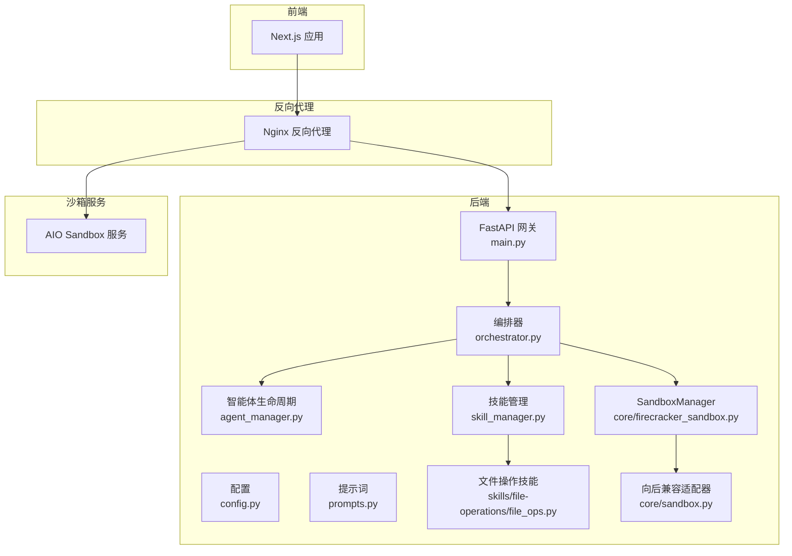
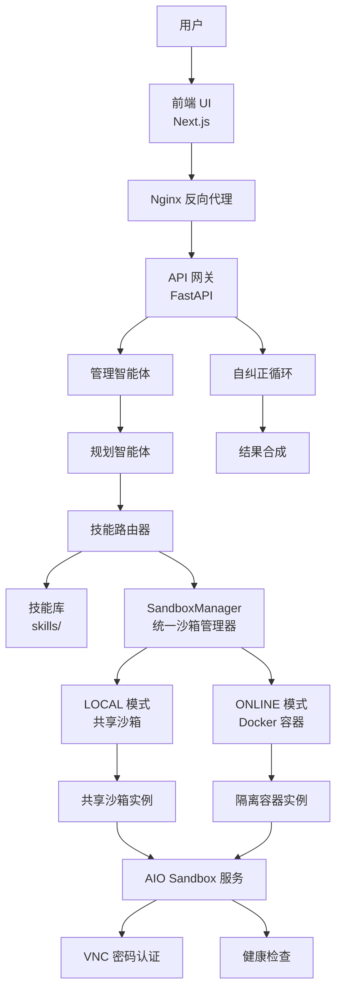
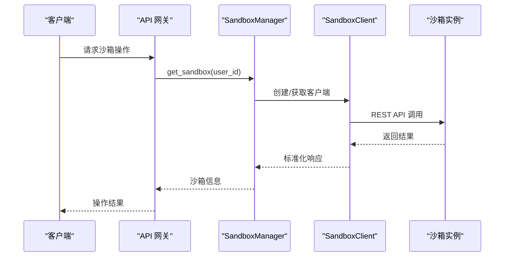
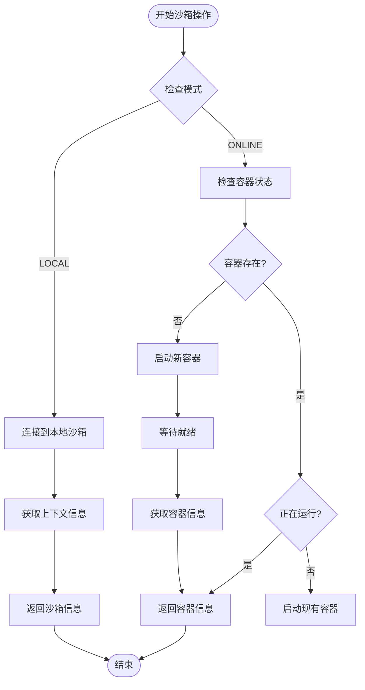
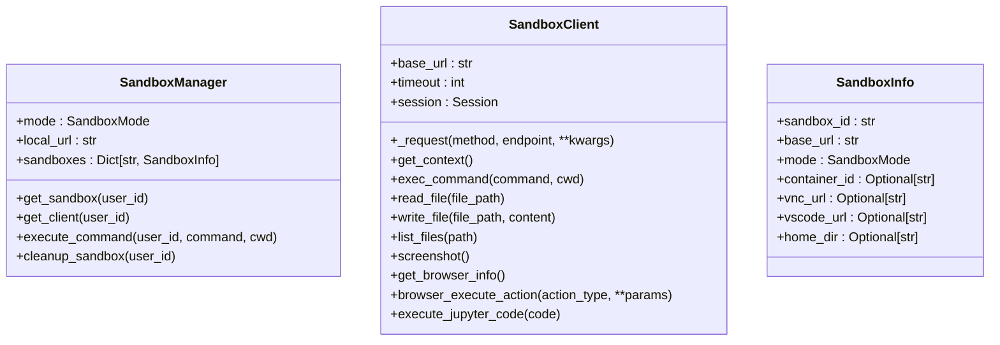
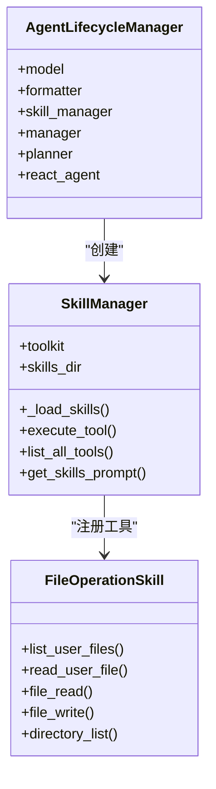
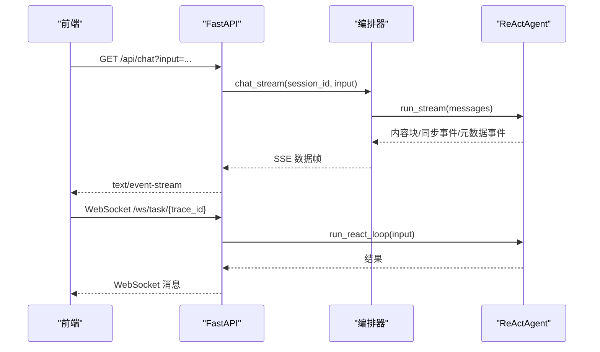
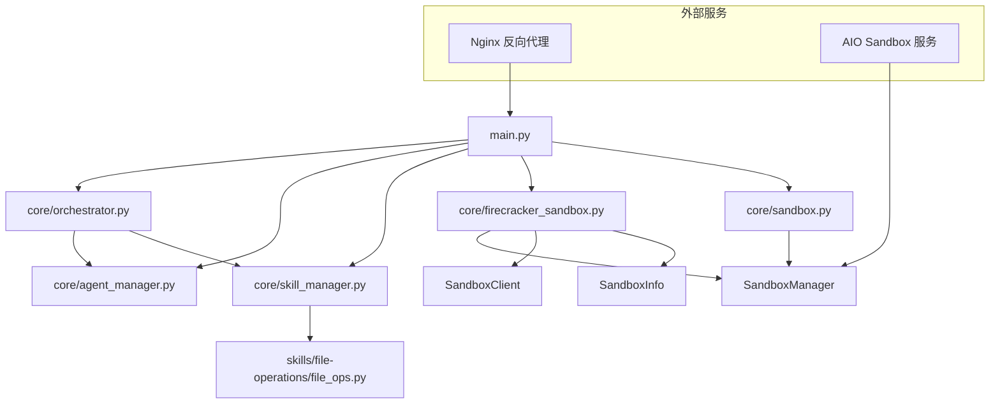

# Firecracker 沙箱执行架构

<cite>
**本文引用的文件**
- [main.py](file://localmanus-backend/main.py)
- [orchestrator.py](file://localmanus-backend/core/orchestrator.py)
- [agent_manager.py](file://localmanus-backend/core/agent_manager.py)
- [config.py](file://localmanus-backend/core/config.py)
- [prompts.py](file://localmanus-backend/core/prompts.py)
- [skill_manager.py](file://localmanus-backend/core/skill_manager.py)
- [base_agents.py](file://localmanus-backend/agents/base_agents.py)
- [file_ops.py](file://localmanus-backend/skills/file-operations/file_ops.py)
- [localmanus_architecture.md](file://localmanus_architecture.md)
- [docker-compose.yml](file://docker-compose.yml)
- [docker-compose.prod.yml](file://docker-compose.prod.yml)
- [.env.example](file://localmanus-backend/.env.example)
- [requirements.txt](file://localmanus-backend/requirements.txt)
- [firecracker_sandbox.py](file://localmanus-backend/core/firecracker_sandbox.py)
- [sandbox.py](file://localmanus-backend/core/sandbox.py)
- [firecracker_setup.sh](file://localmanus-backend/scripts/firecracker_setup.sh)
- [FIRECRACKER_TROUBLESHOOTING.md](file://localmanus-backend/scripts/FIRECRACKER_TROUBLESHOOTING.md)
- [SANDBOX_MIGRATION_GUIDE.md](file://localmanus-backend/scripts/SANDBOX_MIGRATION_GUIDE.md)
- [SANDBOX_QUICKSTART.md](file://localmanus-backend/scripts/SANDBOX_QUICKSTART.md)
- [test_sandbox.py](file://localmanus-backend/scripts/test_sandbox.py)
- [deploy-production.sh](file://deploy-production.sh)
- [deploy-with-nginx.sh](file://deploy-with-nginx.sh)
- [nginx.conf](file://nginx/nginx.conf)
- [nginx.prod.conf](file://nginx/nginx.prod.conf)
- [Dockerfile](file://localmanus-backend/Dockerfile)
</cite>

## 更新摘要
**所做更改**
- 更新架构概述以反映生产就绪的 Docker Compose 沙箱系统
- 新增生产环境配置、seccomp 设置、VNC 密码认证和健康检查机制
- 更新部署配置以包含新的 docker-compose.prod.yml 和 nginx 生产配置
- 新增生产环境部署脚本和监控配置
- 更新故障排查指南以包含新的系统特性

## 目录
1. [简介](#简介)
2. [项目结构](#项目结构)
3. [核心组件](#核心组件)
4. [架构总览](#架构总览)
5. [组件详解](#组件详解)
6. [依赖关系分析](#依赖关系分析)
7. [性能与资源优化](#性能与资源优化)
8. [故障排查指南](#故障排查指南)
9. [结论](#结论)
10. [附录](#附录)

## 简介
**更新** 本文件现面向 LocalManus 的 agent-infra/sandbox 执行架构，系统性阐述基于 Docker 容器的沙箱系统生命周期管理、双模式（本地共享/在线隔离）架构、REST API 通信机制、浏览器自动化（Playwright/CDP）、VSCode 服务器集成、Jupyter 环境支持以及 MCP 协议集成。同时提供生产就绪的部署配置、健康检查机制、VNC 密码认证、Nginx 反向代理配置、性能优化策略、资源限制配置、故障恢复机制，帮助读者快速理解并稳定落地该架构。

## 项目结构
后端采用 FastAPI 提供统一 API 网关，结合 AgentScope 的多智能体编排能力，按需调度技能（Skills）在 agent-infra/sandbox 容器环境中执行。核心目录与职责如下：
- localmanus-backend
  - main.py：API 网关入口，提供认证、文件上传、项目管理、聊天与 WebSocket 任务流等接口
  - core：编排与基础设施
    - orchestrator.py：会话管理、ReAct 流式对话、工作流编排
    - agent_manager.py：AgentScope 初始化与智能体实例化
    - config.py：模型与服务配置
    - prompts.py：系统提示词模板
    - skill_manager.py：技能注册与工具调用
    - firecracker_sandbox.py：**已重构为agent-infra/sandbox统一管理器**
    - sandbox.py：**向后兼容适配器**
  - agents：智能体实现
    - base_agents.py：Manager/Planner 基类
  - skills：技能实现示例
    - file-operations/file_ops.py：文件操作技能
  - scripts：**新增** agent-infra/sandbox 部署与排障脚本
  - docker-compose.yml：**更新** 开发环境服务编排与网络
  - docker-compose.prod.yml：**新增** 生产环境服务编排与沙箱配置
  - .env.example：**更新** 环境变量示例
  - requirements.txt：Python 依赖
- nginx：**新增** Nginx 反向代理配置
  - nginx.conf：开发环境配置
  - nginx.prod.conf：生产环境配置，包含 VNC 密码认证和健康检查



**图表来源**
- [main.py](file://localmanus-backend/main.py#L1-L476)
- [orchestrator.py](file://localmanus-backend/core/orchestrator.py#L1-L150)
- [agent_manager.py](file://localmanus-backend/core/agent_manager.py#L1-L49)
- [config.py](file://localmanus-backend/core/config.py#L1-L27)
- [prompts.py](file://localmanus-backend/core/prompts.py#L1-L75)
- [skill_manager.py](file://localmanus-backend/core/skill_manager.py#L1-L143)
- [file_ops.py](file://localmanus-backend/skills/file-operations/file_ops.py#L1-L165)
- [firecracker_sandbox.py](file://localmanus-backend/core/firecracker_sandbox.py#L1-L312)
- [sandbox.py](file://localmanus-backend/core/sandbox.py#L1-L46)
- [docker-compose.yml](file://docker-compose.yml#L1-L88)
- [docker-compose.prod.yml](file://docker-compose.prod.yml#L1-L51)

**章节来源**
- [main.py](file://localmanus-backend/main.py#L1-L476)
- [localmanus_architecture.md](file://localmanus_architecture.md#L1-L172)

## 核心组件
- API 网关（FastAPI）
  - 提供健康检查、认证、文件上传/下载/删除、项目管理、SSE 聊天、WebSocket 任务流等接口
- 编排器（Orchestrator）
  - 维护会话历史，驱动 ReAct 循环，处理内部同步事件与元数据事件，输出 SSE 流
- 智能体生命周期（AgentLifecycleManager）
  - 初始化 AgentScope、模型、格式化器与技能管理器，产出 Manager/Planner/ReActAgent
- 技能管理（SkillManager）
  - 动态扫描 skills 目录，注册 AgentSkill 与工具函数，支持异步工具调用与参数注入
- **SandboxManager（统一沙箱管理器）**
  - **LOCAL模式**：连接到现有沙箱实例，支持共享环境
  - **ONLINE模式**：按需启动 Docker 容器，提供完全隔离的用户环境
  - **向后兼容**：保持与旧代码的 API 兼容性

**章节来源**
- [main.py](file://localmanus-backend/main.py#L61-L476)
- [orchestrator.py](file://localmanus-backend/core/orchestrator.py#L11-L150)
- [agent_manager.py](file://localmanus-backend/core/agent_manager.py#L11-L49)
- [skill_manager.py](file://localmanus-backend/core/skill_manager.py#L18-L143)
- [firecracker_sandbox.py](file://localmanus-backend/core/firecracker_sandbox.py#L103-L312)
- [sandbox.py](file://localmanus-backend/core/sandbox.py#L11-L46)

## 架构总览
**更新** 下图展示 LocalManus 基于 AgentScope 的动态多智能体系统与 agent-infra/sandbox 系统的集成关系，涵盖双模式架构、REST API 通信、容器隔离与多环境支持，以及生产环境的健康检查和监控机制。



**图表来源**
- [localmanus_architecture.md](file://localmanus_architecture.md#L6-L31)
- [SANDBOX_MIGRATION_GUIDE.md](file://localmanus-backend/scripts/SANDBOX_MIGRATION_GUIDE.md#L13-L25)
- [firecracker_sandbox.py](file://localmanus-backend/core/firecracker_sandbox.py#L103-L312)
- [docker-compose.prod.yml](file://docker-compose.prod.yml#L12-L31)

## 组件详解

### agent-infra/sandbox 系统架构
**更新** 基于 agent-infra/sandbox 的全新沙箱系统，提供双模式支持和丰富的开发环境功能。

#### 双模式架构
- **LOCAL 模式（开发/共享）**
  - 连接到现有的沙箱实例（如 http://localhost:8080）
  - 无容器启动开销，即时访问
  - 共享资源，适合开发和测试
- **ONLINE 模式（生产/隔离）**
  - 为每个用户启动独立的 Docker 容器
  - 完全隔离的执行环境
  - 每个容器拥有独立的资源和权限

#### 核心组件
- **SandboxManager**：统一管理器，负责沙箱实例的创建、管理和清理
- **SandboxClient**：REST API 客户端，提供命令执行、文件操作、浏览器控制等功能
- **SandboxInfo**：沙箱实例信息的数据类，包含 URL、模式、容器 ID 等



**图表来源**
- [firecracker_sandbox.py](file://localmanus-backend/core/firecracker_sandbox.py#L103-L312)

**章节来源**
- [firecracker_sandbox.py](file://localmanus-backend/core/firecracker_sandbox.py#L103-L312)
- [SANDBOX_MIGRATION_GUIDE.md](file://localmanus-backend/scripts/SANDBOX_MIGRATION_GUIDE.md#L27-L40)

### 沙箱生命周期管理
**更新** 基于 Docker 容器的生命周期管理，支持自动启动、资源清理和状态恢复。

#### LOCAL 模式生命周期
- 连接到现有沙箱实例
- 自动检测沙箱可用性
- 获取用户家目录信息
- 提供共享资源访问

#### ONLINE 模式生命周期
- 检查是否存在现有容器
- 启动新的 Docker 容器（端口自动分配）
- 等待沙箱实例就绪
- 获取容器信息和访问 URL
- 提供资源清理功能



**图表来源**
- [firecracker_sandbox.py](file://localmanus-backend/core/firecracker_sandbox.py#L137-L203)
- [firecracker_sandbox.py](file://localmanus-backend/core/firecracker_sandbox.py#L205-L233)

**章节来源**
- [firecracker_sandbox.py](file://localmanus-backend/core/firecracker_sandbox.py#L137-L233)
- [test_sandbox.py](file://localmanus-backend/scripts/test_sandbox.py#L13-L191)

### REST API 通信机制
**更新** 基于 HTTP REST API 的通信方式，提供统一的接口规范和错误处理。

#### 核心 API 端点
- `/v1/sandbox`：获取沙箱上下文信息
- `/v1/shell/exec`：执行 shell 命令
- `/v1/file/*`：文件系统操作
- `/v1/browser/*`：浏览器自动化
- `/v1/jupyter/execute`：Jupyter 代码执行

#### SandboxClient 功能
- **命令执行**：执行 shell 命令并返回输出和退出码
- **文件操作**：读取、写入、列出文件
- **浏览器控制**：获取 CDP URL、截图、GUI 操作
- **Jupyter 集成**：在 Jupyter 内核中执行 Python 代码



**图表来源**
- [firecracker_sandbox.py](file://localmanus-backend/core/firecracker_sandbox.py#L103-L312)

**章节来源**
- [firecracker_sandbox.py](file://localmanus-backend/core/firecracker_sandbox.py#L31-L102)
- [SANDBOX_MIGRATION_GUIDE.md](file://localmanus-backend/scripts/SANDBOX_MIGRATION_GUIDE.md#L153-L177)

### 开发环境集成
**更新** 新系统提供完整的开发环境支持，包括 VSCode 服务器、Jupyter、浏览器自动化等。

#### VSCode Server
- 内置 VSCode Server，支持远程开发
- 通过 Web 界面访问 IDE
- 支持文件编辑、调试、终端等

#### Jupyter 环境
- 集成 Jupyter 内核
- 支持 Python 代码执行
- 提供交互式数据分析环境

#### 浏览器自动化
- Playwright/CDP 集成
- 支持网页浏览、截图、GUI 操作
- 提供 VNC 可视化调试

**章节来源**
- [SANDBOX_MIGRATION_GUIDE.md](file://localmanus-backend/scripts/SANDBOX_MIGRATION_GUIDE.md#L7-L11)
- [SANDBOX_QUICKSTART.md](file://localmanus-backend/scripts/SANDBOX_QUICKSTART.md#L79-L84)

### 向后兼容性
**更新** 为保持与旧代码的兼容性，系统提供了向后兼容适配器。

#### LegacySandboxAdapter
- 包装新的 SandboxManager
- 标准化返回值格式
- 保持旧的 {stdout, stderr, exit_code} 字典格式

#### 全局别名
- `firecracker_manager` 现在指向 `sandbox_manager`
- 保持现有代码无需修改即可继续使用

**章节来源**
- [sandbox.py](file://localmanus-backend/core/sandbox.py#L11-L46)
- [firecracker_sandbox.py](file://localmanus-backend/core/firecracker_sandbox.py#L292-L312)

### 智能体编排与技能系统
- Manager/Planner/ReActAgent：标准化输入、生成动态 DAG、执行工具与自纠正
- SkillManager：扫描 skills 目录，注册 AgentSkill 与工具函数，支持异步工具调用与用户上下文注入
- 示例技能：文件操作技能（读写/列出用户上传文件）



**图表来源**
- [agent_manager.py](file://localmanus-backend/core/agent_manager.py#L11-L49)
- [skill_manager.py](file://localmanus-backend/core/skill_manager.py#L18-L143)
- [file_ops.py](file://localmanus-backend/skills/file-operations/file_ops.py#L9-L165)

**章节来源**
- [agent_manager.py](file://localmanus-backend/core/agent_manager.py#L11-L49)
- [skill_manager.py](file://localmanus-backend/core/skill_manager.py#L18-L143)
- [file_ops.py](file://localmanus-backend/skills/file-operations/file_ops.py#L9-L165)

### API 工作流（SSE 与 WebSocket）
- SSE：/api/chat 支持多轮对话，内部协议包含内容块、同步事件与元数据事件
- WebSocket：/ws/task/{trace_id} 用于 ReAct 循环进度推送



**图表来源**
- [main.py](file://localmanus-backend/main.py#L392-L476)
- [orchestrator.py](file://localmanus-backend/core/orchestrator.py#L16-L96)

**章节来源**
- [main.py](file://localmanus-backend/main.py#L392-L476)
- [orchestrator.py](file://localmanus-backend/core/orchestrator.py#L16-L96)

### 生产环境配置与部署
**更新** 新增生产就绪的部署配置，包括 Docker Compose 生产配置、Nginx 反向代理、健康检查和 VNC 密码认证。

#### Docker Compose 生产配置
- **sandbox 服务**：AIO Sandbox 服务，使用 `ghcr.io/agent-infra/sandbox:1.0.0.150` 镜像
- **安全配置**：启用 `seccomp:unconfined` 安全选项
- **端口映射**：8080:8080
- **环境变量**：设置 VNC_PASSWORD=localmanus
- **健康检查**：每30秒检查一次 `/health` 端点
- **依赖关系**：backend 服务依赖 sandbox 服务健康

#### Nginx 生产配置
- **VNC 密码认证**：通过 `/vnc/` 路由转发到沙箱服务
- **WebSocket 支持**：为 noVNC 提供升级支持
- **安全头**：添加 X-Frame-Options、X-Content-Type-Options、X-XSS-Protection
- **连接保持**：启用 keepalive 连接池
- **压缩**：启用 gzip 压缩
- **限流**：API 和登录端点的速率限制

#### 健康检查机制
- **后端服务**：每30秒检查 `/api/health` 端点
- **Nginx 服务**：每30秒检查 `/health` 端点
- **沙箱服务**：每30秒检查 `/health` 端点
- **启动延迟**：后端服务启动延迟40秒，沙箱服务启动延迟60秒

**章节来源**
- [docker-compose.prod.yml](file://docker-compose.prod.yml#L1-L51)
- [nginx.prod.conf](file://nginx/nginx.prod.conf#L1-L137)
- [Dockerfile](file://localmanus-backend/Dockerfile#L43-L45)

## 依赖关系分析
**更新** 依赖关系已完全重构，移除了对 Firecracker 的依赖，新增对 agent-infra/sandbox 的依赖。

- 组件耦合
  - main.py 依赖 orchestrator、agent_manager、skill_manager、config 等模块
  - orchestrator 依赖 agent_manager 与 skill_manager，形成编排-执行闭环
  - skill_manager 依赖 skills 目录下的具体技能实现
  - **firecracker_sandbox.py**：**重构为** agent-infra/sandbox 统一管理器，向上提供沙箱生命周期管理
  - **sandbox.py**：**新增** 向后兼容适配器，保持旧代码兼容性
- 外部依赖
  - AgentScope：多智能体框架与工具注册
  - **agent-infra/sandbox**：**新增** Docker 容器沙箱系统
  - Docker：**新增** 容器运行时
  - FastAPI：**保持不变** API 网关
  - **Nginx**：**新增** 反向代理和负载均衡



**图表来源**
- [main.py](file://localmanus-backend/main.py#L1-L476)
- [orchestrator.py](file://localmanus-backend/core/orchestrator.py#L1-L150)
- [agent_manager.py](file://localmanus-backend/core/agent_manager.py#L1-L49)
- [skill_manager.py](file://localmanus-backend/core/skill_manager.py#L1-L143)
- [file_ops.py](file://localmanus-backend/skills/file-operations/file_ops.py#L1-L165)
- [firecracker_sandbox.py](file://localmanus-backend/core/firecracker_sandbox.py#L1-L312)
- [sandbox.py](file://localmanus-backend/core/sandbox.py#L1-L46)

**章节来源**
- [main.py](file://localmanus-backend/main.py#L1-L476)
- [orchestrator.py](file://localmanus-backend/core/orchestrator.py#L1-L150)
- [agent_manager.py](file://localmanus-backend/core/agent_manager.py#L1-L49)
- [skill_manager.py](file://localmanus-backend/core/skill_manager.py#L1-L143)
- [file_ops.py](file://localmanus-backend/skills/file-operations/file_ops.py#L1-L165)
- [firecracker_sandbox.py](file://localmanus-backend/core/firecracker_sandbox.py#L1-L312)
- [sandbox.py](file://localmanus-backend/core/sandbox.py#L1-L46)

## 性能与资源优化
**更新** 新系统提供了不同的性能特征和优化策略。

### LOCAL 模式性能
- **启动时间**：几乎为零，直接连接到现有沙箱
- **资源消耗**：共享资源，内存和 CPU 使用率较低
- **适用场景**：开发、测试、原型验证

### ONLINE 模式性能
- **启动时间**：约 3 秒（容器启动）
- **资源消耗**：每个容器独立资源，可配置 CPU 和内存限制
- **适用场景**：生产环境、多用户、需要隔离的场景

### 优化策略
- **容器资源限制**：通过 Docker 参数限制 CPU 和内存使用
- **容器复用**：在 ONLINE 模式下复用已存在的容器
- **连接池**：SandboxClient 使用 requests.Session 实现连接复用
- **超时配置**：可配置 API 调用超时时间
- **自动清理**：提供沙箱清理功能，防止资源泄漏
- **Nginx 优化**：启用 keepalive 连接池，减少连接建立开销
- **gzip 压缩**：启用静态文件压缩，减少带宽使用

### 监控与可观测性
- **沙箱状态监控**：定期检查沙箱可用性和健康状态
- **容器资源监控**：监控 Docker 容器的 CPU、内存、网络使用情况
- **API 调用监控**：记录 API 调用次数、响应时间和错误率
- **性能指标**：收集启动时间、执行时间、资源使用等指标
- **健康检查**：多层健康检查机制，确保系统稳定性

## 故障排查指南
**更新** 新系统提供了不同的故障排查方法和常见问题解决方案。

### LOCAL 模式故障排查
- **无法连接到沙箱**
  - 检查沙箱服务是否运行：`curl http://localhost:8080/v1/sandbox`
  - 验证网络连接和防火墙设置
  - 确认端口未被占用
- **沙箱不可用**
  - 重启沙箱服务
  - 检查沙箱日志输出
  - 验证 Docker 守护进程状态

### ONLINE 模式故障排查
- **容器启动失败**
  - 检查 Docker 服务状态：`docker ps`
  - 查看容器日志：`docker logs localmanus-sandbox-{user_id}`
  - 验证 Docker 镜像可用性
- **端口冲突**
  - 查找占用端口的进程：`lsof -i :8080`
  - 修改端口配置或释放占用端口
  - 使用自动端口分配

### 生产环境故障排查
- **Nginx 代理问题**
  - 检查 Nginx 配置：`nginx -t`
  - 查看 Nginx 错误日志：`docker logs localmanus-nginx`
  - 验证上游服务可达性
- **VNC 认证失败**
  - 检查 VNC_PASSWORD 环境变量
  - 验证 VNC 服务状态：`curl http://localhost:8080/vnc/`
  - 确认 WebSocket 升级支持
- **健康检查失败**
  - 检查各服务健康端点：`curl http://localhost:8000/api/health`
  - 查看 Docker 服务状态：`docker-compose ps`
  - 验证服务间网络连通性

### 通用故障排查
- **API 调用超时**
  - 增加超时时间配置
  - 检查网络连接稳定性
  - 验证沙箱服务响应时间
- **权限问题**
  - 确保 Docker 权限正确配置
  - 检查 seccomp 配置
  - 验证用户权限设置
- **资源不足**
  - 检查系统资源使用情况
  - 调整容器资源限制
  - 清理停止的容器

**章节来源**
- [SANDBOX_MIGRATION_GUIDE.md](file://localmanus-backend/scripts/SANDBOX_MIGRATION_GUIDE.md#L262-L304)
- [SANDBOX_QUICKSTART.md](file://localmanus-backend/scripts/SANDBOX_QUICKSTART.md#L86-L100)
- [test_sandbox.py](file://localmanus-backend/scripts/test_sandbox.py#L13-L191)

## 结论
**更新** LocalManus 通过迁移到 agent-infra/sandbox 系统，实现了从 Firecracker 微虚拟机到基于 Docker 容器的现代化沙箱架构。新系统提供了更好的易用性、更丰富的功能集和更强的可扩展性。通过双模式架构（LOCAL 和 ONLINE），系统能够在开发效率和生产安全性之间找到最佳平衡点。新的 REST API 接口简化了集成，而 VSCode Server、Jupyter、浏览器自动化等特性为用户提供了完整的开发环境。

生产环境配置进一步增强了系统的稳定性，包括健康检查机制、VNC 密码认证、Nginx 反向代理和安全配置。这些改进使得系统更适合在生产环境中部署和维护。

## 附录

### 部署配置要点
**更新** 新系统提供了简化的部署配置。

#### 环境变量
```bash
# 模型配置
OPENAI_API_KEY=your_api_key_here
OPENAI_API_BASE=http://localhost:11434/v1
MODEL_NAME=gpt-4

# 沙箱配置
SANDBOX_MODE=local          # local 或 online
SANDBOX_LOCAL_URL=http://localhost:8080
USE_CHINA_MIRROR=false      # 在中国使用镜像
```

#### Docker Compose
- 后端、前端、Nginx 反向代理的服务编排与网络
- 数据卷持久化：数据库与上传文件目录
- **新增** 沙箱容器（在 ONLINE 模式下使用）

#### agent-infra/sandbox 准备
- **LOCAL 模式**：启动沙箱容器 `docker run --security-opt seccomp=unconfined -p 8080:8080 ghcr.io/agent-infra/sandbox:latest`
- **ONLINE 模式**：系统自动管理容器生命周期
- 验证安装：`python scripts/test_sandbox.py --mode local`

#### 生产环境部署
- **部署脚本**：`deploy-with-nginx.sh` 支持开发和生产两种模式
- **Nginx 配置**：`nginx.prod.conf` 包含 VNC 密码认证和安全配置
- **健康检查**：多层健康检查确保系统稳定性

**章节来源**
- [.env.example](file://localmanus-backend/.env.example#L1-L12)
- [docker-compose.yml](file://docker-compose.yml#L1-L88)
- [docker-compose.prod.yml](file://docker-compose.prod.yml#L1-L51)
- [SANDBOX_QUICKSTART.md](file://localmanus-backend/scripts/SANDBOX_QUICKSTART.md#L5-L32)
- [deploy-with-nginx.sh](file://deploy-with-nginx.sh#L1-L185)

### 监控指标建议
**更新** 新系统提供了不同的监控指标。

#### 后端服务
- 健康检查、请求延迟、错误率、并发连接数
- **新增** 沙箱连接数、API 调用成功率

#### 沙箱系统
- **LOCAL 模式**：连接池状态、共享资源使用率
- **ONLINE 模式**：容器数量、容器启动时间、资源使用情况
- **通用**：沙箱可用性、响应时间、错误率

#### 技能执行
- 工具调用成功率、平均执行时长、失败原因分类
- **新增** 沙箱操作统计、资源消耗分析

#### Docker 容器监控
- 容器状态、CPU 使用率、内存使用率、网络吞吐
- 存储使用情况、进程数量、文件描述符数量

#### Nginx 监控
- **新增** 请求量、响应时间、错误率
- **新增** VNC 连接数、WebSocket 连接数
- **新增** 带宽使用、缓存命中率

#### 健康检查监控
- **新增** 多层健康检查状态
- **新增** 服务依赖关系监控
- **新增** 自动故障转移检测